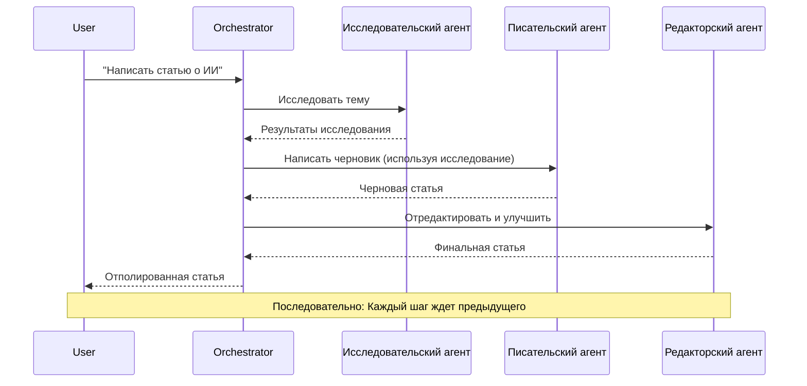
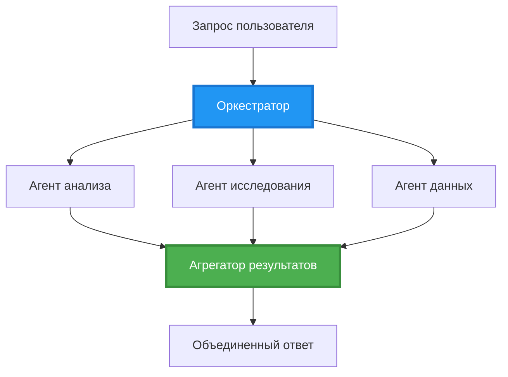
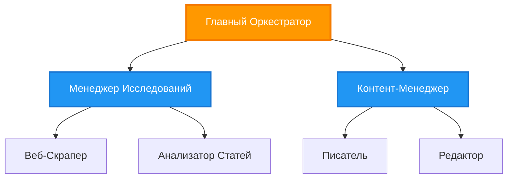
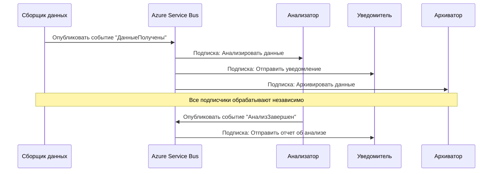
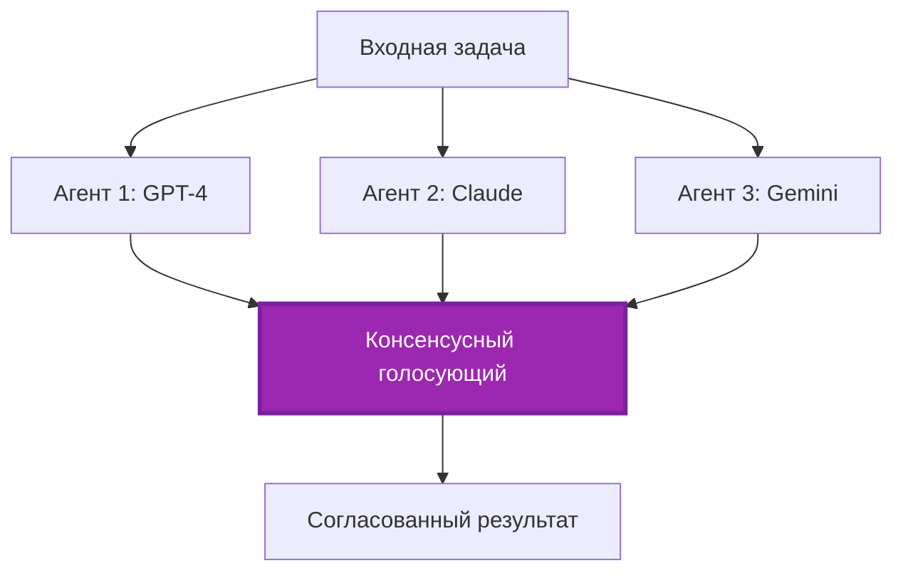
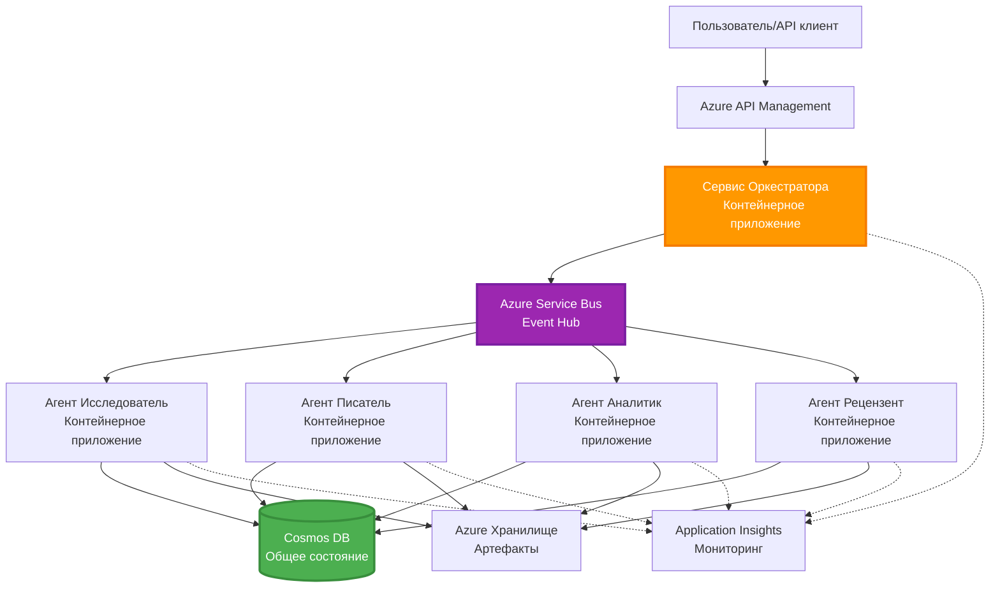

# Шаблоны координации мультиагентных систем

⏱️ **Оценочное время**: 60-75 минут | 💰 **Оценочная стоимость**: ~$100-300/месяц | ⭐ **Сложность**: Продвинутая

**📚 Учебный путь:**
- ← Предыдущий: [Планирование ресурсов](capacity-planning.md) - Стратегии масштабирования и определения размеров ресурсов
- 🎯 **Вы здесь**: Шаблоны координации мультиагентных систем (Оркестрация, коммуникация, управление состоянием)
- → Следующий: [Выбор SKU](sku-selection.md) - Выбор подходящих сервисов Azure
- 🏠 [Главная курса](../../README.md)

---

## Чему вы научитесь

Пройдя этот урок, вы:
- Поймете шаблоны **архитектуры мультиагентных систем** и их применение
- Реализуете **шаблоны оркестрации** (централизованная, децентрализованная, иерархическая)
- Разработаете стратегии **коммуникации агентов** (синхронная, асинхронная, событийно-ориентированная)
- Управите **общим состоянием** между распределенными агентами
- Развернете **мультиагентные системы** в Azure с помощью AZD
- Примените **шаблоны координации** для реальных сценариев ИИ
- Будете мониторить и отлаживать распределенные системы агентов

## Почему координация мультиагентных систем важна

### Эволюция: от одного агента к мультиагентной системе

**Один агент (Простой):**
```
User → Agent → Response
```
- ✅ Легко понять и реализовать
- ✅ Быстро для простых задач
- ❌ Ограничен возможностями одной модели
- ❌ Невозможно параллелизовать сложные задачи
- ❌ Нет специализации

**Мультиагентная система (Продвинутая):**
```
           ┌─────────────┐
           │ Orchestrator│
           └──────┬──────┘
        ┌─────────┼─────────┐
        │         │         │
    ┌───▼──┐  ┌──▼───┐  ┌──▼────┐
    │Agent1│  │Agent2│  │Agent3 │
    │(Plan)│  │(Code)│  │(Review)│
    └──────┘  └──────┘  └───────┘
```
- ✅ Специализированные агенты для конкретных задач
- ✅ Параллельное выполнение для скорости
- ✅ Модульность и удобство поддержки
- ✅ Лучше справляется со сложными рабочими процессами
- ⚠️ Требует логики координации

**Аналогия**: Один агент — как один человек, выполняющий все задачи. Мультиагентная система — как команда, где каждый участник обладает специализированными навыками (исследователь, программист, редактор, писатель), работающая вместе.

---

## Основные шаблоны координации

### Шаблон 1: Последовательная координация (Цепочка ответственности)

**Когда использовать**: Задачи должны выполняться в определенном порядке, каждый агент использует результат предыдущего.


**Преимущества:**
- ✅ Понятный поток данных
- ✅ Легко отлаживать
- ✅ Предсказуемый порядок выполнения

**Ограничения:**
- ❌ Медленнее (нет параллелизма)
- ❌ Одна ошибка блокирует всю цепочку
- ❌ Невозможно обработать взаимозависимые задачи

**Примеры использования:**
- Конвейер создания контента (исследование → написание → редактирование → публикация)
- Генерация кода (планирование → реализация → тестирование → развертывание)
- Генерация отчетов (сбор данных → анализ → визуализация → резюме)

---

### Шаблон 2: Параллельная координация (Fan-Out/Fan-In)

**Когда использовать**: Независимые задачи могут выполняться одновременно, результаты объединяются в конце.


**Преимущества:**
- ✅ Быстро (параллельное выполнение)
- ✅ Устойчивость к сбоям (частичные результаты допустимы)
- ✅ Горизонтальное масштабирование

**Ограничения:**
- ⚠️ Результаты могут приходить в произвольном порядке
- ⚠️ Требуется логика агрегации
- ⚠️ Сложное управление состоянием

**Примеры использования:**
- Сбор данных из нескольких источников (API + базы данных + веб-скрейпинг)
- Конкурентный анализ (несколько моделей генерируют решения, выбирается лучшее)
- Услуги перевода (перевод на несколько языков одновременно)

---

### Шаблон 3: Иерархическая координация (Менеджер-Рабочий)

**Когда использовать**: Сложные рабочие процессы с подзадачами, требуется делегирование.


**Преимущества:**
- ✅ Обрабатывает сложные рабочие процессы
- ✅ Модульность и удобство поддержки
- ✅ Четкие границы ответственности

**Ограничения:**
- ⚠️ Более сложная архитектура
- ⚠️ Более высокая задержка (несколько уровней координации)
- ⚠️ Требуется сложная оркестрация

**Примеры использования:**
- Обработка документов в компании (классификация → маршрутизация → обработка → архивирование)
- Многоэтапные конвейеры данных (сбор → очистка → преобразование → анализ → отчет)
- Сложные автоматизированные рабочие процессы (планирование → распределение ресурсов → выполнение → мониторинг)

---

### Шаблон 4: Событийно-ориентированная координация (Publish-Subscribe)

**Когда использовать**: Агенты должны реагировать на события, требуется слабая связанность.


**Преимущества:**
- ✅ Слабая связанность между агентами
- ✅ Легко добавлять новых агентов (просто подписаться)
- ✅ Асинхронная обработка
- ✅ Устойчивость (сохранение сообщений)

**Ограничения:**
- ⚠️ Итоговая согласованность
- ⚠️ Сложная отладка
- ⚠️ Проблемы с порядком сообщений

**Примеры использования:**
- Системы мониторинга в реальном времени (оповещения, панели управления, логи)
- Многоканальные уведомления (email, SMS, push, Slack)
- Конвейеры обработки данных (несколько потребителей одного и того же набора данных)

---

### Шаблон 5: Координация на основе консенсуса (Голосование/Кворум)

**Когда использовать**: Требуется согласие нескольких агентов перед продолжением.


**Преимущества:**
- ✅ Высокая точность (множество мнений)
- ✅ Устойчивость к сбоям (сбои меньшинства допустимы)
- ✅ Встроенный контроль качества

**Ограничения:**
- ❌ Дорого (множество вызовов моделей)
- ❌ Медленно (ожидание всех агентов)
- ⚠️ Требуется разрешение конфликтов

**Примеры использования:**
- Модерация контента (несколько моделей проверяют контент)
- Рецензирование кода (несколько линтеров/анализаторов)
- Медицинская диагностика (несколько моделей ИИ, проверка экспертов)

---

## Обзор архитектуры

### Полная мультиагентная система в Azure


**Основные компоненты:**

| Компонент | Назначение | Сервис Azure |
|-----------|------------|--------------|
| **API Gateway** | Точка входа, ограничение скорости, авторизация | API Management |
| **Оркестратор** | Координирует рабочие процессы агентов | Container Apps |
| **Очередь сообщений** | Асинхронная коммуникация | Service Bus / Event Hubs |
| **Агенты** | Специализированные ИИ-работники | Container Apps / Functions |
| **Хранилище состояния** | Общее состояние, отслеживание задач | Cosmos DB |
| **Хранилище артефактов** | Документы, результаты, логи | Blob Storage |
| **Мониторинг** | Распределенная трассировка, логи | Application Insights |

---

## Предварительные требования

### Необходимые инструменты

```bash
# Проверить Azure Developer CLI
azd version
# ✅ Ожидается: azd версии 1.0.0 или выше

# Проверить Azure CLI
az --version
# ✅ Ожидается: azure-cli версии 2.50.0 или выше

# Проверить Docker (для локального тестирования)
docker --version
# ✅ Ожидается: Docker версии 20.10 или выше
```

### Требования к Azure

- Активная подписка Azure
- Разрешения на создание:
  - Container Apps
  - Пространств имен Service Bus
  - Учетных записей Cosmos DB
  - Учетных записей хранилища
  - Application Insights

### Требования к знаниям

Вы должны завершить:
- [Управление конфигурацией](../getting-started/configuration.md)
- [Аутентификация и безопасность](../getting-started/authsecurity.md)
- [Пример микросервисов](../../../../examples/microservices)

---

## Руководство по реализации

### Структура проекта

```
multi-agent-system/
├── azure.yaml                    # AZD configuration
├── infra/
│   ├── main.bicep               # Main infrastructure
│   ├── core/
│   │   ├── servicebus.bicep     # Message queue
│   │   ├── cosmos.bicep         # State store
│   │   ├── storage.bicep        # Artifact storage
│   │   └── monitoring.bicep     # Application Insights
│   └── app/
│       ├── orchestrator.bicep   # Orchestrator service
│       └── agent.bicep          # Agent template
└── src/
    ├── orchestrator/            # Orchestration logic
    │   ├── app.py
    │   ├── workflows.py
    │   └── Dockerfile
    ├── agents/
    │   ├── research/            # Research agent
    │   ├── writer/              # Writer agent
    │   ├── analyst/             # Analyst agent
    │   └── reviewer/            # Reviewer agent
    └── shared/
        ├── state_manager.py     # Shared state logic
        └── message_handler.py   # Message handling
```

---

## Урок 1: Шаблон последовательной координации

### Реализация: Конвейер создания контента

Давайте создадим последовательный конвейер: Исследование → Написание → Редактирование → Публикация

### 1. Конфигурация AZD

**Файл: `azure.yaml`**

```yaml
name: content-pipeline
metadata:
  template: multi-agent-sequential@1.0.0

services:
  orchestrator:
    project: ./src/orchestrator
    language: python
    host: containerapp
  
  research-agent:
    project: ./src/agents/research
    language: python
    host: containerapp
  
  writer-agent:
    project: ./src/agents/writer
    language: python
    host: containerapp
  
  editor-agent:
    project: ./src/agents/editor
    language: python
    host: containerapp
```

### 2. Инфраструктура: Service Bus для координации

**Файл: `infra/core/servicebus.bicep`**

```bicep
param name string
param location string
param tags object = {}

resource serviceBusNamespace 'Microsoft.ServiceBus/namespaces@2022-10-01-preview' = {
  name: name
  location: location
  tags: tags
  sku: {
    name: 'Standard'
    tier: 'Standard'
  }
  properties: {
    minimumTlsVersion: '1.2'
  }
}

// Queue for orchestrator → research agent
resource researchQueue 'Microsoft.ServiceBus/namespaces/queues@2022-10-01-preview' = {
  parent: serviceBusNamespace
  name: 'research-tasks'
  properties: {
    maxDeliveryCount: 3
    lockDuration: 'PT5M'
    deadLetteringOnMessageExpiration: true
  }
}

// Queue for research agent → writer agent
resource writerQueue 'Microsoft.ServiceBus/namespaces/queues@2022-10-01-preview' = {
  parent: serviceBusNamespace
  name: 'writer-tasks'
  properties: {
    maxDeliveryCount: 3
    lockDuration: 'PT5M'
  }
}

// Queue for writer agent → editor agent
resource editorQueue 'Microsoft.ServiceBus/namespaces/queues@2022-10-01-preview' = {
  parent: serviceBusNamespace
  name: 'editor-tasks'
  properties: {
    maxDeliveryCount: 3
    lockDuration: 'PT5M'
  }
}

output namespace string = serviceBusNamespace.name
output connectionString string = listKeys('${serviceBusNamespace.id}/AuthorizationRules/RootManageSharedAccessKey', serviceBusNamespace.apiVersion).primaryConnectionString
```

### 3. Менеджер общего состояния

**Файл: `src/shared/state_manager.py`**

```python
from azure.cosmos import CosmosClient, PartitionKey
from datetime import datetime
import os

class StateManager:
    """Manages shared state across agents using Cosmos DB"""
    
    def __init__(self):
        endpoint = os.environ['COSMOS_ENDPOINT']
        key = os.environ['COSMOS_KEY']
        
        self.client = CosmosClient(endpoint, key)
        self.database = self.client.get_database_client('agent-state')
        self.container = self.database.get_container_client('tasks')
    
    def create_task(self, task_id: str, task_type: str, input_data: dict):
        """Create a new task"""
        task = {
            'id': task_id,
            'type': task_type,
            'status': 'pending',
            'input': input_data,
            'created_at': datetime.utcnow().isoformat(),
            'steps': []
        }
        self.container.create_item(task)
        return task
    
    def update_task_step(self, task_id: str, step_name: str, result: dict):
        """Update task with completed step"""
        task = self.container.read_item(task_id, partition_key=task_id)
        
        task['steps'].append({
            'name': step_name,
            'completed_at': datetime.utcnow().isoformat(),
            'result': result
        })
        
        self.container.replace_item(task_id, task)
        return task
    
    def complete_task(self, task_id: str, final_result: dict):
        """Mark task as complete"""
        task = self.container.read_item(task_id, partition_key=task_id)
        task['status'] = 'completed'
        task['result'] = final_result
        task['completed_at'] = datetime.utcnow().isoformat()
        self.container.replace_item(task_id, task)
        return task
    
    def get_task(self, task_id: str):
        """Retrieve task state"""
        return self.container.read_item(task_id, partition_key=task_id)
```

### 4. Сервис оркестратора

**Файл: `src/orchestrator/app.py`**

```python
from flask import Flask, request, jsonify
from azure.servicebus import ServiceBusClient, ServiceBusMessage
import json
import uuid
import os
from shared.state_manager import StateManager

app = Flask(__name__)
state_manager = StateManager()

# Подключение к Service Bus
servicebus_connection_str = os.environ['SERVICEBUS_CONNECTION_STRING']
servicebus_client = ServiceBusClient.from_connection_string(servicebus_connection_str)

@app.route('/health', methods=['GET'])
def health():
    return jsonify({'status': 'healthy', 'service': 'orchestrator'})

@app.route('/create-content', methods=['POST'])
def create_content():
    """
    Sequential workflow: Research → Write → Edit → Publish
    """
    data = request.json
    topic = data.get('topic')
    
    if not topic:
        return jsonify({'error': 'Topic required'}), 400
    
    # Создать задачу в хранилище состояний
    task_id = str(uuid.uuid4())
    task = state_manager.create_task(
        task_id=task_id,
        task_type='content_creation',
        input_data={'topic': topic}
    )
    
    # Отправить сообщение исследовательскому агенту (первый шаг)
    sender = servicebus_client.get_queue_sender('research-tasks')
    message = ServiceBusMessage(
        body=json.dumps({
            'task_id': task_id,
            'topic': topic,
            'next_queue': 'writer-tasks'  # Куда отправить результаты
        }),
        content_type='application/json'
    )
    
    with sender:
        sender.send_messages(message)
    
    return jsonify({
        'task_id': task_id,
        'status': 'started',
        'workflow': 'sequential',
        'steps': ['research', 'write', 'edit', 'publish'],
        'message': 'Content creation pipeline initiated'
    }), 202

@app.route('/task/<task_id>', methods=['GET'])
def get_task_status(task_id):
    """Check task status"""
    try:
        task = state_manager.get_task(task_id)
        return jsonify(task)
    except Exception as e:
        return jsonify({'error': str(e)}), 404

if __name__ == '__main__':
    app.run(host='0.0.0.0', port=8080)
```

### 5. Агент исследования

**Файл: `src/agents/research/app.py`**

```python
from azure.servicebus import ServiceBusClient, ServiceBusMessage
from openai import AzureOpenAI
import json
import os
import time
from shared.state_manager import StateManager

# Инициализировать клиентов
state_manager = StateManager()
servicebus_client = ServiceBusClient.from_connection_string(
    os.environ['SERVICEBUS_CONNECTION_STRING']
)

openai_client = AzureOpenAI(
    api_key=os.environ['AZURE_OPENAI_API_KEY'],
    api_version="2024-02-01",
    azure_endpoint=os.environ['AZURE_OPENAI_ENDPOINT']
)

def process_research_task(message_data):
    """Process research request and pass to writer"""
    task_id = message_data['task_id']
    topic = message_data['topic']
    next_queue = message_data['next_queue']
    
    print(f"🔬 Researching: {topic}")
    
    # Вызвать Azure OpenAI для исследования
    response = openai_client.chat.completions.create(
        model="gpt-4",
        messages=[
            {"role": "system", "content": "You are a research assistant. Provide comprehensive research on the given topic."},
            {"role": "user", "content": f"Research this topic thoroughly: {topic}"}
        ],
        max_tokens=1500
    )
    
    research_results = response.choices[0].message.content
    
    # Обновить состояние
    state_manager.update_task_step(
        task_id=task_id,
        step_name='research',
        result={'research': research_results}
    )
    
    # Отправить следующему агенту (писателю)
    sender = servicebus_client.get_queue_sender(next_queue)
    message = ServiceBusMessage(
        body=json.dumps({
            'task_id': task_id,
            'topic': topic,
            'research': research_results,
            'next_queue': 'editor-tasks'
        }),
        content_type='application/json'
    )
    
    with sender:
        sender.send_messages(message)
    
    print(f"✅ Research complete for task {task_id}")

def main():
    """Listen to research queue"""
    receiver = servicebus_client.get_queue_receiver('research-tasks')
    
    print("🔬 Research Agent started, listening for tasks...")
    
    with receiver:
        while True:
            messages = receiver.receive_messages(max_wait_time=5)
            for message in messages:
                try:
                    message_data = json.loads(str(message))
                    process_research_task(message_data)
                    receiver.complete_message(message)
                except Exception as e:
                    print(f"❌ Error processing message: {e}")
                    receiver.abandon_message(message)

if __name__ == '__main__':
    main()
```

### 6. Агент писателя

**Файл: `src/agents/writer/app.py`**

```python
from azure.servicebus import ServiceBusClient, ServiceBusMessage
from openai import AzureOpenAI
import json
import os
from shared.state_manager import StateManager

state_manager = StateManager()
servicebus_client = ServiceBusClient.from_connection_string(
    os.environ['SERVICEBUS_CONNECTION_STRING']
)

openai_client = AzureOpenAI(
    api_key=os.environ['AZURE_OPENAI_API_KEY'],
    api_version="2024-02-01",
    azure_endpoint=os.environ['AZURE_OPENAI_ENDPOINT']
)

def process_writing_task(message_data):
    """Write article based on research"""
    task_id = message_data['task_id']
    topic = message_data['topic']
    research = message_data['research']
    next_queue = message_data['next_queue']
    
    print(f"✍️ Writing article: {topic}")
    
    # Вызвать Azure OpenAI для написания статьи
    response = openai_client.chat.completions.create(
        model="gpt-4",
        messages=[
            {"role": "system", "content": "You are a professional writer. Write engaging, well-structured articles."},
            {"role": "user", "content": f"Based on this research:\n\n{research}\n\nWrite a comprehensive article about: {topic}"}
        ],
        max_tokens=2000
    )
    
    article_draft = response.choices[0].message.content
    
    # Обновить состояние
    state_manager.update_task_step(
        task_id=task_id,
        step_name='writing',
        result={'draft': article_draft}
    )
    
    # Отправить редактору
    sender = servicebus_client.get_queue_sender(next_queue)
    message = ServiceBusMessage(
        body=json.dumps({
            'task_id': task_id,
            'topic': topic,
            'draft': article_draft
        }),
        content_type='application/json'
    )
    
    with sender:
        sender.send_messages(message)
    
    print(f"✅ Article draft complete for task {task_id}")

def main():
    """Listen to writer queue"""
    receiver = servicebus_client.get_queue_receiver('writer-tasks')
    
    print("✍️ Writer Agent started, listening for tasks...")
    
    with receiver:
        while True:
            messages = receiver.receive_messages(max_wait_time=5)
            for message in messages:
                try:
                    message_data = json.loads(str(message))
                    process_writing_task(message_data)
                    receiver.complete_message(message)
                except Exception as e:
                    print(f"❌ Error: {e}")
                    receiver.abandon_message(message)

if __name__ == '__main__':
    main()
```

### 7. Агент редактора

**Файл: `src/agents/editor/app.py`**

```python
from azure.servicebus import ServiceBusClient
from openai import AzureOpenAI
import json
import os
from shared.state_manager import StateManager

state_manager = StateManager()
servicebus_client = ServiceBusClient.from_connection_string(
    os.environ['SERVICEBUS_CONNECTION_STRING']
)

openai_client = AzureOpenAI(
    api_key=os.environ['AZURE_OPENAI_API_KEY'],
    api_version="2024-02-01",
    azure_endpoint=os.environ['AZURE_OPENAI_ENDPOINT']
)

def process_editing_task(message_data):
    """Edit and finalize article"""
    task_id = message_data['task_id']
    topic = message_data['topic']
    draft = message_data['draft']
    
    print(f"📝 Editing article: {topic}")
    
    # Вызвать Azure OpenAI для редактирования
    response = openai_client.chat.completions.create(
        model="gpt-4",
        messages=[
            {"role": "system", "content": "You are an expert editor. Improve grammar, clarity, and structure."},
            {"role": "user", "content": f"Edit and improve this article:\n\n{draft}"}
        ],
        max_tokens=2000
    )
    
    final_article = response.choices[0].message.content
    
    # Отметить задачу как выполненную
    state_manager.complete_task(
        task_id=task_id,
        final_result={
            'topic': topic,
            'final_article': final_article,
            'word_count': len(final_article.split())
        }
    )
    
    print(f"✅ Article finalized for task {task_id}")

def main():
    """Listen to editor queue"""
    receiver = servicebus_client.get_queue_receiver('editor-tasks')
    
    print("📝 Editor Agent started, listening for tasks...")
    
    with receiver:
        while True:
            messages = receiver.receive_messages(max_wait_time=5)
            for message in messages:
                try:
                    message_data = json.loads(str(message))
                    process_editing_task(message_data)
                    receiver.complete_message(message)
                except Exception as e:
                    print(f"❌ Error: {e}")
                    receiver.abandon_message(message)

if __name__ == '__main__':
    main()
```

### 8. Развертывание и тестирование

```bash
# Инициализировать и развернуть
azd init
azd up

# Получить URL оркестратора
ORCHESTRATOR_URL=$(azd env get-values | grep ORCHESTRATOR_URL | cut -d '=' -f2 | tr -d '"')

# Создать контент
curl -X POST $ORCHESTRATOR_URL/create-content \
  -H "Content-Type: application/json" \
  -d '{"topic": "The Future of AI in Healthcare"}'
```

**✅ Ожидаемый результат:**
```json
{
  "task_id": "a1b2c3d4-e5f6-7890-abcd-ef1234567890",
  "status": "started",
  "workflow": "sequential",
  "steps": ["research", "write", "edit", "publish"],
  "message": "Content creation pipeline initiated"
}
```

**Проверка прогресса задачи:**
```bash
TASK_ID="a1b2c3d4-e5f6-7890-abcd-ef1234567890"
curl $ORCHESTRATOR_URL/task/$TASK_ID
```

**✅ Ожидаемый результат (завершено):**
```json
{
  "id": "a1b2c3d4-e5f6-7890-abcd-ef1234567890",
  "type": "content_creation",
  "status": "completed",
  "steps": [
    {
      "name": "research",
      "completed_at": "2025-11-19T10:30:00Z",
      "result": {"research": "..."}
    },
    {
      "name": "writing",
      "completed_at": "2025-11-19T10:32:00Z",
      "result": {"draft": "..."}
    }
  ],
  "result": {
    "topic": "The Future of AI in Healthcare",
    "final_article": "...",
    "word_count": 1500
  }
}
```

---

## Урок 2: Шаблон параллельной координации

### Реализация: Многоресурсный агрегатор исследований

Давайте создадим параллельную систему, которая собирает информацию из нескольких источников одновременно.

### Параллельный оркестратор

**Файл: `src/orchestrator/parallel_workflow.py`**

```python
from flask import Flask, request, jsonify
from azure.servicebus import ServiceBusClient, ServiceBusMessage
import json
import uuid
import os
from shared.state_manager import StateManager

app = Flask(__name__)
state_manager = StateManager()

servicebus_client = ServiceBusClient.from_connection_string(
    os.environ['SERVICEBUS_CONNECTION_STRING']
)

@app.route('/research-parallel', methods=['POST'])
def research_parallel():
    """
    Parallel workflow: Multiple agents work simultaneously
    """
    data = request.json
    query = data.get('query')
    
    task_id = str(uuid.uuid4())
    task = state_manager.create_task(
        task_id=task_id,
        task_type='parallel_research',
        input_data={
            'query': query,
            'agents': ['web', 'academic', 'news', 'social']
        }
    )
    
    # Распределение: Отправить всем агентам одновременно
    agents = [
        ('web-research-queue', 'web'),
        ('academic-research-queue', 'academic'),
        ('news-research-queue', 'news'),
        ('social-research-queue', 'social')
    ]
    
    for queue_name, agent_type in agents:
        sender = servicebus_client.get_queue_sender(queue_name)
        message = ServiceBusMessage(
            body=json.dumps({
                'task_id': task_id,
                'query': query,
                'agent_type': agent_type,
                'result_queue': 'aggregation-queue'
            }),
            content_type='application/json'
        )
        
        with sender:
            sender.send_messages(message)
    
    return jsonify({
        'task_id': task_id,
        'status': 'started',
        'workflow': 'parallel',
        'agents_dispatched': 4,
        'message': 'Parallel research initiated'
    }), 202

if __name__ == '__main__':
    app.run(host='0.0.0.0', port=8080)
```

### Логика агрегации

**Файл: `src/agents/aggregator/app.py`**

```python
from azure.servicebus import ServiceBusClient
import json
import os
from collections import defaultdict
from shared.state_manager import StateManager

state_manager = StateManager()
servicebus_client = ServiceBusClient.from_connection_string(
    os.environ['SERVICEBUS_CONNECTION_STRING']
)

# Отслеживать результаты по задаче
task_results = defaultdict(list)
expected_agents = 4  # веб, академический, новости, социальные

def process_result(message_data):
    """Aggregate results from parallel agents"""
    task_id = message_data['task_id']
    agent_type = message_data['agent_type']
    result = message_data['result']
    
    # Сохранить результат
    task_results[task_id].append({
        'agent': agent_type,
        'data': result
    })
    
    print(f"📊 Received result from {agent_type} agent ({len(task_results[task_id])}/{expected_agents})")
    
    # Проверить, завершили ли все агенты (fan-in)
    if len(task_results[task_id]) == expected_agents:
        print(f"✅ All agents completed for task {task_id}. Aggregating...")
        
        # Объединить результаты
        aggregated = {
            'query': message_data['query'],
            'sources': task_results[task_id],
            'summary': generate_summary(task_results[task_id])
        }
        
        # Отметить как завершено
        state_manager.complete_task(task_id, aggregated)
        
        # Очистить
        del task_results[task_id]
        
        print(f"✅ Aggregation complete for task {task_id}")

def generate_summary(results):
    """Generate summary from all sources"""
    summaries = [r['data'].get('summary', '') for r in results]
    return '\n\n'.join(summaries)

def main():
    """Listen to aggregation queue"""
    receiver = servicebus_client.get_queue_receiver('aggregation-queue')
    
    print("📊 Aggregator started, listening for results...")
    
    with receiver:
        while True:
            messages = receiver.receive_messages(max_wait_time=5)
            for message in messages:
                try:
                    message_data = json.loads(str(message))
                    process_result(message_data)
                    receiver.complete_message(message)
                except Exception as e:
                    print(f"❌ Error: {e}")
                    receiver.abandon_message(message)

if __name__ == '__main__':
    main()
```

**Преимущества параллельного шаблона:**
- ⚡ **В 4 раза быстрее** (агенты работают одновременно)
- 🔄 **Устойчивость к сбоям** (частичные результаты допустимы)
- 📈 **Масштабируемость** (легко добавить больше агентов)

---

## Практические упражнения

### Упражнение 1: Добавление обработки тайм-аутов ⭐⭐ (Средний уровень)

**Цель**: Реализовать логику тайм-аута, чтобы агрегатор не ждал слишком долго медленных агентов.

**Шаги**:

1. **Добавьте отслеживание тайм-аута в агрегатор:**

```python
from datetime import datetime, timedelta

task_timeouts = {}  # task_id -> время истечения

def process_result(message_data):
    task_id = message_data['task_id']
    
    # Установить тайм-аут на первый результат
    if task_id not in task_timeouts:
        task_timeouts[task_id] = datetime.utcnow() + timedelta(seconds=30)
    
    task_results[task_id].append({
        'agent': message_data['agent_type'],
        'data': message_data['result']
    })
    
    # Проверить, завершено ИЛИ истекло время
    if len(task_results[task_id]) == expected_agents or \
       datetime.utcnow() > task_timeouts[task_id]:
        
        print(f"📊 Aggregating with {len(task_results[task_id])}/{expected_agents} results")
        
        aggregated = {
            'query': message_data['query'],
            'sources': task_results[task_id],
            'completed_agents': len(task_results[task_id]),
            'timed_out': len(task_results[task_id]) < expected_agents
        }
        
        state_manager.complete_task(task_id, aggregated)
        
        # Очистка
        del task_results[task_id]
        del task_timeouts[task_id]
```

2. **Протестируйте с искусственными задержками:**

```python
# В одном агенте добавьте задержку для имитации медленной обработки
import time
time.sleep(35)  # Превышает тайм-аут в 30 секунд
```

3. **Разверните и проверьте:**

```bash
azd deploy aggregator

# Отправить задачу
curl -X POST $ORCHESTRATOR_URL/research-parallel \
  -H "Content-Type: application/json" \
  -d '{"query": "AI safety research"}'

# Проверить результаты через 30 секунд
curl $ORCHESTRATOR_URL/task/$TASK_ID
```

**✅ Критерии успеха:**
- ✅ Задача завершается через 30 секунд, даже если агенты не завершили работу
- ✅ Ответ указывает на частичные результаты (`"timed_out": true`)
- ✅ Возвращаются доступные результаты (3 из 4 агентов)

**Время**: 20-25 минут

---

### Упражнение 2: Реализация логики повторных попыток ⭐⭐⭐ (Продвинутый уровень)

**Цель**: Автоматически повторять задачи агентов, которые завершились с ошибкой, перед окончательной остановкой.

**Шаги**:

1. **Добавьте отслеживание повторных попыток в оркестратор:**

```python
from dataclasses import dataclass
from typing import Dict

@dataclass
class RetryConfig:
    max_retries: int = 3
    backoff_seconds: int = 5

retry_counts: Dict[str, int] = {}  # message_id -> количество_попыток

def send_with_retry(queue_name: str, message_data: dict, retry_config: RetryConfig):
    """Send message with retry metadata"""
    message_id = message_data.get('message_id', str(uuid.uuid4()))
    message_data['message_id'] = message_id
    message_data['retry_count'] = retry_counts.get(message_id, 0)
    message_data['max_retries'] = retry_config.max_retries
    
    sender = servicebus_client.get_queue_sender(queue_name)
    message = ServiceBusMessage(
        body=json.dumps(message_data),
        content_type='application/json',
        message_id=message_id
    )
    
    with sender:
        sender.send_messages(message)
```

2. **Добавьте обработчик повторных попыток в агентов:**

```python
def process_with_retry(message, receiver, process_func):
    """Process message with automatic retry on failure"""
    try:
        message_data = json.loads(str(message))
        
        # Обработать сообщение
        process_func(message_data)
        
        # Успех - завершено
        receiver.complete_message(message)
        
    except Exception as e:
        message_id = message.message_id
        retry_count = message_data.get('retry_count', 0)
        max_retries = message_data.get('max_retries', 3)
        
        if retry_count < max_retries:
            # Повтор: отказаться и повторно поставить в очередь с увеличенным счетчиком
            print(f"⚠️ Retry {retry_count + 1}/{max_retries} for message {message_id}")
            
            message_data['retry_count'] = retry_count + 1
            
            # Отправить обратно в ту же очередь с задержкой
            time.sleep(5 * (retry_count + 1))  # Экспоненциальное увеличение интервала
            send_with_retry(queue_name, message_data, RetryConfig())
            
            receiver.complete_message(message)  # Удалить оригинал
        else:
            # Превышено максимальное количество попыток - переместить в очередь недоставленных сообщений
            print(f"❌ Max retries exceeded for message {message_id}")
            receiver.dead_letter_message(
                message,
                reason="MaxRetriesExceeded",
                error_description=str(e)
            )
```

3. **Мониторинг очереди сбойных сообщений:**

```python
def monitor_dead_letters():
    """Check dead letter queue for failed messages"""
    receiver = servicebus_client.get_queue_receiver(
        'research-queue',
        sub_queue='deadletter'
    )
    
    with receiver:
        messages = receiver.receive_messages(max_wait_time=5)
        for message in messages:
            print(f"☠️ Dead letter: {message.message_id}")
            print(f"Reason: {message.dead_letter_reason}")
            print(f"Description: {message.dead_letter_error_description}")
```

**✅ Критерии успеха:**
- ✅ Ошибочные задачи автоматически повторяются (до 3 раз)
- ✅ Экспоненциальное увеличение времени между попытками (5с, 10с, 15с)
- ✅ После максимального количества попыток сообщения попадают в очередь сбойных сообщений
- ✅ Очередь сбойных сообщений можно мониторить и воспроизводить

**Время**: 30-40 минут

---

### Упражнение 3: Реализация механизма "аварийного выключателя" ⭐⭐⭐ (Продвинутый уровень)

**Цель**: Предотвратить каскадные сбои, остановив запросы к агентам, которые не работают.

**Шаги**:

1. **Создайте класс аварийного выключателя:**

```python
from enum import Enum
from datetime import datetime, timedelta

class CircuitState(Enum):
    CLOSED = "closed"      # Нормальная работа
    OPEN = "open"          # Ошибка, отклонить запросы
    HALF_OPEN = "half_open"  # Проверка восстановления

class CircuitBreaker:
    def __init__(self, failure_threshold=5, timeout_seconds=60):
        self.failure_threshold = failure_threshold
        self.timeout_seconds = timeout_seconds
        self.failure_count = 0
        self.last_failure_time = None
        self.state = CircuitState.CLOSED
    
    def call(self, func):
        """Execute function with circuit breaker protection"""
        if self.state == CircuitState.OPEN:
            # Проверить, истек ли таймаут
            if datetime.utcnow() - self.last_failure_time > timedelta(seconds=self.timeout_seconds):
                self.state = CircuitState.HALF_OPEN
                print("🔄 Circuit breaker: HALF_OPEN (testing)")
            else:
                raise Exception(f"Circuit breaker OPEN for agent. Try again in {self.timeout_seconds}s")
        
        try:
            result = func()
            
            # Успех
            if self.state == CircuitState.HALF_OPEN:
                self.state = CircuitState.CLOSED
                self.failure_count = 0
                print("✅ Circuit breaker: CLOSED (recovered)")
            
            return result
            
        except Exception as e:
            self.failure_count += 1
            self.last_failure_time = datetime.utcnow()
            
            if self.failure_count >= self.failure_threshold:
                self.state = CircuitState.OPEN
                print(f"🔴 Circuit breaker: OPEN (too many failures)")
            
            raise e
```

2. **Примените к вызовам агентов:**

```python
# В оркестраторе
agent_circuits = {
    'web': CircuitBreaker(failure_threshold=5, timeout_seconds=60),
    'academic': CircuitBreaker(failure_threshold=5, timeout_seconds=60),
    'news': CircuitBreaker(failure_threshold=5, timeout_seconds=60),
    'social': CircuitBreaker(failure_threshold=5, timeout_seconds=60)
}

def send_to_agent(agent_type, message_data):
    """Send with circuit breaker protection"""
    circuit = agent_circuits[agent_type]
    
    try:
        circuit.call(lambda: send_message(agent_type, message_data))
    except Exception as e:
        print(f"⚠️ Skipping {agent_type} agent: {e}")
        # Продолжить с другими агентами
```

3. **Протестируйте механизм:**

```bash
# Смоделировать повторяющиеся сбои (остановить одного агента)
az containerapp stop --name web-research-agent --resource-group rg-agents

# Отправить несколько запросов
for i in {1..10}; do
  curl -X POST $ORCHESTRATOR_URL/research-parallel \
    -H "Content-Type: application/json" \
    -d '{"query": "test query '$i'"}'
  sleep 2
done

# Проверить журналы - должно быть видно, что цепь открыта после 5 сбоев
azd logs orchestrator --tail 50
```

**✅ Критерии успеха:**
- ✅ После 5 ошибок выключатель открывается (отклоняет запросы)
- ✅ Через 60 секунд выключатель переходит в полуустановленное состояние (тестирует восстановление)
- ✅ Другие агенты продолжают работать нормально
- ✅ Выключатель автоматически закрывается, когда агент восстанавливается

**Время**: 40-50 минут

---

## Мониторинг и отладка

### Распределенная трассировка с Application Insights

**Файл: `src/shared/tracing.py`**

```python
from opencensus.ext.azure.log_exporter import AzureLogHandler
from opencensus.ext.azure.trace_exporter import AzureExporter
from opencensus.trace import config_integration
from opencensus.trace.tracer import Tracer
from opencensus.trace.samplers import AlwaysOnSampler
import logging
import os

# Настроить трассировку
config_integration.trace_integrations(['requests', 'logging'])

connection_string = os.environ.get('APPLICATIONINSIGHTS_CONNECTION_STRING')

# Создать трассировщик
tracer = Tracer(
    exporter=AzureExporter(connection_string=connection_string),
    sampler=AlwaysOnSampler()
)

# Настроить логирование
logger = logging.getLogger(__name__)
logger.addHandler(AzureLogHandler(connection_string=connection_string))
logger.setLevel(logging.INFO)

def trace_agent_call(agent_name, task_id, operation):
    """Trace agent operations"""
    with tracer.span(name=f'{agent_name}.{operation}') as span:
        span.add_attribute('agent', agent_name)
        span.add_attribute('task_id', task_id)
        span.add_attribute('operation', operation)
        
        try:
            result = operation()
            span.add_attribute('status', 'success')
            return result
        except Exception as e:
            span.add_attribute('status', 'error')
            span.add_attribute('error', str(e))
            raise
```

### Запросы Application Insights

**Отслеживание рабочих процессов мультиагентной системы:**

```kusto
// Trace complete workflow for a task
traces
| where customDimensions.task_id == "a1b2c3d4-..."
| project timestamp, message, customDimensions.agent, customDimensions.operation
| order by timestamp asc
```

**Сравнение производительности агентов:**

```kusto
// Compare agent execution times
dependencies
| where name contains "agent"
| summarize 
    avg_duration = avg(duration),
    p95_duration = percentile(duration, 95),
    count = count()
  by agent = tostring(customDimensions.agent)
| order by avg_duration desc
```

**Анализ сбоев:**

```kusto
// Find which agents fail most
exceptions
| where customDimensions.agent != ""
| summarize 
    failure_count = count(),
    unique_errors = dcount(outerMessage)
  by agent = tostring(customDimensions.agent)
| order by failure_count desc
```

---

## Анализ стоимости

### Затраты на мультиагентную систему (Оценка на месяц)

| Компонент | Конфигурация | Стоимость |
|-----------|--------------|-----------|
| **Оркестратор** | 1 Container App (1 vCPU, 2GB) | $30-50 |
| **4 Агента** | 4 Container Apps (0.5 vCPU, 1GB каждый) | $60-120 |
| **Service Bus** | Стандартный уровень, 10M сообщений | $10-20 |
| **Cosmos DB** | Серверless, 5GB хранилища, 1M RUs | $25-50 |
| **Blob Storage** | 10GB хранилища, 100K операций | $5-10 |
| **Application Insights** | 5GB данных | $10-15 |
| **Azure OpenAI** | GPT-4, 10M токенов | $100-300 |
| **Итого** | | **$240-565/месяц** |

### Стратегии оптимизации затрат

1. **Используйте серверless, где возможно:**
   ```bicep
   // Cosmos DB serverless (no minimum cost)
   properties: {
     databaseAccountOfferType: 'Standard'
     capabilities: [{ name: 'EnableServerless' }]
   }
   ```

2. **Масштабируйте агентов до нуля, когда они неактивны:**
   ```bicep
   scale: {
     minReplicas: 0  // Scale to zero when no messages
     maxReplicas: 10
   }
   ```

3. **Используйте пакетную обработку для Service Bus:**
   ```python
   # Отправляйте сообщения пакетами (дешевле)
   sender.send_messages([message1, message2, message3])
   ```

4. **Кэшируйте часто используемые результаты:**
   ```python
   # Используйте Azure Cache для Redis
   if cache.exists(query_hash):
       return cache.get(query_hash)
   ```

---

## Лучшие практики

### ✅ ДЕЛАЙТЕ:

1. **Используйте идемпотентные операции**
   ```python
   # Агент может безопасно обработать одно и то же сообщение несколько раз
   def process_task(task_id):
       if state_manager.task_exists(task_id):
           print(f"Task {task_id} already processed, skipping")
           return
       # Обработка задачи...
   ```

2. **Реализуйте подробное логирование**
   ```python
   logger.info(f"Agent: {agent_name}, Task: {task_id}, Action: {action}")
   ```

3. **Используйте идентификаторы корреляции**
   ```python
   # Передать task_id через весь рабочий процесс
   message_data = {
       'task_id': task_id,  # Идентификатор корреляции
       'timestamp': datetime.utcnow().isoformat()
   }
   ```

4. **Устанавливайте TTL (время жизни) сообщений**
   ```bicep
   properties: {
     defaultMessageTimeToLive: 'PT1H'  // 1 hour max
   }
   ```

5. **Мониторьте очереди сбойных сообщений**
   ```python
   # Регулярный мониторинг неудачных сообщений
   monitor_dead_letters()
   ```

### ❌ НЕ ДЕЛАЙТЕ:

1. **Не создавайте циклические зависимости**
   ```python
   # ❌ ПЛОХО: Агент A → Агент B → Агент A (бесконечный цикл)
   # ✅ ХОРОШО: Определите четкий направленный ациклический граф (DAG)
   ```

2. **Не блокируйте потоки агентов**
   ```python
   # ❌ ПЛОХО: Синхронное ожидание
   while not task_complete:
       time.sleep(1)
   
   # ✅ ХОРОШО: Используйте обратные вызовы очереди сообщений
   ```

3. **Не игнорируйте частичные сбои**
   ```python
   # ❌ ПЛОХО: Завалить весь рабочий процесс, если один агент терпит неудачу
   # ✅ ХОРОШО: Возвращать частичные результаты с индикаторами ошибок
   ```

4. **Не используйте бесконечные повторные попытки**
   ```python
   # ❌ ПЛОХО: повторять бесконечно
   # ✅ ХОРОШО: max_retries = 3, затем отправить в мертвую очередь
   ```

---
## Руководство по устранению неполадок

### Проблема: Сообщения застряли в очереди

**Симптомы:**
- Сообщения накапливаются в очереди
- Агенты не обрабатывают их
- Статус задачи остается "в ожидании"

**Диагностика:**
```bash
# Проверить глубину очереди
az servicebus queue show \
  --namespace-name mybus \
  --name research-tasks \
  --query "countDetails"

# Проверить состояние агента
azd logs research-agent --tail 50
```

**Решения:**

1. **Увеличьте количество реплик агентов:**
   ```bash
   az containerapp update \
     --name research-agent \
     --min-replicas 3 \
     --max-replicas 10
   ```

2. **Проверьте очередь мертвых писем:**
   ```bash
   az servicebus queue show \
     --namespace-name mybus \
     --name research-tasks \
     --query "countDetails.deadLetterMessageCount"
   ```

---

### Проблема: Тайм-аут задачи/задача не завершается

**Симптомы:**
- Статус задачи остается "в процессе"
- Некоторые агенты завершают работу, другие нет
- Ошибки отсутствуют

**Диагностика:**
```bash
# Проверить состояние задачи
curl $ORCHESTRATOR_URL/task/$TASK_ID

# Проверить Application Insights
# Выполнить запрос: traces | where customDimensions.task_id == "..."
```

**Решения:**

1. **Реализуйте тайм-аут в агрегаторе (Упражнение 1)**

2. **Проверьте сбои агентов:**
   ```bash
   azd logs --follow | grep "ERROR\|FAIL"
   ```

3. **Убедитесь, что все агенты работают:**
   ```bash
   az containerapp list \
     --resource-group rg-agents \
     --query "[].{name:name, status:properties.runningStatus}"
   ```

---

## Узнать больше

### Официальная документация
- [Azure Service Bus](https://learn.microsoft.com/azure/service-bus-messaging/service-bus-messaging-overview)
- [Cosmos DB](https://learn.microsoft.com/azure/cosmos-db/introduction)
- [Container Apps DAPR](https://learn.microsoft.com/azure/container-apps/dapr-overview)
- [Шаблоны проектирования для мультиагентных систем](https://learn.microsoft.com/azure/architecture/guide/ai/multi-agent-systems)

### Следующие шаги в этом курсе
- ← Предыдущий: [Планирование емкости](capacity-planning.md)
- → Следующий: [Выбор SKU](sku-selection.md)
- 🏠 [Главная страница курса](../../README.md)

### Связанные примеры
- [Пример микросервисов](../../../../examples/microservices) - Шаблоны взаимодействия сервисов
- [Пример Azure OpenAI](../../../../examples/azure-openai-chat) - Интеграция ИИ

---

## Резюме

**Вы узнали:**
- ✅ Пять шаблонов координации (последовательный, параллельный, иерархический, событийно-ориентированный, консенсус)
- ✅ Архитектуру мультиагентных систем на Azure (Service Bus, Cosmos DB, Container Apps)
- ✅ Управление состоянием в распределенных системах
- ✅ Обработка тайм-аутов, повторов и размыканий цепей
- ✅ Мониторинг и отладка распределенных систем
- ✅ Стратегии оптимизации затрат

**Основные выводы:**
1. **Выбирайте правильный шаблон** - Последовательный для упорядоченных процессов, параллельный для скорости, событийно-ориентированный для гибкости
2. **Тщательно управляйте состоянием** - Используйте Cosmos DB или аналогичные решения для общего состояния
3. **Обрабатывайте сбои корректно** - Тайм-ауты, повторы, размыкания цепей, очереди мертвых писем
4. **Мониторьте все** - Распределенная трассировка необходима для отладки
5. **Оптимизируйте затраты** - Масштабируйтесь до нуля, используйте серверлесс, внедряйте кэширование

**Следующие шаги:**
1. Выполните практические упражнения
2. Постройте мультиагентную систему для вашего кейса
3. Изучите [Выбор SKU](sku-selection.md) для оптимизации производительности и затрат

---

<!-- CO-OP TRANSLATOR DISCLAIMER START -->
**Отказ от ответственности**:  
Этот документ был переведен с использованием сервиса автоматического перевода [Co-op Translator](https://github.com/Azure/co-op-translator). Несмотря на наши усилия обеспечить точность, автоматические переводы могут содержать ошибки или неточности. Оригинальный документ на его родном языке следует считать авторитетным источником. Для получения критически важной информации рекомендуется профессиональный перевод человеком. Мы не несем ответственности за любые недоразумения или неправильные интерпретации, возникшие в результате использования данного перевода.
<!-- CO-OP TRANSLATOR DISCLAIMER END -->