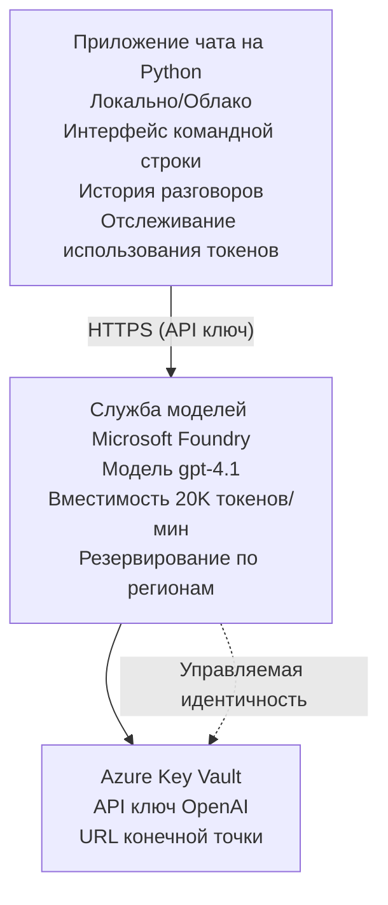

# Microsoft Foundry Models Chat Application

**Учебный путь:** Средний уровень ⭐⭐ | **Время:** 35-45 минут | **Стоимость:** $50-200/месяц

Полное чат-приложение Microsoft Foundry Models, развернутое с помощью Azure Developer CLI (azd). Этот пример демонстрирует развертывание gpt-4.1, безопасный доступ к API и простой чат-интерфейс.

## 🎯 Чему вы научитесь

- Развертывать сервис Microsoft Foundry Models с моделью gpt-4.1  
- Обеспечивать безопасность ключей API с помощью Key Vault  
- Создавать простой чат-интерфейс на Python  
- Отслеживать использование токенов и расходы  
- Реализовывать ограничение частоты запросов и обработку ошибок  

## 📦 Что включено

✅ **Сервис Microsoft Foundry Models** – развертывание модели gpt-4.1  
✅ **Чат-приложение на Python** – простой интерфейс командной строки  
✅ **Интеграция с Key Vault** – безопасное хранение ключей API  
✅ **ARM-шаблоны** – полное инфраструктурное кодирование  
✅ **Мониторинг затрат** – отслеживание использования токенов  
✅ **Ограничение частоты запросов** – предотвращение превышения квоты  

## Архитектура


## Требования

### Необходимо

- **Azure Developer CLI (azd)** – [Руководство по установке](https://learn.microsoft.com/azure/developer/azure-developer-cli/install-azd)  
- **Подписка Azure** с доступом к OpenAI – [Запросить доступ](https://aka.ms/oai/access)  
- **Python 3.9+** – [Установить Python](https://www.python.org/downloads/)  

### Проверка требований

```bash
# Проверьте версию azd (требуется 1.5.0 или выше)
azd version

# Проверьте вход в Azure
azd auth login

# Проверьте версию Python
python --version  # или python3 --version

# Проверьте доступ к OpenAI (проверьте в Azure Portal)
az cognitiveservices account list-skus \
  --kind OpenAI \
  --location eastus
```

> **⚠️ Важно:** Microsoft Foundry Models требует одобрения приложения. Если вы не подавали заявку, посетите [aka.ms/oai/access](https://aka.ms/oai/access). Одобрение обычно занимает 1-2 рабочих дня.

## ⏱️ Время развертывания

| Этап | Продолжительность | Что происходит |
|-------|------------------|----------------|
| Проверка требований | 2-3 минуты | Проверка доступности квоты OpenAI |
| Развертывание инфраструктуры | 8-12 минут | Создание OpenAI, Key Vault, развертывание модели |
| Настройка приложения | 2-3 минуты | Конфигурация окружения и зависимостей |
| **Итого** | **12-18 минут** | Готово к общению с gpt-4.1 |

**Примечание:** Первое развертывание OpenAI может занять больше времени из-за подготовки модели.

## Быстрый старт

```bash
# Перейти к примеру
cd examples/azure-openai-chat

# Инициализировать окружение
azd env new myopenai

# Развернуть все (инфраструктуру + конфигурацию)
azd up
# Вам будет предложено:
# 1. Выбрать подписку Azure
# 2. Выбрать регион с доступностью OpenAI (например, eastus, eastus2, westus)
# 3. Подождать 12-18 минут для развертывания

# Установить зависимости Python
pip install -r requirements.txt

# Начать чат!
python chat.py
```

**Ожидаемый вывод:**  
```
🤖 Microsoft Foundry Models Chat Application
Connected to: gpt-4.1 (eastus)
Type your message (or 'quit' to exit)

You: Hello! Tell me about Microsoft Foundry Models.
Assistant: Microsoft Foundry Models Service provides REST API access to OpenAI's powerful language models including gpt-4.1, GPT-3.5-Turbo, and Embeddings...

[Tokens used: 145 | Estimated cost: $0.0044]
```

## ✅ Проверка развертывания

### Шаг 1: Проверка ресурсов Azure

```bash
# Просмотр развернутых ресурсов
azd show

# Ожидаемый вывод показывает:
# - Служба OpenAI: (имя ресурса)
# - Хранилище ключей: (имя ресурса)
# - Развертывание: gpt-4.1
# - Регион: eastus (или выбранный вами регион)
```

### Шаг 2: Тестирование OpenAI API

```bash
# Получить конечную точку и ключ OpenAI
OPENAI_ENDPOINT=$(azd env get-value AZURE_OPENAI_ENDPOINT)
OPENAI_KEY=$(azd env get-value AZURE_OPENAI_API_KEY)

# Тестовый вызов API
curl "$OPENAI_ENDPOINT/openai/deployments/gpt-4.1/chat/completions?api-version=2024-08-01-preview" \
  -H "Content-Type: application/json" \
  -H "api-key: $OPENAI_KEY" \
  -d '{
    "messages": [{"role": "user", "content": "Say hello!"}],
    "max_tokens": 50
  }'
```

**Ожидаемый ответ:**  
```json
{
  "choices": [
    {
      "message": {
        "role": "assistant",
        "content": "Hello! How can I assist you today?"
      }
    }
  ],
  "usage": {
    "prompt_tokens": 8,
    "completion_tokens": 9,
    "total_tokens": 17
  }
}
```

### Шаг 3: Проверка доступа к Key Vault

```bash
# Список секретов в Key Vault
KV_NAME=$(azd env get-value AZURE_KEY_VAULT_NAME)

az keyvault secret list \
  --vault-name $KV_NAME \
  --query "[].name" \
  --output table
```

**Ожидаемые секреты:**  
- `openai-api-key`  
- `openai-endpoint`  

**Критерии успеха:**  
- ✅ Сервис OpenAI развернут с gpt-4.1  
- ✅ API-запрос возвращает корректное завершение  
- ✅ Секреты сохранены в Key Vault  
- ✅ Работает отслеживание использования токенов  

## Структура проекта

```
azure-openai-chat/
├── README.md                   ✅ This guide
├── azure.yaml                  ✅ AZD configuration
├── infra/                      ✅ Infrastructure as Code
│   ├── main.bicep             ✅ Main Bicep template
│   ├── main.parameters.json   ✅ Parameters
│   └── openai.bicep           ✅ OpenAI resource definition
├── src/                        ✅ Application code
│   ├── chat.py                ✅ Chat interface
│   ├── config.py              ✅ Configuration loader
│   └── requirements.txt       ✅ Python dependencies
└── .gitignore                  ✅ Git ignore rules
```

## Особенности приложения

### Чат-интерфейс (`chat.py`)

Чат-приложение включает:

- **История разговоров** – поддержка контекста между сообщениями  
- **Подсчет токенов** – отслеживание использования и оценка затрат  
- **Обработка ошибок** – плавное управление ограничением запросов и ошибками API  
- **Оценка затрат** – расчет стоимости сообщений в реальном времени  
- **Поддержка стриминга** – опциональная потоковая обработка ответов  

### Команды

Во время чата можно использовать:  
- `quit` или `exit` – завершить сессию  
- `clear` – очистить историю разговора  
- `tokens` – показать суммарное использование токенов  
- `cost` – показать оценочную общую стоимость  

### Конфигурация (`config.py`)

Загружает настройки из переменных окружения:  
```python
AZURE_OPENAI_ENDPOINT  # Из Key Vault
AZURE_OPENAI_API_KEY   # Из Key Vault
AZURE_OPENAI_MODEL     # По умолчанию: gpt-4.1
AZURE_OPENAI_MAX_TOKENS # По умолчанию: 800
```

## Примеры использования

### Простой чат

```bash
python chat.py
```

### Чат с кастомной моделью

```bash
export AZURE_OPENAI_MODEL=gpt-35-turbo
python chat.py
```

### Чат со стримингом

```bash
python chat.py --stream
```

### Пример разговора

```
You: Explain Microsoft Foundry Models Service in 3 sentences.
Assistant: Microsoft Foundry Models Service is Microsoft Azure's cloud platform offering 
that provides access to OpenAI's powerful language models. It enables developers 
to integrate capabilities like gpt-4.1 into their applications with enterprise-grade 
security and compliance. The service includes features for content filtering, 
abuse monitoring, and responsible AI practices.

[Tokens used: 89 | Estimated cost: $0.0027]

You: What models are available?
Assistant: Microsoft Foundry Models Service offers several model families including gpt-4.1 
(most capable), GPT-3.5-Turbo (faster and cost-effective), and Embeddings models 
for vector search. Each model has different capabilities, pricing, and token limits.

[Tokens used: 67 | Estimated cost: $0.0020]

Total session: 156 tokens | $0.0047
```

## Управление затратами

### Ценообразование токенов (gpt-4.1)

| Модель | Вход (за 1К токенов) | Выход (за 1К токенов) |
|-------|----------------------|------------------------|
| gpt-4.1 | $0.03 | $0.06 |
| GPT-3.5-Turbo | $0.0015 | $0.002 |

### Оценочные ежемесячные расходы

Исходя из паттернов использования:

| Уровень использования | Сообщений в день | Токенов в день | Месячные расходы |
|-------------|--------------|------------|--------------|
| **Низкий** | 20 сообщений | 3,000 токенов | $3-5 |
| **Средний** | 100 сообщений | 15,000 токенов | $15-25 |
| **Высокий** | 500 сообщений | 75,000 токенов | $75-125 |

**Базовая стоимость инфраструктуры:** $1-2/месяц (Key Vault + минимальные вычисления)

### Советы по оптимизации затрат

```bash
# 1. Используйте GPT-3.5-Turbo для более простых задач (в 20 раз дешевле)
export AZURE_OPENAI_MODEL=gpt-35-turbo

# 2. Уменьшите максимальное количество токенов для более коротких ответов
export AZURE_OPENAI_MAX_TOKENS=400

# 3. Отслеживайте использование токенов
python chat.py --show-tokens

# 4. Настройте оповещения о бюджете
az consumption budget create \
  --budget-name "openai-budget" \
  --amount 50 \
  --time-grain Monthly
```

## Мониторинг

### Просмотр использования токенов

```bash
# В портале Azure:
# Ресурс OpenAI → Метрики → Выберите "Token Transaction"

# Или через Azure CLI:
az monitor metrics list \
  --resource $(azd env get-value AZURE_OPENAI_RESOURCE_ID) \
  --metric "TokenTransaction" \
  --start-time $(date -u -d '1 hour ago' '+%Y-%m-%dT%H:%M:%S') \
  --interval PT1M
```

### Просмотр логов API

```bash
# Поток диагностических журналов
az monitor diagnostic-settings create \
  --resource $(azd env get-value AZURE_OPENAI_RESOURCE_ID) \
  --name openai-logs \
  --logs '[{"category": "Audit", "enabled": true}]' \
  --workspace $(azd env get-value LOG_ANALYTICS_WORKSPACE_ID)

# Журналы запросов
az monitor log-analytics query \
  --workspace $(azd env get-value LOG_ANALYTICS_WORKSPACE_ID) \
  --analytics-query "AzureDiagnostics | where Category == 'Audit' | top 10 by TimeGenerated"
```

## Устранение неполадок

### Проблема: ошибка "Доступ запрещен"

**Симптомы:** 403 Forbidden при вызове API

**Решения:**  
```bash
# 1. Подтвердите, что доступ к OpenAI одобрен
az cognitiveservices account show \
  --name $(azd env get-value AZURE_OPENAI_NAME) \
  --resource-group $(azd env get-value AZURE_RESOURCE_GROUP)

# 2. Проверьте правильность API ключа
azd env get-value AZURE_OPENAI_API_KEY

# 3. Проверьте формат URL конечной точки
azd env get-value AZURE_OPENAI_ENDPOINT
# Должно быть: https://[name].openai.azure.com/
```

### Проблема: "Превышен лимит запросов"

**Симптомы:** 429 Too Many Requests

**Решения:**  
```bash
# 1. Проверить текущую квоту
az cognitiveservices account deployment show \
  --name $(azd env get-value AZURE_OPENAI_NAME) \
  --resource-group $(azd env get-value AZURE_RESOURCE_GROUP) \
  --deployment-name gpt-4.1

# 2. Запросить увеличение квоты (при необходимости)
# Перейдите в Azure Portal → Ресурс OpenAI → Квоты → Запросить увеличение

# 3. Реализовать логику повторных попыток (уже в chat.py)
# Приложение автоматически повторяет попытки с экспоненциальной задержкой
```

### Проблема: "Модель не найдена"

**Симптомы:** ошибка 404 при обращении к развертыванию

**Решения:**  
```bash
# 1. Список доступных развертываний
az cognitiveservices account deployment list \
  --name $(azd env get-value AZURE_OPENAI_NAME) \
  --resource-group $(azd env get-value AZURE_RESOURCE_GROUP)

# 2. Проверьте имя модели в окружении
echo $AZURE_OPENAI_MODEL

# 3. Обновите до правильного имени развертывания
export AZURE_OPENAI_MODEL=gpt-4.1  # или gpt-35-turbo
```

### Проблема: Высокая задержка

**Симптомы:** медленное время отклика (>5 секунд)

**Решения:**  
```bash
# 1. Проверить региональную задержку
# Развернуть в регионе, ближайшем к пользователям

# 2. Уменьшить max_tokens для более быстрого отклика
export AZURE_OPENAI_MAX_TOKENS=400

# 3. Использовать потоковую передачу для улучшения пользовательского опыта
python chat.py --stream
```

## Лучшие практики безопасности

### 1. Защита ключей API

```bash
# Никогда не добавляйте ключи в систему управления версиями
# Используйте Key Vault (уже настроен)

# Регулярно обновляйте ключи
az cognitiveservices account keys regenerate \
  --name $(azd env get-value AZURE_OPENAI_NAME) \
  --resource-group $(azd env get-value AZURE_RESOURCE_GROUP) \
  --key-name key1
```

### 2. Реализация фильтрации контента

```python
# В Microsoft Foundry Models встроена фильтрация контента
# Настройка в Azure Portal:
# Ресурс OpenAI → Фильтры контента → Создать пользовательский фильтр

# Категории: Ненависть, Сексуальный контент, Насилие, Самоубийство
# Уровни: Низкий, Средний, Высокий уровень фильтрации
```

### 3. Использование управляемой идентичности (для продакшена)

```bash
# Для продакшн-развертываний используйте управляемую идентичность
# вместо API-ключей (требуется размещение приложения в Azure)

# Обновите infra/openai.bicep, чтобы включить:
# identity: { type: 'SystemAssigned' }
```

## Разработка

### Запуск локально

```bash
# Установить зависимости
pip install -r src/requirements.txt

# Установить переменные окружения
export AZURE_OPENAI_ENDPOINT="https://[name].openai.azure.com/"
export AZURE_OPENAI_API_KEY="your-api-key"
export AZURE_OPENAI_MODEL="gpt-4.1"

# Запустить приложение
python src/chat.py
```

### Запуск тестов

```bash
# Установить зависимости для тестирования
pip install pytest pytest-cov

# Запустить тесты
pytest tests/ -v

# С покрытием
pytest tests/ --cov=src --cov-report=html
```

### Обновление развертывания модели

```bash
# Развернуть другую версию модели
az cognitiveservices account deployment create \
  --name $(azd env get-value AZURE_OPENAI_NAME) \
  --resource-group $(azd env get-value AZURE_RESOURCE_GROUP) \
  --deployment-name gpt-35-turbo \
  --model-name gpt-35-turbo \
  --model-version "0613" \
  --model-format OpenAI \
  --sku-capacity 20 \
  --sku-name "Standard"
```

## Очистка ресурсов

```bash
# Удалить все ресурсы Azure
azd down --force --purge

# Это удалит:
# - Сервис OpenAI
# - Key Vault (с 90-дневным мягким удалением)
# - Группу ресурсов
# - Все развертывания и конфигурации
```

## Следующие шаги

### Расширение примера

1. **Добавить веб-интерфейс** – создать фронтенд на React/Vue  
   ```bash
   # Добавить сервис фронтенда в azure.yaml
   # Развернуть в Azure Static Web Apps
   ```

2. **Реализовать RAG** – добавить поиск по документам с Azure AI Search  
   ```python
   # Интеграция Azure Cognitive Search
   # Загрузка документов и создание векторного индекса
   ```

3. **Добавить функцию вызова** – включить использование инструментов  
   ```python
   # Определить функции в chat.py
   # Позволить gpt-4.1 вызывать внешние API
   ```

4. **Поддержка нескольких моделей** – развертывание нескольких моделей  
   ```bash
   # Добавить gpt-35-turbo, модели эмбеддингов
   # Реализовать логику маршрутизации моделей
   ```

### Связанные примеры

- **[Retail Multi-Agent](../retail-scenario.md)** – продвинутая архитектура мультиагентов  
- **[Database App](../../../../examples/database-app)** – добавление постоянного хранения  
- **[Container Apps](../../../../examples/container-app)** – развертывание в виде контейнерного сервиса  

### Ресурсы для обучения

- 📚 [Курс AZD для начинающих](../../README.md) – главная страница курса  
- 📚 [Документация Microsoft Foundry Models](https://learn.microsoft.com/azure/ai-services/openai/) – официальная документация  
- 📚 [Справочник OpenAI API](https://platform.openai.com/docs/api-reference) – детали API  
- 📚 [Ответственный AI](https://www.microsoft.com/ai/responsible-ai) – лучшие практики  

## Дополнительные ресурсы

### Документация  
- **[Сервис Microsoft Foundry Models](https://learn.microsoft.com/azure/ai-services/openai/)** – полное руководство  
- **[Модели gpt-4.1](https://learn.microsoft.com/azure/ai-services/openai/concepts/models)** – возможности моделей  
- **[Фильтрация контента](https://learn.microsoft.com/azure/ai-services/openai/concepts/content-filter)** – функции безопасности  
- **[Azure Developer CLI](https://learn.microsoft.com/azure/developer/azure-developer-cli/)** – справочник azd  

### Руководства  
- **[Быстрый старт OpenAI](https://learn.microsoft.com/azure/ai-services/openai/quickstart)** – первое развертывание  
- **[Чаты с OpenAI](https://learn.microsoft.com/azure/ai-services/openai/how-to/chatgpt)** – создание чат-приложений  
- **[Вызов функций](https://learn.microsoft.com/azure/ai-services/openai/how-to/function-calling)** – продвинутые функции  

### Инструменты  
- **[Microsoft Foundry Models Studio](https://oai.azure.com/)** – веб-песочница  
- **[Руководство по созданию подсказок](https://platform.openai.com/docs/guides/prompt-engineering)** – написание эффективных подсказок  
- **[Калькулятор токенов](https://platform.openai.com/tokenizer)** – оценка использования токенов  

### Сообщество  
- **[Azure AI Discord](https://discord.gg/azure)** – помощь от сообщества  
- **[GitHub Discussions](https://github.com/Azure-Samples/openai/discussions)** – форум вопросов и ответов  
- **[Блог Azure](https://azure.microsoft.com/blog/tag/azure-openai-service/)** – последние обновления  

---

**🎉 Ура!** Вы развернули Microsoft Foundry Models и создали рабочее чат-приложение. Начинайте исследовать возможности gpt-4.1 и экспериментировать с разными подсказками и сценариями использования.

**Есть вопросы?** [Создайте запрос](https://github.com/microsoft/AZD-for-beginners/issues) или ознакомьтесь с [FAQ](../../resources/faq.md)

**Внимание к расходам:** Не забудьте выполнить `azd down` после завершения тестирования, чтобы избежать постоянных затрат (~$50-100/месяц при активном использовании).

---

<!-- CO-OP TRANSLATOR DISCLAIMER START -->
**Отказ от ответственности**:
Этот документ был переведен с помощью сервиса автоматического перевода [Co-op Translator](https://github.com/Azure/co-op-translator). Несмотря на наши усилия по обеспечению точности, имейте в виду, что автоматический перевод может содержать ошибки или неточности. Оригинальный документ на его исходном языке следует считать авторитетным источником. Для критически важной информации рекомендуется обращаться к профессиональному человеческому переводу. Мы не несем ответственности за любые недоразумения или неправильное толкование, возникшие в результате использования этого перевода.
<!-- CO-OP TRANSLATOR DISCLAIMER END -->