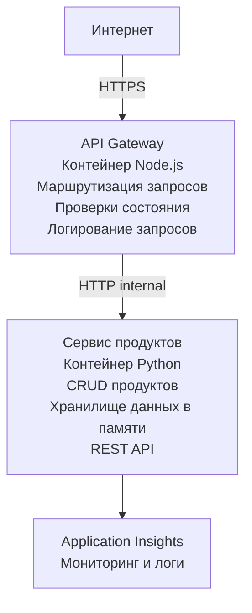

# Архитектура микросервисов — пример с Container App

⏱️ **Ориентировочное время**: 25-35 минут | 💰 **Ориентировочные затраты**: примерно $50-100/месяц | ⭐ **Сложность**: Продвинутый уровень

**Упрощённая, но работоспособная** архитектура микросервисов, развернутая в Azure Container Apps с помощью AZD CLI. В этом примере показана коммуникация между сервисами, оркестрация контейнеров и мониторинг на практике с двумя сервисами.

> **📚 Подход к обучению**: Этот пример начинается с минимальной архитектуры из двух сервисов (API Gateway + Backend Service), которую вы можете развернуть и использовать для обучения. После освоения основ мы предоставляем рекомендации по расширению до полноценной экосистемы микросервисов.

## Чему вы научитесь

Выполнив этот пример, вы сможете:
- Развертывать несколько контейнеров в Azure Container Apps
- Реализовать коммуникацию между сервисами с помощью внутренней сети
- Настроить масштабирование и проверки состояния по окружению
- Мониторить распределённые приложения с помощью Application Insights
- Понять паттерны развертывания микросервисов и лучшие практики
- Изучить поэтапное расширение от простой к сложной архитектуре

## Архитектура

### Фаза 1: Что мы строим (включено в пример)


**Почему начинать с простого?**
- ✅ Быстро развернуть и понять (25-35 минут)
- ✅ Изучить основные паттерны микросервисов без сложностей
- ✅ Рабочий код, который можно менять и экспериментировать
- ✅ Ниже стоимость обучения (~$50-100/месяц вместо $300-1400/месяц)
- ✅ Набрать уверенность перед добавлением БД и очередей сообщений

**Аналогия**: Это всё равно что учиться водить машину. Сначала пустая парковка (2 сервиса), освоение основ, потом городские дороги (5+ сервисов с базами данных).

### Фаза 2: Будущее расширение (Референсная архитектура)

После освоения архитектуры из 2 сервисов вы можете расшириться до:

```
Full Architecture (Not Included - For Reference)
├── API Gateway (✅ Included)
├── Product Service (✅ Included)
├── Order Service (🔜 Add next)
├── User Service (🔜 Add next)
├── Notification Service (🔜 Add last)
├── Azure Service Bus (🔜 For async communication)
├── Cosmos DB (🔜 For product persistence)
├── Azure SQL (🔜 For order management)
└── Azure Storage (🔜 For file storage)
```

См. раздел «Руководство по расширению» в конце для пошаговых инструкций.

## Включённые функции

✅ **Обнаружение сервисов**: Автоматическое DNS-обнаружение между контейнерами  
✅ **Балансировка нагрузки**: Встроенная балансировка по репликам  
✅ **Автоматическое масштабирование**: Независимое масштабирование по http-запросам для каждого сервиса  
✅ **Мониторинг состояния**: Проверки живости и готовности для обоих сервисов  
✅ **Распределённое логирование**: Централизованный сбор логов через Application Insights  
✅ **Внутреннее сетевое взаимодействие**: Защищённая коммуникация между сервисами  
✅ **Оркестрация контейнеров**: Автоматическое развертывание и масштабирование  
✅ **Обновления без простоя**: Каскадные обновления с управлением ревизиями  

## Требования

### Необходимые инструменты

Перед началом убедитесь, что установлены:

1. **[Azure Developer CLI (azd)](https://learn.microsoft.com/azure/developer/azure-developer-cli/install-azd)** (версия 1.0.0 и выше)  
   ```bash
   azd version
   # Ожидаемый вывод: версия azd 1.0.0 или выше
   ```

2. **[Azure CLI](https://learn.microsoft.com/cli/azure/install-azure-cli)** (версия 2.50.0 и выше)  
   ```bash
   az --version
   # Ожидаемый результат: azure-cli 2.50.0 или выше
   ```

3. **[Docker](https://www.docker.com/get-started)** (для локальной разработки/тестирования — опционально)  
   ```bash
   docker --version
   # Ожидаемый вывод: версия Docker 20.10 или выше
   ```


### Требования Azure

- Активная **подписка Azure** ([создать бесплатный аккаунт](https://azure.microsoft.com/free/))  
- Права на создание ресурсов в подписке  
- Роль **Contributor** для подписки или группы ресурсов  

### Предварительные знания

Это пример для **продвинутого уровня**. Требуется:  
- Пройти [простой пример Flask API](../../../../../examples/container-app/simple-flask-api)  
- Базовые знания архитектуры микросервисов  
- Знакомство с REST API и HTTP  
- Понимание концепций контейнеров  

**Новичку в Container Apps?** Начните с [простой Flask API](../../../../../examples/container-app/simple-flask-api), чтобы освоить основные моменты.

## Быстрый старт (пошагово)

### Шаг 1: Клонировать и перейти в папку

```bash
git clone https://github.com/microsoft/AZD-for-beginners.git
cd AZD-for-beginners/examples/container-app/microservices
```
  
**✓ Проверка успеха**: Убедитесь, что видите `azure.yaml`:  
```bash
ls
# Ожидается: README.md, azure.yaml, infra/, src/
```
  

### Шаг 2: Аутентифицироваться в Azure

```bash
azd auth login
```
  
Откроется браузер для входа через Azure. Введите свои учетные данные.

**✓ Проверка успеха**: Вы должны увидеть:  
```
Logged in to Azure.
```
  

### Шаг 3: Инициализировать окружение

```bash
azd init
```
  
**Запросы, которые вы увидите**:  
- **Имя окружения**: Введите короткое имя (например, `microservices-dev`)  
- **Подписка Azure**: Выберите подписку  
- **Регион Azure**: Выберите регион (например, `eastus`, `westeurope`)  

**✓ Проверка успеха**: Вы должны увидеть:  
```
SUCCESS: New project initialized!
```
  

### Шаг 4: Развернуть инфраструктуру и сервисы

```bash
azd up
```
  
**Что происходит** (занимает 8-12 минут):  
1. Создаётся окружение Container Apps  
2. Создаётся Application Insights для мониторинга  
3. Строится контейнер API Gateway (Node.js)  
4. Строится контейнер Product Service (Python)  
5. Оба контейнера разворачиваются в Azure  
6. Конфигурируются сеть и проверки состояния  
7. Настраивается мониторинг и логирование  

**✓ Проверка успеха**: Вы должны увидеть:  
```
SUCCESS: Your application was deployed to Azure in X minutes Y seconds.
Endpoint: https://api-gateway-<unique-id>.azurecontainerapps.io
```
  
**⏱️ Время**: 8-12 минут  

### Шаг 5: Протестировать развертывание

```bash
# Получить конечную точку шлюза
GATEWAY_URL=$(azd env get-values | grep API_GATEWAY_URL | cut -d '=' -f2 | tr -d '"')

# Проверить состояние API Gateway
curl $GATEWAY_URL/health

# Ожидаемый вывод:
# {"status":"healthy","service":"api-gateway","timestamp":"2025-11-19T10:30:00Z"}
```
  
**Протестируйте сервис продуктов через шлюз**:  
```bash
# Список продуктов
curl $GATEWAY_URL/api/products

# Ожидаемый вывод:
# [
#   {"id":1,"name":"Ноутбук","price":999.99,"stock":50},
#   {"id":2,"name":"Мышь","price":29.99,"stock":200},
#   {"id":3,"name":"Клавиатура","price":79.99,"stock":150}
# ]
```
  
**✓ Проверка успеха**: Оба эндпоинта возвращают JSON без ошибок.

---

**🎉 Поздравляем!** Вы развернули архитектуру микросервисов в Azure!

## Структура проекта

Весь исходный код включён — это полный, работающий пример:

```
microservices/
│
├── README.md                         # This file
├── azure.yaml                        # AZD configuration
├── .gitignore                        # Git ignore patterns
│
├── infra/                           # Infrastructure as Code (Bicep)
│   ├── main.bicep                   # Main orchestration
│   ├── abbreviations.json           # Naming conventions
│   ├── core/                        # Shared infrastructure
│   │   ├── container-apps-environment.bicep  # Container environment + registry
│   │   └── monitor.bicep            # Application Insights + Log Analytics
│   └── app/                         # Service definitions
│       ├── api-gateway.bicep        # API Gateway container app
│       └── product-service.bicep    # Product Service container app
│
└── src/                             # Application source code
    ├── api-gateway/                 # Node.js API Gateway
    │   ├── app.js                   # Express server with routing
    │   ├── package.json             # Node dependencies
    │   └── Dockerfile               # Container definition
    └── product-service/             # Python Product Service
        ├── main.py                  # Flask API with product data
        ├── requirements.txt         # Python dependencies
        └── Dockerfile               # Container definition
```
  
**Назначение каждого компонента:**  

**Инфраструктура (infra/):**  
- `main.bicep`: Управляет ресурсами Azure и их зависимостями  
- `core/container-apps-environment.bicep`: Создаёт окружение Container Apps и реестр контейнеров Azure  
- `core/monitor.bicep`: Настраивает Application Insights для распределённого логирования  
- `app/*.bicep`: Определения отдельных приложений-контейнеров с настройками масштабирования и проверок  

**API Gateway (src/api-gateway/):**  
- Публичный сервис, направляющий запросы на бэкенды  
- Логирование, обработка ошибок, пересылка запросов  
- Демонстрация взаимодействия HTTP между сервисами  

**Product Service (src/product-service/):**  
- Внутренний сервис с каталогом продуктов (в памяти для упрощения)  
- REST API с проверками здоровья  
- Пример паттерна бэкенд микросервиса  

## Обзор сервисов

### API Gateway (Node.js/Express)

**Порт:** 8080  
**Доступ:** Публичный (внешний вход)  
**Назначение:** Маршрутизация запросов к бэкендам  

**Эндпоинты:**  
- `GET /` — информация о сервисе  
- `GET /health` — проверка состояния  
- `GET /api/products` — пересылка на сервис продуктов (список)  
- `GET /api/products/:id` — пересылка на сервис продуктов (получение по ID)  

**Ключевые особенности:**  
- Маршрутизация запросов через axios  
- Централизованное логирование  
- Обработка ошибок и управление таймаутами  
- Обнаружение сервисов через переменные окружения  
- Интеграция с Application Insights  

**Пример кода** (`src/api-gateway/app.js`):  
```javascript
// Внутреннее сервисное взаимодействие
app.get('/api/products', async (req, res) => {
  const response = await axios.get(`${PRODUCT_SERVICE_URL}/products`);
  res.json(response.data);
});
```
  

### Product Service (Python/Flask)

**Порт:** 8000  
**Доступ:** Только внутренний (нет внешнего входа)  
**Назначение:** Управляет каталогом продуктов в памяти  

**Эндпоинты:**  
- `GET /` — информация о сервисе  
- `GET /health` — проверка состояния  
- `GET /products` — список всех продуктов  
- `GET /products/<id>` — получить продукт по ID  

**Ключевые особенности:**  
- REST API на Flask  
- Хранение продуктов в памяти (просто, без базы данных)  
- Мониторинг состояния с помощью проверок  
- Структурированное логирование  
- Интеграция с Application Insights  

**Модель данных:**  
```python
{
  "id": 1,
  "name": "Laptop",
  "description": "High-performance laptop",
  "price": 999.99,
  "stock": 50
}
```
  
**Почему только внутренний доступ?**  
Сервис продуктов не доступен публично. Все запросы идут через API Gateway, что обеспечивает:  
- Безопасность: Контролируемая точка доступа  
- Гибкость: Можно менять бэкенд без влияния на клиентов  
- Мониторинг: Централизованное логирование запросов  

## Как сервисы взаимодействуют

### Как сервисы общаются друг с другом

В этом примере API Gateway общается с Product Service через **внутренние HTTP вызовы**:

```javascript
// API Gateway (src/api-gateway/app.js)
const PRODUCT_SERVICE_URL = process.env.PRODUCT_SERVICE_URL;

// Выполнить внутренний HTTP-запрос
const response = await axios.get(`${PRODUCT_SERVICE_URL}/products`);
```
  
**Основные моменты:**  

1. **Обнаружение через DNS**: Container Apps автоматически предоставляет DNS для внутренних сервисов  
   - FQDN Product Service: `product-service.internal.<environment>.azurecontainerapps.io`  
   - Упрощённо: `http://product-service` (Container Apps разрешает)  

2. **Нет публичного доступа**: Product Service настроен с `external: false` в Bicep  
   - Доступен только в пределах Container Apps  
   - Недоступен из интернета  

3. **Переменные окружения**: URL сервисов передаются при развертывании  
   - Bicep передаёт внутренний FQDN в шлюз  
   - В коде нет жёстко заданных адресов  

**Аналогия**: Представьте офис. API Gateway — ресепшен (публичный), а Product Service — офисное помещение (только внутренний доступ). Посетители проходят через ресепшен, чтобы попасть внутрь.

## Варианты развертывания

### Полное развертывание (рекомендуется)

```bash
# Разверните инфраструктуру и оба сервиса
azd up
```
  
Это развертывает:  
1. Окружение Container Apps  
2. Application Insights  
3. Регистр контейнеров  
4. Контейнер API Gateway  
5. Контейнер Product Service  

**Время**: 8-12 минут

### Развернуть отдельный сервис

```bash
# Развернуть только один сервис (после первоначального azd up)
azd deploy api-gateway

# Или развернуть сервис продукта
azd deploy product-service
```
  
**Случай использования**: Обновили код одного сервиса и хотите развернуть только его.

### Обновить конфигурацию

```bash
# Изменить параметры масштабирования
azd env set GATEWAY_MAX_REPLICAS 30

# Перезапустить с новой конфигурацией
azd up
```
  

## Конфигурация

### Настройка масштабирования

Оба сервиса настроены на автоскейлинг HTTP в их Bicep-файлах:

**API Gateway**:  
- Минимум реплик: 2 (всегда минимум 2 для доступности)  
- Максимум реплик: 20  
- Триггер масштабирования: 50 одновременных запросов на реплику  

**Product Service**:  
- Минимум реплик: 1 (может масштабироваться до нуля при необходимости)  
- Максимум реплик: 10  
- Триггер масштабирования: 100 одновременных запросов на реплику  

**Настроить масштабирование** (в `infra/app/*.bicep`):  
```bicep
scale: {
  minReplicas: 1
  maxReplicas: 10
  rules: [
    {
      name: 'http-scale-rule'
      http: {
        metadata: {
          concurrentRequests: '100'  // Adjust this
        }
      }
    }
  ]
}
```
  

### Распределение ресурсов

**API Gateway**:  
- CPU: 1.0 vCPU  
- Память: 2 ГБ  
- Причина: Обрабатывает весь внешний трафик  

**Product Service**:  
- CPU: 0.5 vCPU  
- Память: 1 ГБ  
- Причина: Лёгкие операции в памяти  

### Проверки состояния

Оба сервиса включают проверки живости и готовности:  

```bicep
probes: [
  {
    type: 'Liveness'
    httpGet: {
      path: '/health'
      port: 8080
    }
    initialDelaySeconds: 10
    periodSeconds: 30
  }
  {
    type: 'Readiness'
    httpGet: {
      path: '/health'
      port: 8080
    }
    initialDelaySeconds: 5
    periodSeconds: 10
  }
]
```
  
**Что это значит:**  
- **Живость**: При сбое проверки Container Apps перезапускает контейнер  
- **Готовность**: Если не готов, трафик на реплику не направляется  

## Мониторинг и наблюдаемость

### Просмотр логов сервисов

```bash
# Просмотр логов с помощью azd monitor
azd monitor --logs

# Или используйте Azure CLI для конкретных контейнерных приложений:
# Потоковая передача логов с API Gateway
az containerapp logs show --name api-gateway --resource-group $RG_NAME --follow

# Просмотр последних логов сервиса продуктов
az containerapp logs show --name product-service --resource-group $RG_NAME --tail 100
```
  
**Ожидаемый вывод:**  
```
[api-gateway] API Gateway listening on port 8080
[api-gateway] Product Service URL: http://product-service
[api-gateway] GET /api/products 200 - 45ms
[product-service] Retrieved 5 products
```
  

### Запросы в Application Insights

Откройте Application Insights в Azure Portal, затем выполните запросы:

**Найти медленные запросы:**  
```kusto
requests
| where timestamp > ago(1h)
| where duration > 1000  // Requests taking >1 second
| summarize count() by name, cloud_RoleName
| order by count_ desc
```
  
**Отслеживать вызовы между сервисами:**  
```kusto
dependencies
| where timestamp > ago(1h)
| where type == "Http"
| project timestamp, name, target, duration, success
| order by timestamp desc
```
  
**Процент ошибок по сервисам:**  
```kusto
exceptions
| where timestamp > ago(24h)
| summarize errorCount = count() by cloud_RoleName, type
| order by errorCount desc
```
  
**Объем запросов со временем:**  
```kusto
requests
| where timestamp > ago(1h)
| summarize requestCount = count() by bin(timestamp, 5m), cloud_RoleName
| render timechart
```
  

### Доступ к панели мониторинга

```bash
# Получить сведения об Application Insights
azd env get-values | grep APPLICATIONINSIGHTS

# Открыть мониторинг в портале Azure
az monitor app-insights component show \
  --app $(azd env get-values | grep APPLICATIONINSIGHTS_CONNECTION_STRING | cut -d '=' -f2) \
  --resource-group $(azd env get-values | grep AZURE_RESOURCE_GROUP | cut -d '=' -f2) \
  --query "appId" -o tsv
```
  

### Метрики в реальном времени

1. Откройте Application Insights в Azure Portal  
2. Нажмите "Live Metrics"  
3. Просматривайте запросы, ошибки и производительность в реальном времени  
4. Проверьте командой: `curl $(azd env get-values | grep API_GATEWAY_URL | cut -d '=' -f2 | tr -d '"')/api/products`  

## Практические упражнения

[Примечание: полные упражнения приведены выше в разделе "Практические упражнения", включая проверку развертывания, изменение данных, тестирование автоскейлинга, обработку ошибок и добавление третьего сервиса.]

## Анализ стоимости

### Ориентировочные ежемесячные затраты (для примера с 2 сервисами)

| Ресурс | Конфигурация | Примерная стоимость |
|--------|--------------|--------------------|
| API Gateway | 2-20 реплик, 1 vCPU, 2 ГБ RAM | $30-150 |
| Product Service | 1-10 реплик, 0.5 vCPU, 1 ГБ RAM | $15-75 |
| Регистр контейнеров | Базовый уровень | $5 |
| Application Insights | 1-2 ГБ/мес | $5-10 |
| Log Analytics | 1 ГБ/мес | $3 |
| **Итого** | | **$58-243/мес** |

**Разбивка по загрузке:**  
- **Слабая нагрузка** (тестирование/обучение): около $60/мес  
- **Средняя нагрузка** (небольшое производство): около $120/мес  
- **Высокая нагрузка** (пиковые периоды): около $240/мес  

### Советы по оптимизации затрат

1. **Масштабирование до нуля для разработки**:  
   ```bicep
   scale: {
     minReplicas: 0  // Save $30-40/month when not in use
     maxReplicas: 10
   }
   ```
  
2. **Использование consumption-плана для Cosmos DB** (при добавлении):  
   - Платите только за используемые ресурсы  
   - Нет минимальной оплаты  

3. **Настройте семплирование в Application Insights**:  
   ```javascript
   appInsights.defaultClient.config.samplingPercentage = 50; // Выборка 50% запросов
   ```
  
4. **Удаляйте ресурсы, когда не нужны**:  
   ```bash
   azd down
   ```
  

### Бесплатные варианты

Для обучения и тестирования рассмотрите:
- Используйте бесплатные кредиты Azure (первые 30 дней)
- Минимизируйте количество реплик
- Удаляйте после тестирования (чтобы не было постоянных расходов)

---

## Очистка

Чтобы избежать постоянных расходов, удалите все ресурсы:

```bash
azd down --force --purge
```

**Подтверждение**:
```
? Total resources to delete: 6, are you sure you want to continue? (y/N)
```

Введите `y` для подтверждения.

**Что удаляется**:
- Среда Container Apps
- Обе Container Apps (шлюз и сервис продуктов)
- Контейнерный реестр
- Application Insights
- Рабочее пространство Log Analytics
- Группа ресурсов

**✓ Проверка очистки**:
```bash
az group list --query "[?starts_with(name,'rg-microservices')]" --output table
```

Должен вернуть пустое значение.

---

## Руководство по расширению: От 2 до 5+ сервисов

После освоения архитектуры с 2 сервисами, вот как расширять:

### Фаза 1: Добавить постоянное хранение данных (следующий шаг)

**Добавляем Cosmos DB для сервиса продуктов**:

1. Создайте `infra/core/cosmos.bicep`:
   ```bicep
   resource cosmosAccount 'Microsoft.DocumentDB/databaseAccounts@2023-04-15' = {
     name: name
     location: location
     kind: 'GlobalDocumentDB'
     properties: {
       databaseAccountOfferType: 'Standard'
       locations: [{ locationName: location, failoverPriority: 0 }]
     }
   }
   ```

2. Обновите сервис продуктов, чтобы использовать Cosmos DB вместо хранения данных в памяти

3. Оценочная дополнительная стоимость: ~$25/месяц (serverless)

### Фаза 2: Добавить третий сервис (Управление заказами)

**Создайте сервис заказов**:

1. Новая папка: `src/order-service/` (Python/Node.js/C#)
2. Новый Bicep: `infra/app/order-service.bicep`
3. Обновите API Gateway для маршрута `/api/orders`
4. Добавьте Azure SQL Database для хранения заказов

**Архитектура становится**:
```
API Gateway → Product Service (Cosmos DB)
           → Order Service (Azure SQL)
```

### Фаза 3: Добавить асинхронное взаимодействие (Service Bus)

**Реализуйте событие-ориентированную архитектуру**:

1. Добавьте Azure Service Bus: `infra/core/servicebus.bicep`
2. Сервис продуктов публикует события "ProductCreated"
3. Сервис заказов подписывается на события продуктов
4. Добавьте сервис уведомлений для обработки событий

**Паттерн**: Request/Response (HTTP) + Event-Driven (Service Bus)

### Фаза 4: Добавить аутентификацию пользователей

**Реализуйте сервис пользователей**:

1. Создайте `src/user-service/` (Go/Node.js)
2. Добавьте Azure AD B2C или кастомную JWT-аутентификацию
3. API Gateway валидирует токены
4. Сервисы проверяют права пользователей

### Фаза 5: Готовность к продакшену

**Добавьте следующие компоненты**:
- Azure Front Door (глобальный балансировщик нагрузки)
- Azure Key Vault (управление секретами)
- Azure Monitor Workbooks (кастомные дашборды)
- CI/CD Pipeline (GitHub Actions)
- Blue-Green деплойменты
- Managed Identity для всех сервисов

**Полная стоимость продакшен-архитектуры**: ~$300-1,400/месяц

---

## Узнайте больше

### Связанная документация
- [Документация Azure Container Apps](https://learn.microsoft.com/azure/container-apps/)
- [Руководство по архитектуре микросервисов](https://learn.microsoft.com/azure/architecture/guide/architecture-styles/microservices)
- [Application Insights для распределённого трейсинга](https://learn.microsoft.com/azure/azure-monitor/app/distributed-tracing)
- [Документация Azure Developer CLI](https://learn.microsoft.com/azure/developer/azure-developer-cli/)

### Следующие шаги в курсе
- ← Предыдущая: [Простой Flask API](../../../../../examples/container-app/simple-flask-api) - Пример для начинающих с одним контейнером
- → Следующая: [Руководство по интеграции AI](../../../../../examples/docs/ai-foundry) - Добавление AI возможностей
- 🏠 [Домашняя страница курса](../../README.md)

### Сравнение: Когда что использовать

**Один контейнерный аппликейшн** (пример Simple Flask API):
- ✅ Простые приложения
- ✅ Монолитная архитектура
- ✅ Быстрая деплойка
- ❌ Ограниченная масштабируемость
- **Стоимость**: ~$15-50/месяц

**Микросервисы** (этот пример):
- ✅ Сложные приложения
- ✅ Независимое масштабирование каждого сервиса
- ✅ Автономия команд (разные сервисы — разные команды)
- ❌ Более сложное управление
- **Стоимость**: ~$60-250/месяц

**Kubernetes (AKS)**:
- ✅ Максимальный контроль и гибкость
- ✅ Multi-cloud переносимость
- ✅ Продвинутая сеть
- ❌ Требуются знания Kubernetes
- **Стоимость**: ~$150-500/месяц минимум

**Рекомендация**: Начинайте с Container Apps (этот пример), переходите на AKS только при необходимости функций Kubernetes.

---

## Часто задаваемые вопросы

**В: Почему всего 2 сервиса, а не 5+?**  
О: Для обучения. Освойте основы (взаимодействие сервисов, мониторинг, масштабирование) на простом примере, прежде чем переходить к более сложному. Освоенные паттерны применимы и к архитектурам с 100 сервисами.

**В: Могу ли я добавить больше сервисов самостоятельно?**  
О: Конечно! Следуйте руководству по расширению выше. Каждый новый сервис создаётся по тому же шаблону: создайте папку src, файл Bicep, обновите azure.yaml и задеплойте.

**В: Это готово к продакшену?**  
О: Это хорошая основа. Для продакшена добавьте: managed identity, Key Vault, постоянные базы данных, CI/CD пайплайн, оповещения мониторинга и стратегию резервных копий.

**В: Почему не использовать Dapr или другую service mesh?**  
О: Для обучения придерживайтесь простоты. После понимания нативного сетевого стека Container Apps можно добавить Dapr для продвинутых сценариев.

**В: Как отлаживать локально?**  
О: Запускайте сервисы локально через Docker:
```bash
cd src/api-gateway
docker build -t local-gateway .
docker run -p 8080:8080 -e PRODUCT_SERVICE_URL=http://localhost:8000 local-gateway
```

**В: Можно ли использовать разные языки программирования?**  
О: Да! В этом примере показаны Node.js (шлюз) + Python (сервис продуктов). Вы можете смешивать любые языки, которые работают в контейнерах.

**В: Что делать, если у меня нет кредитов Azure?**  
О: Используйте бесплатный уровень Azure (первые 30 дней для новых аккаунтов) или развертывайте на короткие тесты и сразу удаляйте.

---

> **🎓 Итог обучения**: Вы научились развёртывать многосервисную архитектуру с автоматическим масштабированием, внутренним сетевым взаимодействием, централизованным мониторингом и продакшен-паттернами. Эта база подготовит вас к сложным распределённым системам и корпоративным микросервисным архитектурам.

**📚 Навигация по курсу:**
- ← Предыдущая: [Простой Flask API](../../../../../examples/container-app/simple-flask-api)
- → Следующая: [Пример интеграции базы данных](../../../../../examples/database-app)
- 🏠 [Домашняя страница курса](../../../README.md)
- 📖 [Лучшие практики Container Apps](../../../docs/chapter-04-infrastructure/deployment-guide.md)

---

<!-- CO-OP TRANSLATOR DISCLAIMER START -->
**Отказ от ответственности**:  
Этот документ был переведен с помощью сервиса автоматического перевода [Co-op Translator](https://github.com/Azure/co-op-translator). Несмотря на наши усилия обеспечить точность, имейте в виду, что автоматический перевод может содержать ошибки или неточности. Оригинальный документ на исходном языке следует считать авторитетным источником. Для критически важной информации рекомендуется профессиональный перевод с участием человека. Мы не несем ответственности за любые недоразумения или неправильные толкования, возникшие в результате использования данного перевода.
<!-- CO-OP TRANSLATOR DISCLAIMER END -->