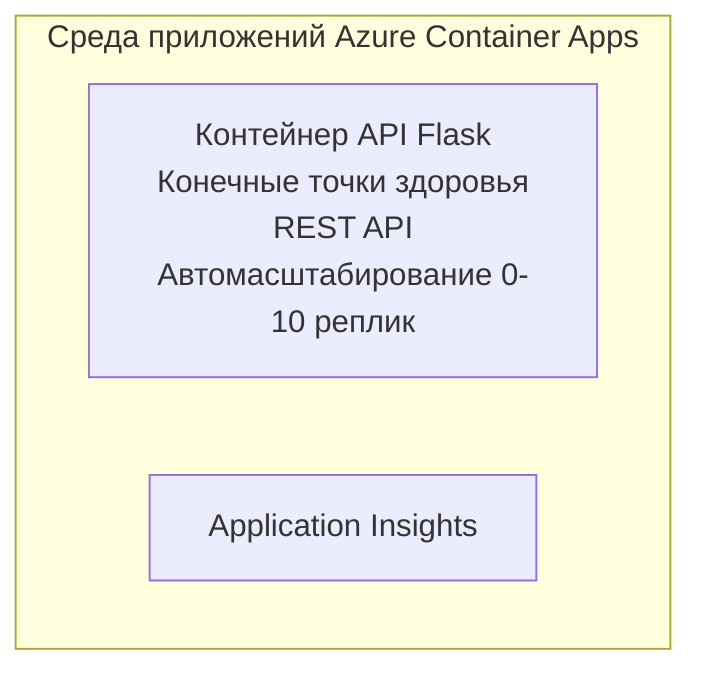

# Простой Flask API - Пример приложения в контейнере

**Обучающий путь:** Начинающий ⭐ | **Время:** 25-35 минут | **Стоимость:** $0-15/месяц

Полный, рабочий REST API на Python Flask, развернутый в Azure Container Apps с помощью Azure Developer CLI (azd). Этот пример демонстрирует развертывание контейнера, основы авто-масштабирования и мониторинга.

## 🎯 Чему вы научитесь

- Развертывать контейнеризованное Python-приложение в Azure
- Настраивать авто-масштабирование с масштабированием до нуля
- Реализовывать проверки работоспособности и готовности
- Отслеживать логи и метрики приложения
- Использовать Azure Developer CLI для быстрого развертывания

## 📦 Что включено

✅ **Приложение Flask** - Полный REST API с CRUD операциями (`src/app.py`)  
✅ **Dockerfile** - Готовая к производству конфигурация контейнера  
✅ **Инфраструктура Bicep** - Среда Container Apps и развертывание API  
✅ **Конфигурация AZD** - Настройка развертывания в одну команду  
✅ **Проверки здоровья** - Конфигурация проверок жизнеспособности и готовности  
✅ **Авто-масштабирование** - 0-10 реплик в зависимости от HTTP нагрузки  

## Архитектура


## Предварительные требования

### Обязательные
- **Azure Developer CLI (azd)** - [Инструкция по установке](https://learn.microsoft.com/azure/developer/azure-developer-cli/install-azd)
- **Подписка Azure** - [Бесплатный аккаунт](https://azure.microsoft.com/free/)
- **Docker Desktop** - [Установка Docker](https://www.docker.com/products/docker-desktop/) (для локального тестирования)

### Проверка предварительных требований

```bash
# Проверьте версию azd (требуется 1.5.0 или выше)
azd version

# Проверьте вход в Azure
azd auth login

# Проверьте Docker (необязательно, для локального тестирования)
docker --version
```

## ⏱️ Время развертывания

| Этап | Длительность | Что происходит |
|-------|--------------|----------------|
| Настройка среды | 30 секунд | Создание среды azd |
| Сборка контейнера | 2-3 минуты | Сборка Docker приложения Flask |
| Организация инфраструктуры | 3-5 минут | Создание Container Apps, реестра, мониторинга |
| Развертывание приложения | 2-3 минуты | Публикация образа и развертывание в Container Apps |
| **Итого** | **8-12 минут** | Готовое к работе развертывание |

## Быстрый старт

```bash
# Перейдите к примеру
cd examples/container-app/simple-flask-api

# Инициализируйте окружение (выберите уникальное имя)
azd env new myflaskapi

# Разверните всё (инфраструктуру + приложение)
azd up
# Вам будет предложено:
# 1. Выбрать подписку Azure
# 2. Выбрать расположение (например, eastus2)
# 3. Подождать 8-12 минут для развертывания

# Получите свой конечный API-адрес
azd env get-values

# Протестируйте API
curl $(azd env get-value API_ENDPOINT)/health
```

**Ожидаемый результат:**
```json
{
  "status": "healthy",
  "timestamp": "2025-11-19T10:30:00Z",
  "service": "simple-flask-api",
  "version": "1.0.0"
}
```

## ✅ Проверка развертывания

### Шаг 1: Проверка состояния развертывания

```bash
# Просмотр развернутых сервисов
azd show

# Ожидаемый вывод показывает:
# - Сервис: api
# - Конечная точка: https://ca-api-[env].xxx.azurecontainerapps.io
# - Статус: Работает
```

### Шаг 2: Тестирование API эндпоинтов

```bash
# Получить конечную точку API
API_URL=$(azd env get-value API_ENDPOINT)

# Проверить состояние
curl $API_URL/health

# Проверить корневую конечную точку
curl $API_URL/

# Создать элемент
curl -X POST $API_URL/api/items \
  -H "Content-Type: application/json" \
  -d '{"name": "Test Item", "description": "My first item"}'

# Получить все элементы
curl $API_URL/api/items
```

**Критерии успеха:**
- ✅ Эндпоинт здоровья возвращает HTTP 200
- ✅ Корневой эндпоинт показывает информацию об API
- ✅ POST создает элемент и возвращает HTTP 201
- ✅ GET возвращает созданные элементы

### Шаг 3: Просмотр логов

```bash
# Ведите поток живых логов с помощью azd monitor
azd monitor --logs

# Или используйте Azure CLI:
az containerapp logs show --name api --resource-group $RG_NAME --follow

# Вы должны увидеть:
# - Сообщения о запуске Gunicorn
# - Логи HTTP-запросов
# - Логи информации о приложении
```

## Структура проекта

```
simple-flask-api/
├── azure.yaml              # AZD configuration
├── infra/
│   ├── main.bicep         # Main infrastructure
│   ├── main.parameters.json
│   └── app/
│       ├── container-env.bicep
│       └── api.bicep
└── src/
    ├── app.py             # Flask application
    ├── requirements.txt
    └── Dockerfile
```

## API Эндпоинты

| Эндпоинт | Метод | Описание |
|----------|-------|----------|
| `/health` | GET | Проверка состояния здоровья |
| `/api/items` | GET | Список всех элементов |
| `/api/items` | POST | Создание нового элемента |
| `/api/items/{id}` | GET | Получить конкретный элемент |
| `/api/items/{id}` | PUT | Обновить элемент |
| `/api/items/{id}` | DELETE | Удалить элемент |

## Конфигурация

### Переменные окружения

```bash
# Установить пользовательскую конфигурацию
azd env set PORT 8000
azd env set LOG_LEVEL info
azd env set MAX_REPLICAS 20
```

### Конфигурация масштабирования

API автоматически масштабируется в зависимости от HTTP трафика:
- **Минимум реплик**: 0 (масштабируется до нуля в простое)
- **Максимум реплик**: 10
- **Одновременные запросы на реплику**: 50

## Разработка

### Запуск локально

```bash
# Установить зависимости
cd src
pip install -r requirements.txt

# Запустить приложение
python app.py

# Тестировать локально
curl http://localhost:8000/health
```

### Сборка и тестирование контейнера

```bash
# Собрать Docker-образ
docker build -t flask-api:local ./src

# Запустить контейнер локально
docker run -p 8000:8000 flask-api:local

# Протестировать контейнер
curl http://localhost:8000/health
```

## Развертывание

### Полное развертывание

```bash
# Развернуть инфраструктуру и приложение
azd up
```

### Развертывание только кода

```bash
# Развертывать только код приложения (инфраструктура без изменений)
azd deploy api
```

### Обновление конфигурации

```bash
# Обновить переменные окружения
azd env set API_KEY "new-api-key"

# Перезапустить с новой конфигурацией
azd deploy api
```

## Мониторинг

### Просмотр логов

```bash
# Просмотр потоковых логов в реальном времени с помощью azd monitor
azd monitor --logs

# Или используйте Azure CLI для Container Apps:
az containerapp logs show --name api --resource-group $RG_NAME --follow

# Просмотреть последние 100 строк
az containerapp logs show --name api --resource-group $RG_NAME --tail 100
```

### Мониторинг метрик

```bash
# Открыть панель мониторинга Azure Monitor
azd monitor --overview

# Просмотреть конкретные метрики
az monitor metrics list \
  --resource $(azd show --output json | jq -r '.services.api.resourceId') \
  --metric "Requests,ResponseTime"
```

## Тестирование

### Проверка состояния здоровья

```bash
curl $(azd show --output json | jq -r '.services.api.endpoint')/health
```

Ожидаемый ответ:
```json
{
  "status": "healthy",
  "timestamp": "2025-11-19T10:30:00Z"
}
```

### Создание элемента

```bash
curl -X POST $(azd show --output json | jq -r '.services.api.endpoint')/api/items \
  -H "Content-Type: application/json" \
  -d '{"name": "Test Item", "description": "A test item"}'
```

### Получение всех элементов

```bash
curl $(azd show --output json | jq -r '.services.api.endpoint')/api/items
```

## Оптимизация стоимости

Это развертывание использует масштабирование до нуля, поэтому вы платите только когда API обрабатывает запросы:

- **Стоимость в простое**: ~0$/месяц (масштабируется до нуля)
- **Активная стоимость**: ~$0.000024/секунду за реплику
- **Ожидаемые ежемесячные расходы** (при легкой нагрузке): $5-15

### Дополнительное снижение затрат

```bash
# Уменьшить максимальное количество реплик для разработки
azd env set MAX_REPLICAS 3

# Использовать более короткий тайм-аут бездействия
azd env set SCALE_TO_ZERO_TIMEOUT 300  # 5 минут
```

## Устранение неполадок

### Контейнер не запускается

```bash
# Проверьте журналы контейнера с помощью Azure CLI
az containerapp logs show --name api --resource-group $RG_NAME --tail 100

# Проверьте сборку образа Docker локально
docker build -t test ./src
```

### API недоступен

```bash
# Проверьте, что входящий трафик является внешним
az containerapp show --name api --resource-group rg-simple-flask-api \
  --query properties.configuration.ingress.external
```

### Высокое время отклика

```bash
# Проверить загрузку ЦП/памяти
az monitor metrics list \
  --resource $(azd show --output json | jq -r '.services.api.resourceId') \
  --metric "CPUPercentage,MemoryPercentage"

# Масштабировать ресурсы при необходимости
az containerapp update --name api --resource-group rg-simple-flask-api \
  --cpu 1.0 --memory 2Gi
```

## Очистка

```bash
# Удалить все ресурсы
azd down --force --purge
```

## Следующие шаги

### Расширение этого примера

1. **Добавить базу данных** - Интеграция Azure Cosmos DB или SQL Database  
   ```bash
   # Добавить модуль Cosmos DB в infra/main.bicep
   # Обновить app.py с подключением к базе данных
   ```

2. **Добавить аутентификацию** - Реализация Azure AD или API ключей  
   ```python
   # Добавьте промежуточное ПО для аутентификации в app.py
   from functools import wraps
   ```

3. **Настроить CI/CD** - GitHub Actions workflow  
   ```yaml
   # Create .github/workflows/deploy.yml
   name: Deploy to Azure
   on: [push]
   ```

4. **Добавить управляемую идентичность** - Безопасный доступ к сервисам Azure  
   ```bicep
   # Update infra/app/api.bicep
   identity: { type: 'SystemAssigned' }
   ```

### Связанные примеры

- **[Приложение с базой данных](../../../../../examples/database-app)** - Полный пример с SQL базой данных
- **[Микросервисы](../../../../../examples/container-app/microservices)** - Много-сервисная архитектура
- **[Основное руководство по Container Apps](../README.md)** - Все паттерны контейнеров

### Образовательные ресурсы

- 📚 [Курс AZD для начинающих](../../../README.md) - Главная страница курса
- 📚 [Шаблоны Container Apps](../README.md) - Больше шаблонов развертывания
- 📚 [Галерея шаблонов AZD](https://azure.github.io/awesome-azd/) - Шаблоны сообщества

## Дополнительные ресурсы

### Документация
- **[Документация Flask](https://flask.palletsprojects.com/)** - Руководство по Flask
- **[Azure Container Apps](https://learn.microsoft.com/azure/container-apps/)** - Официальная документация Azure
- **[Azure Developer CLI](https://learn.microsoft.com/azure/developer/azure-developer-cli/)** - Справочник по командам azd

### Учебники
- **[Быстрый старт с Container Apps](https://learn.microsoft.com/azure/container-apps/quickstart-portal)** - Разверните первое приложение
- **[Python в Azure](https://learn.microsoft.com/azure/developer/python/)** - Руководство по разработке на Python
- **[Язык Bicep](https://learn.microsoft.com/azure/azure-resource-manager/bicep/)** - Инфраструктура как код

### Инструменты
- **[Портал Azure](https://portal.azure.com)** - Визуальное управление ресурсами
- **[Расширение VS Code для Azure](https://marketplace.visualstudio.com/items?itemName=ms-azuretools.vscode-azurecontainerapps)** - Интеграция в IDE

---

**🎉 Поздравляем!** Вы развернули готовый к продакшену Flask API в Azure Container Apps с авто-масштабированием и мониторингом.

**Вопросы?** [Откройте issue](https://github.com/microsoft/AZD-for-beginners/issues) или ознакомьтесь с [FAQ](../../../resources/faq.md)

---

<!-- CO-OP TRANSLATOR DISCLAIMER START -->
**Отказ от ответственности**:
Этот документ был переведен с помощью сервиса машинного перевода [Co-op Translator](https://github.com/Azure/co-op-translator). Несмотря на наши усилия обеспечить точность, пожалуйста, учитывайте, что автоматические переводы могут содержать ошибки или неточности. Оригинальный документ на его исходном языке следует считать авторитетным источником. Для важной информации рекомендуется обращаться к профессиональному переводу, выполненному человеком. Мы не несем ответственности за любые недоразумения или неправильные толкования, возникшие в результате использования данного перевода.
<!-- CO-OP TRANSLATOR DISCLAIMER END -->