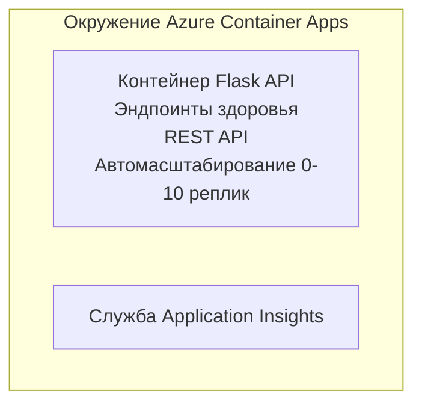

# Простой Flask API - пример приложения в контейнере

**Учебный курс:** Начинающий ⭐ | **Время:** 25-35 минут | **Стоимость:** 0-15 $/месяц

Полный, рабочий REST API на Python Flask, развернутый в Azure Container Apps с использованием Azure Developer CLI (azd). В этом примере демонстрируется развертывание контейнера, базовые настройки авто-масштабирования и мониторинга.

## 🎯 Чему вы научитесь

- Развертывать контейнированное Python-приложение в Azure  
- Настраивать авто-масштабирование с масштабированием до нуля  
- Реализовывать проверки здоровья и готовности  
- Мониторить логи и метрики приложения  
- Использовать Azure Developer CLI для быстрой публикации  

## 📦 Что входит

✅ **Приложение Flask** - полный REST API с операциями CRUD (`src/app.py`)  
✅ **Dockerfile** - конфигурация контейнера, готовая для продакшена  
✅ **Bicep инфраструктура** - среда Container Apps и развертывание API  
✅ **Конфигурация AZD** - настройка развертывания одной командой  
✅ **Проверки здоровья** - настроены проверки жизнеспособности и готовности  
✅ **Авто-масштабирование** - от 0 до 10 реплик в зависимости от нагрузки HTTP  

## Архитектура



## Предварительные требования

### Обязательно
- **Azure Developer CLI (azd)** - [Руководство по установке](https://learn.microsoft.com/azure/developer/azure-developer-cli/install-azd)
- **Подписка Azure** - [Бесплатный аккаунт](https://azure.microsoft.com/free/)
- **Docker Desktop** - [Установить Docker](https://www.docker.com/products/docker-desktop/) (для локального тестирования)

### Проверка предварительных требований

```bash
# Проверьте версию azd (требуется 1.5.0 или выше)
azd version

# Проверьте вход в Azure
azd auth login

# Проверьте Docker (необязательно, для локального тестирования)
docker --version
```

## ⏱️ Временная шкала развертывания

| Этап | Длительность | Что происходит |
|-------|----------|--------------||
| Создание среды | 30 секунд | Создается среда azd |
| Сборка контейнера | 2-3 минуты | Сборка Docker образа Flask приложения |
| Развертывание инфраструктуры | 3-5 минут | Создание Container Apps, реестра, мониторинга |
| Развертывание приложения | 2-3 минуты | Публикация образа и развертывание в Container Apps |
| **Итого** | **8-12 минут** | Полное готовое к работе развертывание |

## Быстрый старт

```bash
# Перейти к примеру
cd examples/container-app/simple-flask-api

# Инициализировать окружение (выбрать уникальное имя)
azd env new myflaskapi

# Развернуть всё (инфраструктуру + приложение)
azd up
# Вам будет предложено:
# 1. Выбрать подписку Azure
# 2. Выбрать регион (например, eastus2)
# 3. Подождать 8-12 минут для развертывания

# Получите вашу конечную точку API
azd env get-values

# Протестируйте API
curl $(azd env get-value API_ENDPOINT)/health
```

**Ожидаемый результат:**  
```json
{
  "status": "healthy",
  "timestamp": "2025-11-19T10:30:00Z",
  "service": "simple-flask-api",
  "version": "1.0.0"
}
```

## ✅ Проверка развертывания

### Шаг 1: Проверка статуса развертывания

```bash
# Просмотр развернутых сервисов
azd show

# Ожидаемый результат показывает:
# - Сервис: api
# - Конечная точка: https://ca-api-[env].xxx.azurecontainerapps.io
# - Статус: Запущен
```

### Шаг 2: Тестирование API эндпоинтов

```bash
# Получить конечную точку API
API_URL=$(azd env get-value API_ENDPOINT)

# Проверить состояние
curl $API_URL/health

# Проверить корневую конечную точку
curl $API_URL/

# Создать элемент
curl -X POST $API_URL/api/items \
  -H "Content-Type: application/json" \
  -d '{"name": "Test Item", "description": "My first item"}'

# Получить все элементы
curl $API_URL/api/items
```

**Критерии успеха:**
- ✅ Эндпоинт здоровья возвращает HTTP 200  
- ✅ Корневой эндпоинт показывает информацию об API  
- ✅ POST создаёт элемент и возвращает HTTP 201  
- ✅ GET возвращает созданные элементы  

### Шаг 3: Просмотр логов

```bash
# В режиме реального времени выводить логи с помощью azd monitor
azd monitor --logs

# Или используйте Azure CLI:
az containerapp logs show --name api --resource-group $RG_NAME --follow

# Вы должны увидеть:
# - Сообщения запуска Gunicorn
# - Логи HTTP-запросов
# - Логи информации о приложении
```

## Структура проекта

```
simple-flask-api/
├── azure.yaml              # AZD configuration
├── infra/
│   ├── main.bicep         # Main infrastructure
│   ├── main.parameters.json
│   └── app/
│       ├── container-env.bicep
│       └── api.bicep
└── src/
    ├── app.py             # Flask application
    ├── requirements.txt
    └── Dockerfile
```

## Эндпоинты API

| Эндпоинт | Метод | Описание |
|----------|--------|-------------|
| `/health` | GET | Проверка здоровья |
| `/api/items` | GET | Получить список всех элементов |
| `/api/items` | POST | Создать новый элемент |
| `/api/items/{id}` | GET | Получить конкретный элемент |
| `/api/items/{id}` | PUT | Обновить элемент |
| `/api/items/{id}` | DELETE | Удалить элемент |

## Конфигурация

### Переменные окружения

```bash
# Установить пользовательскую конфигурацию
azd env set PORT 8000
azd env set LOG_LEVEL info
azd env set MAX_REPLICAS 20
```

### Настройка масштабирования

API автоматически масштабируется в зависимости от HTTP-трафика:
- **Минимальное количество реплик**: 0 (масштабируется до нуля при простое)  
- **Максимальное количество реплик**: 10  
- **Одновременные запросы на реплику**: 50  

## Разработка

### Запуск локально

```bash
# Установить зависимости
cd src
pip install -r requirements.txt

# Запустить приложение
python app.py

# Тестировать локально
curl http://localhost:8000/health
```

### Сборка и тест контейнера

```bash
# Собрать Docker-образ
docker build -t flask-api:local ./src

# Запустить контейнер локально
docker run -p 8000:8000 flask-api:local

# Протестировать контейнер
curl http://localhost:8000/health
```

## Развертывание

### Полное развертывание

```bash
# Развернуть инфраструктуру и приложение
azd up
```

### Развертывание только кода

```bash
# Развертывать только код приложения (инфраструктура без изменений)
azd deploy api
```

### Обновление конфигурации

```bash
# Обновить переменные окружения
azd env set API_KEY "new-api-key"

# Повторно развернуть с новой конфигурацией
azd deploy api
```

## Мониторинг

### Просмотр логов

```bash
# Просмотр живых журналов с помощью azd monitor
azd monitor --logs

# Или используйте Azure CLI для Container Apps:
az containerapp logs show --name api --resource-group $RG_NAME --follow

# Просмотр последних 100 строк
az containerapp logs show --name api --resource-group $RG_NAME --tail 100
```

### Мониторинг метрик

```bash
# Открыть панель мониторинга Azure Monitor
azd monitor --overview

# Просмотреть конкретные метрики
az monitor metrics list \
  --resource $(azd show --output json | jq -r '.services.api.resourceId') \
  --metric "Requests,ResponseTime"
```

## Тестирование

### Проверка здоровья

```bash
curl $(azd show --output json | jq -r '.services.api.endpoint')/health
```

Ожидаемый ответ:  
```json
{
  "status": "healthy",
  "timestamp": "2025-11-19T10:30:00Z"
}
```

### Создание элемента

```bash
curl -X POST $(azd show --output json | jq -r '.services.api.endpoint')/api/items \
  -H "Content-Type: application/json" \
  -d '{"name": "Test Item", "description": "A test item"}'
```

### Получение всех элементов

```bash
curl $(azd show --output json | jq -r '.services.api.endpoint')/api/items
```

## Оптимизация затрат

Это развертывание использует масштабирование до нуля, поэтому вы платите только когда API обрабатывает запросы:

- **Стоимость простоя**: ~0 $/месяц (масштабировано до нуля)  
- **Стоимость активности**: ~0.000024 $/секунду за реплику  
- **Ожидаемая ежемесячная стоимость** (при небольшой нагрузке): 5-15 $  

### Дополнительное снижение затрат

```bash
# Уменьшить максимальное количество реплик для разработки
azd env set MAX_REPLICAS 3

# Использовать более короткий тайм-аут простоя
azd env set SCALE_TO_ZERO_TIMEOUT 300  # 5 минут
```

## Устранение неполадок

### Контейнер не запускается

```bash
# Проверьте логи контейнера с помощью Azure CLI
az containerapp logs show --name api --resource-group $RG_NAME --tail 100

# Проверьте сборку Docker-образа локально
docker build -t test ./src
```

### API недоступен

```bash
# Проверьте, что входящий трафик является внешним
az containerapp show --name api --resource-group rg-simple-flask-api \
  --query properties.configuration.ingress.external
```

### Высокое время отклика

```bash
# Проверить использование ЦП/памяти
az monitor metrics list \
  --resource $(azd show --output json | jq -r '.services.api.resourceId') \
  --metric "CPUPercentage,MemoryPercentage"

# Масштабировать ресурсы при необходимости
az containerapp update --name api --resource-group rg-simple-flask-api \
  --cpu 1.0 --memory 2Gi
```

## Очистка ресурсов

```bash
# Удалить все ресурсы
azd down --force --purge
```

## Следующие шаги

### Расширение этого примера

1. **Добавить базу данных** - интеграция с Azure Cosmos DB или SQL Database  
   ```bash
   # Добавить модуль Cosmos DB в infra/main.bicep
   # Обновить app.py с подключением к базе данных
   ```

2. **Добавить аутентификацию** - реализация Microsoft Entra ID или API ключей  
   ```python
   # Добавьте промежуточное ПО аутентификации в app.py
   from functools import wraps
   ```

3. **Настроить CI/CD** - workflow GitHub Actions  
   ```yaml
   # Create .github/workflows/deploy.yml
   name: Deploy to Azure
   on: [push]
   ```

4. **Добавить управляемую идентичность** - безопасный доступ к сервисам Azure  
   ```bicep
   # Update infra/app/api.bicep
   identity: { type: 'SystemAssigned' }
   ```

### Связанные примеры

- **[Database App](../../../../../examples/database-app)** - полный пример с SQL Database  
- **[Microservices](../../../../../examples/container-app/microservices)** - много-сервисная архитектура  
- **[Container Apps Master Guide](../README.md)** - все шаблоны для контейнеров  

### Учебные материалы

- 📚 [Курс AZD для начинающих](../../../README.md) - главная страница курса  
- 📚 [Паттерны Container Apps](../README.md) - больше шаблонов развертывания  
- 📚 [Галерея шаблонов AZD](https://azure.github.io/awesome-azd/) - шаблоны сообщества  

## Дополнительные ресурсы

### Документация  
- **[Документация Flask](https://flask.palletsprojects.com/)** - руководство по Flask  
- **[Azure Container Apps](https://learn.microsoft.com/azure/container-apps/)** - официальная документация Azure  
- **[Azure Developer CLI](https://learn.microsoft.com/azure/developer/azure-developer-cli/)** - справочник по командам azd  

### Туториалы  
- **[Быстрый старт Container Apps](https://learn.microsoft.com/azure/container-apps/quickstart-portal)** - разверните ваше первое приложение  
- **[Python в Azure](https://learn.microsoft.com/azure/developer/python/)** - руководство по разработке на Python  
- **[Язык Bicep](https://learn.microsoft.com/azure/azure-resource-manager/bicep/)** - инфраструктура как код  

### Инструменты  
- **[Портал Azure](https://portal.azure.com)** - визуальное управление ресурсами  
- **[Расширение VS Code для Azure](https://marketplace.visualstudio.com/items?itemName=ms-azuretools.vscode-azurecontainerapps)** - интеграция в IDE  

---

**🎉 Поздравляем!** Вы успешно развернули продакшен-готовый Flask API в Azure Container Apps с авто-масштабированием и мониторингом.

**Вопросы?** [Откройте issue](https://github.com/microsoft/AZD-for-beginners/issues) или посмотрите [FAQ](../../../resources/faq.md)

---

<!-- CO-OP TRANSLATOR DISCLAIMER START -->
**Отказ от ответственности**:
Этот документ был переведен с использованием сервиса машинного перевода [Co-op Translator](https://github.com/Azure/co-op-translator). Несмотря на наши усилия по обеспечению точности, имейте в виду, что автоматический перевод может содержать ошибки или неточности. Оригинальный документ на его исходном языке следует считать авторитетным источником. Для получения критически важной информации рекомендуется обратиться к профессиональному человеческому переводу. Мы не несем ответственности за любые недоразумения или неправильные толкования, возникшие в результате использования этого перевода.
<!-- CO-OP TRANSLATOR DISCLAIMER END -->