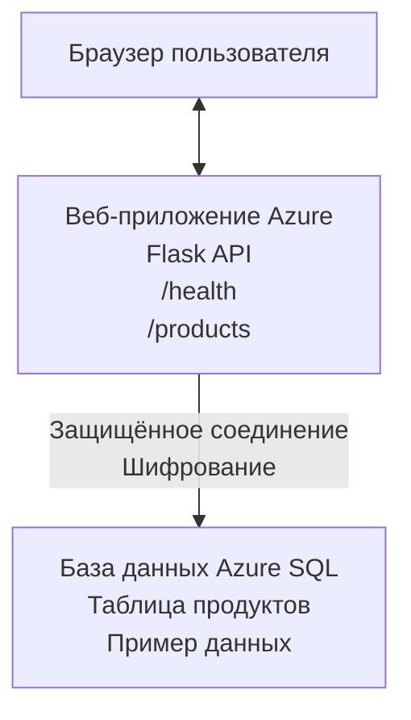

# Развертывание базы данных Microsoft SQL и веб-приложения с помощью AZD

⏱️ **Оценочное время**: 20-30 минут | 💰 **Оценочная стоимость**: ~$15-25/месяц | ⭐ **Сложность**: Средний уровень

Этот **полный рабочий пример** демонстрирует, как использовать [Azure Developer CLI (azd)](https://learn.microsoft.com/azure/developer/azure-developer-cli/) для развертывания веб-приложения на Python Flask с базой данных Microsoft SQL в Azure. Весь код включён и протестирован — внешние зависимости не требуются.

## Что вы узнаете

Выполнив этот пример, вы:
- Развернете многоуровневое приложение (веб-приложение + база данных) с помощью инфраструктуры как кода
- Настроите безопасные подключения к базе данных без захардкоженных секретов
- Отслеживаете состояние приложения с помощью Application Insights
- Эффективно управляете ресурсами Azure с помощью AZD CLI
- Следуете лучшим практикам Azure по безопасности, оптимизации затрат и наблюдаемости

## Обзор сценария
- **Веб-приложение**: REST API на Python Flask с подключением к базе данных
- **База данных**: Azure SQL Database с примерными данными
- **Инфраструктура**: Создается с помощью Bicep (модули, шаблоны для повторного использования)
- **Развертывание**: Полностью автоматизировано через команды `azd`
- **Мониторинг**: Application Insights для журналов и телеметрии

## Предварительные требования

### Необходимые инструменты

Перед началом убедитесь, что у вас установлены следующие инструменты:

1. **[Azure CLI](https://learn.microsoft.com/cli/azure/install-azure-cli)** (версия 2.50.0 или выше)
   ```sh
   az --version
   # Ожидаемый вывод: azure-cli 2.50.0 или выше
   ```

2. **[Azure Developer CLI (azd)](https://learn.microsoft.com/azure/developer/azure-developer-cli/install-azd)** (версия 1.0.0 или выше)
   ```sh
   azd version
   # Ожидаемый вывод: azd версии 1.0.0 или выше
   ```

3. **[Python 3.8+](https://www.python.org/downloads/)** (для локальной разработки)
   ```sh
   python --version
   # Ожидаемый результат: Python 3.8 или выше
   ```

4. **[Docker](https://www.docker.com/get-started)** (опционально, для локальной контейнерной разработки)
   ```sh
   docker --version
   # Ожидаемый вывод: версия Docker 20.10 или выше
   ```

### Требования Azure

- Активная **подписка Azure** ([создайте бесплатный аккаунт](https://azure.microsoft.com/free/))
- Права на создание ресурсов в вашей подписке
- Роль **Владелец** или **Участник** на уровне подписки или группы ресурсов

### Требования к знаниям

Это пример **среднего уровня**. Вы должны быть знакомы с:
- Основами командной строки
- Основными понятиями облака (ресурсы, группы ресурсов)
- Базовым пониманием веб-приложений и баз данных

**Новичок в AZD?** Начните с [руководства по началу работы](../../docs/chapter-01-foundation/azd-basics.md).

## Архитектура

В этом примере развертывается двухуровневая архитектура с веб-приложением и базой данных SQL:



**Развертываемые ресурсы:**
- **Группа ресурсов**: Контейнер для всех ресурсов
- **План обслуживания приложений**: Хостинг на Linux (уровень B1 для экономии)
- **Веб-приложение**: Среда выполнения Python 3.11 с приложением Flask
- **SQL-сервер**: Управляемый сервер баз данных с TLS 1.2 минимум
- **SQL-база данных**: Базовый уровень (2 ГБ, подходит для разработки/тестирования)
- **Application Insights**: Мониторинг и регистрация
- **Рабочая область Log Analytics**: Централизованное хранилище логов

**Аналогия**: Представьте ресторан (веб-приложение) с морозильной камерой (база данных). Клиенты делают заказ из меню (API), а кухня (приложение Flask) достает ингредиенты (данные) из морозилки. Менеджер ресторана (Application Insights) отслеживает всё, что происходит.

## Структура папок

Все файлы включены в пример — внешние зависимости не требуются:

```
examples/database-app/
│
├── README.md                    # This file
├── azure.yaml                   # AZD configuration file
├── .env.sample                  # Sample environment variables
├── .gitignore                   # Git ignore patterns
│
├── infra/                       # Infrastructure as Code (Bicep)
│   ├── main.bicep              # Main orchestration template
│   ├── abbreviations.json      # Azure naming conventions
│   └── resources/              # Modular resource templates
│       ├── sql-server.bicep    # SQL Server configuration
│       ├── sql-database.bicep  # Database configuration
│       ├── app-service-plan.bicep  # Hosting plan
│       ├── app-insights.bicep  # Monitoring setup
│       └── web-app.bicep       # Web application
│
└── src/
    └── web/                    # Application source code
        ├── app.py              # Flask REST API
        ├── requirements.txt    # Python dependencies
        └── Dockerfile          # Container definition
```

**Назначение каждого файла:**
- **azure.yaml**: Указывает AZD, что и куда развертывать
- **infra/main.bicep**: Оркестрирует все ресурсы Azure
- **infra/resources/*.bicep**: Отдельные определения ресурсов (модули для повторного использования)
- **src/web/app.py**: Приложение Flask с логикой базы данных
- **requirements.txt**: Зависимости Python пакетов
- **Dockerfile**: Инструкции по контейнеризации для развертывания

## Быстрый старт (по шагам)

### Шаг 1: Клонировать и перейти в каталог

```sh
git clone https://github.com/microsoft/AZD-for-beginners.git
cd AZD-for-beginners/examples/database-app
```

**✓ Проверка успешности**: Убедитесь, что видите `azure.yaml` и папку `infra/`:
```sh
ls
# Ожидается: README.md, azure.yaml, infra/, src/
```

### Шаг 2: Аутентификация в Azure

```sh
azd auth login
```

Это откроет ваш браузер для входа в Azure. Авторизуйтесь с помощью ваших учетных данных Azure.

**✓ Проверка успешности**: Вы должны увидеть:
```
Logged in to Azure.
```

### Шаг 3: Инициализация окружения

```sh
azd init
```

**Что происходит**: AZD создает локальную конфигурацию для вашего развертывания.

**Запросы, которые увидите**:
- **Имя окружения**: Введите короткое имя (например, `dev`, `myapp`)
- **Подписка Azure**: Выберите подписку из списка
- **Регион Azure**: Выберите регион (например, `eastus`, `westeurope`)

**✓ Проверка успешности**: Вы должны увидеть:
```
SUCCESS: New project initialized!
```

### Шаг 4: Создание ресурсов Azure

```sh
azd provision
```

**Что происходит**: AZD развертывает всю инфраструктуру (занимает 5-8 минут):
1. Создает группу ресурсов
2. Создает SQL Server и базу данных
3. Создает план обслуживания приложений
4. Создает веб-приложение
5. Создает Application Insights
6. Настраивает сеть и безопасность

**Вас попросят ввести**:
- **Имя администратора SQL**: Введите имя пользователя (например, `sqladmin`)
- **Пароль администратора SQL**: Введите надежный пароль (обязательно сохраните!)

**✓ Проверка успешности**: Вы должны увидеть:
```
SUCCESS: Your application was provisioned in Azure in X minutes Y seconds.
You can view the resources created under the resource group rg-<env-name> in Azure Portal:
https://portal.azure.com/#@/resource/subscriptions/.../resourceGroups/rg-<env-name>
```

**⏱️ Время**: 5-8 минут

### Шаг 5: Развертывание приложения

```sh
azd deploy
```

**Что происходит**: AZD собирает и развертывает ваше Flask-приложение:
1. Упаковывает Python приложение
2. Строит Docker контейнер
3. Загружает в Azure Web App
4. Инициализирует базу данных примерными данными
5. Запускает приложение

**✓ Проверка успешности**: Вы должны увидеть:
```
SUCCESS: Your application was deployed to Azure in X minutes Y seconds.
You can view the resources created under the resource group rg-<env-name> in Azure Portal:
https://portal.azure.com/#@/resource/subscriptions/.../resourceGroups/rg-<env-name>
```

**⏱️ Время**: 3-5 минут

### Шаг 6: Просмотр приложения в браузере

```sh
azd browse
```

Откроется ваше развернутое веб-приложение в браузере по адресу `https://app-<unique-id>.azurewebsites.net`

**✓ Проверка успешности**: Вы увидите вывод в формате JSON:
```json
{
  "message": "Welcome to the Database App API",
  "endpoints": {
    "/": "This help message",
    "/health": "Health check endpoint",
    "/products": "List all products",
    "/products/<id>": "Get product by ID"
  }
}
```

### Шаг 7: Тестирование API

**Проверка здоровья** (проверка подключения к базе):
```sh
curl https://app-<your-id>.azurewebsites.net/health
```

**Ожидаемый ответ**:
```json
{
  "status": "healthy",
  "database": "connected"
}
```

**Список продуктов** (пример данных):
```sh
curl https://app-<your-id>.azurewebsites.net/products
```

**Ожидаемый ответ**:
```json
[
  {
    "id": 1,
    "name": "Laptop",
    "description": "High-performance laptop",
    "price": 1299.99,
    "created_at": "2025-11-19T10:30:00"
  },
  ...
]
```

**Получить один продукт**:
```sh
curl https://app-<your-id>.azurewebsites.net/products/1
```

**✓ Проверка успешности**: Все эндпоинты возвращают данные в формате JSON без ошибок.

---

**🎉 Поздравляем!** Вы успешно развернули веб-приложение с базой данных в Azure с помощью AZD.

## Подробности конфигурации

### Переменные окружения

Секреты управляются безопасно через конфигурацию Azure App Service — **никогда не захардкожены в исходном коде**.

**Автоматически настроено AZD**:
- `SQL_CONNECTION_STRING`: Строка подключения к базе с зашифрованными учетными данными
- `APPLICATIONINSIGHTS_CONNECTION_STRING`: Точка телеметрии мониторинга
- `SCM_DO_BUILD_DURING_DEPLOYMENT`: Включает автоматическую установку зависимостей

**Где хранятся секреты**:
1. При `azd provision` вы вводите учетные данные SQL через безопасные подсказки
2. AZD сохраняет их в локальном файле `.azure/<env-name>/.env` (файл игнорируется Git)
3. AZD внедряет их в конфигурацию Azure App Service (шифруется в состоянии покоя)
4. Приложение читает их через `os.getenv()` во время выполнения

### Локальная разработка

Для локального тестирования создайте `.env` файл из примера:

```sh
cp .env.sample .env
# Отредактируйте файл .env, указав подключение к вашей локальной базе данных
```

**Рабочий процесс локальной разработки**:
```sh
# Установить зависимости
cd src/web
pip install -r requirements.txt

# Установить переменные окружения
export SQL_CONNECTION_STRING="your-local-connection-string"

# Запустить приложение
python app.py
```

**Тестирование локально**:
```sh
curl http://localhost:8000/health
# Ожидается: {"status": "healthy", "database": "connected"}
```

### Инфраструктура как код

Все ресурсы Azure определены в **Bicep шаблонах** (папка `infra/`):

- **Модульный дизайн**: Каждый тип ресурса в отдельном файле для повторного использования
- **Параметризация**: Настроить SKU, регионы, правила именования
- **Лучшие практики**: Соответствие стандартам Azure по именованию и безопасности
- **Контроль версий**: Изменения инфраструктуры отслеживаются в Git

**Пример настройки**:
Чтобы изменить уровень базы данных, отредактируйте `infra/resources/sql-database.bicep`:
```bicep
sku: {
  name: 'Standard'  // Changed from 'Basic'
  tier: 'Standard'
  capacity: 10
}
```

## Лучшие практики безопасности

Этот пример следует лучшим практикам безопасности Azure:

### 1. **Нет секретов в исходном коде**
- ✅ Учетные данные хранятся в конфигурации Azure App Service (зашифрованы)
- ✅ `.env` файлы исключены из Git через `.gitignore`
- ✅ Секреты передаются через безопасные параметры при развертывании

### 2. **Шифрованные соединения**
- ✅ TLS 1.2 минимум для SQL Server
- ✅ Обязательный HTTPS для веб-приложения
- ✅ Использование зашифрованных каналов для подключений к базе

### 3. **Сетевая безопасность**
- ✅ Фаервол SQL Server настроен только для служб Azure
- ✅ Доступ из публичной сети ограничен (можно дополнительно заблокировать через Private Endpoints)
- ✅ FTPS отключён на веб-приложении

### 4. **Аутентификация и авторизация**
- ⚠️ **Текущая**: SQL аутентификация (имя пользователя/пароль)
- ✅ **Для продакшена**: Используйте управляемую идентичность Azure для аутентификации без пароля

**Чтобы перейти на управляемую идентичность** (для продакшена):
1. Включите управляемую идентичность для веб-приложения
2. Предоставьте этой идентичности права на SQL
3. Обновите строку подключения для использования управляемой идентичности
4. Удалите аутентификацию по паролю

### 5. **Аудит и соответствие**
- ✅ Application Insights логирует все запросы и ошибки
- ✅ Включен аудит SQL Database (можно настроить для соответствия)
- ✅ Все ресурсы помечены тегами для управления

**Контрольный список безопасности перед продакшеном**:
- [ ] Включить Azure Defender для SQL
- [ ] Настроить Private Endpoints для SQL Database
- [ ] Включить Web Application Firewall (WAF)
- [ ] Использовать Azure Key Vault для ротации секретов
- [ ] Настроить аутентификацию Microsoft Entra ID
- [ ] Включить диагностическое логирование для всех ресурсов

## Оптимизация стоимости

**Оценочная ежемесячная стоимость** (на ноябрь 2025):

| Ресурс | SKU/Уровень | Оценочная стоимость |
|----------|----------|----------------|
| План обслуживания приложений | B1 (Базовый) | ~$13/месяц |
| SQL Database | Базовый (2 ГБ) | ~$5/месяц |
| Application Insights | Оплата по факту | ~$2/месяц (низкий трафик) |
| **Итого** | | **~$20/месяц** |

**💡 Советы по экономии:**

1. **Используйте бесплатный уровень для обучения**:
   - App Service: уровень F1 (бесплатно, ограниченные часы)
   - SQL Database: используйте serverless Azure SQL Database
   - Application Insights: 5 ГБ/месяц бесплатного приема данных

2. **Останавливайте ресурсы, когда не используете**:
   ```sh
   # Остановить веб-приложение (база данных всё ещё начисляет плату)
   az webapp stop --name <app-name> --resource-group <rg-name>
   
   # Перезапускать при необходимости
   az webapp start --name <app-name> --resource-group <rg-name>
   ```

3. **Удаляйте всё после тестирования**:
   ```sh
   azd down
   ```
   Это удалит ВСЕ ресурсы и прекратит начисление платы.

4. **SKU для разработки и продакшена**:
   - **Для разработки**: Базовый уровень (как в этом примере)
   - **Для продакшена**: Стандартный/Премиум уровень с избыточностью

**Мониторинг затрат**:
- Просматривайте расходы в [Azure Cost Management](https://portal.azure.com/#view/Microsoft_Azure_CostManagement)
- Настройте оповещения по затратам, чтобы избежать неожиданных счетов
- Помечайте все ресурсы тегом `azd-env-name` для отслеживания

**Альтернатива бесплатного уровня**:
Для учебных целей можно изменить `infra/resources/app-service-plan.bicep`:
```bicep
sku: {
  name: 'F1'  // Free tier
  tier: 'Free'
}
```
**Примечание**: Бесплатный уровень имеет ограничения (60 мин/день CPU, нет всегда включенного режима).

## Мониторинг и наблюдаемость

### Интеграция Application Insights

В примере используется **Application Insights** для всестороннего мониторинга:

**Что отслеживается**:
- ✅ HTTP-запросы (задержки, коды статусов, эндпоинты)
- ✅ Ошибки и исключения приложения
- ✅ Пользовательские логи из Flask-приложения
- ✅ Состояние подключения к базе данных
- ✅ Метрики производительности (CPU, память)

**Доступ к Application Insights**:
1. Откройте [Azure Portal](https://portal.azure.com)
2. Перейдите в группу ресурсов (`rg-<env-name>`)
3. Нажмите на ресурс Application Insights (`appi-<unique-id>`)

**Полезные запросы** (Application Insights → Логи):

**Просмотр всех запросов**:
```kusto
requests
| where timestamp > ago(1h)
| order by timestamp desc
| project timestamp, name, url, resultCode, duration
```

**Поиск ошибок**:
```kusto
exceptions
| where timestamp > ago(24h)
| order by timestamp desc
| project timestamp, type, outerMessage, operation_Name
```

**Проверка эндпоинта здоровья**:
```kusto
requests
| where name contains "health"
| summarize count() by resultCode, bin(timestamp, 1h)
```

### Аудит SQL Database

**Аудит SQL Database включен** для отслеживания:
- Паттерны доступа к базе
- Неудачные попытки входа
- Изменения схемы
- Доступ к данным (для соответствия)

**Доступ к журналам аудита**:
1. Azure Portal → SQL Database → Аудит
2. Просмотр логов в Log Analytics workspace

### Мониторинг в реальном времени

**Просмотр live-метрик**:
1. Application Insights → Live Metrics
2. Просмотрите обращения, ошибки и производительность в реальном времени

**Настройка оповещений**:
Создайте оповещения для критических событий:
- Ошибки HTTP 500 > 5 за 5 минут
- Ошибки подключения к базе данных
- Высокое время отклика (>2 секунд)

**Пример создания оповещения**:
```sh
az monitor metrics alert create \
  --name "High-Response-Time" \
  --resource-group <rg-name> \
  --scopes <app-insights-resource-id> \
  --condition "avg requests/duration > 2000" \
  --description "Alert when response time exceeds 2 seconds"
```

## Устранение неполадок
### Общие проблемы и решения

#### 1. Ошибка `azd provision` с сообщением "Location not available"

**Симптом**:  
```
Error: The subscription is not registered for the resource type 'components' in the location 'centralus'.
```
  
**Решение**:  
Выберите другой регион Azure или зарегистрируйте поставщика ресурсов:  
```sh
az provider register --namespace Microsoft.Insights
```
  
#### 2. Ошибка подключения к SQL во время развертывания

**Симптом**:  
```
pyodbc.OperationalError: ('08001', '[08001] [Microsoft][ODBC Driver 18 for SQL Server]TCP Provider...')
```
  
**Решение**:  
- Проверьте, что брандмауэр SQL Server разрешает службы Azure (автоматически настроено)  
- Убедитесь, что пароль администратора SQL введён верно при выполнении `azd provision`  
- Убедитесь, что SQL Server полностью настроен (может занять 2-3 минуты)

**Проверка подключения**:  
```sh
# В портале Azure перейдите в SQL Database → Редактор запросов
# Попробуйте подключиться с вашими учетными данными
```
  
#### 3. Веб-приложение показывает "Application Error"

**Симптом**:  
Браузер показывает общую страницу ошибки.

**Решение**:  
Проверьте логи приложения:  
```sh
# Просмотреть последние журналы
az webapp log tail --name <app-name> --resource-group <rg-name>
```
  
**Распространённые причины**:  
- Отсутствие переменных окружения (проверьте App Service → Конфигурация)  
- Ошибка установки пакетов Python (проверьте логи развертывания)  
- Ошибка инициализации базы данных (проверьте подключение к SQL)

#### 4. Ошибка при `azd deploy` с сообщением "Build Error"

**Симптом**:  
```
Error: Failed to build project
```
  
**Решение**:  
- Убедитесь, что в `requirements.txt` нет синтаксических ошибок  
- Проверьте, что Python 3.11 указан в `infra/resources/web-app.bicep`  
- Удостоверьтесь, что Dockerfile использует правильный базовый образ

**Отладка локально**:  
```sh
cd src/web
docker build -t test-app .
docker run -p 8000:8000 test-app
```
  
#### 5. "Unauthorized" при выполнении команд AZD

**Симптом**:  
```
ERROR: (Unauthorized) The client '<id>' with object id '<id>' does not have authorization
```
  
**Решение**:  
Повторно выполните аутентификацию в Azure:  
```sh
# Требуется для рабочих процессов AZD
azd auth login

# Необязательно, если вы также используете команды Azure CLI напрямую
az login
```
  
Убедитесь, что у вас есть нужные права (роль Contributor) на подписке.

#### 6. Высокие расходы на базу данных

**Симптом**:  
Неожиданный счёт от Azure.

**Решение**:  
- Проверьте, не забыли ли вы выполнить `azd down` после тестирования  
- Убедитесь, что SQL Database использует уровень Basic (не Premium)  
- Просмотрите расходы в Azure Cost Management  
- Настройте оповещения о расходах

### Получение помощи

**Просмотреть все переменные окружения AZD**:  
```sh
azd env get-values
```
  
**Проверить статус развертывания**:  
```sh
az webapp show --name <app-name> --resource-group <rg-name> --query state
```
  
**Доступ к логам приложения**:  
```sh
az webapp log download --name <app-name> --resource-group <rg-name> --log-file app-logs.zip
```
  
**Нужна дополнительная помощь?**  
- [Руководство по устранению неполадок AZD](../../docs/chapter-07-troubleshooting/common-issues.md)  
- [Устранение неполадок Azure App Service](https://learn.microsoft.com/azure/app-service/troubleshoot-diagnostic-logs)  
- [Устранение неполадок Azure SQL](https://learn.microsoft.com/azure/azure-sql/database/troubleshoot-common-errors-issues)

## Практические упражнения

### Упражнение 1: Проверка развертывания (Начинающий)

**Цель**: Подтвердить, что все ресурсы развернуты и приложение работает.

**Шаги**:  
1. Выведите список всех ресурсов в группе ресурсов:  
   ```sh
   az resource list --resource-group rg-<env-name> --output table
   ```
   **Ожидается**: 6-7 ресурсов (Web App, SQL Server, SQL Database, App Service Plan, Application Insights, Log Analytics)

2. Проверьте все API эндпоинты:  
   ```sh
   curl https://app-<your-id>.azurewebsites.net/
   curl https://app-<your-id>.azurewebsites.net/health
   curl https://app-<your-id>.azurewebsites.net/products
   curl https://app-<your-id>.azurewebsites.net/products/1
   ```
   **Ожидается**: Все возвращают корректный JSON без ошибок

3. Проверьте Application Insights:  
   - Откройте Application Insights в портале Azure  
   - Перейдите в "Live Metrics"  
   - Обновите страницу веб-приложения в браузере  
   **Ожидается**: Появление запросов в режиме реального времени

**Критерии успеха**: Все 6-7 ресурсов существуют, все эндпоинты возвращают данные, Live Metrics показывает активность.

---

### Упражнение 2: Добавление нового API эндпоинта (Средний уровень)

**Цель**: Расширить Flask приложение новым эндпоинтом.

**Исходный код**: Текущие эндпоинты в `src/web/app.py`

**Шаги**:  
1. Отредактируйте `src/web/app.py` и добавьте новый эндпоинт после функции `get_product()`:  
   ```python
   @app.route('/products/search/<keyword>')
   def search_products(keyword):
       """Search products by name or description."""
       try:
           conn = get_db_connection()
           cursor = conn.cursor()
           cursor.execute(
               "SELECT id, name, description, price, created_at FROM products WHERE name LIKE ? OR description LIKE ?",
               (f'%{keyword}%', f'%{keyword}%')
           )
           
           products = []
           for row in cursor.fetchall():
               products.append({
                   'id': row[0],
                   'name': row[1],
                   'description': row[2],
                   'price': float(row[3]) if row[3] else None,
                   'created_at': row[4].isoformat() if row[4] else None
               })
           
           cursor.close()
           conn.close()
           
           logger.info(f"Search for '{keyword}' returned {len(products)} results")
           return jsonify(products), 200
           
       except Exception as e:
           logger.error(f"Error searching products: {str(e)}")
           return jsonify({'error': str(e)}), 500
   ```
  
2. Разверните обновлённое приложение:  
   ```sh
   azd deploy
   ```
  
3. Проверьте новый эндпоинт:  
   ```sh
   curl https://app-<your-id>.azurewebsites.net/products/search/laptop
   ```
   **Ожидается**: Возвращает продукты, соответствующие фильтру "laptop"

**Критерии успеха**: Новый эндпоинт работает, возвращает отфильтрованные результаты, данные отображаются в логах Application Insights.

---

### Упражнение 3: Добавление мониторинга и оповещений (Продвинутый уровень)

**Цель**: Настроить проактивный мониторинг с оповещениями.

**Шаги**:  
1. Создайте оповещение для ошибок HTTP 500:  
   ```sh
   # Получить идентификатор ресурса Application Insights
   AI_ID=$(az monitor app-insights component show \
     --app appi-<your-id> \
     --resource-group rg-<env-name> \
     --query id -o tsv)
   
   # Создать оповещение
   az monitor metrics alert create \
     --name "High-Error-Rate" \
     --resource-group rg-<env-name> \
     --scopes $AI_ID \
     --condition "count requests/failed > 5" \
     --window-size 5m \
     --evaluation-frequency 1m \
     --description "Alert when >5 failed requests in 5 minutes"
   ```
  
2. Вызовите оповещение, вызвав ошибки:  
   ```sh
   # Запрос несуществующего продукта
   for i in {1..10}; do curl https://app-<your-id>.azurewebsites.net/products/999; done
   ```
  
3. Проверьте сработало ли оповещение:  
   - Портал Azure → Alerts → Alert Rules  
   - Проверьте свою электронную почту (если настроено)

**Критерии успеха**: Правило оповещения создано, срабатывает при ошибках, уведомления получены.

---

### Упражнение 4: Изменения схемы базы данных (Продвинутый уровень)

**Цель**: Добавить новую таблицу и изменить приложение для её использования.

**Шаги**:  
1. Подключитесь к SQL Database через Query Editor в Azure Portal

2. Создайте новую таблицу `categories`:  
   ```sql
   CREATE TABLE categories (
       id INT PRIMARY KEY IDENTITY(1,1),
       name NVARCHAR(50) NOT NULL,
       description NVARCHAR(200)
   );
   
   INSERT INTO categories (name, description) VALUES
   ('Electronics', 'Electronic devices and accessories'),
   ('Office Supplies', 'Office equipment and supplies');
   
   -- Add category to products table
   ALTER TABLE products ADD category_id INT;
   UPDATE products SET category_id = 1; -- Set all to Electronics
   ```
  
3. Обновите `src/web/app.py` для включения информации о категориях в ответы

4. Разверните и протестируйте

**Критерии успеха**: Новая таблица существует, продукты показывают информацию о категории, приложение работает корректно.

---

### Упражнение 5: Реализация кеширования (Эксперт)

**Цель**: Добавить Azure Redis Cache для повышения производительности.

**Шаги**:  
1. Добавьте Redis Cache в `infra/main.bicep`  
2. Обновите `src/web/app.py`, чтобы кешировать запросы продуктов  
3. Измерьте улучшение производительности с помощью Application Insights  
4. Сравните время ответа до и после кеширования

**Критерии успеха**: Redis развернут, кеширование работает, время отклика улучшилось более чем на 50%.

**Подсказка**: Начните с [документации Azure Cache for Redis](https://learn.microsoft.com/azure/azure-cache-for-redis/).

---

## Очистка

Чтобы избежать постоянных расходов, удалите все ресурсы после завершения:

```sh
azd down
```
  
**Запрос подтверждения**:  
```
? Total resources to delete: 7, are you sure you want to continue? (y/N)
```
  
Введите `y` для подтверждения.

**✓ Проверка успешности**:  
- Все ресурсы удалены из Azure Portal  
- Нет постоянных расходов  
- Локальная папка `.azure/<env-name>` может быть удалена

**Альтернатива** (сохранить инфраструктуру, удалить данные):  
```sh
# Удалить только группу ресурсов (сохранить конфигурацию AZD)
az group delete --name rg-<env-name> --yes
```
  
## Узнать больше

### Связанная документация  
- [Документация Azure Developer CLI](https://learn.microsoft.com/azure/developer/azure-developer-cli/)  
- [Документация по Azure SQL Database](https://learn.microsoft.com/azure/azure-sql/database/)  
- [Документация по Azure App Service](https://learn.microsoft.com/azure/app-service/)  
- [Документация по Application Insights](https://learn.microsoft.com/azure/azure-monitor/app/app-insights-overview)  
- [Справочник по языку Bicep](https://learn.microsoft.com/azure/azure-resource-manager/bicep/)  

### Следующие шаги в этом курсе  
- **[Пример Container Apps](../../../../examples/container-app)**: Развертывание микросервисов с помощью Azure Container Apps  
- **[Руководство по интеграции ИИ](../../../../docs/ai-foundry)**: Добавление возможностей ИИ в ваше приложение  
- **[Лучшие практики развертывания](../../docs/chapter-04-infrastructure/deployment-guide.md)**: Паттерны для продакшен-развертывания  

### Продвинутые темы  
- **Управляемая идентичность**: Уберите пароли, используйте аутентификацию Microsoft Entra ID  
- **Приватные конечные точки**: Безопасное подключение к базе данных внутри виртуальной сети  
- **Интеграция CI/CD**: Автоматизация развертываний с GitHub Actions или Azure DevOps  
- **Мульти-среды**: Создание окружений для разработки, тестирования и продакшена  
- **Миграции базы данных**: Использование Alembic или Entity Framework для версионности схемы  

### Сравнение с другими подходами

**AZD против ARM Templates**:  
- ✅ AZD: Более высокий уровень абстракции, проще в использовании  
- ⚠️ ARM: Более подробный, управляемый на низком уровне

**AZD против Terraform**:  
- ✅ AZD: Нативный для Azure, интегрирован с сервисами Azure  
- ⚠️ Terraform: Поддержка мультиоблаков, более широкий экосистемный охват

**AZD против Azure Portal**:  
- ✅ AZD: Повторяемость, контроль версий, автоматизация  
- ⚠️ Portal: Ручное управление, сложно воспроизводимо

**Думайте об AZD как** о Docker Compose для Azure — упрощённая конфигурация для сложных развертываний.

---

## Часто задаваемые вопросы

**В: Можно ли использовать другой язык программирования?**  
О: Да! Замените `src/web/` на Node.js, C#, Go или любой другой язык. Обновите `azure.yaml` и Bicep соответственно.

**В: Как добавить больше баз данных?**  
О: Добавьте ещё один модуль SQL Database в `infra/main.bicep` или используйте PostgreSQL/MySQL из сервисов Azure Database.

**В: Можно ли использовать это для продакшена?**  
О: Это отправная точка. Для продакшен-окружения добавьте: управляемую идентичность, приватные конечные точки, отказоустойчивость, стратегию резервного копирования, WAF и расширенный мониторинг.

**В: Что если я хочу использовать контейнеры вместо развертывания кода?**  
О: Ознакомьтесь с [Примером Container Apps](../../../../examples/container-app), который полностью использует Docker контейнеры.

**В: Как подключиться к базе данных с локальной машины?**  
О: Добавьте ваш IP в брандмауэр SQL Server:  
```sh
az sql server firewall-rule create \
  --resource-group rg-<env-name> \
  --server sql-<unique-id> \
  --name AllowMyIP \
  --start-ip-address <your-ip> \
  --end-ip-address <your-ip>
```
  
**В: Можно ли использовать существующую базу данных вместо создания новой?**  
О: Да, измените `infra/main.bicep`, чтобы ссылаться на существующий SQL Server, и обновите параметры строки подключения.

---

> **Примечание:** Этот пример демонстрирует лучшие практики развертывания веб-приложения с базой данных с помощью AZD. Включает рабочий код, обширную документацию и практические упражнения для закрепления знаний. Для продакшен-развертываний рассмотрите вопросы безопасности, масштабирования, соответствия требованиям и затрат, специфичных для вашей организации.

**📚 Навигация по курсу:**  
- ← Предыдущий: [Пример Container Apps](../../../../examples/container-app)  
- → Следующий: [Руководство по интеграции ИИ](../../../../docs/ai-foundry)  
- 🏠 [Главная страница курса](../../README.md)

---

<!-- CO-OP TRANSLATOR DISCLAIMER START -->
**Отказ от ответственности**:
Этот документ был переведен с использованием сервиса машинного перевода [Co-op Translator](https://github.com/Azure/co-op-translator). Несмотря на наши усилия по обеспечению точности, имейте в виду, что автоматический перевод может содержать ошибки или неточности. Оригинальный документ на его исходном языке следует считать авторитетным источником. Для получения критически важной информации рекомендуется обратиться к профессиональному человеческому переводу. Мы не несем ответственности за любые недоразумения или неправильные толкования, возникшие в результате использования этого перевода.
<!-- CO-OP TRANSLATOR DISCLAIMER END -->