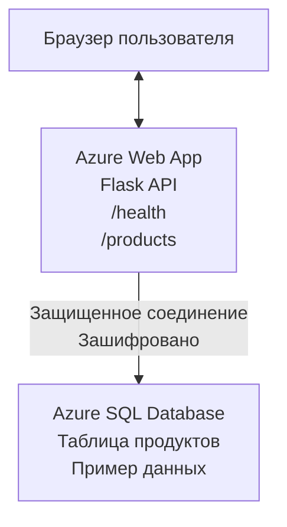

# Развертывание базы данных Microsoft SQL и веб-приложения с помощью AZD

⏱️ **Ориентировочное время**: 20-30 минут | 💰 **Ориентировочная стоимость**: ~$15-25/месяц | ⭐ **Сложность**: Средний уровень

Этот **полный, рабочий пример** демонстрирует, как использовать [Azure Developer CLI (azd)](https://learn.microsoft.com/azure/developer/azure-developer-cli/) для развертывания веб-приложения Python Flask с базой данных Microsoft SQL в Azure. Весь код включен и протестирован — внешние зависимости не требуются.

## Чему вы научитесь

Выполнив этот пример, вы сможете:
- Развернуть многоуровневое приложение (веб-приложение + база данных) с помощью инфраструктуры как кода
- Настроить безопасные подключения к базе данных без жесткого кодирования секретов
- Отслеживать состояние приложения с помощью Application Insights
- Эффективно управлять ресурсами Azure с помощью AZD CLI
- Следовать лучшим практикам Azure по безопасности, оптимизации затрат и наблюдаемости

## Обзор сценария
- **Веб-приложение**: Python Flask REST API с подключением к базе данных
- **База данных**: Azure SQL Database с примерными данными
- **Инфраструктура**: Развертывается с помощью Bicep (модульные, переиспользуемые шаблоны)
- **Развертывание**: Полностью автоматизировано через команды `azd`
- **Мониторинг**: Application Insights для логов и телеметрии

## Предварительные требования

### Необходимые инструменты

Перед началом убедитесь, что у вас установлены следующие инструменты:

1. **[Azure CLI](https://learn.microsoft.com/cli/azure/install-azure-cli)** (версия 2.50.0 или выше)
   ```sh
   az --version
   # Ожидаемый вывод: azure-cli 2.50.0 или выше
   ```

2. **[Azure Developer CLI (azd)](https://learn.microsoft.com/azure/developer/azure-developer-cli/install-azd)** (версия 1.0.0 или выше)
   ```sh
   azd version
   # Ожидаемый вывод: azd версия 1.0.0 или выше
   ```

3. **[Python 3.8+](https://www.python.org/downloads/)** (для локальной разработки)
   ```sh
   python --version
   # Ожидаемый результат: Python 3.8 или выше
   ```

4. **[Docker](https://www.docker.com/get-started)** (опционально, для локальной контейнеризированной разработки)
   ```sh
   docker --version
   # Ожидаемый результат: версия Docker 20.10 или выше
   ```

### Требования Azure

- Активная **подписка Azure** ([создать бесплатный аккаунт](https://azure.microsoft.com/free/))
- Разрешения на создание ресурсов в подписке
- Роль **Владелец** (Owner) или **Участник** (Contributor) на подписке или группе ресурсов

### Требуемые знания

Это пример **среднего уровня**. Вам следует знать:
- Основы работы с командной строкой
- Базовые концепции облаков (ресурсы, группы ресурсов)
- Основы веб-приложений и баз данных

**Новичок в AZD?** Начните с [руководства по началу работы](../../docs/chapter-01-foundation/azd-basics.md).

## Архитектура

В этом примере разворачивается двухуровневая архитектура с веб-приложением и базой данных SQL:


**Развертываемые ресурсы:**
- **Группа ресурсов**: Контейнер для всех ресурсов
- **План обслуживании приложений (App Service Plan)**: Linux-хостинг (уровень B1 для экономии)
- **Веб-приложение**: Python 3.11 с Flask
- **SQL Server**: Управляемый сервер базы данных с минимум TLS 1.2
- **SQL база данных**: Базовый уровень (2 ГБ, подходит для разработки/тестирования)
- **Application Insights**: Мониторинг и логирование
- **Рабочее пространство Log Analytics**: Централизованное хранилище логов

**Аналогия**: Представьте ресторан (веб-приложение) с холодильником (база данных). Клиенты делают заказ (API endpoints), кухня (приложение Flask) достает ингредиенты (данные) из холодильника. Менеджер ресторана (Application Insights) отслеживает все происходящее.

## Структура папок

Все файлы включены — внешние зависимости не требуются:

```
examples/database-app/
│
├── README.md                    # This file
├── azure.yaml                   # AZD configuration file
├── .env.sample                  # Sample environment variables
├── .gitignore                   # Git ignore patterns
│
├── infra/                       # Infrastructure as Code (Bicep)
│   ├── main.bicep              # Main orchestration template
│   ├── abbreviations.json      # Azure naming conventions
│   └── resources/              # Modular resource templates
│       ├── sql-server.bicep    # SQL Server configuration
│       ├── sql-database.bicep  # Database configuration
│       ├── app-service-plan.bicep  # Hosting plan
│       ├── app-insights.bicep  # Monitoring setup
│       └── web-app.bicep       # Web application
│
└── src/
    └── web/                    # Application source code
        ├── app.py              # Flask REST API
        ├── requirements.txt    # Python dependencies
        └── Dockerfile          # Container definition
```

**Назначение файлов:**
- **azure.yaml**: Определяет, что и где развертывать через AZD
- **infra/main.bicep**: Оркестрация всех ресурсов Azure
- **infra/resources/*.bicep**: Определения отдельных ресурсов (модули для переиспользования)
- **src/web/app.py**: Flask-приложение с логикой работы с БД
- **requirements.txt**: Зависимости Python
- **Dockerfile**: Инструкции по контейнеризации для развертывания

## Быстрый старт (пошагово)

### Шаг 1: Клонируйте репозиторий и перейдите в каталог

```sh
git clone https://github.com/microsoft/AZD-for-beginners.git
cd AZD-for-beginners/examples/database-app
```

**✓ Проверка успеха**: Убедитесь, что видны `azure.yaml` и папка `infra/`:
```sh
ls
# Ожидается: README.md, azure.yaml, infra/, src/
```

### Шаг 2: Аутентификация в Azure

```sh
azd auth login
```

Браузер откроется для входа в Azure. Выполните вход с вашими учетными данными.

**✓ Проверка успеха**: Вы должны увидеть:
```
Logged in to Azure.
```

### Шаг 3: Инициализация окружения

```sh
azd init
```

**Что происходит**: AZD создает локальную конфигурацию для развертывания.

**Запросы, которые вы увидите**:
- **Имя окружения**: Введите короткое имя (например, `dev`, `myapp`)
- **Подписка Azure**: Выберите подписку из списка
- **Регион Azure**: Выберите регион (например, `eastus`, `westeurope`)

**✓ Проверка успеха**: Вы должны увидеть:
```
SUCCESS: New project initialized!
```

### Шаг 4: Развертывание ресурсов Azure

```sh
azd provision
```

**Что происходит**: AZD разворачивает всю инфраструктуру (занимает 5-8 минут):
1. Создается группа ресурсов
2. Создается SQL Server и база данных
3. Создается план обслуживания приложений
4. Создается веб-приложение
5. Создается Application Insights
6. Настраивается сеть и безопасность

**Вам предложат ввести**:
- **Имя администратора SQL**: Введите имя пользователя (например, `sqladmin`)
- **Пароль администратора SQL**: Введите надежный пароль (сохраните его!)

**✓ Проверка успеха**: Вы должны увидеть:
```
SUCCESS: Your application was provisioned in Azure in X minutes Y seconds.
You can view the resources created under the resource group rg-<env-name> in Azure Portal:
https://portal.azure.com/#@/resource/subscriptions/.../resourceGroups/rg-<env-name>
```

**⏱️ Время**: 5-8 минут

### Шаг 5: Развертывание приложения

```sh
azd deploy
```

**Что происходит**: AZD собирает и развертывает ваше Flask-приложение:
1. Упаковывается Python-приложение
2. Строится Docker-контейнер
3. Загружается в Azure Web App
4. Инициализируется база данных примерными данными
5. Запускается приложение

**✓ Проверка успеха**: Вы должны увидеть:
```
SUCCESS: Your application was deployed to Azure in X minutes Y seconds.
You can view the resources created under the resource group rg-<env-name> in Azure Portal:
https://portal.azure.com/#@/resource/subscriptions/.../resourceGroups/rg-<env-name>
```

**⏱️ Время**: 3-5 минут

### Шаг 6: Открытие приложения в браузере

```sh
azd browse
```

Откроется развернутое веб-приложение по адресу `https://app-<unique-id>.azurewebsites.net`

**✓ Проверка успеха**: Вы должны увидеть JSON-вывод:
```json
{
  "message": "Welcome to the Database App API",
  "endpoints": {
    "/": "This help message",
    "/health": "Health check endpoint",
    "/products": "List all products",
    "/products/<id>": "Get product by ID"
  }
}
```

### Шаг 7: Тестирование API endpoints

**Проверка здоровья** (проверка подключения к базе):
```sh
curl https://app-<your-id>.azurewebsites.net/health
```

**Ожидаемый ответ**:
```json
{
  "status": "healthy",
  "database": "connected"
}
```

**Список продуктов** (примерные данные):
```sh
curl https://app-<your-id>.azurewebsites.net/products
```

**Ожидаемый ответ**:
```json
[
  {
    "id": 1,
    "name": "Laptop",
    "description": "High-performance laptop",
    "price": 1299.99,
    "created_at": "2025-11-19T10:30:00"
  },
  ...
]
```

**Получение одного продукта**:
```sh
curl https://app-<your-id>.azurewebsites.net/products/1
```

**✓ Проверка успеха**: Все endpoints возвращают JSON данные без ошибок.

---

**🎉 Поздравляем!** Вы успешно развернули веб-приложение с базой данных в Azure с помощью AZD.

## Глубокое изучение конфигурации

### Переменные окружения

Секреты управляются безопасно через конфигурацию Azure App Service — **никогда не хранятся в исходном коде**.

**Автоматически настраивается AZD**:
- `SQL_CONNECTION_STRING`: Строка подключения к базе с зашифрованными учетными данными
- `APPLICATIONINSIGHTS_CONNECTION_STRING`: Точка телеметрии мониторинга
- `SCM_DO_BUILD_DURING_DEPLOYMENT`: Включение автоматической установки зависимостей

**Где хранятся секреты**:
1. При `azd provision` вы вводите SQL учетные данные через защищенные запросы
2. AZD сохраняет их в локальном файле `.azure/<env-name>/.env` (игнорируется git)
3. AZD передает их в конфигурацию Azure App Service (шифруются в покое)
4. Приложение читает их через `os.getenv()` во время выполнения

### Локальная разработка

Для локального тестирования создайте `.env` из примера:

```sh
cp .env.sample .env
# Отредактируйте .env с параметрами подключения к вашей локальной базе данных
```

**Рабочий процесс локальной разработки**:
```sh
# Установите зависимости
cd src/web
pip install -r requirements.txt

# Установите переменные окружения
export SQL_CONNECTION_STRING="your-local-connection-string"

# Запустите приложение
python app.py
```

**Тестируйте локально**:
```sh
curl http://localhost:8000/health
# Ожидается: {"status": "healthy", "database": "connected"}
```

### Инфраструктура как код

Все ресурсы Azure определены в **Bicep-шаблонах** (папка `infra/`):

- **Модульная структура**: Каждый тип ресурса в отдельном файле для переиспользования
- **Параметризация**: Настройка SKU, регионов, именований
- **Лучшие практики**: Следование стандартам именования и безопасности Azure
- **Контроль версий**: Изменения инфраструктуры отслеживаются в Git

**Пример настройки**:
Чтобы изменить уровень базы данных, отредактируйте `infra/resources/sql-database.bicep`:
```bicep
sku: {
  name: 'Standard'  // Changed from 'Basic'
  tier: 'Standard'
  capacity: 10
}
```

## Лучшие практики безопасности

В этом примере соблюдены лучшие практики безопасности Azure:

### 1. **Нет секретов в исходном коде**
- ✅ Учетные данные хранятся в конфигурации Azure App Service (шифруются)
- ✅ Файлы `.env` исключены из Git через `.gitignore`
- ✅ Секреты передаются через защищенные параметры при развертывании

### 2. **Зашифрованные соединения**
- ✅ Минимум TLS 1.2 для SQL Server
- ✅ Обязательное HTTPS для веб-приложения
- ✅ Соединения с базой данных по зашифрованным каналам

### 3. **Сетевая безопасность**
- ✅ Фаервол SQL Server настроен на разрешение только Azure-сервисов
- ✅ Ограничен публичный доступ к сети (можно дополнительно защитить Private Endpoints)
- ✅ FTPS отключен на Web App

### 4. **Аутентификация и авторизация**
- ⚠️ **Текущая схема**: SQL-аутентификация (имя пользователя/пароль)
- ✅ **Рекомендация для продакшена**: Использовать Azure Managed Identity для безпарольной аутентификации

**Как перейти на Managed Identity** (для продакшена):
1. Включить managed identity на Web App
2. Выдать разрешения identity в SQL
3. Обновить строку подключения на использование managed identity
4. Убрать аутентификацию с паролем

### 5. **Аудит и соответствие**
- ✅ Application Insights логирует все запросы и ошибки
- ✅ Включен аудит SQL Database (настраивается для соответствия требованиям)
- ✅ Все ресурсы помечены тегами для управления

**Чеклист безопасности перед продакшеном**:
- [ ] Включить Azure Defender для SQL
- [ ] Настроить Private Endpoints для SQL Database
- [ ] Включить Web Application Firewall (WAF)
- [ ] Использовать Azure Key Vault для ротации секретов
- [ ] Настроить аутентификацию Azure AD
- [ ] Включить диагностическое логирование для всех ресурсов

## Оптимизация затрат

**Ориентировочные ежемесячные расходы** (на ноябрь 2025):

| Ресурс | SKU/Уровень | Приблизительная стоимость |
|----------|----------|----------------|
| План обслуживания приложений | B1 (Basic) | ~$13/месяц |
| SQL база данных | Basic (2GB) | ~$5/месяц |
| Application Insights | Оплата по использованию | ~$2/месяц (низкая нагрузка) |
| **Итого** | | **~$20/месяц** |

**💡 Советы по экономии**:

1. **Используйте бесплатный уровень для обучения**:
   - App Service: уровень F1 (бесплатно, ограничено по времени)
   - SQL Database: Azure SQL Database serverless
   - Application Insights: 5 ГБ/месяц бесплатного приема данных

2. **Останавливайте ресурсы, когда не используете**:
   ```sh
   # Остановить веб-приложение (база данных всё ещё будет начислять плату)
   az webapp stop --name <app-name> --resource-group <rg-name>
   
   # Перезапустить при необходимости
   az webapp start --name <app-name> --resource-group <rg-name>
   ```

3. **Удаляйте все после тестирования**:
   ```sh
   azd down
   ```
   Это удалит ВСЕ ресурсы и остановит начисление платы.

4. **SKU для разработки и продакшена**:
   - **Разработка**: базовый уровень (используется в этом примере)
   - **Продакшен**: стандартный/премиум с резервированием

**Мониторинг затрат**:
- Просматривайте расходы в [Azure Cost Management](https://portal.azure.com/#view/Microsoft_Azure_CostManagement)
- Настройте оповещения по расходам, чтобы избежать сюрпризов
- Помечайте все ресурсы тегом `azd-env-name` для отслеживания

**Альтернатива бесплатного уровня**:
Для обучения можно изменить `infra/resources/app-service-plan.bicep`:
```bicep
sku: {
  name: 'F1'  // Free tier
  tier: 'Free'
}
```
**Примечание**: Бесплатный уровень имеет ограничения (60 минут/день ЦПУ, нет постоянного включения).

## Мониторинг и наблюдаемость

### Интеграция Application Insights

В этом примере включен **Application Insights** для комплексного мониторинга:

**Что мониторится**:
- ✅ HTTP-запросы (задержки, коды статуса, endpoints)
- ✅ Ошибки и исключения приложения
- ✅ Пользовательские логи из Flask-приложения
- ✅ Состояние подключения к базе данных
- ✅ Метрики производительности (ЦПУ, память)

**Как получить доступ к Application Insights**:
1. Откройте [Azure Portal](https://portal.azure.com)
2. Перейдите в группу ресурсов (`rg-<env-name>`)
3. Кликните на ресурс Application Insights (`appi-<unique-id>`)

**Полезные запросы** (Application Insights → Логи):

**Просмотр всех запросов**:
```kusto
requests
| where timestamp > ago(1h)
| order by timestamp desc
| project timestamp, name, url, resultCode, duration
```

**Поиск ошибок**:
```kusto
exceptions
| where timestamp > ago(24h)
| order by timestamp desc
| project timestamp, type, outerMessage, operation_Name
```

**Проверка эндпоинта здоровья**:
```kusto
requests
| where name contains "health"
| summarize count() by resultCode, bin(timestamp, 1h)
```

### Аудит SQL Database

**Аудит SQL Database включен** для отслеживания:
- Паттернов доступа к базе
- Неудачных попыток входа
- Изменений схемы
- Доступа к данным (для соответствия требованиям)

**Доступ к аудит-логам**:
1. Azure Portal → SQL Database → Auditing
2. Просмотр логов в рабочем пространстве Log Analytics

### Мониторинг в реальном времени

**Просмотр Live Metrics**:
1. Application Insights → Live Metrics
2. Просмотр запросов, сбоев и производительности в реальном времени

**Настройка оповещений**:
Создайте оповещения для критических событий:
- Ошибки HTTP 500 более 5 за 5 минут
- Ошибки подключения к базе
- Высокое время ответа (>2 секунды)

**Пример создания оповещения**:
```sh
az monitor metrics alert create \
  --name "High-Response-Time" \
  --resource-group <rg-name> \
  --scopes <app-insights-resource-id> \
  --condition "avg requests/duration > 2000" \
  --description "Alert when response time exceeds 2 seconds"
```

## Устранение неполадок
### Распространённые проблемы и решения

#### 1. Сбой `azd provision` с ошибкой "Location not available"

**Симптом**:  
```
Error: The subscription is not registered for the resource type 'components' in the location 'centralus'.
```
  
**Решение**:  
Выберите другой регион Azure или зарегистрируйте поставщика ресурсов:  
```sh
az provider register --namespace Microsoft.Insights
```
  
#### 2. Сбой подключения к SQL при развертывании

**Симптом**:  
```
pyodbc.OperationalError: ('08001', '[08001] [Microsoft][ODBC Driver 18 for SQL Server]TCP Provider...')
```
  
**Решение**:  
- Проверьте, что брандмауэр SQL Server разрешает Azure сервисы (настраивается автоматически)  
- Проверьте правильность ввода пароля администратора SQL во время `azd provision`  
- Убедитесь, что SQL Server полностью готов (занимает 2-3 минуты)  

**Проверка подключения**:  
```sh
# В портале Azure перейдите в SQL Database → Редактор запросов
# Попробуйте подключиться с использованием ваших учетных данных
```
  
#### 3. Веб-приложение показывает "Application Error"

**Симптом**:  
В браузере отображается общая страница ошибки.

**Решение**:  
Проверьте логи приложения:  
```sh
# Просмотреть последние логи
az webapp log tail --name <app-name> --resource-group <rg-name>
```
  
**Распространённые причины**:  
- Отсутствующие переменные окружения (проверить App Service → Configuration)  
- Неудачная установка Python-пакетов (проверить логи деплоя)  
- Ошибка инициализации базы данных (проверить подключение к SQL)  

#### 4. Сбой `azd deploy` с ошибкой "Build Error"

**Симптом**:  
```
Error: Failed to build project
```
  
**Решение**:  
- Убедитесь, что в `requirements.txt` нет синтаксических ошибок  
- Проверьте, что Python 3.11 указан в `infra/resources/web-app.bicep`  
- Убедитесь, что в Dockerfile указан правильный базовый образ  

**Отладка локально**:  
```sh
cd src/web
docker build -t test-app .
docker run -p 8000:8000 test-app
```
  
#### 5. Ошибка "Unauthorized" при запуске команд AZD

**Симптом**:  
```
ERROR: (Unauthorized) The client '<id>' with object id '<id>' does not have authorization
```
  
**Решение**:  
Повторно аутентифицируйтесь в Azure:  
```sh
# Требуется для рабочих процессов AZD
azd auth login

# Необязательно, если вы также используете команды Azure CLI напрямую
az login
```
  
Проверьте, что у вас есть соответствующие права (роль Contributor) в подписке.

#### 6. Высокие затраты на базу данных

**Симптом**:  
Неожиданная высокая счёт в Azure.

**Решение**:  
- Проверьте, не забыли ли выполнить `azd down` после тестирования  
- Убедитесь, что SQL Database использует уровень Basic (а не Premium)  
- Проверьте затраты в Azure Cost Management  
- Настройте оповещения о затратах  

### Получение помощи

**Просмотреть все переменные окружения AZD**:  
```sh
azd env get-values
```
  
**Проверить статус развертывания**:  
```sh
az webapp show --name <app-name> --resource-group <rg-name> --query state
```
  
**Доступ к логам приложения**:  
```sh
az webapp log download --name <app-name> --resource-group <rg-name> --log-file app-logs.zip
```
  
**Нужна дополнительная помощь?**  
- [Руководство по устранению неполадок AZD](../../docs/chapter-07-troubleshooting/common-issues.md)  
- [Устранение неполадок Azure App Service](https://learn.microsoft.com/azure/app-service/troubleshoot-diagnostic-logs)  
- [Устранение неполадок Azure SQL](https://learn.microsoft.com/azure/azure-sql/database/troubleshoot-common-errors-issues)  

## Практические упражнения

### Упражнение 1: Проверка вашего развертывания (Начальный уровень)

**Цель**: Подтвердить, что все ресурсы развернуты и приложение работает.

**Шаги**:  
1. Вывести список всех ресурсов в вашей группе ресурсов:  
   ```sh
   az resource list --resource-group rg-<env-name> --output table
   ```
  
   **Ожидание**: 6-7 ресурсов (Веб-приложение, SQL сервер, SQL база данных, план App Service, Application Insights, Log Analytics)

2. Протестировать все API эндпоинты:  
   ```sh
   curl https://app-<your-id>.azurewebsites.net/
   curl https://app-<your-id>.azurewebsites.net/health
   curl https://app-<your-id>.azurewebsites.net/products
   curl https://app-<your-id>.azurewebsites.net/products/1
   ```
  
   **Ожидание**: Все возвращают валидный JSON без ошибок

3. Проверить Application Insights:  
   - Перейдите в Application Insights в Azure Portal  
   - Откройте раздел "Live Metrics"  
   - Обновите страницу веб-приложения в браузере  
   **Ожидание**: Появляются запросы в режиме реального времени

**Критерии успеха**: Все 6-7 ресурсов существуют, все эндпоинты возвращают данные, Live Metrics отображает активность.

---

### Упражнение 2: Добавить новый API эндпоинт (Средний уровень)

**Цель**: Расширить Flask-приложение новым эндпоинтом.

**Исходный код**: Текущие эндпоинты в `src/web/app.py`

**Шаги**:  
1. Отредактируйте `src/web/app.py`, добавив новый эндпоинт после функции `get_product()`:  
   ```python
   @app.route('/products/search/<keyword>')
   def search_products(keyword):
       """Search products by name or description."""
       try:
           conn = get_db_connection()
           cursor = conn.cursor()
           cursor.execute(
               "SELECT id, name, description, price, created_at FROM products WHERE name LIKE ? OR description LIKE ?",
               (f'%{keyword}%', f'%{keyword}%')
           )
           
           products = []
           for row in cursor.fetchall():
               products.append({
                   'id': row[0],
                   'name': row[1],
                   'description': row[2],
                   'price': float(row[3]) if row[3] else None,
                   'created_at': row[4].isoformat() if row[4] else None
               })
           
           cursor.close()
           conn.close()
           
           logger.info(f"Search for '{keyword}' returned {len(products)} results")
           return jsonify(products), 200
           
       except Exception as e:
           logger.error(f"Error searching products: {str(e)}")
           return jsonify({'error': str(e)}), 500
   ```
  
2. Разверните обновленное приложение:  
   ```sh
   azd deploy
   ```
  
3. Протестируйте новый эндпоинт:  
   ```sh
   curl https://app-<your-id>.azurewebsites.net/products/search/laptop
   ```
  
   **Ожидание**: Возвращает продукты, соответствующие "laptop"

**Критерии успеха**: Новый эндпоинт работает, возвращает отфильтрованные результаты, отображается в логах Application Insights.

---

### Упражнение 3: Добавить мониторинг и оповещения (Продвинутый уровень)

**Цель**: Настроить проактивный мониторинг с оповещениями.

**Шаги**:  
1. Создать оповещение для ошибок HTTP 500:  
   ```sh
   # Получить идентификатор ресурса Application Insights
   AI_ID=$(az monitor app-insights component show \
     --app appi-<your-id> \
     --resource-group rg-<env-name> \
     --query id -o tsv)
   
   # Создать оповещение
   az monitor metrics alert create \
     --name "High-Error-Rate" \
     --resource-group rg-<env-name> \
     --scopes $AI_ID \
     --condition "count requests/failed > 5" \
     --window-size 5m \
     --evaluation-frequency 1m \
     --description "Alert when >5 failed requests in 5 minutes"
   ```
  
2. Вызвать оповещение, спровоцировав ошибки:  
   ```sh
   # Запрос несуществующего продукта
   for i in {1..10}; do curl https://app-<your-id>.azurewebsites.net/products/999; done
   ```
  
3. Проверить сработало ли оповещение:  
   - Azure Portal → Alerts → Alert Rules  
   - Проверьте вашу электронную почту (если настроено)

**Критерии успеха**: Правило оповещения создано, срабатывает на ошибки, уведомления получаются.

---

### Упражнение 4: Изменения схемы базы данных (Продвинутый уровень)

**Цель**: Добавить новую таблицу и изменить приложение для её использования.

**Шаги**:  
1. Подключитесь к SQL базе данных через редактор запросов Azure Portal

2. Создайте новую таблицу `categories`:  
   ```sql
   CREATE TABLE categories (
       id INT PRIMARY KEY IDENTITY(1,1),
       name NVARCHAR(50) NOT NULL,
       description NVARCHAR(200)
   );
   
   INSERT INTO categories (name, description) VALUES
   ('Electronics', 'Electronic devices and accessories'),
   ('Office Supplies', 'Office equipment and supplies');
   
   -- Add category to products table
   ALTER TABLE products ADD category_id INT;
   UPDATE products SET category_id = 1; -- Set all to Electronics
   ```
  
3. Обновите `src/web/app.py`, чтобы включить информацию о категориях в ответы

4. Разверните и протестируйте

**Критерии успеха**: Новая таблица существует, продукты отображают категории, приложение продолжает работать.

---

### Упражнение 5: Реализация кеширования (Экспертный уровень)

**Цель**: Добавить Azure Redis Cache для повышения производительности.

**Шаги**:  
1. Добавьте Redis Cache в `infra/main.bicep`  
2. Обновите `src/web/app.py` для кеширования запросов продуктов  
3. Измерьте улучшение производительности с помощью Application Insights  
4. Сравните время отклика до и после кеширования

**Критерии успеха**: Redis развернут, кеширование работает, время ответа улучшилось более чем на 50%.

**Подсказка**: Начните с [Документации Azure Cache for Redis](https://learn.microsoft.com/azure/azure-cache-for-redis/).

---

## Очистка

Чтобы избежать дальнейших затрат, удалите все ресурсы по окончании работы:

```sh
azd down
```
  
**Подтверждение:**  
```
? Total resources to delete: 7, are you sure you want to continue? (y/N)
```
  
Введите `y` для подтверждения.

**✓ Проверка успеха**:  
- Все ресурсы удалены из Azure Portal  
- Нет продолжающихся затрат  
- Локальная папка `.azure/<env-name>` может быть удалена

**Альтернатива** (сохранить инфраструктуру, удалить данные):  
```sh
# Удалить только группу ресурсов (сохранить конфигурацию AZD)
az group delete --name rg-<env-name> --yes
```
  
## Узнать больше

### Связанная документация  
- [Документация Azure Developer CLI](https://learn.microsoft.com/azure/developer/azure-developer-cli/)  
- [Документация Azure SQL Database](https://learn.microsoft.com/azure/azure-sql/database/)  
- [Документация Azure App Service](https://learn.microsoft.com/azure/app-service/)  
- [Документация Application Insights](https://learn.microsoft.com/azure/azure-monitor/app/app-insights-overview)  
- [Справочник по языку Bicep](https://learn.microsoft.com/azure/azure-resource-manager/bicep/)  

### Следующие шаги в курсе  
- **[Пример Container Apps](../../../../examples/container-app)**: Развертывание микросервисов с помощью Azure Container Apps  
- **[Руководство по интеграции ИИ](../../../../docs/ai-foundry)**: Добавление возможностей ИИ в ваше приложение  
- **[Руководство по лучшим практикам деплоя](../../docs/chapter-04-infrastructure/deployment-guide.md)**: Паттерны развертывания в продакшене  

### Продвинутые темы  
- **Управляемая идентификация**: Удаление паролей и использование аутентификации Azure AD  
- **Приватные конечные точки**: Безопасное подключение к базе данных внутри виртуальной сети  
- **Интеграция CI/CD**: Автоматизация деплоя с помощью GitHub Actions или Azure DevOps  
- **Мульти-среда**: Настройка dev, staging и production окружений  
- **Миграции базы данных**: Использование Alembic или Entity Framework для версионирования схемы  

### Сравнение с другими подходами

**AZD против ARM Templates**:  
- ✅ AZD: Более высокий уровень абстракции, проще команды  
- ⚠️ ARM: Более подробный синтаксис, тонкий контроль  

**AZD против Terraform**:  
- ✅ AZD: Родной для Azure, интегрирован с сервисами Azure  
- ⚠️ Terraform: Мультиоблачный, более большая экосистема  

**AZD против Azure Portal**:  
- ✅ AZD: Повторяемо, контролируется версиями, автоматизируемо  
- ⚠️ Portal: Ручные клики, сложно воспроизвести  

**Думайте о AZD как о**: Docker Compose для Azure — упрощённая конфигурация для сложных развертываний.

---

## Часто задаваемые вопросы

**В: Можно ли использовать другой язык программирования?**  
О: Да! Замените `src/web/` на Node.js, C#, Go или любой другой язык. Обновите `azure.yaml` и Bicep соответственно.

**В: Как добавить больше баз данных?**  
О: Добавьте ещё один модуль SQL Database в `infra/main.bicep` или используйте PostgreSQL/MySQL из сервисов Azure Database.

**В: Можно ли использовать это в продакшене?**  
О: Это стартовая точка. Для продакшена добавьте: управляемую идентичность, приватные конечные точки, отказоустойчивость, стратегию резервного копирования, WAF и расширенный мониторинг.

**В: А если я хочу использовать контейнеры вместо кода?**  
О: Посмотрите [Пример Container Apps](../../../../examples/container-app), в котором используются контейнеры Docker повсеместно.

**В: Как подключиться к базе из локальной машины?**  
О: Добавьте ваш IP в брандмауэр SQL Server:  
```sh
az sql server firewall-rule create \
  --resource-group rg-<env-name> \
  --server sql-<unique-id> \
  --name AllowMyIP \
  --start-ip-address <your-ip> \
  --end-ip-address <your-ip>
```
  
**В: Можно ли использовать существующую базу вместо новой?**  
О: Да, измените `infra/main.bicep`, чтобы ссылаться на существующий SQL Server и обновите параметры строки подключения.

---

> **Примечание:** Этот пример демонстрирует лучшие практики развертывания веб-приложения с базой данных с использованием AZD. Включает рабочий код, подробную документацию и практические упражнения для закрепления знаний. Для продакшен-развертываний учитывайте требования по безопасности, масштабируемости, соответствию и затратам в вашей организации.

**📚 Навигация по курсу:**  
- ← Предыдущий: [Пример Container Apps](../../../../examples/container-app)  
- → Следующий: [Руководство по интеграции ИИ](../../../../docs/ai-foundry)  
- 🏠 [Главная страница курса](../../README.md)

---

<!-- CO-OP TRANSLATOR DISCLAIMER START -->
**Отказ от ответственности**:
Данный документ был переведен с использованием сервиса автоматического перевода [Co-op Translator](https://github.com/Azure/co-op-translator). Несмотря на наши усилия по обеспечению точности, имейте в виду, что автоматический перевод может содержать ошибки или неточности. Оригинальный документ на исходном языке следует считать авторитетным источником. Для важной информации рекомендуется обратиться к профессиональному переводчику. Мы не несем ответственности за любые недоразумения или неправильные толкования, возникшие в результате использования данного перевода.
<!-- CO-OP TRANSLATOR DISCLAIMER END -->