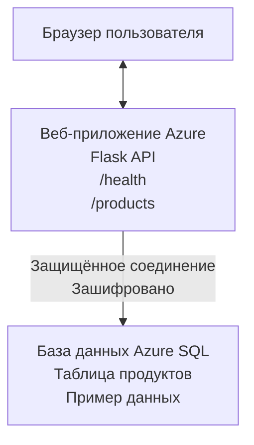

# Развертывание базы данных Microsoft SQL и веб-приложения с помощью AZD

⏱️ **Оценочное время**: 20-30 минут | 💰 **Оценочная стоимость**: ~$15-25/месяц | ⭐ **Сложность**: Средний уровень

Этот **полный, работающий пример** демонстрирует, как использовать [Azure Developer CLI (azd)](https://learn.microsoft.com/azure/developer/azure-developer-cli/) для развертывания веб-приложения Python Flask с базой данных Microsoft SQL в Azure. Весь код включен и протестирован — внешние зависимости не требуются.

## Чему вы научитесь

Выполнив этот пример, вы сможете:
- Развернуть многоуровневое приложение (веб-приложение + база данных) с использованием инфраструктуры как кода
- Настроить безопасные подключения к базе данных без жесткого кодирования секретов
- Отслеживать здоровье приложения с помощью Application Insights
- Эффективно управлять ресурсами Azure с помощью CLI AZD
- Следовать лучшим практикам Azure по безопасности, оптимизации затрат и наблюдаемости

## Обзор сценария
- **Веб-приложение**: Python Flask REST API с подключением к базе данных
- **База данных**: Azure SQL Database с примерными данными
- **Инфраструктура**: Разворачивается с помощью Bicep (модульные, переиспользуемые шаблоны)
- **Развертывание**: Полностью автоматизировано командами `azd`
- **Мониторинг**: Application Insights для логов и телеметрии

## Предварительные требования

### Необходимые инструменты

Перед началом убедитесь, что у вас установлены следующие инструменты:

1. **[Azure CLI](https://learn.microsoft.com/cli/azure/install-azure-cli)** (версия 2.50.0 или новее)
   ```sh
   az --version
   # Ожидаемый результат: azure-cli 2.50.0 или выше
   ```

2. **[Azure Developer CLI (azd)](https://learn.microsoft.com/azure/developer/azure-developer-cli/install-azd)** (версия 1.0.0 или новее)
   ```sh
   azd version
   # Ожидаемый вывод: версия azd 1.0.0 или выше
   ```

3. **[Python 3.8+](https://www.python.org/downloads/)** (для локальной разработки)
   ```sh
   python --version
   # Ожидаемый вывод: Python 3.8 или выше
   ```

4. **[Docker](https://www.docker.com/get-started)** (опционально, для локальной контейнеризированной разработки)
   ```sh
   docker --version
   # Ожидаемый вывод: версия Docker 20.10 или выше
   ```

### Требования Azure

- Активная **подписка Azure** ([создать бесплатный аккаунт](https://azure.microsoft.com/free/))
- Права для создания ресурсов в вашей подписке
- Роль **Владелец** или **Участник** на уровне подписки или группы ресурсов

### Предварительные знания

Это пример **среднего уровня**. Вы должны знать:
- Основы работы с командной строкой
- Основные понятия облака (ресурсы, группы ресурсов)
- Базовое понимание веб-приложений и баз данных

**Новичок в AZD?** Сначала ознакомьтесь с [Руководством по началу работы](../../docs/chapter-01-foundation/azd-basics.md).

## Архитектура

В этом примере разворачивается двухуровневая архитектура с веб-приложением и SQL базой данных:


**Развертывание ресурсов:**
- **Группа ресурсов**: Контейнер для всех ресурсов
- **План App Service**: Хостинг на Linux (уровень B1 для экономии)
- **Веб-приложение**: Среда выполнения Python 3.11 с приложением Flask
- **SQL Server**: Управляемый сервер базы данных с минимум TLS 1.2
- **SQL Database**: Базовый уровень (2 ГБ, подходит для разработки/тестирования)
- **Application Insights**: Мониторинг и логирование
- **Рабочее пространство Log Analytics**: Централизованное хранилище логов

**Аналогия**: Представьте ресторан (веб-приложение) с морозильной камерой (база данных). Клиенты делают заказ из меню (API эндпоинты), кухня (приложение Flask) получает ингредиенты (данные) из морозилки. Менеджер ресторана (Application Insights) отслеживает весь процесс.

## Структура папок

Все файлы включены в этот пример — внешние зависимости не нужны:

```
examples/database-app/
│
├── README.md                    # This file
├── azure.yaml                   # AZD configuration file
├── .env.sample                  # Sample environment variables
├── .gitignore                   # Git ignore patterns
│
├── infra/                       # Infrastructure as Code (Bicep)
│   ├── main.bicep              # Main orchestration template
│   ├── abbreviations.json      # Azure naming conventions
│   └── resources/              # Modular resource templates
│       ├── sql-server.bicep    # SQL Server configuration
│       ├── sql-database.bicep  # Database configuration
│       ├── app-service-plan.bicep  # Hosting plan
│       ├── app-insights.bicep  # Monitoring setup
│       └── web-app.bicep       # Web application
│
└── src/
    └── web/                    # Application source code
        ├── app.py              # Flask REST API
        ├── requirements.txt    # Python dependencies
        └── Dockerfile          # Container definition
```

**Назначение каждого файла:**
- **azure.yaml**: Указывает AZD, что и куда разворачивать
- **infra/main.bicep**: Организует все ресурсы Azure
- **infra/resources/*.bicep**: Определения отдельных ресурсов (модульные для повторного использования)
- **src/web/app.py**: Приложение Flask с логикой работы с базой данных
- **requirements.txt**: Зависимости Python пакетов
- **Dockerfile**: Инструкции контейнеризации для развертывания

## Быстрый старт (пошагово)

### Шаг 1: Клонируйте и перейдите в папку

```sh
git clone https://github.com/microsoft/AZD-for-beginners.git
cd AZD-for-beginners/examples/database-app
```

**✓ Проверка успеха**: Убедитесь, что видите `azure.yaml` и папку `infra/`:
```sh
ls
# Ожидается: README.md, azure.yaml, infra/, src/
```

### Шаг 2: Аутентификация в Azure

```sh
azd auth login
```

Откроется браузер для аутентификации в Azure. Войдите, используя свои учетные данные Azure.

**✓ Проверка успеха**: Вы должны увидеть:
```
Logged in to Azure.
```

### Шаг 3: Инициализация окружения

```sh
azd init
```

**Что происходит**: AZD создает локальную конфигурацию для развертывания.

**Вас попросят ввести**:
- **Имя окружения**: Введите короткое имя (например, `dev`, `myapp`)
- **Подписка Azure**: Выберите подписку из списка
- **Регион Azure**: Выберите регион (например, `eastus`, `westeurope`)

**✓ Проверка успеха**: Вы должны увидеть:
```
SUCCESS: New project initialized!
```

### Шаг 4: Подготовка ресурсов Azure

```sh
azd provision
```

**Что происходит**: AZD разворачивает всю инфраструктуру (занимает 5-8 минут):
1. Создает группу ресурсов
2. Создает SQL Server и базу данных
3. Создает план App Service
4. Создает веб-приложение
5. Создает Application Insights
6. Конфигурирует сеть и безопасность

**Вас попросят ввести**:
- **Имя пользователя администратора SQL**: Введите логин (например, `sqladmin`)
- **Пароль администратора SQL**: Введите надежный пароль (сохраните его!)

**✓ Проверка успеха**: Вы должны увидеть:
```
SUCCESS: Your application was provisioned in Azure in X minutes Y seconds.
You can view the resources created under the resource group rg-<env-name> in Azure Portal:
https://portal.azure.com/#@/resource/subscriptions/.../resourceGroups/rg-<env-name>
```

**⏱️ Время**: 5-8 минут

### Шаг 5: Разверните приложение

```sh
azd deploy
```

**Что происходит**: AZD собирает и развертывает ваше Flask-приложение:
1. Упаковывает Python-приложение
2. Создает Docker контейнер
3. Загружает контейнер в Azure Web App
4. Инициализирует базу данных примерными данными
5. Запускает приложение

**✓ Проверка успеха**: Вы должны увидеть:
```
SUCCESS: Your application was deployed to Azure in X minutes Y seconds.
You can view the resources created under the resource group rg-<env-name> in Azure Portal:
https://portal.azure.com/#@/resource/subscriptions/.../resourceGroups/rg-<env-name>
```

**⏱️ Время**: 3-5 минут

### Шаг 6: Откройте приложение в браузере

```sh
azd browse
```

Это откроет ваше развернутое веб-приложение по адресу `https://app-<unique-id>.azurewebsites.net`

**✓ Проверка успеха**: Вы должны увидеть вывод в формате JSON:
```json
{
  "message": "Welcome to the Database App API",
  "endpoints": {
    "/": "This help message",
    "/health": "Health check endpoint",
    "/products": "List all products",
    "/products/<id>": "Get product by ID"
  }
}
```

### Шаг 7: Тестирование API эндпоинтов

**Проверка состояния** (проверьте подключение к базе данных):
```sh
curl https://app-<your-id>.azurewebsites.net/health
```

**Ожидаемый ответ**:
```json
{
  "status": "healthy",
  "database": "connected"
}
```

**Список продуктов** (пример данных):
```sh
curl https://app-<your-id>.azurewebsites.net/products
```

**Ожидаемый ответ**:
```json
[
  {
    "id": 1,
    "name": "Laptop",
    "description": "High-performance laptop",
    "price": 1299.99,
    "created_at": "2025-11-19T10:30:00"
  },
  ...
]
```

**Получить один продукт**:
```sh
curl https://app-<your-id>.azurewebsites.net/products/1
```

**✓ Проверка успеха**: Все эндпоинты возвращают JSON без ошибок.

---

**🎉 Поздравляем!** Вы успешно развернули веб-приложение с базой данных в Azure с помощью AZD.

## Глубокое погружение в настройку

### Переменные окружения

Секреты управляются надежно через конфигурацию Azure App Service — **никогда не прописываются напрямую в исходном коде**.

**Автоматически настраиваются AZD**:
- `SQL_CONNECTION_STRING`: Строка подключения к базе данных с зашифрованными учетными данными
- `APPLICATIONINSIGHTS_CONNECTION_STRING`: Точка телеметрии мониторинга
- `SCM_DO_BUILD_DURING_DEPLOYMENT`: Включает автоматическую установку зависимостей

**Где хранятся секреты**:
1. При `azd provision` вы вводите учетные данные SQL через защищенные запросы
2. AZD сохраняет их в локальном файле `.azure/<название-окружения>/.env` (игнорируемом git)
3. AZD внедряет их в конфигурацию Azure App Service (шифруется в покое)
4. Приложение читает их через `os.getenv()` во время выполнения

### Локальная разработка

Для локального тестирования создайте файл `.env` из примера:

```sh
cp .env.sample .env
# Отредактируйте .env с подключением к вашей локальной базе данных
```

**Рабочий процесс локальной разработки**:
```sh
# Установить зависимости
cd src/web
pip install -r requirements.txt

# Установить переменные окружения
export SQL_CONNECTION_STRING="your-local-connection-string"

# Запустить приложение
python app.py
```

**Тестирование локально**:
```sh
curl http://localhost:8000/health
# Ожидается: {"status": "healthy", "database": "connected"}
```

### Инфраструктура как код

Все ресурсы Azure описаны в **Bicep шаблонах** (папка `infra/`):

- **Модульная структура**: Для каждого типа ресурса отдельный файл для повторного использования
- **Параметризация**: Возможность настраивать SKU, регионы, соглашения об именах
- **Лучшие практики**: Соответствие стандартам Azure по именованию и безопасности
- **Контроль версий**: Изменения инфраструктуры отслеживаются в Git

**Пример настройки**:
Чтобы изменить уровень базы данных, отредактируйте `infra/resources/sql-database.bicep`:
```bicep
sku: {
  name: 'Standard'  // Changed from 'Basic'
  tier: 'Standard'
  capacity: 10
}
```

## Лучшие практики безопасности

В этом примере соблюдаются лучшие практики безопасности Azure:

### 1. **Без секретов в исходном коде**
- ✅ Учетные данные хранятся в конфигурации Azure App Service (зашифрованы)
- ✅ Файлы `.env` исключены из Git через `.gitignore`
- ✅ Секреты передаются через защищенные параметры при развертывании

### 2. **Шифрованные подключения**
- ✅ TLS 1.2 и выше для SQL Server
- ✅ Принудительное HTTPS для веб-приложения
- ✅ Подключения к базе данных через зашифрованные каналы

### 3. **Сетевая безопасность**
- ✅ Фаервол SQL Server настроен для разрешения только сервисов Azure
- ✅ Ограничен публичный доступ (можно дополнительно укрепить с помощью Private Endpoints)
- ✅ FTPS отключен на Web App

### 4. **Аутентификация и авторизация**
- ⚠️ **Текущая схема**: SQL аутентификация (логин/пароль)
- ✅ **Рекомендация для продакшн**: Использовать управляемую идентичность Azure для аутентификации без пароля

**Для перехода на управляемую идентичность** (для продакшн):
1. Включить управляемую идентичность на Web App
2. Предоставить права идентичности на SQL
3. Обновить строку подключения для использования управляемой идентичности
4. Удалить аутентификацию по паролю

### 5. **Аудит и соответствие**
- ✅ Application Insights логирует все запросы и ошибки
- ✅ Включен аудит в SQL Database (настраивается для соответствия)
- ✅ Все ресурсы помечены тегами для управления

**Чеклист безопасности перед продакшн**:
- [ ] Включить Azure Defender для SQL
- [ ] Настроить Private Endpoints для SQL Database
- [ ] Включить Web Application Firewall (WAF)
- [ ] Внедрить Azure Key Vault для ротации секретов
- [ ] Настроить аутентификацию Azure AD
- [ ] Включить диагностическое логирование для всех ресурсов

## Оптимизация затрат

**Оценочные ежемесячные затраты** (на ноябрь 2025):

| Ресурс | SKU/Уровень | Оценочная стоимость |
|----------|----------|----------------|
| App Service Plan | B1 (Базовый) | ~$13/месяц |
| SQL Database | Basic (2ГБ) | ~$5/месяц |
| Application Insights | По факту использования | ~$2/месяц (низкая нагрузка) |
| **Итого** | | **~$20/месяц** |

**💡 Советы по экономии**:

1. **Используйте бесплатный уровень для обучения**:
   - App Service: уровень F1 (бесплатно, ограниченные часы)
   - SQL Database: использовать сервер без сервера Azure SQL Database
   - Application Insights: 5 ГБ бесплатного приема в месяц

2. **Останавливайте ресурсы, когда они не нужны**:
   ```sh
   # Остановить веб-приложение (база данных по-прежнему тарифицируется)
   az webapp stop --name <app-name> --resource-group <rg-name>
   
   # Перезапустите при необходимости
   az webapp start --name <app-name> --resource-group <rg-name>
   ```

3. **Удаляйте всё после тестирования**:
   ```sh
   azd down
   ```
   Это удалит ВСЕ ресурсы и прекратит начисление платы.

4. **Различия SKU для разработки и продакшн**:
   - **Разработка**: базовый уровень (используется в этом примере)
   - **Продакшн**: стандартный/премиум уровень с отказоустойчивостью

**Мониторинг затрат**:
- Просматривайте расходы в [Azure Cost Management](https://portal.azure.com/#view/Microsoft_Azure_CostManagement)
- Настраивайте оповещения о затратах, чтобы избежать сюрпризов
- Помечайте все ресурсы тегом `azd-env-name` для учета

**Альтернатива бесплатного уровня**:
Для учебных целей вы можете изменить `infra/resources/app-service-plan.bicep`:
```bicep
sku: {
  name: 'F1'  // Free tier
  tier: 'Free'
}
```
**Примечание**: Бесплатный уровень имеет ограничения (60 мин/день CPU, без режима Always-on).

## Мониторинг и наблюдаемость

### Интеграция Application Insights

В этом примере включен **Application Insights** для комплексного мониторинга:

**Что мониторится**:
- ✅ HTTP-запросы (задержки, коды статуса, эндпоинты)
- ✅ Ошибки и исключения приложения
- ✅ Пользовательское логирование из Flask-приложения
- ✅ Состояние подключения к базе данных
- ✅ Производительность (CPU, память)

**Доступ к Application Insights**:
1. Откройте [Azure Portal](https://portal.azure.com)
2. Перейдите в группу ресурсов (`rg-<название-окружения>`)
3. Кликните на ресурс Application Insights (`appi-<уникальный-id>`)

**Полезные запросы** (Application Insights → Логи):

**Просмотр всех запросов**:
```kusto
requests
| where timestamp > ago(1h)
| order by timestamp desc
| project timestamp, name, url, resultCode, duration
```

**Поиск ошибок**:
```kusto
exceptions
| where timestamp > ago(24h)
| order by timestamp desc
| project timestamp, type, outerMessage, operation_Name
```

**Проверка health endpoint**:
```kusto
requests
| where name contains "health"
| summarize count() by resultCode, bin(timestamp, 1h)
```

### Аудит SQL базы данных

**Включен аудит SQL базы данных** для отслеживания:
- Паттернов доступа к базе
- Неудачных попыток входа
- Изменений схемы
- Доступа к данным (для соответствия требованиям)

**Доступ к журналам аудита**:
1. Azure Portal → SQL Database → Auditing
2. Просмотр логов в рабочем пространстве Log Analytics

### Мониторинг в реальном времени

**Просмотр живых метрик**:
1. Application Insights → Live Metrics
2. Отслеживайте запросы, сбои и производительность в режиме реального времени

**Настройка оповещений**:
Создайте оповещения для критических событий:
- HTTP ошибки 500 > 5 за 5 минут
- Сбои подключения к базе данных
- Высокое время отклика (>2 секунды)

**Пример создания оповещения**:
```sh
az monitor metrics alert create \
  --name "High-Response-Time" \
  --resource-group <rg-name> \
  --scopes <app-insights-resource-id> \
  --condition "avg requests/duration > 2000" \
  --description "Alert when response time exceeds 2 seconds"
```

## Устранение неполадок
### Общие проблемы и решения

#### 1. Ошибка `azd provision` с сообщением "Location not available"

**Симптом:**  
```
Error: The subscription is not registered for the resource type 'components' in the location 'centralus'.
```
  
**Решение:**  
Выберите другой регион Azure или зарегистрируйте поставщика ресурсов:  
```sh
az provider register --namespace Microsoft.Insights
```
  
#### 2. Ошибка подключения к SQL во время развертывания

**Симптом:**  
```
pyodbc.OperationalError: ('08001', '[08001] [Microsoft][ODBC Driver 18 for SQL Server]TCP Provider...')
```
  
**Решение:**  
- Убедитесь, что брандмауэр SQL Server разрешает услуги Azure (настроено автоматически)  
- Проверьте правильность пароля администратора SQL, введенного при `azd provision`  
- Убедитесь, что SQL Server полностью развернут (это может занять 2-3 минуты)  

**Проверить подключение:**  
```sh
# В портале Azure перейдите в SQL Database → Редактор запросов
# Попробуйте подключиться с вашими учетными данными
```
  
#### 3. Веб-приложение показывает "Ошибка приложения"

**Симптом:**  
Браузер показывает общую страницу с ошибкой.  

**Решение:**  
Проверьте журналы приложения:  
```sh
# Просмотр последних журналов
az webapp log tail --name <app-name> --resource-group <rg-name>
```
  
**Распространённые причины:**  
- Отсутствуют переменные среды (проверьте в App Service → Configuration)  
- Ошибка установки пакетов Python (проверьте логи развертывания)  
- Ошибка инициализации базы данных (проверьте подключение к SQL)  

#### 4. `azd deploy` завершается с ошибкой "Build Error"

**Симптом:**  
```
Error: Failed to build project
```
  
**Решение:**  
- Убедитесь, что в `requirements.txt` нет синтаксических ошибок  
- Проверьте, что Python 3.11 указан в `infra/resources/web-app.bicep`  
- Убедитесь, что в Dockerfile используется правильный базовый образ  

**Отладка локально:**  
```sh
cd src/web
docker build -t test-app .
docker run -p 8000:8000 test-app
```
  
#### 5. "Unauthorized" при выполнении команд AZD

**Симптом:**  
```
ERROR: (Unauthorized) The client '<id>' with object id '<id>' does not have authorization
```
  
**Решение:**  
Повторно авторизуйтесь в Azure:  
```sh
azd auth login
az login
```
  
Проверьте, что у вас есть соответствующие разрешения (роль Contributor) в подписке.  

#### 6. Высокие затраты на базу данных

**Симптом:**  
Неожиданно высокий счет Azure.  

**Решение:**  
- Проверьте, не забыли ли вы выполнить `azd down` после тестирования  
- Убедитесь, что SQL Database использует базовый тариф (Basic), а не Premium  
- Проанализируйте затраты в Azure Cost Management  
- Настройте оповещения о затратах  

### Получение помощи

**Просмотреть все переменные среды AZD:**  
```sh
azd env get-values
```
  
**Проверить статус развертывания:**  
```sh
az webapp show --name <app-name> --resource-group <rg-name> --query state
```
  
**Доступ к журналам приложения:**  
```sh
az webapp log download --name <app-name> --resource-group <rg-name> --log-file app-logs.zip
```
  
**Нужна дополнительная помощь?**  
- [Руководство по устранению неполадок AZD](../../docs/chapter-07-troubleshooting/common-issues.md)  
- [Устранение неполадок Azure App Service](https://learn.microsoft.com/azure/app-service/troubleshoot-diagnostic-logs)  
- [Устранение неполадок Azure SQL](https://learn.microsoft.com/azure/azure-sql/database/troubleshoot-common-errors-issues)  

## Практические упражнения

### Упражнение 1: Проверьте ваше развертывание (Начинающий)

**Цель:** Подтвердить, что все ресурсы развернуты и приложение работает.  

**Шаги:**  
1. Просмотрите все ресурсы в вашей группе ресурсов:  
   ```sh
   az resource list --resource-group rg-<env-name> --output table
   ```
   **Ожидаемый результат**: 6-7 ресурсов (Web App, SQL Server, SQL Database, App Service Plan, Application Insights, Log Analytics)  

2. Проверьте все API-эндпоинты:  
   ```sh
   curl https://app-<your-id>.azurewebsites.net/
   curl https://app-<your-id>.azurewebsites.net/health
   curl https://app-<your-id>.azurewebsites.net/products
   curl https://app-<your-id>.azurewebsites.net/products/1
   ```
   **Ожидаемый результат**: Все возвращают корректный JSON без ошибок  

3. Проверьте Application Insights:  
   - Перейдите в Application Insights в Azure Portal  
   - Откройте раздел "Live Metrics"  
   - Обновите веб-страницу вашего приложения  
   **Ожидаемый результат**: В реальном времени отображаются запросы  

**Критерии успешности:** Все 6-7 ресурсов присутствуют, все эндпоинты возвращают данные, в Live Metrics видна активность.  

---

### Упражнение 2: Добавьте новый API-эндпоинт (Средний уровень)

**Цель:** Расширить Flask-приложение новым эндпоинтом.  

**Исходный код:** Текущие эндпоинты в `src/web/app.py`

**Шаги:**  
1. Отредактируйте `src/web/app.py`, добавив новый эндпоинт после функции `get_product()`:  
   ```python
   @app.route('/products/search/<keyword>')
   def search_products(keyword):
       """Search products by name or description."""
       try:
           conn = get_db_connection()
           cursor = conn.cursor()
           cursor.execute(
               "SELECT id, name, description, price, created_at FROM products WHERE name LIKE ? OR description LIKE ?",
               (f'%{keyword}%', f'%{keyword}%')
           )
           
           products = []
           for row in cursor.fetchall():
               products.append({
                   'id': row[0],
                   'name': row[1],
                   'description': row[2],
                   'price': float(row[3]) if row[3] else None,
                   'created_at': row[4].isoformat() if row[4] else None
               })
           
           cursor.close()
           conn.close()
           
           logger.info(f"Search for '{keyword}' returned {len(products)} results")
           return jsonify(products), 200
           
       except Exception as e:
           logger.error(f"Error searching products: {str(e)}")
           return jsonify({'error': str(e)}), 500
   ```
  
2. Разверните обновленное приложение:  
   ```sh
   azd deploy
   ```
  
3. Проверьте новый эндпоинт:  
   ```sh
   curl https://app-<your-id>.azurewebsites.net/products/search/laptop
   ```
   **Ожидаемый результат**: Возвращает продукты, соответствующие "laptop"  

**Критерии успешности:** Новый эндпоинт работает, возвращает отфильтрованные результаты, появляется в логах Application Insights.  

---

### Упражнение 3: Добавьте мониторинг и оповещения (Продвинутый уровень)

**Цель:** Настроить проактивный мониторинг с оповещениями.  

**Шаги:**  
1. Создайте оповещение для ошибок HTTP 500:  
   ```sh
   # Получить идентификатор ресурса Application Insights
   AI_ID=$(az monitor app-insights component show \
     --app appi-<your-id> \
     --resource-group rg-<env-name> \
     --query id -o tsv)
   
   # Создать оповещение
   az monitor metrics alert create \
     --name "High-Error-Rate" \
     --resource-group rg-<env-name> \
     --scopes $AI_ID \
     --condition "count requests/failed > 5" \
     --window-size 5m \
     --evaluation-frequency 1m \
     --description "Alert when >5 failed requests in 5 minutes"
   ```
  
2. Сгенерируйте ошибку для срабатывания оповещения:  
   ```sh
   # Запрос несуществующего продукта
   for i in {1..10}; do curl https://app-<your-id>.azurewebsites.net/products/999; done
   ```
  
3. Проверьте, сработало ли оповещение:  
   - В Azure Portal → Alerts → Alert Rules  
   - Проверьте почту (если настроено)  

**Критерии успешности:** Правило оповещения создано, срабатывает при ошибках, уведомления получаются.  

---

### Упражнение 4: Изменения в схеме базы данных (Продвинутый уровень)

**Цель:** Добавить новую таблицу и изменить приложение для работы с ней.  

**Шаги:**  
1. Подключитесь к SQL Database через редактор запросов в Azure Portal  

2. Создайте новую таблицу `categories`:  
   ```sql
   CREATE TABLE categories (
       id INT PRIMARY KEY IDENTITY(1,1),
       name NVARCHAR(50) NOT NULL,
       description NVARCHAR(200)
   );
   
   INSERT INTO categories (name, description) VALUES
   ('Electronics', 'Electronic devices and accessories'),
   ('Office Supplies', 'Office equipment and supplies');
   
   -- Add category to products table
   ALTER TABLE products ADD category_id INT;
   UPDATE products SET category_id = 1; -- Set all to Electronics
   ```
  
3. Обновите `src/web/app.py`, чтобы включить информацию о категориях в ответы  

4. Разверните и протестируйте  

**Критерии успешности:** Новая таблица существует, продукты показывают информацию о категориях, приложение работает корректно.  

---

### Упражнение 5: Реализуйте кэширование (Эксперт)

**Цель:** Добавить Azure Redis Cache для повышения производительности.  

**Шаги:**  
1. Добавьте Redis Cache в `infra/main.bicep`  
2. Обновите `src/web/app.py`, чтобы кэшировать запросы продуктов  
3. Измерьте улучшение производительности с помощью Application Insights  
4. Сравните время отклика до и после кэширования  

**Критерии успешности:** Redis развернут, кэширование работает, время отклика улучшилось более чем на 50%.  

**Подсказка:** Начните с [документации Azure Cache for Redis](https://learn.microsoft.com/azure/azure-cache-for-redis/).  

---

## Очистка

Чтобы избежать дальнейших затрат, удалите все ресурсы после завершения:  

```sh
azd down
```
  
**Запрос подтверждения:**  
```
? Total resources to delete: 7, are you sure you want to continue? (y/N)
```
  
Введите `y`, чтобы подтвердить.  

**✓ Проверка успешности:**  
- Все ресурсы удалены из Azure Portal  
- Нет текущих затрат  
- Локальная папка `.azure/<env-name>` может быть удалена  

**Альтернатива** (сохранить инфраструктуру, удалить данные):  
```sh
# Удалить только группу ресурсов (сохранить конфигурацию AZD)
az group delete --name rg-<env-name> --yes
```
## Узнайте больше

### Связанная документация  
- [Документация Azure Developer CLI](https://learn.microsoft.com/azure/developer/azure-developer-cli/)  
- [Документация Azure SQL Database](https://learn.microsoft.com/azure/azure-sql/database/)  
- [Документация Azure App Service](https://learn.microsoft.com/azure/app-service/)  
- [Документация Application Insights](https://learn.microsoft.com/azure/azure-monitor/app/app-insights-overview)  
- [Справочник по языку Bicep](https://learn.microsoft.com/azure/azure-resource-manager/bicep/)  

### Следующие шаги в этом курсе  
- **[Пример Container Apps](../../../../examples/container-app)**: Развертывание микросервисов с помощью Azure Container Apps  
- **[Руководство по интеграции ИИ](../../../../docs/ai-foundry)**: Добавление возможностей ИИ в приложение  
- **[Лучшие практики развертывания](../../docs/chapter-04-infrastructure/deployment-guide.md)**: Шаблоны развертывания в продакшн  

### Расширенные темы  
- **Управляемая идентификация**: Исключение паролей и использование аутентификации Azure AD  
- **Приватные конечные точки**: Безопасные подключения к базе внутри виртуальной сети  
- **CI/CD интеграция**: Автоматизация развертываний с помощью GitHub Actions или Azure DevOps  
- **Многоокружение**: Настройка dev, staging и production окружений  
- **Миграции базы данных**: Использование Alembic или Entity Framework для версионирования схемы  

### Сравнение с другими подходами

**AZD против ARM Templates**:  
- ✅ AZD: Более высокий уровень абстракции, простые команды  
- ⚠️ ARM: Более подробный, детальный контроль  

**AZD против Terraform**:  
- ✅ AZD: Нативный для Azure, интегрирован с сервисами Azure  
- ⚠️ Terraform: Поддержка мультиоблачных решений, большая экосистема  

**AZD против Azure Portal**:  
- ✅ AZD: Повторяемость, контроль версий, автоматика  
- ⚠️ Портал: Ручные действия, сложно воспроизвести  

**Думайте об AZD как о**: Docker Compose для Azure — упрощённая конфигурация для сложных развертываний.  

---

## Часто задаваемые вопросы

**В:** Можно ли использовать другой язык программирования?  
**О:** Да! Замените `src/web/` на Node.js, C#, Go или любой другой язык. Обновите `azure.yaml` и Bicep соответственно.  

**В:** Как добавить больше баз данных?  
**О:** Добавьте еще один модуль SQL Database в `infra/main.bicep` или используйте PostgreSQL/MySQL из Azure Database сервисов.  

**В:** Можно ли использовать это для продакшна?  
**О:** Это отправная точка. Для продакшна добавьте: управляемую идентификацию, приватные конечные точки, отказоустойчивость, стратегию резервного копирования, WAF и расширенный мониторинг.  

**В:** Что, если я хочу использовать контейнеры вместо развертывания кода?  
**О:** Ознакомьтесь с [примером Container Apps](../../../../examples/container-app), который использует Docker-контейнеры на всех этапах.  

**В:** Как подключиться к базе данных с локального компьютера?  
**О:** Добавьте ваш IP в брандмауэр SQL Server:  
```sh
az sql server firewall-rule create \
  --resource-group rg-<env-name> \
  --server sql-<unique-id> \
  --name AllowMyIP \
  --start-ip-address <your-ip> \
  --end-ip-address <your-ip>
```
  
**В:** Можно ли использовать существующую базу данных вместо создания новой?  
**О:** Да, измените `infra/main.bicep`, чтобы ссылаться на существующий SQL Server, и обновите параметры строки подключения.  

---

> **Примечание:** Этот пример демонстрирует лучшие практики развертывания веб-приложения с базой данных с помощью AZD. Он включает рабочий код, полную документацию и практические упражнения для закрепления знаний. Для продакшн-развертываний обязательно учитывайте требования по безопасности, масштабированию, соответствию и затратам, специфичные для вашей организации.  

**📚 Навигация по курсу:**  
- ← Предыдущий: [Пример Container Apps](../../../../examples/container-app)  
- → Следующий: [Руководство по интеграции ИИ](../../../../docs/ai-foundry)  
- 🏠 [Главная страница курса](../../README.md)

---

<!-- CO-OP TRANSLATOR DISCLAIMER START -->
**Отказ от ответственности**:  
Этот документ был переведен с помощью сервиса автоматического перевода [Co-op Translator](https://github.com/Azure/co-op-translator). Несмотря на наши усилия по обеспечению точности, просим учитывать, что автоматический перевод может содержать ошибки или неточности. Оригинальный документ на его исходном языке следует считать авторитетным источником. Для важной информации рекомендуется воспользоваться услугами профессионального перевода человеком. Мы не несем ответственности за любые недоразумения или неправильное толкование, возникшие в результате использования данного перевода.
<!-- CO-OP TRANSLATOR DISCLAIMER END -->