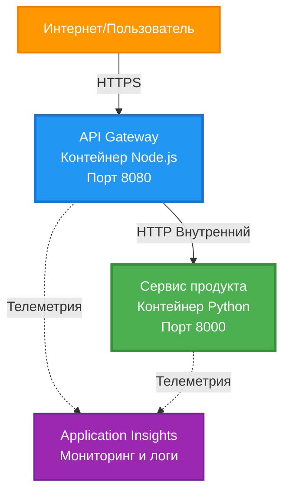
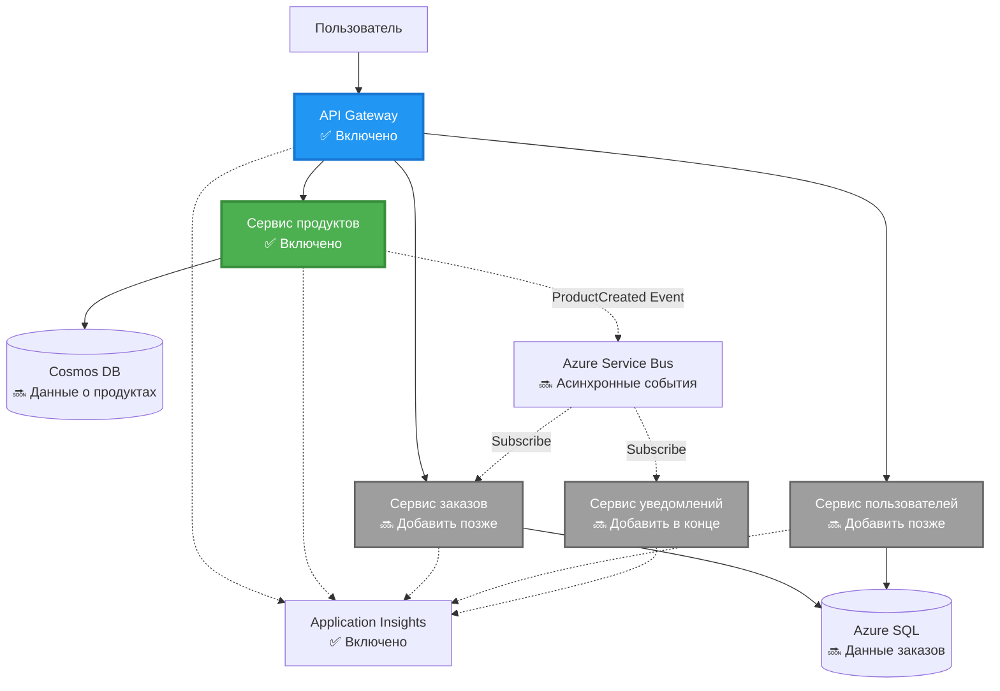
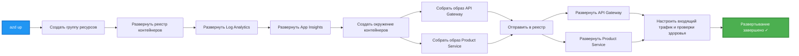
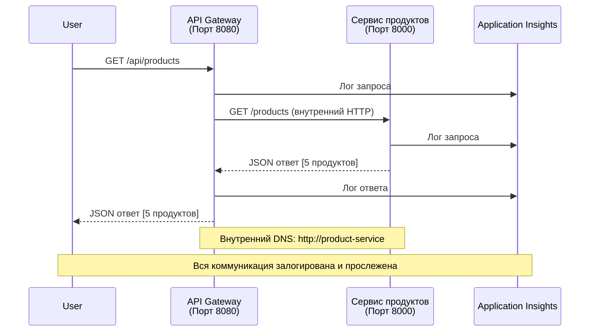

# Архитектура микросервисов - пример контейнерного приложения

⏱️ **Оценочное время**: 25-35 минут | 💰 **Оценочная стоимость**: ~$50-100/месяц | ⭐ **Сложность**: Продвинутый уровень

**📚 Учебный путь:**
- ← Предыдущий: [Простой Flask API](../../../../examples/container-app/simple-flask-api) - основы одного контейнера
- 🎯 **Вы здесь**: Архитектура микросервисов (основа из 2 сервисов)
- → Следующий: [Интеграция ИИ](../../../../docs/ai-foundry) - добавьте интеллект в ваши сервисы
- 🏠 [Домашняя страница курса](../../README.md)

---

**Упрощённая, но функциональная** архитектура микросервисов, развернутая в Azure Container Apps с помощью AZD CLI. Этот пример демонстрирует взаимодействие между сервисами, оркестрацию контейнеров и мониторинг на примере практической модели из 2 сервисов.

> **📚 Метод обучения**: Этот пример начинается с минимальной архитектуры из 2 сервисов (API Gateway + Backend Service), которую вы действительно сможете развернуть и изучить. Освоив эту основу, мы предоставим инструкции для расширения до полноценной экосистемы микросервисов.

## Чему вы научитесь

По завершении этого примера вы сможете:
- Развернуть несколько контейнеров в Azure Container Apps
- Реализовать взаимодействие сервисов через внутреннюю сеть
- Настроить масштабирование и проверки состояния на основе окружения
- Мониторить распределённые приложения с помощью Application Insights
- Понять шаблоны развертывания микросервисов и лучшие практики
- Научиться постепенному развитию архитектуры от простой к сложной

## Архитектура

### Фаза 1: Что мы строим (включено в этот пример)


**Детали компонентов:**

| Компонент | Назначение | Доступ | Ресурсы |
|-----------|------------|--------|---------|
| **API Gateway** | Маршрутизация внешних запросов к бэкенд-сервисам | Публичный (HTTPS) | 1 vCPU, 2GB RAM, 2-20 реплик |
| **Product Service** | Управление каталогом продуктов в памяти | Только внутренний доступ | 0.5 vCPU, 1GB RAM, 1-10 реплик |
| **Application Insights** | Централизованный лог и распределённое отслеживание | Портал Azure | Загрузка данных 1-2 ГБ/мес |

**Почему начинать с простого?**
- ✅ Быстро развернуть и понять (25-35 минут)
- ✅ Изучить ключевые паттерны микросервисов без излишней сложности
- ✅ Рабочий код, который можно изменять и экспериментировать
- ✅ Низкая стоимость обучения (~$50–100/мес против $300–1400/мес)
- ✅ Получить уверенность прежде чем добавлять базы данных и очереди сообщений

**Аналогия**: Представьте, что вы учитесь водить. Сначала вы начинаете с пустой парковки (2 сервиса), осваиваете базу, а затем переходите к городскому движению (5+ сервисов с базами данных).

### Фаза 2: Будущее расширение (Референсная архитектура)

После освоения архитектуры из 2 сервисов, можно расширять её:


См. раздел "Руководство по расширению" в конце для пошаговых инструкций.

## Включённые функции

✅ **Обнаружение сервисов**: Автоматическое DNS-обнаружение между контейнерами  
✅ **Балансировка нагрузки**: Встроенный баланс нагрузки по репликам  
✅ **Автомасштабирование**: Независимое масштабирование каждого сервиса по HTTP-запросам  
✅ **Мониторинг состояния**: Пробы живости и готовности для обоих сервисов  
✅ **Распределённый лог**: Централизованный лог с Application Insights  
✅ **Внутренняя сеть**: Безопасное взаимодействие сервисов  
✅ **Оркестрация контейнеров**: Автоматическое развертывание и масштабирование  
✅ **Обновления без простоя**: Пошаговые обновления с управлением ревизиями  

## Требования

### Необходимые инструменты

Перед началом убедитесь, что у вас установлены эти инструменты:

1. **[Azure Developer CLI (azd)](https://learn.microsoft.com/azure/developer/azure-developer-cli/install-azd)** (версия 1.0.0 или новее)
   ```bash
   azd version
   # Ожидаемый вывод: azd версии 1.0.0 или выше
   ```

2. **[Azure CLI](https://learn.microsoft.com/cli/azure/install-azure-cli)** (версия 2.50.0 или новее)
   ```bash
   az --version
   # Ожидаемый вывод: azure-cli версии 2.50.0 или выше
   ```

3. **[Docker](https://www.docker.com/get-started)** (для локальной разработки/тестирования - необязательно)
   ```bash
   docker --version
   # Ожидаемый вывод: версия Docker 20.10 или выше
   ```

### Проверка окружения

Выполните эти команды, чтобы убедиться, что всё готово:

```bash
# Проверьте Azure Developer CLI
azd version
# ✅ Ожидается: версия azd 1.0.0 или выше

# Проверьте Azure CLI
az --version
# ✅ Ожидается: azure-cli 2.50.0 или выше

# Проверьте Docker (необязательно)
docker --version
# ✅ Ожидается: версия Docker 20.10 или выше
```

**Критерии успешности**: Все команды должны возвращать версии, не ниже минимальных.

### Требования Azure

- Активная **подписка Azure** ([создайте бесплатный аккаунт](https://azure.microsoft.com/free/))
- Разрешения на создание ресурсов в подписке
- Роль **Contributor** в подписке или группе ресурсов

### Знания, необходимые для понимания

Это пример **продвинутого уровня**. Рекомендуется:
- Завершить [пример Простого Flask API](../../../../examples/container-app/simple-flask-api) 
- Иметь базовые знания архитектуры микросервисов
- Знать REST API и HTTP
- Понимать концепции контейнеров

**Новичок в Container Apps?** Начните с [Простого Flask API](../../../../examples/container-app/simple-flask-api), чтобы изучить базу.

## Быстрый старт (пошагово)

### Шаг 1: Клонировать и перейти в каталог

```bash
git clone https://github.com/microsoft/AZD-for-beginners.git
cd AZD-for-beginners/examples/microservices
```

**✓ Проверка успеха**: Убедитесь, что видите файл `azure.yaml`:
```bash
ls
# Ожидается: README.md, azure.yaml, infra/, src/
```

### Шаг 2: Аутентификация в Azure

```bash
azd auth login
```

После выполнения откроется браузер для входа в Azure. Войдите с вашими учётными данными Azure.

**✓ Проверка успеха**: Вы должны увидеть:
```
Logged in to Azure.
```

### Шаг 3: Инициализировать окружение

```bash
azd init
```

**Вас попросят ввести**:
- **Имя окружения**: Введите короткое название (например, `microservices-dev`)
- **Подписка Azure**: Выберите вашу подписку
- **Регион Azure**: Выберите регион (например, `eastus`, `westeurope`)

**✓ Проверка успеха**: Вы должны увидеть:
```
SUCCESS: New project initialized!
```

### Шаг 4: Развернуть инфраструктуру и сервисы

```bash
azd up
```

**Что происходит** (занимает 8-12 минут):


**✓ Проверка успеха**: Вы должны увидеть:
```
SUCCESS: Your application was deployed to Azure in X minutes Y seconds.
Endpoint: https://api-gateway-<unique-id>.azurecontainerapps.io
```

**⏱️ Время**: 8-12 минут

### Шаг 5: Протестировать развертывание

```bash
# Получить конечную точку шлюза
GATEWAY_URL=$(azd env get-values | grep API_GATEWAY_URL | cut -d '=' -f2 | tr -d '"')

# Проверить состояние API шлюза
curl $GATEWAY_URL/health
```

**✅ Ожидаемый вывод:**
```json
{
  "status": "healthy",
  "service": "api-gateway",
  "timestamp": "2025-11-19T10:30:00Z"
}
```

**Тестируем продуктовый сервис через шлюз**:
```bash
# Список продуктов
curl $GATEWAY_URL/api/products
```

**✅ Ожидаемый вывод:**
```json
[
  {"id":1,"name":"Laptop","price":999.99,"stock":50},
  {"id":2,"name":"Mouse","price":29.99,"stock":200},
  {"id":3,"name":"Keyboard","price":79.99,"stock":150}
]
```

**✓ Проверка успеха**: Оба эндпоинта возвращают JSON без ошибок.

---

**🎉 Поздравляем!** Вы развернули архитектуру микросервисов в Azure!

## Структура проекта

Все файлы реализации включены — это полный рабочий пример:

```
microservices/
│
├── README.md                         # This file
├── azure.yaml                        # AZD configuration
├── .gitignore                        # Git ignore patterns
│
├── infra/                           # Infrastructure as Code (Bicep)
│   ├── main.bicep                   # Main orchestration
│   ├── abbreviations.json           # Naming conventions
│   ├── core/                        # Shared infrastructure
│   │   ├── container-apps-environment.bicep  # Container environment + registry
│   │   └── monitor.bicep            # Application Insights + Log Analytics
│   └── app/                         # Service definitions
│       ├── api-gateway.bicep        # API Gateway container app
│       └── product-service.bicep    # Product Service container app
│
└── src/                             # Application source code
    ├── api-gateway/                 # Node.js API Gateway
    │   ├── app.js                   # Express server with routing
    │   ├── package.json             # Node dependencies
    │   └── Dockerfile               # Container definition
    └── product-service/             # Python Product Service
        ├── main.py                  # Flask API with product data
        ├── requirements.txt         # Python dependencies
        └── Dockerfile               # Container definition
```

**Функции компонентов:**

**Инфраструктура (infra/)**:
- `main.bicep`: Оркестровка всех ресурсов Azure и зависимостей
- `core/container-apps-environment.bicep`: Создание среды Container Apps и контейнерного реестра Azure
- `core/monitor.bicep`: Настройка Application Insights для распределённого логирования
- `app/*.bicep`: Определения отдельных контейнерных приложений с масштабированием и проверками состояния

**API Gateway (src/api-gateway/)**:
- Публичный сервис, маршрутизирующий запросы к бэкендам
- Ведёт логирование, обработку ошибок и перенаправление запросов
- Демонстрирует HTTP взаимодействие сервисов

**Product Service (src/product-service/)**:
- Внутренний сервис с каталогом продуктов (в памяти для простоты)
- REST API с проверками здоровья
- Пример бэкендового микросервисного паттерна

## Обзор сервисов

### API Gateway (Node.js/Express)

**Порт**: 8080  
**Доступ**: Публичный (внешний вход)  
**Назначение**: Маршрутизует входящие запросы к соответствующим бэкенд-сервисам  

**Эндпоинты**:
- `GET /` - Информация о сервисе
- `GET /health` - Проверка состояния
- `GET /api/products` - Проксирование к продукт-сервису (список всех)
- `GET /api/products/:id` - Проксирование к продукт-сервису (по ID)

**Ключевые функции**:
- Маршрутизация запросов с помощью axios
- Централизованное логирование
- Обработка ошибок и таймаутов
- Обнаружение сервисов через переменные окружения
- Интеграция с Application Insights

**Пример кода** (`src/api-gateway/app.js`):
```javascript
// Внутреннее взаимодействие сервисов
app.get('/api/products', async (req, res) => {
  const response = await axios.get(`${PRODUCT_SERVICE_URL}/products`, {
    timeout: 5000
  });
  res.json(response.data);
});
```

### Product Service (Python/Flask)

**Порт**: 8000  
**Доступ**: Только внутренний (без внешнего входа)  
**Назначение**: Управление каталогом продуктов в памяти  

**Эндпоинты**:
- `GET /` - Информация о сервисе
- `GET /health` - Проверка состояния
- `GET /products` - Список всех продуктов
- `GET /products/<id>` - Получить продукт по ID

**Ключевые функции**:
- RESTful API на Flask
- Хранилище продуктов в памяти (просто, без БД)
- Мониторинг состояния с помощью проб
- Структурированное логирование
- Интеграция с Application Insights

**Модель данных**:
```python
{
  "id": 1,
  "name": "Laptop",
  "description": "High-performance laptop",
  "price": 999.99,
  "stock": 50
}
```

**Почему только внутренний доступ?**
Продуктовый сервис не доступен напрямую. Все запросы проходят через API Gateway, который обеспечивает:
- Безопасность: контролируемая точка доступа
- Гибкость: можно менять бэкенд без влияния на клиентов
- Мониторинг: централизованное логирование запросов

## Понимание взаимодействия сервисов

### Как сервисы общаются друг с другом


В этом примере API Gateway общается с Product Service через **внутренние HTTP вызовы**:

```javascript
// API Gateway (src/api-gateway/app.js)
const PRODUCT_SERVICE_URL = process.env.PRODUCT_SERVICE_URL;

// Выполнить внутренний HTTP-запрос
const response = await axios.get(`${PRODUCT_SERVICE_URL}/products`);
```

**Основные моменты**:

1. **Обнаружение через DNS**: Container Apps автоматически предоставляет DNS для внутренних сервисов
   - FQDN Product Service: `product-service.internal.<environment>.azurecontainerapps.io`
   - Упрощённо: `http://product-service` (Container Apps разрешает)

2. **Отсутствие публичного доступа**: В Bicep у Product Service стоит `external: false`
   - Доступен только внутри Container Apps среды
   - Недоступен из интернета

3. **Переменные окружения**: URL сервисов внедряются во время развертывания
   - Bicep передаёт внутренний FQDN в шлюз
   - В коде нет жестко заданных URL

**Аналогия**: Это как офисное здание. API Gateway — стойка ресепшн (публичная), а Product Service — внутренний офис. Посетители должны пройти через ресепшн, чтобы попасть в офис.

## Варианты развертывания

### Полное развертывание (рекомендуется)

```bash
# Развернуть инфраструктуру и оба сервиса
azd up
```

Разворачивает:
1. Среду Container Apps
2. Application Insights
3. Контейнерный реестр
4. Контейнер API Gateway
5. Контейнер Product Service

**Время**: 8-12 минут

### Развернуть отдельный сервис

```bash
# Развернуть только одну службу (после первоначального azd up)
azd deploy api-gateway

# Или развернуть продуктовую службу
azd deploy product-service
```

**Случай использования**: когда вы обновили код одного сервиса и хотите переразвернуть только его.

### Обновить конфигурацию

```bash
# Изменить параметры масштабирования
azd env set GATEWAY_MAX_REPLICAS 30

# Развернуть заново с новой конфигурацией
azd up
```

## Конфигурация

### Настройка масштабирования

Оба сервиса настроены на HTTP-автомасштабирование через их Bicep файлы:

**API Gateway**:
- Минимум реплик: 2 (всегда минимум 2 для доступности)
- Максимум реплик: 20
- Триггер масштабирования: 50 одновременных запросов на реплику

**Product Service**:
- Минимум реплик: 1 (может масштабироваться до нуля при необходимости)
- Максимум реплик: 10
- Триггер масштабирования: 100 одновременных запросов на реплику

**Настройка масштабирования** (в `infra/app/*.bicep`):
```bicep
scale: {
  minReplicas: 1
  maxReplicas: 10
  rules: [
    {
      name: 'http-scale-rule'
      http: {
        metadata: {
          concurrentRequests: '100'  // Adjust this
        }
      }
    }
  ]
}
```

### Распределение ресурсов

**API Gateway**:
- CPU: 1.0 vCPU
- Память: 2 GiB
- Причина: обрабатывает весь внешний трафик

**Product Service**:
- CPU: 0.5 vCPU
- Память: 1 GiB
- Причина: лёгкие операции в памяти

### Проверки состояния

Оба сервиса содержат пробы живости и готовности:

```bicep
probes: [
  {
    type: 'Liveness'
    httpGet: {
      path: '/health'
      port: 8080
    }
    initialDelaySeconds: 10
    periodSeconds: 30
  }
  {
    type: 'Readiness'
    httpGet: {
      path: '/health'
      port: 8080
    }
    initialDelaySeconds: 5
    periodSeconds: 10
  }
]
```

**Что это значит**:
- **Живость (liveness)**: если проверка не проходит, Container Apps перезапускает контейнер
- **Готовность (readiness)**: если контейнер не готов, Container Apps перестаёт направлять трафик на эту реплику

## Мониторинг и наблюдаемость

### Просмотр логов сервисов

```bash
# Просмотр журналов с помощью azd monitor
azd monitor --logs

# Или используйте Azure CLI для конкретных контейнерных приложений:
# Потоковая передача журналов из API Gateway
az containerapp logs show --name api-gateway --resource-group $RG_NAME --follow

# Просмотр последних журналов службы продукта
az containerapp logs show --name product-service --resource-group $RG_NAME --tail 100
```

**Ожидаемый вывод**:
```
[api-gateway] API Gateway listening on port 8080
[api-gateway] Product Service URL: http://product-service
[api-gateway] GET /api/products 200 - 45ms
[product-service] Retrieved 5 products
```

### Запросы Application Insights

Зайдите в Application Insights в портале Azure и выполните эти запросы:

**Поиск медленных запросов**:
```kusto
requests
| where timestamp > ago(1h)
| where duration > 1000  // Requests taking >1 second
| summarize count() by name, cloud_RoleName
| order by count_ desc
```

**Отслеживание вызовов между сервисами**:
```kusto
dependencies
| where timestamp > ago(1h)
| where type == "Http"
| project timestamp, name, target, duration, success
| order by timestamp desc
```

**Процент ошибок по сервисам**:
```kusto
exceptions
| where timestamp > ago(24h)
| summarize errorCount = count() by cloud_RoleName, type
| order by errorCount desc
```

**Объём запросов во времени**:
```kusto
requests
| where timestamp > ago(1h)
| summarize requestCount = count() by bin(timestamp, 5m), cloud_RoleName
| render timechart
```

### Доступ к панели мониторинга

```bash
# Получить данные Application Insights
azd env get-values | grep APPLICATIONINSIGHTS

# Открыть мониторинг портала Azure
az monitor app-insights component show \
  --app $(azd env get-values | grep APPLICATIONINSIGHTS_CONNECTION_STRING | cut -d '=' -f2) \
  --resource-group $(azd env get-values | grep AZURE_RESOURCE_GROUP | cut -d '=' -f2) \
  --query "appId" -o tsv
```

### Метрики в реальном времени

1. Перейдите в Application Insights в портале Azure  
2. Нажмите "Live Metrics" (метрики в реальном времени)  
3. Просматривайте текущие запросы, ошибки и производительность  
4. Проверьте, выполнив: `curl $(azd env get-values | grep API_GATEWAY_URL | cut -d '=' -f2 | tr -d '"')/api/products`  

## Практические упражнения

### Упражнение 1: Добавить новый эндпоинт продукта ⭐ (легко)

**Цель**: Добавить POST эндпоинт для создания новых продуктов

**Стартовая точка**: `src/product-service/main.py`

**Шаги**:

1. Добавьте этот эндпоинт после функции `get_product` в `main.py`:

```python
@app.route('/products', methods=['POST'])
def create_product():
    """Create a new product"""
    data = request.get_json()
    
    # Проверить обязательные поля
    if not data or 'name' not in data or 'price' not in data:
        return jsonify({'error': 'Missing required fields: name, price'}), 400
    
    new_id = max(p['id'] for p in products) + 1
    new_product = {
        'id': new_id,
        'name': data['name'],
        'description': data.get('description', ''),
        'price': float(data['price']),
        'stock': int(data.get('stock', 0))
    }
    products.append(new_product)
    logger.info(f"Created product {new_id}")
    return jsonify(new_product), 201
```

2. Добавьте маршрут POST в API Gateway (`src/api-gateway/app.js`):

```javascript
// Добавьте это после маршрута GET /api/products
app.post('/api/products', async (req, res) => {
  try {
    console.log(`Forwarding POST request to ${PRODUCT_SERVICE_URL}/products`);
    const response = await axios.post(`${PRODUCT_SERVICE_URL}/products`, req.body, {
      timeout: 5000
    });
    res.status(201).json(response.data);
  } catch (error) {
    console.error('Error calling product service:', error.message);
    res.status(503).json({
      error: 'Product service unavailable',
      message: error.message
    });
  }
});
```

3. Повторно разверните оба сервиса:

```bash
azd deploy product-service
azd deploy api-gateway
```

4. Проверьте новый эндпоинт:

```bash
GATEWAY_URL=$(azd env get-values | grep API_GATEWAY_URL | cut -d '=' -f2 | tr -d '"')

# Создать новый продукт
curl -X POST $GATEWAY_URL/api/products \
  -H "Content-Type: application/json" \
  -d '{"name":"USB Cable","price":9.99,"stock":500}'
```

**✅ Ожидаемый результат:**
```json
{"id":6,"name":"USB Cable","description":"","price":9.99,"stock":500}
```

5. Убедитесь, что он отображается в списке:

```bash
curl $GATEWAY_URL/api/products
# Теперь должны отображаться 6 продуктов, включая новый USB-кабель
```

**Критерии успеха**:
- ✅ POST-запрос возвращает HTTP 201
- ✅ Новый продукт появляется в списке GET /api/products
- ✅ У продукта есть автоинкрементный ID

**Время**: 10-15 минут

---

### Упражнение 2: Изменение правил автоскейлинга ⭐⭐ (Средний уровень)

**Цель**: Изменить Product Service так, чтобы он масштабировался более агрессивно

**Исходная точка**: `infra/app/product-service.bicep`

**Шаги**:

1. Откройте `infra/app/product-service.bicep` и найдите блок `scale` (около строки 95)

2. Измените с:
```bicep
scale: {
  minReplicas: 1
  maxReplicas: 10
  rules: [
    {
      name: 'http-scale-rule'
      http: {
        metadata: {
          concurrentRequests: '100'  // OLD
        }
      }
    }
  ]
}
```

На:
```bicep
scale: {
  minReplicas: 2  // Always have 2 running
  maxReplicas: 20  // Allow more scaling
  rules: [
    {
      name: 'http-scale-rule'
      http: {
        metadata: {
          concurrentRequests: '20'  // Scale at lower threshold
        }
      }
    }
  ]
}
```

3. Повторно разверните инфраструктуру:

```bash
azd up
```

4. Проверьте новую конфигурацию масштабирования:

```bash
az containerapp show \
  --name $(azd env get-values | grep PRODUCT_SERVICE | head -1 | cut -d '/' -f5) \
  --resource-group $(azd env get-values | grep AZURE_RESOURCE_GROUP | cut -d '=' -f2 | tr -d '"') \
  --query "properties.template.scale" -o json
```

**✅ Ожидаемый результат:**
```json
{
  "minReplicas": 2,
  "maxReplicas": 20,
  "rules": [...]
}
```

5. Проверьте автоскейлинг под нагрузкой:

```bash
# Генерировать параллельные запросы
for i in {1..500}; do curl $GATEWAY_URL/api/products & done

# Наблюдать масштабирование с помощью Azure CLI
az containerapp logs show --name product-service --resource-group $RG_NAME --follow
# Следить за событиями масштабирования контейнерных приложений
```

**Критерии успеха**:
- ✅ Product Service всегда работает с минимум 2 репликами
- ✅ При нагрузке масштабируется на более чем 2 реплики
- ✅ Azure Portal отображает новые правила масштабирования

**Время**: 15-20 минут

---

### Упражнение 3: Добавление пользовательского запроса мониторинга ⭐⭐ (Средний уровень)

**Цель**: Создать пользовательский запрос Application Insights для отслеживания производительности API продукта

**Шаги**:

1. Перейдите в Application Insights в Azure Portal:
   - Откройте Azure Portal
   - Найдите вашу группу ресурсов (rg-microservices-*)
   - Кликните на ресурс Application Insights

2. Нажмите "Logs" в левом меню

3. Создайте следующий запрос:

```kusto
requests
| where timestamp > ago(1h)
| where name contains "products"
| summarize 
    RequestCount = count(),
    AvgDuration = avg(duration),
    P95Duration = percentile(duration, 95),
    SuccessRate = 100.0 * countif(success == true) / count()
  by bin(timestamp, 5m)
| render timechart
```

4. Нажмите "Run", чтобы выполнить запрос

5. Сохраните запрос:
   - Нажмите "Save"
   - Название: "Product API Performance"
   - Категория: "Performance"

6. Сгенерируйте тестовый трафик:

```bash
for i in {1..100}; do curl $GATEWAY_URL/api/products; sleep 1; done
```

7. Обновите запрос, чтобы увидеть данные

**✅ Ожидаемый результат:**
- График с количеством запросов во времени
- Средняя длительность < 500мс
- Успешность = 100%
- Временные интервалы по 5 минут

**Критерии успеха**:
- ✅ Запрос показывает 100+ запросов
- ✅ Успешность 100%
- ✅ Средняя длительность < 500мс
- ✅ График отображает интервалы по 5 минут

**Изучаемый навык**: Понимать, как мониторить производительность сервиса с помощью пользовательских запросов

**Время**: 10-15 минут

---

### Упражнение 4: Реализация логики повторных попыток ⭐⭐⭐ (Продвинутый уровень)

**Цель**: Добавить логику повторных попыток в API Gateway при временной недоступности Product Service

**Исходная точка**: `src/api-gateway/app.js`

**Шаги**:

1. Установите библиотеку для повторных попыток:

```bash
cd src/api-gateway
npm install axios-retry --save
cd ../..
```

2. Обновите `src/api-gateway/app.js` (добавьте после импорта axios):

```javascript
const axiosRetry = require('axios-retry');

// Настроить логику повторных попыток
axiosRetry(axios, {
  retries: 3,
  retryDelay: (retryCount) => {
    return retryCount * 1000; // 1с, 2с, 3с
  },
  retryCondition: (error) => {
    // Повторять при сетевых ошибках или ответах 5xx
    return axiosRetry.isNetworkOrIdempotentRequestError(error) ||
           (error.response && error.response.status >= 500);
  }
});

console.log('Retry logic configured: 3 retries with exponential backoff');
```

3. Повторно разверните API Gateway:

```bash
azd deploy api-gateway
```

4. Проверьте поведение повторных попыток, симулируя отказ сервиса:

```bash
# Масштабировать сервис продукта до 0 (смоделировать сбой)
az containerapp update \
  --name $(azd env get-values | grep PRODUCT_SERVICE | head -1 | cut -d '/' -f5) \
  --resource-group $(azd env get-values | grep AZURE_RESOURCE_GROUP | cut -d '=' -f2 | tr -d '"') \
  --min-replicas 0 \
  --max-replicas 0

# Попытаться получить доступ к продуктам (будет повторено 3 раза)
time curl -v $GATEWAY_URL/api/products
# Наблюдение: Ответ занимает около 6 секунд (1с + 2с + 3с повторы)

# Восстановить сервис продукта
az containerapp update \
  --name $(azd env get-values | grep PRODUCT_SERVICE | head -1 | cut -d '/' -f5) \
  --resource-group $(azd env get-values | grep AZURE_RESOURCE_GROUP | cut -d '=' -f2 | tr -d '"') \
  --min-replicas 1 \
  --max-replicas 10
```

5. Просмотрите логи повторных попыток:

```bash
az containerapp logs show --name api-gateway --resource-group $RG_NAME --tail 50
# Искать: сообщения о попытках повторной отправки
```

**✅ Ожидаемое поведение:**
- Запросы повторяются 3 раза перед ошибкой
- Каждая повторная попытка ждет всё дольше (1с, 2с, 3с)
- Успешные запросы после перезапуска сервиса
- В логах отображаются попытки повторов

**Критерии успеха**:
- ✅ Запросы повторяются 3 раза перед ошибкой
- ✅ Каждая попытка ждет дольше (экспоненциальная задержка)
- ✅ Успешные запросы после рестарта сервиса
- ✅ Логи показывают попытки повторов

**Изучаемый навык**: Понимать паттерны устойчивости в микросервисах (автоматические повторы, circuit breakers, таймауты)

**Время**: 20-25 минут

---

## Контроль знаний

После выполнения этого примера проверьте свои знания:

### 1. Взаимодействие сервисов ✓

Проверьте себя:
- [ ] Можете объяснить, как API Gateway обнаруживает Product Service? (Обнаружение сервиса на основе DNS)
- [ ] Что происходит, если Product Service недоступен? (Gateway возвращает ошибку 503)
- [ ] Как добавить третий сервис? (Создать новый Bicep-файл, добавить в main.bicep, создать src папку)

**Проверка на практике:**
```bash
# Смоделировать сбой службы
az containerapp update --name <product-service-name> --min-replicas 0 --max-replicas 0
curl $GATEWAY_URL/api/products
# ✅ Ожидается: 503 Сервис недоступен

# Восстановить службу
az containerapp update --name <product-service-name> --min-replicas 1 --max-replicas 10
```

### 2. Мониторинг и обозреваемость ✓

Проверьте себя:
- [ ] Где видно распределённые логи? (Application Insights в Azure Portal)
- [ ] Как отследить медленные запросы? (Kusto-запрос: `requests | where duration > 1000`)
- [ ] Как определить, какой сервис вызвал ошибку? (Проверить поле `cloud_RoleName` в логах)

**Проверка на практике:**
```bash
# Создать имитацию медленного запроса
curl "$GATEWAY_URL/api/products?delay=2000"

# Запросить в Application Insights медленные запросы
# Перейти в Azure Portal → Application Insights → Журналы
# Выполнить: requests | where duration > 1000 | project timestamp, name, duration, cloud_RoleName
```

### 3. Масштабирование и производительность ✓

Проверьте себя:
- [ ] Что запускает автоскейлинг? (Правила по количеству одновременных HTTP-запросов: 50 для gateway, 100 для продукта)
- [ ] Сколько реплик работает сейчас? (Проверить через `az containerapp revision list`)
- [ ] Как масштабировать Product Service до 5 реплик? (Обновить minReplicas в Bicep)

**Проверка на практике:**
```bash
# Генерировать нагрузку для тестирования автоскалирования
for i in {1..1000}; do curl $GATEWAY_URL/api/products & done

# Наблюдать увеличение количества реплик с помощью Azure CLI
az containerapp logs show --name api-gateway --resource-group $RG_NAME --follow
# ✅ Ожидается: увидите события масштабирования в журналах
```

**Критерии успеха**: Вы можете ответить на все вопросы и проверить на практике через команды.

---

## Анализ затрат

### Оценка ежемесячных затрат (для этого примера с 2 сервисами)

| Ресурс | Конфигурация | Оценочная стоимость |
|--------|--------------|--------------------|
| API Gateway | 2-20 реплик, 1 vCPU, 2GB RAM | $30-150 |
| Product Service | 1-10 реплик, 0.5 vCPU, 1GB RAM | $15-75 |
| Container Registry | Базовый уровень | $5 |
| Application Insights | 1-2 ГБ/мес | $5-10 |
| Log Analytics | 1 ГБ/мес | $3 |
| **Итого** | | **$58-243/месяц** |

### Расходы по использованию

**Небольшая нагрузка** (тестирование/обучение): ~$60/месяц
- API Gateway: 2 реплики × 24/7 = $30
- Product Service: 1 реплика × 24/7 = $15
- Мониторинг + реестр = $13

**Средняя нагрузка** (малое производство): ~$120/месяц
- API Gateway: среднее 5 реплик = $75
- Product Service: среднее 3 реплики = $45
- Мониторинг + реестр = $13

**Большая нагрузка** (пиковые периоды): ~$240/месяц
- API Gateway: среднее 15 реплик = $225
- Product Service: среднее 8 реплик = $120
- Мониторинг + реестр = $13

### Советы по оптимизации затрат

1. **Масштабируйте до нуля для разработки**:
   ```bicep
   scale: {
     minReplicas: 0  // Save $30-40/month when not in use
     maxReplicas: 10
   }
   ```

2. **Используйте Consumption Plan для Cosmos DB** (когда добавите):
   - Платите только за фактическое использование
   - Нет минимальных платежей

3. **Настройте семплинг в Application Insights**:
   ```javascript
   appInsights.defaultClient.config.samplingPercentage = 50; // Отбор 50% запросов
   ```

4. **Чистите ресурсы, когда они не нужны**:
   ```bash
   azd down --force --purge
   ```

### Бесплатные опции

Для обучения и тестирования рассмотрите:
- ✅ Использование бесплатных кредитов Azure ($200 на первые 30 дней для новых аккаунтов)
- ✅ Минимальное количество реплик (экономия около 50%)
- ✅ Удаление после тестирования (нет постоянных затрат)
- ✅ Масштабирование до нуля между сессиями обучения

**Пример**: Запуск этого примера 2 часа в день × 30 дней = ~$5/месяц вместо $60/месяц

---

## Быстрые решения проблем

### Проблема: `azd up` выдает ошибку "Subscription not found"

**Решение**:
```bash
# Войдите снова с явной подпиской
az account set --subscription <your-subscription-id>
azd env set AZURE_SUBSCRIPTION_ID <your-subscription-id>
azd up
```

### Проблема: API Gateway возвращает 503 "Product service unavailable"

**Диагностика**:
```bash
# Проверьте журналы службы продукта с помощью Azure CLI
az containerapp logs show --name product-service --resource-group $RG_NAME --tail 50

# Проверьте состояние службы продукта
az containerapp show \
  --name $(azd env get-values | grep PRODUCT_SERVICE | head -1 | cut -d '/' -f5) \
  --resource-group $(azd env get-values | grep AZURE_RESOURCE_GROUP | cut -d '=' -f2 | tr -d '"') \
  --query "properties.runningStatus"
```

**Основные причины**:
1. Продуктовый сервис не запустился (проверьте логи на ошибки Python)
2. Проверка здоровья не прошла (проверьте эндпоинт `/health`)
3. Сбой сборки образа контейнера (проверьте реестр на наличие образа)

### Проблема: Автомасштабирование не работает

**Диагностика**:
```bash
# Проверить текущий счетчик реплик
az containerapp revision list \
  --name $(azd env get-values | grep API_GATEWAY | head -1 | cut -d '/' -f5) \
  --resource-group $(azd env get-values | grep AZURE_RESOURCE_GROUP | cut -d '=' -f2 | tr -d '"') \
  --query "[].properties.replicas"

# Создать нагрузку для тестирования
for i in {1..1000}; do curl $GATEWAY_URL/api/products & done

# Отслеживать события масштабирования с помощью Azure CLI
az containerapp logs show --name api-gateway --resource-group $RG_NAME --follow | grep -i scale
```

**Основные причины**:
1. Нагрузка недостаточно высокая для срабатывания правила (необходимо >50 одновременных запросов)
2. Достигнут максимальный предел реплик (проверьте конфигурацию Bicep)
3. Неправильно настроено правило масштабирования в Bicep (проверьте значение concurrentRequests)

### Проблема: Application Insights не показывает логи

**Диагностика**:
```bash
# Проверьте, что строка подключения установлена
azd env get-values | grep APPLICATIONINSIGHTS

# Проверьте, отправляют ли службы телеметрию
az monitor app-insights component show \
  --app $(azd env get-values | grep APPLICATIONINSIGHTS_NAME | cut -d '=' -f2 | tr -d '"') \
  --resource-group $(azd env get-values | grep AZURE_RESOURCE_GROUP | cut -d '=' -f2 | tr -d '"') \
  --query "properties.InstrumentationKey"
```

**Основные причины**:
1. Строка подключения не передана в контейнер (проверьте переменные окружения)
2. SDK Application Insights не настроен (проверьте импорты и инициализацию в коде)
3. Межсетевой экран блокирует телеметрию (редко, проверьте сетевые правила)

### Проблема: Ошибка сборки Docker локально

**Диагностика**:
```bash
# Тест сборки API Gateway
cd src/api-gateway
docker build -t test-gateway .

# Тест сборки Product Service
cd ../product-service
docker build -t test-product .
```

**Основные причины**:
1. Отсутствуют зависимости в package.json/requirements.txt
2. Ошибки синтаксиса Dockerfile
3. Сетевые проблемы при скачивании зависимостей

**Все еще проблемы?** См. [Руководство по распространённым проблемам](../../docs/chapter-07-troubleshooting/common-issues.md) или [Устранение неполадок Azure Container Apps](https://learn.microsoft.com/azure/container-apps/troubleshooting)

---

## Очистка ресурсов

Чтобы избежать ежемесячных затрат, удалите все ресурсы:

```bash
azd down --force --purge
```

**Подтверждение:**
```
? Total resources to delete: 6, are you sure you want to continue? (y/N)
```

Введите `y` для подтверждения.

**Что будет удалено**:
- Среда Container Apps
- Оба контейнерных приложения (gateway и product service)
- Container Registry
- Application Insights
- Log Analytics Workspace
- Группа ресурсов

**✓ Проверьте очистку**:
```bash
az group list --query "[?starts_with(name,'rg-microservices')]" --output table
```

Должен вернуть пустой результат.

---

## Руководство по расширению: от 2 до 5+ сервисов

Когда вы освоите эту архитектуру с 2 сервисами, вот как расширять:

### Фаза 1: Добавить персистентность базы данных (следующий шаг)

**Добавить Cosmos DB для Product Service**:

1. Создайте `infra/core/cosmos.bicep`:
   ```bicep
   resource cosmosAccount 'Microsoft.DocumentDB/databaseAccounts@2023-04-15' = {
     name: name
     location: location
     kind: 'GlobalDocumentDB'
     properties: {
       databaseAccountOfferType: 'Standard'
       consistencyPolicy: { defaultConsistencyLevel: 'Session' }
       locations: [{ locationName: location, failoverPriority: 0 }]
     }
   }
   ```

2. Обновите Product Service для использования Azure Cosmos DB Python SDK вместо хранения в памяти

3. Примерная дополнительная стоимость: ~$25/месяц (serverless)

### Фаза 2: Добавить третий сервис (Управление заказами)

**Создайте Order Service**:

1. Новая папка: `src/order-service/` (Python/Node.js/C#)
2. Новый Bicep: `infra/app/order-service.bicep`
3. Обновите API Gateway для маршрутизации `/api/orders`
4. Добавьте Azure SQL Database для хранения заказов

**Архитектура станет**:
```
API Gateway → Product Service (Cosmos DB)
           → Order Service (Azure SQL)
```

### Фаза 3: Добавить асинхронное взаимодействие (Service Bus)

**Внедрить event-driven архитектуру**:

1. Добавить Azure Service Bus: `infra/core/servicebus.bicep`
2. Product Service публикует события "ProductCreated"
3. Order Service подписывается на события продукта
4. Добавить Notification Service для обработки событий

**Паттерн**: Request/Response (HTTP) + Event-Driven (Service Bus)

### Фаза 4: Добавить аутентификацию пользователей

**Реализовать User Service**:

1. Создать `src/user-service/` (Go/Node.js)
2. Добавить Azure AD B2C или собственную JWT-аутентификацию
3. API Gateway проверяет токены перед маршрутизацией
4. Сервисы проверяют права пользователя

### Фаза 5: Готовность к продакшену

**Добавить эти компоненты**:
- ✅ Azure Front Door (глобальный балансировщик нагрузки)
- ✅ Azure Key Vault (управление секретами)
- ✅ Azure Monitor Workbooks (кастомные дашборды)
- ✅ CI/CD Pipeline (GitHub Actions)
- ✅ Blue-Green Deployments
- ✅ Управляемые идентичности для всех сервисов

**Стоимость полной продакшеновой архитектуры**: ~$300-1,400/месяц

---

## Узнайте больше

### Связанная документация
- [Документация Azure Container Apps](https://learn.microsoft.com/azure/container-apps/)
- [Руководство по архитектуре микросервисов](https://learn.microsoft.com/azure/architecture/guide/architecture-styles/microservices)
- [Application Insights для распределённого трассирования](https://learn.microsoft.com/azure/azure-monitor/app/distributed-tracing)
- [Документация Azure Developer CLI](https://learn.microsoft.com/azure/developer/azure-developer-cli/)

### Следующие шаги в курсе
- ← Предыдущий: [Простой Flask API](../../../../examples/container-app/simple-flask-api) - Пример для одного контейнера для начинающих
- → Следующий: [Руководство по интеграции ИИ](../../../../docs/ai-foundry) - Добавление ИИ возможностей
- 🏠 [Домашняя страница курса](../../README.md)

### Сравнение: Когда использовать что

| Особенность | Один контейнер | Микросервисы (этот пример) | Kubernetes (AKS) |
|-------------|---------------|----------------------------|------------------|
| **Сценарий** | Простые приложения | Сложные приложения | Корпоративные приложения |
| **Масштабируемость** | Один сервис | Масштабирование по сервисам | Максимальная гибкость |
| **Сложность** | Низкая | Средняя | Высокая |
| **Размер команды** | 1-3 разработчика | 3-10 разработчиков | 10+ разработчиков |
| **Стоимость** | ~$15-50/мес | ~$60-250/мес | ~$150-500/мес |
| **Время развертывания** | 5-10 минут | 8-12 минут | 15-30 минут |
| **Лучше всего подходит для** | MVP, прототипы | Производственные приложения | Мультиоблако, продвинутая сеть |

**Рекомендация**: Начинайте с Container Apps (этот пример), переходите на AKS только если нужны функции, специфичные для Kubernetes.

---

## Часто задаваемые вопросы

**В: Почему всего 2 сервиса вместо 5+?**  
О: Образовательная прогрессия. Освойте основы (взаимодействие сервисов, мониторинг, масштабирование) на простом примере, прежде чем добавлять сложность. Образы, которым вы научитесь здесь, применимы к архитектурам с 100 сервисами.

**В: Могу ли я добавить больше сервисов самостоятельно?**  
О: Абсолютно! Следуйте руководству по расширению выше. Каждый новый сервис следует той же схеме: создайте папку src, создайте файл Bicep, обновите azure.yaml, задеплойте.

**В: Это подходит для продакшена?**  
О: Это надежная основа. Для продакшена добавьте: управляемую идентичность, Key Vault, постоянные базы данных, CI/CD пайплайн, оповещения мониторинга и стратегию резервного копирования.

**В: Почему не использовать Dapr или другую сетевую оболочку сервисов?**  
О: Чтобы сохранить простоту для обучения. После понимания нативного сетевого взаимодействия Container Apps, вы сможете добавить Dapr для продвинутых сценариев (управление состоянием, pub/sub, биндинги).

**В: Как отлаживать локально?**  
О: Запускайте сервисы локально с Docker:  
```bash
cd src/api-gateway
docker build -t local-gateway .
docker run -p 8080:8080 -e PRODUCT_SERVICE_URL=http://localhost:8000 local-gateway
```
  
**В: Могу ли я использовать разные языки программирования?**  
О: Да! В этом примере показаны Node.js (gateway) + Python (product service). Можно смешивать любые языки, которые запускаются в контейнерах: C#, Go, Java, Ruby, PHP и др.

**В: Что если у меня нет Azure кредитов?**  
О: Используйте бесплатный тариф Azure (первые 30 дней новым аккаунтам дают $200 кредитов) или деплойте для коротких тестов и удаляйте сразу. Этот пример стоит примерно $2 в день.

**В: Чем это отличается от Azure Kubernetes Service (AKS)?**  
О: Container Apps проще (не нужно знать Kubernetes), но менее гибок. AKS дает полный контроль над Kubernetes, но требует больше знаний. Начинайте с Container Apps, переходите на AKS при необходимости.

**В: Могу ли я использовать это с существующими Azure сервисами?**  
О: Да! Можно подключаться к существующим базам данных, хранилищам, Service Bus и т.д. Обновите Bicep файлы, чтобы ссылаться на существующие ресурсы вместо создания новых.

---

> **🎓 Итоги обучения**: Вы научились развертывать многосервисную архитектуру с автоматическим масштабированием, внутренним сетевым взаимодействием, централизованным мониторингом и паттернами, готовыми к продакшену. Эта база подготовит вас к сложным распределённым системам и корпоративным микросервисным архитектурам.

**📚 Навигация по курсу:**  
- ← Предыдущий: [Простой Flask API](../../../../examples/container-app/simple-flask-api)  
- → Следующий: [Пример интеграции с базой данных](../../../../database-app)  
- 🏠 [Главная страница курса](../../README.md)  
- 📖 [Лучшие практики Container Apps](../../docs/chapter-04-infrastructure/deployment-guide.md)  

---

**✨ Поздравляем!** Вы завершили пример микросервисов. Теперь вы понимаете, как создавать, развертывать и мониторить распределённые приложения на Azure Container Apps. Готовы добавить возможности ИИ? Изучите [Руководство по интеграции ИИ](../../../../docs/ai-foundry)!

---

<!-- CO-OP TRANSLATOR DISCLAIMER START -->
**Отказ от ответственности**:
Этот документ был переведен с помощью сервиса автоматического перевода [Co-op Translator](https://github.com/Azure/co-op-translator). Несмотря на наши усилия по обеспечению точности, имейте в виду, что автоматический перевод может содержать ошибки или неточности. Оригинальный документ на исходном языке следует считать авторитетным источником. Для критически важной информации рекомендуется профессиональный перевод человеком. Мы не несем ответственности за любые недоразумения или неправильные трактовки, возникшие в результате использования данного перевода.
<!-- CO-OP TRANSLATOR DISCLAIMER END -->