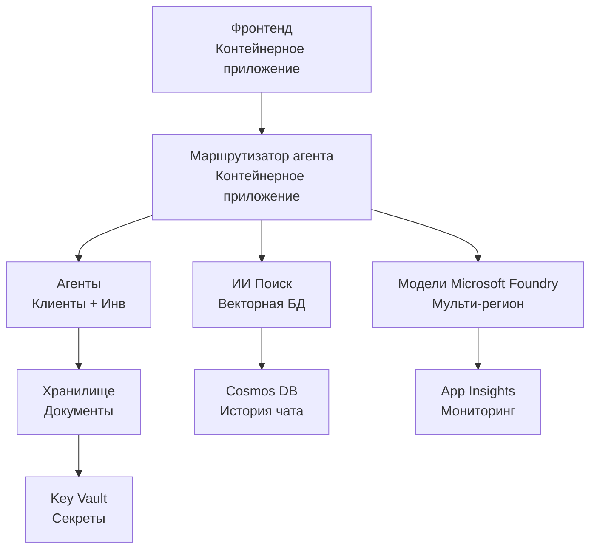

# Решение для розничной торговли с несколькими агентами - Шаблон инфраструктуры

**Глава 5: Пакет для развертывания в продакшене**
- **📚 Главная страница курса**: [AZD для начинающих](../../README.md)
- **📖 Связанная глава**: [Глава 5: Сложные решения с несколькими агентами AI](../../README.md#-chapter-5-multi-agent-ai-solutions-advanced)
- **📝 Руководство по сценарию**: [Полная архитектура](../retail-scenario.md)
- **🎯 Быстрое развертывание**: [Однокликовое развертывание](../../../../examples/retail-multiagent-arm-template)

> **⚠️ ТОЛЬКО ШАБЛОН ИНФРАСТРУКТУРЫ**  
> Этот ARM-шаблон развертывает **ресурсы Azure** для системы с несколькими агентами.  
>  
> **Что развернется (15-25 минут):**
> - ✅ Сервисы Microsoft Foundry Models (gpt-4.1, gpt-4.1-mini, embeddings в 3 регионах)
> - ✅ Сервис AI Search (пустой, готов к созданию индекса)
> - ✅ Приложения контейнеров (зависимые образы-заглушки, готовые для вашего кода)
> - ✅ Хранилище, Cosmos DB, Key Vault, Application Insights
>  
> **Что НЕ включено (требуется разработка):**
> - ❌ Код реализации агентов (Customer Agent, Inventory Agent)
> - ❌ Логика маршрутизации и API-конечные точки
> - ❌ Фронтенд чат-интерфейс
> - ❌ Схемы индексов поиска и конвейеры данных
> - ❌ **Оценочное время разработки: 80-120 часов**
>  
> **Используйте этот шаблон если:**
> - ✅ Хотите развернуть инфраструктуру Azure для проекта с несколькими агентами
> - ✅ Планируете разработку реализации агентов отдельно
> - ✅ Нужна инфраструктурная база, готовая к продакшену
>  
> **Не используйте если:**
> - ❌ Ожидаете сразу готовое демо с несколькими агентами
> - ❌ Ищете примеры полного кода приложений

## Обзор

Этот каталог содержит полный шаблон Azure Resource Manager (ARM) для развертывания **фундамента инфраструктуры** системы поддержки клиентов с несколькими агентами. Шаблон создает все необходимые сервисы Azure, настроенные и связные, готовые для разработки вашего приложения.

**После развертывания у вас будет:** Инфраструктура Azure, готовая к продакшену  
**Чтобы завершить систему, вам потребуется:** Код агентов, фронтенд UI и настройка данных (см. [Руководство по архитектуре](../retail-scenario.md))

## 🎯 Что развертывается

### Основная инфраструктура (состояние после развертывания)

✅ **Сервисы Microsoft Foundry Models** (Готовы к API вызовам)
  - Основной регион: развертывание gpt-4.1 (мощность 20K TPM)
  - Вторичный регион: развертывание gpt-4.1-mini (мощность 10K TPM)
  - Третичный регион: модель текстовых эмбеддингов (30K TPM)
  - Регион оценки: модель gpt-4.1 grader (15K TPM)
  - **Статус:** Полностью функционирует - можно вызывать API сразу

✅ **Azure AI Search** (Пустой - готов к настройке)
  - Включены возможности векторного поиска
  - Стандартный тариф с 1 разбиением и 1 репликой
  - **Статус:** Сервис запущен, требуется создание индекса
  - **Действие:** Создайте индекс поиска со своей схемой

✅ **Аккаунт Azure Storage** (Пустой - готов для загрузок)
  - Blob контейнеры: `documents`, `uploads`
  - Безопасная конфигурация (только HTTPS, без публичного доступа)
  - **Статус:** Готов принимать файлы
  - **Действие:** Загрузите ваши данные о продуктах и документы

⚠️ **Среда контейнерных приложений** (Развернуты образы-заглушки)
  - Приложение маршрутизатора агентов (стандартный образ nginx)
  - Фронтенд приложение (стандартный образ nginx)
  - Автомасштабирование настроено (0-10 экземпляров)
  - **Статус:** Запущены контейнеры-заглушки
  - **Действие:** Создайте и разверните ваши агентские приложения

✅ **Azure Cosmos DB** (Пустой - готов для данных)
  - Настроена база данных и контейнер
  - Оптимизирован для операций с низкой задержкой
  - Включен TTL для автоматической очистки
  - **Статус:** Готов хранить историю чатов

✅ **Azure Key Vault** (Опционально - готов для секретов)
  - Включено мягкое удаление
  - Конфигурация RBAC для управляемых идентичностей
  - **Статус:** Готов хранить API-ключи и строки подключения

✅ **Application Insights** (Опционально - мониторинг активен)
  - Подключен к рабочей области Log Analytics
  - Настроены пользовательские метрики и оповещения
  - **Статус:** Готов принимать телеметрию от приложений

✅ **Document Intelligence** (Готов для API вызовов)
  - Тариф S0 для продакшен-нагрузок
  - **Статус:** Готов обрабатывать загруженные документы

✅ **Bing Search API** (Готов для API вызовов)
  - Тариф S1 для поиска в реальном времени
  - **Статус:** Готов к веб-поисковым запросам

### Режимы развертывания

| Режим | Мощность OpenAI | Экземпляры контейнеров | Тариф поиска | Избыточность хранилища | Лучшее применение |
|-------|-----------------|-----------------------|--------------|-----------------------|-------------------|
| **Минимальный** | 10K-20K TPM | 0-2 реплики | Basic | LRS (локальная) | Разработка/тестирование, обучение, proof-of-concept |
| **Стандартный** | 30K-60K TPM | 2-5 реплик | Стандарт | ZRS (зональная) | Продакшен, умеренный трафик (<10K пользователей) |
| **Премиум** | 80K-150K TPM | 5-10 реплик, зонально-избыточные | Премиум | GRS (гео-избыточность) | Корпоративный, высокий трафик (>10K пользователей), 99,99% SLA |

**Влияние на стоимость:**
- **Минимальный → Стандартный:** увеличение стоимости примерно в 4 раза ($100-370/мес → $420-1,450/мес)
- **Стандартный → Премиум:** увеличение стоимости примерно в 3 раза ($420-1,450/мес → $1,150-3,500/мес)
- **Выбор зависит от:** ожидаемой нагрузки, требований SLA, бюджета

**Планирование мощности:**
- **TPM (Токенов в минуту):** Суммарно по всем развернутым моделям
- **Экземпляры контейнеров:** Диапазон автомасштабирования (минимум-максимум реплик)
- **Тариф поиска:** Влияет на производительность запросов и ограничения по размеру индекса

## 📋 Требования

### Необходимые инструменты
1. **Azure CLI** (версия 2.50.0 или выше)
   ```bash
   az --version  # Проверить версию
   az login      # Аутентификация
   ```

2. **Активная подписка Azure** с правами владельца или участника
   ```bash
   az account show  # Проверить подписку
   ```

### Требуемые квоты Azure

Перед развертыванием проверьте достаточность квот в целевых регионах:

```bash
# Проверьте доступность Microsoft Foundry моделей в вашем регионе
az cognitiveservices account list-skus \
  --kind OpenAI \
  --location eastus2

# Проверьте квоту OpenAI (пример для gpt-4.1)
az cognitiveservices usage list \
  --location eastus2 \
  --query "[?name.value=='OpenAI.Standard.gpt-4.1']"

# Проверьте квоту Container Apps
az provider show \
  --namespace Microsoft.App \
  --query "resourceTypes[?resourceType=='managedEnvironments'].locations"
```

**Минимально необходимые квоты:**
- **Microsoft Foundry Models:** 3-4 развертывания моделей по регионам
  - gpt-4.1: 20K TPM (токенов в минуту)
  - gpt-4.1-mini: 10K TPM
  - text-embedding-ada-002: 30K TPM
  - **Примечание:** gpt-4.1 может требовать лист ожидания в некоторых регионах - проверяйте [доступность моделей](https://learn.microsoft.com/azure/ai-services/openai/concepts/models)
- **Container Apps:** Управляемая среда + 2-10 экземпляров контейнеров
- **AI Search:** Стандартный уровень (Basic недостаточен для векторного поиска)
- **Cosmos DB:** Стандартный пропуск пропускной способности

**Если квот недостаточно:**
1. Перейдите в портал Azure → Квоты → Запросить увеличение
2. Или используйте Azure CLI:
   ```bash
   az support tickets create \
     --ticket-name "OpenAI-Quota-Increase" \
     --severity "minimal" \
     --description "Request quota increase for Microsoft Foundry Models gpt-4.1 in eastus2"
   ```
3. Рассмотрите альтернативные регионы с доступностью

## 🚀 Быстрое развертывание

### Вариант 1: Использование Azure CLI

```bash
# Клонировать или скачать файлы шаблона
git clone <repository-url>
cd examples/retail-multiagent-arm-template

# Сделать скрипт развертывания исполняемым
chmod +x deploy.sh

# Развернуть с настройками по умолчанию
./deploy.sh -g myResourceGroup

# Развернуть в производственной среде с премиальными функциями
./deploy.sh -g myProdRG -e prod -m premium -l eastus2
```

### Вариант 2: Использование портала Azure

[](https://portal.azure.com/#create/Microsoft.Template/uri/https%3A%2F%2Fraw.githubusercontent.com%2Fmicrosoft%2Fazd-for-beginners%2Fmain%2Fexamples%2Fretail-multiagent-arm-template%2Fazuredeploy.json)

### Вариант 3: Прямое использование Azure CLI

```bash
# Создать группу ресурсов
az group create --name myResourceGroup --location eastus2

# Развернуть шаблон
az deployment group create \
  --resource-group myResourceGroup \
  --template-file azuredeploy.json \
  --parameters azuredeploy.parameters.json
```

## ⏱️ Временная шкала развертывания

### Чего ожидать

| Фаза | Продолжительность | Что происходит |
|-------|------------------|---------------||
| **Проверка шаблона** | 30-60 секунд | Azure проверяет синтаксис и параметры ARM шаблона |
| **Создание группы ресурсов** | 10-20 секунд | Создает группу ресурсов (если нужно) |
| **Provisioning OpenAI** | 5-8 минут | Создает 3-4 аккаунта OpenAI и развертывает модели |
| **Контейнерные приложения** | 3-5 минут | Создаёт среду и развертывает контейнеры-заглушки |
| **Поиск и хранилище** | 2-4 минуты | Прокладывает сервис AI Search и аккаунты хранения |
| **Cosmos DB** | 2-3 минуты | Создает базу и настраивает контейнеры |
| **Настройка мониторинга** | 2-3 минуты | Настраивает Application Insights и Log Analytics |
| **Настройка RBAC** | 1-2 минуты | Конфигурирует управляемые идентичности и права |
| **Общее время** | **15-25 минут** | Полная готовая инфраструктура |

**После развертывания:**
- ✅ **Инфраструктура готова:** Все сервисы Azure созданы и работают
- ⏱️ **Разработка приложения:** 80-120 часов (ваша ответственность)
- ⏱️ **Настройка индексов:** 15-30 минут (требуется ваша схема)
- ⏱️ **Загрузка данных:** зависит от объема данных
- ⏱️ **Тестирование и валидация:** 2-4 часа

---

## ✅ Проверка успешности развертывания

### Шаг 1: Проверка создания ресурсов (2 минуты)

```bash
# Проверьте, что все ресурсы развернуты успешно
az resource list \
  --resource-group myResourceGroup \
  --query "[?provisioningState!='Succeeded'].{Name:name, Status:provisioningState, Type:type}" \
  --output table
```

**Ожидается:** Пустая таблица (все ресурсы имеют статус "Succeeded")

### Шаг 2: Проверка развертываний Microsoft Foundry Models (3 минуты)

```bash
# Перечислить все аккаунты OpenAI
az cognitiveservices account list \
  --resource-group myResourceGroup \
  --query "[?kind=='OpenAI'].{Name:name, Location:location, Status:properties.provisioningState}" \
  --output table

# Проверить развертывания моделей для основного региона
OPENAI_NAME=$(az cognitiveservices account list \
  --resource-group myResourceGroup \
  --query "[?kind=='OpenAI'] | [0].name" -o tsv)

az cognitiveservices account deployment list \
  --name $OPENAI_NAME \
  --resource-group myResourceGroup \
  --output table
```

**Ожидается:** 
- 3-4 аккаунта OpenAI (основной, вторичный, третичный, регион оценки)
- 1-2 развертывания моделей на аккаунт (gpt-4.1, gpt-4.1-mini, text-embedding-ada-002)

### Шаг 3: Тестирование конечных точек инфраструктуры (5 минут)

```bash
# Получить URL-адреса контейнерного приложения
az containerapp list \
  --resource-group myResourceGroup \
  --query "[].{Name:name, URL:properties.configuration.ingress.fqdn, Status:properties.runningStatus}" \
  --output table

# Тестировать конечную точку маршрутизатора (ответит заглушка изображения)
ROUTER_URL=$(az containerapp show \
  --name retail-router \
  --resource-group myResourceGroup \
  --query "properties.configuration.ingress.fqdn" -o tsv)

echo "Testing: https://$ROUTER_URL"
curl -I https://$ROUTER_URL || echo "Container running (placeholder image - expected)"
```

**Ожидается:** 
- Приложения контейнеров показывают статус "Running"
- Заглушка nginx отвечает HTTP 200 или 404 (код приложения отсутствует)

### Шаг 4: Проверка доступа к API Microsoft Foundry Models (3 минуты)

```bash
# Получить конечную точку и ключ OpenAI
OPENAI_ENDPOINT=$(az cognitiveservices account show \
  --name $OPENAI_NAME \
  --resource-group myResourceGroup \
  --query "properties.endpoint" -o tsv)

OPENAI_KEY=$(az cognitiveservices account keys list \
  --name $OPENAI_NAME \
  --resource-group myResourceGroup \
  --query "key1" -o tsv)

# Тест развертывания gpt-4.1
curl "${OPENAI_ENDPOINT}openai/deployments/gpt-4.1/chat/completions?api-version=2024-08-01-preview" \
  -H "Content-Type: application/json" \
  -H "api-key: $OPENAI_KEY" \
  -d '{
    "messages": [{"role": "user", "content": "Say hello"}],
    "max_tokens": 10
  }'
```

**Ожидается:** JSON ответ с завершением чата (подтверждает работоспособность OpenAI)

### Работает vs Не работает

**✅ Работает после развертывания:**
- Развернуты модели Microsoft Foundry Models и доступ по API
- Запущен сервис AI Search (пустой, без индексов)
- Запущены контейнерные приложения (образы nginx-заглушки)
- Доступны аккаунты хранения и готовы к загрузкам
- Cosmos DB готов к операциям с данными
- Application Insights собирает телеметрию инфраструктуры
- Key Vault готов к хранению секретов

**❌ Еще не работает (требуется разработка):**
- Конечные точки агентов (код приложения не развернут)
- Функция чата (требуется фронтенд + бэкенд)
- Поисковые запросы (индекс поиска не создан)
- Обработка документов (данные не загружены)
- Пользовательская телеметрия (требуется инструментирование)

**Следующие шаги:** смотрите [Конфигурация после развертывания](../../../../examples/retail-multiagent-arm-template) для разработки и развертывания вашего приложения

---

## ⚙️ Опции конфигурации

### Параметры шаблона

| Параметр | Тип | Значение по умолчанию | Описание |
|----------|-----|-----------------------|----------|
| `projectName` | string | "retail" | Префикс для всех имен ресурсов |
| `location` | string | Расположение группы ресурсов | Основной регион развертывания |
| `secondaryLocation` | string | "westus2" | Вторичный регион для мульти-регионального развертывания |
| `tertiaryLocation` | string | "francecentral" | Регион для модели эмбеддингов |
| `environmentName` | string | "dev" | Название окружения (dev/staging/prod) |
| `deploymentMode` | string | "standard" | Конфигурация развертывания (minimal/standard/premium) |
| `enableMultiRegion` | bool | true | Включить мульти-региональное развертывание |
| `enableMonitoring` | bool | true | Включить Application Insights и логирование |
| `enableSecurity` | bool | true | Включить Key Vault и расширенную безопасность |

### Настройка параметров

Отредактируйте `azuredeploy.parameters.json`:

```json
{
  "$schema": "https://schema.management.azure.com/schemas/2019-04-01/deploymentParameters.json#",
  "contentVersion": "1.0.0.0",
  "parameters": {
    "projectName": {
      "value": "mycompany"
    },
    "environmentName": {
      "value": "prod"
    },
    "deploymentMode": {
      "value": "premium"
    },
    "location": {
      "value": "eastus2"
    }
  }
}
```

## 🏗️ Обзор архитектуры


## 📖 Использование скрипта развертывания

Скрипт `deploy.sh` предоставляет интерактивный опыт развертывания:

```bash
# Показать помощь
./deploy.sh --help

# Базовое развертывание
./deploy.sh -g myResourceGroup

# Расширенное развертывание с пользовательскими настройками
./deploy.sh \
  -g myProductionRG \
  -p companyname \
  -e prod \
  -m premium \
  -l eastus2

# Развертывание для разработки без мульти-регионов
./deploy.sh \
  -g myDevRG \
  -e dev \
  -m minimal \
  --no-multi-region \
  --no-security
```

### Особенности скрипта

- ✅ **Проверка предварительных требований** (Azure CLI, статус входа, файлы шаблона)
- ✅ **Управление группой ресурсов** (создает, если не существует)
- ✅ **Валидация шаблона** перед развертыванием
- ✅ **Отслеживание прогресса** с цветным выводом
- ✅ **Отображение выходных данных развертывания**
- ✅ **Руководство по действиям после развертывания**

## 📊 Мониторинг развертывания

### Проверка состояния развертывания

```bash
# Список развертываний
az deployment group list --resource-group myResourceGroup --output table

# Получить детали развертывания
az deployment group show \
  --resource-group myResourceGroup \
  --name retail-deployment-YYYYMMDD-HHMMSS

# Отслеживать прогресс развертывания
az deployment group create \
  --resource-group myResourceGroup \
  --template-file azuredeploy.json \
  --parameters azuredeploy.parameters.json \
  --verbose
```

### Выходные данные после развертывания

После успешного развертывания доступны следующие выходные данные:

- **URL фронтенда**: Публичный адрес веб-интерфейса
- **URL маршрутизатора**: API-конечная точка для маршрутизатора агентов
- **OpenAI endpoints**: Основной и вторичный сервисы OpenAI
- **Search Service**: Адрес сервиса Azure AI Search
- **Аккаунт хранения**: Имя аккаунта для документов
- **Key Vault**: Имя Key Vault (если включен)
- **Application Insights**: Имя сервиса мониторинга (если включен)

## 🔧 После развертывания: Следующие шаги
> **📝 Важно:** Инфраструктура развернута, но вам нужно разработать и развернуть код приложения.

### Фаза 1: Разработка приложений агентов (Ваша ответственность)

ARM-шаблон создает **пустые Container Apps** с заглушечными образами nginx. Вам необходимо:

**Требуемая разработка:**
1. **Реализация агента** (30-40 часов)
   - Агент службы поддержки с интеграцией gpt-4.1
   - Агент инвентаризации с интеграцией gpt-4.1-mini
   - Логика маршрутизации агентов

2. **Разработка frontend** (20-30 часов)
   - UI чат-интерфейса (React/Vue/Angular)
   - Функция загрузки файлов
   - Отображение и форматирование ответов

3. **Backend-сервисы** (12-16 часов)
   - FastAPI или роутер Express
   - Middleware для аутентификации
   - Интеграция телеметрии

**См.:** [Руководство по архитектуре](../retail-scenario.md) для детальных шаблонов реализации и примеров кода

### Фаза 2: Настройка индекса поиска AI (15-30 минут)

Создайте индекс поиска, соответствующий вашей модели данных:

```bash
# Получить сведения о сервисе поиска
SEARCH_NAME=$(az search service list \
  --resource-group myResourceGroup \
  --query "[0].name" -o tsv)

SEARCH_KEY=$(az search admin-key show \
  --service-name $SEARCH_NAME \
  --resource-group myResourceGroup \
  --query "primaryKey" -o tsv)

# Создать индекс с вашей схемой (пример)
curl -X POST "https://${SEARCH_NAME}.search.windows.net/indexes?api-version=2023-11-01" \
  -H "Content-Type: application/json" \
  -H "api-key: ${SEARCH_KEY}" \
  -d '{
    "name": "products",
    "fields": [
      {"name": "id", "type": "Edm.String", "key": true},
      {"name": "title", "type": "Edm.String", "searchable": true},
      {"name": "content", "type": "Edm.String", "searchable": true},
      {"name": "category", "type": "Edm.String", "filterable": true},
      {"name": "content_vector", "type": "Collection(Edm.Single)", 
       "searchable": true, "dimensions": 1536, "vectorSearchProfile": "default"}
    ],
    "vectorSearch": {
      "algorithms": [{"name": "default", "kind": "hnsw"}],
      "profiles": [{"name": "default", "algorithm": "default"}]
    }
  }'
```

**Ресурсы:**
- [Проектирование схемы индекса поиска AI](https://learn.microsoft.com/azure/search/search-what-is-an-index)
- [Настройка векторного поиска](https://learn.microsoft.com/azure/search/vector-search-how-to-create-index)

### Фаза 3: Загрузка ваших данных (Время зависит от объема)

Когда у вас появятся данные о продуктах и документы:

```bash
# Получить детали учетной записи хранения
STORAGE_NAME=$(az storage account list \
  --resource-group myResourceGroup \
  --query "[0].name" -o tsv)

STORAGE_KEY=$(az storage account keys list \
  --account-name $STORAGE_NAME \
  --resource-group myResourceGroup \
  --query "[0].value" -o tsv)

# Загрузите ваши документы
az storage blob upload-batch \
  --destination documents \
  --source /path/to/your/product/docs \
  --account-name $STORAGE_NAME \
  --account-key $STORAGE_KEY

# Пример: Загрузить один файл
az storage blob upload \
  --container-name documents \
  --name "product-manual.pdf" \
  --file /path/to/product-manual.pdf \
  --account-name $STORAGE_NAME \
  --account-key $STORAGE_KEY
```

### Фаза 4: Сборка и развертывание ваших приложений (8-12 часов)

После разработки кода агентов:

```bash
# 1. Создать Azure Container Registry (если необходимо)
az acr create \
  --name myregistry \
  --resource-group myResourceGroup \
  --sku Basic

# 2. Собрать и отправить образ маршрутизатора агента
docker build -t myregistry.azurecr.io/agent-router:v1 /path/to/your/router/code
az acr login --name myregistry
docker push myregistry.azurecr.io/agent-router:v1

# 3. Собрать и отправить образ фронтенда
docker build -t myregistry.azurecr.io/frontend:v1 /path/to/your/frontend/code
docker push myregistry.azurecr.io/frontend:v1

# 4. Обновить Container Apps с вашими образами
az containerapp update \
  --name retail-router \
  --resource-group myResourceGroup \
  --image myregistry.azurecr.io/agent-router:v1

az containerapp update \
  --name retail-frontend \
  --resource-group myResourceGroup \
  --image myregistry.azurecr.io/frontend:v1

# 5. Настроить переменные окружения
az containerapp update \
  --name retail-router \
  --resource-group myResourceGroup \
  --set-env-vars \
    OPENAI_ENDPOINT=secretref:openai-endpoint \
    OPENAI_KEY=secretref:openai-key \
    SEARCH_ENDPOINT=secretref:search-endpoint \
    SEARCH_KEY=secretref:search-key
```

### Фаза 5: Тестирование вашего приложения (2-4 часа)

```bash
# Получите URL вашего приложения
ROUTER_URL=$(az containerapp show \
  --name retail-router \
  --resource-group myResourceGroup \
  --query "properties.configuration.ingress.fqdn" -o tsv)

# Тестовая конечная точка агента (после развертывания вашего кода)
curl -X POST "https://${ROUTER_URL}/chat" \
  -H "Content-Type: application/json" \
  -d '{
    "message": "Hello, I need help with my order",
    "agent": "customer"
  }'

# Проверьте журналы приложения
az containerapp logs show \
  --name retail-router \
  --resource-group myResourceGroup \
  --follow
```

### Ресурсы для реализации

**Архитектура и дизайн:**
- 📖 [Полное руководство по архитектуре](../retail-scenario.md) — подробные шаблоны реализации
- 📖 [Шаблоны дизайна мультиагентных систем](https://learn.microsoft.com/azure/architecture/ai-ml/guide/multi-agent-systems)

**Примеры кода:**
- 🔗 [Пример чата на Microsoft Foundry Models](https://github.com/Azure-Samples/azure-search-openai-demo) — паттерн RAG
- 🔗 [Semantic Kernel](https://github.com/microsoft/semantic-kernel) — фреймворк агентов (C#)
- 🔗 [LangChain Azure](https://github.com/langchain-ai/langchain) — оркестрация агентов (Python)
- 🔗 [AutoGen](https://github.com/microsoft/autogen) — мультиягентные диалоги

**Оценка общего времени:**
- Развертывание инфраструктуры: 15-25 минут (✅ Завершено)
- Разработка приложения: 80-120 часов (🔨 Ваша работа)
- Тестирование и оптимизация: 15-25 часов (🔨 Ваша работа)

## 🛠️ Устранение неполадок

### Общие проблемы

#### 1. Превышена квота Microsoft Foundry Models

```bash
# Проверить текущее использование квоты
az cognitiveservices usage list --location eastus2

# Запросить увеличение квоты
az support tickets create \
  --ticket-name "OpenAI-Quota-Increase" \
  --severity "minimal" \
  --description "Request quota increase for Microsoft Foundry Models in region X"
```

#### 2. Не удалось развернуть Container Apps

```bash
# Проверить логи контейнерного приложения
az containerapp logs show \
  --name retail-router \
  --resource-group myResourceGroup \
  --follow

# Перезапустить контейнерное приложение
az containerapp revision restart \
  --name retail-router \
  --resource-group myResourceGroup
```

#### 3. Инициализация сервиса поиска

```bash
# Проверить состояние службы поиска
az search service show \
  --name <search-service-name> \
  --resource-group myResourceGroup

# Проверить подключение к службе поиска
curl -X GET "https://<search-service-name>.search.windows.net/indexes?api-version=2023-11-01" \
  -H "api-key: <search-admin-key>"
```

### Проверка развертывания

```bash
# Проверить создание всех ресурсов
az resource list \
  --resource-group myResourceGroup \
  --output table

# Проверить состояние ресурса
az resource list \
  --resource-group myResourceGroup \
  --query "[?provisioningState!='Succeeded'].{Name:name, Status:provisioningState, Type:type}" \
  --output table
```

## 🔐 Вопросы безопасности

### Управление ключами
- Все секреты хранятся в Azure Key Vault (если включено)
- Container Apps используют управляемую идентичность для аутентификации
- Аккаунты хранения настроены с безопасными параметрами (только HTTPS, без публичного доступа к blob)

### Безопасность сети
- Container Apps по возможности используют внутренние сети
- Сервис поиска настроен с опцией приватных конечных точек
- Cosmos DB настроен с минимально необходимыми правами

### Настройка RBAC
```bash
# Назначьте необходимые роли для управляемой идентичности
az role assignment create \
  --assignee <container-app-managed-identity> \
  --role "Cognitive Services OpenAI User" \
  --scope <openai-resource-id>
```

## 💰 Оптимизация затрат

### Оценка затрат (в месяц, USD)

| Режим    | OpenAI   | Container Apps | Search  | Storage | Общая оценка |
|----------|----------|----------------|---------|---------|--------------|
| Минимальный | $50-200 | $20-50         | $25-100 | $5-20   | $100-370     |
| Стандартный | $200-800 | $100-300       | $100-300| $20-50  | $420-1450    |
| Премиум    | $500-2000| $300-800       | $300-600| $50-100 | $1150-3500   |

### Мониторинг затрат

```bash
# Настроить оповещения о бюджете
az consumption budget create \
  --account-name <subscription-id> \
  --budget-name "retail-budget" \
  --amount 500 \
  --time-grain Monthly \
  --start-date 2024-01-01 \
  --end-date 2024-12-31
```

## 🔄 Обновления и сопровождение

### Обновления шаблона
- Версионирование файлов ARM-шаблона
- Сначала тестировать изменения в dev-среде
- Использовать режим инкрементного развертывания для обновлений

### Обновления ресурсов
```bash
# Обновить с новыми параметрами
az deployment group create \
  --resource-group myResourceGroup \
  --template-file azuredeploy.json \
  --parameters azuredeploy.parameters.json \
  --mode Incremental
```

### Резервное копирование и восстановление
- Включено автоматическое резервное копирование Cosmos DB
- Включено мягкое удаление в Key Vault
- Поддерживаются ревизии Container Apps для отката

## 📞 Поддержка

- **Проблемы с шаблоном:** [GitHub Issues](https://github.com/microsoft/azd-for-beginners/issues)
- **Поддержка Azure:** [Портал поддержки Azure](https://portal.azure.com/#blade/Microsoft_Azure_Support/HelpAndSupportBlade)
- **Сообщество:** [Azure AI Discord](https://discord.gg/microsoft-azure)

---

**⚡ Готовы развернуть ваше мультиягентное решение?**

Начните с: `./deploy.sh -g myResourceGroup`

---

<!-- CO-OP TRANSLATOR DISCLAIMER START -->
**Отказ от ответственности**:  
Этот документ был переведен с помощью AI-сервиса перевода [Co-op Translator](https://github.com/Azure/co-op-translator). Несмотря на наши усилия обеспечить точность, просим учитывать, что автоматический перевод может содержать ошибки или неточности. Оригинальный документ на исходном языке следует считать достоверным и авторитетным источником. Для получения критически важной информации рекомендуется использовать профессиональный перевод, выполненный человеком. Мы не несем ответственности за любые недоразумения или неверные толкования, возникшие в результате использования данного перевода.
<!-- CO-OP TRANSLATOR DISCLAIMER END -->