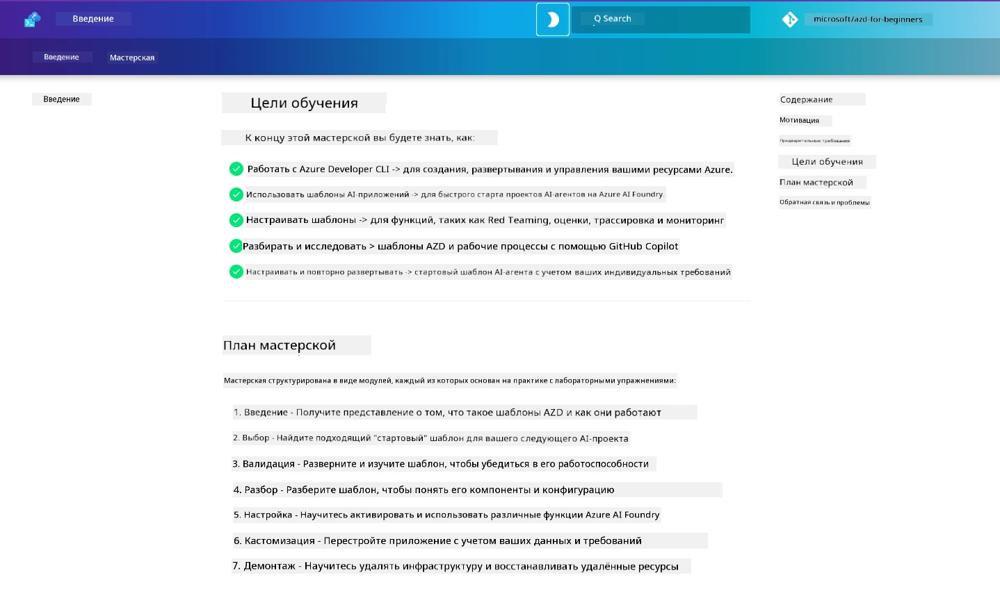

<div align="center">
  <div style="background: linear-gradient(135deg, #0078d4, #106ebe); border-radius: 10px; padding: 20px; margin: 20px 0; box-shadow: 0 4px 15px rgba(0, 120, 212, 0.3); border: 2px solid #005a9e;">
    <h2 style="color: white; margin: 0; font-size: 24px; text-shadow: 1px 1px 2px rgba(0,0,0,0.3);">
      🎯 Семинар AZD для разработчиков ИИ
    </h2>
    <p style="color: white; margin: 10px 0 0 0; font-size: 16px; text-shadow: 1px 1px 2px rgba(0,0,0,0.3);">
      <strong>Практический семинар по созданию приложений ИИ с помощью Azure Developer CLI.</strong><br>
      Пройдите 7 модулей, чтобы освоить шаблоны AZD и рабочие процессы развертывания ИИ.
    </p>
    <div style="margin-top: 15px;">
      <span style="background: rgba(255,255,255,0.2); padding: 5px 10px; border-radius: 15px; color: white; font-size: 14px;">
        📅 Последнее обновление: февраль 2026
      </span>
    </div>
  </div>
</div>

# Семинар AZD для разработчиков ИИ

Добро пожаловать на практический семинар по изучению Azure Developer CLI (AZD) с акцентом на развертывание приложений ИИ. Этот семинар поможет вам получить прикладное понимание шаблонов AZD в 3 шага:

1. **Поиск** — найдите подходящий шаблон.
1. **Развертывание** — разверните и проверьте его работоспособность.
1. **Настройка** — изменяйте и совершенствуйте, чтобы сделать его своим!

В ходе семинара вы также познакомитесь с основными инструментами разработчика и рабочими процессами, которые помогут оптимизировать ваш полный цикл разработки.

<br/>

## Руководство на базе браузера

Уроки семинара представлены в формате Markdown. Вы можете просматривать их напрямую на GitHub — или запустить предварительный просмотр в браузере, как показано на скриншоте ниже.



Чтобы использовать этот вариант — сделайте форк репозитория в свой профиль и запустите GitHub Codespaces. Как только терминал VS Code станет активен, введите эту команду:

```bash title="" linenums="0"
mkdocs serve > /dev/null 2>&1 &
```

Через несколько секунд появится всплывающее окно. Выберите опцию `Open in browser`. Веб-руководство откроется в новой вкладке браузера. Некоторые преимущества этого просмотра:

1. **Встроенный поиск** — быстро находите ключевые слова или уроки.
1. **Иконка копирования** — наведите курсор на блоки кода, чтобы увидеть эту опцию.
1. **Переключение темы** — меняйте между темной и светлой темами.
1. **Получить помощь** — кликните по иконке Discord в нижнем колонтитуле, чтобы присоединиться!

<br/>

## Обзор семинара

**Длительность:** 3-4 часа  
**Уровень:** начальный и средний  
**Требования:** знакомство с Azure, основами ИИ, VS Code и командной строкой.

Это практический семинар, где вы учитесь через выполнение. После выполнения упражнений рекомендуем ознакомиться с программой AZD для начинающих, чтобы продолжить обучение лучшим практикам безопасности и продуктивности.

| Время | Модуль  | Цель |
|:---|:---|:---|
| 15 мин | [Введение](docs/instructions/0-Introduction.md) | Ознакомление, постановка целей |
| 30 мин | [Выбор шаблона ИИ](docs/instructions/1-Select-AI-Template.md) | Изучить варианты и выбрать стартовый | 
| 30 мин | [Проверка шаблона ИИ](docs/instructions/2-Validate-AI-Template.md) | Развернуть решение по умолчанию в Azure |
| 30 мин | [Разбор шаблона ИИ](docs/instructions/3-Deconstruct-AI-Template.md) | Изучить структуру и конфигурацию |
| 30 мин | [Настройка шаблона ИИ](docs/instructions/4-Configure-AI-Template.md) | Активировать и протестировать доступные возможности |
| 30 мин | [Кастомизация шаблона ИИ](docs/instructions/5-Customize-AI-Template.md) | Адаптировать шаблон под свои нужды |
| 30 мин | [Удаление инфраструктуры](docs/instructions/6-Teardown-Infrastructure.md) | Очистка и освобождение ресурсов |
| 15 мин | [Итоги и дальнейшие шаги](docs/instructions/7-Wrap-up.md) | Ресурсы для обучения, вызовы семинара |

<br/>

## Что вы изучите

Рассматривайте шаблон AZD как учебную песочницу для изучения различных возможностей и инструментов для полного цикла разработки в Microsoft Foundry. К концу семинара у вас должно сформироваться интуитивное понимание различных инструментов и концепций.

| Концепция  | Цель |
|:---|:---|
| **Azure Developer CLI** | Понять команды инструментов и рабочие процессы |
| **Шаблоны AZD**| Понять структуру проекта и конфигурацию |
| **Azure AI Agent**| Создание и развертывание проекта Microsoft Foundry |
| **Azure AI Search**| Включение инженерии контекста с агентами |
| **Обозримость**| Изучение трассировки, мониторинга и оценок |
| **Red Teaming**| Изучение адверсариального тестирования и мер смягчения |

<br/>

## Структура семинара

Семинар построен так, чтобы взять вас в путешествие от поиска шаблона до развертывания, разборки и кастомизации — с использованием официального стартового шаблона [Getting Started with AI Agents](https://github.com/Azure-Samples/get-started-with-ai-agents) в качестве основы.

### [Модуль 1: Выбор шаблона ИИ](docs/instructions/1-Select-AI-Template.md) (30 мин)

- Что такое шаблоны ИИ?
- Где найти шаблоны ИИ?
- Как начать строить ИИ-агентов?
- **Лабораторная работа**: Быстрый старт с GitHub Codespaces

### [Модуль 2: Проверка шаблона ИИ](docs/instructions/2-Validate-AI-Template.md) (30 мин)

- Какова архитектура шаблона ИИ?
- Каков рабочий процесс разработки AZD?
- Как получить помощь по разработке AZD?
- **Лабораторная работа**: Развертывание и проверка шаблона ИИ-агентов

### [Модуль 3: Разбор шаблона ИИ](docs/instructions/3-Deconstruct-AI-Template.md) (30 мин)

- Изучение вашей среды в `.azure/` 
- Изучение настройки ресурсов в `infra/` 
- Изучение конфигурации AZD в `azure.yaml`s
- **Лабораторная работа**: Изменение переменных среды и повторное развертывание

### [Модуль 4: Настройка шаблона ИИ](docs/instructions/4-Configure-AI-Template.md) (30 мин)
- Изучение: Retrieval Augmented Generation
- Изучение: Оценка агентов и Red Teaming
- Изучение: Трассировка и мониторинг
- **Лабораторная работа**: Исследование ИИ-агента и обозримости

### [Модуль 5: Кастомизация шаблона ИИ](docs/instructions/5-Customize-AI-Template.md) (30 мин)
- Определение: PRD с требованиями сценария
- Настройка: переменные окружения для AZD
- Реализация: хуков жизненного цикла для дополнительных задач
- **Лабораторная работа**: Кастомизация шаблона под мой сценарий

### [Модуль 6: Удаление инфраструктуры](docs/instructions/6-Teardown-Infrastructure.md) (30 мин)
- Резюме: Что такое шаблоны AZD?
- Резюме: Почему использовать Azure Developer CLI?
- Следующие шаги: Попробуйте другой шаблон!
- **Лабораторная работа**: Деактивация инфраструктуры и очистка

<br/>

## Вызов семинара

Хотите проверить себя и сделать больше? Вот несколько предложений проектов — или поделитесь своими идеями с нами!

| Проект | Описание |
|:---|:---|
|1. **Разбор сложного шаблона ИИ** | Используйте описанный нами рабочий процесс и инструменты, попробуйте развернуть, проверить и кастомизировать другой шаблон решения ИИ. _Что вы узнали?_|
|2. **Кастомизация под ваш сценарий**  | Попробуйте написать PRD (Документ с требованиями к продукту) для другого сценария. Затем используйте GitHub Copilot в вашем репо шаблона в режиме Agent Model — и попросите его сгенерировать рабочий процесс кастомизации для вас. _Что вы узнали? Как можно улучшить эти предложения?_|
| | |

## Есть отзывы?

1. Опубликуйте issue в этом репозитории — отметьте его тегом `Workshop` для удобства.
1. Присоединяйтесь к Discord Microsoft Foundry — общайтесь с коллегами!


| | | 
|:---|:---|
| **📚 Главная курса**| [AZD для начинающих](../README.md)|
| **📖 Документация** | [Начало работы с шаблонами ИИ](https://learn.microsoft.com/en-us/azure/ai-foundry/how-to/develop/ai-template-get-started)|
| **🛠️Шаблоны ИИ** | [Шаблоны Microsoft Foundry](https://ai.azure.com/templates) |
|**🚀 Следующие шаги** | [Начать семинар](../../../workshop) |
| | |

<br/>

---

**Навигация:** [Основной курс](../README.md) | [Введение](docs/instructions/0-Introduction.md) | [Модуль 1: Выбор шаблона](docs/instructions/1-Select-AI-Template.md)

**Готовы начать создавать приложения ИИ с AZD?**

[Начать семинар: Введение →](docs/instructions/0-Introduction.md)

---

<!-- CO-OP TRANSLATOR DISCLAIMER START -->
**Отказ от ответственности**:
Этот документ был переведен с помощью сервиса автоматического перевода [Co-op Translator](https://github.com/Azure/co-op-translator). Несмотря на наши усилия обеспечить точность, пожалуйста, имейте в виду, что автоматический перевод может содержать ошибки или неточности. Оригинальный документ на его исходном языке считается авторитетным источником. Для получения критически важной информации рекомендуется обращаться к профессиональному человеческому переводу. Мы не несем ответственности за любые недоразумения или неправильные толкования, возникшие в результате использования этого перевода.
<!-- CO-OP TRANSLATOR DISCLAIMER END -->