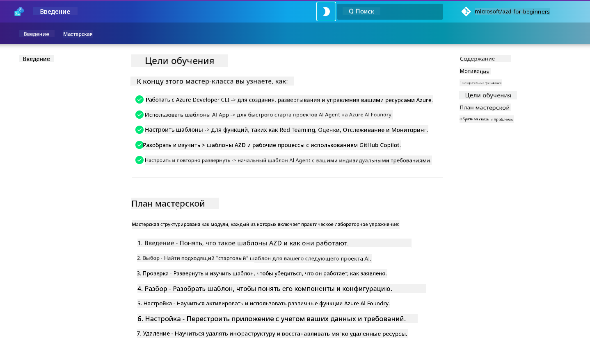

<!--
CO_OP_TRANSLATOR_METADATA:
{
  "original_hash": "9cc966416ab431c38b2ab863884b196c",
  "translation_date": "2025-09-24T11:40:04+00:00",
  "source_file": "workshop/README.md",
  "language_code": "ru"
}
-->
# AZD для разработчиков AI: мастер-класс

Добро пожаловать в практический мастер-класс по изучению Azure Developer CLI (AZD) с акцентом на развертывание AI-приложений. Этот мастер-класс поможет вам получить практическое понимание шаблонов AZD в 3 этапа:

1. **Ознакомление** - найти подходящий шаблон.
1. **Развертывание** - развернуть и убедиться, что он работает.
1. **Настройка** - изменить и адаптировать под себя!

В ходе мастер-класса вы также познакомитесь с основными инструментами и рабочими процессами разработчика, которые помогут вам оптимизировать весь процесс разработки.

<br/>

## Руководство в браузере

Уроки мастер-класса представлены в формате Markdown. Вы можете просматривать их прямо на GitHub или запустить предварительный просмотр в браузере, как показано на скриншоте ниже.



Чтобы воспользоваться этим вариантом, сделайте форк репозитория в свой профиль и запустите GitHub Codespaces. Когда терминал VS Code станет активным, введите эту команду:

```bash title="" linenums="0"
mkdocs serve > /dev/null 2>&1 &
```

Через несколько секунд появится диалоговое окно. Выберите опцию `Open in browser`. Веб-руководство откроется в новой вкладке браузера. Преимущества этого предварительного просмотра:

1. **Встроенный поиск** - быстро находите ключевые слова или уроки.
1. **Иконка копирования** - наведите курсор на блоки кода, чтобы увидеть эту опцию.
1. **Переключение темы** - переключайтесь между темной и светлой темами.
1. **Получить помощь** - нажмите на иконку Discord в нижнем колонтитуле, чтобы присоединиться!

<br/>

## Обзор мастер-класса

**Продолжительность:** 3-4 часа  
**Уровень:** Начальный - Средний  
**Предварительные знания:** Знакомство с Azure, концепциями AI, VS Code и инструментами командной строки.

Это практический мастер-класс, где вы учитесь через выполнение заданий. После завершения упражнений мы рекомендуем изучить курс AZD For Beginners, чтобы продолжить обучение в области безопасности и повышения продуктивности.

| Время | Модуль  | Цель |
|:---|:---|:---|
| 15 мин | [Введение](docs/instructions/0-Introduction.md) | Определить цели и задачи |
| 30 мин | [Выбор AI-шаблона](docs/instructions/1-Select-AI-Template.md) | Исследовать варианты и выбрать стартовый шаблон | 
| 30 мин | [Проверка AI-шаблона](docs/instructions/2-Validate-AI-Template.md) | Развернуть стандартное решение в Azure |
| 30 мин | [Разбор AI-шаблона](docs/instructions/3-Deconstruct-AI-Template.md) | Изучить структуру и конфигурацию |
| 30 мин | [Настройка AI-шаблона](docs/instructions/4-Configure-AI-Template.md) | Активировать и протестировать доступные функции |
| 30 мин | [Кастомизация AI-шаблона](docs/instructions/5-Customize-AI-Template.md) | Адаптировать шаблон под свои нужды |
| 30 мин | [Удаление инфраструктуры](docs/instructions/6-Teardown-Infrastructure.md) | Очистить и освободить ресурсы |
| 15 мин | [Заключение и дальнейшие шаги](docs/instructions/7-Wrap-up.md) | Ресурсы для обучения, вызов мастер-класса |

<br/>

## Чему вы научитесь

Думайте о шаблоне AZD как о учебной песочнице для изучения различных возможностей и инструментов для разработки на Azure AI Foundry. К концу мастер-класса вы получите интуитивное понимание различных инструментов и концепций в этом контексте.

| Концепция  | Цель |
|:---|:---|
| **Azure Developer CLI** | Понять команды и рабочие процессы инструмента |
| **Шаблоны AZD**| Понять структуру проекта и конфигурацию |
| **Azure AI Agent**| Развернуть проект Azure AI Foundry |
| **Azure AI Search**| Активировать контекстное проектирование с агентами |
| **Наблюдаемость**| Изучить трассировку, мониторинг и оценки |
| **Red Teaming**| Изучить тестирование на уязвимости и методы защиты |

<br/>

## Структура мастер-класса

Мастер-класс построен так, чтобы провести вас через процесс от выбора шаблона до его развертывания, анализа и кастомизации, используя официальный стартовый шаблон [Getting Started with AI Agents](https://github.com/Azure-Samples/get-started-with-ai-agents).

### [Модуль 1: Выбор AI-шаблона](docs/instructions/1-Select-AI-Template.md) (30 мин)

- Что такое AI-шаблоны?
- Где можно найти AI-шаблоны?
- Как начать создавать AI-агентов?
- **Лабораторная работа**: Быстрый старт с GitHub Codespaces

### [Модуль 2: Проверка AI-шаблона](docs/instructions/2-Validate-AI-Template.md) (30 мин)

- Какова архитектура AI-шаблона?
- Каков рабочий процесс разработки с AZD?
- Как получить помощь в разработке с AZD?
- **Лабораторная работа**: Развернуть и проверить шаблон AI-агентов

### [Модуль 3: Разбор AI-шаблона](docs/instructions/3-Deconstruct-AI-Template.md) (30 мин)

- Изучить окружение в `.azure/` 
- Изучить настройку ресурсов в `infra/` 
- Изучить конфигурацию AZD в `azure.yaml`
- **Лабораторная работа**: Изменить переменные окружения и повторно развернуть

### [Модуль 4: Настройка AI-шаблона](docs/instructions/4-Configure-AI-Template.md) (30 мин)
- Изучить: Retrieval Augmented Generation
- Изучить: Оценка агентов и Red Teaming
- Изучить: Трассировка и мониторинг
- **Лабораторная работа**: Изучить AI-агента + наблюдаемость 

### [Модуль 5: Кастомизация AI-шаблона](docs/instructions/5-Customize-AI-Template.md) (30 мин)
- Определить: PRD с требованиями сценария
- Настроить: Переменные окружения для AZD
- Реализовать: Lifecycle Hooks для дополнительных задач
- **Лабораторная работа**: Кастомизировать шаблон под мой сценарий

### [Модуль 6: Удаление инфраструктуры](docs/instructions/6-Teardown-Infrastructure.md) (30 мин)
- Резюме: Что такое шаблоны AZD?
- Резюме: Почему использовать Azure Developer CLI?
- Дальнейшие шаги: Попробовать другой шаблон!
- **Лабораторная работа**: Удалить инфраструктуру и очистить ресурсы

<br/>

## Вызов мастер-класса

Хотите бросить себе вызов и сделать больше? Вот несколько предложений для проектов - или поделитесь своими идеями с нами!

| Проект | Описание |
|:---|:---|
|1. **Разбор сложного AI-шаблона** | Используйте рабочий процесс и инструменты, которые мы описали, и попробуйте развернуть, проверить и кастомизировать другой шаблон AI-решения. _Чему вы научились?_|
|2. **Кастомизация под ваш сценарий**  | Попробуйте написать PRD (документ требований к продукту) для другого сценария. Затем используйте GitHub Copilot в репозитории вашего шаблона в режиме Agent Model - и попросите его сгенерировать для вас рабочий процесс кастомизации. _Чему вы научились? Как можно улучшить эти предложения?_|
| | |

## Есть обратная связь?

1. Оставьте issue в этом репозитории - добавьте тег `Workshop` для удобства.
1. Присоединяйтесь к Discord Azure AI Foundry - общайтесь с коллегами!

| | | 
|:---|:---|
| **📚 Главная страница курса**| [AZD For Beginners](../README.md)|
| **📖 Документация** | [Начало работы с AI-шаблонами](https://learn.microsoft.com/en-us/azure/ai-foundry/how-to/develop/ai-template-get-started)|
| **🛠️AI-шаблоны** | [Шаблоны Azure AI Foundry](https://ai.azure.com/templates) |
|**🚀 Дальнейшие шаги** | [Примите вызов](../../../workshop) |
| | |

<br/>

---

**Предыдущий:** [Руководство по устранению неполадок AI](../docs/troubleshooting/ai-troubleshooting.md) | **Следующий:** Начните с [Лаборатория 1: Основы AZD](../../../workshop/lab-1-azd-basics)

**Готовы начать создавать AI-приложения с AZD?**

[Начать Лабораторию 1: Основы AZD →](./lab-1-azd-basics/README.md)

---

