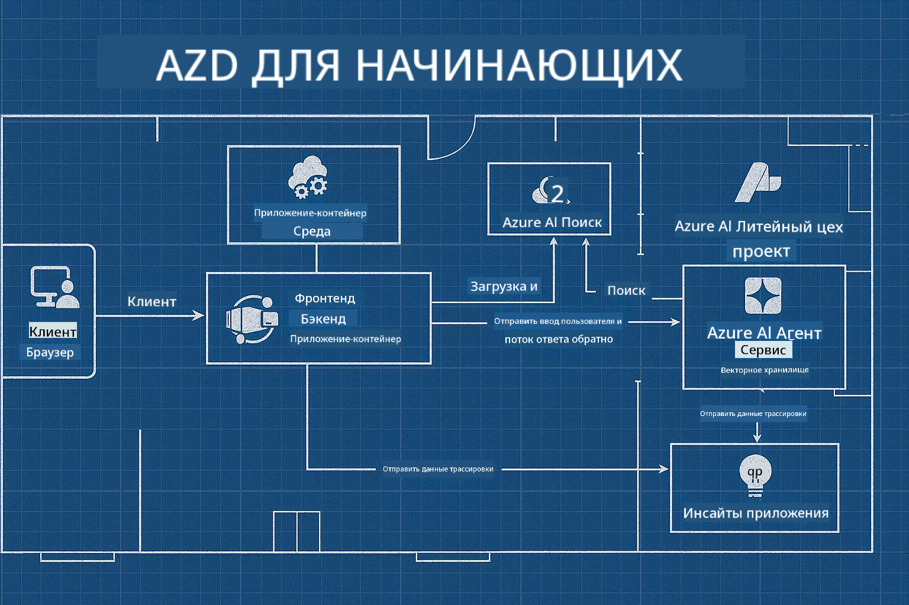

<!--
CO_OP_TRANSLATOR_METADATA:
{
  "original_hash": "245d24997bbcf2bae93bb2a503845d37",
  "translation_date": "2025-09-23T11:41:42+00:00",
  "source_file": "workshop/README.md",
  "language_code": "ru"
}
-->
# AZD для разработчиков AI: мастер-класс

## Шаблоны AZD

Создание корпоративного AI-приложения для вашего конкретного сценария похоже на строительство собственного дома. Вы можете спроектировать его самостоятельно, строить кирпич за кирпичом и взять на себя ответственность за соблюдение всех правил управления и разработки.

**ИЛИ ....**

Вы можете работать с архитектором, который предоставит вам _чертеж_ для базового дома, а затем поможет вам _настроить_ его под ваши нужды. Это позволит вам сосредоточиться на том, что делает **ваш дом** особенным, а эксперты позаботятся о проводке, водопроводе и других зависимостях.

**Именно такой подход лежит в основе [AI App Templates](https://ai.azure.com/templates)** — серии чертежей для создания различных типов "домов" AI-приложений в зависимости от ваших основных потребностей и зависимостей.

## Настройка шаблонов

Шаблоны разработаны для работы с [Azure AI Foundry](https://ai.azure.com). Представьте эту платформу как вашего "строительного подрядчика", который имеет доступ ко всем ресурсам, инструментам и экспертным знаниям, необходимым для выполнения работы!

Все, что вам нужно, — это выбрать [стартовые шаблоны](https://learn.microsoft.com/en-us/azure/ai-foundry/how-to/develop/ai-template-get-started). Например, мы сосредоточимся на шаблоне _Get Started with AI Agents_, чтобы построить "дом агентного AI", который уже оснащен функциями, такими как AI Search, Red Teaming, Evaluations, Tracing, Monitoring и многое другое!



Все, что вам нужно, — это забронировать время с архитектором, который проведет вас через процесс настройки. [GitHub Copilot for Azure](https://learn.microsoft.com/en-us/azure/developer/github-copilot-azure/get-started) может стать таким гидом. Просто "общайтесь с ним", чтобы:

- Узнать о функциях Azure в вашем шаблоне
- Развернуть ресурсы Azure
- Получить информацию о вашем развертывании
- Диагностировать и устранять проблемы!

На этом мастер-классе мы научимся _разбирать_ существующий шаблон (чтобы понять, что он предоставляет), а затем _настраивать_ его (чтобы удовлетворить наши требования) — шаг за шагом.

Шаблоны AI **делают это возможным** — завершив мастер-класс, вы научитесь **делать это своим**

----

**Навигация по мастер-классу**
- **📚 Домашняя страница курса**: [AZD для начинающих](../README.md)
- **📖 Связанные главы**: Охватывает [Главу 1](../README.md#-chapter-1-foundation--quick-start), [Главу 2](../README.md#-chapter-2-ai-first-development-recommended-for-ai-developers) и [Главу 5](../README.md#-chapter-5-multi-agent-ai-solutions-advanced)
- **🛠️ Практическая лаборатория**: [AI Workshop Lab](../docs/ai-foundry/ai-workshop-lab.md)
- **🚀 Следующие шаги**: [Модули мастер-класса](../../../workshop)

Добро пожаловать на практический мастер-класс по изучению Azure Developer CLI (AZD) с акцентом на развертывание AI-приложений. Этот мастер-класс предназначен для того, чтобы провести вас от основ AZD до развертывания готовых к производству AI-решений.

## Обзор мастер-класса

**Продолжительность:** 2-3 часа  
**Уровень:** Начальный до среднего  
**Предварительные требования:** Базовые знания Azure, инструментов командной строки и концепций AI

### Чему вы научитесь

- **Основы AZD**: Понимание инфраструктуры как кода с AZD
- 🤖 **Интеграция AI-сервисов**: Развертывание Azure OpenAI, AI Search и других AI-сервисов
- **Развертывание контейнеров**: Использование Azure Container Apps для AI-приложений
- **Лучшие практики безопасности**: Реализация Managed Identity и безопасных конфигураций
- **Мониторинг и наблюдаемость**: Настройка Application Insights для AI-нагрузок
- **Производственные шаблоны**: Стратегии развертывания корпоративного уровня

## Структура мастер-класса

### Модуль 1: Основы AZD (30 минут)
- Установка и настройка AZD
- Понимание структуры проекта AZD
- Ваше первое развертывание с AZD
- **Лаборатория**: Разверните простое веб-приложение

### Модуль 2: Интеграция Azure OpenAI (45 минут)
- Настройка ресурсов Azure OpenAI
- Стратегии развертывания моделей
- Настройка доступа к API и аутентификации
- **Лаборатория**: Разверните чат-приложение с GPT-4

### Модуль 3: Приложения RAG (45 минут)
- Интеграция Azure AI Search
- Обработка документов с помощью Azure Document Intelligence
- Векторные эмбеддинги и семантический поиск
- **Лаборатория**: Создайте систему вопросов и ответов на основе документов

### Модуль 4: Производственное развертывание (30 минут)
- Конфигурация Container Apps
- Оптимизация масштабирования и производительности
- Мониторинг и логирование
- **Лаборатория**: Разверните в производственной среде с наблюдаемостью

### Модуль 5: Продвинутые шаблоны (15 минут)
- Развертывание в нескольких средах
- Интеграция CI/CD
- Стратегии оптимизации затрат
- **Заключение**: Контрольный список готовности к производству

## Предварительные требования

### Необходимые инструменты

Пожалуйста, установите эти инструменты перед началом мастер-класса:

```bash
# Azure Developer CLI
curl -fsSL https://aka.ms/install-azd.sh | bash

# Azure CLI
curl -sL https://aka.ms/InstallAzureCLIDeb | sudo bash

# Git
sudo apt-get install git

# Docker
curl -fsSL https://get.docker.com -o get-docker.sh
sudo sh get-docker.sh

# Python 3.10+
sudo apt-get install python3.10 python3.10-venv python3-pip
```

### Настройка учетной записи Azure

1. **Подписка Azure**: [Зарегистрируйтесь бесплатно](https://azure.microsoft.com/free/)
2. **Доступ к Azure OpenAI**: [Запросите доступ](https://aka.ms/oai/access)
3. **Необходимые разрешения**:
   - Роль Contributor на подписке или группе ресурсов
   - User Access Administrator (для назначения RBAC)

### Проверка предварительных требований

Запустите этот скрипт, чтобы проверить вашу настройку:

```bash
#!/bin/bash
echo "Verifying workshop prerequisites..."

# Check AZD installation
if command -v azd &> /dev/null; then
    echo "✅ Azure Developer CLI: $(azd --version)"
else
    echo "❌ Azure Developer CLI not found"
fi

# Check Azure CLI
if command -v az &> /dev/null; then
    echo "✅ Azure CLI: $(az --version | head -n1)"
else
    echo "❌ Azure CLI not found"
fi

# Check Docker
if command -v docker &> /dev/null; then
    echo "✅ Docker: $(docker --version)"
else
    echo "❌ Docker not found"
fi

# Check Python
if command -v python3 &> /dev/null; then
    echo "✅ Python: $(python3 --version)"
else
    echo "❌ Python 3 not found"
fi

# Check Azure login
if az account show &> /dev/null; then
    echo "✅ Azure: Logged in as $(az account show --query user.name -o tsv)"
else
    echo "❌ Azure: Not logged in (run 'az login')"
fi

echo "Setup verification complete!"
```

## Материалы мастер-класса

### Практические упражнения

Каждый модуль включает практические лаборатории с начальным кодом и пошаговыми инструкциями:

- **[lab-1-azd-basics/](../../../workshop/lab-1-azd-basics)** - Ваше первое развертывание с AZD
- **[lab-2-openai-chat/](../../../workshop/lab-2-openai-chat)** - Чат-приложение с Azure OpenAI
- **[lab-3-rag-search/](../../../workshop/lab-3-rag-search)** - Приложение RAG с AI Search
- **[lab-4-production/](../../../workshop/lab-4-production)** - Шаблоны производственного развертывания
- **[lab-5-advanced/](../../../workshop/lab-5-advanced)** - Сценарии продвинутого развертывания

### Справочные материалы

- **[Руководство по интеграции AI Foundry](../docs/ai-foundry/azure-ai-foundry-integration.md)** - Комплексные шаблоны интеграции
- **[Руководство по развертыванию моделей AI](../docs/ai-foundry/ai-model-deployment.md)** - Лучшие практики развертывания моделей
- **[Практики производственного AI](../docs/ai-foundry/production-ai-practices.md)** - Шаблоны корпоративного развертывания
- **[Руководство по устранению неполадок AI](../docs/troubleshooting/ai-troubleshooting.md)** - Распространенные проблемы и их решения

### Примерные шаблоны

Шаблоны быстрого старта для распространенных сценариев AI:

```
workshop/templates/
├── minimal-chat/          # Basic OpenAI chat app
├── rag-application/       # RAG with AI Search
├── multi-model/          # Multiple AI services
└── production-ready/     # Enterprise template
```

## Начало работы

### Вариант 1: GitHub Codespaces (рекомендуется)

Самый быстрый способ начать мастер-класс:

[](https://github.com/codespaces/new?hide_repo_select=true&ref=main&repo=YOUR_REPO_ID)

### Вариант 2: Локальная разработка

1. **Клонируйте репозиторий мастер-класса:**
```bash
git clone https://github.com/YOUR_ORG/AZD-for-beginners.git
cd AZD-for-beginners/workshop
```

2. **Войдите в Azure:**
```bash
az login
azd auth login
```

3. **Начните с Лаборатории 1:**
```bash
cd lab-1-azd-basics
cat README.md  # Follow the instructions
```

### Вариант 3: Мастер-класс с инструктором

Если вы участвуете в сессии с инструктором:

- 🎥 **Запись мастер-класса**: [Доступна по запросу](https://aka.ms/azd-ai-workshop)
- 💬 **Сообщество Discord**: [Присоединяйтесь для поддержки в реальном времени](https://aka.ms/foundry/discord)
- **Обратная связь о мастер-классе**: [Поделитесь своим опытом](https://aka.ms/azd-workshop-feedback)

## Таймлайн мастер-класса

### Самостоятельное обучение (3 часа)

```
⏰ 00:00 - 00:30  Module 1: AZD Foundations
⏰ 00:30 - 01:15  Module 2: Azure OpenAI Integration
⏰ 01:15 - 02:00  Module 3: RAG Applications
⏰ 02:00 - 02:30  Module 4: Production Deployment
⏰ 02:30 - 02:45  Module 5: Advanced Patterns
⏰ 02:45 - 03:00  Q&A and Next Steps
```

### Сессия с инструктором (2,5 часа)

```
⏰ 00:00 - 00:15  Welcome & Prerequisites Check
⏰ 00:15 - 00:40  Module 1: Live Demo + Lab
⏰ 00:40 - 01:20  Module 2: OpenAI Integration
⏰ 01:20 - 01:30  Break
⏰ 01:30 - 02:10  Module 3: RAG Applications
⏰ 02:10 - 02:30  Module 4: Production Patterns
⏰ 02:30 - 02:45  Module 5: Advanced Topics
⏰ 02:45 - 03:00  Q&A and Resources
```

## Критерии успеха

К концу мастер-класса вы сможете:

✅ **Развернуть AI-приложения** с использованием шаблонов AZD  
✅ **Настроить Azure OpenAI** с правильной безопасностью  
✅ **Создать приложения RAG** с интеграцией Azure AI Search  
✅ **Реализовать производственные шаблоны** для корпоративных AI-нагрузок  
✅ **Мониторить и устранять неполадки** развертываний AI-приложений  
✅ **Применить стратегии оптимизации затрат** для AI-нагрузок  

## Сообщество и поддержка

### Во время мастер-класса

- 🙋 **Вопросы**: Используйте чат мастер-класса или поднимите руку
- 🐛 **Проблемы**: Ознакомьтесь с [руководством по устранению неполадок](../docs/troubleshooting/ai-troubleshooting.md)
- **Советы**: Делитесь открытиями с другими участниками

### После мастер-класса

- 💬 **Discord**: [Сообщество Azure AI Foundry](https://aka.ms/foundry/discord)
- **GitHub Issues**: [Сообщить о проблемах с шаблонами](https://github.com/YOUR_ORG/AZD-for-beginners/issues)
- 📧 **Обратная связь**: [Форма оценки мастер-класса](https://aka.ms/azd-workshop-feedback)

## Следующие шаги

### Продолжайте обучение

1. **Продвинутые сценарии**: Изучите [развертывание в нескольких регионах](../docs/ai-foundry/production-ai-practices.md#multi-region-deployment)
2. **Интеграция CI/CD**: Настройте [GitHub Actions workflows](../docs/deployment/github-actions.md)
3. **Пользовательские шаблоны**: Создайте свои собственные [шаблоны AZD](../docs/getting-started/custom-templates.md)

### Примените в своих проектах

1. **Оценка**: Используйте наш [контрольный список готовности](./production-readiness-checklist.md)
2. **Шаблоны**: Начните с наших [AI-специфичных шаблонов](../../../workshop/templates)
3. **Поддержка**: Присоединяйтесь к [Discord Azure AI Foundry](https://aka.ms/foundry/discord)

### Поделитесь успехом

- ⭐ **Отметьте репозиторий звездой**, если мастер-класс был полезен
- 🐦 **Поделитесь в социальных сетях** с #AzureDeveloperCLI #AzureAI
- 📝 **Напишите блог** о вашем пути развертывания AI

---

## Обратная связь о мастер-классе

Ваш отзыв помогает нам улучшить мастер-класс:

| Аспект | Оценка (1-5) | Комментарии |
|--------|--------------|----------|
| Качество контента | ⭐⭐⭐⭐⭐ | |
| Практические лаборатории | ⭐⭐⭐⭐⭐ | |
| Документация | ⭐⭐⭐⭐⭐ | |
| Уровень сложности | ⭐⭐⭐⭐⭐ | |
| Общий опыт | ⭐⭐⭐⭐⭐ | |

**Отправить отзыв**: [Форма оценки мастер-класса](https://aka.ms/azd-workshop-feedback)

---

**Предыдущая:** [Руководство по устранению неполадок AI](../docs/troubleshooting/ai-troubleshooting.md) | **Следующая:** Начните с [Лаборатории 1: Основы AZD](../../../workshop/lab-1-azd-basics)

**Готовы начать создавать AI-приложения с AZD?**

[Начать Лабораторию 1: Основы AZD →](./lab-1-azd-basics/README.md)

---

