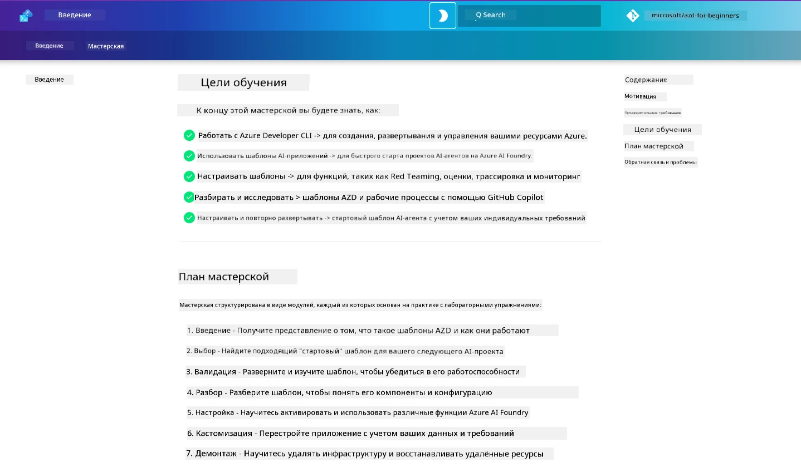

<div align="center">
  <div style="background: linear-gradient(135deg, #0078d4, #106ebe); border-radius: 10px; padding: 20px; margin: 20px 0; box-shadow: 0 4px 15px rgba(0, 120, 212, 0.3); border: 2px solid #005a9e;">
    <h2 style="color: white; margin: 0; font-size: 24px; text-shadow: 1px 1px 2px rgba(0,0,0,0.3);">
      🎯 AZD для разработчиков ИИ Workshop
    </h2>
    <p style="color: white; margin: 10px 0 0 0; font-size: 16px; text-shadow: 1px 1px 2px rgba(0,0,0,0.3);">
      <strong>Практический семинар по созданию AI-приложений с помощью Azure Developer CLI.</strong><br>
      Пройдите 7 модулей, чтобы освоить шаблоны AZD и рабочие процессы развертывания AI.
    </p>
    <div style="margin-top: 15px;">
      <span style="background: rgba(255,255,255,0.2); padding: 5px 10px; border-radius: 15px; color: white; font-size: 14px;">
        📅 Последнее обновление: март 2026
      </span>
    </div>
  </div>
</div>

# AZD для разработчиков ИИ Workshop

Добро пожаловать на практический семинар по изучению Azure Developer CLI (AZD) с акцентом на развертывание AI-приложений. Этот семинар поможет вам получить прикладное понимание шаблонов AZD в 3 шага:

1. **Поиск** - найдите подходящий для вас шаблон.
1. **Развертывание** - разместите и подтвердите, что он работает
1. **Настройка** - изменяйте и итеративно улучшайте под себя!

В ходе этого семинара вы также познакомитесь с основными инструментами разработчика и рабочими процессами, чтобы оптимизировать ваш полный цикл разработки.

<br/>

## Руководство в браузере

Уроки семинара представлены в формате Markdown. Вы можете просматривать их прямо в GitHub или запустить предварительный просмотр в браузере, как показано на скриншоте ниже.



Чтобы использовать этот вариант — сделайте форк репозитория в свой профиль и запустите GitHub Codespaces. Когда терминал VS Code будет активен, введите эту команду:

Этот браузерный предварительный просмотр работает в GitHub Codespaces, dev-контейнерах или локальном клоне с установленными Python и MkDocs.

```bash title="" linenums="0"
mkdocs serve > /dev/null 2>&1 &
```

Через несколько секунд появится всплывающее окно. Выберите опцию `Open in browser`. Веб-руководство откроется в новой вкладке браузера. Некоторые преимущества этого просмотра:

1. **Встроенный поиск** — быстро находите ключевые слова или уроки.
1. **Иконка копирования** — наведите курсор на блоки кода, чтобы увидеть эту опцию
1. **Переключение темы** — переключайтесь между темной и светлой темами
1. **Получить помощь** — нажмите на иконку Discord в футере, чтобы присоединиться!

<br/>

## Обзор семинара

**Длительность:** 3-4 часа  
**Уровень:** от начального до среднего  
**Требования:** знание Azure, основных концепций ИИ, VS Code и инструментов командной строки.

Это практический семинар, где вы учитесь на практике. После выполнения упражнений мы рекомендуем ознакомиться с учебным курсом AZD For Beginners для продолжения обучения по лучшим практикам безопасности и продуктивности.

| Время| Модуль  | Цель |
|:---|:---|:---|
| 15 мин | [Введение](docs/instructions/0-Introduction.md) | Задать основу, понять цели |
| 30 мин | [Выбор шаблона AI](docs/instructions/1-Select-AI-Template.md) | Изучить варианты и выбрать стартовый | 
| 30 мин | [Проверка шаблона AI](docs/instructions/2-Validate-AI-Template.md) | Развернуть решение по умолчанию в Azure |
| 30 мин | [Разбор шаблона AI](docs/instructions/3-Deconstruct-AI-Template.md) | Изучить структуру и конфигурацию |
| 30 мин | [Настройка шаблона AI](docs/instructions/4-Configure-AI-Template.md) | Активировать и попробовать доступные функции |
| 30 мин | [Кастомизация шаблона AI](docs/instructions/5-Customize-AI-Template.md) | Адаптировать шаблон под свои нужды |
| 30 мин | [Удаление инфраструктуры](docs/instructions/6-Teardown-Infrastructure.md) | Очистить и освободить ресурсы |
| 15 мин | [Итоги и дальнейшие шаги](docs/instructions/7-Wrap-up.md) | Ресурсы для обучения, вызов семинара |

<br/>

## Чему вы научитесь

Подумайте о шаблоне AZD как о учебной песочнице для исследования различных возможностей и инструментов для полного цикла разработки на Microsoft Foundry. К концу семинара у вас должно сложиться интуитивное понимание различных инструментов и концепций в этом контексте.

| Концепция  | Цель |
|:---|:---|
| **Azure Developer CLI** | Понять команды инструмента и рабочие процессы |
| **Шаблоны AZD** | Понять структуру проекта и конфигурацию |
| **Azure AI Agent** | Развертывание проекта Microsoft Foundry  |
| **Azure AI Search** | Включить контекстуслу инженерии с агентами |
| **Наблюдаемость** | Изучить трассировку, мониторинг и оценки |
| **Red Teaming** | Изучить методы противостояния атакующим тестам и mitigations |

<br/>

## Структура семинара

Семинар построен так, чтобы провести вас от поиска шаблона к развертыванию, разбору и кастомизации — используя официальный стартовый шаблон [Getting Started with AI Agents](https://github.com/Azure-Samples/get-started-with-ai-agents) в качестве основы.

### [Модуль 1: Выбор шаблона AI](docs/instructions/1-Select-AI-Template.md) (30 мин)

- Что такое AI шаблоны?
- Где найти AI шаблоны?
- Как начать создавать AI агентов?
- **Лабораторная работа**: Быстрый старт в Codespaces или dev контейнере

### [Модуль 2: Проверка шаблона AI](docs/instructions/2-Validate-AI-Template.md) (30 мин)

- Что такое архитектура AI шаблона?
- Какова разработческая рабочая процедура AZD?
- Где получить помощь по AZD разработке?
- **Лабораторная работа**: Развертывание и проверка шаблона AI агентов

### [Модуль 3: Разбор шаблона AI](docs/instructions/3-Deconstruct-AI-Template.md) (30 мин)

- Изучение вашего окружения в `.azure/` 
- Изучение настроек ресурсов в `infra/` 
- Изучение конфигураций AZD в файлах `azure.yaml`
- **Лабораторная работа**: Изменение переменных окружения и повторное развертывание

### [Модуль 4: Настройка шаблона AI](docs/instructions/4-Configure-AI-Template.md) (30 мин)
- Изучение: Retrieval Augmented Generation
- Изучение: Оценка агентов и Red Teaming
- Изучение: Трассировка и мониторинг
- **Лабораторная работа**: Исследование AI агента и наблюдаемости

### [Модуль 5: Кастомизация шаблона AI](docs/instructions/5-Customize-AI-Template.md) (30 мин)
- Определение: PRD с требованиями сценария
- Конфигурация: Переменные окружения для AZD
- Реализация: Lifecycle Hooks для дополнительных задач
- **Лабораторная работа**: Кастомизация шаблона под мой сценарий

### [Модуль 6: Удаление инфраструктуры](docs/instructions/6-Teardown-Infrastructure.md) (30 мин)
- Итог: Что такое AZD шаблоны?
- Итог: Зачем использовать Azure Developer CLI?
- Дальнейшие шаги: Попробовать другой шаблон!
- **Лабораторная работа**: Деактивация инфраструктуры и очистка

<br/>

## Вызов семинара

Хотите бросить себе вызов и сделать больше? Вот несколько проектных предложений — или поделитесь своими идеями с нами!!

| Проект | Описание |
|:---|:---|
|1. **Разобрать сложный AI шаблон** | Используйте указанные рабочие процессы и инструменты, попробуйте развернуть, проверить и кастомизировать другой шаблон AI решения. _Что вы узнали?_|
|2. **Кастомизация под свой сценарий**  | Попробуйте написать PRD (техническое задание) для другого сценария. Затем используйте GitHub Copilot в репозитории шаблона в Agent Model — и попросите сгенерировать для вас рабочий процесс кастомизации. _Что вы узнали? Как можно улучшить эти предложения?_|
| | |

## Есть отзывы?

1. Оставьте issue в этом репозитории — для удобства поставьте тег `Workshop`.
1. Присоединяйтесь к Microsoft Foundry Discord — общайтесь с коллегами!


| | | 
|:---|:---|
| **📚 Главная страница курса**| [AZD для начинающих](../README.md)|
| **📖 Документация** | [Начало работы с AI шаблонами](https://learn.microsoft.com/en-us/azure/ai-foundry/how-to/develop/ai-template-get-started)|
| **🛠️ AI шаблоны** | [Шаблоны Microsoft Foundry](https://ai.azure.com/templates) |
|**🚀 Следующие шаги** | [Начать семинар](#обзор-семинара) |
| | |

<br/>

---

**Навигация:** [Основной курс](../README.md) | [Введение](docs/instructions/0-Introduction.md) | [Модуль 1: Выбор шаблона](docs/instructions/1-Select-AI-Template.md)

**Готовы начать создавать AI-приложения с помощью AZD?**

[Начать семинар: Введение →](docs/instructions/0-Introduction.md)

---

<!-- CO-OP TRANSLATOR DISCLAIMER START -->
**Отказ от ответственности**:  
Этот документ был переведен с использованием сервиса автоматического перевода [Co-op Translator](https://github.com/Azure/co-op-translator). Несмотря на наши усилия по обеспечению точности, имейте в виду, что автоматический перевод может содержать ошибки или неточности. Оригинальный документ на его исходном языке следует считать авторитетным источником. Для критически важной информации рекомендуется обратиться к профессиональному переводу, выполненному человеком. Мы не несем ответственности за любые недоразумения или неправильные толкования, возникшие в результате использования данного перевода.
<!-- CO-OP TRANSLATOR DISCLAIMER END -->