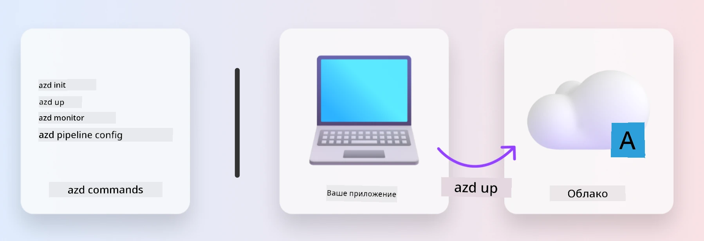
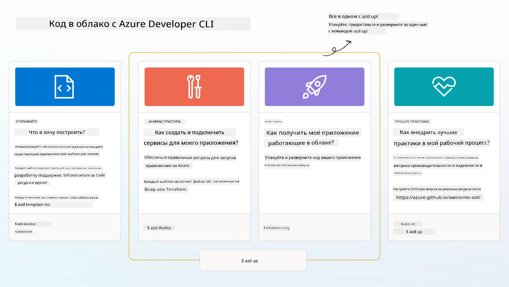

<!--
CO_OP_TRANSLATOR_METADATA:
{
  "original_hash": "06d6207eff634aefcaa41739490a5324",
  "translation_date": "2025-09-24T12:04:46+00:00",
  "source_file": "workshop/docs/instructions/1-Select-AI-Template.md",
  "language_code": "ru"
}
-->
# 1. Выберите шаблон

!!! tip "К КОНЦУ ЭТОГО МОДУЛЯ ВЫ СМОЖЕТЕ"

    - [ ] Описать, что такое шаблоны AZD
    - [ ] Найти и использовать шаблоны AZD для ИИ
    - [ ] Начать работу с шаблоном AI Agents
    - [ ] **Лаборатория 1:** Быстрый старт AZD с GitHub Codespaces

---

## 1. Аналогия с процессом строительства

Создание современного корпоративного приложения на основе ИИ _с нуля_ может быть сложной задачей. Это немного похоже на строительство нового дома своими руками, кирпич за кирпичом. Да, это возможно! Но это далеко не самый эффективный способ добиться желаемого результата.

Вместо этого мы часто начинаем с существующего _плана дизайна_ и работаем с архитектором, чтобы адаптировать его под наши личные требования. Именно такой подход стоит использовать при создании интеллектуальных приложений. Сначала найдите подходящую архитектуру дизайна, которая соответствует вашей задаче. Затем работайте с архитектором решений, чтобы адаптировать и разработать решение для вашего конкретного сценария.

Но где найти эти планы дизайна? И как найти архитектора, который готов научить нас, как адаптировать и развернуть эти планы самостоятельно? В этом семинаре мы ответим на эти вопросы, познакомив вас с тремя технологиями:

1. [Azure Developer CLI](https://aka.ms/azd) — это инструмент с открытым исходным кодом, который ускоряет путь разработчика от локальной разработки (создание) до облачного развертывания (доставка).
1. [Azure AI Foundry Templates](https://ai.azure.com/templates) — стандартизированные репозитории с открытым исходным кодом, содержащие пример кода, инфраструктуру и конфигурационные файлы для развертывания архитектуры ИИ-решений.
1. [GitHub Copilot Agent Mode](https://code.visualstudio.com/docs/copilot/chat/chat-agent-mode) — агент кодирования, основанный на знаниях Azure, который может помочь нам ориентироваться в кодовой базе и вносить изменения, используя естественный язык.

С этими инструментами мы можем _найти_ подходящий шаблон, _развернуть_ его, чтобы убедиться, что он работает, и _адаптировать_ его под наши конкретные сценарии. Давайте погрузимся и узнаем, как это работает.

---

## 2. Azure Developer CLI

[Azure Developer CLI](https://learn.microsoft.com/en-us/azure/developer/azure-developer-cli/) (или `azd`) — это инструмент командной строки с открытым исходным кодом, который может ускорить ваш путь от кода к облаку с помощью набора удобных для разработчиков команд, работающих одинаково в вашей среде IDE (разработка) и CI/CD (DevOps).

С помощью `azd` процесс развертывания может быть таким простым:

- `azd init` — Инициализация нового проекта ИИ на основе существующего шаблона AZD.
- `azd up` — Создание инфраструктуры и развертывание приложения в один шаг.
- `azd monitor` — Получение мониторинга и диагностики в реальном времени для развернутого приложения.
- `azd pipeline config` — Настройка CI/CD конвейеров для автоматизации развертывания в Azure.

**🎯 | УПРАЖНЕНИЕ**: <br/> Исследуйте инструмент командной строки `azd` в вашей среде GitHub Codespaces. Начните с ввода этой команды, чтобы увидеть, что может делать инструмент:

```bash title="" linenums="0"
azd help
```



---

## 3. Шаблон AZD

Чтобы `azd` мог это сделать, ему нужно знать, какую инфраструктуру создавать, какие настройки конфигурации применять и какое приложение развертывать. Здесь на помощь приходят [шаблоны AZD](https://learn.microsoft.com/en-us/azure/developer/azure-developer-cli/azd-templates?tabs=csharp).

Шаблоны AZD — это репозитории с открытым исходным кодом, которые объединяют пример кода с инфраструктурой и конфигурационными файлами, необходимыми для развертывания архитектуры решения. Используя подход _Infrastructure-as-Code_ (IaC), они позволяют определять ресурсы шаблона и настройки конфигурации в системе контроля версий (так же, как исходный код приложения), создавая повторяемые и согласованные рабочие процессы для пользователей проекта.

При создании или использовании шаблона AZD для _вашего_ сценария, задайте себе следующие вопросы:

1. Что вы создаете? → Есть ли шаблон с начальным кодом для этого сценария?
1. Как спроектировано ваше решение? → Есть ли шаблон с необходимыми ресурсами?
1. Как развертывается ваше решение? → Подумайте о `azd deploy` с предварительными/последующими обработками!
1. Как можно его оптимизировать? → Подумайте о встроенном мониторинге и автоматизированных конвейерах!

**🎯 | УПРАЖНЕНИЕ**: <br/> 
Посетите галерею [Awesome AZD](https://azure.github.io/awesome-azd/) и используйте фильтры, чтобы изучить более 250 доступных шаблонов. Попробуйте найти тот, который соответствует _вашим_ требованиям.



---

## 4. Шаблоны приложений ИИ

---

