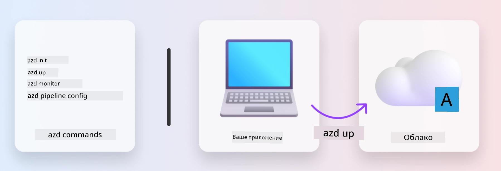
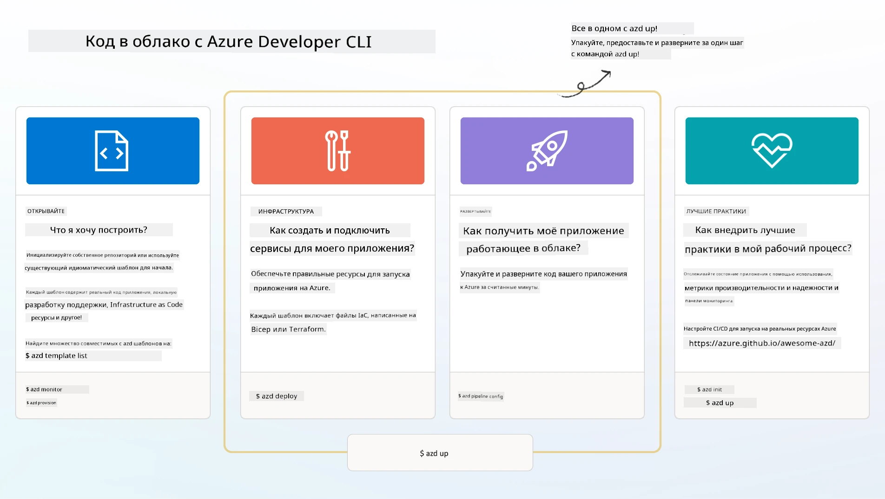

# 1. Выбор шаблона

!!! tip "ПО ИТОГАМ ЭТОГО МОДУЛЯ ВЫ СМОЖЕТЕ"

    - [ ] Описать, что такое шаблоны AZD
    - [ ] Находить и использовать шаблоны AZD для ИИ
    - [ ] Начать работу с шаблоном AI Agents
    - [ ] **Лабораторная работа 1:** Быстрый старт AZD в Codespaces или dev-контейнере

---

## 1. Аналогия со строителем

Создание современного корпоративного AI-приложения _с нуля_ может показаться пугающим. Это немного похоже на самостоятельное строительство нового дома, кирпичик за кирпичиком. Да, это возможно! Но это не самый эффективный способ получить желаемый конечный результат!

Вместо этого мы часто начинаем с существующего _плана дизайна_ и работаем с архитектором, чтобы адаптировать его под наши личные требования. Именно такой подход следует применять при создании интеллектуальных приложений. Сначала найдите хороший архитектурный проект, который подходит для вашей задачи. Затем работайте с архитектором решения, чтобы кастомизировать и разработать решение под ваш конкретный сценарий.

Но где же найти эти планы дизайна? И как найти архитектора, который готов научить нас, как самостоятельно настраивать и развертывать эти планы? В этом воркшопе мы ответим на эти вопросы, познакомив вас с тремя технологиями:

1. [Azure Developer CLI](https://aka.ms/azd) — инструмент с открытым исходным кодом, который ускоряет путь разработчика от локальной разработки (build) до развертывания в облаке (ship).
1. [Microsoft Foundry Templates](https://ai.azure.com/templates) — стандартизированные репозитории с открытым исходным кодом, содержащие примерный код, инфраструктуру и конфигурационные файлы для развертывания архитектуры AI-решения.
1. [GitHub Copilot Agent Mode](https://code.visualstudio.com/docs/copilot/chat/chat-agent-mode) — агент для кодирования на основе знаний Azure, который помогает ориентироваться в кодовой базе и вносить изменения — используя естественный язык.

Имея эти инструменты под рукой, мы можем теперь _находить_ нужный шаблон, _развертывать_ его, чтобы проверить работоспособность, и _настраивать_ под наши конкретные сценарии. Давайте погрузимся и узнаем, как это работает.

---

## 2. Azure Developer CLI

[Azure Developer CLI](https://learn.microsoft.com/en-us/azure/developer/azure-developer-cli/) (или `azd`) — это инструмент командной строки с открытым исходным кодом, который может ускорить путь от кода до облака с помощью набора удобных для разработчика команд, которые одинаково работают в вашей IDE (разработка) и CI/CD (devops) средах.

С помощью `azd` ваш процесс развертывания может быть таким простым:

- `azd init` — инициализирует новый AI-проект из существующего шаблона AZD.
- `azd up` — создает инфраструктуру и развертывает ваше приложение одним шагом.
- `azd monitor` — предоставляет мониторинг и диагностику в реальном времени для вашего развернутого приложения.
- `azd pipeline config` — настраивает конвейеры CI/CD для автоматизации развертывания в Azure.

**🎯 | ЗАДАНИЕ**: <br/> Изучите инструмент командной строки `azd` в вашей текущей среде для воркшопа. Это может быть GitHub Codespaces, dev-контейнер или локальный клон с установленными предварительными требованиями. Начните с команды, чтобы узнать, что умеет этот инструмент:

```bash title="" linenums="0"
azd help
```



---

## 3. Шаблон AZD

Чтобы `azd` мог это сделать, ему нужно знать инфраструктуру для создания, конфигурационные параметры для применения и приложение для развертывания. Здесь на помощь приходят [шаблоны AZD](https://learn.microsoft.com/en-us/azure/developer/azure-developer-cli/azd-templates?tabs=csharp).

Шаблоны AZD — это репозитории с открытым исходным кодом, которые сочетают примерный код с инфраструктурными и конфигурационными файлами, необходимыми для развертывания архитектуры решения.
Используя подход _Infrastructure-as-Code_ (IaC), они позволяют контролировать версии определений ресурсов шаблона и конфигурационных настроек (так же, как исходный код приложения) — создавая повторяемые и согласованные рабочие процессы для всех пользователей проекта.

При создании или повторном использовании шаблона AZD для _вашего_ сценария учитывайте следующие вопросы:

1. Что вы создаете? → Есть ли шаблон с исходным кодом для данного сценария?
1. Как спроектировано ваше решение? → Есть ли шаблон с необходимыми ресурсами?
1. Как ваше решение развертывается? → Думайте о `azd deploy` с хуками пред- и пост-обработки!
1. Как вы можете оптимизировать его дальше? → Подумайте о встроенном мониторинге и автоматизированных конвейерах!

**🎯 | ЗАДАНИЕ**: <br/> 
Посетите галерею [Awesome AZD](https://azure.github.io/awesome-azd/) и используйте фильтры, чтобы исследовать более 250 доступных шаблонов. Попробуйте найти тот, который соответствует _вашим_ требованиям.



---

## 4. Шаблоны AI-приложений

Для приложений с ИИ Microsoft предоставляет специализированные шаблоны, включающие **Microsoft Foundry** и **Foundry Agents**. Эти шаблоны ускоряют создание интеллектуальных, готовых к производству приложений.

### Шаблоны Microsoft Foundry & Foundry Agents

Выберите нижеследующий шаблон для развертывания. Каждый шаблон доступен на [Awesome AZD](https://azure.github.io/awesome-azd/) и может быть инициализирован одной командой.

| Шаблон | Описание | Команда для развертывания |
|----------|-------------|----------------|
| **[AI Chat с RAG](https://azure.github.io/awesome-azd/?tags=ai&tags=rag)** | Чат-приложение с Retrieval Augmented Generation с помощью Microsoft Foundry | `azd init -t azure-samples/azure-search-openai-demo` |
| **[Foundry Agent Service Starter](https://azure.github.io/awesome-azd/?tags=ai&tags=agents)** | Создавайте ИИ-агентов с помощью Foundry Agents для автономного выполнения задач | `azd init -t azure-samples/foundry-agent-service-starter` |
| **[Оркестрация нескольких агентов](https://azure.github.io/awesome-azd/?tags=ai&tags=agents)** | Координация нескольких Foundry Agents для сложных рабочих процессов | `azd init -t azure-samples/multi-agent-orchestration` |
| **[AI Document Intelligence](https://azure.github.io/awesome-azd/?tags=ai&tags=document)** | Извлечение и анализ документов с помощью моделей Microsoft Foundry | `azd init -t azure-samples/ai-document-processing` |
| **[Разговорный AI-бот](https://azure.github.io/awesome-azd/?tags=ai&tags=bot)** | Создание интеллектуальных чат-ботов с интеграцией Microsoft Foundry | `azd init -t azure-samples/ai-chat-protocol` |
| **[Генерация изображений AI](https://azure.github.io/awesome-azd/?tags=ai&tags=dalle)** | Генерация изображений с использованием DALL-E через Microsoft Foundry | `azd init -t azure-samples/ai-image-generation` |
| **[Semantic Kernel Agent](https://azure.github.io/awesome-azd/?tags=ai&tags=semantic-kernel)** | AI-агенты на базе Semantic Kernel с Foundry Agents | `azd init -t azure-samples/semantic-kernel-agent` |
| **[AutoGen Multi-Agent](https://azure.github.io/awesome-azd/?tags=ai&tags=autogen)** | Мультиагентные системы с использованием фреймворка AutoGen | `azd init -t azure-samples/autogen-multi-agent` |

### Быстрый старт

1. **Просмотрите шаблоны**: Посетите [https://azure.github.io/awesome-azd/](https://azure.github.io/awesome-azd/) и отфильтруйте по `AI`, `Agents` или `Microsoft Foundry`
2. **Выберите шаблон**: Подберите подходящий под ваш кейс
3. **Инициализация**: Выполните команду `azd init` для выбранного шаблона
4. **Развертывание**: Выполните `azd up` для создания инфраструктуры и развертывания

**🎯 | ЗАДАНИЕ**: <br/>
Выберите один из шаблонов выше, основываясь на вашем сценарии:

- **Создаете чатбот?** → Начните с **AI Chat с RAG** или **Разговорный AI-бот**
- **Нужны автономные агенты?** → Попробуйте **Foundry Agent Service Starter** или **Оркестрацию нескольких агентов**
- **Обрабатываете документы?** → Используйте **AI Document Intelligence**
- **Хотите помощь в кодировании с ИИ?** → Изучите **Semantic Kernel Agent** или **AutoGen Multi-Agent**

```bash title="Example: Deploy the AI Chat with RAG template" linenums="0"
azd init -t azure-samples/azure-search-openai-demo
azd up
```

!!! info "Исследуйте больше шаблонов"
    Галерея [Awesome AZD](https://azure.github.io/awesome-azd/) содержит более 250 шаблонов. Используйте фильтры, чтобы найти шаблоны, соответствующие вашим конкретным требованиям по языку, фреймворку и сервисам Azure.

---

<!-- CO-OP TRANSLATOR DISCLAIMER START -->
**Отказ от ответственности**:  
Этот документ был переведен с помощью AI-сервиса перевода [Co-op Translator](https://github.com/Azure/co-op-translator). Несмотря на наши усилия по обеспечению точности, имейте в виду, что автоматический перевод может содержать ошибки или неточности. Оригинальный документ на его родном языке следует считать авторитетным источником. Для критически важной информации рекомендуется профессиональный перевод человеком. Мы не несем ответственности за любые недоразумения или неправильные толкования, возникшие в результате использования данного перевода.
<!-- CO-OP TRANSLATOR DISCLAIMER END -->