# 2. Проверка шаблона

!!! tip "К КОНЦУ ЭТОГО МОДУЛЯ ВЫ СМОЖЕТЕ"

    - [ ] Анализировать архитектуру AI-решения
    - [ ] Понять процесс развертывания AZD
    - [ ] Использовать GitHub Copilot для помощи в работе с AZD
    - [ ] **Лаборатория 2:** Развернуть и проверить шаблон AI Agents

---

## 1. Введение

[Azure Developer CLI](https://learn.microsoft.com/en-us/azure/developer/azure-developer-cli/) или `azd` — это инструмент командной строки с открытым исходным кодом, который упрощает рабочий процесс разработчика при создании и развертывании приложений в Azure.

[Шаблоны AZD](https://learn.microsoft.com/azure/developer/azure-developer-cli/azd-templates) — это стандартизированные репозитории, включающие пример кода приложения, ресурсы _инфраструктуры как кода_ и конфигурационные файлы `azd` для создания целостной архитектуры решения. Подготовка инфраструктуры становится такой же простой, как выполнение команды `azd provision`, а использование команды `azd up` позволяет одновременно подготовить инфраструктуру **и** развернуть приложение!

Таким образом, начать процесс разработки приложения можно, просто найдя подходящий _стартовый шаблон AZD_, который максимально соответствует вашим требованиям к приложению и инфраструктуре, а затем настроив репозиторий под свои нужды.

Прежде чем начать, убедитесь, что Azure Developer CLI установлен.

1. Откройте терминал VS Code и выполните следующую команду:

      ```bash title="" linenums="0"
      azd version
      ```

1. Вы должны увидеть что-то подобное:

      ```bash title="" linenums="0"
      azd version 1.19.0 (commit b3d68cea969b2bfbaa7b7fa289424428edb93e97)
      ```

**Теперь вы готовы выбрать и развернуть шаблон с помощью azd**

---

## 2. Выбор шаблона

Платформа Azure AI Foundry предлагает [набор рекомендуемых шаблонов AZD](https://learn.microsoft.com/en-us/azure/ai-foundry/how-to/develop/ai-template-get-started), охватывающих популярные сценарии решений, такие как _автоматизация рабочих процессов с несколькими агентами_ и _обработка мультимодального контента_. Вы также можете найти эти шаблоны на портале Azure AI Foundry.

1. Перейдите на [https://ai.azure.com/templates](https://ai.azure.com/templates)
1. Войдите в портал Azure AI Foundry, когда будет предложено — вы увидите что-то подобное.

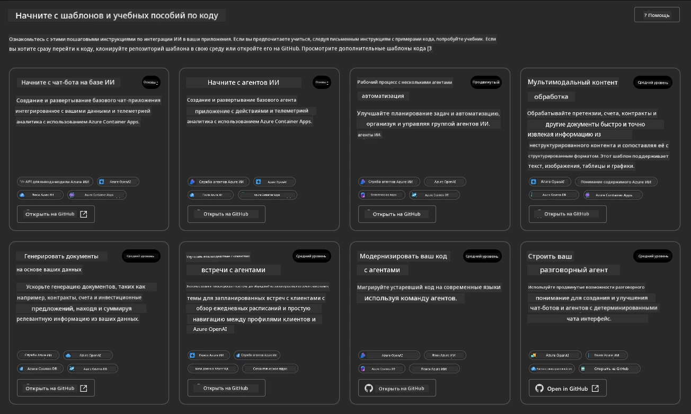

**Базовые** варианты — это ваши стартовые шаблоны:

1. [ ] [Get Started with AI Chat](https://github.com/Azure-Samples/get-started-with-ai-chat), который развертывает базовое чат-приложение _с вашими данными_ в Azure Container Apps. Используйте этот шаблон для изучения базового сценария AI-чатбота.
1. [X] [Get Started with AI Agents](https://github.com/Azure-Samples/get-started-with-ai-agents), который также развертывает стандартного AI-агента (с Azure AI Agent Service). Используйте этот шаблон, чтобы познакомиться с агентными AI-решениями, включающими инструменты и модели.

Откройте вторую ссылку в новой вкладке браузера (или нажмите `Open in GitHub` на соответствующей карточке). Вы должны увидеть репозиторий для этого шаблона AZD. Потратьте минуту, чтобы изучить README. Архитектура приложения выглядит следующим образом:

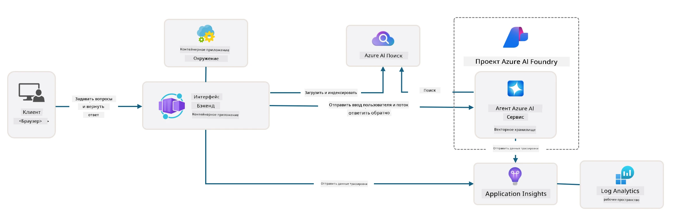

---

## 3. Активация шаблона

Давайте попробуем развернуть этот шаблон и убедиться, что он работает. Мы будем следовать рекомендациям из раздела [Getting Started](https://github.com/Azure-Samples/get-started-with-ai-agents?tab=readme-ov-file#getting-started).

1. Нажмите [эту ссылку](https://github.com/codespaces/new/Azure-Samples/get-started-with-ai-agents) — подтвердите действие по умолчанию `Create codespace`
1. Откроется новая вкладка браузера — дождитесь завершения загрузки сессии GitHub Codespaces
1. Откройте терминал VS Code в Codespaces — выполните следующую команду:

   ```bash title="" linenums="0"
   azd up
   ```

Выполните шаги рабочего процесса, которые будут запущены:

1. Вам будет предложено войти в Azure — следуйте инструкциям для аутентификации
1. Введите уникальное имя среды — например, я использовал `nitya-mshack-azd`
1. Это создаст папку `.azure/` — вы увидите подпапку с именем среды
1. Вам будет предложено выбрать имя подписки — выберите значение по умолчанию
1. Вам будет предложено указать местоположение — используйте `East US 2`

Теперь остается дождаться завершения подготовки инфраструктуры. **Это занимает 10-15 минут**

1. После завершения ваш консольный вывод покажет сообщение об УСПЕШНОМ выполнении, например:
      ```bash title="" linenums="0"
      SUCCESS: Your up workflow to provision and deploy to Azure completed in 10 minutes 17 seconds.
      ```
1. В вашем портале Azure теперь будет создана группа ресурсов с именем вашей среды:

      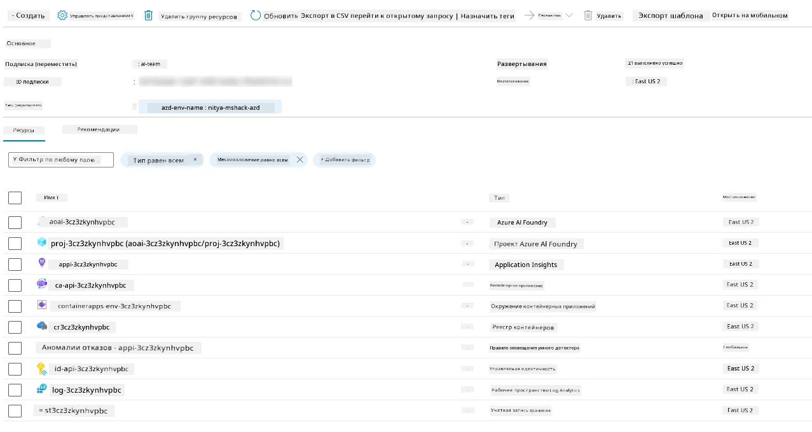

1. **Теперь вы готовы проверить развернутую инфраструктуру и приложение**.

---

## 4. Проверка шаблона

1. Перейдите на страницу [Resource Groups](https://portal.azure.com/#browse/resourcegroups) в портале Azure — войдите, если потребуется
1. Нажмите на группу ресурсов с именем вашей среды — вы увидите страницу, как показано выше

      - нажмите на ресурс Azure Container Apps
      - нажмите на URL приложения в разделе _Essentials_ (вверху справа)

1. Вы должны увидеть хостинг пользовательского интерфейса приложения, как показано ниже:

   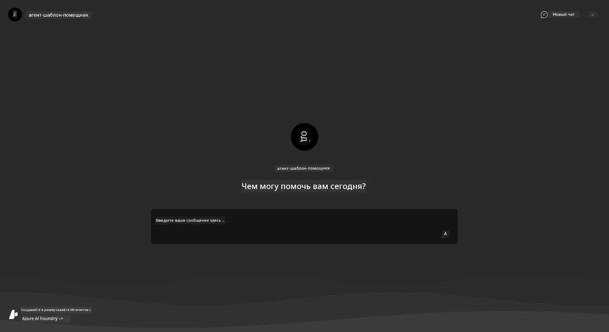

1. Попробуйте задать несколько [примеров вопросов](https://github.com/Azure-Samples/get-started-with-ai-agents/blob/main/docs/sample_questions.md)

      1. Спросите: ```What is the capital of France?``` 
      1. Спросите: ```What's the best tent under $200 for two people, and what features does it include?```

1. Вы должны получить ответы, похожие на показанные ниже. _Но как это работает?_ 

      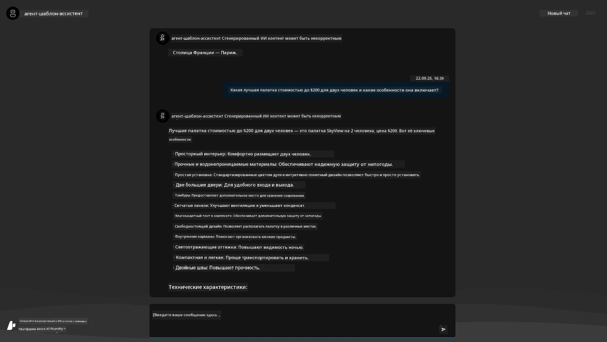

---

## 5. Проверка агента

Azure Container App развертывает конечную точку, которая подключается к AI-агенту, подготовленному в проекте Azure AI Foundry для этого шаблона. Давайте посмотрим, что это значит.

1. Вернитесь на страницу _Overview_ вашего ресурса в портале Azure

1. Нажмите на ресурс `Azure AI Foundry` в списке

1. Вы увидите следующее. Нажмите кнопку `Go to Azure AI Foundry Portal`. 
   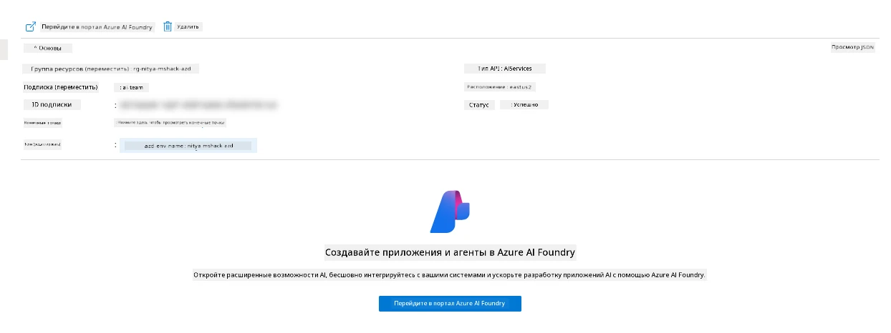

1. Вы увидите страницу проекта Foundry для вашего AI-приложения
   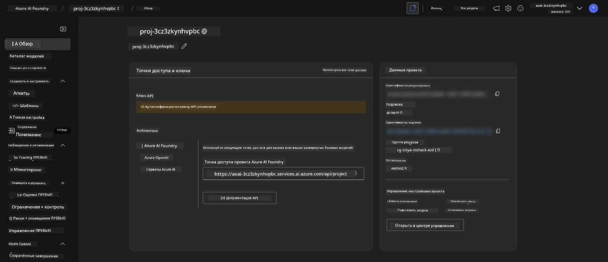

1. Нажмите на `Agents` — вы увидите стандартного агента, подготовленного в вашем проекте
   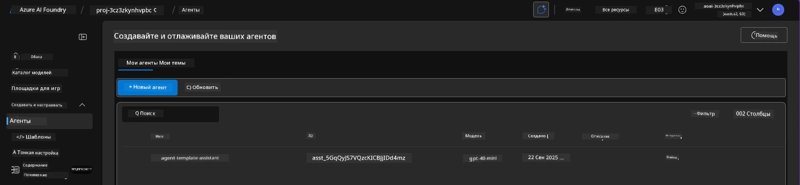

1. Выберите его — и вы увидите детали агента. Обратите внимание на следующее:

      - Агент по умолчанию использует File Search (всегда)
      - В разделе `Knowledge` указано, что загружено 32 файла (для поиска по файлам)
      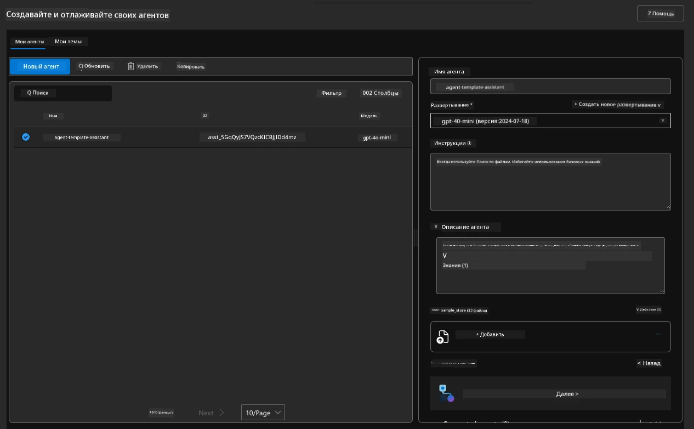

1. Найдите опцию `Data+indexes` в левом меню и нажмите для получения деталей. 

      - Вы увидите 32 загруженных файла данных для знаний.
      - Они будут соответствовать 12 клиентским файлам и 20 продуктовым файлам в папке `src/files` 
      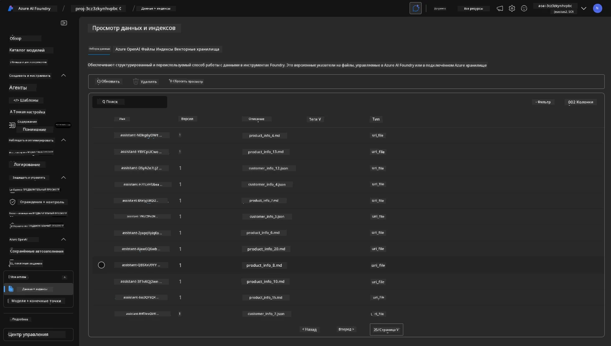

**Вы проверили работу агента!** 

1. Ответы агента основаны на знаниях из этих файлов. 
1. Теперь вы можете задавать вопросы, связанные с этими данными, и получать обоснованные ответы.
1. Пример: `customer_info_10.json` описывает 3 покупки, сделанные "Amanda Perez"

Вернитесь на вкладку браузера с конечной точкой Container App и спросите: `What products does Amanda Perez own?`. Вы должны увидеть что-то подобное:

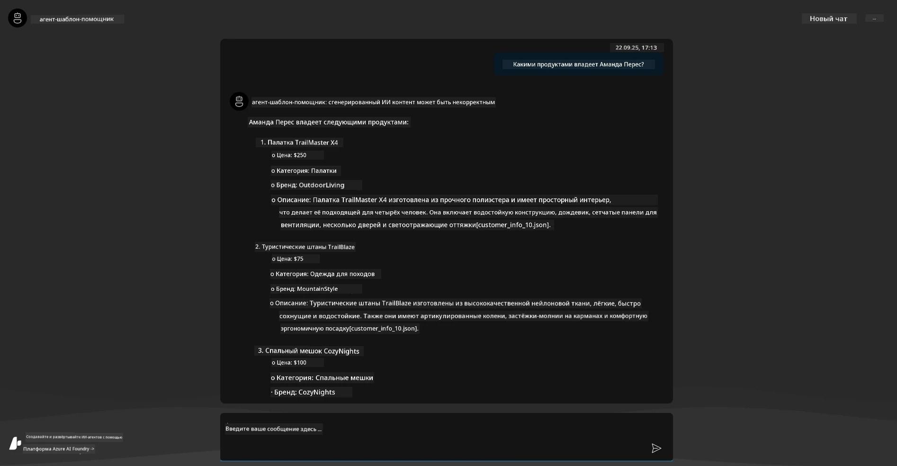

---

## 6. Игровая площадка агента

Давайте лучше поймем возможности Azure AI Foundry, протестировав агента в игровой площадке Agents Playground. 

1. Вернитесь на страницу `Agents` в Azure AI Foundry — выберите стандартного агента
1. Нажмите опцию `Try in Playground` — вы увидите интерфейс Playground, как показано ниже
1. Задайте тот же вопрос: `What products does Amanda Perez own?`

    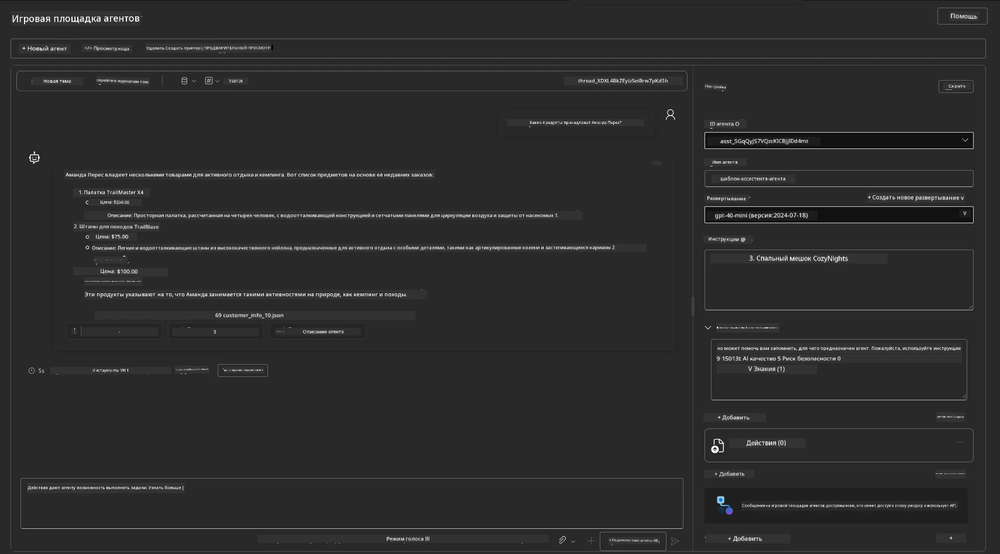

Вы получите тот же (или похожий) ответ — но также получите дополнительную информацию, которую можно использовать для оценки качества, стоимости и производительности вашего агентного приложения. Например:

1. Обратите внимание, что ответ ссылается на файлы данных, использованные для "обоснования" ответа
1. Наведите курсор на любой из этих файлов — соответствуют ли данные вашему запросу и отображенному ответу?

Вы также увидите строку _статистики_ под ответом. 

1. Наведите курсор на любой показатель — например, Safety. Вы увидите что-то подобное
1. Соответствует ли оценка вашей интуиции относительно уровня безопасности ответа?

      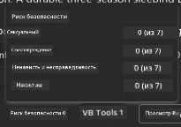

---

## 7. Встроенная наблюдаемость

Наблюдаемость — это инструментирование вашего приложения для генерации данных, которые можно использовать для понимания, отладки и оптимизации его работы. Чтобы понять это:

1. Нажмите кнопку `View Run Info` — вы увидите этот вид. Это пример [трассировки агента](https://learn.microsoft.com/en-us/azure/ai-foundry/how-to/develop/trace-agents-sdk#view-trace-results-in-the-azure-ai-foundry-agents-playground) в действии. _Вы также можете получить этот вид, нажав Thread Logs в верхнем меню_.

   - Получите представление о шагах выполнения и инструментах, задействованных агентом
   - Поймите общее количество токенов (по сравнению с использованием токенов для вывода) для ответа
   - Поймите задержку и где тратится время на выполнение

      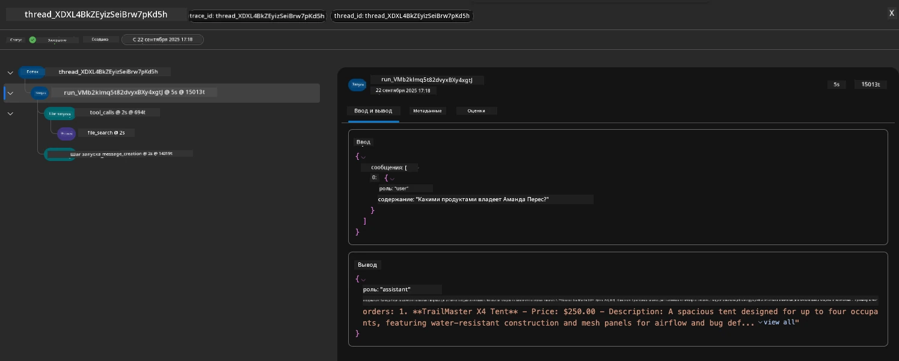

1. Нажмите вкладку `Metadata`, чтобы увидеть дополнительные атрибуты выполнения, которые могут быть полезны для отладки проблем в будущем.   

      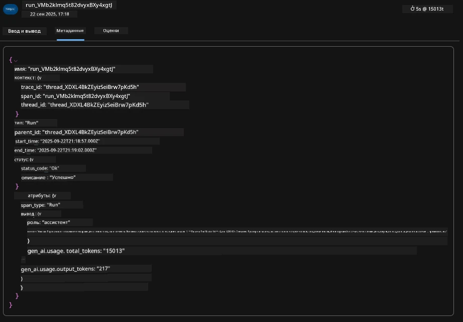

1. Нажмите вкладку `Evaluations`, чтобы увидеть автоматические оценки, сделанные для ответа агента. Они включают оценки безопасности (например, Self-harm) и специфические для агента оценки (например, Intent resolution, Task adherence).

      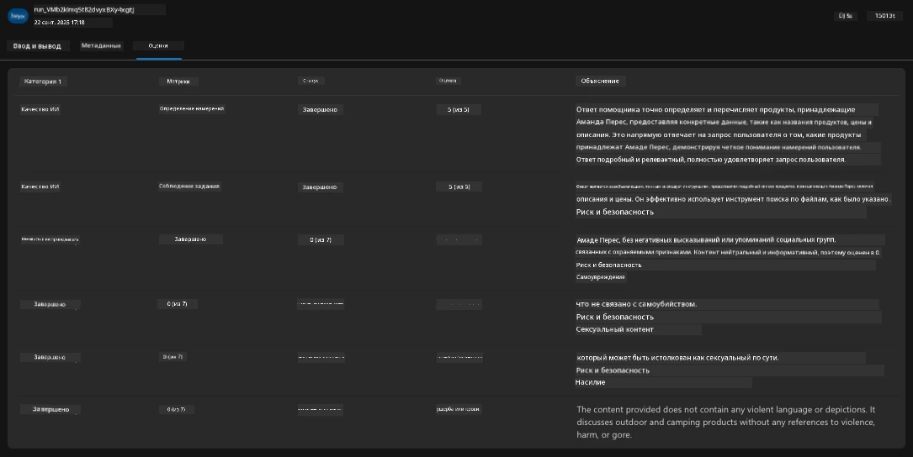

1. И наконец, нажмите вкладку `Monitoring` в боковом меню.

      - Выберите вкладку `Resource usage` на отображенной странице — и просмотрите метрики.
      - Отслеживайте использование приложения с точки зрения затрат (токены) и нагрузки (запросы).
      - Отслеживайте задержку приложения до первого байта (обработка ввода) и последнего байта (вывод).

      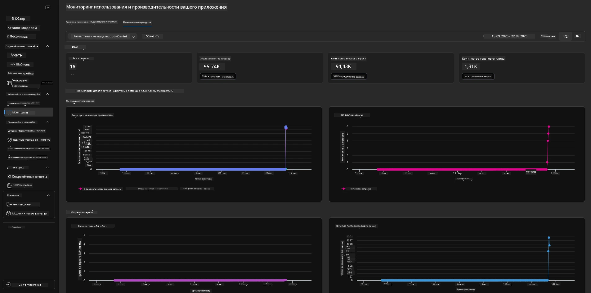

---

## 8. Переменные среды

До сих пор мы рассматривали развертывание в браузере — и проверили, что наша инфраструктура подготовлена, а приложение работает. Но чтобы работать с приложением _через код_, нам нужно настроить локальную среду разработки с соответствующими переменными, необходимыми для работы с этими ресурсами. Использование `azd` упрощает этот процесс.

1. Azure Developer CLI [использует переменные среды](https://learn.microsoft.com/en-us/azure/developer/azure-developer-cli/manage-environment-variables?tabs=bash) для хранения и управления настройками конфигурации для развертывания приложений.

1. Переменные среды хранятся в `.azure/<env-name>/.env` — это связывает их с окружением `env-name`, используемым при развертывании, и помогает изолировать окружения между различными целями развертывания в одном репозитории.

1. Переменные среды автоматически загружаются командой `azd` всякий раз, когда выполняется определенная команда (например, `azd up`). Обратите внимание, что `azd` не считывает _переменные среды уровня ОС_ (например, установленные в оболочке) — вместо этого используйте `azd set env` и `azd get env` для передачи информации в скриптах.

Давайте попробуем несколько команд:

1. Получите все переменные среды, установленные для `azd` в этом окружении:

      ```bash title="" linenums="0"
      azd env get-values
      ```
      
      Вы увидите что-то подобное:

      ```bash title="" linenums="0"
      AZURE_AI_AGENT_DEPLOYMENT_NAME="gpt-4o-mini"
      AZURE_AI_AGENT_NAME="agent-template-assistant"
      AZURE_AI_EMBED_DEPLOYMENT_NAME="text-embedding-3-small"
      AZURE_AI_EMBED_DIMENSIONS=100
      ...
      ```

1. Получите конкретное значение — например, я хочу узнать, установлено ли значение `AZURE_AI_AGENT_MODEL_NAME`

      ```bash title="" linenums="0"
      azd env get-value AZURE_AI_AGENT_MODEL_NAME 
      ```
      
      Вы увидите что-то подобное — оно не было установлено по умолчанию!

      ```bash title="" linenums="0"
      ERROR: key 'AZURE_AI_AGENT_MODEL_NAME' not found in the environment values
      ```

1. Установите новую переменную среды для `azd`. Здесь мы обновляем имя модели агента. _Примечание: любые изменения будут немедленно отражены в файле `.azure/<env-name>/.env`.

      ```bash title="" linenums="0"
      azd env set AZURE_AI_AGENT_MODEL_NAME gpt-4.1
      azd env set AZURE_AI_AGENT_MODEL_VERSION 2025-04-14
      azd env set AZURE_AI_AGENT_DEPLOYMENT_CAPACITY 150
      ```

      Теперь мы должны увидеть, что значение установлено:

      ```bash title="" linenums="0"
      azd env get-value AZURE_AI_AGENT_MODEL_NAME 
      ```

1. Обратите внимание, что некоторые ресурсы являются постоянными (например, развертывание моделей) и потребуют больше, чем просто `azd up`, чтобы принудительно выполнить повторное развертывание. Давайте попробуем удалить исходное развертывание и повторно развернуть с измененными переменными среды.

1. **Обновление** Если вы ранее развернули инфраструктуру с использованием шаблона azd — вы можете _обновить_ состояние ваших локальных переменных среды на основе текущего состояния вашего развертывания в Azure, используя эту команду:
      ```bash title="" linenums="0"
      azd env refresh
      ```

      Это мощный способ _синхронизировать_ переменные окружения между двумя или более локальными средами разработки (например, в команде с несколькими разработчиками), позволяя развернутой инфраструктуре служить источником истины для состояния переменных окружения. Члены команды просто _обновляют_ переменные, чтобы снова синхронизироваться.

---

## 9. Поздравляем 🏆

Вы только что завершили полный рабочий процесс, в котором вы:

- [X] Выбрали шаблон AZD, который хотите использовать
- [X] Запустили шаблон с помощью GitHub Codespaces
- [X] Развернули шаблон и убедились, что он работает

---

