# 2. Проверка шаблона

> Проверено на `azd 1.23.12` в марте 2026 года.

!!! tip "К КОНЦУ ЭТОГО МОДУЛЯ ВЫ СМОЖЕТЕ"

    - [ ] Анализировать архитектуру AI-решения
    - [ ] Понимать рабочий процесс развертывания AZD
    - [ ] Использовать GitHub Copilot для помощи в работе с AZD
    - [ ] **Лабораторная работа 2:** Развернуть и проверить шаблон AI Agents

---


## 1. Введение

[Azure Developer CLI](https://learn.microsoft.com/en-us/azure/developer/azure-developer-cli/) или `azd` — это инструмент командной строки с открытым исходным кодом, который упрощает рабочий процесс разработчика при создании и развертывании приложений в Azure. 

[AZD Templates](https://learn.microsoft.com/azure/developer/azure-developer-cli/azd-templates) — это стандартизированные репозитории, включающие пример кода приложения, ресурсы _инфраструктуры как код_, а также файлы конфигурации `azd` для единой архитектуры решения. Создание инфраструктуры становится таким же простым, как выполнение команды `azd provision` — в то время как использование `azd up` позволяет одновременно создать инфраструктуру **и** развернуть приложение!

Таким образом, начать разработку вашего приложения может быть так же просто, как найти подходящий _AZD Starter template_, который максимально соответствует вашим требованиям к приложению и инфраструктуре — а затем настроить репозиторий под ваши сценарии.

Прежде чем начать, убедитесь, что у вас установлен Azure Developer CLI.

1. Откройте терминал в VS Code и введите следующую команду:

      ```bash title="" linenums="0"
      azd version
      ```

1. Вы должны увидеть что-то подобное!

      ```bash title="" linenums="0"
      azd version 1.23.12 (commit <current-build>)
      ```

**Теперь вы готовы выбрать и развернуть шаблон с помощью azd**

---

## 2. Выбор шаблона

Платформа Microsoft Foundry поставляется с [набором рекомендуемых AZD шаблонов](https://learn.microsoft.com/en-us/azure/ai-foundry/how-to/develop/ai-template-get-started), которые охватывают популярные сценарии решений, такие как _автоматизация многопользовательских рабочих процессов_ и _обработка мультимодального контента_. Эти шаблоны также можно найти, посетив портал Microsoft Foundry.

1. Перейдите по адресу [https://ai.azure.com/templates](https://ai.azure.com/templates)
1. Войдите в портал Microsoft Foundry при запросе — вы увидите примерно следующее.

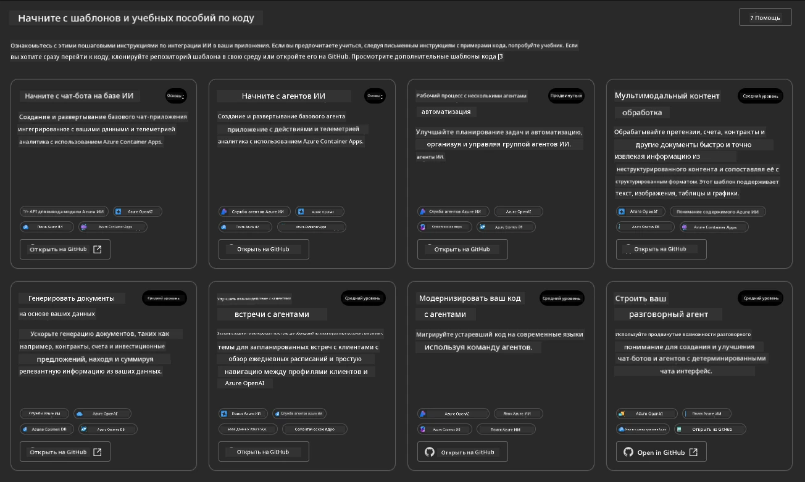


Опции **Basic** — ваши стартовые шаблоны:

1. [ ] [Начать работу с AI Chat](https://github.com/Azure-Samples/get-started-with-ai-chat), который развертывает базовое чат-приложение _с вашими данными_ в Azure Container Apps. Используйте этот шаблон для изучения базового сценария AI-чатбота.
1. [X] [Начать работу с AI Agents](https://github.com/Azure-Samples/get-started-with-ai-agents), который также развертывает стандартного AI агента (с Foundry Agents). Используйте этот шаблон, чтобы ознакомиться с агентностными AI решениями, включающими инструменты и модели.

Откройте вторую ссылку в новой вкладке браузера (или нажмите `Open in GitHub` на соответствующей карточке). Вы должны увидеть репозиторий этого AZD шаблона. Потратьте минуту, чтобы изучить README. Архитектура приложения выглядит следующим образом:

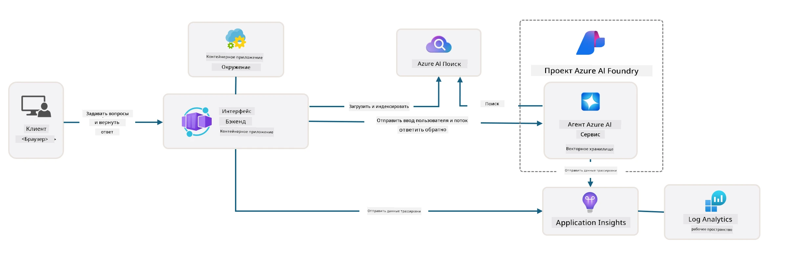

---

## 3. Активация шаблона

Давайте попробуем развернуть этот шаблон и убедимся, что он действителен. Мы будем следовать инструкциям в разделе [Getting Started](https://github.com/Azure-Samples/get-started-with-ai-agents?tab=readme-ov-file#getting-started).

1. Выберите рабочее окружение для репозитория шаблона:

      - **GitHub Codespaces**: Нажмите [по этой ссылке](https://github.com/codespaces/new/Azure-Samples/get-started-with-ai-agents) и подтвердите создание codespace
      - **Локальный клон или dev контейнер**: Клонируйте `Azure-Samples/get-started-with-ai-agents` и откройте его в VS Code

1. Дождитесь готовности терминала VS Code, затем наберите следующую команду:

   ```bash title="" linenums="0"
   azd up
   ```

Выполните шаги рабочего процесса, которые это вызовет:

1. Вас попросят войти в Azure — следуйте инструкциям для аутентификации
1. Введите уникальное имя окружения — например, я использовал `nitya-mshack-azd`
1. Будет создана папка `.azure/` — в ней будет подпапка с именем окружения
1. Вам предложат выбрать имя подписки — выберите по умолчанию
1. Вас попросят указать локацию — используйте `East US 2`

Теперь ждите завершения создания инфраструктуры. **Это займет 10-15 минут**

1. По завершении в консоли появится сообщение об УСПЕХЕ, подобное этому:
      ```bash title="" linenums="0"
      SUCCESS: Your up workflow to provision and deploy to Azure completed in 10 minutes 17 seconds.
      ```
1. В вашем Azure портале теперь будет создана группа ресурсов с именем этого окружения:

      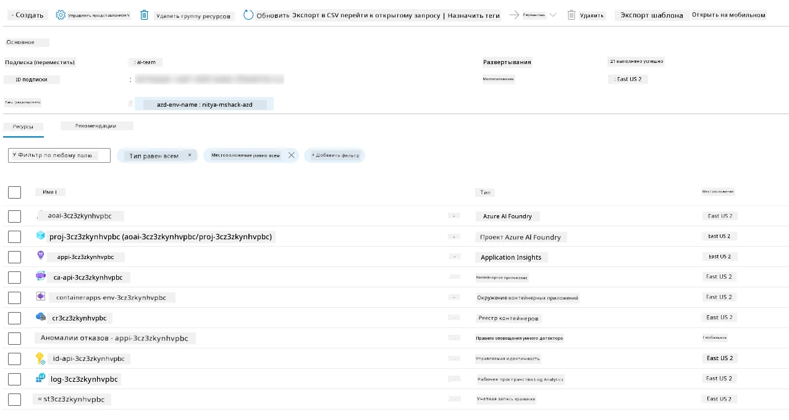

1. **Теперь вы готовы проверить развернутую инфраструктуру и приложение**.

---

## 4. Проверка шаблона

1. Перейдите на страницу [Группы ресурсов](https://portal.azure.com/#browse/resourcegroups) в Azure Portal — войдите при необходимости
1. Кликните по группе ресурсов для вашего имени окружения — вы увидите страницу выше

      - кликните по ресурсу Azure Container Apps
      - кликните по URL приложения в разделе _Основное_ (вверху справа)

1. Вы должны увидеть интерфейс хостированного приложения, похожий на этот:

   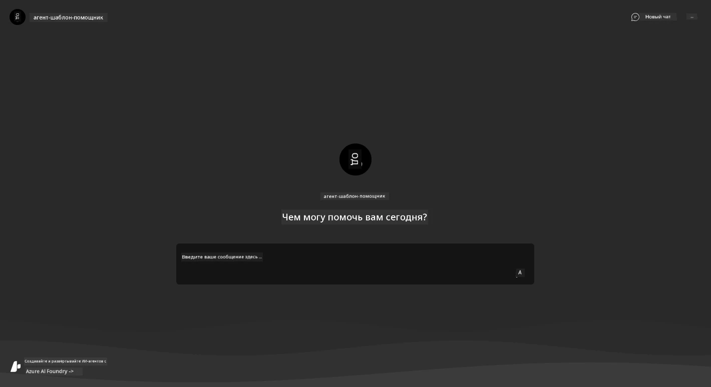

1. Попробуйте задать несколько [примерных вопросов](https://github.com/Azure-Samples/get-started-with-ai-agents/blob/main/docs/sample_questions.md):

      1. Спросите: ```Какова столица Франции?``` 
      1. Спросите: ```Какая лучшая палатка до $200 для двоих и какие функции у неё есть?```

1. Вы должны получить ответы, похожие на приведённые ниже. _Но как это работает?_ 

      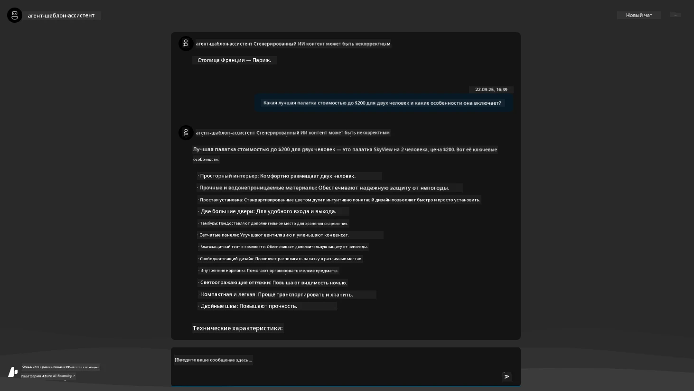

---

## 5. Проверка агента

Azure Container App развёртывает конечную точку, которая подключается к AI агенту, созданному в проекте Microsoft Foundry для этого шаблона. Давайте посмотрим, что это значит.

1. Вернитесь на страницу _Обзор_ в Azure Portal для вашей группы ресурсов

1. Нажмите на ресурс `Microsoft Foundry` в этом списке

1. Вы увидите это. Нажмите кнопку `Go to Microsoft Foundry Portal`. 
   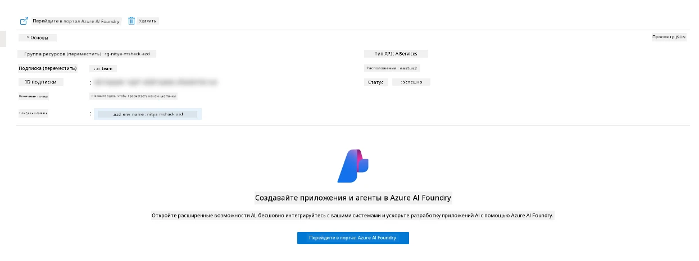

1. Вы увидите страницу проекта Foundry для вашего AI-приложения
   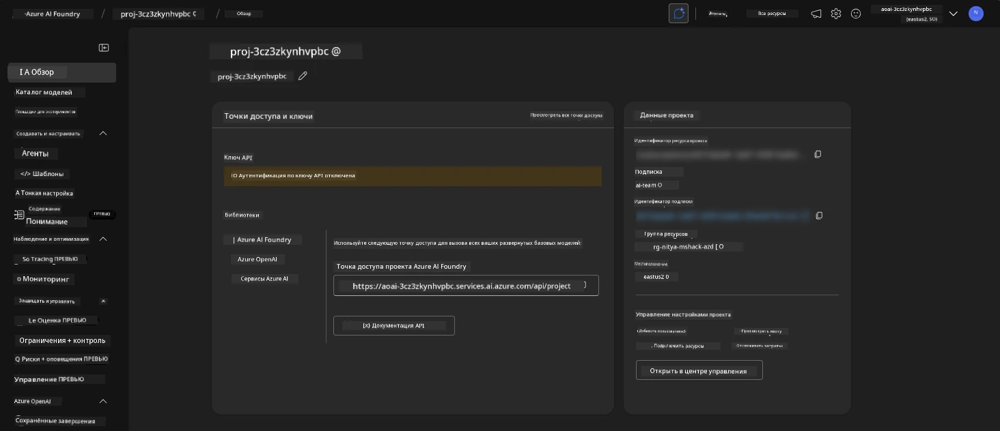

1. Нажмите на `Agents` — вы увидите стандартного агента, созданного в вашем проекте
   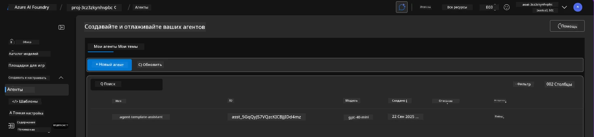

1. Выберите его — и увидите детали агента. Обратите внимание на следующее:

      - Агент по умолчанию использует Поиск по Файлу (всегда)
      - В разделе `Knowledge` указано, что загружено 32 файла (для поиска по файлам)
      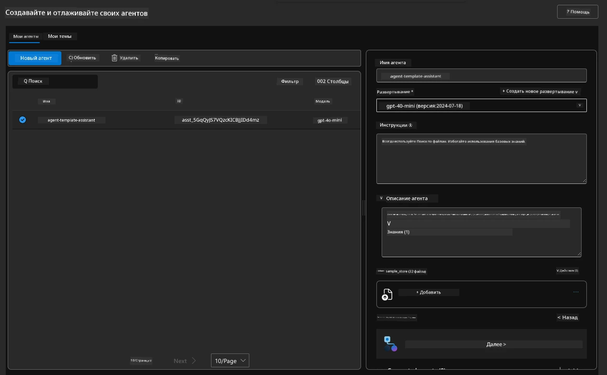

1. Найдите в левом меню опцию `Data+indexes` и откройте детали.

      - Вы увидите 32 загруженных файла данных для знаний.
      - Это соответствуют 12 файлам клиентов и 20 файлам продуктов в папке `src/files` 
      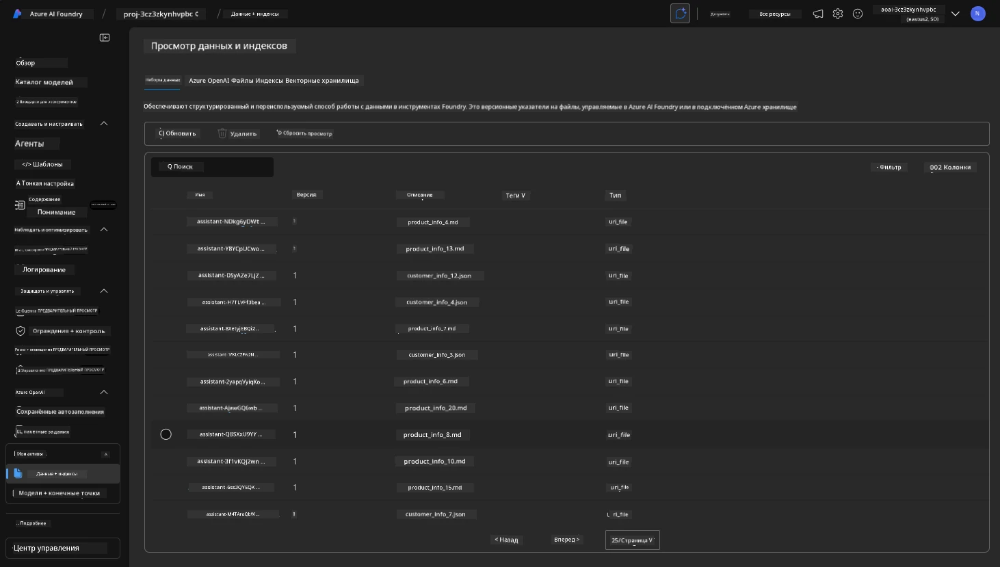

**Вы проверили работу агента!** 

1. Ответы агента основаны на знаниях из этих файлов. 
1. Теперь вы можете задавать вопросы, относящиеся к этим данным, и получать основанные на знаниях ответы.
1. Пример: `customer_info_10.json` описывает 3 покупки, сделанные "Амандой Перез"

Вернитесь к вкладке браузера с конечной точкой Container App и спросите: `Какие товары принадлежат Амде Перез?`. Вы должны увидеть что-то вроде этого:

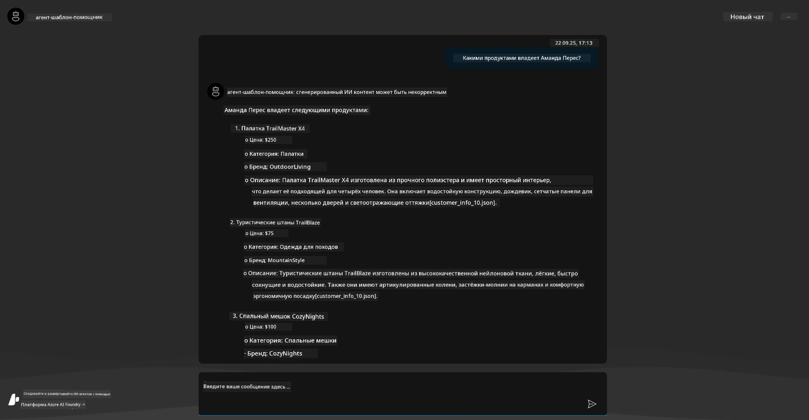

---

## 6. Площадка Агентов

Давайте разовьем немного интуиции относительно возможностей Microsoft Foundry, проверив агента в Agents Playground. 

1. Вернитесь на страницу `Agents` в Microsoft Foundry — выберите стандартного агента
1. Нажмите опцию `Try in Playground` — вы увидите интерфейс площадки так же
1. Задайте тот же вопрос: `Какие товары принадлежат Амде Перез?`

    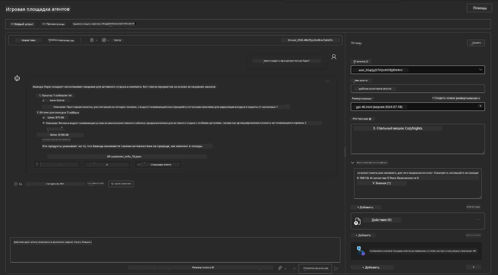

Вы получите тот же (или похожий) ответ — но также получите дополнительную информацию, которую можно использовать для понимания качества, стоимости и производительности вашего агентного приложения. Например:

1. Обратите внимание, что в ответе указаны файлы данных, использованные для "обоснования" ответа
1. Наведите курсор на любой из этих ярлыков файлов — совпадают ли данные с вашим запросом и показанным ответом?

Также вы увидите строку _stats_ под ответом. 

1. Наведите курсор на любую метрику — например, Safety. Вы увидите нечто подобное
1. Соответствует ли оценка вашему восприятию уровня безопасности ответа?

      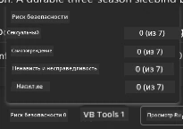

---

## 7. Встроенная наблюдаемость

Наблюдаемость — это инструментирование вашего приложения для генерации данных, которые можно использовать для понимания, отладки и оптимизации его работы. Чтобы ознакомиться с этим:

1. Нажмите кнопку `View Run Info` — вы увидите это окно. Это пример работы [трассировки агента](https://learn.microsoft.com/en-us/azure/ai-foundry/how-to/develop/trace-agents-sdk#view-trace-results-in-the-azure-ai-foundry-agents-playground). _Вы также можете попасть сюда, нажав Thread Logs в главном меню_.

   - Ознакомьтесь с шагами выполнения и инструментами, задействованными агентом
   - Поймите общее количество токенов (и использование токенов вывода) для ответа
   - Оцените задержку и где тратится время во время выполнения

      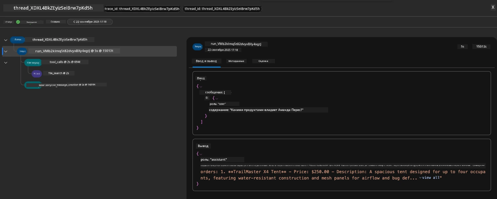

1. Нажмите вкладку `Metadata`, чтобы увидеть дополнительные атрибуты для выполнения, которые могут помочь при отладке проблем позже.   

      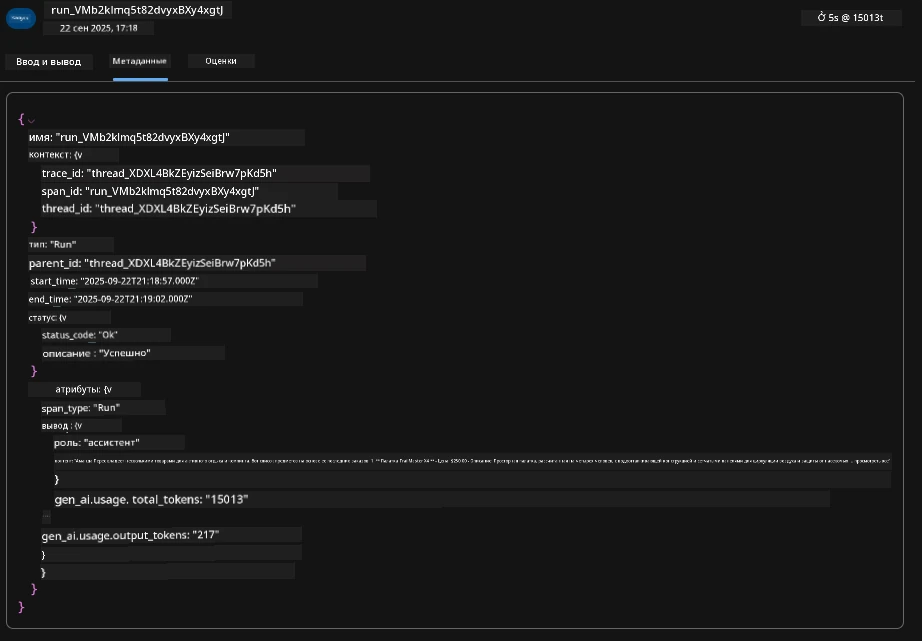


1. Нажмите вкладку `Evaluations`, чтобы увидеть автоматические оценки ответа агента. Они включают оценки безопасности (например, саморазрушение) и специфичные для агента оценки (например, разрешение намерений, выполнение задач).

      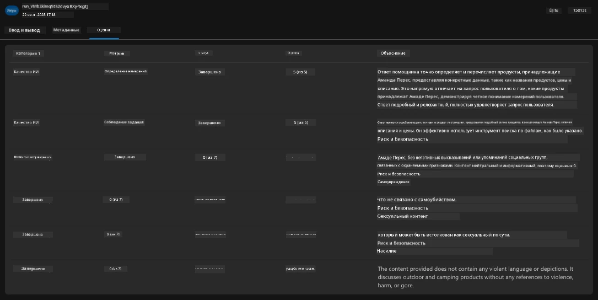

1. И наконец, нажмите вкладку `Monitoring` в боковом меню.

      - Выберите вкладку `Resource usage` на странице и просмотрите метрики.
      - Отслеживайте использование приложения по затратам (токены) и нагрузке (запросы).
      - Отслеживайте задержку приложения до первого байта (обработка ввода) и последнего байта (вывода).

      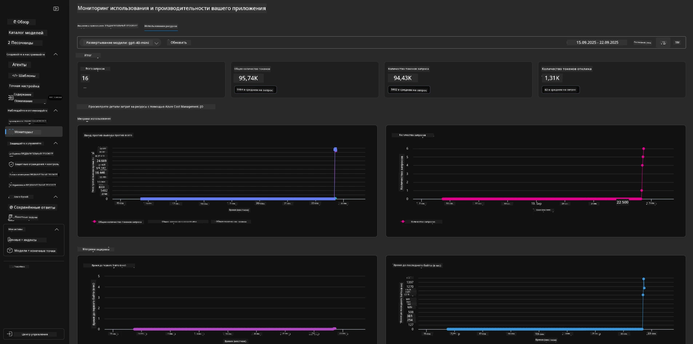

---

## 8. Переменные окружения

До сих пор мы работали через браузер — и проверили, что инфраструктура создана и приложение работает. Но чтобы работать с приложением _сначала на уровне кода_, необходимо настроить локальное окружение разработки с соответствующими переменными, необходимыми для работы с этими ресурсами. Использование `azd` упрощает это.

1. Azure Developer CLI [использует переменные окружения](https://learn.microsoft.com/en-us/azure/developer/azure-developer-cli/manage-environment-variables?tabs=bash) для хранения и управления настройками конфигурации развертывания приложений.

1. Переменные окружения хранятся в `.azure/<env-name>/.env` — это ограничивает их область действия конкретным окружением `env-name`, использованным при развертывании, и помогает изолировать окружения для разных целей развертывания в одном репозитории.

1. Переменные окружения автоматически загружаются командой `azd` всякий раз, когда выполняется конкретная команда (например, `azd up`). Обратите внимание, что `azd` не читает автоматически _системные_ переменные окружения ОС (например, установленные в оболочке) — вместо этого используйте команды `azd set env` и `azd get env` для передачи информации в скриптах.


Давайте попробуем несколько команд:

1. Получите все переменные окружения, установленные для `azd` в этом окружении:

      ```bash title="" linenums="0"
      azd env get-values
      ```
      
      Вы увидите примерно следующее:

      ```bash title="" linenums="0"
      AZURE_AI_AGENT_DEPLOYMENT_NAME="gpt-4.1-mini"
      AZURE_AI_AGENT_NAME="agent-template-assistant"
      AZURE_AI_EMBED_DEPLOYMENT_NAME="text-embedding-3-small"
      AZURE_AI_EMBED_DIMENSIONS=100
      ...
      ```

1. Получите конкретное значение — например, я хочу узнать, установлено ли значение `AZURE_AI_AGENT_MODEL_NAME`

      ```bash title="" linenums="0"
      azd env get-value AZURE_AI_AGENT_MODEL_NAME 
      ```
      
      Вы увидите примерно следующее — оно не было установлено по умолчанию!

      ```bash title="" linenums="0"
      ERROR: key 'AZURE_AI_AGENT_MODEL_NAME' not found in the environment values
      ```

1. Установите новую переменную окружения для `azd`. Здесь мы обновляем имя модели агента. _Примечание: любые изменения немедленно отражаются в файле `.azure/<env-name>/.env`._

      ```bash title="" linenums="0"
      azd env set AZURE_AI_AGENT_MODEL_NAME gpt-4.1
      azd env set AZURE_AI_AGENT_MODEL_VERSION 2025-04-14
      azd env set AZURE_AI_AGENT_DEPLOYMENT_CAPACITY 150
      ```

      Теперь мы должны увидеть, что значение установлено:

      ```bash title="" linenums="0"
      azd env get-value AZURE_AI_AGENT_MODEL_NAME 
      ```

1. Обратите внимание, что некоторые ресурсы являются персистентными (например, развертывания моделей) и потребуют больше, чем просто `azd up`, чтобы принудительно перенастроить развертывание. Давайте попробуем удалить исходное развертывание и развернуть заново с изменёнными переменными окружения.

1. **Обновление** Если вы ранее развертывали инфраструктуру с помощью шаблона azd — вы можете _обновить_ состояние ваших локальных переменных окружения на основе текущего состояния вашего развертывания Azure с помощью этой команды:

      ```bash title="" linenums="0"
      azd env refresh
      ```

      Это мощный способ _синхронизировать_ переменные окружения между двумя или более локальными средами разработки (например, команда с несколькими разработчиками) — позволяя развернутой инфраструктуре служить источником достоверной информации о состоянии переменных окружения. Члены команды просто _обновляют_ переменные, чтобы снова синхронизироваться.

---

## 9. Поздравляем 🏆

Вы только что завершили сквозной рабочий процесс, в котором вы:

- [X] Выбрали AZD-шаблон, который хотите использовать
- [X] Открыли шаблон в поддерживаемой среде разработки
- [X] Развернули шаблон и подтвердили, что он работает

---

<!-- CO-OP TRANSLATOR DISCLAIMER START -->
**Отказ от ответственности**:  
Этот документ был переведен с помощью сервиса автоматического перевода [Co-op Translator](https://github.com/Azure/co-op-translator). Несмотря на наши усилия по обеспечению точности, просим учитывать, что автоматический перевод может содержать ошибки или неточности. Оригинальный документ на исходном языке следует считать авторитетным источником. Для критически важной информации рекомендуется профессиональный перевод человеком. Мы не несем ответственности за любые недоразумения или неправильные толкования, возникающие в результате использования этого перевода.
<!-- CO-OP TRANSLATOR DISCLAIMER END -->