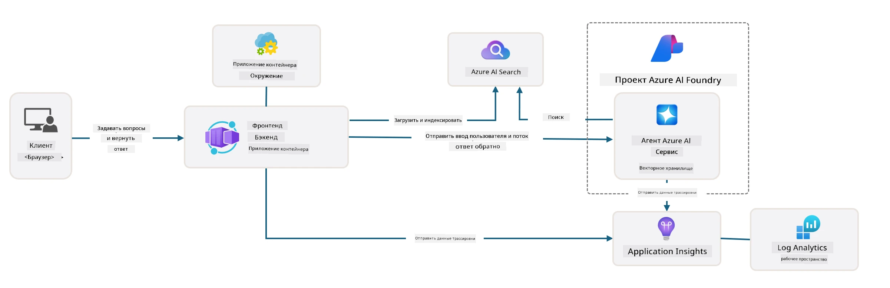

<!--
CO_OP_TRANSLATOR_METADATA:
{
  "original_hash": "4e403f041411361140d6beb88ab2a181",
  "translation_date": "2025-09-24T12:06:39+00:00",
  "source_file": "workshop/docs/instructions/3-Deconstruct-AI-Template.md",
  "language_code": "ru"
}
-->
# 3. Разбор шаблона

!!! tip "К КОНЦУ ЭТОГО МОДУЛЯ ВЫ СМОЖЕТЕ"

    - [ ] Пункт
    - [ ] Пункт
    - [ ] Пункт
    - [ ] **Лабораторная работа 3:** 

---

С помощью шаблонов AZD и Azure Developer CLI (`azd`) мы можем быстро начать разработку AI-проектов, используя стандартизированные репозитории, которые предоставляют пример кода, инфраструктуру и конфигурационные файлы — в виде готового к развертыванию _стартового_ проекта.

**Но теперь нам нужно понять структуру проекта и кодовую базу — и уметь настраивать шаблон AZD — без предварительного опыта или знаний о AZD!**

---

## 1. Активация GitHub Copilot

### 1.1 Установите GitHub Copilot Chat

Пришло время изучить [GitHub Copilot с режимом агента](https://code.visualstudio.com/docs/copilot/chat/chat-agent-mode). Теперь мы можем использовать естественный язык для описания задачи на высоком уровне и получать помощь в её выполнении. Для этой лабораторной работы мы будем использовать [бесплатный план Copilot](https://github.com/github-copilot/signup), который имеет месячный лимит на завершения и взаимодействия в чате.

Расширение можно установить из магазина, но оно уже должно быть доступно в вашей среде Codespaces. _Нажмите `Open Chat` в выпадающем меню значка Copilot и введите запрос, например, `What can you do?`_ — возможно, вам потребуется войти в систему. **GitHub Copilot Chat готов к работе**.

### 1.2 Установите MCP-серверы

Для эффективной работы в режиме агента ему необходим доступ к правильным инструментам, которые помогут извлекать знания или выполнять действия. Здесь могут помочь MCP-серверы. Мы настроим следующие серверы:

1. [Azure MCP Server](../../../../../workshop/docs/instructions)
1. [Microsoft Docs MCP Server](../../../../../workshop/docs/instructions)

Чтобы активировать их:

1. Создайте файл `.vscode/mcp.json`, если он не существует
1. Скопируйте следующий код в этот файл и запустите серверы!
   ```json title=".vscode/mcp.json"
   {
      "servers": {
         "Azure MCP Server": {
            "command": "npx",
            "args": [
            "-y",
            "@azure/mcp@latest",
            "server",
            "start"
            ]
         },
         "microsoft.docs.mcp": {
            "type": "http",
            "url": "https://learn.microsoft.com/api/mcp"
         }
      }
   }
   ```

??? warning "Вы можете получить ошибку, что `npx` не установлен (нажмите, чтобы развернуть решение)"

      Чтобы исправить это, откройте файл `.devcontainer/devcontainer.json` и добавьте эту строку в раздел features. Затем пересоберите контейнер. Теперь `npx` должен быть установлен.

      ```title="" linenums="0"
         "features": {
            "ghcr.io/devcontainers/features/node:1": {},
            ...
         },
      ```

---

### 1.3 Тестирование GitHub Copilot Chat

**Сначала используйте `az login`, чтобы аутентифицироваться в Azure через командную строку VS Code.**

Теперь вы должны иметь возможность запрашивать статус вашей подписки Azure и задавать вопросы о развернутых ресурсах или конфигурации. Попробуйте следующие запросы:

1. `List my Azure resource groups`
1. `#foundry list my current deployments`

Вы также можете задавать вопросы о документации Azure и получать ответы, основанные на сервере Microsoft Docs MCP. Попробуйте следующие запросы:

1. `#microsoft_docs_search What is Azure Developer CLI?`
1. `#microsoft_docs_search Show me a Python tutorial to chat with deployed model`

Или вы можете запросить примеры кода для выполнения задачи. Попробуйте этот запрос:

1. `Give me a Python code example that uses AAD for an interactive chat client`

В режиме `Ask` вы получите код, который можно скопировать и попробовать. В режиме `Agent` это может пойти дальше и создать соответствующие ресурсы для вас — включая скрипты настройки и документацию — чтобы помочь вам выполнить задачу.

**Теперь вы готовы начать изучение репозитория шаблона**

---

## 2. Разбор архитектуры

??? prompt "ASK: Объясните архитектуру приложения, изображённую в docs/images/architecture.png, в одном абзаце"

      Это приложение — чат-приложение на основе искусственного интеллекта, построенное на Azure, которое демонстрирует современную архитектуру на основе агента. Решение сосредоточено вокруг Azure Container App, который размещает основной код приложения, обрабатывающий ввод пользователя и генерирующий интеллектуальные ответы через AI-агента. 
      
      Архитектура использует Azure AI Foundry Project как основу для возможностей AI, подключаясь к Azure AI Services, которые предоставляют базовые языковые модели (например, GPT-4o-mini) и функциональность агента. Взаимодействие с пользователем проходит через фронтенд на React к бэкенду на FastAPI, который общается с сервисом AI-агента для генерации контекстуальных ответов. 
      
      Система включает возможности извлечения знаний через поиск файлов или сервис Azure AI Search, позволяя агенту получать и цитировать информацию из загруженных документов. Для обеспечения операционной эффективности архитектура включает комплексный мониторинг через Application Insights и Log Analytics Workspace для трассировки, логирования и оптимизации производительности. 
      
      Azure Storage предоставляет блоб-хранилище для данных приложения и загруженных файлов, а Managed Identity обеспечивает безопасный доступ между ресурсами Azure без хранения учетных данных. Всё решение разработано для масштабируемости и удобства обслуживания, с контейнеризированным приложением, автоматически масштабирующимся в зависимости от спроса, и встроенными функциями безопасности, мониторинга и CI/CD через управляемую экосистему сервисов Azure.



---

## 3. Структура репозитория

!!! prompt "ASK: Объясните структуру папок шаблона. Начните с визуальной иерархической диаграммы."

??? info "ANSWER: Визуальная иерархическая диаграмма"

      ```bash title="" 
      get-started-with-ai-agents/
      ├── 📋 Конфигурация и настройка
      │   ├── azure.yaml                    # Конфигурация Azure Developer CLI
      │   ├── docker-compose.yaml           # Контейнеры для локальной разработки
      │   ├── pyproject.toml                # Конфигурация Python-проекта
      │   ├── requirements-dev.txt          # Зависимости для разработки
      │   └── .devcontainer/                # Настройка dev-контейнера VS Code
      │
      ├── 🏗️ Инфраструктура (infra/)
      │   ├── main.bicep                    # Основной шаблон инфраструктуры
      │   ├── api.bicep                     # Ресурсы, связанные с API
      │   ├── main.parameters.json          # Параметры инфраструктуры
      │   └── core/                         # Модульные компоненты инфраструктуры
      │       ├── ai/                       # Конфигурации AI-сервисов
      │       ├── host/                     # Хостинг инфраструктуры
      │       ├── monitor/                  # Мониторинг и логирование
      │       ├── search/                   # Настройка Azure AI Search
      │       ├── security/                 # Безопасность и идентификация
      │       └── storage/                  # Конфигурации хранилища
      │
      ├── 💻 Исходный код приложения (src/)
      │   ├── api/                          # Бэкенд API
      │   │   ├── main.py                   # Точка входа FastAPI-приложения
      │   │   ├── routes.py                 # Определения маршрутов API
      │   │   ├── search_index_manager.py   # Функционал поиска
      │   │   ├── data/                     # Обработка данных API
      │   │   ├── static/                   # Статические веб-ресурсы
      │   │   └── templates/                # HTML-шаблоны
      │   ├── frontend/                     # Фронтенд на React/TypeScript
      │   │   ├── package.json              # Зависимости Node.js
      │   │   ├── vite.config.ts            # Конфигурация сборки Vite
      │   │   └── src/                      # Исходный код фронтенда
      │   ├── data/                         # Пример файлов данных
      │   │   └── embeddings.csv            # Предварительно рассчитанные эмбеддинги
      │   ├── files/                        # Файлы базы знаний
      │   │   ├── customer_info_*.json      # Примеры данных клиентов
      │   │   └── product_info_*.md         # Документация по продуктам
      │   ├── Dockerfile                    # Конфигурация контейнера
      │   └── requirements.txt              # Зависимости Python
      │
      ├── 🔧 Автоматизация и скрипты (scripts/)
      │   ├── postdeploy.sh/.ps1           # Настройка после развертывания
      │   ├── setup_credential.sh/.ps1     # Конфигурация учетных данных
      │   ├── validate_env_vars.sh/.ps1    # Проверка переменных окружения
      │   └── resolve_model_quota.sh/.ps1  # Управление квотой модели
      │
      ├── 🧪 Тестирование и оценка
      │   ├── tests/                        # Юнит-тесты и интеграционные тесты
      │   │   └── test_search_index_manager.py
      │   ├── evals/                        # Фреймворк оценки агента
      │   │   ├── evaluate.py               # Запуск оценки
      │   │   ├── eval-queries.json         # Тестовые запросы
      │   │   └── eval-action-data-path.json
      │   ├── sandbox/                      # Песочница для разработки
      │   │   ├── 1-quickstart.py           # Примеры для начала работы
      │   │   └── aad-interactive-chat.py   # Примеры аутентификации
      │   └── airedteaming/                 # Оценка безопасности AI
      │       └── ai_redteaming.py          # Тестирование "красной команды"
      │
      ├── 📚 Документация (docs/)
      │   ├── deployment.md                 # Руководство по развертыванию
      │   ├── local_development.md          # Инструкции по локальной настройке
      │   ├── troubleshooting.md            # Частые проблемы и их решения
      │   ├── azure_account_setup.md        # Предварительные требования Azure
      │   └── images/                       # Ресурсы документации
      │
      └── 📄 Метаданные проекта
         ├── README.md                     # Обзор проекта
         ├── CODE_OF_CONDUCT.md           # Правила сообщества
         ├── CONTRIBUTING.md              # Руководство по внесению изменений
         ├── LICENSE                      # Условия лицензии
         └── next-steps.md                # Руководство после развертывания
      ```

### 3.1 Основная архитектура приложения

Этот шаблон следует паттерну **веб-приложения полного стека** с:

- **Бэкенд**: Python FastAPI с интеграцией Azure AI
- **Фронтенд**: TypeScript/React с системой сборки Vite
- **Инфраструктура**: Шаблоны Azure Bicep для облачных ресурсов
- **Контейнеризация**: Docker для консистентного развертывания

### 3.2 Инфраструктура как код (bicep)

Слой инфраструктуры использует **шаблоны Azure Bicep**, организованные модульно:

   - **`main.bicep`**: Оркестрация всех ресурсов Azure
   - **Модули `core/`**: Повторно используемые компоненты для различных сервисов
      - AI-сервисы (Azure OpenAI, AI Search)
      - Хостинг контейнеров (Azure Container Apps)
      - Мониторинг (Application Insights, Log Analytics)
      - Безопасность (Key Vault, Managed Identity)

### 3.3 Исходный код приложения (`src/`)

**Бэкенд API (`src/api/`)**:

- REST API на основе FastAPI
- Интеграция с сервисом AI-агента Azure
- Управление поисковым индексом для извлечения знаний
- Возможности загрузки и обработки файлов

**Фронтенд (`src/frontend/`)**:

- Современное SPA на React/TypeScript
- Vite для быстрой разработки и оптимизированной сборки
- Интерфейс чата для взаимодействия с агентом

**База знаний (`src/files/`)**:

- Примеры данных клиентов и продуктов
- Демонстрация извлечения знаний на основе файлов
- Примеры в формате JSON и Markdown

### 3.4 DevOps и автоматизация

**Скрипты (`scripts/`)**:

- Кроссплатформенные скрипты на PowerShell и Bash
- Проверка и настройка окружения
- Конфигурация после развертывания
- Управление квотой модели

**Интеграция с Azure Developer CLI**:

- Конфигурация `azure.yaml` для рабочих процессов `azd`
- Автоматизированное предоставление и развертывание
- Управление переменными окружения

### 3.5 Тестирование и обеспечение качества

**Фреймворк оценки (`evals/`)**:

- Оценка производительности агента
- Тестирование качества запросов и ответов
- Автоматизированный процесс оценки

**Безопасность AI (`airedteaming/`)**:

- Тестирование "красной команды" для безопасности AI
- Сканирование уязвимостей
- Практики ответственного использования AI

---

## 4. Поздравляем 🏆

Вы успешно использовали GitHub Copilot Chat с MCP-серверами для изучения репозитория.

- [X] Активировали GitHub Copilot для Azure
- [X] Поняли архитектуру приложения
- [X] Изучили структуру шаблона AZD

Теперь у вас есть представление о _инфраструктуре как коде_ для этого шаблона. Далее мы рассмотрим конфигурационный файл для AZD.

---

