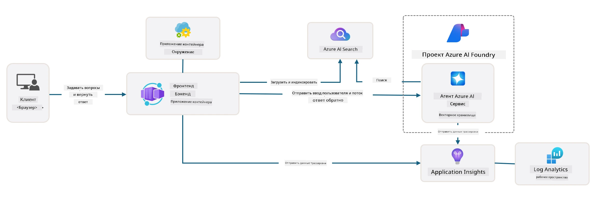

# 3. Деконструкция шаблона

!!! tip "ПОСЛЕ ЭТОГО МОДУЛЯ ВЫ УМЕЕТЕ"

    - [ ] Активировать GitHub Copilot с MCP серверами для помощи Azure
    - [ ] Понимать структуру папок шаблона AZD и его компоненты
    - [ ] Изучать шаблоны организации инфраструктуры как кода (Bicep)
    - [ ] **Лабораторная работа 3:** Использовать GitHub Copilot для изучения и понимания архитектуры репозитория

---


С помощью шаблонов AZD и Azure Developer CLI (`azd`) мы можем быстро начать разработку AI с использованием стандартизированных репозиториев, которые предоставляют пример кода, инфраструктуру и файлы конфигурации — в виде готового к развертыванию _стартер_ проекта.

**Но теперь нам нужно понять структуру проекта и кодовую базу — и уметь настраивать шаблон AZD — без любого предварительного опыта или понимания AZD!**

---

## 1. Активировать GitHub Copilot

### 1.1 Установить GitHub Copilot Chat

Пора изучить [GitHub Copilot с режимом агент](https://code.visualstudio.com/docs/copilot/chat/chat-agent-mode). Теперь мы можем использовать естественный язык для описания задачи на высоком уровне и получать помощь в её выполнении. Для этой лабораторной работы мы будем использовать [бесплатный план Copilot](https://github.com/github-copilot/signup), который имеет ежемесячные ограничения по completions и chat-взаимодействиям.

Расширение можно установить из маркетплейса, и оно часто уже доступно в Codespaces или средах с dev-контейнерами. _Нажмите `Open Chat` в выпадающем меню иконки Copilot и введите запрос типа `What can you do?`_ - вам может быть предложено войти в аккаунт. **GitHub Copilot Chat готов к работе**.

### 1.2. Установить MCP серверы

Чтобы режим агента был эффективным, ему нужен доступ к правильным инструментам для получения знаний или выполнения действий. Здесь помогут MCP серверы. Мы настроим следующие серверы:

1. [Azure MCP Server](../../../../../workshop/docs/instructions)
1. [Microsoft Docs MCP Server](../../../../../workshop/docs/instructions)

Чтобы активировать их:

1. Создайте файл `.vscode/mcp.json`, если он не существует
1. Скопируйте следующее в этот файл — и запустите серверы!
   ```json title=".vscode/mcp.json"
   {
      "servers": {
         "Azure MCP Server": {
            "command": "npx",
            "args": [
            "-y",
            "@azure/mcp@latest",
            "server",
            "start"
            ]
         },
         "microsoft.docs.mcp": {
            "type": "http",
            "url": "https://learn.microsoft.com/api/mcp"
         }
      }
   }
   ```

??? warning "Возможно, появится ошибка, что `npx` не установлен (нажмите для раскрытия решения)"

      Чтобы исправить, откройте файл `.devcontainer/devcontainer.json` и добавьте эту строку в раздел features. Затем пересоберите контейнер. Теперь у вас должен быть установлен `npx`.

      ```title="" linenums="0"
         "features": {
            "ghcr.io/devcontainers/features/node:1": {},
            ...
         },
      ```

---

### 1.3. Проверить GitHub Copilot Chat

**Сначала используйте `azd auth login` для аутентификации в Azure через командную строку VS Code. Используйте `az login` только если планируете напрямую запускать команды Azure CLI.**

Теперь вы должны иметь возможность запрашивать статус вашей подписки Azure и задавать вопросы о развернутых ресурсах или конфигурации. Попробуйте следующие запросы:

1. `List my Azure resource groups`
1. `#foundry list my current deployments`

Также вы можете задавать вопросы по документации Azure и получать ответы, основанные на Microsoft Docs MCP сервере. Попробуйте следующие запросы:

1. `#microsoft_docs_search What is Azure Developer CLI?`
1. `#microsoft_docs_search Show me a Python tutorial to chat with deployed model`

Или попросите кодовые примеры для выполнения задачи. Попробуйте такой запрос:

1. `Give me a Python code example that uses AAD for an interactive chat client`

В режиме `Ask` это предоставит код, который вы сможете скопировать и попробовать. В режиме `Agent` это может пойти дальше и создать нужные ресурсы для вас — включая сценарии настройки и документацию — чтобы помочь выполнить задачу.

**Теперь вы готовы начать исследовать репозиторий шаблона**

---

## 2. Деконструкция архитектуры

??? prompt "ЗАПРОС: Опишите архитектуру приложения на docs/images/architecture.png в одном абзаце"

      Это приложение — чат с искусственным интеллектом, построенный на Azure и демонстрирующий современную архитектуру на основе агентов. Решение сосредоточено вокруг Azure Container App, в котором размещён основной код приложения, обрабатывающий ввод пользователя и генерирующий интеллектуальные ответы с помощью AI-агента. 
      
      Архитектура использует Microsoft Foundry Project как основу для возможностей ИИ, соединяясь с Azure AI Services, которые предоставляют базовые языковые модели (например, gpt-4.1-mini) и функциональность агента. Взаимодействие пользователей проходит через frontend на React к backend на FastAPI, который общается с сервисом AI-агента для генерации контекстных ответов. 
      
      Система включает возможности извлечения знаний через поиск по файлам или сервис Azure AI Search, позволяя агенту получать и ссылаться на информацию из загруженных документов. Для обеспечения высокой надежности архитектура включает комплексный мониторинг через Application Insights и Log Analytics Workspace для трассировки, логирования и оптимизации производительности. 
      
      Azure Storage обеспечивает blob-хранилище для данных приложения и загрузок файлов, а Managed Identity гарантирует безопасный доступ между ресурсами Azure без хранения учётных данных. Всё решение спроектировано для масштабируемости и удобства сопровождения — контейнеризированное приложение автоматически масштабируется в зависимости от нагрузки, обеспечивая встроенную безопасность, мониторинг и CI/CD возможности через экосистему управляемых сервисов Azure.



---

## 3. Структура репозитория

!!! prompt "ЗАПРОС: Объясните структуру папок шаблона. Начните с визуальной иерархической диаграммы."

??? info "ОТВЕТ: Визуальная иерархическая диаграмма"

      ```bash title="" 
      get-started-with-ai-agents/
      ├── 📋 Конфигурация и настройка
      │   ├── azure.yaml                    # Конфигурация Azure Developer CLI
      │   ├── docker-compose.yaml           # Контейнеры для локальной разработки
      │   ├── pyproject.toml                # Конфигурация Python проекта
      │   ├── requirements-dev.txt          # Зависимости для разработки
      │   └── .devcontainer/                # Настройка dev контейнера для VS Code
      │
      ├── 🏗️ Инфраструктура (infra/)
      │   ├── main.bicep                    # Главный шаблон инфраструктуры
      │   ├── api.bicep                     # Ресурсы, специфичные для API
      │   ├── main.parameters.json          # Параметры инфраструктуры
      │   └── core/                         # Модульные компоненты инфраструктуры
      │       ├── ai/                       # Конфигурации AI-сервисов
      │       ├── host/                     # Инфраструктура хостинга
      │       ├── monitor/                  # Мониторинг и логирование
      │       ├── search/                   # Настройка Azure AI Search
      │       ├── security/                 # Безопасность и идентификация
      │       └── storage/                  # Конфигурация хранилищ
      │
      ├── 💻 Исходники приложения (src/)
      │   ├── api/                          # Backend API
      │   │   ├── main.py                   # Точка входа FastAPI приложения
      │   │   ├── routes.py                 # Определения маршрутов API
      │   │   ├── search_index_manager.py   # Функциональность поиска
      │   │   ├── data/                     # Работа с данными API
      │   │   ├── static/                   # Статические веб-ресурсы
      │   │   └── templates/                # HTML шаблоны
      │   ├── frontend/                     # React/TypeScript frontend
      │   │   ├── package.json              # Зависимости Node.js
      │   │   ├── vite.config.ts            # Конфигурация сборки Vite
      │   │   └── src/                      # Исходный код frontend
      │   ├── data/                         # Примерные данные
      │   │   └── embeddings.csv            # Предварительно вычисленные эмбеддинги
      │   ├── files/                        # Файлы базы знаний
      │   │   ├── customer_info_*.json      # Примеры данных клиентов
      │   │   └── product_info_*.md         # Документация по продукту
      │   ├── Dockerfile                    # Конфигурация контейнера
      │   └── requirements.txt              # Зависимости Python
      │
      ├── 🔧 Автоматизация и скрипты (scripts/)
      │   ├── postdeploy.sh/.ps1           # Настройка после развертывания
      │   ├── setup_credential.sh/.ps1     # Конфигурация учетных данных
      │   ├── validate_env_vars.sh/.ps1    # Проверка переменных окружения
      │   └── resolve_model_quota.sh/.ps1  # Управление квотой моделей
      │
      ├── 🧪 Тестирование и оценка
      │   ├── tests/                        # Модульные и интеграционные тесты
      │   │   └── test_search_index_manager.py
      │   ├── evals/                        # Фреймворк оценки агента
      │   │   ├── evaluate.py               # Запуск оценки
      │   │   ├── eval-queries.json         # Тестовые запросы
      │   │   └── eval-action-data-path.json
      │   ├── sandbox/                      # Песочница для разработки
      │   │   ├── 1-quickstart.py           # Примеры для быстрого старта
      │   │   └── aad-interactive-chat.py   # Примеры аутентификации
      │   └── airedteaming/                 # Оценка безопасности ИИ
      │       └── ai_redteaming.py          # Red team тестирование
      │
      ├── 📚 Документация (docs/)
      │   ├── deployment.md                 # Руководство по развертыванию
      │   ├── local_development.md          # Инструкции по локальной настройке
      │   ├── troubleshooting.md            # Распространённые проблемы и решения
      │   ├── azure_account_setup.md        # Предварительные требования Azure
      │   └── images/                       # Ресурсы для документации
      │
      └── 📄 Метаданные проекта
         ├── README.md                     # Обзор проекта
         ├── CODE_OF_CONDUCT.md           # Правила поведения сообщества
         ├── CONTRIBUTING.md              # Руководство для контрибьюторов
         ├── LICENSE                      # Лицензионные условия
         └── next-steps.md                # Руководство по дальнейшим шагам
      ```

### 3.1. Основная архитектура приложения

Этот шаблон следует паттерну **полноценного веб-приложения** с:

- **Backend**: Python FastAPI с интеграцией Azure AI
- **Frontend**: TypeScript/React с системой сборки Vite
- **Инфраструктура**: шаблоны Azure Bicep для облачных ресурсов
- **Контейнеризация**: Docker для консистентного развертывания

### 3.2 Инфраструктура как код (bicep)

Слой инфраструктуры использует **Azure Bicep** шаблоны, организованные модульно:

   - **`main.bicep`**: оркестрация всех ресурсов Azure
   - **модули `core/`**: переиспользуемые компоненты для разных сервисов
      - AI-сервисы (Microsoft Foundry Models, AI Search)
      - Хостинг контейнеров (Azure Container Apps)
      - Мониторинг (Application Insights, Log Analytics)
      - Безопасность (Key Vault, Managed Identity)

### 3.3 Исходники приложения (`src/`)

**Backend API (`src/api/`)**:

- REST API на FastAPI
- Интеграция Foundry Agents
- Управление индексами поиска для получения знаний
- Загрузка и обработка файлов

**Frontend (`src/frontend/`)**:

- Современное SPA на React/TypeScript
- Vite для быстрой разработки и оптимизированных сборок
- Чат-интерфейс для взаимодействия с агентом

**База знаний (`src/files/`)**:

- Примеры данных клиентов и продуктов
- Демонстрация извлечения знаний по файлам
- Примеры в форматах JSON и Markdown


### 3.4 DevOps и автоматизация

**Скрипты (`scripts/`)**:

- Кроссплатформенные скрипты PowerShell и Bash
- Проверка и настройка окружения
- Конфигурация после развертывания
- Управление квотами моделей

**Интеграция Azure Developer CLI**:

- Конфигурация `azure.yaml` для рабочих процессов `azd`
- Автоматизированное провиженинг и развертывание
- Управление переменными окружения

### 3.5 Тестирование и контроль качества

**Фреймворк оценки (`evals/`)**:

- Оценка производительности агента
- Тестирование качества запросов и ответов
- Автоматизированный конвейер оценки

**Безопасность ИИ (`airedteaming/`)**:

- Red team тестирование безопасности ИИ
- Сканирование уязвимостей
- Практики ответственного ИИ

---

## 4. Поздравляем 🏆

Вы успешно использовали GitHub Copilot Chat с MCP серверами для изучения репозитория.

- [X] Активировали GitHub Copilot для Azure
- [X] Поняли архитектуру приложения
- [X] Изучили структуру шаблона AZD

Теперь у вас есть представление о _инфраструктурных кодах_ этого шаблона. Далее мы рассмотрим файл конфигурации AZD.

---

<!-- CO-OP TRANSLATOR DISCLAIMER START -->
**Отказ от ответственности**:  
Этот документ был переведен с помощью сервиса AI-перевода [Co-op Translator](https://github.com/Azure/co-op-translator). Несмотря на наши усилия обеспечить точность, пожалуйста, учтите, что автоматический перевод может содержать ошибки или неточности. Оригинальный документ на его родном языке следует считать авторитетным источником. Для важной информации рекомендуется обращаться к профессиональному человеческому переводу. Мы не несем ответственности за любые недоразумения или неверные толкования, возникающие в результате использования данного перевода.
<!-- CO-OP TRANSLATOR DISCLAIMER END -->