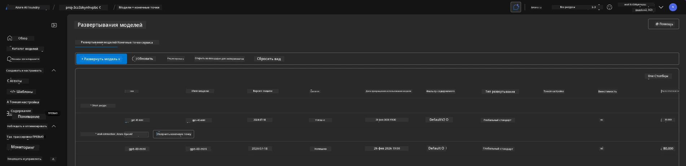
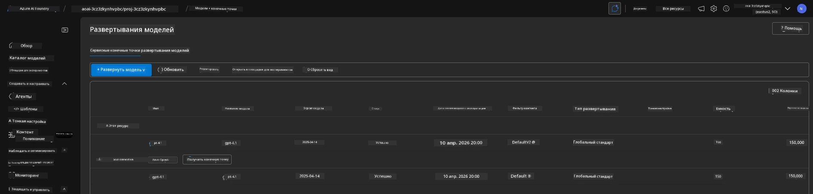

# 6. Демонтаж инфраструктуры

!!! tip "К КОНЦУ ЭТОГО МОДУЛЯ ВЫ СМОЖЕТЕ"

    - [ ] Понять важность очистки ресурсов и управления затратами
    - [ ] Использовать `azd down` для безопасного демонтажа инфраструктуры
    - [ ] Восстанавливать мягко удалённые когнитивные сервисы при необходимости
    - [ ] **Лабораторная работа 6:** Очистить ресурсы Azure и проверить их удаление

---

## Бонусные упражнения

Прежде чем демонтировать проект, уделите несколько минут для свободного исследования.

!!! info "Попробуйте эти подсказки для исследований"

    **Экспериментируйте с GitHub Copilot:**
    
    1. Спросите: `Какие ещё AZD шаблоны я мог бы попробовать для сценариев с несколькими агентами?`
    2. Спросите: `Как я могу настроить инструкции агента для случая использования в здравоохранении?`
    3. Спросите: `Какие переменные окружения контролируют оптимизацию затрат?`
    
    **Исследуйте портал Azure:**
    
    1. Просмотрите метрики Application Insights для вашего развертывания
    2. Проверьте анализ затрат на предоставленные ресурсы
    3. Ещё раз исследуйте площадку агентов в портале Microsoft Foundry

---

## Демонтаж инфраструктуры

1. Демонтаж инфраструктуры так же прост, как:
      
      ```bash title="" linenums="0"
      azd down --purge
      ```
1. Флаг `--purge` гарантирует очистку также мягко удалённых ресурсов Cognitive Service, тем самым освобождая квоты, занятые этими ресурсами. По завершении вы увидите что-то похожее на это:
      
      ```bash title="" linenums="0"
      ? Total resources to delete: 11, are you sure you want to continue? Yes
      Deleting your resources can take some time.
      (✓) Done: Deleted resource group rg-nitya-mshack-azd
      (✓) Done: Purging Cognitive Account: aoai-3cz3zkynhvpbc

      SUCCESS: Your application was removed from Azure in 11 minutes 4 seconds.
      ```

1. (Необязательно) Если теперь снова запустить `azd up`, вы заметите, что модель gpt-4.1 разворачивается, поскольку переменная окружения была изменена (и сохранена) в локальной папке `.azure`. 

      Вот развертывания моделей **до**:

      

      А вот она **после**:
      

---

<!-- CO-OP TRANSLATOR DISCLAIMER START -->
**Отказ от ответственности**:  
Этот документ был переведен с использованием сервиса автоматического перевода [Co-op Translator](https://github.com/Azure/co-op-translator). Несмотря на наши усилия обеспечить точность, имейте в виду, что автоматический перевод может содержать ошибки или неточности. Оригинальный документ на его исходном языке следует считать авторитетным источником. Для важной информации рекомендуется обращаться к профессиональному переводу, выполненному человеком. Мы не несём ответственности за любые недоразумения или неправильные толкования, возникающие из использования этого перевода.
<!-- CO-OP TRANSLATOR DISCLAIMER END -->