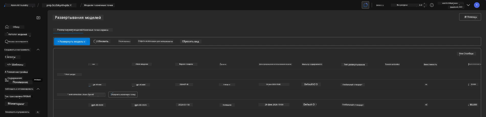
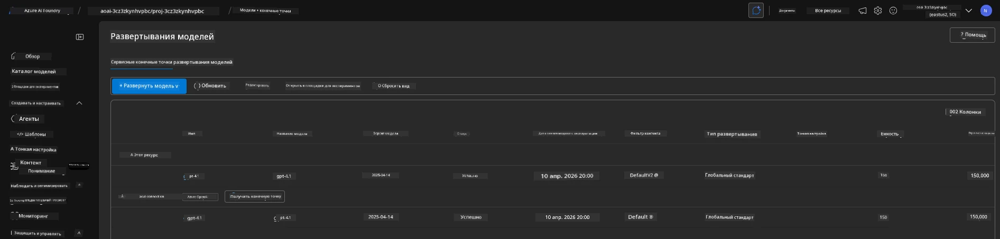

# 6. Удаление инфраструктуры

!!! tip "ПО ЗАВЕРШЕНИИ ЭТОГО МОДУЛЯ ВЫ СМОЖЕТЕ"

    - [ ] Понимать важность очистки ресурсов и управления затратами
    - [ ] Использовать `azd down` для безопасного удаления инфраструктуры
    - [ ] Восстанавливать мягко удалённые службы Azure AI при необходимости
    - [ ] **Лабораторная работа 6:** Очистить ресурсы Azure и проверить их удаление

---

## Дополнительные упражнения

Прежде чем удалять проект, уделите несколько минут свободному исследованию.

!!! info "Попробуйте эти вопросы для исследования"

    **Экспериментируйте с GitHub Copilot:**
    
    1. Спросите: `Какие еще шаблоны AZD я могу попробовать для сценариев с несколькими агентами?`
    2. Спросите: `Как я могу настроить инструкции для агента для медицинского применения?`
    3. Спросите: `Какие переменные окружения контролируют оптимизацию затрат?`
    
    **Исследуйте портал Azure:**
    
    1. Ознакомьтесь с метриками Application Insights вашего развертывания
    2. Проверьте анализ затрат на задействованные ресурсы
    3. Еще раз изучите площадку агентов портала Microsoft Foundry

---

## Удаление инфраструктуры

1. Удаление инфраструктуры так же просто, как:
      
      ```bash title="" linenums="0"
      azd down --purge
      ```
1. Флаг `--purge` гарантирует также удаление мягко удалённых ресурсов Cognitive Service, тем самым освобождая квоты, занятые этими ресурсами. По завершении вы увидите что-то похожее на это:
      
      ```bash title="" linenums="0"
      ? Total resources to delete: 11, are you sure you want to continue? Yes
      Deleting your resources can take some time.
      (✓) Done: Deleted resource group rg-nitya-mshack-azd
      (✓) Done: Purging Cognitive Account: aoai-3cz3zkynhvpbc

      SUCCESS: Your application was removed from Azure in 11 minutes 4 seconds.
      ```

1. (Необязательно) Если теперь вы снова выполните `azd up`, вы заметите, что модель gpt-4.1 разворачивается, так как переменная окружения была изменена (и сохранена) в локальной папке `.azure`.

      Вот как выглядели развертывания моделей **до**:

      

      А вот как стало **после**:
      

---

<!-- CO-OP TRANSLATOR DISCLAIMER START -->
**Отказ от ответственности**:
Этот документ был переведен с использованием сервиса машинного перевода [Co-op Translator](https://github.com/Azure/co-op-translator). Несмотря на наши усилия по обеспечению точности, имейте в виду, что автоматический перевод может содержать ошибки или неточности. Оригинальный документ на его исходном языке следует считать авторитетным источником. Для получения критически важной информации рекомендуется обратиться к профессиональному человеческому переводу. Мы не несем ответственности за любые недоразумения или неправильные толкования, возникшие в результате использования этого перевода.
<!-- CO-OP TRANSLATOR DISCLAIMER END -->