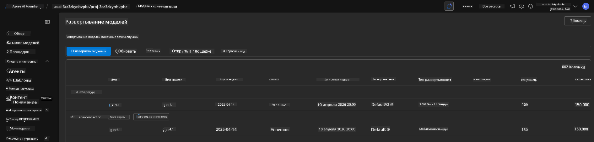

<!--
CO_OP_TRANSLATOR_METADATA:
{
  "original_hash": "6539a34c770f3ceff282370d72ee74dc",
  "translation_date": "2025-09-24T12:06:10+00:00",
  "source_file": "workshop/docs/instructions/6-Teardown-Infrastructure.md",
  "language_code": "ru"
}
-->
# 6. Завершение работы с инфраструктурой

!!! tip "К КОНЦУ ЭТОГО МОДУЛЯ ВЫ СМОЖЕТЕ"

    - [ ] Пункт
    - [ ] Пункт
    - [ ] Пункт

---

## Дополнительные упражнения

Перед тем как завершить работу над проектом, уделите несколько минут на свободное исследование.

!!! danger "NITYA-TODO: Сформулировать несколько предложений для выполнения"

---

## Удаление инфраструктуры

1. Завершение работы с инфраструктурой выполняется так же просто, как:

      ```bash title="" linenums="0"
      azd down --purge
      ```
1. Флаг `--purge` гарантирует, что также будут удалены мягко удаленные ресурсы Cognitive Service, освобождая квоту, занятую этими ресурсами. После завершения вы увидите что-то вроде этого:

      ```bash title="" linenums="0"
      ? Total resources to delete: 11, are you sure you want to continue? Yes
      Deleting your resources can take some time.
      (✓) Done: Deleted resource group rg-nitya-mshack-azd
      (✓) Done: Purging Cognitive Account: aoai-3cz3zkynhvpbc

      SUCCESS: Your application was removed from Azure in 11 minutes 4 seconds.
      ```

1. (Необязательно) Если вы теперь снова выполните команду `azd up`, вы заметите, что модель gpt-4.1 будет развернута, так как переменная окружения была изменена (и сохранена) в локальной папке `.azure`.

      Вот как выглядели развертывания модели **до**:

      

      А вот как они выглядят **после**:
      

---

