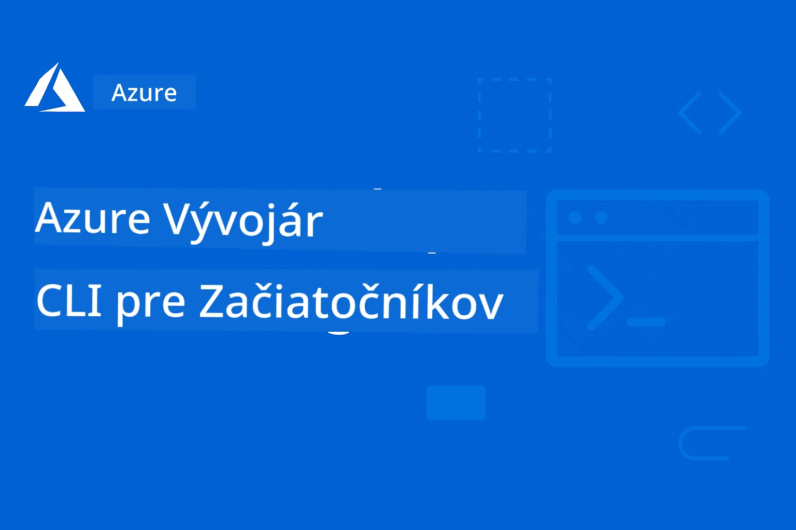

# AZD Pre Začiatočníkov: Štruktúrovaná Cesta Učenia

 

[](https://GitHub.com/microsoft/azd-for-beginners/watchers/)
[](https://GitHub.com/microsoft/azd-for-beginners/network/)
[](https://GitHub.com/microsoft/azd-for-beginners/stargazers/)

[](https://discord.gg/microsoft-azure)
[](https://discord.gg/nTYy5BXMWG)

## Začíname s týmto kurzom

Postupujte podľa týchto krokov, aby ste začali svoju AZD cestu učenia:

1. **Vytvorte Fork Repozitára**: Kliknite na [](https://GitHub.com/microsoft/azd-for-beginners/fork)
2. **Skloňte Repozitár**: `git clone https://github.com/microsoft/azd-for-beginners.git`
3. **Pridajte sa do Komunity**: [Azure Discord Communities](https://discord.com/invite/ByRwuEEgH4) pre odbornú podporu
4. **Vyberte si Svoj Učiaci Sa Cestu**: Vyberte kapitolu nižšie, ktorá zodpovedá vašej úrovni skúseností

### Podpora Viacerých Jazykov

#### Automatické Preklady (vždy aktuálne)

<!-- CO-OP TRANSLATOR LANGUAGES TABLE START -->
[Arabčina](../ar/README.md) | [Bengálčina](../bn/README.md) | [Bulharčina](../bg/README.md) | [Barmský (Myanmar)](../my/README.md) | [Čínština (zjednodušená)](../zh-CN/README.md) | [Čínština (tradičná, Hong Kong)](../zh-HK/README.md) | [Čínština (tradičná, Macau)](../zh-MO/README.md) | [Čínština (tradičná, Taiwan)](../zh-TW/README.md) | [Chorvátčina](../hr/README.md) | [Čeština](../cs/README.md) | [Dánčina](../da/README.md) | [Holandčina](../nl/README.md) | [Estónčina](../et/README.md) | [Fínčina](../fi/README.md) | [Francúzština](../fr/README.md) | [Nemčina](../de/README.md) | [Gréčtina](../el/README.md) | [Hebrejčina](../he/README.md) | [Hindčina](../hi/README.md) | [Maďarčina](../hu/README.md) | [Indonézština](../id/README.md) | [Taliančina](../it/README.md) | [Japončina](../ja/README.md) | [Kannadčina](../kn/README.md) | [Kórejčina](../ko/README.md) | [Litovčina](../lt/README.md) | [Malajčina](../ms/README.md) | [Malayalam](../ml/README.md) | [Maráthčina](../mr/README.md) | [Nepálčina](../ne/README.md) | [Nigérijská Pidgin](../pcm/README.md) | [Nórčina](../no/README.md) | [Perzština (Farsi)](../fa/README.md) | [Poľština](../pl/README.md) | [Portugalčina (Brazília)](../pt-BR/README.md) | [Portugalčina (Portugalsko)](../pt-PT/README.md) | [Pandžábčina (Gurmukhi)](../pa/README.md) | [Rumunčina](../ro/README.md) | [Ruština](../ru/README.md) | [Srbčina (Cyrilika)](../sr/README.md) | [Slovenčina](./README.md) | [Slovinčina](../sl/README.md) | [Španielčina](../es/README.md) | [Swahilčina](../sw/README.md) | [Švédčina](../sv/README.md) | [Tagalog (Filipínčina)](../tl/README.md) | [Tamil](../ta/README.md) | [Telugu](../te/README.md) | [Thajčina](../th/README.md) | [Turečtina](../tr/README.md) | [Ukrajinčina](../uk/README.md) | [Urdu](../ur/README.md) | [Vietnamčina](../vi/README.md)

> **Preferujete Klonovať Lokálne?**

> Tento repozitár obsahuje vyše 50 jazykových prekladov, čo výrazne zväčšuje veľkosť sťahovania. Na klonovanie bez prekladov použite sparse checkout:
> ```bash
> git clone --filter=blob:none --sparse https://github.com/microsoft/AZD-for-beginners.git
> cd AZD-for-beginners
> git sparse-checkout set --no-cone '/*' '!translations' '!translated_images'
> ```
> To vám poskytne všetko potrebné pre dokončenie kurzu s oveľa rýchlejším stiahnutím.
<!-- CO-OP TRANSLATOR LANGUAGES TABLE END -->

## Prehľad Kurzu

Osvojte si Azure Developer CLI (azd) cez štruktúrované kapitoly navrhnuté na progresívne učenie. **Špeciálny dôraz na nasadenie AI aplikácií s integráciou Microsoft Foundry.**

### Prečo je tento kurz nevyhnutný pre moderných vývojárov

Na základe poznatkov z Microsoft Foundry Discord komunity, **45 % vývojárov chce používať AZD pre AI pracovné záťaže** ale stretávajú sa s problémami pri:
- Zložitých viacservisných AI architektúrach
- Najlepších praktikách produkčného nasadenia AI  
- Integrácii a konfigurácii Azure AI služieb
- Optimalizácii nákladov na AI pracovné záťaže
- Riešení špecifických problémov nasadenia AI

### Ciele učenia

Dokončením tohto štruktúrovaného kurzu dosiahnete:
- **Ovládnutie Základov AZD**: Kľúčové koncepty, inštalácia a konfigurácia
- **Nasadenie AI aplikácií**: Použitie AZD s Microsoft Foundry službami
- **Implementácia Infrastructure as Code**: Správa Azure zdrojov pomocou Bicep šablón
- **Riešenie problémov s nasadením**: Odladenie bežných chýb
- **Optimalizácia pre produkciu**: Bezpečnosť, škálovanie, monitoring a správa nákladov
- **Vývoj Viacagentových riešení**: Nasadenie komplexných AI architektúr

## 📚 Učiace sa kapitoly

*Vyberte si svoju cestu učenia na základe úrovne skúseností a cieľov*

### 🚀 Kapitola 1: Základy a Rýchly Štart
**Predpoklady**: Predplatné Azure, základné znalosti príkazového riadku  
**Trvanie**: 30-45 minút  
**Zložitosť**: ⭐

#### Čo sa naučíte
- Pochopenie základov Azure Developer CLI
- Inštalácia AZD na vašej platforme
- Váš prvý úspešný deployment

#### Učiace zdroje
- **🎯 Začnite tu**: [Čo je Azure Developer CLI?](../..)
- **📖 Teória**: [Základy AZD](docs/getting-started/azd-basics.md) - Kľúčové koncepty a terminológia
- **⚙️ Nastavenie**: [Inštalácia a nastavenie](docs/getting-started/installation.md) - Platformovo špecifické návody
- **🛠️ Prakticky**: [Váš prvý projekt](docs/getting-started/first-project.md) - Krok za krokom návod
- **📋 Rýchla referencia**: [Podrobný prehľad príkazov](resources/cheat-sheet.md)

#### Praktické cvičenia
```bash
# Rýchla kontrola inštalácie
azd version

# Nasadte svoju prvú aplikáciu
azd init --template todo-nodejs-mongo
azd up
```

**💡 Výsledok kapitoly**: Úspešne nasadiť jednoduchú webovú aplikáciu do Azure pomocou AZD

**✅ Overenie úspechu:**
```bash
# Po dokončení kapitoly 1 by ste mali byť schopní:
azd version              # Zobrazuje nainštalovanú verziu
azd init --template todo-nodejs-mongo  # Inicializuje projekt
azd up                  # Nasadzuje do Azure
azd show                # Zobrazuje URL bežiacej aplikácie
# Aplikácia sa otvorí v prehliadači a funguje
azd down --force --purge  # Čistí zdroje
```

**📊 Časová investícia:** 30-45 minút  
**📈 Úroveň po dokončení:** Dokáže samostatne nasadiť základné aplikácie

**✅ Overenie úspechu:**
```bash
# Po dokončení kapitoly 1 by ste mali byť schopní:
azd version              # Zobrazuje nainštalovanú verziu
azd init --template todo-nodejs-mongo  # Inicializuje projekt
azd up                  # Nasadzuje do Azure
azd show                # Zobrazuje URL bežiacej aplikácie
# Aplikácia sa otvorí v prehliadači a funguje
azd down --force --purge  # Čistí zdroje
```

**📊 Časová investícia:** 30-45 minút  
**📈 Úroveň po dokončení:** Dokáže samostatne nasadiť základné aplikácie

---

### 🤖 Kapitola 2: Vývoj so zameraním na AI (Odporúčané pre AI vývojárov)
**Predpoklady**: Dokončená kapitola 1  
**Trvanie**: 1-2 hodiny  
**Zložitosť**: ⭐⭐

#### Čo sa naučíte
- Integrácia Microsoft Foundry s AZD
- Nasadzovanie AI poháňaných aplikácií
- Pochopenie konfigurácií AI služieb

#### Učiace zdroje
- **🎯 Začnite tu**: [Integrácia Microsoft Foundry](docs/microsoft-foundry/microsoft-foundry-integration.md)
- **📖 Vzory**: [Nasadenie AI modelov](docs/microsoft-foundry/ai-model-deployment.md) - Nasadzovanie a správa AI modelov
- **🛠️ Workshop**: [AI Workshop Lab](docs/microsoft-foundry/ai-workshop-lab.md) - Pripravte si AI riešenia na AZD
- **🎥 Interaktívny Sprievodca**: [Materiály workshopu](workshop/README.md) - Prehliadačová výučba s MkDocs * DevContainer prostredie
- **📋 Šablóny**: [Microsoft Foundry šablóny](../..)
- **📝 Príklady**: [Príklady nasadenia AZD](examples/README.md)

#### Praktické cvičenia
```bash
# Nasadzujte svoju prvú AI aplikáciu
azd init --template azure-search-openai-demo
azd up

# Vyskúšajte ďalšie AI šablóny
azd init --template openai-chat-app-quickstart
azd init --template agent-openai-python-prompty
```

**💡 Výsledok kapitoly**: Nasadiť a nakonfigurovať AI chat aplikáciu s RAG schopnosťami

**✅ Overenie úspechu:**
```bash
# Po kapitole 2 by ste mali byť schopní:
azd init --template azure-search-openai-demo
azd up
# Otestovať rozhranie AI chatu
# Klásť otázky a získavať odpovede poháňané AI s uvedenými zdrojmi
# Overiť, že integrácia vyhľadávania funguje
azd monitor  # Skontrolovať, či Application Insights zobrazuje telemetriu
azd down --force --purge
```

**📊 Časová investícia:** 1-2 hodiny  
**📈 Úroveň po dokončení:** Dokáže nasadiť a nakonfigurovať produkčne pripravené AI aplikácie  
**💰 Povedomie o nákladoch:** Rozumie vývojovým nákladom cca 80-150 $/mesiac a produkčným 300-3500 $/mesiac

#### 💰 Úvahy o nákladoch na AI nasadenia

**Vývojové prostredie (odhad 80-150 $/mesiac):**
- Azure OpenAI (platené podľa využitia): 0-50 $/mesiac (podľa využitých tokenov)
- AI Search (základná úroveň): 75 $/mesiac
- Container Apps (spotrebné): 0-20 $/mesiac
- Ukladanie (štandardné): 1-5 $/mesiac

**Produkčné prostredie (odhad 300-3500+ $/mesiac):**
- Azure OpenAI (PTU pre konzistentný výkon): 3000+ $/mesiac ALEBO platba podľa využitia s vysokým objemom
- AI Search (štandardná úroveň): 250 $/mesiac
- Container Apps (dedikované): 50-100 $/mesiac
- Application Insights: 5-50 $/mesiac
- Ukladanie (prémiové): 10-50 $/mesiac

**💡 Tipy na optimalizáciu nákladov:**
- Používajte **Zdarma vrstvu** Azure OpenAI na učenie (50 000 tokenov mesačne v cene)
- Používajte `azd down` na uvoľnenie zdrojov, keď nevyvíjate aktívne
- Začnite s platením podľa využitia, PTU aktivujte len pre produkciu
- Používajte `azd provision --preview` na odhad nákladov pred nasadením
- Povoliť automatické škálovanie: platíte iba za reálne využitie

**Monitorovanie nákladov:**
```bash
# Skontrolujte odhadované mesačné náklady
azd provision --preview

# Sledujte skutočné náklady v portáli Azure
az consumption budget list --resource-group <your-rg>
```

---

### ⚙️ Kapitola 3: Konfigurácia a Overovanie identity
**Predpoklady**: Dokončená kapitola 1  
**Trvanie**: 45-60 minút  
**Zložitosť**: ⭐⭐

#### Čo sa naučíte
- Konfigurácia a správa prostredia
- Overovanie identity a bezpečnostné osvedčené postupy
- Pomenovanie a organizovanie zdrojov

#### Učiace zdroje
- **📖 Konfigurácia**: [Sprievodca konfiguráciou](docs/getting-started/configuration.md) - Nastavenie prostredia
- **🔐 Bezpečnosť**: [Vzory overovania a riadenej identity](docs/getting-started/authsecurity.md) - Vzory overovania
- **📝 Príklady**: [Príklad databázovej aplikácie](examples/database-app/README.md) - AZD databázové príklady

#### Praktické cvičenia
- Nakonfigurujte viacero prostredí (dev, staging, prod)
- Nastavte overovanie s riadenou identitou
- Implementujte konfigurácie špecifické pre jednotlivé prostredia

**💡 Výsledok kapitoly**: Spravovať viacero prostredí s riadnym overovaním a zabezpečením

---

### 🏗️ Kapitola 4: Infrastructure as Code a Nasadenie
**Predpoklady**: Dokončené kapitoly 1-3  
**Trvanie**: 1-1,5 hodiny  
**Zložitosť**: ⭐⭐⭐

#### Čo sa naučíte
- Pokročilé vzory nasadenia
- Infrastructure as Code s Bicep
- Stratégie poskytovania zdrojov

#### Učiace zdroje
- **📖 Nasadenie**: [Sprievodca nasadením](docs/deployment/deployment-guide.md) - Kompletné workflow
- **🏗️ Provisioning**: [Provisioning zdrojov](docs/deployment/provisioning.md) - Správa Azure zdrojov
- **📝 Príklady**: [Príklad Container App](../../examples/container-app) - Nasadenia v kontajneroch

#### Praktické cvičenia
- Vytvorte vlastné Bicep šablóny
- Nasadzujte viacservisové aplikácie
- Implementujte blue-green deployment stratégie

**💡 Výsledok kapitoly**: Nasadiť komplexné viacservisové aplikácie s vlastnými infraštruktúrnymi šablónami

---

### 🎯 Kapitola 5: Viacagentové AI riešenia (Pokročilé)
**Predpoklady**: Dokončené kapitoly 1-2  
**Trvanie**: 2-3 hodiny  
**Zložitosť**: ⭐⭐⭐⭐
#### Čo sa naučíte
- Vzory architektúry viacerých agentov
- Orchestrace a koordinácia agentov
- Produkčne pripravené nasadenia AI

#### Vzdelávacie zdroje
- **🤖 Odporúčaný projekt**: [Riešenie pre maloobchod s viacerými agentmi](examples/retail-scenario.md) - Kompletná implementácia
- **🛠️ ARM šablóny**: [Balík ARM šablón](../../examples/retail-multiagent-arm-template) - Nasadenie jedným kliknutím
- **📖 Architektúra**: [Vzory koordinácie viacerých agentov](/docs/pre-deployment/coordination-patterns.md) - Vzory

#### Praktické cvičenia
```bash
# Nasadiť kompletné maloobchodné riešenie s viacerými agentmi
cd examples/retail-multiagent-arm-template
./deploy.sh

# Preskúmať konfigurácie agentov
az deployment group show --resource-group <rg-name> --name <deployment-name>
```

**💡 Výsledok kapitoly**: Nasadiť a spravovať produkčne pripravené AI riešenie viacerých agentov s agentmi pre zákazníkov a inventár

---

### 🔍 Kapitola 6: Validácia a plánovanie pred nasadením
**Predpoklady**: Dokončená kapitola 4  
**Trvanie**: 1 hodina  
**Zložitosť**: ⭐⭐

#### Čo sa naučíte
- Plánovanie kapacity a validácia zdrojov
- Stratégie výberu SKU
- Predletové kontroly a automatizácia

#### Vzdelávacie zdroje
- **📊 Plánovanie**: [Plánovanie kapacity](docs/pre-deployment/capacity-planning.md) - Validácia zdrojov
- **💰 Výber**: [Výber SKU](docs/pre-deployment/sku-selection.md) - Nákladovo efektívne voľby
- **✅ Validácia**: [Predletové kontroly](docs/pre-deployment/preflight-checks.md) - Automatizované skripty

#### Praktické cvičenia
- Spustiť skripty na validáciu kapacity
- Optimalizovať výber SKU z hľadiska nákladov
- Implementovať automatizované kontroly pred nasadením

**💡 Výsledok kapitoly**: Validovať a optimalizovať nasadenia pred samotnou realizáciou

---

### 🚨 Kapitola 7: Riešenie problémov a ladenie
**Predpoklady**: Dokončená ľubovoľná kapitola nasadenia  
**Trvanie**: 1-1,5 hodiny  
**Zložitosť**: ⭐⭐

#### Čo sa naučíte
- Systematické prístupy k ladeniu chýb
- Bežné problémy a riešenia
- Špeciálne riešenia problémov pre AI

#### Vzdelávacie zdroje
- **🔧 Bežné problémy**: [Bežné problémy](docs/troubleshooting/common-issues.md) - FAQ a riešenia
- **🕵️ Ladenie**: [Príručka ladenia](docs/troubleshooting/debugging.md) - Strategické kroky krok za krokom
- **🤖 AI problémy**: [Riešenie problémov špecifických pre AI](docs/troubleshooting/ai-troubleshooting.md) - Problémy služieb AI

#### Praktické cvičenia
- Diagnostikovať chyby nasadenia
- Riešiť problémy s autentifikáciou
- Ladiť konektivitu služieb AI

**💡 Výsledok kapitoly**: Samostatne identifikovať a riešiť bežné problémy s nasadeniami

---

### 🏢 Kapitola 8: Produkčné a podnikové vzory
**Predpoklady**: Dokončené kapitoly 1-4  
**Trvanie**: 2-3 hodiny  
**Zložitosť**: ⭐⭐⭐⭐

#### Čo sa naučíte
- Stratégie produkčného nasadenia
- Podnikové bezpečnostné vzory
- Monitorovanie a optimalizácia nákladov

#### Vzdelávacie zdroje
- **🏭 Produkcia**: [Najlepšie praktiky produkcie AI](docs/microsoft-foundry/production-ai-practices.md) - Podnikové vzory
- **📝 Príklady**: [Príklad mikroservisov](../../examples/microservices) - Zložité architektúry
- **📊 Monitorovanie**: [Integrácia Application Insights](docs/pre-deployment/application-insights.md) - Monitorovanie

#### Praktické cvičenia
- Implementovať podnikové bezpečnostné vzory
- Nastaviť komplexné monitorovanie
- Nasadiť do produkcie so správnou správou

**💡 Výsledok kapitoly**: Nasadiť podnikové aplikácie pripravené na produkciu s plnými možnosťami

---

## 🎓 Prehľad workshopu: Praktický zážitok učenia

> **⚠️ STAV WORKSHOPU: Aktívny vývoj**  
> Materiály workshopu sú momentálne vo vývoji a zdokonaľovaní. Základné moduly fungujú, ale niektoré pokročilé sekcie ešte nie sú dokončené. Aktívne pracujeme na doplnení celého obsahu. [Sledujte pokrok →](workshop/README.md)

### Interaktívne materiály workshopu
**Komplexné praktické učenie s nástrojmi v prehliadači a vedenými cvičeniami**

Materiály nášho workshopu poskytujú štruktúrovaný, interaktívny zážitok učenia, ktorý dopĺňa vyššie uvedený učebný plán podľa kapitol. Workshop je navrhnutý na samostatné aj facilitované učenie.

#### 🛠️ Funkcie workshopu
- **Rozhranie v prehliadači**: Kompletný workshop poháňaný MkDocs s vyhľadávaním, kopírovaním a témami
- **Integrácia GitHub Codespaces**: Nastavenie vývojového prostredia jedným kliknutím
- **Štruktúrovaná učebná cesta**: 7 krokov vedených cvičení (celkom 3,5 hodiny)
- **Objavovanie → Nasadenie → Prispôsobenie**: Postupná metodológia
- **Interaktívne DevContainer prostredie**: Predkonfigurované nástroje a závislosti

#### 📚 Štruktúra workshopu
Workshop nasleduje metodológiu **Objavovanie → Nasadenie → Prispôsobenie**:

1. **Fáza objavovania** (45 minút)
   - Preskúmať šablóny a služby Microsoft Foundry
   - Pochopiť vzory architektúry viacerých agentov
   - Preskúmať požiadavky na nasadenie a predpoklady

2. **Fáza nasadenia** (2 hodiny)
   - Praktické nasadenie AI aplikácií s AZD
   - Konfigurácia služieb Azure AI a koncových bodov
   - Implementácia bezpečnostných a autentifikačných vzorov

3. **Fáza prispôsobenia** (45 minút)
   - Upraviť aplikácie pre špecifické prípady použitia
   - Optimalizovať pre produkčné nasadenie
   - Implementovať monitorovanie a riadenie nákladov

#### 🚀 Začíname s workshopom
```bash
# Možnosť 1: GitHub Codespaces (odporúčané)
# Kliknite na "Code" → "Create codespace on main" v repozitári

# Možnosť 2: Lokálny vývoj
git clone https://github.com/microsoft/azd-for-beginners.git
cd azd-for-beginners/workshop
# Postupujte podľa inštrukcií na nastavenie v workshop/README.md
```

#### 🎯 Výsledky učenia workshopu
Účastníci po dokončení workshopu budú vedieť:
- **Nasadiť produkčné AI aplikácie**: Použiť AZD so službami Microsoft Foundry
- **Ovládnuť architektúry viacerých agentov**: Implementovať koordinované AI riešenia agentov
- **Implementovať najlepšie bezpečnostné praktiky**: Konfigurovať autentifikáciu a kontrolu prístupu
- **Optimalizovať pre škálovanie**: Navrhovať nákladovo efektívne a výkonné nasadenia
- **Riešiť problémy pri nasadení**: Samostatne vyriešiť bežné problémy

#### 📖 Zdroje workshopu
- **🎥 Interaktívny návod**: [Materiály workshopu](workshop/README.md) - Prostredie učenia v prehliadači
- **📋 Podrobné inštrukcie**: [Vedené cvičenia](../../workshop/docs/instructions) - Podrobné návody
- **🛠️ AI workshop laboratórium**: [AI Workshop Lab](docs/microsoft-foundry/ai-workshop-lab.md) - AI zamerané cvičenia
- **💡 Rýchly štart**: [Návod na nastavenie workshopu](workshop/README.md#quick-start) - Konfigurácia prostredia

**Ideálne pre**: firemné školenia, univerzitné kurzy, samostatné štúdium a bootcampy pre vývojárov.

---

## 📖 Čo je Azure Developer CLI?

Azure Developer CLI (azd) je príkazové rozhranie zamerané na vývojárov, ktoré urýchľuje proces budovania a nasadzovania aplikácií do Azure. Poskytuje:

- **Nasadenia založené na šablónach** - Použitie predpripravených šablón pre bežné aplikačné vzory
- **Infrastruktúra ako kód** - Správa Azure zdrojov pomocou Bicep alebo Terraform  
- **Integrované pracovné postupy** - Plynulá príprava, nasadenie a monitorovanie aplikácií
- **Priateľské pre vývojárov** - Optimalizované pre produktivitu a zážitok vývojára

### **AZD + Microsoft Foundry: Ideálne pre AI nasadenia**

**Prečo AZD pre AI riešenia?** AZD rieši hlavné výzvy, ktorým čelia vývojári AI:

- **Šablóny pripravené pre AI** - Predkonfigurované šablóny pre Azure OpenAI, Cognitive Services a ML záťaže
- **Bezpečné AI nasadenia** - Vstavané bezpečnostné vzory pre AI služby, API kľúče a koncové body modelov  
- **Produkčné AI vzory** - Najlepšie praktiky pre škálovateľné, nákladovo efektívne AI aplikácie
- **End-to-End AI pracovné toky** - Od vývoja modelu po produkčné nasadenie s riadením
- **Optimalizácia nákladov** - Inteligentné prideľovanie zdrojov a stratégie škálovania AI záťaží
- **Integrácia Microsoft Foundry** - Plynulá väzba na katalóg modelov a koncové body Microsoft Foundry

---

## 🎯 Knižnica šablón a príkladov

### Odporúčané: Šablóny Microsoft Foundry
**Začnite tu, ak nasadzujete AI aplikácie!**

> **Poznámka:** Tieto šablóny demonštrujú rôzne AI vzory. Niektoré sú externé Azure Samples, iné sú lokálne implementácie.

| Šablóna | Kapitola | Zložitosť | Služby | Typ |
|----------|---------|------------|----------|------|
| [**Začnite s AI chatom**](https://github.com/Azure-Samples/get-started-with-ai-chat) | Kapitola 2 | ⭐⭐ | AzureOpenAI + Azure AI Model Inference API + Azure AI Search + Azure Container Apps + Application Insights | Externé |
| [**Začnite s AI agentmi**](https://github.com/Azure-Samples/get-started-with-ai-agents) | Kapitola 2 | ⭐⭐ | Azure AI Agent Service + AzureOpenAI + Azure AI Search + Azure Container Apps + Application Insights| Externé |
| [**Azure Search + OpenAI Demo**](https://github.com/Azure-Samples/azure-search-openai-demo) | Kapitola 2 | ⭐⭐ | AzureOpenAI + Azure AI Search + App Service + Storage | Externé |
| [**OpenAI Chat App Rýchly štart**](https://github.com/Azure-Samples/openai-chat-app-quickstart) | Kapitola 2 | ⭐ | AzureOpenAI + Container Apps + Application Insights | Externé |
| [**Agent OpenAI Python Prompty**](https://github.com/Azure-Samples/agent-openai-python-prompty) | Kapitola 5 | ⭐⭐⭐ | AzureOpenAI + Azure Functions + Prompty | Externé |
| [**Contoso Chat RAG**](https://github.com/Azure-Samples/contoso-chat) | Kapitola 8 | ⭐⭐⭐⭐ | AzureOpenAI + AI Search + Cosmos DB + Container Apps | Externé |
| [**Riešenie maloobchodu s viacerými agentmi**](examples/retail-scenario.md) | Kapitola 5 | ⭐⭐⭐⭐ | AzureOpenAI + AI Search + Storage + Container Apps + Cosmos DB | **Lokálne** |

### Odporúčané: Kompletné učebné scenáre
**Produkčne pripravené aplikačné šablóny podľa učebných kapitol**

| Šablóna | Učebná kapitola | Zložitosť | Kľúčové učenie |
|----------|------------------|------------|--------------|
| [**openai-chat-app-quickstart**](https://github.com/Azure-Samples/openai-chat-app-quickstart) | Kapitola 2 | ⭐ | Základné vzory AI nasadenia |
| [**azure-search-openai-demo**](https://github.com/Azure-Samples/azure-search-openai-demo) | Kapitola 2 | ⭐⭐ | Implementácia RAG s Azure AI Search |
| [**ai-document-processing**](https://github.com/Azure-Samples/ai-document-processing) | Kapitola 4 | ⭐⭐ | Integrácia dokumentovej inteligencie |
| [**agent-openai-python-prompty**](https://github.com/Azure-Samples/agent-openai-python-prompty) | Kapitola 5 | ⭐⭐⭐ | Agentný rámec a volanie funkcií |
| [**contoso-chat**](https://github.com/Azure-Samples/contoso-chat) | Kapitola 8 | ⭐⭐⭐ | Podniková AI orchestrácia |
| [**retail-multi-agent-solution**](examples/retail-scenario.md) | Kapitola 5 | ⭐⭐⭐⭐ | Architektúra viacerých agentov so zákazníckymi a inventárnymi agentmi |

### Učenie podľa typu príkladu

> **📌 Lokálne vs. Externé príklady:**  
> **Lokálne príklady** (v tomto repozitári) = Ihneď pripravené na použitie  
> **Externé príklady** (Azure Samples) = Klonovať z prepojených repozitárov

#### Lokálne príklady (ihneď použiteľné)
- [**Riešenie maloobchodu s viacerými agentmi**](examples/retail-scenario.md) - Kompletná výrobná implementácia s ARM šablónami
  - Architektúra viacerých agentov (zákazník + inventár)
  - Komplexné monitorovanie a hodnotenie
  - Nasadenie jedným kliknutím cez ARM šablónu

#### Lokálne príklady - kontajnerové aplikácie (kapitoly 2-5)
**Komplexné príklady nasadenia kontajnerov v tomto repozitári:**
- [**Príklady Container App**](examples/container-app/README.md) - Kompletný sprievodca kontajnerovými nasadeniami
  - [Jednoduché Flask API](../../examples/container-app/simple-flask-api) - Základné REST API so škálovaním na nulu
  - [Architektúra mikroservisov](../../examples/container-app/microservices) - Produkčné nasadenie viacerých služieb
  - Rýchly štart, produkčné a pokročilé vzory nasadenia
  - Monitorovanie, bezpečnosť a optimalizácia nákladov

#### Externé príklady - jednoduché aplikácie (kapitoly 1-2)
**Klonujte tieto Azure Samples repozitáre, aby ste mohli začať:**
- [Jednoduchá webová aplikácia - Node.js + MongoDB](https://github.com/Azure-Samples/todo-nodejs-mongo) - Základné vzory nasadenia
- [Statická webová stránka - React SPA](https://github.com/Azure-Samples/todo-csharp-sql-swa-func) - Nasadenie statického obsahu
- [Container App - Python Flask](https://github.com/Azure-Samples/container-apps-store-api-microservice) - Nasadenie REST API

#### Externé príklady - integrácia databázy (kapitola 3-4)  
- [Aplikácia s databázou - C# + SQL](https://github.com/Azure-Samples/todo-csharp-sql) - Vzory pre pripojenie k databáze
- [Funkcie + Cosmos DB](https://github.com/Azure-Samples/todo-python-mongo-swa-func) - Serverless dátové pracovné toky

#### Externé príklady - pokročilé vzory (kapitoly 4-8)
- [Java mikroservisy](https://github.com/Azure-Samples/java-microservices-aca-lab) - Architektúry viacerých služieb
- [Container Apps Jobs](https://github.com/Azure-Samples/container-apps-jobs) - Spracovanie na pozadí  
- [Podnikový ML pipeline](https://github.com/Azure-Samples/mlops-v2) - Produkčné ML vzory

### Externé kolekcie šablón
- [**Oficiálna galéria AZD šablón**](https://azure.github.io/awesome-azd/) - Vybraná kolekcia oficiálnych a komunitných šablón
- [**Šablóny Azure Developer CLI**](https://learn.microsoft.com/en-us/azure/developer/azure-developer-cli/azd-templates) - Dokumentácia šablón Microsoft Learn  
- [**Adresár príkladov**](examples/README.md) - Lokálne výučbové príklady s podrobnými vysvetleniami

---

## 📚 Vzdelávacie zdroje a referencia

### Rýchle odkazy
- [**Cheat Sheet príkazov**](resources/cheat-sheet.md) - Základné príkazy azd usporiadané podľa kapitol  
- [**Glosár**](resources/glossary.md) - Terminológia Azure a azd  
- [**FAQ**](resources/faq.md) - Často kladené otázky podľa kapitol učenia  
- [**Študijný sprievodca**](resources/study-guide.md) - Komplexné cvičenia na precvičenie

### Praktické workshopy
- [**AI Workshop Lab**](docs/microsoft-foundry/ai-workshop-lab.md) - Urobte svoje AI riešenia rozmiestniteľné cez AZD (2-3 hodiny)  
- [**Interaktívny sprievodca workshopom**](workshop/README.md) - Workshop v prehliadači s MkDocs a prostredím DevContainer  
- [**Štruktúrovaná učebná cesta**](../../workshop/docs/instructions) - 7-krokové riadené cvičenia (Objavovanie → Nasadenie → Prispôsobenie)  
- [**AZD Workshop pre začiatočníkov**](workshop/README.md) - Kompletné materiály workshopu s integráciou GitHub Codespaces

### Externé vzdelávacie zdroje
- Dokumentácia Azure Developer CLI: [https://learn.microsoft.com/en-us/azure/developer/azure-developer-cli/](https://learn.microsoft.com/en-us/azure/developer/azure-developer-cli/)  
- Azure Architecture Center: [https://learn.microsoft.com/en-us/azure/architecture/](https://learn.microsoft.com/en-us/azure/architecture/)  
- Azure Cenník Kalkulátor: [https://azure.microsoft.com/pricing/calculator/](https://azure.microsoft.com/pricing/calculator/)  
- Azure Stav: [https://status.azure.com/](https://status.azure.com/)

---

## 🔧 Rýchly sprievodca riešením problémov

**Bežné problémy, ktoré začiatočníci riešia, a ich okamžité riešenia:**

### ❌ "azd: príkaz nebol nájdený"

```bash
# Najskôr nainštalujte AZD
# Windows (PowerShell):
winget install microsoft.azd

# macOS:
brew tap azure/azd && brew install azd

# Linux:
curl -fsSL https://aka.ms/install-azd.sh | bash

# Overiť inštaláciu
azd version
```
  
### ❌ "Nenašla sa žiadna predplatné" alebo "Nie je nastavené predplatné"

```bash
# Zoznam dostupných predplatných
az account list --output table

# Nastaviť predvolené predplatné
az account set --subscription "<subscription-id-or-name>"

# Nastaviť pre prostredie AZD
azd env set AZURE_SUBSCRIPTION_ID "<subscription-id>"

# Overiť
az account show
```
  
### ❌ "Nedostatočná kvóta" alebo "Kvóta prekročená"

```bash
# Skúste iný Azure región
azd env set AZURE_LOCATION "westus2"
azd up

# Alebo použite menšie SKU pri vývoji
# Upraviť infra/main.parameters.json:
{
  "sku": "B1"  // Instead of "P1V2"
}
```
  
### ❌ "azd up" zlyhá v polovici

```bash
# Možnosť 1: Vyčistiť a skúsiť znova
azd down --force --purge
azd up

# Možnosť 2: Len opraviť infraštruktúru
azd provision

# Možnosť 3: Skontrolovať podrobné logy
azd show
azd logs
```
  
### ❌ "Overenie zlyhalo" alebo "Token expiroval"

```bash
# Opätovne overiť
az logout
az login

azd auth logout
azd auth login

# Overiť autentifikáciu
az account show
```
  
### ❌ "Zdroj už existuje" alebo konflikty v menách

```bash
# AZD generuje jedinečné mená, ale ak nastane konflikt:
azd down --force --purge

# Potom skúste znova s novým prostredím
azd env new dev-v2
azd up
```
  
### ❌ Nasadzovanie šablóny trvá príliš dlho

**Bežné časy čakania:**  
- Jednoduchá webová aplikácia: 5-10 minút  
- Aplikácia s databázou: 10-15 minút  
- AI aplikácie: 15-25 minút (provízia OpenAI je pomalá)

```bash
# Skontrolujte pokrok
azd show

# Ak ste zaseknutí >30 minút, skontrolujte Azure Portal:
azd monitor
# Hľadajte neúspešné nasadenia
```
  
### ❌ "Prístup zamietnutý" alebo "Zakázané"

```bash
# Skontrolujte svoju rolu v Azure
az role assignment list --assignee $(az account show --query user.name -o tsv)

# Potrebujete aspoň rolu "Prispievateľ"
# Požiadajte svojho správcu Azure o udelenie:
# - Prispievateľ (pre zdroje)
# - Správca prístupu používateľa (pre priraďovanie rolí)
```
  
### ❌ Nemôžem nájsť URL nasadenej aplikácie

```bash
# Zobraziť všetky koncové body služby
azd show

# Alebo otvorte Azure portál
azd monitor

# Skontrolovať konkrétnu službu
azd env get-values
# Hľadať premenné *_URL
```
  
### 📚 Kompletné zdroje pre riešenie problémov

- **Sprievodca bežnými problémami:** [Podrobné riešenia](docs/troubleshooting/common-issues.md)  
- **AI špecifické problémy:** [Riešenie problémov s AI](docs/troubleshooting/ai-troubleshooting.md)  
- **Sprievodca ladením:** [Ladenie krok za krokom](docs/troubleshooting/debugging.md)  
- **Získajte pomoc:** [Azure Discord](https://discord.gg/microsoft-azure) #azure-developer-cli

---

## 🔧 Rýchly sprievodca riešením problémov

**Bežné problémy, ktoré začiatočníci riešia, a ich okamžité riešenia:**

<details>
<summary><strong>❌ "azd: príkaz nebol nájdený"</strong></summary>

```bash
# Najprv nainštalujte AZD
# Windows (PowerShell):
winget install microsoft.azd

# macOS:
brew tap azure/azd && brew install azd

# Linux:
curl -fsSL https://aka.ms/install-azd.sh | bash

# Overiť inštaláciu
azd version
```
</details>

<details>
<summary><strong>❌ "Nenašla sa žiadna predplatné" alebo "Nie je nastavené predplatné"</strong></summary>

```bash
# Zoznam dostupných predplatných
az account list --output table

# Nastaviť predvolené predplatné
az account set --subscription "<subscription-id-or-name>"

# Nastaviť pre prostredie AZD
azd env set AZURE_SUBSCRIPTION_ID "<subscription-id>"

# Overiť
az account show
```
</details>

<details>
<summary><strong>❌ "Nedostatočná kvóta" alebo "Kvóta prekročená"</strong></summary>

```bash
# Vyskúšajte inú oblasť Azure
azd env set AZURE_LOCATION "westus2"
azd up

# Alebo použite menšie SKU počas vývoja
# Upravte infra/main.parameters.json:
{
  "sku": "B1"  // Instead of "P1V2"
}
```
</details>

<details>
<summary><strong>❌ "azd up" zlyhá v polovici</strong></summary>

```bash
# Možnosť 1: Vyčistiť a skúsiť znova
azd down --force --purge
azd up

# Možnosť 2: Iba opraviť infraštruktúru
azd provision

# Možnosť 3: Skontrolovať podrobné denníky
azd show
azd logs
```
</details>

<details>
<summary><strong>❌ "Overenie zlyhalo" alebo "Token expiroval"</strong></summary>

```bash
# Opätovne overiť
az logout
az login

azd auth logout
azd auth login

# Overiť autentifikáciu
az account show
```
</details>

<details>
<summary><strong>❌ "Zdroj už existuje" alebo konflikty v menách</strong></summary>

```bash
# AZD generuje jedinečné mená, ale ak dôjde ku konfliktu:
azd down --force --purge

# Potom skúste znova s novým prostredím
azd env new dev-v2
azd up
```
</details>

<details>
<summary><strong>❌ Nasadzovanie šablóny trvá príliš dlho</strong></summary>

**Bežné časy čakania:**  
- Jednoduchá webová aplikácia: 5-10 minút  
- Aplikácia s databázou: 10-15 minút  
- AI aplikácie: 15-25 minút (provízia OpenAI je pomalá)

```bash
# Skontrolujte priebeh
azd show

# Ak ste zaseknutí viac ako 30 minút, skontrolujte Azure Portal:
azd monitor
# Hľadajte neúspešné nasadenia
```
</details>

<details>
<summary><strong>❌ "Prístup zamietnutý" alebo "Zakázané"</strong></summary>

```bash
# Skontrolujte svoju rolu v Azure
az role assignment list --assignee $(az account show --query user.name -o tsv)

# Potrebujete aspoň rolu "Prispievateľ"
# Požiadajte svojho Azure administrátora o udelenie:
# - Prispievateľ (pre zdroje)
# - Správca prístupu používateľa (pre priradenie rolí)
```
</details>

<details>
<summary><strong>❌ Nemôžem nájsť URL nasadenej aplikácie</strong></summary>

```bash
# Zobraziť všetky koncové body služby
azd show

# Alebo otvorte Azure portál
azd monitor

# Skontrolovať konkrétnu službu
azd env get-values
# Hľadať premenné *_URL
```
</details>

### 📚 Kompletné zdroje pre riešenie problémov

- **Sprievodca bežnými problémami:** [Podrobné riešenia](docs/troubleshooting/common-issues.md)  
- **AI špecifické problémy:** [Riešenie problémov s AI](docs/troubleshooting/ai-troubleshooting.md)  
- **Sprievodca ladením:** [Ladenie krok za krokom](docs/troubleshooting/debugging.md)  
- **Získajte pomoc:** [Azure Discord](https://discord.gg/microsoft-azure) #azure-developer-cli

---

## 🎓 Dokončenie kurzu a certifikácia

### Sledovanie pokroku  
Sledujte svoj pokrok v učení v jednotlivých kapitolách:

- [ ] **Kapitola 1**: Základy a rýchly štart ✅  
- [ ] **Kapitola 2**: Vývoj so zameraním na AI ✅  
- [ ] **Kapitola 3**: Konfigurácia a overenie ✅  
- [ ] **Kapitola 4**: Infrastruktúra ako kód a nasadenie ✅  
- [ ] **Kapitola 5**: Viacagentové AI riešenia ✅  
- [ ] **Kapitola 6**: Prednasadená validácia a plánovanie ✅  
- [ ] **Kapitola 7**: Riešenie problémov a ladenie ✅  
- [ ] **Kapitola 8**: Produkčné a podnikové vzory ✅

### Overovanie vedomostí  
Po dokončení každej kapitoly overte svoje poznatky takto:  
1. **Praktické cvičenie**: Dokončite praktickú časť nasadenia kapitoly  
2. **Kontrola znalostí**: Prezrite si sekciu FAQ pre svoju kapitolu  
3. **Diskusia v komunite**: Podeľte sa o svoje skúsenosti v Azure Discord  
4. **Ďalšia kapitola**: Pokračujte na ďalšiu úroveň zložitosti

### Výhody dokončenia kurzu  
Po dokončení všetkých kapitol budete mať:  
- **Produkčné skúsenosti**: Nasadené reálne AI aplikácie v Azure  
- **Profesionálne zručnosti**: Schopnosť nasadiť riešenia pripravené pre podnikové použitie  
- **Uznanie v komunite**: Aktívneho člena Azure developerskej komunity  
- **Kariérny postup**: Žiadanú expertízu v AZD a AI nasadzovaní

---

## 🤝 Komunita a podpora

### Získajte pomoc a podporu
- **Technické problémy**: [Nahlásenie chýb a požiadavky na funkcie](https://github.com/microsoft/azd-for-beginners/issues)  
- **Otázky o učení**: [Microsoft Azure Discord komunita](https://discord.gg/microsoft-azure) a [](https://discord.gg/nTYy5BXMWG)  
- **Pomoc pre AI špecifické témy**: Pridajte sa do [](https://discord.gg/nTYy5BXMWG)  
- **Dokumentácia**: [Oficiálna dokumentácia Azure Developer CLI](https://learn.microsoft.com/en-us/azure/developer/azure-developer-cli/)

### Postrehy komunity z Microsoft Foundry Discord

**Nedávne výsledky ankety v kanáli #Azure:**  
- **45 %** vývojárov chce používať AZD pre AI pracovné záťaže  
- **Hlavné výzvy:** Nasadenie viacerých služieb, správa poverení, pripravenosť do produkcie  
- **Najžiadanejšie:** AI-šablóny, sprievodcovia riešením problémov, osvedčené postupy  

**Pridajte sa do našej komunity a:**  
- Podeľte sa o svoje skúsenosti s AZD + AI a získajte pomoc  
- Získajte prístup k skorým náhľadom nových AI šablón  
- Prispievajte k osvedčeným postupom nasadenia AI  
- Ovplyvnite budúci vývoj funkcií AI + AZD

### Príspevky do kurzu  
Vítame príspevky! Prečítajte si [Sprievodcu príspevkami](CONTRIBUTING.md), kde nájdete informácie o:  
- **Vylepšenie obsahu:** Zlepšenie existujúcich kapitol a príkladov  
- **Nové príklady:** Pridávanie reálnych scenárov a šablón  
- **Preklady:** Pomoc pri udržiavaní viacerých jazykových verzií  
- **Hlásenia chýb:** Zlepšenie presnosti a zrozumiteľnosti  
- **Komunitné štandardy:** Dodržiavanie pravidiel inkluzívnej komunity

---

## 📄 Informácie o kurze

### Licencia  
Tento projekt je licencovaný pod licenciou MIT - podrobnosti nájdete v súbore [LICENSE](../../LICENSE).

### Súvisiace vzdelávacie zdroje Microsoft Learn

Náš tím vytvára ďalšie komplexné výučbové kurzy:

<!-- CO-OP TRANSLATOR OTHER COURSES START -->
### LangChain  
[](https://aka.ms/langchain4j-for-beginners)  
[](https://aka.ms/langchainjs-for-beginners?WT.mc_id=m365-94501-dwahlin)  
[](https://github.com/microsoft/langchain-for-beginners?WT.mc_id=m365-94501-dwahlin)  
---

### Azure / Edge / MCP / Agentí  
[](https://github.com/microsoft/AZD-for-beginners?WT.mc_id=academic-105485-koreyst)  
[](https://github.com/microsoft/edgeai-for-beginners?WT.mc_id=academic-105485-koreyst)  
[](https://github.com/microsoft/mcp-for-beginners?WT.mc_id=academic-105485-koreyst)  
[](https://github.com/microsoft/ai-agents-for-beginners?WT.mc_id=academic-105485-koreyst)

---

### Séria Generatívnej AI  
[](https://github.com/microsoft/generative-ai-for-beginners?WT.mc_id=academic-105485-koreyst)  
[-9333EA?style=for-the-badge&labelColor=E5E7EB&color=9333EA)](https://github.com/microsoft/Generative-AI-for-beginners-dotnet?WT.mc_id=academic-105485-koreyst)  
[-C084FC?style=for-the-badge&labelColor=E5E7EB&color=C084FC)](https://github.com/microsoft/generative-ai-for-beginners-java?WT.mc_id=academic-105485-koreyst)  
[-E879F9?style=for-the-badge&labelColor=E5E7EB&color=E879F9)](https://github.com/microsoft/generative-ai-with-javascript?WT.mc_id=academic-105485-koreyst)

---

### Základné učenie
[](https://aka.ms/ml-beginners?WT.mc_id=academic-105485-koreyst)
[](https://aka.ms/datascience-beginners?WT.mc_id=academic-105485-koreyst)
[](https://aka.ms/ai-beginners?WT.mc_id=academic-105485-koreyst)
[](https://github.com/microsoft/Security-101?WT.mc_id=academic-96948-sayoung)
[](https://aka.ms/webdev-beginners?WT.mc_id=academic-105485-koreyst)
[](https://aka.ms/iot-beginners?WT.mc_id=academic-105485-koreyst)
[](https://github.com/microsoft/xr-development-for-beginners?WT.mc_id=academic-105485-koreyst)

---
 
### Séria Copilot
[](https://aka.ms/GitHubCopilotAI?WT.mc_id=academic-105485-koreyst)
[](https://github.com/microsoft/mastering-github-copilot-for-dotnet-csharp-developers?WT.mc_id=academic-105485-koreyst)
[](https://github.com/microsoft/CopilotAdventures?WT.mc_id=academic-105485-koreyst)
<!-- CO-OP TRANSLATOR OTHER COURSES END -->

---

## 🗺️ Navigácia kurzom

**🚀 Pripravený začať sa učiť?**

**Začiatočníci**: Začnite s [Kapitola 1: Základy a Rýchly štart](../..)  
**AI vývojári**: Preskočte na [Kapitola 2: AI-First vývoj](../..)  
**Skúsení vývojári**: Začnite s [Kapitola 3: Konfigurácia a autentifikácia](../..)

**Ďalšie kroky**: [Začať Kapitolu 1 - AZD základy](docs/getting-started/azd-basics.md) →

---

<!-- CO-OP TRANSLATOR DISCLAIMER START -->
**Zrieknutie sa zodpovednosti**:
Tento dokument bol preložený pomocou AI prekladateľskej služby [Co-op Translator](https://github.com/Azure/co-op-translator). Aj keď sa snažíme o presnosť, berte prosím na vedomie, že automatické preklady môžu obsahovať chyby alebo nepresnosti. Originálny dokument v jeho pôvodnom jazyku by mal byť považovaný za záväzný zdroj. Pre kritické informácie sa odporúča profesionálny ľudský preklad. Nie sme zodpovední za akékoľvek nedorozumenia alebo nesprávne interpretácie vyplývajúce z použitia tohto prekladu.
<!-- CO-OP TRANSLATOR DISCLAIMER END -->