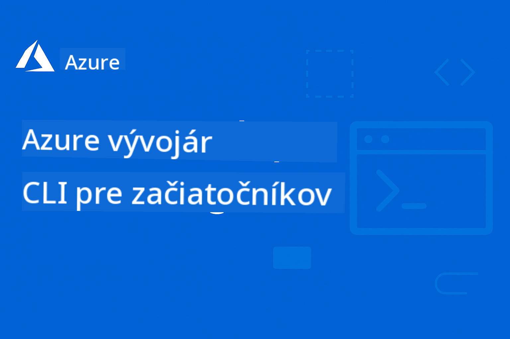

<!--
CO_OP_TRANSLATOR_METADATA:
{
  "original_hash": "7c5d2bb409800e22e74f34ee0ed12bed",
  "translation_date": "2025-12-17T15:31:43+00:00",
  "source_file": "README.md",
  "language_code": "sk"
}
-->
# AZD pre začiatočníkov: Štruktúrovaná cesta učenia

 

[](https://GitHub.com/microsoft/azd-for-beginners/watchers/)
[](https://GitHub.com/microsoft/azd-for-beginners/network/)
[](https://GitHub.com/microsoft/azd-for-beginners/stargazers/)

[](https://discord.gg/microsoft-azure)
[](https://discord.gg/nTYy5BXMWG)

## Začíname s týmto kurzom

Postupujte podľa týchto krokov, aby ste začali svoju cestu učenia AZD:

1. **Vytvorte fork repozitára**: Kliknite na [](https://GitHub.com/microsoft/azd-for-beginners/fork)
2. **Naklonujte repozitár**: `git clone https://github.com/microsoft/azd-for-beginners.git`
3. **Pridajte sa ku komunite**: [Azure Discord komunity](https://discord.com/invite/ByRwuEEgH4) pre odbornú podporu
4. **Vyberte si svoju cestu učenia**: Vyberte kapitolu nižšie, ktorá zodpovedá vašej úrovni skúseností

### Podpora viacerých jazykov

#### Automatizované preklady (vždy aktuálne)

<!-- CO-OP TRANSLATOR LANGUAGES TABLE START -->
[Arabic](../ar/README.md) | [Bengali](../bn/README.md) | [Bulgarian](../bg/README.md) | [Burmese (Myanmar)](../my/README.md) | [Chinese (Simplified)](../zh/README.md) | [Chinese (Traditional, Hong Kong)](../hk/README.md) | [Chinese (Traditional, Macau)](../mo/README.md) | [Chinese (Traditional, Taiwan)](../tw/README.md) | [Croatian](../hr/README.md) | [Czech](../cs/README.md) | [Danish](../da/README.md) | [Dutch](../nl/README.md) | [Estonian](../et/README.md) | [Finnish](../fi/README.md) | [French](../fr/README.md) | [German](../de/README.md) | [Greek](../el/README.md) | [Hebrew](../he/README.md) | [Hindi](../hi/README.md) | [Hungarian](../hu/README.md) | [Indonesian](../id/README.md) | [Italian](../it/README.md) | [Japanese](../ja/README.md) | [Kannada](../kn/README.md) | [Korean](../ko/README.md) | [Lithuanian](../lt/README.md) | [Malay](../ms/README.md) | [Malayalam](../ml/README.md) | [Marathi](../mr/README.md) | [Nepali](../ne/README.md) | [Nigerian Pidgin](../pcm/README.md) | [Norwegian](../no/README.md) | [Persian (Farsi)](../fa/README.md) | [Polish](../pl/README.md) | [Portuguese (Brazil)](../br/README.md) | [Portuguese (Portugal)](../pt/README.md) | [Punjabi (Gurmukhi)](../pa/README.md) | [Romanian](../ro/README.md) | [Russian](../ru/README.md) | [Serbian (Cyrillic)](../sr/README.md) | [Slovak](./README.md) | [Slovenian](../sl/README.md) | [Spanish](../es/README.md) | [Swahili](../sw/README.md) | [Swedish](../sv/README.md) | [Tagalog (Filipino)](../tl/README.md) | [Tamil](../ta/README.md) | [Telugu](../te/README.md) | [Thai](../th/README.md) | [Turkish](../tr/README.md) | [Ukrainian](../uk/README.md) | [Urdu](../ur/README.md) | [Vietnamese](../vi/README.md)
<!-- CO-OP TRANSLATOR LANGUAGES TABLE END -->

## Prehľad kurzu

Ovládnite Azure Developer CLI (azd) prostredníctvom štruktúrovaných kapitol navrhnutých pre postupné učenie. **Špeciálny dôraz na nasadenie AI aplikácií s integráciou Microsoft Foundry.**

### Prečo je tento kurz nevyhnutný pre moderných vývojárov

Na základe poznatkov z komunity Microsoft Foundry Discord, **45 % vývojárov chce používať AZD pre AI pracovné záťaže**, ale stretávajú sa s problémami ako:
- Zložité viacslužbové AI architektúry
- Najlepšie postupy pre produkčné nasadenie AI  
- Integrácia a konfigurácia Azure AI služieb
- Optimalizácia nákladov pre AI pracovné záťaže
- Riešenie problémov špecifických pre AI nasadenia

### Ciele učenia

Dokončením tohto štruktúrovaného kurzu budete:
- **Ovládať základy AZD**: Kľúčové koncepty, inštalácia a konfigurácia
- **Nasadzovať AI aplikácie**: Používať AZD s Microsoft Foundry službami
- **Implementovať infraštruktúru ako kód**: Spravovať Azure zdroje pomocou Bicep šablón
- **Riešiť problémy s nasadením**: Odstraňovať bežné chyby a debugovať problémy
- **Optimalizovať pre produkciu**: Bezpečnosť, škálovanie, monitorovanie a správa nákladov
- **Stavať multi-agentné riešenia**: Nasadzovať zložité AI architektúry

## 📚 Učebné kapitoly

*Vyberte si svoju cestu učenia podľa úrovne skúseností a cieľov*

### 🚀 Kapitola 1: Základy a rýchly štart
**Predpoklady**: Azure predplatné, základné znalosti príkazového riadku  
**Trvanie**: 30-45 minút  
**Zložitosť**: ⭐

#### Čo sa naučíte
- Pochopenie základov Azure Developer CLI
- Inštalácia AZD na vašej platforme
- Vaše prvé úspešné nasadenie

#### Učebné zdroje
- **🎯 Začnite tu**: [Čo je Azure Developer CLI?](../..)
- **📖 Teória**: [Základy AZD](docs/getting-started/azd-basics.md) - Kľúčové koncepty a terminológia
- **⚙️ Nastavenie**: [Inštalácia a nastavenie](docs/getting-started/installation.md) - Návody pre platformu
- **🛠️ Prakticky**: [Váš prvý projekt](docs/getting-started/first-project.md) - Krok za krokom
- **📋 Rýchla referencia**: [Cheat Sheet príkazov](resources/cheat-sheet.md)

#### Praktické cvičenia
```bash
# Rýchla kontrola inštalácie
azd version

# Nasadte svoju prvú aplikáciu
azd init --template todo-nodejs-mongo
azd up
```

**💡 Výsledok kapitoly**: Úspešne nasadiť jednoduchú webovú aplikáciu do Azure pomocou AZD

**✅ Overenie úspechu:**
```bash
# Po dokončení kapitoly 1 by ste mali byť schopní:
azd version              # Zobrazuje nainštalovanú verziu
azd init --template todo-nodejs-mongo  # Inicializuje projekt
azd up                  # Nasadzuje do Azure
azd show                # Zobrazuje URL bežiacej aplikácie
# Aplikácia sa otvorí v prehliadači a funguje
azd down --force --purge  # Čistí zdroje
```

**📊 Časová investícia:** 30-45 minút  
**📈 Úroveň zručností po:** Dokáže samostatne nasadiť základné aplikácie

**✅ Overenie úspechu:**
```bash
# Po dokončení kapitoly 1 by ste mali byť schopní:
azd version              # Zobrazuje nainštalovanú verziu
azd init --template todo-nodejs-mongo  # Inicializuje projekt
azd up                  # Nasadzuje do Azure
azd show                # Zobrazuje URL bežiacej aplikácie
# Aplikácia sa otvorí v prehliadači a funguje
azd down --force --purge  # Čistí zdroje
```

**📊 Časová investícia:** 30-45 minút  
**📈 Úroveň zručností po:** Dokáže samostatne nasadiť základné aplikácie

---

### 🤖 Kapitola 2: Vývoj orientovaný na AI (Odporúčané pre AI vývojárov)
**Predpoklady**: Dokončená kapitola 1  
**Trvanie**: 1-2 hodiny  
**Zložitosť**: ⭐⭐

#### Čo sa naučíte
- Integrácia Microsoft Foundry s AZD
- Nasadzovanie AI aplikácií
- Pochopenie konfigurácií AI služieb

#### Učebné zdroje
- **🎯 Začnite tu**: [Integrácia Microsoft Foundry](docs/microsoft-foundry/microsoft-foundry-integration.md)
- **📖 Vzory**: [Nasadenie AI modelov](docs/microsoft-foundry/ai-model-deployment.md) - Nasadzovanie a správa AI modelov
- **🛠️ Workshop**: [AI Workshop Lab](docs/microsoft-foundry/ai-workshop-lab.md) - Pripravte svoje AI riešenia pre AZD
- **🎥 Interaktívny sprievodca**: [Materiály workshopu](workshop/README.md) - Učenie v prehliadači s MkDocs * DevContainer prostredie
- **📋 Šablóny**: [Microsoft Foundry šablóny](../..)
- **📝 Príklady**: [Príklady nasadenia AZD](examples/README.md)

#### Praktické cvičenia
```bash
# Nasadte svoju prvú AI aplikáciu
azd init --template azure-search-openai-demo
azd up

# Vyskúšajte ďalšie AI šablóny
azd init --template openai-chat-app-quickstart
azd init --template agent-openai-python-prompty
```

**💡 Výsledok kapitoly**: Nasadiť a nakonfigurovať AI chat aplikáciu s RAG schopnosťami

**✅ Overenie úspechu:**
```bash
# Po kapitole 2 by ste mali byť schopní:
azd init --template azure-search-openai-demo
azd up
# Otestovať rozhranie AI chatu
# Klásť otázky a získať odpovede poháňané AI s uvedením zdrojov
# Overiť, že integrácia vyhľadávania funguje
azd monitor  # Skontrolovať, či Application Insights zobrazuje telemetriu
azd down --force --purge
```

**📊 Časová investícia:** 1-2 hodiny  
**📈 Úroveň zručností po:** Dokáže nasadiť a nakonfigurovať produkčne pripravené AI aplikácie  
**💰 Povedomie o nákladoch:** Rozumie nákladom $80-150/mesiac pre vývoj, $300-3500/mesiac pre produkciu

#### 💰 Nákladové úvahy pre AI nasadenia

**Vývojové prostredie (odhad $80-150/mesiac):**
- Azure OpenAI (platba podľa spotreby): $0-50/mesiac (podľa použitia tokenov)
- AI Search (základná úroveň): $75/mesiac
- Container Apps (spotreba): $0-20/mesiac
- Úložisko (štandardné): $1-5/mesiac

**Produkčné prostredie (odhad $300-3,500+/mesiac):**
- Azure OpenAI (PTU pre konzistentný výkon): $3,000+/mesiac ALEBO platba podľa spotreby pri veľkom objeme
- AI Search (štandardná úroveň): $250/mesiac
- Container Apps (dedikované): $50-100/mesiac
- Application Insights: $5-50/mesiac
- Úložisko (prémiové): $10-50/mesiac

**💡 Tipy na optimalizáciu nákladov:**
- Používajte **Free Tier** Azure OpenAI na učenie (50 000 tokenov/mesiac v cene)
- Spúšťajte `azd down` na uvoľnenie zdrojov, keď nevyvíjate aktívne
- Začnite s platbou podľa spotreby, PTU používajte len pre produkciu
- Použite `azd provision --preview` na odhad nákladov pred nasadením
- Zapnite automatické škálovanie: platíte len za skutočné využitie

**Monitorovanie nákladov:**
```bash
# Skontrolujte odhadované mesačné náklady
azd provision --preview

# Sledujte skutočné náklady v Azure Portáli
az consumption budget list --resource-group <your-rg>
```

---

### ⚙️ Kapitola 3: Konfigurácia a autentifikácia
**Predpoklady**: Dokončená kapitola 1  
**Trvanie**: 45-60 minút  
**Zložitosť**: ⭐⭐

#### Čo sa naučíte
- Konfigurácia a správa prostredí
- Najlepšie praktiky autentifikácie a bezpečnosti
- Názvoslovie a organizácia zdrojov

#### Učebné zdroje
- **📖 Konfigurácia**: [Príručka konfigurácie](docs/getting-started/configuration.md) - Nastavenie prostredia
- **🔐 Bezpečnosť**: [Vzory autentifikácie a spravovaná identita](docs/getting-started/authsecurity.md) - Vzory autentifikácie
- **📝 Príklady**: [Príklad databázovej aplikácie](examples/database-app/README.md) - AZD databázové príklady

#### Praktické cvičenia
- Konfigurácia viacerých prostredí (dev, staging, prod)
- Nastavenie autentifikácie pomocou spravovanej identity
- Implementácia konfigurácií špecifických pre prostredie

**💡 Výsledok kapitoly**: Spravovať viaceré prostredia s riadnou autentifikáciou a bezpečnosťou

---

### 🏗️ Kapitola 4: Infraštruktúra ako kód a nasadenie
**Predpoklady**: Dokončené kapitoly 1-3  
**Trvanie**: 1-1,5 hodiny  
**Zložitosť**: ⭐⭐⭐

#### Čo sa naučíte
- Pokročilé vzory nasadenia
- Infraštruktúra ako kód s Bicep
- Stratégie provisioningu zdrojov

#### Učebné zdroje
- **📖 Nasadenie**: [Príručka nasadenia](docs/deployment/deployment-guide.md) - Kompletné pracovné postupy
- **🏗️ Provisioning**: [Provisioning zdrojov](docs/deployment/provisioning.md) - Správa Azure zdrojov
- **📝 Príklady**: [Príklad Container App](../../examples/container-app) - Nasadenia kontajnerov

#### Praktické cvičenia
- Vytvoriť vlastné Bicep šablóny
- Nasadiť viacslužbové aplikácie
- Implementovať stratégie blue-green nasadenia

**💡 Výsledok kapitoly**: Nasadiť zložité viacslužbové aplikácie pomocou vlastných infraštruktúrnych šablón

---

### 🎯 Kapitola 5: Multi-agentné AI riešenia (Pokročilé)
**Predpoklady**: Dokončené kapitoly 1-2  
**Trvanie**: 2-3 hodiny  
**Zložitosť**: ⭐⭐⭐⭐

#### Čo sa naučíte
- Vzory multi-agentnej architektúry
- Orchestrace a koordinácia agentov
- Produkčne pripravené AI nasadenia

#### Učebné zdroje
- **🤖 Vybraný projekt**: [Retail multi-agentné riešenie](examples/retail-scenario.md) - Kompletná implementácia
- **🛠️ ARM šablóny**: [ARM Template Package](../../examples/retail-multiagent-arm-template) - Nasadenie jedným kliknutím
- **📖 Architektúra**: [Vzorce koordinácie viacerých agentov](/docs/pre-deployment/coordination-patterns.md) - Vzory

#### Praktické cvičenia
```bash
# Nasadiť kompletné maloobchodné riešenie s viacerými agentmi
cd examples/retail-multiagent-arm-template
./deploy.sh

# Preskúmať konfigurácie agentov
az deployment group show --resource-group <rg-name> --name <deployment-name>
```

**💡 Výsledok kapitoly**: Nasadiť a spravovať produkčné riešenie AI s viacerými agentmi so zákazníckymi a inventárnymi agentmi

---

### 🔍 Kapitola 6: Validácia a plánovanie pred nasadením
**Predpoklady**: Dokončená kapitola 4  
**Trvanie**: 1 hodina  
**Zložitosť**: ⭐⭐

#### Čo sa naučíte
- Plánovanie kapacity a validácia zdrojov
- Stratégie výberu SKU
- Predbežné kontroly a automatizácia

#### Vzdelávacie zdroje
- **📊 Plánovanie**: [Plánovanie kapacity](docs/pre-deployment/capacity-planning.md) - Validácia zdrojov
- **💰 Výber**: [Výber SKU](docs/pre-deployment/sku-selection.md) - Nákladovo efektívne voľby
- **✅ Validácia**: [Predbežné kontroly](docs/pre-deployment/preflight-checks.md) - Automatizované skripty

#### Praktické cvičenia
- Spustiť skripty na validáciu kapacity
- Optimalizovať výber SKU pre náklady
- Implementovať automatizované kontroly pred nasadením

**💡 Výsledok kapitoly**: Validovať a optimalizovať nasadenia pred ich vykonaním

---

### 🚨 Kapitola 7: Riešenie problémov a ladenie
**Predpoklady**: Dokončená ľubovoľná kapitola o nasadení  
**Trvanie**: 1-1,5 hodiny  
**Zložitosť**: ⭐⭐

#### Čo sa naučíte
- Systematické prístupy k ladeniu
- Bežné problémy a riešenia
- Riešenie problémov špecifických pre AI

#### Vzdelávacie zdroje
- **🔧 Bežné problémy**: [Bežné problémy](docs/troubleshooting/common-issues.md) - FAQ a riešenia
- **🕵️ Ladenie**: [Sprievodca ladením](docs/troubleshooting/debugging.md) - Krok za krokom stratégie
- **🤖 AI problémy**: [Riešenie problémov AI](docs/troubleshooting/ai-troubleshooting.md) - Problémy AI služieb

#### Praktické cvičenia
- Diagnostikovať zlyhania nasadenia
- Riešiť problémy s autentifikáciou
- Ladiť konektivitu AI služieb

**💡 Výsledok kapitoly**: Samostatne diagnostikovať a riešiť bežné problémy pri nasadení

---

### 🏢 Kapitola 8: Produkčné a podnikové vzory
**Predpoklady**: Dokončené kapitoly 1-4  
**Trvanie**: 2-3 hodiny  
**Zložitosť**: ⭐⭐⭐⭐

#### Čo sa naučíte
- Stratégie produkčného nasadenia
- Podnikové bezpečnostné vzory
- Monitorovanie a optimalizácia nákladov

#### Vzdelávacie zdroje
- **🏭 Produkcia**: [Najlepšie postupy AI v produkcii](docs/microsoft-foundry/production-ai-practices.md) - Podnikové vzory
- **📝 Príklady**: [Príklad mikroslužieb](../../examples/microservices) - Zložité architektúry
- **📊 Monitorovanie**: [Integrácia Application Insights](docs/pre-deployment/application-insights.md) - Monitorovanie

#### Praktické cvičenia
- Implementovať podnikové bezpečnostné vzory
- Nastaviť komplexné monitorovanie
- Nasadiť do produkcie s riadnou správou

**💡 Výsledok kapitoly**: Nasadiť podnikové aplikácie pripravené na produkciu s plnou funkcionalitou

---

## 🎓 Prehľad workshopu: Praktické učenie

> **⚠️ STAV WORKSHOPU: Aktívny vývoj**  
> Materiály workshopu sú momentálne vyvíjané a zdokonaľované. Základné moduly sú funkčné, ale niektoré pokročilé časti ešte nie sú dokončené. Aktívne pracujeme na dokončení celého obsahu. [Sledujte pokrok →](workshop/README.md)

### Interaktívne materiály workshopu
**Komplexné praktické učenie s nástrojmi v prehliadači a vedenými cvičeniami**

Naše materiály workshopu poskytujú štruktúrovaný, interaktívny zážitok z učenia, ktorý dopĺňa vyššie uvedený kapitoly založený kurz. Workshop je navrhnutý pre samostatné štúdium aj pre vedené školenia.

#### 🛠️ Funkcie workshopu
- **Rozhranie v prehliadači**: Kompletný workshop poháňaný MkDocs s vyhľadávaním, kopírovaním a témami
- **Integrácia GitHub Codespaces**: Nastavenie vývojového prostredia jedným kliknutím
- **Štruktúrovaná cesta učenia**: 7-krokové vedené cvičenia (celkovo 3,5 hodiny)
- **Objavovanie → Nasadenie → Prispôsobenie**: Postupná metodika
- **Interaktívne prostredie DevContainer**: Predkonfigurované nástroje a závislosti

#### 📚 Štruktúra workshopu
Workshop nasleduje metodiku **Objavovanie → Nasadenie → Prispôsobenie**:

1. **Fáza objavovania** (45 minút)
   - Preskúmať Microsoft Foundry šablóny a služby
   - Pochopiť architektonické vzory viacerých agentov
   - Preskúmať požiadavky a predpoklady nasadenia

2. **Fáza nasadenia** (2 hodiny)
   - Praktické nasadenie AI aplikácií pomocou AZD
   - Konfigurácia Azure AI služieb a koncových bodov
   - Implementácia bezpečnostných a autentifikačných vzorov

3. **Fáza prispôsobenia** (45 minút)
   - Úprava aplikácií pre špecifické prípady použitia
   - Optimalizácia pre produkčné nasadenie
   - Implementácia monitorovania a správy nákladov

#### 🚀 Začnite s workshopom
```bash
# Možnosť 1: GitHub Codespaces (Odporúčané)
# Kliknite na "Code" → "Create codespace on main" v repozitári

# Možnosť 2: Lokálny vývoj
git clone https://github.com/microsoft/azd-for-beginners.git
cd azd-for-beginners/workshop
# Postupujte podľa inštrukcií na nastavenie v workshop/README.md
```

#### 🎯 Výsledky učenia workshopu
Po dokončení workshopu účastníci:
- **Nasadia produkčné AI aplikácie**: Použijú AZD s Microsoft Foundry službami
- **Ovládnu architektúry viacerých agentov**: Implementujú koordinované AI agentné riešenia
- **Implementujú bezpečnostné najlepšie praktiky**: Konfigurujú autentifikáciu a kontrolu prístupu
- **Optimalizujú pre škálovanie**: Navrhnú nákladovo efektívne a výkonné nasadenia
- **Riešia problémy s nasadením**: Samostatne vyriešia bežné problémy

#### 📖 Zdroje workshopu
- **🎥 Interaktívny sprievodca**: [Materiály workshopu](workshop/README.md) - Prostredie učenia v prehliadači
- **📋 Návody krok za krokom**: [Vedené cvičenia](../../workshop/docs/instructions) - Podrobné prechody
- **🛠️ AI Workshop Lab**: [AI Workshop Lab](docs/microsoft-foundry/ai-workshop-lab.md) - AI zamerané cvičenia
- **💡 Rýchly štart**: [Sprievodca nastavením workshopu](workshop/README.md#quick-start) - Konfigurácia prostredia

**Ideálne pre**: Firemné školenia, univerzitné kurzy, samostatné štúdium a bootcampy pre vývojárov.

---

## 📖 Čo je Azure Developer CLI?

Azure Developer CLI (azd) je príkazový riadok zameraný na vývojárov, ktorý zrýchľuje proces tvorby a nasadzovania aplikácií do Azure. Poskytuje:

- **Nasadenia založené na šablónach** - Použitie predpripravených šablón pre bežné vzory aplikácií
- **Infrastruktúra ako kód** - Správa Azure zdrojov pomocou Bicep alebo Terraform  
- **Integrované pracovné postupy** - Bezproblémové poskytovanie, nasadenie a monitorovanie aplikácií
- **Priateľské pre vývojárov** - Optimalizované pre produktivitu a skúsenosti vývojárov

### **AZD + Microsoft Foundry: Perfektné pre AI nasadenia**

**Prečo AZD pre AI riešenia?** AZD rieši hlavné výzvy, ktorým čelia AI vývojári:

- **Šablóny pripravené na AI** - Predkonfigurované šablóny pre Azure OpenAI, Cognitive Services a ML záťaže
- **Bezpečné AI nasadenia** - Vstavané bezpečnostné vzory pre AI služby, API kľúče a koncové body modelov  
- **Produkčné AI vzory** - Najlepšie praktiky pre škálovateľné a nákladovo efektívne AI aplikácie
- **End-to-End AI pracovné postupy** - Od vývoja modelu po produkčné nasadenie s riadnym monitorovaním
- **Optimalizácia nákladov** - Inteligentné prideľovanie zdrojov a škálovacie stratégie pre AI záťaže
- **Integrácia Microsoft Foundry** - Bezproblémové prepojenie s katalógom modelov a koncovými bodmi Microsoft Foundry

---

## 🎯 Knižnica šablón a príkladov

### Odporúčané: Microsoft Foundry šablóny
**Začnite tu, ak nasadzujete AI aplikácie!**

> **Poznámka:** Tieto šablóny demonštrujú rôzne AI vzory. Niektoré sú externé Azure Samples, iné lokálne implementácie.

| Šablóna | Kapitola | Zložitosť | Služby | Typ |
|----------|---------|------------|----------|------|
| [**Začnite s AI chatom**](https://github.com/Azure-Samples/get-started-with-ai-chat) | Kapitola 2 | ⭐⭐ | AzureOpenAI + Azure AI Model Inference API + Azure AI Search + Azure Container Apps + Application Insights | Externé |
| [**Začnite s AI agentmi**](https://github.com/Azure-Samples/get-started-with-ai-agents) | Kapitola 2 | ⭐⭐ | Azure AI Agent Service + AzureOpenAI + Azure AI Search + Azure Container Apps + Application Insights| Externé |
| [**Azure Search + OpenAI Demo**](https://github.com/Azure-Samples/azure-search-openai-demo) | Kapitola 2 | ⭐⭐ | AzureOpenAI + Azure AI Search + App Service + Storage | Externé |
| [**OpenAI Chat App Quickstart**](https://github.com/Azure-Samples/openai-chat-app-quickstart) | Kapitola 2 | ⭐ | AzureOpenAI + Container Apps + Application Insights | Externé |
| [**Agent OpenAI Python Prompty**](https://github.com/Azure-Samples/agent-openai-python-prompty) | Kapitola 5 | ⭐⭐⭐ | AzureOpenAI + Azure Functions + Prompty | Externé |
| [**Contoso Chat RAG**](https://github.com/Azure-Samples/contoso-chat) | Kapitola 8 | ⭐⭐⭐⭐ | AzureOpenAI + AI Search + Cosmos DB + Container Apps | Externé |
| [**Retail Multi-Agent Solution**](examples/retail-scenario.md) | Kapitola 5 | ⭐⭐⭐⭐ | AzureOpenAI + AI Search + Storage + Container Apps + Cosmos DB | **Lokálne** |

### Odporúčané: Kompletné učebné scenáre
**Produkčné šablóny aplikácií mapované na učebné kapitoly**

| Šablóna | Učebná kapitola | Zložitosť | Kľúčové učenie |
|----------|------------------|------------|--------------|
| [**openai-chat-app-quickstart**](https://github.com/Azure-Samples/openai-chat-app-quickstart) | Kapitola 2 | ⭐ | Základné vzory AI nasadenia |
| [**azure-search-openai-demo**](https://github.com/Azure-Samples/azure-search-openai-demo) | Kapitola 2 | ⭐⭐ | Implementácia RAG s Azure AI Search |
| [**ai-document-processing**](https://github.com/Azure-Samples/ai-document-processing) | Kapitola 4 | ⭐⭐ | Integrácia Document Intelligence |
| [**agent-openai-python-prompty**](https://github.com/Azure-Samples/agent-openai-python-prompty) | Kapitola 5 | ⭐⭐⭐ | Agentný rámec a volanie funkcií |
| [**contoso-chat**](https://github.com/Azure-Samples/contoso-chat) | Kapitola 8 | ⭐⭐⭐ | Podniková AI orchestrácia |
| [**retail-multi-agent-solution**](examples/retail-scenario.md) | Kapitola 5 | ⭐⭐⭐⭐ | Architektúra viacerých agentov so zákazníckymi a inventárnymi agentmi |

### Učenie podľa typu príkladu

> **📌 Lokálne vs. Externé príklady:**  
> **Lokálne príklady** (v tomto repozitári) = Ihneď pripravené na použitie  
> **Externé príklady** (Azure Samples) = Klonovať z prepojených repozitárov

#### Lokálne príklady (pripravené na použitie)
- [**Retail Multi-Agent Solution**](examples/retail-scenario.md) - Kompletná produkčná implementácia s ARM šablónami
  - Architektúra viacerých agentov (zákazník + inventár)
  - Komplexné monitorovanie a vyhodnocovanie
  - Nasadenie jedným kliknutím cez ARM šablónu

#### Lokálne príklady - Kontajnerové aplikácie (kapitoly 2-5)
**Komplexné príklady nasadenia kontajnerov v tomto repozitári:**
- [**Príklady Container App**](examples/container-app/README.md) - Kompletný sprievodca kontajnerizovanými nasadeniami
  - [Jednoduché Flask API](../../examples/container-app/simple-flask-api) - Základné REST API so škálovaním na nulu
  - [Architektúra mikroslužieb](../../examples/container-app/microservices) - Produkčné nasadenie viacerých služieb
  - Rýchly štart, produkčné a pokročilé vzory nasadenia
  - Monitorovanie, bezpečnosť a optimalizácia nákladov

#### Externé príklady - Jednoduché aplikácie (kapitoly 1-2)
**Klonujte tieto Azure Samples repozitáre pre začiatok:**
- [Jednoduchá webová aplikácia - Node.js + MongoDB](https://github.com/Azure-Samples/todo-nodejs-mongo) - Základné vzory nasadenia
- [Statická webová stránka - React SPA](https://github.com/Azure-Samples/todo-csharp-sql-swa-func) - Nasadenie statického obsahu
- [Container App - Python Flask](https://github.com/Azure-Samples/container-apps-store-api-microservice) - Nasadenie REST API

#### Externé príklady - Integrácia databázy (kapitoly 3-4)  
- [Databázová aplikácia - C# + SQL](https://github.com/Azure-Samples/todo-csharp-sql) - Vzory pripojenia k databáze
- [Funkcie + Cosmos DB](https://github.com/Azure-Samples/todo-python-mongo-swa-func) - Serverless dátové pracovné toky

#### Externé príklady - Pokročilé vzory (kapitoly 4-8)
- [Java mikroslužby](https://github.com/Azure-Samples/java-microservices-aca-lab) - Architektúry viacerých služieb
- [Container Apps Jobs](https://github.com/Azure-Samples/container-apps-jobs) - Spracovanie na pozadí  
- [Podnikový ML pipeline](https://github.com/Azure-Samples/mlops-v2) - Produkčné ML vzory

### Externé kolekcie šablón
- [**Oficiálna galéria AZD šablón**](https://azure.github.io/awesome-azd/) - Kurátorská kolekcia oficiálnych a komunitných šablón
- [**Azure Developer CLI šablóny**](https://learn.microsoft.com/en-us/azure/developer/azure-developer-cli/azd-templates) - Dokumentácia šablón Microsoft Learn
- [**Adresár príkladov**](examples/README.md) - Lokálne učebné príklady s podrobnými vysvetleniami

---

## 📚 Vzdelávacie zdroje a odkazy

### Rýchle odkazy
- [**Príkazový prehľad**](resources/cheat-sheet.md) - Základné príkazy azd usporiadané podľa kapitol
- [**Glosár**](resources/glossary.md) - Terminológia Azure a azd  
- [**Často kladené otázky**](resources/faq.md) - Bežné otázky usporiadané podľa učebných kapitol
- [**Študijný sprievodca**](resources/study-guide.md) - Komplexné praktické cvičenia

### Praktické workshopy
- [**AI Workshop Lab**](docs/microsoft-foundry/ai-workshop-lab.md) - Urobte svoje AI riešenia nasaditeľné cez AZD (2-3 hodiny)
- [**Interaktívny sprievodca workshopom**](workshop/README.md) - Workshop v prehliadači s MkDocs a DevContainer prostredím
- [**Štruktúrovaná učebná cesta**](../../workshop/docs/instructions) - 7-krokové riadené cvičenia (Objavovanie → Nasadenie → Prispôsobenie)
- [**AZD pre začiatočníkov Workshop**](workshop/README.md) - Kompletné materiály pre praktický workshop s integráciou GitHub Codespaces

### Externé učebné zdroje
- [Dokumentácia Azure Developer CLI](https://learn.microsoft.com/en-us/azure/developer/azure-developer-cli/)
- [Azure Architecture Center](https://learn.microsoft.com/en-us/azure/architecture/)
- [Azure kalkulačka cien](https://azure.microsoft.com/pricing/calculator/)
- [Stav Azure](https://status.azure.com/)

---

## 🔧 Rýchly sprievodca riešením problémov

**Bežné problémy, s ktorými sa začiatočníci stretávajú, a okamžité riešenia:**

### ❌ "azd: príkaz nebol nájdený"

```bash
# Najprv nainštalujte AZD
# Windows (PowerShell):
winget install microsoft.azd

# macOS:
brew tap azure/azd && brew install azd

# Linux:
curl -fsSL https://aka.ms/install-azd.sh | bash

# Overte inštaláciu
azd version
```

### ❌ "Nenašla sa žiadna predplatné" alebo "Predplatné nie je nastavené"

```bash
# Zoznam dostupných predplatných
az account list --output table

# Nastaviť predvolené predplatné
az account set --subscription "<subscription-id-or-name>"

# Nastaviť pre prostredie AZD
azd env set AZURE_SUBSCRIPTION_ID "<subscription-id>"

# Overiť
az account show
```

### ❌ "Nedostatok kvóty" alebo "Kvóta prekročená"

```bash
# Vyskúšajte inú oblasť Azure
azd env set AZURE_LOCATION "westus2"
azd up

# Alebo použite menšie SKU počas vývoja
# Upravte infra/main.parameters.json:
{
  "sku": "B1"  // Instead of "P1V2"
}
```

### ❌ "azd up" zlyhá v polovici procesu

```bash
# Možnosť 1: Vyčistiť a skúsiť znova
azd down --force --purge
azd up

# Možnosť 2: Iba opraviť infraštruktúru
azd provision

# Možnosť 3: Skontrolovať podrobné záznamy
azd show
azd logs
```

### ❌ "Overenie zlyhalo" alebo "Token expiroval"

```bash
# Znovu overiť
az logout
az login

azd auth logout
azd auth login

# Overiť autentifikáciu
az account show
```

### ❌ "Zdroj už existuje" alebo konflikty v názvoch

```bash
# AZD generuje jedinečné mená, ale ak dôjde ku konfliktu:
azd down --force --purge

# Potom skúste znova s novým prostredím
azd env new dev-v2
azd up
```

### ❌ Nasadenie šablóny trvá príliš dlho

**Bežné časy čakania:**
- Jednoduchá webová aplikácia: 5-10 minút
- Aplikácia s databázou: 10-15 minút
- AI aplikácie: 15-25 minút (provízia OpenAI je pomalá)

```bash
# Skontrolujte priebeh
azd show

# Ak ste zaseknutí viac ako 30 minút, skontrolujte Azure portál:
azd monitor
# Hľadajte neúspešné nasadenia
```

### ❌ "Prístup zamietnutý" alebo "Zakázané"

```bash
# Skontrolujte svoju rolu v Azure
az role assignment list --assignee $(az account show --query user.name -o tsv)

# Potrebujete aspoň rolu "Prispievateľ"
# Požiadajte svojho Azure administrátora o udelenie:
# - Prispievateľ (pre zdroje)
# - Správca prístupu používateľov (pre priradenia rolí)
```

### ❌ Nenašiel sa URL nasadenej aplikácie

```bash
# Zobraziť všetky koncové body služby
azd show

# Alebo otvorte Azure portál
azd monitor

# Skontrolovať konkrétnu službu
azd env get-values
# Hľadať premenné *_URL
```

### 📚 Kompletné zdroje na riešenie problémov

- **Sprievodca bežnými problémami:** [Podrobné riešenia](docs/troubleshooting/common-issues.md)
- **Problémy špecifické pre AI:** [Riešenie problémov AI](docs/troubleshooting/ai-troubleshooting.md)
- **Sprievodca ladením:** [Krok za krokom ladenie](docs/troubleshooting/debugging.md)
- **Získajte pomoc:** [Azure Discord](https://discord.gg/microsoft-azure) #azure-developer-cli

---

## 🔧 Rýchly sprievodca riešením problémov

**Bežné problémy, s ktorými sa začiatočníci stretávajú, a okamžité riešenia:**

<details>
<summary><strong>❌ "azd: príkaz nebol nájdený"</strong></summary>

```bash
# Najprv nainštalujte AZD
# Windows (PowerShell):
winget install microsoft.azd

# macOS:
brew tap azure/azd && brew install azd

# Linux:
curl -fsSL https://aka.ms/install-azd.sh | bash

# Overte inštaláciu
azd version
```
</details>

<details>
<summary><strong>❌ "Nenašla sa žiadna predplatné" alebo "Predplatné nie je nastavené"</strong></summary>

```bash
# Zoznam dostupných predplatných
az account list --output table

# Nastaviť predvolené predplatné
az account set --subscription "<subscription-id-or-name>"

# Nastaviť pre prostredie AZD
azd env set AZURE_SUBSCRIPTION_ID "<subscription-id>"

# Overiť
az account show
```
</details>

<details>
<summary><strong>❌ "Nedostatok kvóty" alebo "Kvóta prekročená"</strong></summary>

```bash
# Vyskúšajte inú oblasť Azure
azd env set AZURE_LOCATION "westus2"
azd up

# Alebo použite menšie SKU počas vývoja
# Upravte infra/main.parameters.json:
{
  "sku": "B1"  // Instead of "P1V2"
}
```
</details>

<details>
<summary><strong>❌ "azd up" zlyhá v polovici procesu</strong></summary>

```bash
# Možnosť 1: Vyčistiť a skúsiť znova
azd down --force --purge
azd up

# Možnosť 2: Iba opraviť infraštruktúru
azd provision

# Možnosť 3: Skontrolovať podrobné záznamy
azd show
azd logs
```
</details>

<details>
<summary><strong>❌ "Overenie zlyhalo" alebo "Token expiroval"</strong></summary>

```bash
# Znovu overiť
az logout
az login

azd auth logout
azd auth login

# Overiť autentifikáciu
az account show
```
</details>

<details>
<summary><strong>❌ "Zdroj už existuje" alebo konflikty v názvoch</strong></summary>

```bash
# AZD generuje jedinečné mená, ale ak dôjde ku konfliktu:
azd down --force --purge

# Potom skúste znova s novým prostredím
azd env new dev-v2
azd up
```
</details>

<details>
<summary><strong>❌ Nasadenie šablóny trvá príliš dlho</strong></summary>

**Bežné časy čakania:**
- Jednoduchá webová aplikácia: 5-10 minút
- Aplikácia s databázou: 10-15 minút
- AI aplikácie: 15-25 minút (provízia OpenAI je pomalá)

```bash
# Skontrolujte priebeh
azd show

# Ak ste zaseknutí viac ako 30 minút, skontrolujte Azure portál:
azd monitor
# Hľadajte neúspešné nasadenia
```
</details>

<details>
<summary><strong>❌ "Prístup zamietnutý" alebo "Zakázané"</strong></summary>

```bash
# Skontrolujte svoju rolu v Azure
az role assignment list --assignee $(az account show --query user.name -o tsv)

# Potrebujete aspoň rolu "Prispievateľ"
# Požiadajte svojho Azure administrátora o udelenie:
# - Prispievateľ (pre zdroje)
# - Správca prístupu používateľov (pre priradenia rolí)
```
</details>

<details>
<summary><strong>❌ Nenašiel sa URL nasadenej aplikácie</strong></summary>

```bash
# Zobraziť všetky koncové body služby
azd show

# Alebo otvorte Azure portál
azd monitor

# Skontrolovať konkrétnu službu
azd env get-values
# Hľadať premenné *_URL
```
</details>

### 📚 Kompletné zdroje na riešenie problémov

- **Sprievodca bežnými problémami:** [Podrobné riešenia](docs/troubleshooting/common-issues.md)
- **Problémy špecifické pre AI:** [Riešenie problémov AI](docs/troubleshooting/ai-troubleshooting.md)
- **Sprievodca ladením:** [Krok za krokom ladenie](docs/troubleshooting/debugging.md)
- **Získajte pomoc:** [Azure Discord](https://discord.gg/microsoft-azure) #azure-developer-cli

---

## 🎓 Dokončenie kurzu a certifikácia

### Sledovanie pokroku
Sledujte svoj pokrok v učení v každej kapitole:

- [ ] **Kapitola 1**: Základy a rýchly štart ✅
- [ ] **Kapitola 2**: Vývoj orientovaný na AI ✅  
- [ ] **Kapitola 3**: Konfigurácia a overovanie ✅
- [ ] **Kapitola 4**: Infraštruktúra ako kód a nasadenie ✅
- [ ] **Kapitola 5**: Viacagentové AI riešenia ✅
- [ ] **Kapitola 6**: Validácia a plánovanie pred nasadením ✅
- [ ] **Kapitola 7**: Riešenie problémov a ladenie ✅
- [ ] **Kapitola 8**: Produkčné a podnikové vzory ✅

### Overenie učenia
Po dokončení každej kapitoly overte svoje znalosti:
1. **Praktické cvičenie**: Dokončite praktické nasadenie kapitoly
2. **Kontrola vedomostí**: Prezrite si sekciu FAQ pre vašu kapitolu
3. **Diskusia v komunite**: Podeľte sa o svoje skúsenosti v Azure Discord
4. **Ďalšia kapitola**: Pokračujte na ďalšiu úroveň zložitosti

### Výhody dokončenia kurzu
Po dokončení všetkých kapitol získate:
- **Produkčné skúsenosti**: Nasadili ste reálne AI aplikácie do Azure
- **Profesionálne zručnosti**: Schopnosti nasadenia pripravené pre podnikové prostredie  
- **Uznanie v komunite**: Aktívny člen Azure vývojárskej komunity
- **Kariérny rast**: Žiadané znalosti AZD a AI nasadenia

---

## 🤝 Komunita a podpora

### Získajte pomoc a podporu
- **Technické problémy**: [Nahláste chyby a požiadavky na funkcie](https://github.com/microsoft/azd-for-beginners/issues)
- **Otázky k učeniu**: [Microsoft Azure Discord komunita](https://discord.gg/microsoft-azure) a [](https://discord.gg/nTYy5BXMWG)
- **Pomoc špecifická pre AI**: Pridajte sa k [](https://discord.gg/nTYy5BXMWG)
- **Dokumentácia**: [Oficiálna dokumentácia Azure Developer CLI](https://learn.microsoft.com/en-us/azure/developer/azure-developer-cli/)

### Postrehy komunity z Microsoft Foundry Discord

**Nedávne výsledky ankety z kanála #Azure:**
- **45 %** vývojárov chce používať AZD pre AI pracovné záťaže
- **Hlavné výzvy**: Nasadenia viacerých služieb, správa poverení, pripravenosť na produkciu  
- **Najžiadanejšie**: AI-špecifické šablóny, sprievodcovia riešením problémov, osvedčené postupy

**Pridajte sa k našej komunite, aby ste:**
- Zdieľali svoje skúsenosti s AZD + AI a získali pomoc
- Mali prístup k skorým ukážkam nových AI šablón
- Prispievali k osvedčeným postupom nasadenia AI
- Ovplyvňovali budúci vývoj funkcií AI + AZD

### Príspevky do kurzu
Vítame príspevky! Prečítajte si náš [Sprievodca príspevkami](CONTRIBUTING.md) pre podrobnosti o:
- **Vylepšeniach obsahu**: Vylepšite existujúce kapitoly a príklady
- **Nových príkladoch**: Pridajte reálne scenáre a šablóny  
- **Prekladoch**: Pomôžte udržiavať podporu viacerých jazykov
- **Nahlasovaní chýb**: Zlepšite presnosť a zrozumiteľnosť
- **Štandardoch komunity**: Dodržiavajte naše inkluzívne komunitné pravidlá

---

## 📄 Informácie o kurze

### Licencia
Tento projekt je licencovaný pod licenciou MIT - podrobnosti nájdete v súbore [LICENSE](../../LICENSE).

### Súvisiace učebné zdroje Microsoftu

Náš tím vytvára ďalšie komplexné učebné kurzy:

<!-- CO-OP TRANSLATOR OTHER COURSES START -->
### LangChain
[](https://aka.ms/langchain4j-for-beginners)
[](https://aka.ms/langchainjs-for-beginners?WT.mc_id=m365-94501-dwahlin)

---

### Azure / Edge / MCP / Agent
[](https://github.com/microsoft/AZD-for-beginners?WT.mc_id=academic-105485-koreyst)
[](https://github.com/microsoft/edgeai-for-beginners?WT.mc_id=academic-105485-koreyst)
[](https://github.com/microsoft/mcp-for-beginners?WT.mc_id=academic-105485-koreyst)
[](https://github.com/microsoft/ai-agents-for-beginners?WT.mc_id=academic-105485-koreyst)

---
 
### Séria Generatívnej AI
[](https://github.com/microsoft/generative-ai-for-beginners?WT.mc_id=academic-105485-koreyst)
[-9333EA?style=for-the-badge&labelColor=E5E7EB&color=9333EA)](https://github.com/microsoft/Generative-AI-for-beginners-dotnet?WT.mc_id=academic-105485-koreyst)
[-C084FC?style=for-the-badge&labelColor=E5E7EB&color=C084FC)](https://github.com/microsoft/generative-ai-for-beginners-java?WT.mc_id=academic-105485-koreyst)
[-E879F9?style=for-the-badge&labelColor=E5E7EB&color=E879F9)](https://github.com/microsoft/generative-ai-with-javascript?WT.mc_id=academic-105485-koreyst)

---
 
### Základné učenie
[](https://aka.ms/ml-beginners?WT.mc_id=academic-105485-koreyst)
[](https://aka.ms/datascience-beginners?WT.mc_id=academic-105485-koreyst)
[](https://aka.ms/ai-beginners?WT.mc_id=academic-105485-koreyst)
[](https://github.com/microsoft/Security-101?WT.mc_id=academic-96948-sayoung)
[](https://aka.ms/webdev-beginners?WT.mc_id=academic-105485-koreyst)
[](https://aka.ms/iot-beginners?WT.mc_id=academic-105485-koreyst)
[](https://github.com/microsoft/xr-development-for-beginners?WT.mc_id=academic-105485-koreyst)

---
 
### Séria Copilot
[](https://aka.ms/GitHubCopilotAI?WT.mc_id=academic-105485-koreyst)
[](https://github.com/microsoft/mastering-github-copilot-for-dotnet-csharp-developers?WT.mc_id=academic-105485-koreyst)
[](https://github.com/microsoft/CopilotAdventures?WT.mc_id=academic-105485-koreyst)
<!-- CO-OP TRANSLATOR OTHER COURSES END -->

---

## 🗺️ Navigácia kurzom

**🚀 Pripravení začať sa učiť?**

**Začiatočníci**: Začnite s [Kapitola 1: Základy a rýchly štart](../..)  
**Vývojári AI**: Preskočte na [Kapitola 2: Vývoj s prioritou AI](../..)  
**Skúsení vývojári**: Začnite s [Kapitola 3: Konfigurácia a autentifikácia](../..)

**Ďalšie kroky**: [Začať Kapitolu 1 - Základy AZD](docs/getting-started/azd-basics.md) →

---

<!-- CO-OP TRANSLATOR DISCLAIMER START -->
**Zrieknutie sa zodpovednosti**:
Tento dokument bol preložený pomocou AI prekladateľskej služby [Co-op Translator](https://github.com/Azure/co-op-translator). Aj keď sa snažíme o presnosť, majte prosím na pamäti, že automatizované preklady môžu obsahovať chyby alebo nepresnosti. Pôvodný dokument v jeho rodnom jazyku by mal byť považovaný za autoritatívny zdroj. Pre kritické informácie sa odporúča profesionálny ľudský preklad. Nie sme zodpovední za akékoľvek nedorozumenia alebo nesprávne interpretácie vyplývajúce z použitia tohto prekladu.
<!-- CO-OP TRANSLATOR DISCLAIMER END -->