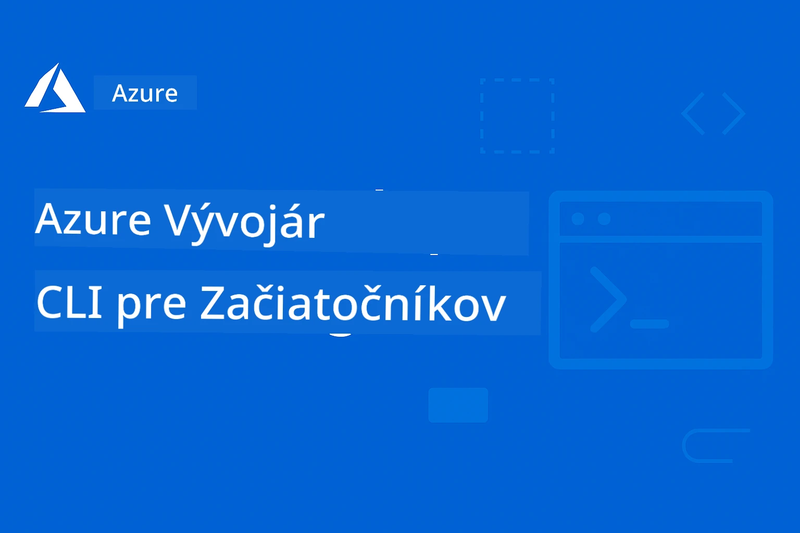

# AZD pre začiatočníkov: Štruktúrovaná učebná cesta

 

[](https://GitHub.com/microsoft/azd-for-beginners/watchers/)
[](https://GitHub.com/microsoft/azd-for-beginners/network/)
[](https://GitHub.com/microsoft/azd-for-beginners/stargazers/)

[](https://discord.com/invite/nkVh3dp)
[](https://discord.gg/nTYy5BXMWG)

---

### Automatické preklady (vždy aktuálne)

<!-- CO-OP TRANSLATOR LANGUAGES TABLE START -->
[Arabčina](../ar/README.md) | [Bengálčina](../bn/README.md) | [Bulharčina](../bg/README.md) | [Barmský (Myanmar)](../my/README.md) | [Čínština (zjednodušená)](../zh-CN/README.md) | [Čínština (tradičná, Hong Kong)](../zh-HK/README.md) | [Čínština (tradičná, Macau)](../zh-MO/README.md) | [Čínština (tradičná, Taiwan)](../zh-TW/README.md) | [Chorvátčina](../hr/README.md) | [Čeština](../cs/README.md) | [Dánčina](../da/README.md) | [Holandčina](../nl/README.md) | [Estónčina](../et/README.md) | [Fínčina](../fi/README.md) | [Francúzština](../fr/README.md) | [Nemčina](../de/README.md) | [Gréčtina](../el/README.md) | [Hebrejčina](../he/README.md) | [Hindčina](../hi/README.md) | [Maďarčina](../hu/README.md) | [Indonézština](../id/README.md) | [Taliančina](../it/README.md) | [Japončina](../ja/README.md) | [Kannadčina](../kn/README.md) | [Khmérčina](../km/README.md) | [Kórejčina](../ko/README.md) | [Litovčina](../lt/README.md) | [Malajčina](../ms/README.md) | [Malajálamčina](../ml/README.md) | [Maráthčina](../mr/README.md) | [Nepálčina](../ne/README.md) | [Nigerijský pidžin](../pcm/README.md) | [Nórčina](../no/README.md) | [Perzština (Farsi)](../fa/README.md) | [Poľština](../pl/README.md) | [Portugalčina (Brazília)](../pt-BR/README.md) | [Portugalčina (Portugalsko)](../pt-PT/README.md) | [Pandžábčina (Gurmukhi)](../pa/README.md) | [Rumunčina](../ro/README.md) | [Ruština](../ru/README.md) | [Srbčina (cyrilika)](../sr/README.md) | [Slovenčina](./README.md) | [Slovinčina](../sl/README.md) | [Španielčina](../es/README.md) | [Svahilčina](../sw/README.md) | [Švédčina](../sv/README.md) | [Tagalog (Filipíny)](../tl/README.md) | [Tamilčina](../ta/README.md) | [Telugčina](../te/README.md) | [Thajčina](../th/README.md) | [Turečtina](../tr/README.md) | [Ukrajinčina](../uk/README.md) | [Urdčina](../ur/README.md) | [Vietnamsčina](../vi/README.md)

> **Preferujete klonovanie lokálne?**
>
> Tento repozitár obsahuje viac ako 50 prekladov, čo výrazne zvyšuje veľkosť na stiahnutie. Ak chcete klonovať bez prekladov, použite sparse checkout:
>
> **Bash / macOS / Linux:**
> ```bash
> git clone --filter=blob:none --sparse https://github.com/microsoft/AZD-for-beginners.git
> cd AZD-for-beginners
> git sparse-checkout set --no-cone '/*' '!translations' '!translated_images'
> ```
>
> **CMD (Windows):**
> ```cmd
> git clone --filter=blob:none --sparse https://github.com/microsoft/AZD-for-beginners.git
> cd AZD-for-beginners
> git sparse-checkout set --no-cone "/*" "!translations" "!translated_images"
> ```
>
> Toto vám poskytne všetko, čo potrebujete na dokončenie kurzu s oveľa rýchlejším stiahnutím.
<!-- CO-OP TRANSLATOR LANGUAGES TABLE END -->

## 🆕 Čo je nové v azd dnes

Azure Developer CLI sa rozrástol za hranice tradičných webových aplikácií a API. Dnes je azd jediným nástrojom na nasadenie **ľubovoľnej** aplikácie do Azure — vrátane aplikácií s podporou AI a inteligentných agentov.

Čo to pre vás znamená:

- **AI agenti sú teraz plnohodnotné pracovné záťaže azd.** Môžete inicializovať, nasadzovať a spravovať projekty AI agentov pomocou toho istého pracovného postupu `azd init` → `azd up`, ktorý už poznáte.
- **Integrácia s Microsoft Foundry** prináša nasadzovanie modelov, hosťovanie agentov a konfiguráciu AI služieb priamo do ekosystému azd šablón.
- **Základný pracovný postup sa nezmenil.** Či už nasadzujete todo aplikáciu, mikroslužbu alebo viac-agentové AI riešenie, príkazy sú rovnaké.

Ak ste už azd používali, podpora AI je prirodzeným rozšírením — nie samostatným nástrojom alebo pokročilou špecializáciou. Ak začínate, naučíte sa jeden pracovný postup, ktorý funguje pre všetko.

---

## 🚀 Čo je Azure Developer CLI (azd)?

**Azure Developer CLI (azd)** je pre vývojárov priateľský príkazový nástroj, ktorý zjednodušuje nasadzovanie aplikácií do Azure. Namiesto manuálneho vytvárania a prepájania desiatok Azure prostriedkov môžete nasadiť celé aplikácie jediným príkazom.

### Kúzlo príkazu `azd up`

```bash
# Tento jediný príkaz robí všetko:
# ✅ Vytvorí všetky zdroje Azure
# ✅ Konfiguruje sieťovanie a zabezpečenie
# ✅ Sestaví váš aplikačný kód
# ✅ Nasadí do Azure
# ✅ Poskytne vám funkčnú URL adresu
azd up
```

**To je všetko!** Žiadne klikanie v Azure Portáli, žiadne zložité ARM šablóny, ktoré by ste sa museli najprv naučiť, žiadna manuálna konfigurácia — len funkčné aplikácie na Azure.

---

## ❓ Azure Developer CLI vs Azure CLI: Aký je rozdiel?

Toto je najčastejšia otázka, ktorú začiatočníci kladú. Tu je jednoduchá odpoveď:

| Feature | **Azure CLI (`az`)** | **Azure Developer CLI (`azd`)** |
|---------|---------------------|--------------------------------|
| **Purpose** | Spravovať jednotlivé Azure prostriedky | Nasadzovať kompletné aplikácie |
| **Mindset** | Zamerané na infraštruktúru | Zamerané na aplikáciu |
| **Example** | `az webapp create --name myapp...` | `azd up` |
| **Learning Curve** | Musíte poznať služby Azure | Stačí poznať svoju aplikáciu |
| **Best For** | DevOps, infraštruktúra | Vývojári, prototypovanie |

### Jednoduchá analógia

- **Azure CLI** je ako mať všetky nástroje na stavbu domu — kladivá, píly, nechty. Môžete postaviť čokoľvek, ale musíte vedieť, ako stavať.
- **Azure Developer CLI** je ako najatie dodávateľa — opíšete, čo chcete, a on sa postará o výstavbu.

### Kedy používať ktorý

| Scenario | Use This |
|----------|----------|
| "Chcem rýchlo nasadiť svoju webovú aplikáciu" | `azd up` |
| "Potrebujem vytvoriť len úložný účet" | `az storage account create` |
| "Staviam kompletnú AI aplikáciu" | `azd init --template azure-search-openai-demo` |
| "Potrebujem ladiť konkrétny Azure prostriedok" | `az resource show` |
| "Chcem produkčné nasadenie pripravené za minúty" | `azd up --environment production` |

### Spolu fungujú!

AZD používa Azure CLI na pozadí. Môžete používať obidve:
```bash
# Nasadzujte svoju aplikáciu pomocou AZD
azd up

# Potom dolaďte konkrétne zdroje pomocou Azure CLI
az webapp config set --name myapp --always-on true
```

---

## 🌟 Nájdite šablóny v Awesome AZD

Nemainajte od nuly! **Awesome AZD** je komunitná zbierka šablón pripravených na nasadenie:

| Resource | Description |
|----------|-------------|
| 🔗 [**Awesome AZD Gallery**](https://azure.github.io/awesome-azd/) | Prehliadajte viac ako 200 šablón s nasadením na jedno kliknutie |
| 🔗 [**Odošliť šablónu**](https://github.com/Azure/awesome-azd/issues) | Prispievajte vlastnou šablónou do komunity |
| 🔗 [**GitHub repozitár**](https://github.com/Azure/awesome-azd) | Ohodnoťte hviezdičkou a preskúmajte zdrojový kód |

### Populárne AI šablóny z Awesome AZD

```bash
# RAG chat s modelmi Microsoft Foundry + AI vyhľadávanie
azd init --template azure-search-openai-demo

# Rýchla aplikácia AI chatu
azd init --template openai-chat-app-quickstart

# AI agenti s Foundry agentmi
azd init --template get-started-with-ai-agents
```

---

## 🎯 Začíname v 3 krokoch

Pred začatím sa uistite, že váš počítač je pripravený pre šablónu, ktorú chcete nasadiť:

**Windows:**
```powershell
.\validate-setup.ps1
```

**macOS / Linux:**
```bash
bash ./validate-setup.sh
```

Ak niektorá z požadovaných kontrol zlyhá, opravte ju najprv a potom pokračujte s rýchlym začiatkom.

### Krok 1: Nainštalujte AZD (2 minúty)

**Windows:**
```powershell
winget install microsoft.azd
```

**macOS:**
```bash
brew tap azure/azd && brew install azd
```

**Linux:**
```bash
curl -fsSL https://aka.ms/install-azd.sh | bash
```

### Krok 2: Autentifikácia pre AZD

```bash
# Voliteľné, ak plánujete používať priamo príkazy Azure CLI v tomto kurze
az login

# Povinné pre AZD pracovné toky
azd auth login
```

Ak si nie ste istí, ktorý spôsob potrebujete, postupujte podľa plného nastavovacieho postupu v [Installation & Setup](docs/chapter-01-foundation/installation.md#authentication-setup).

### Krok 3: Nasadte svoju prvú aplikáciu

```bash
# Inicializovať z šablóny
azd init --template todo-nodejs-mongo

# Nasadiť do Azure (vytvára všetko!)
azd up
```

**🎉 Hotovo!** Vaša aplikácia je teraz spustená na Azure.

### Vyčistenie (nezabudnite!)

```bash
# Remove all resources when done experimenting
azd down --force --purge
```

---

## 📚 Ako používať tento kurz

Tento kurz je navrhnutý pre **postupné učenie** - začnite tam, kde sa cítite pohodlne, a postupujte ďalej:

| Your Experience | Start Here |
|-----------------|------------|
| **Úplne nový v Azure** | [Chapter 1: Foundation](#-chapter-1-foundation--quick-start) |
| **Poznáte Azure, nový v AZD** | [Chapter 1: Foundation](#-chapter-1-foundation--quick-start) |
| **Chcete nasadiť AI aplikácie** | [Chapter 2: AI-First Development](#-chapter-2-ai-first-development-recommended-for-ai-developers) |
| **Chcete praktické cvičenie** | [🎓 Interactive Workshop](workshop/README.md) - 3-4 hodinové vedené laboratórium |
| **Potrebujete produkčné vzory** | [Chapter 8: Production & Enterprise](#-chapter-8-production--enterprise-patterns) |

### Rýchle nastavenie

1. **Vytvorte fork tohto repozitára**: [](https://GitHub.com/microsoft/azd-for-beginners/fork)
2. **Klonujte tento repozitár**: `git clone https://github.com/YOUR-USERNAME/azd-for-beginners.git`
3. **Získajte pomoc**: [Komunita Azure na Discorde](https://discord.com/invite/ByRwuEEgH4)

> **Preferujete klonovanie lokálne?**

> Tento repozitár obsahuje viac ako 50 prekladov, čo výrazne zvyšuje veľkosť na stiahnutie. Ak chcete klonovať bez prekladov, použite sparse checkout:
> ```bash
> git clone --filter=blob:none --sparse https://github.com/microsoft/AZD-for-beginners.git
> cd AZD-for-beginners
> git sparse-checkout set --no-cone '/*' '!translations' '!translated_images'
> ```
> Toto vám poskytne všetko, čo potrebujete na dokončenie kurzu s oveľa rýchlejším stiahnutím.


## Prehľad kurzu

Ovládnite Azure Developer CLI (azd) prostredníctvom štruktúrovaných kapitol navrhnutých pre postupné učenie. **Špeciálny dôraz na nasadzovanie AI aplikácií s integráciou Microsoft Foundry.**

### Prečo je tento kurz nevyhnutný pre moderných vývojárov

Na základe poznatkov z komunity Microsoft Foundry na Discorde, **45% vývojárov chce používať AZD pre AI záťaže**, no stretávajú sa s problémami pri:
- Zložitých viacslužbových AI architektúrach
- Najlepších postupoch nasadenia AI do produkcie  
- Integrácii a konfigurácii Azure AI služieb
- Optimalizácii nákladov pre AI záťaže
- Riešení problémov špecifických pre nasadenie AI

### Ciele učenia

Po absolvovaní tohto štruktúrovaného kurzu budete:
- **Ovládať základy AZD**: Základné koncepty, inštalácia a konfigurácia
- **Nasadzovať AI aplikácie**: Používať AZD s Microsoft Foundry službami
- **Implementovať infraštruktúru ako kód**: Spravovať Azure prostriedky s Bicep šablónami
- **Riešiť problémy nasadení**: Odstraňovať bežné chyby a ladiť problémy
- **Optimalizovať pre produkciu**: Bezpečnosť, škálovanie, monitorovanie a riadenie nákladov
- **Stavať viac-agentové riešenia**: Nasadzovať komplexné AI architektúry

## Pred začatím: Účty, prístup a predpoklady

Pred tým, než začnete Kapitolu 1, uistite sa, že máte nasledujúce veci pripravené. Inštalačné kroky v tejto príručke predpokladajú, že tieto základy sú už zvládnuté.
- **Predplatné Azure**: Môžete použiť existujúce predplatné z práce alebo vlastný účet, alebo si vytvorte [free trial](https://aka.ms/azurefreetrial) na začiatok.
- **Povolenie na vytváranie Azure zdrojov**: Pre väčšinu cvičení by ste mali mať aspoň **Contributor** prístup k cieľovému predplatnému alebo skupine zdrojov. Niektoré kapitoly môžu tiež predpokladať, že môžete vytvárať skupiny zdrojov, managed identities a RBAC priradenia.
- [**Účet GitHub**](https://github.com): Toto je užitočné na forkovanie repozitára, sledovanie vlastných zmien a použitie GitHub Codespaces pre workshop.
- **Požiadavky na runtime šablón**: Niektoré šablóny potrebujú lokálne nástroje ako Node.js, Python, Java alebo Docker. Spustite setup validator pred začiatkom, aby ste včas odhalili chýbajúce nástroje.
- **Základná znalosť terminálu**: Nemusíte byť expert, ale mali by ste byť pohodlní so spúšťaním príkazov ako `git clone`, `azd auth login`, a `azd up`.

> **Pracujete v podnikovom predplatnom?**
> Ak je vaše Azure prostredie spravované administrátorom, potvrďte vopred, že môžete nasadzovať zdroje v predplatnom alebo skupine zdrojov, ktoré plánujete používať. Ak nie, požiadajte o sandbox predplatné alebo Contributor prístup pred začiatkom.

> **Nový v Azure?**
> Začnite s vlastným Azure trial alebo pay-as-you-go predplatným na https://aka.ms/azurefreetrial, aby ste mohli dokončiť cvičenia od začiatku do konca bez čakania na schválenia na úrovni tenanta.

## 🗺️ Mapa kurzu: Rýchla navigácia podľa kapitoly

Každá kapitola má samostatný README s učebnými cieľmi, rýchlym štartom a cvičeniami:

| Kapitola | Téma | Lekcie | Trvanie | Zložitosť |
|---------|-------|---------|----------|------------|
| **[Kap. 1: Základy](docs/chapter-01-foundation/README.md)** | Začíname | [Základy AZD](docs/chapter-01-foundation/azd-basics.md) &#124; [Inštalácia](docs/chapter-01-foundation/installation.md) &#124; [Prvý projekt](docs/chapter-01-foundation/first-project.md) | 30-45 min | ⭐ |
| **[Kap. 2: Vývoj AI](docs/chapter-02-ai-development/README.md)** | Aplikácie orientované na AI | [Integrácia Microsoft Foundry](docs/chapter-02-ai-development/microsoft-foundry-integration.md) &#124; [AI agenti](docs/chapter-02-ai-development/agents.md) &#124; [Nasadenie modelov](docs/chapter-02-ai-development/ai-model-deployment.md) &#124; [Workshop](docs/chapter-02-ai-development/ai-workshop-lab.md) | 1-2 hrs | ⭐⭐ |
| **[Kap. 3: Konfigurácia](docs/chapter-03-configuration/README.md)** | Autentifikácia & Bezpečnosť | [Konfigurácia](docs/chapter-03-configuration/configuration.md) &#124; [Autentifikácia a bezpečnosť](docs/chapter-03-configuration/authsecurity.md) | 45-60 min | ⭐⭐ |
| **[Kap. 4: Infrastruktúra](docs/chapter-04-infrastructure/README.md)** | IaC & Nasadenie | [Príručka nasadenia](docs/chapter-04-infrastructure/deployment-guide.md) &#124; [Provisioning](docs/chapter-04-infrastructure/provisioning.md) | 1-1.5 hrs | ⭐⭐⭐ |
| **[Kap. 5: Multi-Agent](docs/chapter-05-multi-agent/README.md)** | Riešenia AI agentov | [Scenár maloobchodu](examples/retail-scenario.md) &#124; [Vzory koordinácie](docs/chapter-06-pre-deployment/coordination-patterns.md) | 2-3 hrs | ⭐⭐⭐⭐ |
| **[Kap. 6: Pred nasadením](docs/chapter-06-pre-deployment/README.md)** | Plánovanie & Validácia | [Preflight Checks](docs/chapter-06-pre-deployment/preflight-checks.md) &#124; [Plánovanie kapacity](docs/chapter-06-pre-deployment/capacity-planning.md) &#124; [Výber SKU](docs/chapter-06-pre-deployment/sku-selection.md) &#124; [App Insights](docs/chapter-06-pre-deployment/application-insights.md) | 1 hr | ⭐⭐ |
| **[Kap. 7: Riešenie problémov](docs/chapter-07-troubleshooting/README.md)** | Ladenie & Oprava | [Bežné problémy](docs/chapter-07-troubleshooting/common-issues.md) &#124; [Ladenie](docs/chapter-07-troubleshooting/debugging.md) &#124; [AI problémy](docs/chapter-07-troubleshooting/ai-troubleshooting.md) | 1-1.5 hrs | ⭐⭐ |
| **[Kap. 8: Produkcia](docs/chapter-08-production/README.md)** | Podnikové vzory | [Produkčné postupy](docs/chapter-08-production/production-ai-practices.md) | 2-3 hrs | ⭐⭐⭐⭐ |
| **[🎓 Workshop](workshop/README.md)** | Praktické cvičenie | [Úvod](workshop/docs/instructions/0-Introduction.md) &#124; [Výber](workshop/docs/instructions/1-Select-AI-Template.md) &#124; [Validácia](workshop/docs/instructions/2-Validate-AI-Template.md) &#124; [Rozobratie](workshop/docs/instructions/3-Deconstruct-AI-Template.md) &#124; [Konfigurácia](workshop/docs/instructions/4-Configure-AI-Template.md) &#124; [Prispôsobenie](workshop/docs/instructions/5-Customize-AI-Template.md) &#124; [Deaktivácia infraštruktúry](workshop/docs/instructions/6-Teardown-Infrastructure.md) &#124; [Zhrnutie](workshop/docs/instructions/7-Wrap-up.md) | 3-4 hrs | ⭐⭐ |

**Celkové trvanie kurzu:** ~10-14 hodín | **Progres zručností:** Začiatočník → Produkčne pripravený

---

## 📚 Učebné kapitoly

*Vyberte si kurz podľa úrovne skúseností a cieľov*

### 🚀 Kap. 1: Základy & Rýchly štart
**Predpoklady**: Predplatné Azure, základné znalosti príkazového riadka  
**Trvanie**: 30-45 minút  
**Zložitosť**: ⭐

#### Čo sa naučíte
- Pochopenie základov Azure Developer CLI
- Inštalácia AZD na vašej platforme
- Vaše prvé úspešné nasadenie

#### Vzdelávacie zdroje
- **🎯 Začnite tu**: [Čo je Azure Developer CLI?](#what-is-azure-developer-cli)
- **📖 Teória**: [Základy AZD](docs/chapter-01-foundation/azd-basics.md) - Hlavné koncepty a terminológia
- **⚙️ Nastavenie**: [Inštalácia & Nastavenie](docs/chapter-01-foundation/installation.md) - Príručky špecifické pre platformu
- **🛠️ Prakticky**: [Váš prvý projekt](docs/chapter-01-foundation/first-project.md) - Krok za krokom tutoriál
- **📋 Rýchla referencia**: [Command Cheat Sheet](resources/cheat-sheet.md)

#### Praktické cvičenia
```bash
# Rýchla kontrola inštalácie
azd version

# Nasadiť svoju prvú aplikáciu
azd init --template todo-nodejs-mongo
azd up
```

**💡 Výsledok kapitoly**: Úspešne nasadiť jednoduchú webovú aplikáciu do Azure pomocou AZD

**✅ Overenie úspechu:**
```bash
# Po dokončení kapitoly 1 by ste mali byť schopní:
azd version              # Zobrazuje nainštalovanú verziu
azd init --template todo-nodejs-mongo  # Inicializuje projekt
azd up                  # Nasadí do Azure
azd show                # Zobrazuje URL bežiacej aplikácie
# Aplikácia sa otvorí v prehliadači a funguje
azd down --force --purge  # Vyčistí zdroje
```

**📊 Časová náročnosť:** 30-45 minút  
**📈 Úroveň zručností po:** Dokáže nasadiť základné aplikácie samostatne  
**📈 Úroveň zručností po:** Dokáže nasadiť základné aplikácie samostatne

---

### 🤖 Kap. 2: Vývoj orientovaný na AI (Odporúčané pre AI vývojárov)
**Predpoklady**: Kapitola 1 dokončená  
**Trvanie**: 1-2 hodiny  
**Zložitosť**: ⭐⭐

#### Čo sa naučíte
- Integrácia Microsoft Foundry s AZD
- Nasadzovanie aplikácií poháňaných AI
- Pochopenie konfigurácií AI služieb

#### Vzdelávacie zdroje
- **🎯 Začnite tu**: [Integrácia Microsoft Foundry](docs/chapter-02-ai-development/microsoft-foundry-integration.md)
- **🤖 AI agenti**: [Sprievodca AI agentmi](docs/chapter-02-ai-development/agents.md) - Nasadzovanie inteligentných agentov s AZD
- **📖 Vzory**: [Nasadenie AI modelov](docs/chapter-02-ai-development/ai-model-deployment.md) - Nasadiť a spravovať AI modely
- **🛠️ Workshop**: [AI Workshop Lab](docs/chapter-02-ai-development/ai-workshop-lab.md) - Pripravte svoje AI riešenia pre AZD
- **🎥 Interaktívny sprievodca**: [Materiály workshopu](workshop/README.md) - Učenie v prehliadači s MkDocs * DevContainer prostredím
- **📋 Šablóny**: [Microsoft Foundry Templates](#zdroje-workshopu)
- **📝 Príklady**: [Príklady nasadenia AZD](examples/README.md)

#### Praktické cvičenia
```bash
# Nasadiť svoju prvú AI aplikáciu
azd init --template azure-search-openai-demo
azd up

# Vyskúšať ďalšie AI šablóny
azd init --template openai-chat-app-quickstart
azd init --template agent-openai-python-prompty
```

**💡 Výsledok kapitoly**: Nasadiť a nakonfigurovať chatovaciu aplikáciu poháňanú AI s RAG schopnosťami

**✅ Overenie úspechu:**
```bash
# Po kapitole 2 by ste mali byť schopní:
azd init --template azure-search-openai-demo
azd up
# Otestovať rozhranie chatu s AI
# Klásť otázky a dostávať odpovede generované AI s uvedenými zdrojmi
# Overiť, že integrácia vyhľadávania funguje
azd monitor  # Skontrolovať, že Application Insights zobrazuje telemetriu
azd down --force --purge
```

**📊 Časová náročnosť:** 1-2 hodiny  
**📈 Úroveň zručností po:** Dokáže nasadiť a nakonfigurovať produkčne pripravené AI aplikácie  
**💰 Povedomie o nákladoch:** Pochopiť náklady na vývoj $80-150/mesiac, produkčné náklady $300-3500/mesiac

#### 💰 Úvahy o nákladoch pre AI nasadenia

**Vývojové prostredie (odhad $80-150/mesiac):**
- Microsoft Foundry Models (Pay-as-you-go): $0-50/mesiac (na základe spotreby tokenov)
- AI Search (základná úroveň): $75/mesiac
- Container Apps (Consumption): $0-20/mesiac
- Ukladanie (Standard): $1-5/mesiac

**Produkčné prostredie (odhad $300-3,500+/mesiac):**
- Microsoft Foundry Models (PTU pre konzistentný výkon): $3,000+/mesiac ALEBO Pay-as-go pri veľkom objeme
- AI Search (štandardná úroveň): $250/mesiac
- Container Apps (dedikované): $50-100/mesiac
- Application Insights: $5-50/mesiac
- Ukladanie (Premium): $10-50/mesiac

**💡 Tipy na optimalizáciu nákladov:**
- Použite **Free Tier** Microsoft Foundry Models na učenie (Azure OpenAI 50,000 tokenov/mesiac zahrnuté)
- Spúšťajte `azd down` na de-alokáciu zdrojov, keď aktívne nevyvíjate
- Začnite s billingom založeným na spotrebe, PTU zapnite len pre produkciu
- Použite `azd provision --preview` na odhad nákladov pred nasadením
- Zapnite auto-scaling: platíte len za skutočné využitie

**Sledovanie nákladov:**
```bash
# Skontrolujte odhadované mesačné náklady
azd provision --preview

# Sledujte skutočné náklady v Azure portáli
az consumption budget list --resource-group <your-rg>
```

---

### ⚙️ Kap. 3: Konfigurácia & Autentifikácia
**Predpoklady**: Kapitola 1 dokončená  
**Trvanie**: 45-60 minút  
**Zložitosť**: ⭐⭐

#### Čo sa naučíte
- Konfigurácia a správa prostredí
- Najlepšie postupy pre autentifikáciu a bezpečnosť
- Názvoslovie a organizácia zdrojov

#### Vzdelávacie zdroje
- **📖 Konfigurácia**: [Príručka konfigurácie](docs/chapter-03-configuration/configuration.md) - Nastavenie prostredia
- **🔐 Bezpečnosť**: [Autentifikačné vzory a managed identity](docs/chapter-03-configuration/authsecurity.md) - Autentifikačné vzory
- **📝 Príklady**: [Príklad databázovej aplikácie](examples/database-app/README.md) - AZD databázové príklady

#### Praktické cvičenia
- Nakonfigurujte viacero prostredí (dev, staging, prod)
- Nastavte autentifikáciu s managed identity
- Implementujte konfigurácie špecifické pre prostredie

**💡 Výsledok kapitoly**: Spravovať viacero prostredí s riadnou autentifikáciou a bezpečnosťou

---

### 🏗️ Kap. 4: Infrastruktúra ako kód & Nasadenie
**Predpoklady**: Kapitoly 1-3 dokončené  
**Trvanie**: 1-1.5 hodiny  
**Zložitosť**: ⭐⭐⭐

#### Čo sa naučíte
- Pokročilé vzory nasadzovania
- Infrastruktúra ako kód s Bicep
- Stratégie provisioning-u zdrojov

#### Vzdelávacie zdroje
- **📖 Nasadenie**: [Príručka nasadenia](docs/chapter-04-infrastructure/deployment-guide.md) - Kompletné workflowy
- **🏗️ Provisioning**: [Provisioning zdrojov](docs/chapter-04-infrastructure/provisioning.md) - Správa Azure zdrojov
- **📝 Príklady**: [Príklad Container App](../../examples/container-app) - Nasadenia v kontajneroch

#### Praktické cvičenia
- Vytvorte vlastné Bicep šablóny
- Nasadte multi-service aplikácie
- Implementujte blue-green deployment stratégie

**💡 Výsledok kapitoly**: Nasadiť komplexné multi-service aplikácie za použitia vlastných infraštruktúrnych šablón

---

### 🎯 Kap. 5: Viacagentové AI riešenia (Pokročilé)
**Predpoklady**: Kapitoly 1-2 dokončené  
**Trvanie**: 2-3 hodiny  
**Zložitosť**: ⭐⭐⭐⭐

#### Čo sa naučíte
- Vzory architektúry viacagentových systémov
- Orchestration a koordinácia agentov
- Produkčné nasadenia AI

#### Vzdelávacie zdroje
- **🤖 Zobrazený projekt**: [Riešenie multi-agent pre maloobchod](examples/retail-scenario.md) - Kompletná implementácia
- **🛠️ ARM šablóny**: [Balík ARM šablón](../../examples/retail-multiagent-arm-template) - Nasadenie jedným klikom
- **📖 Architektúra**: [Vzory koordinácie multi-agentov](docs/chapter-06-pre-deployment/coordination-patterns.md) - Vzory

#### Praktické cvičenia
```bash
# Nasadiť kompletné maloobchodné riešenie s viacerými agentmi
cd examples/retail-multiagent-arm-template
./deploy.sh

# Preskúmať konfigurácie agentov
az deployment group show --resource-group <rg-name> --name <deployment-name>
```

**💡 Výsledok kapitoly**: Nasadiť a spravovať produkčne pripravené multi-agent AI riešenie s agentmi pre zákazníka a inventár

---

### 🔍 Kap. 6: Validácia & Plánovanie pred nasadením
**Predpoklady**: Kapitola 4 dokončená  
**Trvanie**: 1 hodina  
**Zložitosť**: ⭐⭐
#### Čo sa naučíte
- Plánovanie kapacity a overenie zdrojov
- Stratégie výberu SKU
- Predletové kontroly a automatizácia

#### Vzdelávacie zdroje
- **📊 Plánovanie**: [Capacity Planning](docs/chapter-06-pre-deployment/capacity-planning.md) - Overenie zdrojov
- **💰 Výber**: [SKU Selection](docs/chapter-06-pre-deployment/sku-selection.md) - Nákladovo efektívne voľby
- **✅ Overenie**: [Pre-flight Checks](docs/chapter-06-pre-deployment/preflight-checks.md) - Automatizované skripty

#### Praktické cvičenia
- Spustite skripty na overenie kapacity
- Optimalizujte výber SKU z hľadiska nákladov
- Implementujte automatizované predbežné kontroly nasadenia

**💡 Výsledok kapitoly**: Overiť a optimalizovať nasadenia pred ich vykonaním

---

### 🚨 Kapitola 7: Riešenie problémov a ladenie
**Predpoklady**: Dokončená ľubovoľná kapitola o nasadení  
**Trvanie**: 1-1,5 hodiny  
**Zložitosť**: ⭐⭐

#### Čo sa naučíte
- Systematické prístupy k ladenie
- Bežné problémy a riešenia
- Riešenie problémov špecifických pre AI

#### Vzdelávacie zdroje
- **🔧 Bežné problémy**: [Common Issues](docs/chapter-07-troubleshooting/common-issues.md) - FAQ a riešenia
- **🕵️ Ladenie**: [Debugging Guide](docs/chapter-07-troubleshooting/debugging.md) - Krok za krokom stratégie
- **🤖 AI problémy**: [AI-Specific Troubleshooting](docs/chapter-07-troubleshooting/ai-troubleshooting.md) - Problémy AI služieb

#### Praktické cvičenia
- Diagnostikujte zlyhania nasadenia
- Riešte problémy s autentifikáciou
- Ladenie konektivity AI služieb

**💡 Výsledok kapitoly**: Samostatne diagnostikovať a riešiť bežné problémy nasadenia

---

### 🏢 Kapitola 8: Produkčné a podnikové vzory
**Predpoklady**: Dokončené kapitoly 1-4  
**Trvanie**: 2-3 hodiny  
**Zložitosť**: ⭐⭐⭐⭐

#### Čo sa naučíte
- Stratégie produkčného nasadenia
- Podnikové bezpečnostné vzory
- Monitorovanie a optimalizácia nákladov

#### Vzdelávacie zdroje
- **🏭 Produkcia**: [Production AI Best Practices](docs/chapter-08-production/production-ai-practices.md) - Podnikové vzory
- **📝 Príklady**: [Microservices Example](../../examples/microservices) - Zložité architektúry
- **📊 Monitorovanie**: [Application Insights integration](docs/chapter-06-pre-deployment/application-insights.md) - Monitorovanie

#### Praktické cvičenia
- Implementujte podnikové bezpečnostné vzory
- Nastavte komplexné monitorovanie
- Nasadzujte do produkcie s riadnou správou

**💡 Výsledok kapitoly**: Nasadiť aplikácie pripravené pre podnikové prostredie s plnou produkčnou kapacitou

---

## 🎓 Prehľad workshopu: Praktické učenie

> **⚠️ STAV WORKSHOPU: Aktívny vývoj**  
> Materiály workshopu sa momentálne vyvíjajú a zdokonaľujú. Základné moduly fungujú, ale niektoré pokročilé časti sú neúplné. Aktívne pracujeme na dokončení všetkého obsahu. [Sleduj priebeh →](workshop/README.md)

### Interaktívne materiály workshopu
**Komplexné praktické učenie s nástrojmi v prehliadači a vedenými cvičeniami**

Materiály workshopu poskytujú štruktúrovaný, interaktívny zážitok z učenia, ktorý dopĺňa vyššie uvedené kapitoly. Workshop je navrhnutý pre samostatné štúdium aj vedené lekcie.

#### 🛠️ Funkcie workshopu
- **Rozhranie v prehliadači**: Kompletný workshop poháňaný MkDocs s vyhľadávaním, kopírovaním a témami
- **Integrácia GitHub Codespaces**: Jedno-klikové nastavenie vývojového prostredia
- **Štruktúrovaná cesta učenia**: 8-modulové vedené cvičenia (3-4 hodiny celkom)
- **Progresívna metodológia**: Úvod → Výber → Overenie → Dekonštrukcia → Konfigurácia → Prispôsobenie → Ukončenie → Zhrnutie
- **Interaktívne DevContainer prostredie**: Predkonfigurované nástroje a závislosti

#### 📚 Štruktúra modulov workshopu
Workshop nasleduje **8-modulovú progresívnu metodológiu**, ktorá vás prevedie od objavovania po ovládnutie nasadenia:

| Module | Topic | What You'll Do | Duration |
|--------|-------|----------------|----------|
| **0. Introduction** | Workshop Overview | Understand learning objectives, prerequisites, and workshop structure | 15 min |
| **1. Selection** | Template Discovery | Explore AZD templates and select the right AI template for your scenario | 20 min |
| **2. Validation** | Deploy & Verify | Deploy the template with `azd up` and validate infrastructure works | 30 min |
| **3. Deconstruction** | Understand Structure | Use GitHub Copilot to explore template architecture, Bicep files, and code organization | 30 min |
| **4. Configuration** | azure.yaml Deep Dive | Master `azure.yaml` configuration, lifecycle hooks, and environment variables | 30 min |
| **5. Customization** | Make It Yours | Enable AI Search, tracing, evaluation, and customize for your scenario | 45 min |
| **6. Teardown** | Clean Up | Safely deprovision resources with `azd down --purge` | 15 min |
| **7. Wrap-up** | Next Steps | Review accomplishments, key concepts, and continue your learning journey | 15 min |

**Priebeh workshopu:**
```
Introduction → Selection → Validation → Deconstruction → Configuration → Customization → Teardown → Wrap-up
     ↓            ↓           ↓              ↓               ↓              ↓            ↓           ↓
  Overview    Find the     Deploy &      Explore        Master         Customize     Clean up    Review &
             right        verify        code &        azure.yaml      for your      resources   next steps
             template                   structure                     scenario
```

#### 🚀 Začíname s workshopom
```bash
# Možnosť 1: GitHub Codespaces (Odporúčané)
# Kliknite na "Code" → "Create codespace on main" v repozitári

# Možnosť 2: Lokálny vývoj
git clone https://github.com/microsoft/azd-for-beginners.git
cd azd-for-beginners/workshop
# Postupujte podľa inštrukcií na nastavenie v súbore workshop/README.md
```

#### 🎯 Výsledky učenia workshopu
Po dokončení workshopu budú účastníci:
- **Nasadiť produkčné AI aplikácie**: Použiť AZD s Microsoft Foundry službami
- **Ovládnuť architektúry s viacerými agentmi**: Implementovať koordinované riešenia AI agentov
- **Implementovať bezpečnostné postupy**: Konfigurovať autentifikáciu a správu prístupu
- **Optimalizovať pre škálovateľnosť**: Navrhovať nákladovo efektívne, výkonné nasadenia
- **Riešiť problémy nasadení**: Samostatne riešiť bežné problémy

#### 📖 Zdroje workshopu
- **🎥 Interaktívny sprievodca**: [Workshop Materials](workshop/README.md) - Prostredie učenia v prehliadači
- **📋 Pokyny modul po module**:
  - [0. Introduction](workshop/docs/instructions/0-Introduction.md) - Prehľad workshopu a ciele
  - [1. Selection](workshop/docs/instructions/1-Select-AI-Template.md) - Nájdenie a výber AI šablón
  - [2. Validation](workshop/docs/instructions/2-Validate-AI-Template.md) - Nasadenie a overenie šablón
  - [3. Deconstruction](workshop/docs/instructions/3-Deconstruct-AI-Template.md) - Preskúmanie architektúry šablón
  - [4. Configuration](workshop/docs/instructions/4-Configure-AI-Template.md) - Ovládnutie azure.yaml
  - [5. Customization](workshop/docs/instructions/5-Customize-AI-Template.md) - Prispôsobenie pre váš scenár
  - [6. Teardown](workshop/docs/instructions/6-Teardown-Infrastructure.md) - Vyčistenie zdrojov
  - [7. Wrap-up](workshop/docs/instructions/7-Wrap-up.md) - Zhrnutie a ďalšie kroky
- **🛠️ AI Workshop Lab**: [AI Workshop Lab](docs/chapter-02-ai-development/ai-workshop-lab.md) - Cvičenia zamerané na AI
- **💡 Rýchly štart**: [Workshop Setup Guide](workshop/README.md#quick-start) - Konfigurácia prostredia

**Ideálne pre**: Firemné školenia, univerzitné kurzy, samostatné štúdium a bootcampy pre vývojárov.

---

## 📖 Hlboký ponor: Možnosti AZD

Nad rámec základov poskytuje AZD silné funkcie pre produkčné nasadenia:

- **Nasadenia založené na šablónach** - Použite predpripravené šablóny pre bežné aplikačné vzory
- **Infrastruktúra ako kód** - Spravujte Azure zdroje pomocou Bicep alebo Terraformu  
- **Integrované pracovné postupy** - Bezproblémovo provisionujte, nasadzujte a monitorujte aplikácie
- **Priateľské pre vývojárov** - Optimalizované pre produktivitu a skúsenosť vývojára

### **AZD + Microsoft Foundry: Ideálne pre AI nasadenia**

**Prečo AZD pre AI riešenia?** AZD rieši hlavné výzvy, ktorým čelia AI vývojári:

- **Šablóny pripravené pre AI** - Predkonfigurované šablóny pre Microsoft Foundry Models, Cognitive Services a ML záťaže
- **Bezpečné AI nasadenia** - Vstavané bezpečnostné vzory pre AI služby, API kľúče a koncové body modelov  
- **Produkčné AI vzory** - Najlepšie postupy pre škálovateľné, nákladovo efektívne nasadenia AI aplikácií
- **End-to-End AI pracovné postupy** - Od vývoja modelu po produkčné nasadenie s riadnym monitorovaním
- **Optimalizácia nákladov** - Inteligentné prideľovanie zdrojov a stratégie škálovania pre AI záťaže
- **Integrácia Microsoft Foundry** - Bezproblémové prepojenie na katalóg modelov Microsoft Foundry a koncové body

---

## 🎯 Knižnica šablón a príkladov

### Odporúčané: šablóny Microsoft Foundry
**Začnite tu, ak nasadzujete AI aplikácie!**

> **Poznámka:** Tieto šablóny demonštrujú rôzne AI vzory. Niektoré sú externé Azure Samples, iné sú lokálne implementácie.

| Template | Chapter | Complexity | Services | Type |
|----------|---------|------------|----------|------|
| [**Get started with AI chat**](https://github.com/Azure-Samples/get-started-with-ai-chat) | Kapitola 2 | ⭐⭐ | AzureOpenAI + Azure AI Model Inference API + Azure AI Search + Azure Container Apps + Application Insights | Externé |
| [**Get started with AI agents**](https://github.com/Azure-Samples/get-started-with-ai-agents) | Kapitola 2 | ⭐⭐ | Foundry Agents + AzureOpenAI + Azure AI Search + Azure Container Apps + Application Insights| Externé |
| [**Azure Search + OpenAI Demo**](https://github.com/Azure-Samples/azure-search-openai-demo) | Kapitola 2 | ⭐⭐ | AzureOpenAI + Azure AI Search + App Service + Storage | Externé |
| [**OpenAI Chat App Quickstart**](https://github.com/Azure-Samples/openai-chat-app-quickstart) | Kapitola 2 | ⭐ | AzureOpenAI + Container Apps + Application Insights | Externé |
| [**Agent OpenAI Python Prompty**](https://github.com/Azure-Samples/agent-openai-python-prompty) | Kapitola 5 | ⭐⭐⭐ | AzureOpenAI + Azure Functions + Prompty | Externé |
| [**Contoso Chat RAG**](https://github.com/Azure-Samples/contoso-chat) | Kapitola 8 | ⭐⭐⭐⭐ | AzureOpenAI + AI Search + Cosmos DB + Container Apps | Externé |
| [**Retail Multi-Agent Solution**](examples/retail-scenario.md) | Kapitola 5 | ⭐⭐⭐⭐ | AzureOpenAI + AI Search + Storage + Container Apps + Cosmos DB | **Lokálne** |

### Odporúčané: Kompletné výukové scenáre
**Produkčné šablóny aplikácií mapované na výukové kapitoly**

| Template | Learning Chapter | Complexity | Key Learning |
|----------|------------------|------------|--------------|
| [**openai-chat-app-quickstart**](https://github.com/Azure-Samples/openai-chat-app-quickstart) | Kapitola 2 | ⭐ | Základné vzory nasadenia AI |
| [**azure-search-openai-demo**](https://github.com/Azure-Samples/azure-search-openai-demo) | Kapitola 2 | ⭐⭐ | Implementácia RAG s Azure AI Search |
| [**ai-document-processing**](https://github.com/Azure-Samples/ai-document-processing) | Kapitola 4 | ⭐⭐ | Integrácia Document Intelligence |
| [**agent-openai-python-prompty**](https://github.com/Azure-Samples/agent-openai-python-prompty) | Kapitola 5 | ⭐⭐⭐ | Rámec agentov a volanie funkcií |
| [**contoso-chat**](https://github.com/Azure-Samples/contoso-chat) | Kapitola 8 | ⭐⭐⭐ | Podniková orchestrácia AI |
| [**retail-multi-agent-solution**](examples/retail-scenario.md) | Kapitola 5 | ⭐⭐⭐⭐ | Architektúra s viacerými agentmi - zákazník a inventár |

### Učenie sa na príkladoch podľa typu

> **📌 Lokálne vs. Externé príklady:**  
> **Lokálne príklady** (v tomto repozitári) = Ihneď pripravené na použitie  
> **Externé príklady** (Azure Samples) = Klonovať z prepojených repozitárov

#### Lokálne príklady (Pripravené na použitie)
- [**Retail Multi-Agent Solution**](examples/retail-scenario.md) - Kompletná produkčná implementácia s ARM šablónami
  - Architektúra s viacerými agentmi (zákazník + inventár)
  - Komplexné monitorovanie a hodnotenie
  - Jedno-klikové nasadenie cez ARM šablónu

#### Lokálne príklady - Kontajnerové aplikácie (kapitoly 2-5)
**Komplexné príklady nasadenia kontajnerov v tomto repozitári:**
- [**Container App Examples**](examples/container-app/README.md) - Kompletný sprievodca kontajnerizovanými nasadeniami
  - [Simple Flask API](../../examples/container-app/simple-flask-api) - Základné REST API s scale-to-zero
  - [Microservices Architecture](../../examples/container-app/microservices) - Produkčné viacslužbové nasadenie
  - Rýchly štart, Produkcia a Pokročilé vzory nasadenia
  - Monitorovanie, bezpečnosť a usmernenia na optimalizáciu nákladov

#### Externé príklady - Jednoduché aplikácie (kapitoly 1-2)
**Naklonujte tieto Azure Samples repozitáre, aby ste začali:**
- [Simple Web App - Node.js + MongoDB](https://github.com/Azure-Samples/todo-nodejs-mongo) - Základné vzory nasadenia
- [Static Website - React SPA](https://github.com/Azure-Samples/todo-csharp-sql-swa-func) - Nasadenie statického obsahu
- [Container App - Python Flask](https://github.com/Azure-Samples/container-apps-store-api-microservice) - Nasadenie REST API

#### Externé príklady - Integrácia databázy (kapitola 3-4)
- [Databázová aplikácia - C# + SQL](https://github.com/Azure-Samples/todo-csharp-sql) - Vzory pripojenia k databáze
- [Funkcie + Cosmos DB](https://github.com/Azure-Samples/todo-python-mongo-swa-func) - Bezserverový pracovný tok s dátami

#### Externé príklady - Pokročilé vzory (kapitoly 4-8)
- [Java Microservices](https://github.com/Azure-Samples/java-microservices-aca-lab) - Architektúry viacerých služieb
- [Container Apps Jobs](https://github.com/Azure-Samples/container-apps-jobs) - Spracovanie na pozadí  
- [Enterprise ML Pipeline](https://github.com/Azure-Samples/mlops-v2) - Produkčné vzory pre ML

### Externé zbierky šablón
- [**Oficiálna galéria šablón AZD**](https://azure.github.io/awesome-azd/) - Kurátorská kolekcia oficiálnych a komunitných šablón
- [**Šablóny Azure Developer CLI**](https://learn.microsoft.com/en-us/azure/developer/azure-developer-cli/azd-templates) - Dokumentácia šablón Microsoft Learn
- [**Adresár príkladov**](examples/README.md) - Lokálne príklady na učenie s podrobnými vysvetleniami

---

## 📚 Vzdelávacie zdroje a odkazy

### Rýchle odkazy
- [**Skrátená príručka príkazov**](resources/cheat-sheet.md) - Základné príkazy azd usporiadané podľa kapitoly
- [**Glosár**](resources/glossary.md) - Terminológia Azure a azd  
- [**FAQ**](resources/faq.md) - Bežné otázky usporiadané podľa kapitoly na učenie
- [**Študijný sprievodca**](resources/study-guide.md) - Komplexné cvičenia

### Praktické workshopy
- [**AI Workshop Laboratórium**](docs/chapter-02-ai-development/ai-workshop-lab.md) - Urobte svoje AI riešenia nasaditeľnými pomocou AZD (2-3 hodiny)
- [**Interaktívny workshop**](workshop/README.md) - 8-modulové riadené cvičenia s MkDocs a GitHub Codespaces
  - Nasleduje: Úvod → Výber → Overenie → Rozobratie → Konfigurácia → Prispôsobenie → Vyčistenie → Zhrnutie

### Externé vzdelávacie zdroje
- [Azure Developer CLI Documentation](https://learn.microsoft.com/en-us/azure/developer/azure-developer-cli/)
- [Azure Architecture Center](https://learn.microsoft.com/en-us/azure/architecture/)
- [Azure Pricing Calculator](https://azure.microsoft.com/pricing/calculator/)
- [Azure Status](https://status.azure.com/)

### Zručnosti AI agenta pre váš editor
- [**Microsoft Azure Skills on skills.sh**](https://skills.sh/microsoft/github-copilot-for-azure) - 37 otvorených zručností agenta pre Azure AI, Foundry, nasadzovanie, diagnostiku, optimalizáciu nákladov a ďalšie. Nainštalujte ich do GitHub Copilot, Cursor, Claude Code alebo akéhokoľvek podporovaného agenta:
  ```bash
  npx skills add microsoft/github-copilot-for-azure
  ```

---

## 🔧 Rýchly sprievodca riešením problémov

**Bežné problémy, s ktorými sa začiatočníci stretávajú, a okamžité riešenia:**

<details>
<summary><strong>❌ "azd: command not found"</strong></summary>

```bash
# Nainštalujte najprv AZD
# Windows (PowerShell):
winget install microsoft.azd

# macOS:
brew tap azure/azd && brew install azd

# Linux:
curl -fsSL https://aka.ms/install-azd.sh | bash

# Overte inštaláciu
azd version
```
</details>

<details>
<summary><strong>❌ "No subscription found" or "Subscription not set"</strong></summary>

```bash
# Zoznam dostupných predplatných
az account list --output table

# Nastaviť predvolené predplatné
az account set --subscription "<subscription-id-or-name>"

# Nastaviť pre prostredie AZD
azd env set AZURE_SUBSCRIPTION_ID "<subscription-id>"

# Overiť
az account show
```
</details>

<details>
<summary><strong>❌ "InsufficientQuota" or "Quota exceeded"</strong></summary>

```bash
# Vyskúšajte inú oblasť Azure
azd env set AZURE_LOCATION "westus2"
azd up

# Alebo použite menšie SKU pri vývoji
# Upravte infra/main.parameters.json:
{
  "sku": "B1"  // Instead of "P1V2"
}
```
</details>

<details>
<summary><strong>❌ "azd up" fails halfway through</strong></summary>

```bash
# Možnosť 1: Vyčistiť a skúsiť znova
azd down --force --purge
azd up

# Možnosť 2: Len opraviť infraštruktúru
azd provision

# Možnosť 3: Skontrolovať podrobný stav
azd show

# Možnosť 4: Skontrolovať záznamy v Azure Monitori
azd monitor --logs
```
</details>

<details>
<summary><strong>❌ "Authentication failed" or "Token expired"</strong></summary>

```bash
# Znovu overiť autentifikáciu pre AZD
azd auth logout
azd auth login

# Voliteľné: obnoviť aj Azure CLI, ak spúšťate príkazy az
az logout
az login

# Overiť autentifikáciu
az account show
```
</details>

<details>
<summary><strong>❌ "Resource already exists" or naming conflicts</strong></summary>

```bash
# AZD generuje jedinečné mená, ale ak nastane konflikt:
azd down --force --purge

# Potom skúste znova s novým prostredím
azd env new dev-v2
azd up
```
</details>

<details>
<summary><strong>❌ Template deployment taking too long</strong></summary>

**Bežné časy čakania:**
- Jednoduchá webová aplikácia: 5-10 minút
- Aplikácia s databázou: 10-15 minút
- AI aplikácie: 15-25 minút (provízia OpenAI je pomalá)

```bash
# Skontrolovať priebeh
azd show

# Ak ste zaseknutí viac ako 30 minút, skontrolujte Azure Portal:
azd monitor --overview
# Vyhľadajte zlyhané nasadenia
```
</details>

<details>
<summary><strong>❌ "Permission denied" or "Forbidden"</strong></summary>

```bash
# Skontrolujte svoju rolu v Azure
az role assignment list --assignee $(az account show --query user.name -o tsv)

# Potrebujete aspoň rolu "Contributor"
# Požiadajte svojho správcu Azure, aby udelil:
# - Contributor (pre zdroje)
# - User Access Administrator (pre priradenia rolí)
```
</details>

<details>
<summary><strong>❌ Can't find deployed application URL</strong></summary>

```bash
# Zobrazte všetky koncové body služieb
azd show

# Alebo otvorte Azure Portal
azd monitor

# Skontrolujte konkrétnu službu
azd env get-values
# Hľadajte premenné *_URL
```
</details>

### 📚 Kompletné zdroje na riešenie problémov

- **Sprievodca bežnými problémami:** [Podrobné riešenia](docs/chapter-07-troubleshooting/common-issues.md)
- **Problémy špecifické pre AI:** [Riešenie problémov AI](docs/chapter-07-troubleshooting/ai-troubleshooting.md)
- **Sprievodca ladením:** [Krok za krokom: ladenie](docs/chapter-07-troubleshooting/debugging.md)
- **Získajte pomoc:** [Azure Discord](https://discord.gg/microsoft-azure) #azure-developer-cli

---

## 🎓 Dokončenie kurzu & Certifikácia

### Sledovanie pokroku
Sledujte svoj pokrok v učení cez každú kapitolu:

- [ ] **Kapitola 1**: Základy a rýchly štart ✅
- [ ] **Kapitola 2**: Vývoj orientovaný na AI ✅  
- [ ] **Kapitola 3**: Konfigurácia a overovanie ✅
- [ ] **Kapitola 4**: Infrastruktúra ako kód & Nasadzovanie ✅
- [ ] **Kapitola 5**: Viacagentové AI riešenia ✅
- [ ] **Kapitola 6**: Validácia a plánovanie pred nasadením ✅
- [ ] **Kapitola 7**: Riešenie problémov a ladenie ✅
- [ ] **Kapitola 8**: Produkčné a podnikové vzory ✅

### Overenie učenia
Po dokončení každej kapitoly overte svoje vedomosti:
1. **Praktické cvičenie**: Dokončite praktické nasadenie kapitoly
2. **Overenie znalostí**: Prejdite sekciu FAQ pre vašu kapitolu
3. **Diskusia v komunite**: Zdieľajte svoje skúsenosti v Azure Discord
4. **Ďalšia kapitola**: Pokračujte na ďalšiu úroveň zložitosti

### Výhody po dokončení kurzu
Po dokončení všetkých kapitol získate:
- **Skúsenosti s produkciou**: Nasadili ste reálne AI aplikácie do Azure
- **Profesionálne zručnosti**: Schopnosti nasadzovania pripravené pre podniky  
- **Uznanie v komunite**: Aktívny člen Azure vývojárskej komunity
- **Kariérny postup**: Žiadané zručnosti v AZD a nasadzovaní AI

---

## 🤝 Komunita a podpora

### Získajte pomoc a podporu
- **Technické problémy**: [Nahlásiť chyby a požiadať o funkcie](https://github.com/microsoft/azd-for-beginners/issues)
- **Otázky týkajúce sa učenia**: [Komunita Microsoft Azure na Discorde](https://discord.gg/microsoft-azure) a [](https://discord.gg/nTYy5BXMWG)
- **Pomoc špecifická pre AI**: Pridajte sa k [](https://discord.gg/nTYy5BXMWG)
- **Dokumentácia**: [Oficiálna dokumentácia Azure Developer CLI](https://learn.microsoft.com/en-us/azure/developer/azure-developer-cli/)

### Prehľady komunity z Microsoft Foundry Discordu

**Nedávne výsledky hlasovania z kanála #Azure:**
- **45 %** vývojárov chce používať AZD pre AI pracovné zaťaženia
- **Hlavné výzvy**: Nasadenia viacerých služieb, správa poverení, pripravenosť do produkcie  
- **Najčastejšie žiadané**: Šablóny špecifické pre AI, príručky riešenia problémov, osvedčené postupy

**Pridajte sa k našej komunite, aby ste:**
- Zdieľali svoje skúsenosti s AZD + AI a získali pomoc
- Získali prístup k skorým ukážkam nových AI šablón
- Prispievali k osvedčeným postupom pri nasadzovaní AI
- Ovplyvňovali budúci vývoj funkcií AI + AZD

### Prispievanie do kurzu
Vítame príspevky! Prečítajte si náš [Sprievodca prispievaním](CONTRIBUTING.md) pre podrobnosti o:
- **Vylepšenia obsahu**: Vylepšite existujúce kapitoly a príklady
- **Nové príklady**: Pridajte scenáre a šablóny z reálneho sveta  
- **Preklad**: Pomôžte udržiavať podporu viacerých jazykov
- **Nahlásenie chýb**: Zlepšite presnosť a zrozumiteľnosť
- **Štandardy komunity**: Dodržiavajte naše inkluzívne pravidlá komunity

---

## 📄 Informácie o kurze

### Licencia
Tento projekt je licencovaný pod licenciou MIT - pozrite si súbor [LICENSE](../../LICENSE) pre podrobnosti.

### Súvisiace vzdelávacie zdroje Microsoftu

Náš tím produkuje ďalšie komplexné vzdelávacie kurzy:

<!-- CO-OP TRANSLATOR OTHER COURSES START -->
### LangChain
[](https://aka.ms/langchain4j-for-beginners)
[](https://aka.ms/langchainjs-for-beginners?WT.mc_id=m365-94501-dwahlin)
[](https://github.com/microsoft/langchain-for-beginners?WT.mc_id=m365-94501-dwahlin)
---

### Azure / Edge / MCP / Agenti
[](https://github.com/microsoft/AZD-for-beginners?WT.mc_id=academic-105485-koreyst)
[](https://github.com/microsoft/edgeai-for-beginners?WT.mc_id=academic-105485-koreyst)
[](https://github.com/microsoft/mcp-for-beginners?WT.mc_id=academic-105485-koreyst)
[](https://github.com/microsoft/ai-agents-for-beginners?WT.mc_id=academic-105485-koreyst)

---
 
### Séria generatívneho AI
[](https://github.com/microsoft/generative-ai-for-beginners?WT.mc_id=academic-105485-koreyst)
[-9333EA?style=for-the-badge&labelColor=E5E7EB&color=9333EA)](https://github.com/microsoft/Generative-AI-for-beginners-dotnet?WT.mc_id=academic-105485-koreyst)
[-C084FC?style=for-the-badge&labelColor=E5E7EB&color=C084FC)](https://github.com/microsoft/generative-ai-for-beginners-java?WT.mc_id=academic-105485-koreyst)
[-E879F9?style=for-the-badge&labelColor=E5E7EB&color=E879F9)](https://github.com/microsoft/generative-ai-with-javascript?WT.mc_id=academic-105485-koreyst)

---
 
### Základné vzdelávanie
[](https://aka.ms/ml-beginners?WT.mc_id=academic-105485-koreyst)
[](https://aka.ms/datascience-beginners?WT.mc_id=academic-105485-koreyst)
[](https://aka.ms/ai-beginners?WT.mc_id=academic-105485-koreyst)
[](https://github.com/microsoft/Security-101?WT.mc_id=academic-96948-sayoung)
[](https://aka.ms/webdev-beginners?WT.mc_id=academic-105485-koreyst)
[](https://aka.ms/iot-beginners?WT.mc_id=academic-105485-koreyst)
[](https://github.com/microsoft/xr-development-for-beginners?WT.mc_id=academic-105485-koreyst)

---
 
### Séria Copilot
[](https://aka.ms/GitHubCopilotAI?WT.mc_id=academic-105485-koreyst)
[](https://github.com/microsoft/mastering-github-copilot-for-dotnet-csharp-developers?WT.mc_id=academic-105485-koreyst)
[](https://github.com/microsoft/CopilotAdventures?WT.mc_id=academic-105485-koreyst)
<!-- CO-OP TRANSLATOR OTHER COURSES END -->

---

## 🗺️ Navigácia kurzu

**🚀 Pripravení začať sa učiť?**

**Začiatočníci**: Začnite s [Kapitola 1: Základy a rýchly štart](#-chapter-1-foundation--quick-start)  
**AI vývojári**: Prejdite na [Kapitola 2: Vývoj orientovaný na AI](#-chapter-2-ai-first-development-recommended-for-ai-developers)  
**Skúsení vývojári**: Začnite s [Kapitola 3: Konfigurácia a autentifikácia](#️-chapter-3-configuration--authentication)

**Ďalšie kroky**: [Začnite Kapitolu 1 - Základy AZD](docs/chapter-01-foundation/azd-basics.md) →

---

<!-- CO-OP TRANSLATOR DISCLAIMER START -->
**Vylúčenie zodpovednosti**:
Tento dokument bol preložený pomocou prekladovej služby založenej na umelej inteligencii [Co-op Translator](https://github.com/Azure/co-op-translator). Aj keď sa snažíme o presnosť, majte prosím na pamäti, že automatické preklady môžu obsahovať chyby alebo nepresnosti. Pôvodný dokument v pôvodnom jazyku by sa mal považovať za autoritatívny zdroj. Pre kritické informácie sa odporúča profesionálny preklad vykonaný človekom. Za akékoľvek nedorozumenia alebo nesprávne výklady vyplývajúce z použitia tohto prekladu nenesieme zodpovednosť.
<!-- CO-OP TRANSLATOR DISCLAIMER END -->