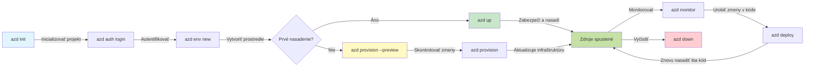
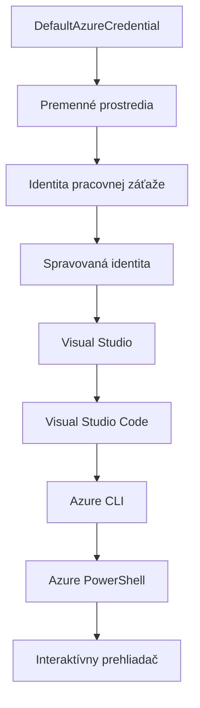

# AZD Základy - Porozumenie Azure Developer CLI

# AZD Základy - Hlavné koncepty a základy

**Chapter Navigation:**
- **📚 Domov kurzu**: [AZD pre začiatočníkov](../../README.md)
- **📖 Aktuálna kapitola**: Kapitola 1 - Základy a rýchly štart
- **⬅️ Predchádzajúca**: [Prehľad kurzu](../../README.md#-chapter-1-foundation--quick-start)
- **➡️ Ďalej**: [Inštalácia a nastavenie](installation.md)
- **🚀 Ďalšia kapitola**: [Kapitola 2: Vývoj orientovaný na AI](../chapter-02-ai-development/microsoft-foundry-integration.md)

## Úvod

Táto lekcia vás oboznámi s Azure Developer CLI (azd), výkonným nástrojom príkazového riadku, ktorý urýchľuje vašu cestu od lokálneho vývoja po nasadenie v Azure. Naučíte sa základné koncepty, hlavné funkcie a pochopíte, ako azd zjednodušuje nasadzovanie cloud-native aplikácií.

## Ciele učenia

Na konci tejto lekcie budete:
- Rozumieť tomu, čo je Azure Developer CLI a jeho hlavný účel
- Naučiť sa základné koncepty šablón, prostredí a služieb
- Preskúmať kľúčové funkcie vrátane vývoja riadeného šablónami a Infrastruktúry ako kódu
- Pochopiť štruktúru projektu azd a pracovný tok
- Byť pripravení nainštalovať a nakonfigurovať azd pre svoje vývojové prostredie

## Výstupy učenia

Po dokončení tejto lekcie budete schopní:
- Vysvetliť úlohu azd v moderných cloudových pracovných tokoch
- Identifikovať komponenty štruktúry projektu azd
- Opísať, ako spolupracujú šablóny, prostredia a služby
- Pochopiť výhody Infrastruktúry ako kódu s azd
- Rozpoznať rôzne azd príkazy a ich účely

## Čo je Azure Developer CLI (azd)?

Azure Developer CLI (azd) je nástroj príkazového riadku navrhnutý na urýchlenie vašej cesty od lokálneho vývoja po nasadenie v Azure. Zjednodušuje proces zostavovania, nasadzovania a správy cloud-native aplikácií v Azure.

### 🎯 Prečo používať AZD? Porovnanie z reálneho sveta

Porovnajme nasadenie jednoduchej webovej aplikácie s databázou:

#### ❌ BEZ AZD: manuálne nasadenie v Azure (30+ minút)

```bash
# Krok 1: Vytvorte skupinu prostriedkov
az group create --name myapp-rg --location eastus

# Krok 2: Vytvorte plán služby App Service
az appservice plan create --name myapp-plan \
  --resource-group myapp-rg \
  --sku B1 --is-linux

# Krok 3: Vytvorte webovú aplikáciu
az webapp create --name myapp-web-unique123 \
  --resource-group myapp-rg \
  --plan myapp-plan \
  --runtime "NODE:18-lts"

# Krok 4: Vytvorte účet Cosmos DB (10–15 minút)
az cosmosdb create --name myapp-cosmos-unique123 \
  --resource-group myapp-rg \
  --kind MongoDB

# Krok 5: Vytvorte databázu
az cosmosdb mongodb database create \
  --account-name myapp-cosmos-unique123 \
  --resource-group myapp-rg \
  --name tododb

# Krok 6: Vytvorte kolekciu
az cosmosdb mongodb collection create \
  --account-name myapp-cosmos-unique123 \
  --resource-group myapp-rg \
  --database-name tododb \
  --name todos

# Krok 7: Získajte reťazec pripojenia
CONN_STR=$(az cosmosdb keys list \
  --name myapp-cosmos-unique123 \
  --resource-group myapp-rg \
  --type connection-strings \
  --query "connectionStrings[0].connectionString" -o tsv)

# Krok 8: Nakonfigurujte nastavenia aplikácie
az webapp config appsettings set \
  --name myapp-web-unique123 \
  --resource-group myapp-rg \
  --settings MONGODB_URI="$CONN_STR"

# Krok 9: Povoľte protokolovanie
az webapp log config --name myapp-web-unique123 \
  --resource-group myapp-rg \
  --application-logging filesystem \
  --detailed-error-messages true

# Krok 10: Nastavte Application Insights
az monitor app-insights component create \
  --app myapp-insights \
  --location eastus \
  --resource-group myapp-rg

# Krok 11: Prepojte Application Insights s webovou aplikáciou
INSTRUMENTATION_KEY=$(az monitor app-insights component show \
  --app myapp-insights \
  --resource-group myapp-rg \
  --query "instrumentationKey" -o tsv)

az webapp config appsettings set \
  --name myapp-web-unique123 \
  --resource-group myapp-rg \
  --settings APPINSIGHTS_INSTRUMENTATIONKEY="$INSTRUMENTATION_KEY"

# Krok 12: Zostavte aplikáciu lokálne
npm install
npm run build

# Krok 13: Vytvorte balík na nasadenie
zip -r app.zip . -x "*.git*" "node_modules/*"

# Krok 14: Nasadiť aplikáciu
az webapp deployment source config-zip \
  --resource-group myapp-rg \
  --name myapp-web-unique123 \
  --src app.zip

# Krok 15: Počkajte a modlite sa, aby to fungovalo 🙏
# (Žiadna automatizovaná validácia, je potrebné manuálne testovanie)
```

**Problémy:**
- ❌ 15+ príkazov, ktoré si treba zapamätať a vykonať v správnom poradí
- ❌ 30-45 minút manuálnej práce
- ❌ Ľahko sa urobia chyby (preklepy, nesprávne parametre)
- ❌ Pripojovacie reťazce vystavené v histórii terminálu
- ❌ Žiadne automatické vrátenie zmien pri zlyhaní
- ❌ Ťažké zopakovať pre členov tímu
- ❌ Rôzne zakaždým (nereprodukovateľné)

#### ✅ S AZD: automatizované nasadenie (5 príkazov, 10-15 minút)

```bash
# Krok 1: Inicializovať zo šablóny
azd init --template todo-nodejs-mongo

# Krok 2: Overiť totožnosť
azd auth login

# Krok 3: Vytvoriť prostredie
azd env new dev

# Krok 4: Náhľad zmien (voliteľné, ale odporúčané)
azd provision --preview

# Krok 5: Nasadiť všetko
azd up

# ✨ Hotovo! Všetko je nasadené, nakonfigurované a monitorované
```

**Výhody:**
- ✅ **5 príkazov** vs. 15+ manuálnych krokov
- ✅ **10-15 minút** celkom (väčšinou čakanie na Azure)
- ✅ **Žiadne chyby** - automatizované a otestované
- ✅ **Tajomstvá bezpečne spravované** cez Key Vault
- ✅ **Automatické vrátenie zmien** pri zlyhaniach
- ✅ **Úplne reprodukovateľné** - rovnaký výsledok zakaždým
- ✅ **Pripravené pre tím** - ktokoľvek môže nasadiť rovnakými príkazmi
- ✅ **Infrastruktúra ako kód** - šablóny Bicep pod verziovacou kontrolou
- ✅ **Vstavané monitorovanie** - Application Insights nakonfigurované automaticky

### 📊 Zníženie času a chýb

| Metric | Manual Deployment | AZD Deployment | Improvement |
|:-------|:------------------|:---------------|:------------|
| **Commands** | 15+ | 5 | 67% fewer |
| **Time** | 30-45 min | 10-15 min | 60% faster |
| **Error Rate** | ~40% | <5% | 88% reduction |
| **Consistency** | Low (manual) | 100% (automated) | Perfect |
| **Team Onboarding** | 2-4 hours | 30 minutes | 75% faster |
| **Rollback Time** | 30+ min (manual) | 2 min (automated) | 93% faster |

## Kľúčové koncepty

### Šablóny
Šablóny sú základom azd. Obsahujú:
- **Kód aplikácie** - Váš zdrojový kód a závislosti
- **Definície infraštruktúry** - Azure zdroje definované v Bicep alebo Terraform
- **Konfiguračné súbory** - Nastavenia a premenné prostredia
- **Skripty nasadenia** - Automatizované pracovné postupy nasadenia

### Prostredia
Prostredia predstavujú rôzne ciele nasadenia:
- **Development** - Pre testovanie a vývoj
- **Staging** - Predprodukčné prostredie
- **Production** - Produkčné prostredie

Každé prostredie si udržiava svoje vlastné:
- Azure resource group
- Konfiguračné nastavenia
- Stav nasadenia

### Služby
Služby sú stavebnými kameňmi vašej aplikácie:
- **Frontend** - Webové aplikácie, SPA
- **Backend** - API, mikroservisy
- **Database** - Riešenia na ukladanie dát
- **Storage** - Ukladanie súborov a blobov

## Kľúčové funkcie

### 1. Vývoj riadený šablónami
```bash
# Prehliadať dostupné šablóny
azd template list

# Inicializovať zo šablóny
azd init --template <template-name>
```

### 2. Infrastruktúra ako kód
- **Bicep** - Doménovo špecifický jazyk Azure
- **Terraform** - Nástroj infraštruktúry multi-cloud
- **ARM Templates** - Šablóny Azure Resource Manager

### 3. Integrované pracovné postupy
```bash
# Kompletný pracovný postup nasadenia
azd up            # Provision + Deploy — toto je automatické pri počiatočnom nastavení

# 🧪 NOVÉ: Náhľad zmien infraštruktúry pred nasadením (BEZPEČNÉ)
azd provision --preview    # Simulovať nasadenie infraštruktúry bez vykonania zmien

azd provision     # Vytvorte zdroje Azure; ak aktualizujete infraštruktúru, použite toto
azd deploy        # Nasadiť aplikačný kód alebo ho znovu nasadiť po aktualizácii
azd down          # Vyčistiť zdroje
```

#### 🛡️ Bezpečné plánovanie infraštruktúry s náhľadom
Príkaz `azd provision --preview` je prelomový pre bezpečné nasadenia:
- **Analýza suchého behu** - Ukazuje, čo bude vytvorené, zmenené alebo odstránené
- **Žiadne riziko** - Do vášho Azure prostredia sa nevykonajú žiadne skutočné zmeny
- **Spolupráca tímu** - Zdieľajte výsledky náhľadu pred nasadením
- **Odhad nákladov** - Pochopte náklady na zdroje pred záväzkom

```bash
# Príklad náhľadového pracovného postupu
azd provision --preview           # Pozrite si, čo sa zmení
# Skontrolujte výstup, prediskutujte ho s tímom
azd provision                     # Aplikujte zmeny s istotou
```

### 📊 Vizualizácia: AZD vývojový pracovný tok


**Vysvetlenie pracovného postupu:**
1. **Init** - Začnite so šablónou alebo novým projektom
2. **Auth** - Overte sa v Azure
3. **Environment** - Vytvorte izolované prostredie nasadenia
4. **Preview** - 🆕 Vždy najprv prehliadnite zmeny infraštruktúry (bezpečná prax)
5. **Provision** - Vytvoriť/aktualizovať Azure zdroje
6. **Deploy** - Nahrajte kód svojej aplikácie
7. **Monitor** - Sledujte výkon aplikácie
8. **Iterate** - Upravujte a znovu nasadzujte kód
9. **Cleanup** - Odstráňte zdroje po dokončení

### 4. Správa prostredí
```bash
# Vytvárať a spravovať prostredia
azd env new <environment-name>
azd env select <environment-name>
azd env list
```

## 📁 Štruktúra projektu

Typická štruktúra projektu azd:
```
my-app/
├── .azd/                    # azd configuration
│   └── config.json
├── .azure/                  # Azure deployment artifacts
├── .devcontainer/          # Development container config
├── .github/workflows/      # GitHub Actions
├── .vscode/               # VS Code settings
├── infra/                 # Infrastructure code
│   ├── main.bicep        # Main infrastructure template
│   ├── main.parameters.json
│   └── modules/          # Reusable modules
├── src/                  # Application source code
│   ├── api/             # Backend services
│   └── web/             # Frontend application
├── azure.yaml           # azd project configuration
└── README.md
```

## 🔧 Konfiguračné súbory

### azure.yaml
Hlavný konfiguračný súbor projektu:
```yaml
name: my-awesome-app
metadata:
  template: my-template@1.0.0

services:
  web:
    project: ./src/web
    language: js
    host: appservice
  api:
    project: ./src/api
    language: js
    host: appservice

hooks:
  preprovision:
    shell: pwsh
    run: echo "Preparing to provision..."
```

### .azure/config.json
Konfigurácia špecifická pre prostredie:
```json
{
  "version": 1,
  "defaultEnvironment": "dev",
  "environments": {
    "dev": {
      "subscriptionId": "your-subscription-id",
      "location": "eastus"
    }
  }
}
```

## 🎪 Bežné pracovné postupy s praktickými cvičeniami

> **💡 Tip na učenie:** Postupujte podľa týchto cvičení v poradí, aby ste si postupne vybudovali zručnosti v AZD.

### 🎯 Cvičenie 1: Inicializujte svoj prvý projekt

**Cieľ:** Vytvoriť AZD projekt a preskúmať jeho štruktúru

**Kroky:**
```bash
# Použite overenú šablónu
azd init --template todo-nodejs-mongo

# Preskúmajte vygenerované súbory
ls -la  # Zobrazte všetky súbory vrátane skrytých

# Hlavné vytvorené súbory:
# - azure.yaml (hlavná konfigurácia)
# - infra/ (kód infraštruktúry)
# - src/ (kód aplikácie)
```

**✅ Úspech:** Máte azure.yaml, infra/, a src/ adresáre

---

### 🎯 Cvičenie 2: Nasadiť do Azure

**Cieľ:** Dokončiť end-to-end nasadenie

**Kroky:**
```bash
# 1. Overiť totožnosť
az login && azd auth login

# 2. Vytvoriť prostredie
azd env new dev
azd env set AZURE_LOCATION eastus

# 3. Náhľad zmien (ODPORÚČANÉ)
azd provision --preview

# 4. Nasadiť všetko
azd up

# 5. Overiť nasadenie
azd show    # Zobraziť URL vašej aplikácie
```

**Očakávaný čas:** 10-15 minút  
**✅ Úspech:** URL aplikácie sa otvorí v prehliadači

---

### 🎯 Cvičenie 3: Viaceré prostredia

**Cieľ:** Nasadiť do dev a staging

**Kroky:**
```bash
# Dev už existuje, vytvorte staging
azd env new staging
azd env set AZURE_LOCATION westus2
azd up

# Prepnite medzi nimi
azd env list
azd env select dev
```

**✅ Úspech:** Dve samostatné skupiny prostriedkov v Azure Portáli

---

### 🛡️ Čistý štart: `azd down --force --purge`

Keď potrebujete úplne resetovať:

```bash
azd down --force --purge
```

**Čo to robí:**
- `--force`: Žiadne výzvy na potvrdenie
- `--purge`: Odstráni všetok lokálny stav a Azure zdroje

**Použiť keď:**
- Nasadenie zlyhalo v strede procesu
- Prechod medzi projektmi
- Potrebujete nový začiatok

---

## 🎪 Pôvodný pracovný postup - referencia

### Starting a New Project
```bash
# Metóda 1: Použiť existujúcu šablónu
azd init --template todo-nodejs-mongo

# Metóda 2: Začať od nuly
azd init

# Metóda 3: Použiť aktuálny adresár
azd init .
```

### Development Cycle
```bash
# Nastavenie vývojového prostredia
azd auth login
azd env new dev
azd env select dev

# Nasadenie všetkého
azd up

# Urobiť zmeny a znova nasadiť
azd deploy

# Vyčistiť po dokončení
azd down --force --purge # Príkaz v Azure Developer CLI je **tvrdý reset** pre vaše prostredie — obzvlášť užitočný, keď riešite zlyhané nasadenia, odstraňujete opustené prostriedky alebo sa pripravujete na nové nasadenie
```

## Pochopenie `azd down --force --purge`
Príkaz `azd down --force --purge` je silný spôsob, ako úplne rozobrať vaše azd prostredie a všetky s tým spojené zdroje. Tu je rozpis toho, čo každý flag robí:
```
--force
```
- Preskakuje výzvy na potvrdenie.
- Užitočné pre automatizáciu alebo skriptovanie, kde manuálny vstup nie je možný.
- Zabezpečuje, že demontáž prebehne bez prerušenia, aj keď CLI zistí nekonzistencie.

```
--purge
```
Odstráni **všetky súvisiace metadata**, vrátane:
Stav prostredia
Lokálny `.azure` priečinok
Uložené informácie o nasadení
Zabraňuje azd, aby si "pamätal" predchádzajúce nasadenia, čo môže spôsobiť problémy ako nezodpovedajúce skupiny prostriedkov alebo zastarané odkazy na register.

### Prečo používať obidva?
Keď narazíte na problém s `azd up` kvôli pretrvávajúcemu stavu alebo čiastočným nasadeniam, táto kombinácia zabezpečí **čistý štart**.

Je to obzvlášť užitočné po manuálnych odstráneniach zdrojov v Azure portáli alebo pri prepínaní šablón, prostredí alebo konvencií pomenovania skupín prostriedkov.

### Správa viacerých prostredí
```bash
# Vytvoriť stagingové prostredie
azd env new staging
azd env select staging
azd up

# Prepnúť späť na dev
azd env select dev

# Porovnať prostredia
azd env list
```

## 🔐 Autentifikácia a poverenia

Pochopenie autentifikácie je kľúčové pre úspešné nasadenia azd. Azure používa viacero metód autentifikácie a azd využíva rovnaký reťazec poverení ako ostatné nástroje Azure.

### Overenie Azure CLI (`az login`)

Pred použitím azd sa musíte autentifikovať v Azure. Najbežnejšia metóda je použitie Azure CLI:

```bash
# Interaktívne prihlásenie (otvorí prehliadač)
az login

# Prihlásenie s konkrétnym tenantom
az login --tenant <tenant-id>

# Prihlásenie pomocou service principal
az login --service-principal -u <app-id> -p <password> --tenant <tenant-id>

# Skontrolovať aktuálny stav prihlásenia
az account show

# Zoznam dostupných predplatných
az account list --output table

# Nastaviť predvolené predplatné
az account set --subscription <subscription-id>
```

### Priebeh autentifikácie
1. **Interaktívne prihlásenie**: Otvorí váš predvolený prehliadač na autentifikáciu
2. **Device Code Flow**: Pre prostredia bez prístupu k prehliadaču
3. **Service Principal**: Pre scenáre automatizácie a CI/CD
4. **Managed Identity**: Pre aplikácie hostované v Azure

### Reťazec DefaultAzureCredential

`DefaultAzureCredential` je typ poverení, ktorý poskytuje zjednodušenú skúsenosť s autentifikáciou tým, že automaticky skúša viacero zdrojov poverení v konkrétnom poradí:

#### Poradie reťazca poverení

#### 1. Premenné prostredia
```bash
# Nastavte premenné prostredia pre služobný účet
export AZURE_CLIENT_ID="<app-id>"
export AZURE_CLIENT_SECRET="<password>"
export AZURE_TENANT_ID="<tenant-id>"
```

#### 2. Workload Identity (Kubernetes/GitHub Actions)
Používa sa automaticky v:
- Azure Kubernetes Service (AKS) s Workload Identity
- GitHub Actions s OIDC federáciou
- Iné scenáre federovanej identity

#### 3. Managed Identity
Pre Azure zdroje ako:
- Virtuálne stroje
- App Service
- Azure Functions
- Kontajnerové inštancie

```bash
# Skontroluje, či beží na zdroji Azure so spravovanou identitou
az account show --query "user.type" --output tsv
# Vracia: "servicePrincipal" ak sa používa spravovaná identita
```

#### 4. Integrácia s nástrojmi pre vývojárov
- **Visual Studio**: Automaticky používa prihlásený účet
- **VS Code**: Používa poverenia rozšírenia Azure Account
- **Azure CLI**: Používa poverenia z `az login` (najbežnejšie pre lokálny vývoj)

### Nastavenie autentifikácie pre AZD

```bash
# Metóda 1: Použite Azure CLI (odporúčané pre vývoj)
az login
azd auth login  # Používa existujúce poverenia Azure CLI

# Metóda 2: Priama autentifikácia azd
azd auth login --use-device-code  # Pre bezhlavové prostredia

# Metóda 3: Skontrolujte stav autentifikácie
azd auth login --check-status

# Metóda 4: Odhlásiť sa a znovu sa autentifikovať
azd auth logout
azd auth login
```

### Najlepšie postupy pre autentifikáciu

#### Pre lokálny vývoj
```bash
# 1. Prihláste sa pomocou Azure CLI
az login

# 2. Skontrolujte správne predplatné
az account show
az account set --subscription "Your Subscription Name"

# 3. Použite azd s existujúcimi povereniami
azd auth login
```

#### Pre CI/CD pipeline
```yaml
# GitHub Actions example
- name: Azure Login
  uses: azure/login@v1
  with:
    creds: ${{ secrets.AZURE_CREDENTIALS }}

- name: Deploy with azd
  run: |
    azd auth login --client-id ${{ secrets.AZURE_CLIENT_ID }} \
                    --client-secret ${{ secrets.AZURE_CLIENT_SECRET }} \
                    --tenant-id ${{ secrets.AZURE_TENANT_ID }}
    azd up --no-prompt
```

#### Pre produkčné prostredia
- Používajte **Managed Identity** pri behu na Azure zdrojoch
- Používajte **Service Principal** pre scenáre automatizácie
- Vyhnite sa ukladaniu poverení v kóde alebo konfiguračných súboroch
- Používajte **Azure Key Vault** pre citlivú konfiguráciu

### Bežné problémy s autentifikáciou a riešenia

#### Problém: "No subscription found"
```bash
# Riešenie: Nastaviť predvolené predplatné
az account list --output table
az account set --subscription "<subscription-id>"
azd env set AZURE_SUBSCRIPTION_ID "<subscription-id>"
```

#### Problém: "Insufficient permissions"
```bash
# Riešenie: Skontrolujte a priraďte požadované role
az role assignment list --assignee $(az account show --query user.name --output tsv)

# Bežné požadované role:
# - Contributor (pre správu prostriedkov)
# - User Access Administrator (pre priraďovanie rolí)
```

#### Problém: "Token expired"
```bash
# Riešenie: Znova sa prihláste.
az logout
az login
azd auth logout
azd auth login
```

### Autentifikácia v rôznych scenároch

#### Lokálny vývoj
```bash
# Účet osobného rozvoja
az login
azd auth login
```

#### Tímový vývoj
```bash
# Použiť konkrétneho tenanta pre organizáciu
az login --tenant contoso.onmicrosoft.com
azd auth login
```

#### Scenáre s viacerými nájomníkmi
```bash
# Prepnúť medzi nájomníkmi
az login --tenant tenant1.onmicrosoft.com
# Nasadiť do nájomníka 1
azd up

az login --tenant tenant2.onmicrosoft.com  
# Nasadiť do nájomníka 2
azd up
```

### Bezpečnostné úvahy

1. **Ukladanie poverení**: Nikdy neukladajte poverenia v zdrojovom kóde
2. **Obmedzenie rozsahu**: Používajte princíp najmenších práv pre service principals
3. **Rotácia tokenov**: Pravidelne rotujte tajomstvá service principalov
4. **Audit**: Monitorujte autentifikáciu a aktivity nasadenia
5. **Sieťová bezpečnosť**: Používajte súkromné koncové body, keď je to možné

### Riešenie problémov s autentifikáciou

```bash
# Ladiť problémy s autentifikáciou
azd auth login --check-status
az account show
az account get-access-token

# Bežné diagnostické príkazy
whoami                          # Aktuálny kontext používateľa
az ad signed-in-user show      # Podrobnosti o používateľovi Azure AD
az group list                  # Otestovať prístup k zdrojom
```

## Pochopenie `azd down --force --purge`

### Discovery
```bash
azd template list              # Prehliadať šablóny
azd template show <template>   # Podrobnosti šablóny
azd init --help               # Možnosti inicializácie
```

### Správa projektov
```bash
azd show                     # Prehľad projektu
azd env show                 # Aktuálne prostredie
azd config list             # Nastavenia konfigurácie
```

### Monitorovanie
```bash
azd monitor                  # Otvoriť monitorovanie v portáli Azure
azd monitor --logs           # Zobraziť protokoly aplikácie
azd monitor --live           # Zobraziť metriky v reálnom čase
azd pipeline config          # Nastaviť CI/CD
```

## Najlepšie postupy

### 1. Používajte zmysluplné názvy
```bash
# Dobrý
azd env new production-east
azd init --template web-app-secure

# Vyhnúť sa
azd env new env1
azd init --template template1
```

### 2. Využívajte šablóny
- Začnite s existujúcimi šablónami
- Prispôsobte podľa vašich potrieb
- Vytvorte opakovane použiteľné šablóny pre vašu organizáciu

### 3. Izolácia prostredí
- Používajte oddelené prostredia pre dev/staging/prod
- Nikdy nenasadzujte priamo do produkcie z lokálneho stroja
- Používajte CI/CD pipeline pre produkčné nasadenia

### 4. Správa konfigurácie
- Používajte premenné prostredia pre citlivé údaje
- Udržujte konfiguráciu v správe verzií
- Dokumentujte nastavenia špecifické pre prostredie

## Postup učenia

### Začiatočník (1.–2. týždeň)
1. Nainštalovať azd a autentifikovať sa
2. Nasadiť jednoduchú šablónu
3. Pochopiť štruktúru projektu
4. Naučiť sa základné príkazy (up, down, deploy)

### Stredne pokročilý (3.–4. týždeň)
1. Prispôsobiť šablóny
2. Spravovať viacero prostredí
3. Pochopiť infraštruktúrny kód
4. Nastaviť CI/CD pipeline

### Pokročilý (5. týždeň+)
1. Vytvárať vlastné šablóny
2. Pokročilé infraštruktúrne vzory
3. Nasadenia v viac regiónoch
4. Podnikové konfigurácie

## Ďalšie kroky

**📖 Pokračovať v učení kapitoly 1:**
- [Inštalácia a nastavenie](installation.md) - Nainštalujte a nakonfigurujte azd
- [Váš prvý projekt](first-project.md) - Kompletný praktický návod
- [Príručka konfigurácie](configuration.md) - Pokročilé možnosti konfigurácie

**🎯 Pripravení na ďalšiu kapitolu?**
- [Kapitola 2: Vývoj zameraný na AI](../chapter-02-ai-development/microsoft-foundry-integration.md) - Začnite vytvárať aplikácie s AI

## Ďalšie zdroje

- [Prehľad Azure Developer CLI](https://learn.microsoft.com/en-us/azure/developer/azure-developer-cli/)
- [Galéria šablón](https://azure.github.io/awesome-azd/)
- [Ukážky komunity](https://github.com/Azure-Samples)

---

## 🙋 Často kladené otázky

### Všeobecné otázky

**Q: Aký je rozdiel medzi AZD a Azure CLI?**

A: Azure CLI (`az`) slúži na správu jednotlivých Azure prostriedkov. AZD (`azd`) slúži na správu celých aplikácií:

```bash
# Azure CLI - Správa prostriedkov na nízkej úrovni
az webapp create --name myapp --resource-group rg
az sql server create --name myserver --resource-group rg
# ...je potrebných oveľa viac príkazov

# AZD - Správa na úrovni aplikácie
azd up  # Nasadí celú aplikáciu so všetkými prostriedkami
```

**Myslite na to takto:**
- `az` = Práca s jednotlivými Lego kockami
- `azd` = Práca s kompletnými Lego súpravami

---

**Q: Musím poznať Bicep alebo Terraform, aby som používal AZD?**

A: Nie! Začnite so šablónami:
```bash
# Použite existujúcu šablónu - nie sú potrebné znalosti IaC
azd init --template todo-nodejs-mongo
azd up
```

Neskôr sa môžete naučiť Bicep, aby ste prispôsobili infraštruktúru. Šablóny poskytujú pracovné príklady, z ktorých sa môžete učiť.

---

**Q: Koľko stojí používanie AZD šablón?**

A: Náklady sa líšia podľa šablóny. Väčšina vývojových šablón stojí $50-150/mesiac:

```bash
# Náhľad nákladov pred nasadením
azd provision --preview

# Vždy vykonajte čistenie, keď to nepoužívate
azd down --force --purge  # Odstráni všetky zdroje
```

**Tip:** Použite bezplatné úrovne tam, kde sú dostupné:
- App Service: F1 (Free) tier
- Azure OpenAI: 50,000 tokenov/mesiac zadarmo
- Cosmos DB: 1000 RU/s (bezplatná úroveň)

---

**Q: Môžem používať AZD s existujúcimi Azure prostriedkami?**

A: Áno, ale je jednoduchšie začať od začiatku. AZD funguje najlepšie, keď spravuje celý životný cyklus. Pre existujúce prostriedky:

```bash
# Možnosť 1: Importovať existujúce zdroje (pokročilé)
azd init
# Potom upravte infra/, aby odkazovalo na existujúce zdroje

# Možnosť 2: Začať odznova (odporúčané)
azd init --template matching-your-stack
azd up  # Vytvorí nové prostredie
```

---

**Q: Ako zdieľam svoj projekt s kolegami?**

A: Commitnite AZD projekt do Gitu (ale NIE priečinok .azure):

```bash
# Už predvolene v .gitignore
.azure/        # Obsahuje tajomstvá a údaje o prostredí
*.env          # Premenné prostredia

# Členovia tímu potom:
git clone <your-repo>
azd auth login
azd env new <their-name>-dev
azd up
```

Každý získa identickú infraštruktúru z tých istých šablón.

---

### Otázky pri riešení problémov

**Q: Príkaz "azd up" zlyhal v polovici. Čo mám robiť?**

A: Skontrolujte chybu, opravte ju, a potom skúste znova:

```bash
# Zobraziť podrobné protokoly
azd show

# Bežné opravy:

# 1. Ak je prekročená kvóta:
azd env set AZURE_LOCATION "westus2"  # Skúste iný región

# 2. Ak je konflikt názvu zdroja:
azd down --force --purge  # Začať od nuly
azd up  # Skúsiť znova

# 3. Ak vypršala platnosť autentifikácie:
az login
azd auth login
azd up
```

**Najčastejší problém:** Nesprávne zvolené predplatné Azure
```bash
az account list --output table
az account set --subscription "<correct-subscription>"
```

---

**Q: Ako nasadím len zmeny v kóde bez opätovného nasadzovania infraštruktúry?**

A: Použite `azd deploy` namiesto `azd up`:

```bash
azd up          # Prvýkrát: zriadenie + nasadenie (pomalé)

# Urobte zmeny v kóde...

azd deploy      # Pri ďalších spusteniach: len nasadenie (rýchle)
```

Porovnanie rýchlosti:
- `azd up`: 10-15 minút (zriaďuje infraštruktúru)
- `azd deploy`: 2-5 minút (len kód)

---

**Q: Môžem prispôsobiť infraštruktúrne šablóny?**

A: Áno! Upravte Bicep súbory v `infra/`:

```bash
# Po spustení azd init
cd infra/
code main.bicep  # Upraviť vo VS Code

# Náhľad zmien
azd provision --preview

# Použiť zmeny
azd provision
```

**Tip:** Začnite zľahka - najprv zmeňte SKUs:
```bicep
// infra/main.bicep
sku: {
  name: 'B1'  // Change to 'P1V2' for production
}
```

---

**Q: Ako odstránim všetko, čo AZD vytvoril?**

A: Jeden príkaz odstráni všetky prostriedky:

```bash
azd down --force --purge

# Toto odstráni:
# - Všetky Azure zdroje
# - Skupina prostriedkov
# - Stav lokálneho prostredia
# - Údaje nasadenia v medzipamäti
```

**Vždy to spustite, keď:**
- Dokončili ste testovanie šablóny
- Prechádzate na iný projekt
- Chcete začať odznova

**Úspora nákladov:** Odstránenie nepoužitých prostriedkov = $0 poplatkov

---

**Q: Čo ak som omylom odstránil prostriedky v Azure Portal?**

A: Stav AZD sa môže dostať do nesúladu. Postup úplného vyčistenia:

```bash
# 1. Odstrániť lokálny stav
azd down --force --purge

# 2. Začať odznova
azd up

# Alternatíva: Nechať AZD zistiť a opraviť
azd provision  # Vytvorí chýbajúce zdroje
```

---

### Pokročilé otázky

**Q: Môžem používať AZD v CI/CD pipelines?**

A: Áno! Príklad pre GitHub Actions:

```yaml
# .github/workflows/deploy.yml
name: Deploy with AZD

on:
  push:
    branches: [main]

jobs:
  deploy:
    runs-on: ubuntu-latest
    steps:
      - uses: actions/checkout@v2
      
      - name: Install azd
        run: curl -fsSL https://aka.ms/install-azd.sh | bash
      
      - name: Azure Login
        run: |
          azd auth login \
            --client-id ${{ secrets.AZURE_CLIENT_ID }} \
            --client-secret ${{ secrets.AZURE_CLIENT_SECRET }} \
            --tenant-id ${{ secrets.AZURE_TENANT_ID }}
      
      - name: Deploy
        run: azd up --no-prompt
```

---

**Q: Ako riešim tajomstvá a citlivé údaje?**

A: AZD sa automaticky integruje s Azure Key Vault:

```bash
# Tajomstvá sú uložené v Key Vaulte, nie v kóde
azd env set DATABASE_PASSWORD "$(openssl rand -base64 32)"

# AZD automaticky:
# 1. Vytvorí Key Vault
# 2. Uloží tajomstvo
# 3. Udelí aplikácii prístup pomocou spravovanej identity
# 4. Vloží za behu
```

**Nikdy necommitujte:**
- `.azure/` priečinok (obsahuje údaje o prostredí)
- `.env` súbory (lokálne tajomstvá)
- Pripojovacie reťazce

---

**Q: Môžem nasadiť do viacerých regiónov?**

A: Áno, vytvorte prostredie pre každý región:

```bash
# Prostredie východnej časti USA
azd env new prod-eastus
azd env set AZURE_LOCATION eastus
azd up

# Prostredie západnej Európy
azd env new prod-westeurope
azd env set AZURE_LOCATION westeurope
azd up

# Každé prostredie je nezávislé
azd env list
```

Pre skutočné multi-region aplikácie prispôsobte Bicep šablóny tak, aby nasadzovali do viacerých regiónov súčasne.

---

**Q: Kde môžem získať pomoc, ak uviaznem?**

1. **Dokumentácia AZD:** https://learn.microsoft.com/azure/developer/azure-developer-cli/
2. **GitHub Issues:** https://github.com/Azure/azure-dev/issues
3. **Discord:** [Azure Discord](https://discord.gg/microsoft-azure) - kanál #azure-developer-cli
4. **Stack Overflow:** Označte značkou `azure-developer-cli`
5. **Tento kurz:** [Sprievodca riešením problémov](../chapter-07-troubleshooting/common-issues.md)

**Tip:** Predtým, než sa opýtate, spustite:
```bash
azd show       # Zobrazuje aktuálny stav
azd version    # Zobrazuje vašu verziu
```
Priložte tieto informácie do svojej otázky pre rýchlejšiu pomoc.

---

## 🎓 Čo ďalej?

Teraz rozumiete základom AZD. Vyberte si svoju cestu:

### 🎯 Pre začiatočníkov:
1. **Ďalej:** [Inštalácia a nastavenie](installation.md) - Nainštalujte AZD na svoj počítač
2. **Potom:** [Váš prvý projekt](first-project.md) - Nasadiť svoju prvú aplikáciu
3. **Precvičovanie:** Dokončite všetky 3 cvičenia v tejto lekcii

### 🚀 Pre vývojárov AI:
1. **Preskočiť na:** [Kapitola 2: Vývoj zameraný na AI](../chapter-02-ai-development/microsoft-foundry-integration.md)
2. **Nasadiť:** Začnite s `azd init --template get-started-with-ai-chat`
3. **Učte sa:** Budujte počas nasadzovania

### 🏗️ Pre skúsených vývojárov:
1. **Preštudujte si:** [Príručka konfigurácie](configuration.md) - Pokročilé nastavenia
2. **Preskúmajte:** [Infrastruktúra ako kód](../chapter-04-infrastructure/provisioning.md) - Hlboký ponor do Bicep
3. **Vytvorte:** Vytvorte vlastné šablóny pre svoj stack

---

**Navigácia medzi kapitolami:**
- **📚 Domov kurzu**: [AZD pre začiatočníkov](../../README.md)
- **📖 Aktuálna kapitola**: Kapitola 1 - Základy & Rýchly začiatok  
- **⬅️ Predošlé**: [Prehľad kurzu](../../README.md#-chapter-1-foundation--quick-start)
- **➡️ Ďalšie**: [Inštalácia a nastavenie](installation.md)
- **🚀 Ďalšia kapitola**: [Kapitola 2: Vývoj zameraný na AI](../chapter-02-ai-development/microsoft-foundry-integration.md)

---

<!-- CO-OP TRANSLATOR DISCLAIMER START -->
Upozornenie:
Tento dokument bol preložený pomocou AI prekladateľskej služby [Co-op Translator](https://github.com/Azure/co-op-translator). Hoci sa snažíme o presnosť, vezmite prosím na vedomie, že automatické preklady môžu obsahovať chyby alebo nepresnosti. Pôvodný dokument v jeho pôvodnom jazyku by mal byť považovaný za rozhodujúci zdroj. V prípade kritických informácií sa odporúča profesionálny preklad vykonaný človekom. Nie sme zodpovední za akékoľvek nedorozumenia alebo nesprávne výklady vyplývajúce z použitia tohto prekladu.
<!-- CO-OP TRANSLATOR DISCLAIMER END -->