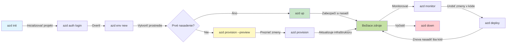
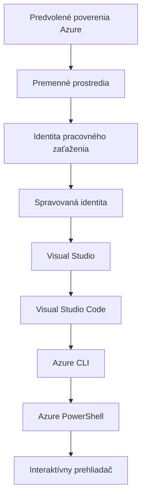

# AZD Basics - Pochopenie Azure Developer CLI

# AZD Basics - Základné koncepty a fundamente

**Chapter Navigation:**
- **📚 Course Home**: [AZD pre začiatočníkov](../../README.md)
- **📖 Current Chapter**: Kapitola 1 - Základy & Rýchly štart
- **⬅️ Previous**: [Prehľad kurzu](../../README.md#-chapter-1-foundation--quick-start)
- **➡️ Next**: [Inštalácia & Nastavenie](installation.md)
- **🚀 Next Chapter**: [Kapitola 2: AI-First Development](../chapter-02-ai-development/microsoft-foundry-integration.md)

## Úvod

Táto lekcia vás zoznámi s Azure Developer CLI (azd), výkonným nástrojom príkazového riadku, ktorý zrýchľuje vašu cestu od lokálneho vývoja po nasadenie v Azure. Naučíte sa základné koncepty, hlavné funkcie a pochopíte, ako azd zjednodušuje nasadzovanie cloud-native aplikácií.

## Ciele učenia

Na konci tejto lekcie budete:
- Rozumieť, čo je Azure Developer CLI a jeho primárnemu účelu
- Naučiť sa základné koncepty šablón, prostredí a služieb
- Preskúmať kľúčové funkcie vrátane vývoja založeného na šablónach a Infrastruktúry ako kódu
- Pochopiť štruktúru projektu azd a pracovný tok
- Byť pripravení nainštalovať a nakonfigurovať azd pre vaše vývojové prostredie

## Výstupy učenia

Po dokončení tejto lekcie budete schopní:
- Vysvetliť úlohu azd v moderných cloudových vývojových pracovných tokoch
- Identifikovať komponenty štruktúry azd projektu
- Popísať, ako šablóny, prostredia a služby spolupracujú
- Pochopiť výhody Infrastruktúry ako kódu s azd
- Rozpoznať rôzne príkazy azd a ich účely

## Čo je Azure Developer CLI (azd)?

Azure Developer CLI (azd) je nástroj príkazového riadku navrhnutý na zrýchlenie vašej cesty od lokálneho vývoja po nasadenie v Azure. Zjednodušuje proces budovania, nasadzovania a správy cloud-native aplikácií v Azure.

### Čo môžete nasadiť s azd?

azd podporuje široké spektrum záťaží — a zoznam sa stále rozširuje. Dnes môžete pomocou azd nasadiť:

| Workload Type | Examples | Same Workflow? |
|---------------|----------|----------------|
| **Traditional applications** | Webové aplikácie, REST API, statické stránky | ✅ `azd up` |
| **Services and microservices** | Container Apps, Function Apps, backendy s viacerými službami | ✅ `azd up` |
| **AI-powered applications** | Chatovacie aplikácie s Microsoft Foundry Models, RAG riešenia s AI Search | ✅ `azd up` |
| **Intelligent agents** | Agenti hosťovaní vo Foundry, orchestrácie s viacerými agentmi | ✅ `azd up` |

Kľúčovým poznatkom je, že **životný cyklus azd zostáva rovnaký bez ohľadu na to, čo nasadzujete**. Inicializujete projekt, provisionujete infraštruktúru, nasadíte svoj kód, monitorujete aplikáciu a vyčistíte — či už ide o jednoduchú webstránku alebo sofistikovaného AI agenta.

Táto kontinuita je zámerná. azd považuje AI schopnosti za ďalší typ služby, ktorú môže vaša aplikácia používať, nie za niečo zásadne odlišné. Chatové rozhranie podporované modelmi Microsoft Foundry je z pohľadu azd len ďalšia služba na nakonfigurovanie a nasadenie.

### 🎯 Prečo používať AZD? Porovnanie zo skutočného sveta

Pozrime sa na porovnanie nasadenia jednoduchej webovej aplikácie s databázou:

#### ❌ BEZ AZD: Manuálne nasadenie do Azure (30+ minút)

```bash
# Krok 1: Vytvoriť skupinu prostriedkov
az group create --name myapp-rg --location eastus

# Krok 2: Vytvoriť plán App Service
az appservice plan create --name myapp-plan \
  --resource-group myapp-rg \
  --sku B1 --is-linux

# Krok 3: Vytvoriť webovú aplikáciu
az webapp create --name myapp-web-unique123 \
  --resource-group myapp-rg \
  --plan myapp-plan \
  --runtime "NODE:18-lts"

# Krok 4: Vytvoriť účet Cosmos DB (10-15 minút)
az cosmosdb create --name myapp-cosmos-unique123 \
  --resource-group myapp-rg \
  --kind MongoDB

# Krok 5: Vytvoriť databázu
az cosmosdb mongodb database create \
  --account-name myapp-cosmos-unique123 \
  --resource-group myapp-rg \
  --name tododb

# Krok 6: Vytvoriť kolekciu
az cosmosdb mongodb collection create \
  --account-name myapp-cosmos-unique123 \
  --resource-group myapp-rg \
  --database-name tododb \
  --name todos

# Krok 7: Získať reťazec pripojenia
CONN_STR=$(az cosmosdb keys list \
  --name myapp-cosmos-unique123 \
  --resource-group myapp-rg \
  --type connection-strings \
  --query "connectionStrings[0].connectionString" -o tsv)

# Krok 8: Konfigurovať nastavenia aplikácie
az webapp config appsettings set \
  --name myapp-web-unique123 \
  --resource-group myapp-rg \
  --settings MONGODB_URI="$CONN_STR"

# Krok 9: Povoliť protokolovanie
az webapp log config --name myapp-web-unique123 \
  --resource-group myapp-rg \
  --application-logging filesystem \
  --detailed-error-messages true

# Krok 10: Nastaviť Application Insights
az monitor app-insights component create \
  --app myapp-insights \
  --location eastus \
  --resource-group myapp-rg

# Krok 11: Prepojiť App Insights s webovou aplikáciou
INSTRUMENTATION_KEY=$(az monitor app-insights component show \
  --app myapp-insights \
  --resource-group myapp-rg \
  --query "instrumentationKey" -o tsv)

az webapp config appsettings set \
  --name myapp-web-unique123 \
  --resource-group myapp-rg \
  --settings APPINSIGHTS_INSTRUMENTATIONKEY="$INSTRUMENTATION_KEY"

# Krok 12: Zostaviť aplikáciu lokálne
npm install
npm run build

# Krok 13: Vytvoriť balík nasadenia
zip -r app.zip . -x "*.git*" "node_modules/*"

# Krok 14: Nasadiť aplikáciu
az webapp deployment source config-zip \
  --resource-group myapp-rg \
  --name myapp-web-unique123 \
  --src app.zip

# Krok 15: Čakať a modliť sa, aby to fungovalo 🙏
# (Žiadna automatizovaná validácia, vyžaduje sa manuálne testovanie)
```

**Problémy:**
- ❌ 15+ príkazov na zapamätanie a vykonanie v správnom poradí
- ❌ 30-45 minút ručnej práce
- ❌ Ľahko urobiť chyby (preklepy, nesprávne parametre)
- ❌ Pripojovacie reťazce zobrazené v histórii terminálu
- ❌ Žiadne automatické vrátenie zmien pri zlyhaní
- ❌ Ťažké zopakovať pre členov tímu
- ❌ Iné zakaždým (nereprodukovateľné)

#### ✅ S AZD: Automatizované nasadenie (5 príkazov, 10-15 minút)

```bash
# Krok 1: Inicializovať z šablóny
azd init --template todo-nodejs-mongo

# Krok 2: Autentifikovať
azd auth login

# Krok 3: Vytvoriť prostredie
azd env new dev

# Krok 4: Náhľad zmien (voliteľné, ale odporúčané)
azd provision --preview

# Krok 5: Nasadiť všetko
azd up

# ✨ Hotovo! Všetko je nasadené, nakonfigurované a monitorované
```

**Výhody:**
- ✅ **5 príkazov** oproti 15+ manuálnym krokom
- ✅ **10-15 minút** celkový čas (väčšina času čaká na Azure)
- ✅ **Menej manuálnych chýb** - konzistentný pracovný postup založený na šablónach
- ✅ **Bezpečné nakladanie s tajnými údajmi** - mnohé šablóny používajú Azure-managed úložisko tajomstiev
- ✅ **Opakovateľné nasadenia** - rovnaký postup zakaždým
- ✅ **Plne reprodukovateľné** - rovnaký výsledok vždy
- ✅ **Pripravené pre tím** - ktokoľvek môže nasadiť rovnakými príkazmi
- ✅ **Infrastruktúra ako kód** - Bicep šablóny pod verziovacou kontrolou
- ✅ **Vstavané monitorovanie** - Application Insights nakonfigurovaný automaticky

### 📊 Zníženie času a chýb

| Metric | Manuálne nasadenie | Nasadenie pomocou AZD | Zlepšenie |
|:-------|:------------------|:---------------------|:----------|
| **Príkazy** | 15+ | 5 | o 67% menej |
| **Čas** | 30-45 min | 10-15 min | o 60% rýchlejšie |
| **Miera chýb** | ~40% | <5% | 88% zníženie |
| **Konzistentnosť** | Nízka (manuálna) | 100% (automatizovaná) | Dokonalá |
| **Zaškolenie tímu** | 2-4 hodiny | 30 minút | o 75% rýchlejšie |
| **Čas na rollback** | 30+ min (manuálne) | 2 min (automatizované) | o 93% rýchlejšie |

## Základné koncepty

### Šablóny
Šablóny sú základom azd. Obsahujú:
- **Kód aplikácie** - Váš zdrojový kód a závislosti
- **Definície infraštruktúry** - Azure zdroje definované v Bicep alebo Terraform
- **Konfiguračné súbory** - Nastavenia a premenné prostredia
- **Nasadzovacie skripty** - Automatizované pracovné postupy nasadenia

### Prostredia
Prostredia reprezentujú rôzne cieľové nasadenia:
- **Vývoj** - Pre testovanie a vývoj
- **Staging** - Predprodukčné prostredie
- **Produkcia** - Live produkčné prostredie

Každé prostredie si udržiava svoje vlastné:
- skupinu prostriedkov Azure
- konfiguračné nastavenia
- stav nasadenia

### Služby
Služby sú stavebné bloky vašej aplikácie:
- **Frontend** - Webové aplikácie, SPA
- **Backend** - API, mikroslužby
- **Databáza** - Riešenia ukladania dát
- **Úložisko** - Ukladanie súborov a blobov

## Kľúčové funkcie

### 1. Vývoj poháňaný šablónami
```bash
# Prehliadať dostupné šablóny
azd template list

# Inicializovať z šablóny
azd init --template <template-name>
```

### 2. Infrastruktúra ako kód
- **Bicep** - doménovo špecifický jazyk pre Azure
- **Terraform** - nástroj pre infraštruktúru medzi viacerými cloudmi
- **ARM Templates** - Azure Resource Manager šablóny

### 3. Integrované pracovné postupy
```bash
# Kompletný pracovný postup nasadenia
azd up            # Provision + Deploy — bez zásahu pri prvom nastavení

# 🧪 NOVÉ: Náhľad zmien infraštruktúry pred nasadením (BEZPEČNÉ)
azd provision --preview    # Simulovať nasadenie infraštruktúry bez vykonania zmien

azd provision     # Vytvoriť zdroje Azure — ak aktualizujete infraštruktúru, použite toto
azd deploy        # Nasadiť kód aplikácie alebo ho znovu nasadiť po aktualizácii
azd down          # Vyčistiť zdroje
```

#### 🛡️ Bezpečné plánovanie infraštruktúry s náhľadom
Príkaz `azd provision --preview` je prelomový pre bezpečné nasadenia:
- **Analýza suchého behu** - Zobrazuje, čo bude vytvorené, upravené alebo zmazané
- **Žiadne riziko** - Do vášho Azure prostredia nie sú vykonané žiadne skutočné zmeny
- **Spolupráca tímu** - Zdieľajte výsledky náhľadu pred nasadením
- **Odhad nákladov** - Pochopte náklady na zdroje pred záväzkom

```bash
# Ukážkový náhľad pracovného postupu
azd provision --preview           # Pozrite si, čo sa zmení
# Skontrolujte výstup, prediskutujte s tímom
azd provision                     # Použite zmeny s istotou
```

### 📊 Vizualizácia: Vývojový pracovný tok AZD



**Vysvetlenie pracovného postupu:**
1. **Init** - Začnite so šablónou alebo novým projektom
2. **Auth** - Prihláste sa do Azure
3. **Environment** - Vytvorte izolované nasadzovacie prostredie
4. **Preview** - 🆕 Vždy najprv prehliadnite zmeny infraštruktúry (bezpečná prax)
5. **Provision** - Vytvoriť/aktualizovať Azure zdroje
6. **Deploy** - Nasadiť kód aplikácie
7. **Monitor** - Sledujte výkon aplikácie
8. **Iterate** - Robte zmeny a znovu nasadzujte kód
9. **Cleanup** - Odstráňte zdroje po skončení

### 4. Správa prostredí
```bash
# Vytvárajte a spravujte prostredia
azd env new <environment-name>
azd env select <environment-name>
azd env list
```

### 5. Rozšírenia a AI príkazy

azd používa systém rozšírení na pridanie schopností nad rámec jadra CLI. Toto je obzvlášť užitočné pre AI pracovné zaťaženia:

```bash
# Zoznam dostupných rozšírení
azd extension list

# Nainštalovať rozšírenie Foundry agents
azd extension install azure.ai.agents

# Inicializovať projekt AI agenta z manifestu
azd ai agent init -m agent-manifest.yaml

# Otestovať nasadeného agenta (zobrazuje latenciu a čas do prvého bajtu)
azd ai agent invoke

# Spustiť server MCP pre vývoj asistovaný AI (alfa)
azd mcp start
```

**Životný cyklus agenta, od začiatku do konca.** Keď nainštalujete `azure.ai.agents`, jediný pracovný tok vás prevedie od nápadu k bežiacemu, monitorovanému agentovi. Nemusíte mať všetko od prvého dňa — len vedzte, že tieto možnosti existujú:

| Stage | Command | What it does |
|-------|---------|--------------|
| **Scaffold** | `azd ai agent init -m <manifest>` | Vygeneruje projekt agenta z manifestu |
| **Test** | `azd ai agent invoke` | Zavolá agenta a zobrazí časovanie odpovede |
| **Measure** | `azd ai agent eval generate` | Vytvorí evaluačný dataset pre agenta |
| **Improve** | `azd ai agent optimize` | Optimalizuje inštrukcie agenta na základe vašich dát |
| **Inspect** | `azd ai agent endpoint show` | Zobrazí konfiguráciu živého endpointu |
| **Clean up** | `azd ai agent delete` | Vymaže hosťovaného agenta a všetky jeho verzie |

> Rozšírenia sú podrobne pokryté v [Kapitole 2: AI-First Development](../chapter-02-ai-development/agents.md) a v referencii [AZD AI CLI Commands](../chapter-08-production/production-ai-practices.md#azd-ai-cli-commands-and-extensions).

## 📁 Štruktúra projektu

Typická štruktúra azd projektu:
```
my-app/
├── .azd/                    # azd configuration
│   └── config.json
├── .azure/                  # Azure deployment artifacts
├── .devcontainer/          # Development container config
├── .github/workflows/      # GitHub Actions
├── .vscode/               # VS Code settings
├── infra/                 # Infrastructure code
│   ├── main.bicep        # Main infrastructure template
│   ├── main.parameters.json
│   └── modules/          # Reusable modules
├── src/                  # Application source code
│   ├── api/             # Backend services
│   └── web/             # Frontend application
├── azure.yaml           # azd project configuration
└── README.md
```

## 🔧 Konfiguračné súbory

### azure.yaml
Hlavný konfiguračný súbor projektu:
```yaml
name: my-awesome-app
metadata:
  template: my-template@1.0.0

services:
  web:
    project: ./src/web
    language: js
    host: appservice
  api:
    project: ./src/api
    language: js
    host: appservice

hooks:
  preprovision:
    shell: pwsh
    run: echo "Preparing to provision..."
```

### .azure/config.json
Konfigurácia špecifická pre prostredie:
```json
{
  "version": 1,
  "defaultEnvironment": "dev",
  "environments": {
    "dev": {
      "subscriptionId": "your-subscription-id",
      "location": "eastus"
    }
  }
}
```

## 🎪 Bežné pracovné postupy s praktickými cvičeniami

> **💡 Tip na učenie:** Nasledujte tieto cvičenia v poradí, aby ste si postupne vybudovali zručnosti s AZD.

### 🎯 Cvičenie 1: Inicializujte svoj prvý projekt

**Cieľ:** Vytvoriť AZD projekt a preskúmať jeho štruktúru

**Kroky:**
```bash
# Použite overenú šablónu
azd init --template todo-nodejs-mongo

# Preskúmajte vygenerované súbory
ls -la  # Zobraziť všetky súbory vrátane skrytých

# Kľúčové súbory vytvorené:
# - azure.yaml (hlavná konfigurácia)
# - infra/ (kód infraštruktúry)
# - src/ (kód aplikácie)
```

**✅ Úspech:** Máte azure.yaml, infra/ a src/ adresáre

---

### 🎯 Cvičenie 2: Nasadenie do Azure

**Cieľ:** Dokončiť end-to-end nasadenie

**Kroky:**
```bash
# 1. Prihlásiť sa
az login && azd auth login

# 2. Vytvoriť prostredie
azd env new dev
azd env set AZURE_LOCATION eastus

# 3. Náhľad zmien (ODPORÚČANÉ)
azd provision --preview

# 4. Nasadiť všetko
azd up

# 5. Overiť nasadenie
azd show    # Zobraziť URL vašej aplikácie
```

**Očakávaný čas:** 10-15 minút  
**✅ Úspech:** Adresa aplikácie sa otvorí v prehliadači

---

### 🎯 Cvičenie 3: Viaceré prostredia

**Cieľ:** Nasadiť do dev a staging

**Kroky:**
```bash
# Dev už existuje, vytvorte staging
azd env new staging
azd env set AZURE_LOCATION westus2
azd up

# Prepnite medzi nimi
azd env list
azd env select dev
```

**✅ Úspech:** Dve samostatné skupiny prostriedkov v Azure Portáli

---

### 🛡️ Čistý štart: `azd down --force --purge`

Keď potrebujete úplne resetovať:

```bash
azd down --force --purge
```

**Čo robí:**
- `--force`: Žiadne potvrdzovacie výzvy
- `--purge`: Vymaže všetok lokálny stav a Azure zdroje

**Použiť keď:**
- Nasadenie zlyhalo v polovici
- Prechádzate medzi projektmi
- Potrebujete nový začiatok

---

## 🎪 Pôvodný referenčný pracovný postup

### Spustenie nového projektu
```bash
# Metóda 1: Použiť existujúcu šablónu
azd init --template todo-nodejs-mongo

# Metóda 2: Začať od začiatku
azd init

# Metóda 3: Použiť aktuálny priečinok
azd init .
```

### Vývojový cyklus
```bash
# Nastaviť vývojové prostredie
azd auth login
azd env new dev
azd env select dev

# Nasadiť všetko
azd up

# Urobiť zmeny a znovu nasadiť
azd deploy

# Vyčistiť po dokončení
azd down --force --purge # príkaz v Azure Developer CLI je **tvrdý reset** pre vaše prostredie — obzvlášť užitočný, keď odstraňujete problémy so zlyhanými nasadeniami, upratujete opustené zdroje alebo sa pripravujete na nové nasadenie.
```

## Pochopenie `azd down --force --purge`
Príkaz `azd down --force --purge` je výkonný spôsob, ako úplne rozpustiť vaše azd prostredie a všetky súvisiace zdroje. Tu je rozpis, čo ktorý parameter robí:
```
--force
```
- Preskočí potvrdzovacie výzvy.
- Užitočné pre automatizáciu alebo skriptovanie, kde manuálny vstup nie je možný.
- Zabezpečí, že teardown prebehne bez prerušenia, aj keď CLI deteguje nesúlad.

```
--purge
```
Odstraňuje **všetky súvisiace metaúdaje**, vrátane:
Stav prostredia
Lokálna zložka `.azure`
Uložené informácie o nasadení
Zabráni, aby si azd "pamätalo" predchádzajúce nasadenia, čo môže spôsobiť problémy ako nesúlad skupín prostriedkov alebo zastarané odkazy na registry.


### Prečo používať oba?
Keď narazíte na problém s `azd up` kvôli zvyškovému stavu alebo čiastočným nasadeniam, táto kombinácia zabezpečí **čistý štart**.

Je to obzvlášť užitočné po manuálnych vymazaniach zdrojov v Azure portáli alebo pri zmene šablón, prostredí alebo konvencií pomenovania skupín prostriedkov.


### Správa viacerých prostredí
```bash
# Vytvoriť stagingové prostredie
azd env new staging
azd env select staging
azd up

# Prepnúť späť na dev
azd env select dev

# Porovnať prostredia
azd env list
```

## 🔐 Overovanie a poverenia

Pochopenie overovania je kľúčové pre úspešné nasadenia azd. Azure používa viacero metód overovania a azd využíva rovnaký reťazec poverení, aký používajú aj iné Azure nástroje.

### Azure CLI overovanie (`az login`)

Pred použitím azd sa musíte overiť v Azure. Najbežnejšou metódou je použitie Azure CLI:

```bash
# Interaktívne prihlásenie (otvorí prehliadač)
az login

# Prihlásenie s konkrétnym tenantom
az login --tenant <tenant-id>

# Prihlásenie pomocou servisného princípu
az login --service-principal -u <app-id> -p <password> --tenant <tenant-id>

# Skontrolovať aktuálny stav prihlásenia
az account show

# Zoznam dostupných predplatných
az account list --output table

# Nastaviť predvolené predplatné
az account set --subscription <subscription-id>
```

### Priebeh autentifikácie
1. **Interaktívne prihlásenie**: Otvorí váš predvolený prehliadač na autentifikáciu
2. **Device Code Flow**: Pre prostredia bez prístupu k prehliadaču
3. **Service Principal**: Pre automatizáciu a CI/CD scenáre
4. **Managed Identity**: Pre aplikácie hosťované v Azure

### Reťazec DefaultAzureCredential

`DefaultAzureCredential` je typ poverenia, ktorý poskytuje zjednodušenú skúsenosť s overovaním tým, že automaticky skúša viacero zdrojov poverení v konkrétnom poradí:

#### Poradie reťazca poverení


#### 1. Premenné prostredia
```bash
# Nastaviť premenné prostredia pre služobný účet
export AZURE_CLIENT_ID="<app-id>"
export AZURE_CLIENT_SECRET="<password>"
export AZURE_TENANT_ID="<tenant-id>"
```

#### 2. Workload Identity (Kubernetes/GitHub Actions)
Používa sa automaticky v:
- Azure Kubernetes Service (AKS) s Workload Identity
- GitHub Actions s OIDC federáciou
- Iné scenáre federovanej identity

#### 3. Managed Identity
Pre Azure zdroje, ako sú:
- Virtuálne stroje
- App Service
- Azure Functions
- Container Instances

```bash
# Skontrolovať, či beží na Azure prostriedku s spravovanou identitou
az account show --query "user.type" --output tsv
# Vracia: "servicePrincipal", ak sa používa spravovaná identita
```

#### 4. Integrácia s vývojárskymi nástrojmi
- **Visual Studio**: Automaticky používa prihlásený účet
- **VS Code**: Používa poverenia rozšírenia Azure Account
- **Azure CLI**: Používa poverenia z `az login` (najčastejšie pre lokálny vývoj)

### Nastavenie overovania AZD

```bash
# Metóda 1: Použite Azure CLI (Odporúčané pre vývoj)
az login
azd auth login  # Používa existujúce poverenia Azure CLI

# Metóda 2: Priama autentifikácia azd
azd auth login --use-device-code  # Pre bezhlavé prostredia

# Metóda 3: Skontrolovať stav autentifikácie
azd auth login --check-status

# Metóda 4: Odhlásiť sa a znovu sa autentifikovať
azd auth logout
azd auth login
```

### Odporúčané postupy pri overovaní

#### Pre lokálny vývoj
```bash
# 1. Prihláste sa pomocou Azure CLI
az login

# 2. Overte správne predplatné
az account show
az account set --subscription "Your Subscription Name"

# 3. Použite azd s existujúcimi prihlasovacími údajmi
azd auth login
```

#### Pre CI/CD pipelíny
```yaml
# GitHub Actions example
- name: Azure Login
  uses: azure/login@v1
  with:
    creds: ${{ secrets.AZURE_CREDENTIALS }}

- name: Deploy with azd
  run: |
    azd auth login --client-id ${{ secrets.AZURE_CLIENT_ID }} \
                    --client-secret ${{ secrets.AZURE_CLIENT_SECRET }} \
                    --tenant-id ${{ secrets.AZURE_TENANT_ID }}
    azd up --no-prompt
```

#### Pre produkčné prostredia
- Použite **Managed Identity** pri spúšťaní na Azure prostriedkoch
- Použite **Service Principal** pre automatizačné scenáre
- Vyhnite sa ukladaniu prihlasovacích údajov v kóde alebo konfiguračných súboroch
- Použite **Azure Key Vault** pre citlivú konfiguráciu

### Bežné problémy s autentifikáciou a riešenia

#### Problém: "Nenašlo sa žiadne predplatné"
```bash
# Riešenie: Nastavte predvolené predplatné
az account list --output table
az account set --subscription "<subscription-id>"
azd env set AZURE_SUBSCRIPTION_ID "<subscription-id>"
```

#### Problém: "Nedostatočné oprávnenia"
```bash
# Riešenie: Skontrolujte a priraďte požadované role
az role assignment list --assignee $(az account show --query user.name --output tsv)

# Bežne požadované role:
# - Contributor (pre správu prostriedkov)
# - User Access Administrator (pre priraďovanie rolí)
```

#### Problém: "Platnosť tokenu vypršala"
```bash
# Riešenie: Znovu overiť
az logout
az login
azd auth logout
azd auth login
```

### Autentifikácia v rôznych scenároch

#### Lokálny vývoj
```bash
# Účet osobného rozvoja
az login
azd auth login
```

#### Tímový vývoj
```bash
# Použite konkrétneho tenanta pre organizáciu
az login --tenant contoso.onmicrosoft.com
azd auth login
```

#### Scenáre s viacerými tenantmi
```bash
# Prepnúť medzi nájomcami
az login --tenant tenant1.onmicrosoft.com
# Nasadiť do nájomcu 1
azd up

az login --tenant tenant2.onmicrosoft.com  
# Nasadiť do nájomcu 2
azd up
```

### Bezpečnostné úvahy

1. **Ukladanie poverení**: Nikdy neukladajte prihlasovacie údaje v zdrojovom kóde
2. **Obmedzenie rozsahu**: Používajte zásadu najmenších práv pre service principals
3. **Rotácia tokenov**: Pravidelne rotujte tajomstvá service principal
4. **Auditné záznamy**: Monitorujte autentifikačné a nasadzovacie aktivity
5. **Sieťová bezpečnosť**: Používajte súkromné koncové body, keď je to možné

### Riešenie problémov s autentifikáciou

```bash
# Ladiť problémy s overovaním
azd auth login --check-status
az account show
az account get-access-token

# Bežné diagnostické príkazy
whoami                          # Kontext aktuálneho používateľa
az ad signed-in-user show      # Podrobnosti používateľa Microsoft Entra ID
az group list                  # Otestovať prístup k zdroju
```

## Pochopenie `azd down --force --purge`

### Objavovanie
```bash
azd template list              # Prehliadať šablóny
azd template show <template>   # Podrobnosti šablóny
azd init --help               # Možnosti inicializácie
```

### Správa projektov
```bash
azd show                     # Prehľad projektu
azd env list                # Dostupné prostredia a vybrané predvolené prostredie
azd config show            # Nastavenia konfigurácie
```

### Monitorovanie
```bash
azd monitor                  # Otvoriť monitorovanie v portáli Azure
azd monitor --logs           # Zobraziť protokoly aplikácie
azd monitor --live           # Zobraziť metriky v reálnom čase
azd pipeline config          # Nastaviť CI/CD
```

## Najlepšie postupy

### 1. Používajte zmysluplné názvy
```bash
# Dobrý
azd env new production-east
azd init --template web-app-secure

# Vyhnúť sa
azd env new env1
azd init --template template1
```

### 2. Využívajte šablóny
- Začnite s existujúcimi šablónami
- Prispôsobte podľa svojich potrieb
- Vytvorte znovupoužiteľné šablóny pre vašu organizáciu

### 3. Izolácia prostredí
- Používajte oddelené prostredia pre dev/staging/prod
- Nikdy nenasadzujte priamo do produkcie z lokálneho stroja
- Používajte CI/CD pipeliny pre nasadzovanie do produkcie

### 4. Správa konfigurácie
- Používajte premenné prostredia pre citlivé údaje
- Uchovávajte konfiguráciu v systéme správy verzií
- Dokumentujte nastavenia špecifické pre prostredie

## Postup učenia

### Začiatočník (1–2. týždeň)
1. Nainštalujte azd a autentifikujte sa
2. Nasadiť jednoduchú šablónu
3. Pochopiť štruktúru projektu
4. Naučiť sa základné príkazy (up, down, deploy)

### Stredne pokročilý (3–4. týždeň)
1. Prispôsobiť šablóny
2. Spravovať viaceré prostredia
3. Pochopiť infraštruktúrny kód
4. Nastaviť CI/CD pipeline

### Pokročilý (5. týždeň a viac)
1. Vytvoriť vlastné šablóny
2. Pokročilé vzory infraštruktúry
3. Nasadenia v viacerých regiónoch
4. Podnikové konfigurácie

## Ďalšie kroky

**📖 Pokračujte v štúdiu kapitoly 1:**
- [Inštalácia a nastavenie](installation.md) - Nainštalujte a nakonfigurujte azd
- [Váš prvý projekt](first-project.md) - Dokončite praktický tutoriál
- [Sprievodca konfiguráciou](configuration.md) - Pokročilé možnosti konfigurácie

**🎯 Pripravený na ďalšiu kapitolu?**
- [Kapitola 2: Vývoj orientovaný na AI](../chapter-02-ai-development/microsoft-foundry-integration.md) - Začnite vytvárať AI aplikácie

## Dodatočné zdroje

- [Prehľad Azure Developer CLI](https://learn.microsoft.com/en-us/azure/developer/azure-developer-cli/)
- [Galéria šablón](https://azure.github.io/awesome-azd/)
- [Ukážky komunity](https://github.com/Azure-Samples)

---

## 🙋 Často kladené otázky

### Všeobecné otázky

**Otázka: Aký je rozdiel medzi AZD a Azure CLI?**

Odpoveď: Azure CLI (`az`) slúži na správu jednotlivých Azure prostriedkov. AZD (`azd`) slúži na správu celých aplikácií:

```bash
# Azure CLI - správa zdrojov na nízkej úrovni
az webapp create --name myapp --resource-group rg
az sql server create --name myserver --resource-group rg
# ...je potrebných oveľa viac príkazov

# AZD - správa na úrovni aplikácie
azd up  # Nasadí celú aplikáciu so všetkými zdrojmi
```

**Myslite na to takto:**
- `az` = Operovanie s jednotlivými Lego kockami
- `azd` = Práca s kompletnými Lego súpravami

---

**Otázka: Musím vedieť Bicep alebo Terraform, aby som mohol používať AZD?**

Odpoveď: Nie! Začnite so šablónami:
```bash
# Použite existujúcu šablónu - nie je potrebná znalosť IaC
azd init --template todo-nodejs-mongo
azd up
```

Bicep sa môžete naučiť neskôr na prispôsobenie infraštruktúry. Šablóny poskytujú funkčné príklady, z ktorých sa môžete učiť.

---

**Otázka: Koľko stojí spúšťanie AZD šablón?**

Odpoveď: Náklady sa líšia podľa šablóny. Väčšina vývojových šablón stojí 50–150 $/mesiac:
```bash
# Náhľad nákladov pred nasadením
azd provision --preview

# Vždy vykonajte vyčistenie, keď to nepoužívate
azd down --force --purge  # Odstraňuje všetky zdroje
```

**Tip:** Používajte bezplatné úrovne, kde sú k dispozícii:
- App Service: úroveň F1 (bezplatná)
- Microsoft Foundry Models: Azure OpenAI 50 000 tokenov/mesiac zadarmo
- Cosmos DB: 1000 RU/s bezplatná úroveň

---

**Otázka: Môžem používať AZD s existujúcimi Azure prostriedkami?**

Odpoveď: Áno, ale je jednoduchšie začať odznova. AZD funguje najlepšie, keď spravuje celý životný cyklus. Pre existujúce prostriedky:
```bash
# Možnosť 1: Importovať existujúce zdroje (pokročilé)
azd init
# Potom upravte infra/ tak, aby odkazoval na existujúce zdroje

# Možnosť 2: Začať od začiatku (odporúčané)
azd init --template matching-your-stack
azd up  # Vytvorí nové prostredie
```

---

**Otázka: Ako zdieľam svoj projekt s kolegami?**

Odpoveď: Commitnite AZD projekt do Gitu (ale NIE priečinok .azure):
```bash
# Už je predvolene v .gitignore
.azure/        # Obsahuje tajomstvá a údaje o prostredí
*.env          # Premenné prostredia

# Členovia tímu potom:
git clone <your-repo>
azd auth login
azd env new <their-name>-dev
azd up
```

Každý dostane identickú infraštruktúru z tých istých šablón.

---

### Otázky pri riešení problémov

**Otázka: "azd up" zlyhal v polovici. Čo mám robiť?**

Odpoveď: Skontrolujte chybu, opravte ju, a skúste to znova:
```bash
# Zobraziť podrobné záznamy
azd show

# Bežné opravy:

# 1. Ak je prekročená kvóta:
azd env set AZURE_LOCATION "westus2"  # Vyskúšajte iný región

# 2. Ak je konflikt názvu zdroja:
azd down --force --purge  # Začať odznova
azd up  # Skúsiť znova

# 3. Ak vypršala platnosť overenia:
az login
azd auth login
azd up
```

**Najčastejší problém:** Je vybrané nesprávne Azure predplatné
```bash
az account list --output table
az account set --subscription "<correct-subscription>"
```

---

**Otázka: Ako nasadiť len zmeny v kóde bez znovuvytvárania infraštruktúry?**

Odpoveď: Použite `azd deploy` namiesto `azd up`:
```bash
azd up          # Prvýkrát: zriadenie a nasadenie (pomalé)

# Urobte zmeny v kóde...

azd deploy      # Pri ďalších spusteniach: iba nasadenie (rýchle)
```

Porovnanie rýchlosti:
- `azd up`: 10–15 minút (nasadzuje infraštruktúru)
- `azd deploy`: 2–5 minút (len kód)

---

**Otázka: Môžem upraviť šablóny infraštruktúry?**

Odpoveď: Áno! Upravte Bicep súbory v `infra/`:
```bash
# Po spustení azd init
cd infra/
code main.bicep  # Upraviť vo VS Code

# Náhľad zmien
azd provision --preview

# Použiť zmeny
azd provision
```

**Tip:** Začnite s malým – najprv zmeňte SKU:
```bicep
// infra/main.bicep
sku: {
  name: 'B1'  // Change to 'P1V2' for production
}
```

---

**Otázka: Ako vymažem všetko, čo AZD vytvoril?**

Odpoveď: Jeden príkaz odstráni všetky prostriedky:
```bash
azd down --force --purge

# Toto odstráni:
# - Všetky prostriedky Azure
# - Skupina prostriedkov
# - Lokálny stav prostredia
# - Údaje o nasadení v medzipamäti
```

**Vždy spustite toto, keď:**
- Dokončili ste testovanie šablóny
- Prechádzate na iný projekt
- Chcete začať odznova

**Úspora nákladov:** Odstránenie nepoužitých prostriedkov = žiadne poplatky

---

**Otázka: Čo ak som omylom vymazal prostriedky v Azure Portáli?**

Odpoveď: Stav AZD môže byť nesynchronizovaný. Prístup: začať od nuly:
```bash
# 1. Odstrániť lokálny stav
azd down --force --purge

# 2. Začať odznova
azd up

# Alternatíva: Nechať AZD zistiť a opraviť
azd provision  # Vytvorí chýbajúce zdroje
```

---

### Pokročilé otázky

**Otázka: Môžem používať AZD v CI/CD pipeline?**

Odpoveď: Áno! Príklad GitHub Actions:
```yaml
# .github/workflows/deploy.yml
name: Deploy with AZD

on:
  push:
    branches: [main]

jobs:
  deploy:
    runs-on: ubuntu-latest
    steps:
      - uses: actions/checkout@v2
      
      - name: Install azd
        run: curl -fsSL https://aka.ms/install-azd.sh | bash
      
      - name: Azure Login
        run: |
          azd auth login \
            --client-id ${{ secrets.AZURE_CLIENT_ID }} \
            --client-secret ${{ secrets.AZURE_CLIENT_SECRET }} \
            --tenant-id ${{ secrets.AZURE_TENANT_ID }}
      
      - name: Deploy
        run: azd up --no-prompt
```

---

**Otázka: Ako spravujem tajomstvá a citlivé údaje?**

Odpoveď: AZD sa automaticky integruje s Azure Key Vault:
```bash
# Tajomstvá sú uložené v Key Vault, nie v kóde
azd env set DATABASE_PASSWORD "$(openssl rand -base64 32)"

# AZD automaticky:
# 1. Vytvorí Key Vault
# 2. Uloží tajomstvo
# 3. Udelí aplikácii prístup cez spravovanú identitu
# 4. Vkladá za behu
```

**Nikdy necommitujte:**
- priečinok `.azure/` (obsahuje údaje o prostredí)
- súbory `.env` (lokálne tajomstvá)
- reťazce pripojenia

---

**Otázka: Môžem nasadiť do viacerých regiónov?**

Odpoveď: Áno, vytvorte prostredie pre každý región:
```bash
# Prostredie východného USA
azd env new prod-eastus
azd env set AZURE_LOCATION eastus
azd up

# Prostredie západnej Európy
azd env new prod-westeurope
azd env set AZURE_LOCATION westeurope
azd up

# Každé prostredie je nezávislé
azd env list
```

Pre skutočné viacregionálne aplikácie prispôsobte Bicep šablóny tak, aby nasadzovali do viacerých regiónov súčasne.

---

**Otázka: Kde môžem získať pomoc, ak sa zaseknem?**

1. **Dokumentácia AZD:** https://learn.microsoft.com/azure/developer/azure-developer-cli/
2. **GitHub Issues:** https://github.com/Azure/azure-dev/issues
3. **Discord:** [Azure Discord](https://discord.gg/microsoft-azure) - kanál #azure-developer-cli
4. **Stack Overflow:** Tag `azure-developer-cli`
5. **Tento kurz:** [Sprievodca riešením problémov](../chapter-07-troubleshooting/common-issues.md)

**Tip:** Pred otázkou spustite:
```bash
azd show       # Zobrazuje aktuálny stav
azd version    # Zobrazuje vašu verziu
```
Zahrňte tieto informácie do svojej otázky pre rýchlejšiu pomoc.

---

## 🎓 Čo ďalej?

Teraz rozumiete základom AZD. Vyberte si svoju cestu:

### 🎯 Pre začiatočníkov:
1. **Ďalej:** [Inštalácia a nastavenie](installation.md) - Nainštalujte AZD na váš počítač
2. **Potom:** [Váš prvý projekt](first-project.md) - Nasadiť svoju prvú aplikáciu
3. **Cvičenie:** Dokončite všetky 3 cvičenia v tejto lekcii

### 🚀 Pre vývojárov AI:
1. **Prejdite na:** [Kapitola 2: Vývoj orientovaný na AI](../chapter-02-ai-development/microsoft-foundry-integration.md)
2. **Nasadiť:** Začnite s `azd init --template get-started-with-ai-chat`
3. **Učte sa:** Budujte počas nasadzovania

### 🏗️ Pre skúsených vývojárov:
1. **Preštudujte si:** [Sprievodca konfiguráciou](configuration.md) - Pokročilé nastavenia
2. **Preskúmajte:** [Infrastructure as Code](../chapter-04-infrastructure/provisioning.md) - Hlboký ponor do Bicep
3. **Vytvorte:** Vytvorte vlastné šablóny pre váš stack

---

**Navigácia kapitol:**
- **📚 Domov kurzu**: [AZD pre začiatočníkov](../../README.md)
- **📖 Aktuálna kapitola**: Kapitola 1 - Základy a rýchly štart  
- **⬅️ Predchádzajúca**: [Prehľad kurzu](../../README.md#-chapter-1-foundation--quick-start)
- **➡️ Ďalšia**: [Inštalácia a nastavenie](installation.md)
- **🚀 Ďalšia kapitola**: [Kapitola 2: Vývoj orientovaný na AI](../chapter-02-ai-development/microsoft-foundry-integration.md)

---

<!-- CO-OP TRANSLATOR DISCLAIMER START -->
**Vyhlásenie o zodpovednosti**:
Tento dokument bol preložený pomocou AI prekladateľskej služby [Co-op Translator](https://github.com/Azure/co-op-translator). Hoci sa snažíme o presnosť, vezmite prosím na vedomie, že automatické preklady môžu obsahovať chyby alebo nepresnosti. Pôvodný dokument v jeho natívnom jazyku by mal byť považovaný za autoritatívny zdroj. Pre kritické informácie sa odporúča profesionálny ľudský preklad. Nie sme zodpovední za žiadne nedorozumenia alebo nesprávne interpretácie vyplývajúce z použitia tohto prekladu.
<!-- CO-OP TRANSLATOR DISCLAIMER END -->