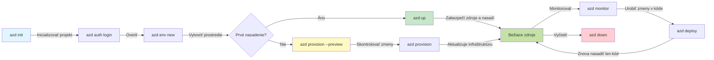
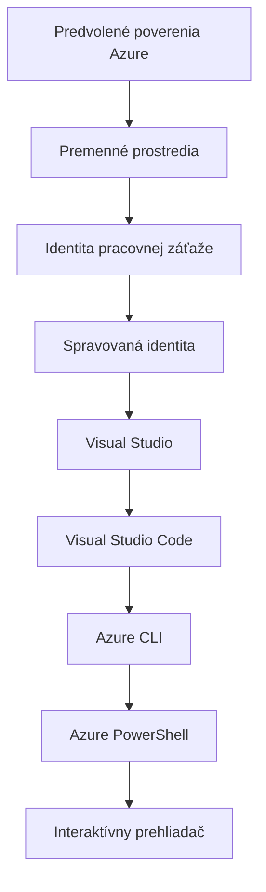

# AZD Základy - Pochopenie Azure Developer CLI

# AZD Základy - Kľúčové koncepty a základy

**Navigácia kapitoly:**
- **📚 Domov kurzu**: [AZD pre začiatočníkov](../../README.md)
- **📖 Aktuálna kapitola**: Kapitola 1 - Základy & Rýchly štart
- **⬅️ Predchádzajúca**: [Prehľad kurzu](../../README.md#-chapter-1-foundation--quick-start)
- **➡️ Ďalšia**: [Inštalácia a nastavenie](installation.md)
- **🚀 Ďalšia kapitola**: [Kapitola 2: Vývoj orientovaný na AI](../chapter-02-ai-development/microsoft-foundry-integration.md)

## Úvod

Táto lekcia vás zoznámi s Azure Developer CLI (azd), výkonným nástrojom príkazového riadku, ktorý zrýchľuje váš prechod od lokálneho vývoja k nasadeniu v Azure. Naučíte sa základné koncepty, hlavné funkcie a pochopíte, ako azd zjednodušuje nasadenie cloud-native aplikácií.

## Ciele učenia

Na konci tejto lekcie budete:
- Rozumieť, čo je Azure Developer CLI a jeho primárnemu účelu
- Naučiť sa základné koncepty šablón, prostredí a služieb
- Preskúmať kľúčové funkcie vrátane vývoja založeného na šablónach a Infrastruktúry ako kódu
- Pochopiť štruktúru projektu azd a pracovný postup
- Byť pripravení nainštalovať a nakonfigurovať azd pre vaše vývojové prostredie

## Výsledky učenia

Po dokončení tejto lekcie budete schopní:
- Vysvetliť rolu azd v moderných workflowoch cloudového vývoja
- Identifikovať komponenty štruktúry projektu azd
- Opísať, ako šablóny, prostredia a služby spolupracujú
- Pochopiť výhody Infrastruktúry ako kódu s azd
- Rozpoznať rôzne príkazy azd a ich účel

## Čo je Azure Developer CLI (azd)?

Azure Developer CLI (azd) je nástroj príkazového riadku navrhnutý na zrýchlenie vášho prechodu od lokálneho vývoja k nasadeniu v Azure. Zjednodušuje proces zostavovania, nasadzovania a správy cloud-native aplikácií v Azure.

### Čo môžete nasadiť pomocou azd?

azd podporuje širokú škálu pracovných záťaží — a zoznam sa neustále rozrastá. Dnes môžete pomocou azd nasadiť:

| Typ pracovnej záťaže | Príklady | Rovnaký pracovný postup? |
|---------------|----------|----------------|
| **Tradičné aplikácie** | Webové aplikácie, REST API, statické stránky | ✅ `azd up` |
| **Služby a mikroslužby** | Container Apps, Function Apps, backendy s viacerými službami | ✅ `azd up` |
| **Aplikácie s podporou AI** | Chat aplikácie s modelmi Microsoft Foundry, RAG riešenia s AI Search | ✅ `azd up` |
| **Inteligentní agenti** | Agenti hostovaní v Foundry, viacagentová orchestrácia | ✅ `azd up` |

Kľúčovým poznatkom je, že **životný cyklus azd zostáva rovnaký bez ohľadu na to, čo nasadzujete**. Inicializujete projekt, pripravíte infraštruktúru, nasadíte svoj kód, sledujete aplikáciu a upracete — či už ide o jednoduchú webovú stránku alebo sofistikovaného AI agenta.

Táto kontinuita je zámerná. azd považuje AI schopnosti za ďalší druh služby, ktorú vaša aplikácia môže využívať, nie za niečo zásadne odlišné. Chat endpoint napájaný modelmi Microsoft Foundry je z pohľadu azd len ďalšia služba, ktorú treba nakonfigurovať a nasadiť.

### 🎯 Prečo používať AZD? Porovnanie z reálneho sveta

Porovnajme nasadenie jednoduchej webovej aplikácie s databázou:

#### ❌ BEZ AZD: Manuálne nasadenie do Azure (30+ minút)

```bash
# Krok 1: Vytvorte skupinu prostriedkov
az group create --name myapp-rg --location eastus

# Krok 2: Vytvorte plán služby App Service
az appservice plan create --name myapp-plan \
  --resource-group myapp-rg \
  --sku B1 --is-linux

# Krok 3: Vytvorte webovú aplikáciu
az webapp create --name myapp-web-unique123 \
  --resource-group myapp-rg \
  --plan myapp-plan \
  --runtime "NODE:18-lts"

# Krok 4: Vytvorte účet Cosmos DB (10–15 minút)
az cosmosdb create --name myapp-cosmos-unique123 \
  --resource-group myapp-rg \
  --kind MongoDB

# Krok 5: Vytvorte databázu
az cosmosdb mongodb database create \
  --account-name myapp-cosmos-unique123 \
  --resource-group myapp-rg \
  --name tododb

# Krok 6: Vytvorte kolekciu
az cosmosdb mongodb collection create \
  --account-name myapp-cosmos-unique123 \
  --resource-group myapp-rg \
  --database-name tododb \
  --name todos

# Krok 7: Získajte reťazec pripojenia
CONN_STR=$(az cosmosdb keys list \
  --name myapp-cosmos-unique123 \
  --resource-group myapp-rg \
  --type connection-strings \
  --query "connectionStrings[0].connectionString" -o tsv)

# Krok 8: Nakonfigurujte nastavenia aplikácie
az webapp config appsettings set \
  --name myapp-web-unique123 \
  --resource-group myapp-rg \
  --settings MONGODB_URI="$CONN_STR"

# Krok 9: Povoľte protokolovanie
az webapp log config --name myapp-web-unique123 \
  --resource-group myapp-rg \
  --application-logging filesystem \
  --detailed-error-messages true

# Krok 10: Nastavte Application Insights
az monitor app-insights component create \
  --app myapp-insights \
  --location eastus \
  --resource-group myapp-rg

# Krok 11: Pripojte App Insights k webovej aplikácii
INSTRUMENTATION_KEY=$(az monitor app-insights component show \
  --app myapp-insights \
  --resource-group myapp-rg \
  --query "instrumentationKey" -o tsv)

az webapp config appsettings set \
  --name myapp-web-unique123 \
  --resource-group myapp-rg \
  --settings APPINSIGHTS_INSTRUMENTATIONKEY="$INSTRUMENTATION_KEY"

# Krok 12: Zostavte aplikáciu lokálne
npm install
npm run build

# Krok 13: Vytvorte balík nasadenia
zip -r app.zip . -x "*.git*" "node_modules/*"

# Krok 14: Nasadenie aplikácie
az webapp deployment source config-zip \
  --resource-group myapp-rg \
  --name myapp-web-unique123 \
  --src app.zip

# Krok 15: Počkajte a modlite sa, nech to funguje 🙏
# (Žiadna automatizovaná validácia, vyžaduje sa manuálne testovanie)
```

**Problémy:**
- ❌ 15+ príkazov na zapamätanie a vykonanie v správnom poradí
- ❌ 30-45 minút manuálnej práce
- ❌ Ľahko sa robiť chyby (preklepy, nesprávne parametre)
- ❌ Pripojovacie reťazce vystavené v histórii terminálu
- ❌ Žiadne automatické vrátenie zmien pri chybe
- ❌ Ťažké replikovať pre členov tímu
- ❌ Každé nasadenie je iné (nereprodukovateľné)

#### ✅ S AZD: Automatizované nasadenie (5 príkazov, 10-15 minút)

```bash
# Krok 1: Inicializovať zo šablóny
azd init --template todo-nodejs-mongo

# Krok 2: Overiť totožnosť
azd auth login

# Krok 3: Vytvoriť prostredie
azd env new dev

# Krok 4: Náhľad zmien (voliteľné, ale odporúčané)
azd provision --preview

# Krok 5: Nasadiť všetko
azd up

# ✨ Hotovo! Všetko je nasadené, nakonfigurované a monitorované
```

**Výhody:**
- ✅ **5 príkazov** vs. 15+ manuálnych krokov
- ✅ **10-15 minút** celkový čas (väčšinou čakanie na Azure)
- ✅ **Žiadne chyby** - automatizované a testované
- ✅ **Tajomstvá bezpečne spravované** cez Key Vault
- ✅ **Automatické vrátenie zmien** pri zlyhaní
- ✅ **Úplná reprodukovateľnosť** - rovnaký výsledok zakaždým
- ✅ **Pripravené pre tím** - ktokoľvek môže nasadiť s rovnakými príkazmi
- ✅ **Infrastruktúra ako kód** - verziované Bicep šablóny
- ✅ **Vstavané sledovanie** - Application Insights nakonfigurovaný automaticky

### 📊 Zníženie času a chýb

| Metrika | Manuálne nasadenie | Nasadenie pomocou AZD | Zlepšenie |
|:-------|:------------------|:---------------|:------------|
| **Príkazy** | 15+ | 5 | 67% menej |
| **Čas** | 30-45 min | 10-15 min | 60% rýchlejšie |
| **Miera chýb** | ~40% | <5% | 88% zníženie |
| **Konzistencia** | Nízka (manuálne) | 100% (automatizované) | Dokonalá |
| **Zavádzanie tímu** | 2-4 hodiny | 30 minút | 75% rýchlejšie |
| **Čas vrátenia zmien** | 30+ min (manuálne) | 2 min (automatizované) | 93% rýchlejšie |

## Základné koncepty

### Šablóny
Šablóny sú základom azd. Obsahujú:
- **Kód aplikácie** - Váš zdrojový kód a závislosti
- **Definície infraštruktúry** - Azure prostriedky definované v Bicep alebo Terraform
- **Konfiguračné súbory** - Nastavenia a premenné prostredia
- **Nasadzovacie skripty** - Automatizované workflowy nasadenia

### Prostredia
Prostredia predstavujú rôzne ciele nasadenia:
- **Vývoj** - Pre testovanie a vývoj
- **Staging** - Predprodukčné prostredie
- **Produkcia** - Živé produkčné prostredie

Každé prostredie si udržiava svoje:
- Skupinu prostriedkov Azure
- Konfiguračné nastavenia
- Stav nasadenia

### Služby
Služby sú stavebné kamene vašej aplikácie:
- **Frontend** - Webové aplikácie, SPA
- **Backend** - API, mikroslužby
- **Databáza** - Riešenia ukladania dát
- **Úložisko** - Súborové a blob úložisko

## Kľúčové funkcie

### 1. Vývoj založený na šablónach
```bash
# Prehliadať dostupné šablóny
azd template list

# Inicializovať zo šablóny
azd init --template <template-name>
```

### 2. Infrastruktúra ako kód
- **Bicep** - doménovo špecifický jazyk Azure
- **Terraform** - nástroj pre infraštruktúru naprieč cloudmi
- **ARM Templates** - Azure Resource Manager šablóny

### 3. Integrované pracovné postupy
```bash
# Kompletný pracovný postup nasadenia
azd up            # Zabezpečenie zdrojov a nasadenie — bezobslužné pri prvom nastavení

# 🧪 NOVÉ: Náhľad zmien infraštruktúry pred nasadením (BEZPEČNÉ)
azd provision --preview    # Simulovať nasadenie infraštruktúry bez vykonania zmien

azd provision     # Vytvoriť zdroje Azure — ak aktualizujete infraštruktúru, použite toto
azd deploy        # Nasadiť kód aplikácie alebo znovu nasadiť kód aplikácie po aktualizácii
azd down          # Vyčistiť zdroje
```

#### 🛡️ Bezpečné plánovanie infraštruktúry s náhľadom
Príkaz `azd provision --preview` je zásadná pomôcka pre bezpečné nasadenia:
- **Analýza suchého behu** - Ukazuje, čo bude vytvorené, zmenené alebo zmazané
- **Žiadne riziko** - Skutočné zmeny nie sú vykonané vo vašom Azure prostredí
- **Spolupráca tímu** - Zdieľajte výsledky náhľadu pred nasadením
- **Odhad nákladov** - Zistite náklady prostriedkov pred záväzkom

```bash
# Ukážkový pracovný postup pre náhľad
azd provision --preview           # Pozrite si, čo sa zmení
# Skontrolujte výstup, prediskutujte to s tímom
azd provision                     # Použite zmeny s istotou
```

### 📊 Vizualizácia: Pracovný postup vývoja v AZD


**Vysvetlenie pracovného postupu:**
1. **Init** - Začnite so šablónou alebo novým projektom
2. **Auth** - Overte sa v Azure
3. **Environment** - Vytvorte izolované nasadzovacie prostredie
4. **Preview** - 🆕 Vždy najprv prezrite zmeny infraštruktúry (bezpečná prax)
5. **Provision** - Vytvorte/aktualizujte Azure prostriedky
6. **Deploy** - Nahrajte svoj aplikačný kód
7. **Monitor** - Sledujte výkon aplikácie
8. **Iterate** - Robte zmeny a znovu nasadzujte kód
9. **Cleanup** - Odstráňte prostriedky po dokončení

### 4. Správa prostredí
```bash
# Vytvárať a spravovať prostredia
azd env new <environment-name>
azd env select <environment-name>
azd env list
```

### 5. Rozšírenia a AI príkazy

azd používa systém rozšírení na pridanie schopností nad rámec jadra CLI. To je obzvlášť užitočné pre AI pracovné zaťaženia:

```bash
# Zobraziť dostupné rozšírenia
azd extension list

# Nainštalovať rozšírenie Foundry agents
azd extension install azure.ai.agents

# Inicializovať projekt AI agenta z manifestu
azd ai agent init -m agent-manifest.yaml

# Spustiť MCP server pre vývoj asistovaný AI (Alfa)
azd mcp start
```

> Rozšírenia sú podrobne pokryté v [Kapitola 2: Vývoj orientovaný na AI](../chapter-02-ai-development/agents.md) a v referencii [AZD AI CLI príkazy](../chapter-08-production/production-ai-practices.md#azd-ai-cli-commands-and-extensions).

## 📁 Štruktúra projektu

Typická štruktúra projektu azd:
```
my-app/
├── .azd/                    # azd configuration
│   └── config.json
├── .azure/                  # Azure deployment artifacts
├── .devcontainer/          # Development container config
├── .github/workflows/      # GitHub Actions
├── .vscode/               # VS Code settings
├── infra/                 # Infrastructure code
│   ├── main.bicep        # Main infrastructure template
│   ├── main.parameters.json
│   └── modules/          # Reusable modules
├── src/                  # Application source code
│   ├── api/             # Backend services
│   └── web/             # Frontend application
├── azure.yaml           # azd project configuration
└── README.md
```

## 🔧 Konfiguračné súbory

### azure.yaml
Hlavný konfiguračný súbor projektu:
```yaml
name: my-awesome-app
metadata:
  template: my-template@1.0.0

services:
  web:
    project: ./src/web
    language: js
    host: appservice
  api:
    project: ./src/api
    language: js
    host: appservice

hooks:
  preprovision:
    shell: pwsh
    run: echo "Preparing to provision..."
```

### .azure/config.json
Konfigurácia špecifická pre prostredie:
```json
{
  "version": 1,
  "defaultEnvironment": "dev",
  "environments": {
    "dev": {
      "subscriptionId": "your-subscription-id",
      "location": "eastus"
    }
  }
}
```

## 🎪 Bežné pracovné postupy s praktickými cvičeniami

> **💡 Tip učenia:** Postupujte podľa týchto cvičení v poradí, aby ste si postupne vybudovali zručnosti v AZD.

### 🎯 Cvičenie 1: Inicializujte svoj prvý projekt

**Cieľ:** Vytvoriť projekt AZD a preskúmať jeho štruktúru

**Kroky:**
```bash
# Použite osvedčenú šablónu
azd init --template todo-nodejs-mongo

# Preskúmajte vygenerované súbory
ls -la  # Zobrazte všetky súbory vrátane skrytých

# Vytvorené kľúčové súbory:
# - azure.yaml (hlavná konfigurácia)
# - infra/ (kód infraštruktúry)
# - src/ (kód aplikácie)
```

**✅ Úspech:** Máte azure.yaml, infra/ a src/ adresáre

---

### 🎯 Cvičenie 2: Nasadiť do Azure

**Cieľ:** Kompletné end-to-end nasadenie

**Kroky:**
```bash
# 1. Autentifikovať sa
az login && azd auth login

# 2. Vytvoriť prostredie
azd env new dev
azd env set AZURE_LOCATION eastus

# 3. Prezrieť zmeny (ODPORÚČANÉ)
azd provision --preview

# 4. Nasadiť všetko
azd up

# 5. Overiť nasadenie
azd show    # 6. Zobraziť URL vašej aplikácie
```

**Očakávaný čas:** 10-15 minút  
**✅ Úspech:** URL aplikácie sa otvorí v prehliadači

---

### 🎯 Cvičenie 3: Viaceré prostredia

**Cieľ:** Nasadiť do dev a staging

**Kroky:**
```bash
# Dev už existuje, vytvorte staging
azd env new staging
azd env set AZURE_LOCATION westus2
azd up

# Prepnite medzi nimi
azd env list
azd env select dev
```

**✅ Úspech:** Dve samostatné skupiny prostriedkov v Azure portáli

---

### 🛡️ Čistý štart: `azd down --force --purge`

Keď potrebujete úplne resetovať:

```bash
azd down --force --purge
```

**Čo to robí:**
- `--force`: Žiadne výzvy na potvrdenie
- `--purge`: Odstráni všetok lokálny stav a Azure prostriedky

**Použite keď:**
- Nasadenie zlyhalo v polovici
- Prechod medzi projektami
- Potrebujete nový začiatok

---

## 🎪 Pôvodná referencia pracovného postupu

### Začatie nového projektu
```bash
# Metóda 1: Použite existujúcu šablónu
azd init --template todo-nodejs-mongo

# Metóda 2: Začnite od nuly
azd init

# Metóda 3: Použite aktuálny priečinok
azd init .
```

### Vývojový cyklus
```bash
# Nastaviť vývojové prostredie
azd auth login
azd env new dev
azd env select dev

# Nasadiť všetko
azd up

# Urobiť zmeny a znovu nasadiť
azd deploy

# Vyčistiť po dokončení
azd down --force --purge # Príkaz v Azure Developer CLI je **tvrdý reset** vášho prostredia—obzvlášť užitočný, keď riešite zlyhané nasadenia, odstraňujete opustené zdroje alebo sa pripravujete na čisté opätovné nasadenie.
```

## Pochopenie `azd down --force --purge`
Príkaz `azd down --force --purge` je silný spôsob, ako úplne rozobrať vaše azd prostredie a všetky s tým spojené prostriedky. Tu je rozpis toho, čo jednotlivé flagy robia:
```
--force
```
- Preskočí výzvy na potvrdenie.
- Užitečné pre automatizáciu alebo skriptovanie, kde manuálny vstup nie je možný.
- Zabezpečí, že rozobratie prebehne bez prerušenia, aj keď CLI zistí nezrovnalosti.

```
--purge
```
Odstraňuje **všetky súvisiace metadáta**, vrátane:
Stav prostredia
Lokálna zložka `.azure`
Cacheované informácie o nasadení
Zabraňuje tomu, aby si azd "pamätal" predchádzajúce nasadenia, čo môže spôsobiť problémy ako nezhodné skupiny prostriedkov alebo zastarané odkazy do registru.


### Prečo použiť obidva?
Keď narazíte na problém s `azd up` spôsobený pretrvávajúcim stavom alebo čiastočnými nasadeniami, táto kombinácia zabezpečí **čistý štart**.

Je to obzvlášť užitočné po manuálnych mazaniach prostriedkov v Azure portáli alebo pri zmene šablón, prostredí alebo konvencií pomenovania skupín prostriedkov.


### Správa viacerých prostredí
```bash
# Vytvoriť prípravné prostredie
azd env new staging
azd env select staging
azd up

# Prepnúť späť na dev
azd env select dev

# Porovnať prostredia
azd env list
```

## 🔐 Autentifikácia a poverenia

Pochopenie autentifikácie je kľúčové pre úspešné nasadenia azd. Azure používa viac metód autentifikácie a azd využíva rovnaký reťazec poverení ako ostatné Azure nástroje.

### Autentifikácia Azure CLI (`az login`)

Pred použitím azd sa musíte overiť v Azure. Najbežnejšia metóda je pomocou Azure CLI:

```bash
# Interaktívne prihlásenie (otvorí prehliadač)
az login

# Prihlásenie s konkrétnym tenantom
az login --tenant <tenant-id>

# Prihlásenie pomocou service principal
az login --service-principal -u <app-id> -p <password> --tenant <tenant-id>

# Skontrolovať aktuálny stav prihlásenia
az account show

# Zoznam dostupných predplatných
az account list --output table

# Nastaviť predvolené predplatné
az account set --subscription <subscription-id>
```

### Priebeh autentifikácie
1. **Interaktívne prihlásenie**: Otvorí váš predvolený prehliadač pre autentifikáciu
2. **Device Code Flow**: Pre prostredia bez prístupu k prehliadaču
3. **Service Principal**: Pre scenáre automatizácie a CI/CD
4. **Managed Identity**: Pre aplikácie hosťované v Azure

### Reťazec DefaultAzureCredential

`DefaultAzureCredential` je typ poverenia, ktorý poskytuje zjednodušený zážitok z autentifikácie tým, že automaticky skúša viacero zdrojov poverení v špecifickom poradí:

#### Poradie reťazca poverení

#### 1. Premenné prostredia
```bash
# Nastavte premenné prostredia pre služobný účet
export AZURE_CLIENT_ID="<app-id>"
export AZURE_CLIENT_SECRET="<password>"
export AZURE_TENANT_ID="<tenant-id>"
```

#### 2. Workload Identity (Kubernetes/GitHub Actions)
Automaticky sa používa v:
- Azure Kubernetes Service (AKS) s Workload Identity
- GitHub Actions s OIDC federáciou
- Iné scenáre federovanej identity

#### 3. Managed Identity
Pre Azure prostriedky ako:
- Virtuálne stroje
- App Service
- Azure Functions
- Container Instances

```bash
# Skontrolovať, či beží na Azure prostriedku so spravovanou identitou
az account show --query "user.type" --output tsv
# Vracia: "servicePrincipal" ak sa používa spravovaná identita
```

#### 4. Integrácia s nástrojmi pre vývojárov
- **Visual Studio**: Automaticky používa prihlásený účet
- **VS Code**: Používa poverenia rozšírenia Azure Account
- **Azure CLI**: Používa poverenia z `az login` (najbežnejšie pre lokálny vývoj)

### Nastavenie autentifikácie AZD

```bash
# Metóda 1: Použiť Azure CLI (Odporúčané pre vývoj)
az login
azd auth login  # Používa existujúce prihlasovacie údaje Azure CLI

# Metóda 2: Priama autentifikácia pomocou azd
azd auth login --use-device-code  # Pre bezhlavé prostredia

# Metóda 3: Skontrolovať stav autentifikácie
azd auth login --check-status

# Metóda 4: Odhlásiť sa a znovu sa prihlásiť
azd auth logout
azd auth login
```

### Najlepšie praktiky autentifikácie

#### Pre lokálny vývoj
```bash
# 1. Prihláste sa pomocou Azure CLI
az login

# 2. Overte správne predplatné
az account show
az account set --subscription "Your Subscription Name"

# 3. Použite azd s existujúcimi prihlasovacími údajmi
azd auth login
```

#### Pre CI/CD pipelines
```yaml
# GitHub Actions example
- name: Azure Login
  uses: azure/login@v1
  with:
    creds: ${{ secrets.AZURE_CREDENTIALS }}

- name: Deploy with azd
  run: |
    azd auth login --client-id ${{ secrets.AZURE_CLIENT_ID }} \
                    --client-secret ${{ secrets.AZURE_CLIENT_SECRET }} \
                    --tenant-id ${{ secrets.AZURE_TENANT_ID }}
    azd up --no-prompt
```

#### Pre produkčné prostredia
- Použite **Managed Identity**, keď bežíte na Azure prostriedkoch
- Použite **Service Principal** pre automatizačné scenáre
- Vyhnite sa ukladaniu poverení v kóde alebo konfiguračných súboroch
- Použite **Azure Key Vault** pre citlivú konfiguráciu

### Bežné problémy s autentifikáciou a riešenia

#### Problém: "No subscription found"
```bash
# Riešenie: Nastavte predvolené predplatné
az account list --output table
az account set --subscription "<subscription-id>"
azd env set AZURE_SUBSCRIPTION_ID "<subscription-id>"
```

#### Problém: "Insufficient permissions"
```bash
# Riešenie: Skontrolujte a priraďte požadované roly
az role assignment list --assignee $(az account show --query user.name --output tsv)

# Bežné požadované roly:
# - Contributor (pre správu prostriedkov)
# - User Access Administrator (pre priraďovanie ról)
```

#### Problém: "Token expired"
```bash
# Riešenie: Znovu overiť identitu
az logout
az login
azd auth logout
azd auth login
```

### Autentifikácia v rôznych scenároch

#### Lokálny vývoj
```bash
# Účet na osobný rozvoj
az login
azd auth login
```

#### Tímový vývoj
```bash
# Použite konkrétneho tenanta pre organizáciu
az login --tenant contoso.onmicrosoft.com
azd auth login
```

#### Scenáre s viacerými tenantmi
```bash
# Prepnúť medzi nájomcami
az login --tenant tenant1.onmicrosoft.com
# Nasadiť do nájomcu 1
azd up

az login --tenant tenant2.onmicrosoft.com  
# Nasadiť do nájomcu 2
azd up
```

### Bezpečnostné úvahy
1. **Ukladanie poverení**: Nikdy neukladajte poverenia v zdrojovom kóde
2. **Obmedzenie rozsahu**: Používajte princíp minimálnych práv pre služobné identity (service principals)
3. **Rotácia tokenov**: Pravidelne rotujte tajomstvá služobných identít
4. **Auditné záznamy**: Monitorujte aktivity overenia a nasadzovania
5. **Sieťové zabezpečenie**: Používajte súkromné koncové body, keď je to možné

### Riešenie problémov s autentifikáciou

```bash
# Ladenie problémov s overovaním
azd auth login --check-status
az account show
az account get-access-token

# Bežné diagnostické príkazy
whoami                          # Kontext aktuálneho používateľa
az ad signed-in-user show      # Podrobnosti používateľa Azure AD
az group list                  # Otestovať prístup k zdroju
```

## Pochopenie `azd down --force --purge`

### Objavovanie
```bash
azd template list              # Prehliadať šablóny
azd template show <template>   # Podrobnosti šablóny
azd init --help               # Možnosti inicializácie
```

### Správa projektu
```bash
azd show                     # Prehľad projektu
azd env show                 # Aktuálne prostredie
azd config list             # Konfiguračné nastavenia
```

### Monitorovanie
```bash
azd monitor                  # Otvoriť monitorovanie v portáli Azure
azd monitor --logs           # Zobraziť protokoly aplikácie
azd monitor --live           # Zobraziť metriky v reálnom čase
azd pipeline config          # Nastaviť CI/CD
```

## Odporúčané postupy

### 1. Používajte zmysluplné názvy
```bash
# Dobré
azd env new production-east
azd init --template web-app-secure

# Vyhnite sa
azd env new env1
azd init --template template1
```

### 2. Využívajte šablóny
- Začnite s existujúcimi šablónami
- Prispôsobte podľa svojich potrieb
- Vytvorte znovupoužiteľné šablóny pre vašu organizáciu

### 3. Izolácia prostredí
- Používajte oddelené prostredia pre dev/staging/prod
- Nikdy nenasadzujte priamo do produkcie z lokálneho počítača
- Používajte CI/CD pipeliny na nasadzovanie do produkcie

### 4. Správa konfigurácie
- Používajte premenné prostredia pre citlivé údaje
- Uchovávajte konfiguráciu v verzovacom systéme
- Dokumentujte nastavenia špecifické pre prostredie

## Postup učenia

### Začiatočník (Týždeň 1-2)
1. Nainštalujte azd a autentifikujte sa
2. Nasadiť jednoduchú šablónu
3. Pochopte štruktúru projektu
4. Naučte sa základné príkazy (up, down, deploy)

### Stredne pokročilý (Týždeň 3-4)
1. Prispôsobte šablóny
2. Spravujte viacero prostredí
3. Pochopte infraštruktúrny kód
4. Nastavte CI/CD pipeliny

### Pokročilý (Týždeň 5+)
1. Vytvorte vlastné šablóny
2. Pokročilé vzory infraštruktúry
3. Nasadenia v mnohých regiónoch
4. Konfigurácie na úrovni podniku

## Ďalšie kroky

**📖 Pokračujte v štúdiu kapitoly 1:**
- [Inštalácia a nastavenie](installation.md) - Nainštalujte a nakonfigurujte azd
- [Váš prvý projekt](first-project.md) - Dokončite praktický tutoriál
- [Sprievodca konfiguráciou](configuration.md) - Pokročilé konfiguračné možnosti

**🎯 Pripravení na ďalšiu kapitolu?**
- [Kapitola 2: Vývoj orientovaný na AI](../chapter-02-ai-development/microsoft-foundry-integration.md) - Začnite vytvárať AI aplikácie

## Ďalšie zdroje

- [Prehľad Azure Developer CLI](https://learn.microsoft.com/en-us/azure/developer/azure-developer-cli/)
- [Galéria šablón](https://azure.github.io/awesome-azd/)
- [Ukážky komunity](https://github.com/Azure-Samples)

---

## 🙋 Často kladené otázky

### Všeobecné otázky

**Q: Aký je rozdiel medzi AZD a Azure CLI?**

A: Azure CLI (`az`) slúži na správu jednotlivých Azure zdrojov. AZD (`azd`) slúži na správu celých aplikácií:

```bash
# Azure CLI - nízkoúrovňová správa zdrojov
az webapp create --name myapp --resource-group rg
az sql server create --name myserver --resource-group rg
# ...je potrebných oveľa viac príkazov

# AZD - správa na úrovni aplikácie
azd up  # Nasadí celú aplikáciu so všetkými zdrojmi
```

**Myslite na to takto:**
- `az` = Operovanie s jednotlivými Lego kockami
- `azd` = Práca s kompletnými Lego súpravami

---

**Q: Musím poznať Bicep alebo Terraform, aby som mohol používať AZD?**

A: Nie! Začnite so šablónami:
```bash
# Použite existujúcu šablónu - nie sú potrebné znalosti IaC
azd init --template todo-nodejs-mongo
azd up
```

Bicep sa môžete naučiť neskôr, aby ste si prispôsobili infraštruktúru. Šablóny poskytujú funkčné príklady, z ktorých sa môžete učiť.

---

**Q: Koľko stojí prevádzka AZD šablón?**

A: Náklady sa líšia podľa šablóny. Väčšina vývojových šablón stojí $50-150/mesiac:

```bash
# Prezrite si náklady pred nasadením
azd provision --preview

# Vždy vyčistite, keď to nepoužívate
azd down --force --purge  # Odstráni všetky zdroje
```

**Praktický tip:** Používajte bezplatné úrovne, kde sú dostupné:
- App Service: úroveň F1 (Free)
- Microsoft Foundry Models: Azure OpenAI 50,000 tokenov/mesiac zadarmo
- Cosmos DB: bezplatná úroveň 1000 RU/s

---

**Q: Môžem používať AZD s existujúcimi Azure zdrojmi?**

A: Áno, ale jednoduchšie je začať od nuly. AZD funguje najlepšie, keď spravuje celý životný cyklus. Pre existujúce zdroje:

```bash
# Možnosť 1: Importovať existujúce zdroje (pre pokročilých)
azd init
# Potom upravte infra/, aby odkazoval na existujúce zdroje

# Možnosť 2: Začať od začiatku (odporúčané)
azd init --template matching-your-stack
azd up  # Vytvorí nové prostredie
```

---

**Q: Ako zdieľam svoj projekt s kolegami?**

A: Commitnite projekt AZD do Gitu (ale NIE priečinok .azure):

```bash
# Už predvolene v .gitignore
.azure/        # Obsahuje tajomstvá a údaje o prostredí
*.env          # Premenné prostredia

# Členovia tímu potom:
git clone <your-repo>
azd auth login
azd env new <their-name>-dev
azd up
```

Každý získa identickú infraštruktúru z rovnakých šablón.

---

### Otázky k riešeniu problémov

**Q: "azd up" zlyhalo v polovici. Čo mám robiť?**

A: Skontrolujte chybu, opravte ju, a potom skúste znova:

```bash
# Zobraziť podrobné záznamy
azd show

# Bežné opravy:

# 1. Ak je prekročená kvóta:
azd env set AZURE_LOCATION "westus2"  # Vyskúšajte iný región

# 2. Ak je názov zdroja v konflikte:
azd down --force --purge  # Začať odznova
azd up  # Skúsiť znova

# 3. Ak vypršal token:
az login
azd auth login
azd up
```

**Najčastejší problém:** Vybrané nesprávne Azure predplatné
```bash
az account list --output table
az account set --subscription "<correct-subscription>"
```

---

**Q: Ako nasadím iba zmeny v kóde bez reprovizionovania?**

A: Použite `azd deploy` namiesto `azd up`:

```bash
azd up          # Prvýkrát: zriadenie + nasadenie (pomalé)

# Urobte zmeny v kóde...

azd deploy      # Pri ďalších spusteniach: iba nasadenie (rýchle)
```

Porovnanie rýchlosti:
- `azd up`: 10-15 minút (zriaďuje infraštruktúru)
- `azd deploy`: 2-5 minút (len kód)

---

**Q: Môžem prispôsobiť šablóny infraštruktúry?**

A: Áno! Upravte súbory Bicep v `infra/`:

```bash
# Po spustení azd init
cd infra/
code main.bicep  # Upraviť vo VS Code

# Náhľad zmien
azd provision --preview

# Použiť zmeny
azd provision
```

**Tip:** Začnite s malými zmenami – najprv zmeňte SKUs:
```bicep
// infra/main.bicep
sku: {
  name: 'B1'  // Change to 'P1V2' for production
}
```

---

**Q: Ako vymažem všetko, čo AZD vytvorilo?**

A: Jeden príkaz odstráni všetky zdroje:

```bash
azd down --force --purge

# Toto odstráni:
# - Všetky prostriedky Azure
# - Skupina prostriedkov
# - Stav lokálneho prostredia
# - Kešované údaje nasadenia
```

**Vždy spustite toto, keď:**
- Dokončili ste testovanie šablóny
- Prechádzate na iný projekt
- Chcete začať od začiatku

**Úspora nákladov:** Odstránenie nepoužívaných zdrojov = žiadne poplatky

---

**Q: Čo ak som omylom vymazal zdroje v Azure Portáli?**

A: Stav AZD sa môže dostať do nesúladu. Prístup 'čistý štart':
```bash
# 1. Odstrániť lokálny stav
azd down --force --purge

# 2. Začať odznova
azd up

# Alternatíva: Nechať AZD zistiť a opraviť
azd provision  # Vytvorí chýbajúce zdroje
```

---

### Pokročilé otázky

**Q: Môžem používať AZD v CI/CD pipelínach?**

A: Áno! Príklad pre GitHub Actions:

```yaml
# .github/workflows/deploy.yml
name: Deploy with AZD

on:
  push:
    branches: [main]

jobs:
  deploy:
    runs-on: ubuntu-latest
    steps:
      - uses: actions/checkout@v2
      
      - name: Install azd
        run: curl -fsSL https://aka.ms/install-azd.sh | bash
      
      - name: Azure Login
        run: |
          azd auth login \
            --client-id ${{ secrets.AZURE_CLIENT_ID }} \
            --client-secret ${{ secrets.AZURE_CLIENT_SECRET }} \
            --tenant-id ${{ secrets.AZURE_TENANT_ID }}
      
      - name: Deploy
        run: azd up --no-prompt
```

---

**Q: Ako spravujem tajomstvá a citlivé údaje?**

A: AZD sa integruje s Azure Key Vault automaticky:

```bash
# Tajomstvá sú uložené v Key Vaulte, nie v kóde
azd env set DATABASE_PASSWORD "$(openssl rand -base64 32)"

# AZD automaticky:
# 1. Vytvorí Key Vault
# 2. Uloží tajomstvo
# 3. Udelí aplikácii prístup prostredníctvom spravovanej identity
# 4. Vloží počas behu
```

**Nikdy do commitu nepridávajte:**
- priečinok `.azure/` (obsahuje údaje prostredia)
- súbory `.env` (lokálne tajomstvá)
- reťazce pripojenia

---

**Q: Môžem nasadiť do viacerých regiónov?**

A: Áno, vytvorte pre každý región prostredie:

```bash
# Prostredie východného USA
azd env new prod-eastus
azd env set AZURE_LOCATION eastus
azd up

# Prostredie západnej Európy
azd env new prod-westeurope
azd env set AZURE_LOCATION westeurope
azd up

# Každé prostredie je nezávislé
azd env list
```

Pre skutočné aplikácie s viacerými regiónmi upravte Bicep šablóny tak, aby sa nasadzovali do viacerých regiónov súčasne.

---

**Q: Kde môžem získať pomoc, ak sa zaseknem?**

1. **Dokumentácia AZD:** https://learn.microsoft.com/azure/developer/azure-developer-cli/
2. **GitHub Issues:** https://github.com/Azure/azure-dev/issues
3. **Discord:** [Azure Discord](https://discord.gg/microsoft-azure) - kanál #azure-developer-cli
4. **Stack Overflow:** Tag `azure-developer-cli`
5. **Tento kurz:** [Sprievodca riešením problémov](../chapter-07-troubleshooting/common-issues.md)

**Praktický tip:** Pred pýtaním sa spustite:
```bash
azd show       # Zobrazuje aktuálny stav
azd version    # Zobrazuje vašu verziu
```
Zahrňte tieto informácie do vašej otázky pre rýchlejšiu pomoc.

---

## 🎓 Čo ďalej?

Teraz rozumiete základom AZD. Vyberte si svoju cestu:

### 🎯 Pre začiatočníkov:
1. **Ďalej:** [Inštalácia a nastavenie](installation.md) - Nainštalujte AZD na svoj stroj
2. **Potom:** [Váš prvý projekt](first-project.md) - Nasadte svoju prvú aplikáciu
3. **Precvičovanie:** Dokončite všetky 3 cvičenia v tejto lekcii

### 🚀 Pre AI vývojárov:
1. **Prejdite na:** [Kapitola 2: Vývoj orientovaný na AI](../chapter-02-ai-development/microsoft-foundry-integration.md)
2. **Nasadiť:** Začnite s `azd init --template get-started-with-ai-chat`
3. **Učte sa:** Budujte počas nasadzovania

### 🏗️ Pre skúsených vývojárov:
1. **Preštudujte si:** [Sprievodca konfiguráciou](configuration.md) - Pokročilé nastavenia
2. **Preskúmajte:** [Infrastruktúra ako kód](../chapter-04-infrastructure/provisioning.md) - Hĺbkový ponor do Bicepu
3. **Vytvorte:** Vytvorte vlastné šablóny pre váš stack

---

**Navigácia kapitol:**
- **📚 Domov kurzu**: [AZD pre začiatočníkov](../../README.md)
- **📖 Aktuálna kapitola**: Kapitola 1 - Základy & Rýchly štart  
- **⬅️ Predchádzajúca**: [Prehľad kurzu](../../README.md#-chapter-1-foundation--quick-start)
- **➡️ Ďalšia**: [Inštalácia a nastavenie](installation.md)
- **🚀 Ďalšia kapitola**: [Kapitola 2: Vývoj orientovaný na AI](../chapter-02-ai-development/microsoft-foundry-integration.md)

---

<!-- CO-OP TRANSLATOR DISCLAIMER START -->
**Vylúčenie zodpovednosti**:
Tento dokument bol preložený pomocou AI prekladateľskej služby [Co-op Translator](https://github.com/Azure/co-op-translator). Hoci sa usilujeme o presnosť, majte, prosím, na pamäti, že automatizované preklady môžu obsahovať chyby alebo nepresnosti. Pôvodný dokument v jeho pôvodnom jazyku by mal byť považovaný za autoritatívny zdroj. Pre kritické informácie sa odporúča profesionálny ľudský preklad. Nie sme zodpovední za žiadne nedorozumenia alebo nesprávne výklady vyplývajúce z použitia tohto prekladu.
<!-- CO-OP TRANSLATOR DISCLAIMER END -->