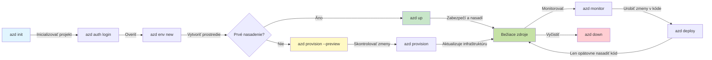
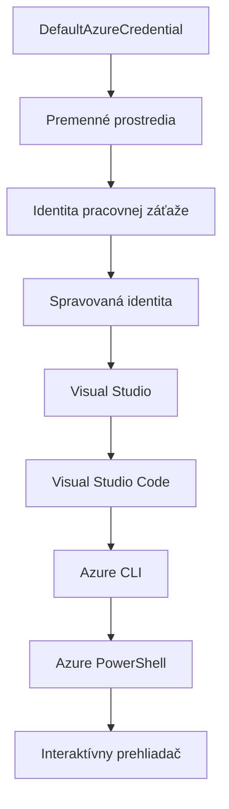

# AZD Základy - Pochopenie Azure Developer CLI

# AZD Základy - Kľúčové Koncepty a Základy

**Navigácia Kapitolami:**
- **📚 Domovská stránka kurzu**: [AZD pre Začiatočníkov](../../README.md)
- **📖 Aktuálna kapitola**: Kapitola 1 - Základy a Rýchly Štart
- **⬅️ Predchádzajúca**: [Prehľad kurzu](../../README.md#-chapter-1-foundation--quick-start)
- **➡️ Nasledujúca**: [Inštalácia & Nastavenie](installation.md)
- **🚀 Nasledujúca kapitola**: [Kapitola 2: Vývoj s AI na prvom mieste](../chapter-02-ai-development/microsoft-foundry-integration.md)

## Úvod

Táto lekcia vás zoznámi s Azure Developer CLI (azd), výkonným príkazovým nástrojom, ktorý urýchľuje vašu cestu od lokálneho vývoja po nasadenie na Azure. Naučíte sa základné koncepty, hlavné funkcie a pochopíte, ako azd zjednodušuje nasadenie cloudovo-natívnych aplikácií.

## Ciele učenia

Na konci tejto lekcie budete:
- Rozumieť tomu, čo je Azure Developer CLI a jeho hlavný účel
- Spoznáte základné koncepty šablón, prostredí a služieb
- Preskúmate kľúčové funkcie vrátane šablónového vývoja a Infrastructure as Code
- Pochopíte štruktúru projektu azd a pracovný tok
- Budete pripravení nainštalovať a nakonfigurovať azd pre vaše vývojové prostredie

## Výsledky učenia

Po dokončení tejto lekcie budete schopní:
- Vysvetliť úlohu azd v moderných cloudových vývojových pracovných tokoch
- Identifikovať súčasti štruktúry projektu azd
- Opísať, ako spolupracujú šablóny, prostredia a služby
- Pochopiť výhody Infrastructure as Code s azd
- Rozpoznať rôzne príkazy azd a ich účely

## Čo je Azure Developer CLI (azd)?

Azure Developer CLI (azd) je príkazový nástroj navrhnutý na urýchlenie vašej cesty od lokálneho vývoja po nasadenie na Azure. Zjednodušuje proces zostavovania, nasadzovania a správy cloudovo-natívnych aplikácií na Azure.

### Čo môžete nasadiť pomocou azd?

azd podporuje širokú škálu pracovných záťaží — a zoznam stále rastie. Dnes môžete použiť azd na nasadenie:

| Typ záťaže | Príklady | Rovnaký pracovný tok? |
|------------|----------|-----------------------|
| **Tradičné aplikácie** | Webové aplikácie, REST API, statické stránky | ✅ `azd up` |
| **Služby a mikroservisy** | Container Apps, Function Apps, viacero služieb backendu | ✅ `azd up` |
| **AI-powered aplikácie** | Chat aplikácie s Microsoft Foundry Modelmi, RAG riešenia s AI Search | ✅ `azd up` |
| **Inteligentní agenti** | Agentúry hostované v Foundry, orchestrácie viacerých agentov | ✅ `azd up` |

Kľúčové zistenie je, že **životný cyklus azd zostáva rovnaký bez ohľadu na to, čo nasadzujete**. Inicializujete projekt, zabezpečíte infraštruktúru, nasadíte kód, monitorujete aplikáciu a upracete — či už ide o jednoduchý web alebo sofistikovaného AI agenta.

Táto kontinuita je zámerná. azd spravuje AI funkcie ako ďalší typ služby, ktorú môže vaša aplikácia použiť, nie ako niečo zásadne odlišné. Chatovacie rozhranie podporované Microsoft Foundry Modelmi je z pohľadu azd len ďalšia služba na konfiguráciu a nasadenie.

### 🎯 Prečo používať AZD? Porovnanie zo skutočného sveta

Pozrime sa na nasadenie jednoduchej webovej aplikácie s databázou:

#### ❌ BEZ AZD: Manuálne nasadenie na Azure (30+ minút)

```bash
# Krok 1: Vytvorte skupinu prostriedkov
az group create --name myapp-rg --location eastus

# Krok 2: Vytvorte plán služby App Service
az appservice plan create --name myapp-plan \
  --resource-group myapp-rg \
  --sku B1 --is-linux

# Krok 3: Vytvorte webovú aplikáciu
az webapp create --name myapp-web-unique123 \
  --resource-group myapp-rg \
  --plan myapp-plan \
  --runtime "NODE:18-lts"

# Krok 4: Vytvorte účet Cosmos DB (10-15 minút)
az cosmosdb create --name myapp-cosmos-unique123 \
  --resource-group myapp-rg \
  --kind MongoDB

# Krok 5: Vytvorte databázu
az cosmosdb mongodb database create \
  --account-name myapp-cosmos-unique123 \
  --resource-group myapp-rg \
  --name tododb

# Krok 6: Vytvorte kolekciu
az cosmosdb mongodb collection create \
  --account-name myapp-cosmos-unique123 \
  --resource-group myapp-rg \
  --database-name tododb \
  --name todos

# Krok 7: Získajte reťazec pripojenia
CONN_STR=$(az cosmosdb keys list \
  --name myapp-cosmos-unique123 \
  --resource-group myapp-rg \
  --type connection-strings \
  --query "connectionStrings[0].connectionString" -o tsv)

# Krok 8: Nakonfigurujte nastavenia aplikácie
az webapp config appsettings set \
  --name myapp-web-unique123 \
  --resource-group myapp-rg \
  --settings MONGODB_URI="$CONN_STR"

# Krok 9: Povoliť zaznamenávanie
az webapp log config --name myapp-web-unique123 \
  --resource-group myapp-rg \
  --application-logging filesystem \
  --detailed-error-messages true

# Krok 10: Nastavte Application Insights
az monitor app-insights component create \
  --app myapp-insights \
  --location eastus \
  --resource-group myapp-rg

# Krok 11: Prepojte App Insights s webovou aplikáciou
INSTRUMENTATION_KEY=$(az monitor app-insights component show \
  --app myapp-insights \
  --resource-group myapp-rg \
  --query "instrumentationKey" -o tsv)

az webapp config appsettings set \
  --name myapp-web-unique123 \
  --resource-group myapp-rg \
  --settings APPINSIGHTS_INSTRUMENTATIONKEY="$INSTRUMENTATION_KEY"

# Krok 12: Lokálne zostavte aplikáciu
npm install
npm run build

# Krok 13: Vytvorte balík nasadenia
zip -r app.zip . -x "*.git*" "node_modules/*"

# Krok 14: Nasadte aplikáciu
az webapp deployment source config-zip \
  --resource-group myapp-rg \
  --name myapp-web-unique123 \
  --src app.zip

# Krok 15: Počkajte a modlite sa, aby to fungovalo 🙏
# (Žiadna automatizovaná validácia, vyžaduje sa manuálne testovanie)
```

**Problémy:**
- ❌ 15+ príkazov na zapamätanie a spustenie v správnom poradí
- ❌ 30-45 minút manuálnej práce
- ❌ Ľahké robiť chyby (preklepy, nesprávne parametre)
- ❌ Prístupové reťazce zobrazené v histórii terminálu
- ❌ Žiadna automatická obnova v prípade chýb
- ❌ Ťažké duplikovať pre členov tímu
- ❌ Každýkrát iné (nereprodukovateľné)

#### ✅ S AZD: Automatizované nasadenie (5 príkazov, 10-15 minút)

```bash
# Krok 1: Inicializujte z šablóny
azd init --template todo-nodejs-mongo

# Krok 2: Overenie
azd auth login

# Krok 3: Vytvorenie prostredia
azd env new dev

# Krok 4: Náhľad zmien (voliteľné, ale odporúčané)
azd provision --preview

# Krok 5: Nasadenie všetkého
azd up

# ✨ Hotovo! Všetko je nasadené, nakonfigurované a monitorované
```

**Výhody:**
- ✅ **5 príkazov** oproti viac ako 15 manuálnym krokom
- ✅ **10-15 minút** celkový čas (väčšinou čakáte na Azure)
- ✅ **Menej manuálnych chýb** - konzistentný, šablónový pracovný tok
- ✅ **Bezpečné spravovanie tajomstiev** - mnoho šablón využíva Azure-managed úložisko tajomstiev
- ✅ **Opakovateľné nasadenia** - rovnaký pracovný tok vždy
- ✅ **Plne reprodukovateľné** - rovnaký výsledok vždy
- ✅ **Pripravené pre tím** - ktokoľvek môže nasadiť rovnakými príkazmi
- ✅ **Infrastructure as Code** - šablóny Bicep s riadením verzií
- ✅ **Vstavaný monitoring** - Application Insights nastavené automaticky

### 📊 Zníženie času & chýb

| Metrika | Manuálne nasadenie | Nasadenie cez AZD | Zlepšenie |
|:---------|:-------------------|:------------------|:----------|
| **Príkazy** | 15+ | 5 | o 67 % menej |
| **Čas** | 30-45 min | 10-15 min | o 60 % rýchlejšie |
| **Chybovosť** | ~40 % | <5 % | o 88 % menej |
| **Konzistencia** | Nízka (manuálna) | 100 % (automatizovaná) | Perfektná |
| **Integrácia tímu** | 2-4 hodiny | 30 minút | o 75 % rýchlejšie |
| **Čas obnovy** | 30+ min (manuálne) | 2 min (automatizované) | o 93 % rýchlejšie |

## Kľúčové koncepty

### Šablóny
Šablóny sú základom azd. Obsahujú:
- **Kód aplikácie** - váš zdrojový kód a závislosti
- **Definície infraštruktúry** - Azure zdroje definované v Bicep alebo Terraforme
- **Konfiguračné súbory** - nastavenia a premenné prostredia
- **Skripty nasadenia** - automatizované pracovné toky nasadenia

### Prostredia
Prostredia reprezentujú rôzne ciele nasadenia:
- **Vývojové** - na testovanie a vývoj
- **Staging** - predprodukčné prostredie
- **Produkčné** - živé produkčné prostredie

Každé prostredie udržiava vlastné:
- skupinu Azure zdrojov
- konfiguračné nastavenia
- stav nasadenia

### Služby
Služby sú stavebné bloky vašej aplikácie:
- **Frontend** - webové aplikácie, SPA
- **Backend** - API, mikroservisy
- **Databáza** - riešenia pre ukladanie dát
- **Ukladanie** - súborové a blob úložisko

## Kľúčové vlastnosti

### 1. Šablóno-riadený vývoj
```bash
# Prezerať dostupné šablóny
azd template list

# Inicializovať z šablóny
azd init --template <template-name>
```

### 2. Infrastructure as Code
- **Bicep** - doménovo špecifický jazyk Azure
- **Terraform** - nástroj pre multi-cloud infraštruktúru
- **ARM šablóny** - Azure Resource Manager šablóny

### 3. Integrované pracovné toky
```bash
# Kompletný pracovný postup nasadenia
azd up            # Poskytovanie + Nasadenie, toto je bez zásahu pri prvom nastavení

# 🧪 NOVÉ: Náhľad zmien infraštruktúry pred nasadením (BEZPEČNÉ)
azd provision --preview    # Simulovať nasadenie infraštruktúry bez vykonania zmien

azd provision     # Vytvoriť Azure zdroje, ak aktualizujete infraštruktúru, použite toto
azd deploy        # Nasadiť aplikačný kód alebo znovu nasadiť aplikačný kód po aktualizácii
azd down          # Vyčistiť zdroje
```

#### 🛡️ Bezpečné plánovanie infraštruktúry s náhľadom
Príkaz `azd provision --preview` je prelomový pre bezpečné nasadenia:
- **Suchý beh (dry-run) analýza** - ukazuje, čo bude vytvorené, upravené alebo odstránené
- **Žiadne riziko** - v Azure prostredí sa nijaké zmeny neurobia
- **Spolupráca tímu** - zdieľajte výsledky náhľadu pred nasadením
- **Odhad nákladov** - pochopíte náklady na zdroje pred záväzkom

```bash
# Ukážka pracovného postupu
azd provision --preview           # Pozrite sa, čo sa zmení
# Skontrolujte výstup, diskutujte s tímom
azd provision                     # Aplikujte zmeny s dôverou
```

### 📊 Vizualizácia: AZD vývojový pracovný tok


**Vysvetlenie pracovného toku:**
1. **Init** - začnite so šablónou alebo novým projektom
2. **Auth** - autentifikácia v Azure
3. **Environment** - vytvorenie izolovaného prostredia nasadenia
4. **Preview** - 🆕 vždy najskôr náhľad zmien infraštruktúry (bezpečný postup)
5. **Provision** - vytvorenie/aktualizácia Azure zdrojov
6. **Deploy** - nasadenie vášho aplikačného kódu
7. **Monitor** - sledovanie výkonu aplikácie
8. **Iterate** - úprava a opakované nasadenie kódu
9. **Cleanup** - odstránenie zdrojov po dokončení

### 4. Správa prostredí
```bash
# Vytvárajte a spravujte prostredia
azd env new <environment-name>
azd env select <environment-name>
azd env list
```

### 5. Rozšírenia a AI príkazy

azd používa systém rozšírení na pridávanie funkcií nad rámec základného CLI. To je obzvlášť užitočné pre AI pracovné záťaže:

```bash
# Zoznam dostupných rozšírení
azd extension list

# Nainštalujte rozšírenie Foundry agents
azd extension install azure.ai.agents

# Inicializujte projekt AI agenta z manifestu
azd ai agent init -m agent-manifest.yaml

# Spustite server MCP pre AI-asistovaný vývoj (Alfa)
azd mcp start
```

> Rozšírenia sú podrobne rozobraté v [Kapitola 2: Vývoj s AI na prvom mieste](../chapter-02-ai-development/agents.md) a v referencii [AZD AI CLI Príkazy](../chapter-08-production/production-ai-practices.md#azd-ai-cli-commands-and-extensions).

## 📁 Štruktúra projektu

Typická štruktúra projektu azd:
```
my-app/
├── .azd/                    # azd configuration
│   └── config.json
├── .azure/                  # Azure deployment artifacts
├── .devcontainer/          # Development container config
├── .github/workflows/      # GitHub Actions
├── .vscode/               # VS Code settings
├── infra/                 # Infrastructure code
│   ├── main.bicep        # Main infrastructure template
│   ├── main.parameters.json
│   └── modules/          # Reusable modules
├── src/                  # Application source code
│   ├── api/             # Backend services
│   └── web/             # Frontend application
├── azure.yaml           # azd project configuration
└── README.md
```

## 🔧 Konfiguračné súbory

### azure.yaml
Hlavný konfiguračný súbor projektu:
```yaml
name: my-awesome-app
metadata:
  template: my-template@1.0.0

services:
  web:
    project: ./src/web
    language: js
    host: appservice
  api:
    project: ./src/api
    language: js
    host: appservice

hooks:
  preprovision:
    shell: pwsh
    run: echo "Preparing to provision..."
```

### .azure/config.json
Konfigurácia špecifická pre prostredie:
```json
{
  "version": 1,
  "defaultEnvironment": "dev",
  "environments": {
    "dev": {
      "subscriptionId": "your-subscription-id",
      "location": "eastus"
    }
  }
}
```

## 🎪 Bežné pracovné toky s praktickými cvičeniami

> **💡 Tip na učenie:** Nasledujte tieto cvičenia v poradí a postupne si vytvorte AZD zručnosti.

### 🎯 Cvičenie 1: Inicializujte svoj prvý projekt

**Cieľ:** Vytvoriť projekt AZD a preskúmať jeho štruktúru

**Kroky:**
```bash
# Použite overenú šablónu
azd init --template todo-nodejs-mongo

# Preskúmajte vygenerované súbory
ls -la  # Zobraziť všetky súbory vrátane skrytých

# Vytvorené kľúčové súbory:
# - azure.yaml (hlavná konfigurácia)
# - infra/ (kód infraštruktúry)
# - src/ (kód aplikácie)
```

**✅ Úspech:** Máte adresáre azure.yaml, infra/, a src/

---

### 🎯 Cvičenie 2: Nasadenie na Azure

**Cieľ:** Dokončiť end-to-end nasadenie

**Kroky:**
```bash
# 1. Overiť totožnosť
az login && azd auth login

# 2. Vytvoriť prostredie
azd env new dev
azd env set AZURE_LOCATION eastus

# 3. Náhľad zmien (ODPORÚČANÉ)
azd provision --preview

# 4. Nasadiť všetko
azd up

# 5. Overiť nasadenie
azd show    # Zobraziť URL svojej aplikácie
```

**Očakávaný čas:** 10-15 minút  
**✅ Úspech:** URL aplikácie sa otvorí v prehliadači

---

### 🎯 Cvičenie 3: Viaceré prostredia

**Cieľ:** Nasadiť do prostredia dev a staging

**Kroky:**
```bash
# Už existuje dev, vytvorte staging
azd env new staging
azd env set AZURE_LOCATION westus2
azd up

# Prepnúť medzi nimi
azd env list
azd env select dev
```

**✅ Úspech:** Dve samostatné skupiny zdrojov v Azure portáli

---

### 🛡️ Čistý štart: `azd down --force --purge`

Keď potrebujete kompletný reset:

```bash
azd down --force --purge
```

**Čo to robí:**
- `--force`: Bez potvrdzovacích výziev
- `--purge`: Vymaže všetky lokálne stavy a Azure zdroje

**Použitie keď:**
- Nasadenie sa nepodarilo v polovici
- Prechádzate medzi projektmi
- Potrebujete čerstvý začiatok

---

## 🎪 Pôvodná referencia pracovného toku

### Začatie nového projektu
```bash
# Metóda 1: Použiť existujúcu šablónu
azd init --template todo-nodejs-mongo

# Metóda 2: Začať od začiatku
azd init

# Metóda 3: Použiť aktuálny adresár
azd init .
```

### Vývojový cyklus
```bash
# Nastaviť vývojové prostredie
azd auth login
azd env new dev
azd env select dev

# Nasadiť všetko
azd up

# Urobiť zmeny a znovu nasadiť
azd deploy

# Vyčistiť po dokončení
azd down --force --purge # Príkaz v Azure Developer CLI je **tvrdý reset** pre vaše prostredie – obzvlášť užitočný, keď riešite zlyhané nasadenia, čistíte opustené zdroje alebo pripravujete nové nasadenie.
```

## Pochopenie `azd down --force --purge`
Príkaz `azd down --force --purge` je výkonný spôsob, ako úplne rozobrať vaše azd prostredie a všetky s tým spojené zdroje. Tu je rozpis, čo jednotlivé prepínače robia:
```
--force
```
- Preskakuje potvrdzovacie výzvy.
- Užitočné pre automatizáciu alebo skriptovanie, kde manuálny vstup nie je možný.
- Zaisťuje, že rozobratie pokračuje bez prerušenia, aj keď CLI zistí nezrovnalosti.

```
--purge
```
Vymazáva **všetko súvisiace s metadátami**, vrátane:
Stavu prostredia  
Lokálneho priečinka `.azure`  
Kešovaných informácií o nasadení  
Zabraňuje azd "pamätať si" predchádzajúce nasadenia, čo môže spôsobiť problémy ako nesúlady skupín zdrojov alebo zastaralé registry.

### Prečo použiť oba?
Keď narazíte na problém s `azd up` kvôli pretrvávajúcim stavom alebo čiastočným nasadeniam, táto kombinácia zabezpečí **čistý štart**.

Je mimoriadne užitočné po manuálnych zmazaniach zdrojov v Azure portáli alebo pri prechode na iné šablóny, prostredia či pomenovacie konvencie skupín zdrojov.

### Správa viacerých prostredí
```bash
# Vytvorte staging prostredie
azd env new staging
azd env select staging
azd up

# Prepnúť späť na vývoj
azd env select dev

# Porovnať prostredia
azd env list
```

## 🔐 Autentifikácia a povolenia

Pochopenie autentifikácie je kľúčové pre úspešné nasadenia s azd. Azure používa viacero autentifikačných metód a azd využíva tú istú reťazec poverení ako iné Azure nástroje.

### Azure CLI autentifikácia (`az login`)

Pred použitím azd potrebujete autentifikovať v Azure. Najčastejšia metóda je cez Azure CLI:

```bash
# Interaktívne prihlásenie (otvorí prehliadač)
az login

# Prihlásenie s konkrétnym prenajímateľom
az login --tenant <tenant-id>

# Prihlásenie pomocou servisného princípu
az login --service-principal -u <app-id> -p <password> --tenant <tenant-id>

# Skontrolovať aktuálny stav prihlásenia
az account show

# Zoznam dostupných predplatných
az account list --output table

# Nastaviť predvolené predplatné
az account set --subscription <subscription-id>
```

### Priebeh autentifikácie
1. **Interaktívne prihlásenie**: Otvorí váš predvolený prehliadač pre autentifikáciu
2. **Device Code Flow**: Pre prostredia bez prístupu k prehliadaču
3. **Service Principal**: Pre automatizáciu a CI/CD scenáre
4. **Managed Identity**: Pre aplikácie hosťované na Azure

### DefaultAzureCredential reťazec

`DefaultAzureCredential` je typ poverenia, ktorý poskytuje zjednodušenú autentifikačnú skúsenosť tým, že automaticky skúša viaceré zdroje poverení v špecifickom poradí:

#### Poradie v reťazci poverení

#### 1. Premenné prostredia
```bash
# Nastavte premenné prostredia pre služobného používateľa
export AZURE_CLIENT_ID="<app-id>"
export AZURE_CLIENT_SECRET="<password>"
export AZURE_TENANT_ID="<tenant-id>"
```

#### 2. Workload Identity (Kubernetes/GitHub Actions)
Používa sa automaticky v:
- Azure Kubernetes Service (AKS) s Workload Identity
- GitHub Actions s OIDC federáciou
- Iné federované scenáre identity

#### 3. Managed Identity
Pre Azure zdroje ako:
- Virtuálne stroje
- App Service
- Azure Functions
- Container Instances

```bash
# Skontrolujte, či sa spúšťa na zdroji Azure s riadenou identitou
az account show --query "user.type" --output tsv
# Vracia: "servicePrincipal", ak sa používa riadená identita
```

#### 4. Integrácia s vývojovými nástrojmi
- **Visual Studio**: automaticky používa prihlásený účet
- **VS Code**: používa poverenia rozšírenia Azure Account
- **Azure CLI**: používa poverenia z `az login` (najčastejšie pre lokálny vývoj)

### Nastavenie autentifikácie AZD

```bash
# Metóda 1: Použite Azure CLI (Odporúčané pre vývoj)
az login
azd auth login  # Používa existujúce poverenia Azure CLI

# Metóda 2: Priama autentifikácia azd
azd auth login --use-device-code  # Pre bezhlavé prostredia

# Metóda 3: Skontrolujte stav autentifikácie
azd auth login --check-status

# Metóda 4: Odhlásiť sa a znovu sa autentifikovať
azd auth logout
azd auth login
```

### Najlepšie praktiky autentifikácie

#### Pre lokálny vývoj
```bash
# 1. Prihláste sa pomocou Azure CLI
az login

# 2. Overte správne predplatné
az account show
az account set --subscription "Your Subscription Name"

# 3. Použite azd s existujúcimi povereniami
azd auth login
```

#### Pre CI/CD pipeline
```yaml
# GitHub Actions example
- name: Azure Login
  uses: azure/login@v1
  with:
    creds: ${{ secrets.AZURE_CREDENTIALS }}

- name: Deploy with azd
  run: |
    azd auth login --client-id ${{ secrets.AZURE_CLIENT_ID }} \
                    --client-secret ${{ secrets.AZURE_CLIENT_SECRET }} \
                    --tenant-id ${{ secrets.AZURE_TENANT_ID }}
    azd up --no-prompt
```

#### Pre produkčné prostredia
- Používajte **Managed Identity** pri prevádzke na Azure zdrojoch
- Pre automatizáciu používajte **Service Principal**
- Vyhnite sa ukladaniu poverení v kóde alebo konfiguračných súboroch
- Používajte **Azure Key Vault** pre citlivé konfigurácie

### Bežné problémy s autentifikáciou a riešenia

#### Problém: "Nie je nájdené žiadne predplatné"
```bash
# Riešenie: Nastavte predplatné ako predvolené
az account list --output table
az account set --subscription "<subscription-id>"
azd env set AZURE_SUBSCRIPTION_ID "<subscription-id>"
```

#### Problém: "Nedostatočné oprávnenia"
```bash
# Riešenie: Skontrolujte a priraďte požadované role
az role assignment list --assignee $(az account show --query user.name --output tsv)

# Bežné požadované role:
# - Prispievateľ (pre správu zdrojov)
# - Správca prístupu používateľov (pre priraďovanie rolí)
```

#### Problém: "Platnosť tokenu vypršala"
```bash
# Riešenie: Opätovné overenie identity
az logout
az login
azd auth logout
azd auth login
```

### Autentifikácia v rôznych scénároch

#### Lokálny vývoj
```bash
# Účet osobného rozvoja
az login
azd auth login
```

#### Tímový vývoj
```bash
# Použite konkrétny nájomca pre organizáciu
az login --tenant contoso.onmicrosoft.com
azd auth login
```

#### Multi-tenant scenáre
```bash
# Prepnúť medzi nájomcami
az login --tenant tenant1.onmicrosoft.com
# Nasadiť do nájomcu 1
azd up

az login --tenant tenant2.onmicrosoft.com  
# Nasadiť do nájomcu 2
azd up
```

### Bezpečnostné aspekty
1. **Ukladanie poverení**: Nikdy neukladajte poverenia priamo v zdrojovom kóde  
2. **Obmedzenie rozsahu**: Používajte princíp minimálnych oprávnení pre servisné účty  
3. **Rotácia tokenov**: Pravidelne meňte tajomstvá servisných účtov  
4. **Auditné záznamy**: Monitorujte autentifikačné a nasadzovacie aktivity  
5. **Sieťová bezpečnosť**: Používajte súkromné koncové body, ak je to možné

### Riešenie problémov s autentifikáciou

```bash
# Ladenie problémov s overením
azd auth login --check-status
az account show
az account get-access-token

# Bežné diagnostické príkazy
whoami                          # Aktuálny používateľský kontext
az ad signed-in-user show      # Podrobnosti používateľa Azure AD
az group list                  # Testovať prístup k zdroju
```

## Pochopenie `azd down --force --purge`

### Objavovanie
```bash
azd template list              # Prezerať šablóny
azd template show <template>   # Detaily šablóny
azd init --help               # Možnosti inicializácie
```

### Správa projektov
```bash
azd show                     # Prehľad projektu
azd env list                # Dostupné prostredia a vybrané predvolené
azd config show            # Nastavenia konfigurácie
```

### Monitorovanie
```bash
azd monitor                  # Otvorte monitorovanie Azure portálu
azd monitor --logs           # Zobraziť denníky aplikácie
azd monitor --live           # Zobraziť živé metriky
azd pipeline config          # Nastaviť CI/CD
```

## Najlepšie postupy

### 1. Používajte výstižné názvy
```bash
# Dobrý
azd env new production-east
azd init --template web-app-secure

# Vyhnúť sa
azd env new env1
azd init --template template1
```

### 2. Využívajte šablóny
- Začnite s existujúcimi šablónami  
- Prispôsobte si ich podľa svojich potrieb  
- Vytvorte znovupoužiteľné šablóny pre vašu organizáciu

### 3. Izolácia prostredí
- Používajte oddelené prostredia pre vývoj/testovanie/produkciu  
- Nikdy nenasadzujte priamo do produkcie zo svojho lokálneho stroja  
- Používajte CI/CD pipeline pre produkčné nasadenia

### 4. Správa konfigurácie
- Pre citlivé údaje používajte premenné prostredia  
- Konfiguráciu uchovávajte vo verziovacom systéme  
- Dokumentujte nastavenia špecifické pre prostredie

## Postup učenia

### Začiatočník (týždeň 1-2)
1. Nainštalujte azd a autentifikujte sa  
2. Nasadte jednoduchú šablónu  
3. Pochopte štruktúru projektu  
4. Naučte sa základné príkazy (up, down, deploy)

### Pokročilý začiatočník (týždeň 3-4)
1. Prispôsobte šablóny  
2. Spravujte viacero prostredí  
3. Pochopte infraštruktúrny kód  
4. Nastavte CI/CD pipeline

### Pokročilý (týždeň 5+)
1. Vytvorte vlastné šablóny  
2. Pokročilé vzory infraštruktúry  
3. Nasadenia v niekoľkých regiónoch  
4. Konfigurácie na podnikovej úrovni

## Ďalšie kroky

**📖 Pokračujte v prvej kapitole učenia:**
- [Inštalácia a nastavenie](installation.md) - Ako nainštalovať a nakonfigurovať azd  
- [Váš prvý projekt](first-project.md) - Kompletný praktický tutoriál  
- [Sprievodca konfiguráciou](configuration.md) - Pokročilé možnosti konfigurácie

**🎯 Pripravení na ďalšiu kapitolu?**
- [Kapitola 2: Vývoj s prioritou AI](../chapter-02-ai-development/microsoft-foundry-integration.md) - Začnite budovať AI aplikácie

## Ďalšie zdroje

- [Prehľad Azure Developer CLI](https://learn.microsoft.com/en-us/azure/developer/azure-developer-cli/)
- [Galéria šablón](https://azure.github.io/awesome-azd/)
- [Ukážky z komunity](https://github.com/Azure-Samples)

---

## 🙋 Často kladené otázky

### Všeobecné otázky

**Otázka: Aký je rozdiel medzi AZD a Azure CLI?**

Odpoveď: Azure CLI (`az`) slúži na správu jednotlivých Azure zdrojov. AZD (`azd`) spravuje celé aplikácie:

```bash
# Azure CLI - Správa zdrojov na nízkej úrovni
az webapp create --name myapp --resource-group rg
az sql server create --name myserver --resource-group rg
# ...potrebných oveľa viac príkazov

# AZD - Správa na úrovni aplikácie
azd up  # Nasadí celú aplikáciu so všetkými zdrojmi
```

**Predstavte si to takto:**  
- `az` = Práca s jednotlivými Lego tehličkami  
- `azd` = Práca s kompletnými Lego setmi

---

**Otázka: Musím poznať Bicep alebo Terraform na používanie AZD?**

Odpoveď: Nie! Začnite so šablónami:  
```bash
# Použite existujúcu šablónu - nie je potrebná znalosť IaC
azd init --template todo-nodejs-mongo
azd up
```

Neskôr sa môžete naučiť Bicep, aby ste prispôsobili infraštruktúru. Šablóny poskytujú funkčné príklady na učenie.

---

**Otázka: Koľko stojí prevádzka AZD šablón?**

Odpoveď: Náklady sa líšia podľa šablóny. Väčšina vývojových šablón stojí 50-150 USD mesačne:

```bash
# Prezrite si náklady pred nasadením
azd provision --preview

# Vždy vyčistite po použití
azd down --force --purge  # Odstráni všetky zdroje
```

**Praktický tip:** Využívajte bezplatné úrovne, ak sú k dispozícii:  
- App Service: F1 (bezplatná) úroveň  
- Microsoft Foundry Models: Azure OpenAI 50 000 tokenov mesačne zadarmo  
- Cosmos DB: 1000 RU/s bezplatná úroveň

---

**Otázka: Môžem použiť AZD s existujúcimi Azure zdrojmi?**

Odpoveď: Áno, ale jednoduchšie je začať odznova. AZD najlepšie funguje, keď spravuje celý životný cyklus. Pre existujúce zdroje:  
```bash
# Možnosť 1: Importovať existujúce zdroje (pokročilé)
azd init
# Potom upravte infra/, aby odkazoval na existujúce zdroje

# Možnosť 2: Začať od začiatku (odporúčané)
azd init --template matching-your-stack
azd up  # Vytvorí nové prostredie
```

---

**Otázka: Ako zdieľať projekt s tímom?**

Odpoveď: Commitnite AZD projekt do Gitu (ale NIE .azure priečinok):

```bash
# Už predvolene v .gitignore
.azure/        # Obsahuje tajomstvá a údaje prostredia
*.env          # Premenné prostredia

# Členovia tímu potom:
git clone <your-repo>
azd auth login
azd env new <their-name>-dev
azd up
```

Každý tak získa identickú infraštruktúru zo rovnakých šablón.

---

### Otázky k riešeniu problémov

**Otázka: „azd up“ zlyhal v polovici. Čo mám robiť?**

Odpoveď: Skontrolujte chybu, opravte ju a skúste znova:

```bash
# Zobraziť podrobné protokoly
azd show

# Bežné opravy:

# 1. Ak bola prekročená kvóta:
azd env set AZURE_LOCATION "westus2"  # Skúste inú oblasť

# 2. Ak konflikt názvu zdroja:
azd down --force --purge  # Vyčistiť
azd up  # Skúsiť znova

# 3. Ak vypršala autorizácia:
az login
azd auth login
azd up
```

**Najčastejšia chyba:** Nesprávne vybraný Azure subscription  
```bash
az account list --output table
az account set --subscription "<correct-subscription>"
```

---

**Otázka: Ako nasadiť len zmeny v kóde bez reprovízie infraštruktúry?**

Odpoveď: Použite `azd deploy` namiesto `azd up`:

```bash
azd up          # Prvýkrát: príprava + nasadenie (pomalé)

# Vykonajte zmeny v kóde...

azd deploy      # Následné razy: iba nasadenie (rýchle)
```

Porovnanie rýchlosti:  
- `azd up`: 10-15 minút (provízia infraštruktúry)  
- `azd deploy`: 2-5 minút (len kód)

---

**Otázka: Môžem prispôsobiť infraštruktúrne šablóny?**

Odpoveď: Áno! Upraviť môžete Bicep súbory v `infra/`:

```bash
# Po azd init
cd infra/
code main.bicep  # Upraviť vo VS Code

# Náhľad zmien
azd provision --preview

# Použiť zmeny
azd provision
```

**Tip:** Začnite s malými zmenami - najskôr SKU:  
```bicep
// infra/main.bicep
sku: {
  name: 'B1'  // Change to 'P1V2' for production
}
```

---

**Otázka: Ako odstránim všetko, čo AZD vytvoril?**

Odpoveď: Jediný príkaz odstráni všetky zdroje:

```bash
azd down --force --purge

# Toto vymaže:
# - Všetky Azure zdroje
# - Skupinu zdrojov
# - Stav lokálneho prostredia
# - Cache nasadených údajov
```

**Používajte to vždy keď:**  
- Dokončíte testovanie šablóny  
- Prechádzate na iný projekt  
- Chcete začať odznova

**Úspora nákladov:** Odstránenie nepoužívaných zdrojov znamená 0 poplatkov

---

**Otázka: Čo ak som omylom vymazal zdroje v Azure Portáli?**

Odpoveď: Stav AZD sa môže nesynchronizovať. Použite prístup „čistá doska“:

```bash
# 1. Odstrániť lokálny stav
azd down --force --purge

# 2. Začať od začiatku
azd up

# Alternatíva: Nechať AZD detekovať a opraviť
azd provision  # Vytvorí chýbajúce zdroje
```

---

### Pokročilé otázky

**Otázka: Môžem použiť AZD v CI/CD pipeline?**

Odpoveď: Áno! Tu je príklad GitHub Actions:

```yaml
# .github/workflows/deploy.yml
name: Deploy with AZD

on:
  push:
    branches: [main]

jobs:
  deploy:
    runs-on: ubuntu-latest
    steps:
      - uses: actions/checkout@v2
      
      - name: Install azd
        run: curl -fsSL https://aka.ms/install-azd.sh | bash
      
      - name: Azure Login
        run: |
          azd auth login \
            --client-id ${{ secrets.AZURE_CLIENT_ID }} \
            --client-secret ${{ secrets.AZURE_CLIENT_SECRET }} \
            --tenant-id ${{ secrets.AZURE_TENANT_ID }}
      
      - name: Deploy
        run: azd up --no-prompt
```

---

**Otázka: Ako spravujem tajomstvá a citlivé údaje?**

Odpoveď: AZD sa automaticky integruje s Azure Key Vault:

```bash
# Tajomstvá sú uložené v Key Vault, nie v kóde
azd env set DATABASE_PASSWORD "$(openssl rand -base64 32)"

# AZD automaticky:
# 1. Vytvorí Key Vault
# 2. Uloží tajomstvo
# 3. Udelí prístup aplikácii cez spravovanú identitu
# 4. Vstrčí počas behu programu
```

**Nikdy necommitujte:**  
- `.azure/` priečinok (obsahuje dáta prostredia)  
- `.env` súbory (lokálne tajomstvá)  
- Reťazce pripojenia

---

**Otázka: Môžem nasadiť do viacerých regiónov?**

Odpoveď: Áno, vytvorte si prostredie pre každý región:

```bash
# Prostredie Východné USA
azd env new prod-eastus
azd env set AZURE_LOCATION eastus
azd up

# Prostredie Západná Európa
azd env new prod-westeurope
azd env set AZURE_LOCATION westeurope
azd up

# Každé prostredie je nezávislé
azd env list
```

Pre skutočné multi-region aplikácie prispôsobte Bicep šablóny na súbežné nasadenie do viacerých regiónov.

---

**Otázka: Kde môžem získať pomoc, keď uviaznem?**

1. **Dokumentácia AZD:** https://learn.microsoft.com/azure/developer/azure-developer-cli/  
2. **GitHub Issues:** https://github.com/Azure/azure-dev/issues  
3. **Discord:** [Azure Discord](https://discord.gg/microsoft-azure) - kanál #azure-developer-cli  
4. **Stack Overflow:** Tag `azure-developer-cli`  
5. **Tento kurz:** [Sprievodca riešením problémov](../chapter-07-troubleshooting/common-issues.md)

**Praktický tip:** Pred otázkou spustite:  
```bash
azd show       # Zobrazuje aktuálny stav
azd version    # Zobrazuje vašu verziu
```
  
Pridajte tieto informácie do vašej otázky pre rýchlejšiu pomoc.

---

## 🎓 Čo ďalej?

Teraz rozumiete základom AZD. Vyberte si svoju cestu:

### 🎯 Pre začiatočníkov:  
1. **Ďalej:** [Inštalácia a nastavenie](installation.md) - Nainštalujte AZD na svoj počítač  
2. **Potom:** [Váš prvý projekt](first-project.md) - Nasadte svoju prvú aplikáciu  
3. **Precvičovanie:** Dokončite všetky 3 cvičenia v tejto lekcii

### 🚀 Pre AI vývojárov:  
1. **Preskočte na:** [Kapitola 2: Vývoj s prioritou AI](../chapter-02-ai-development/microsoft-foundry-integration.md)  
2. **Nasadenie:** Začnite s `azd init --template get-started-with-ai-chat`  
3. **Naučte sa:** Stavajte počas nasadenia

### 🏗️ Pre skúsených vývojárov:  
1. **Preštudujte:** [Sprievodca konfiguráciou](configuration.md) - Pokročilé nastavenia  
2. **Preskúmajte:** [Infraštuktúra ako kód](../chapter-04-infrastructure/provisioning.md) - Hlbší pohľad na Bicep  
3. **Stavajte:** Vytvorte vlastné šablóny pre svoj stack

---

**Navigácia kapitol:**  
- **📚 Domov kurzu**: [AZD pre začiatočníkov](../../README.md)  
- **📖 Aktuálna kapitola**: Kapitola 1 - Základy a rýchly štart  
- **⬅️ Predchádzajúca**: [Prehľad kurzu](../../README.md#-chapter-1-foundation--quick-start)  
- **➡️ Ďalšia**: [Inštalácia a nastavenie](installation.md)  
- **🚀 Nasledujúca kapitola**: [Kapitola 2: Vývoj s prioritou AI](../chapter-02-ai-development/microsoft-foundry-integration.md)

---

<!-- CO-OP TRANSLATOR DISCLAIMER START -->
**Zrieknutie sa zodpovednosti**:
Tento dokument bol preložený pomocou AI prekladateľskej služby [Co-op Translator](https://github.com/Azure/co-op-translator). Aj keď sa snažíme o presnosť, majte prosím na pamäti, že automatizované preklady môžu obsahovať chyby alebo nepresnosti. Pôvodný dokument v jeho rodnom jazyku by sa mal považovať za autoritatívny zdroj. Pre kritické informácie sa odporúča profesionálny ľudský preklad. Nie sme zodpovední za akékoľvek nedorozumenia alebo nesprávne interpretácie vyplývajúce z použitia tohto prekladu.
<!-- CO-OP TRANSLATOR DISCLAIMER END -->