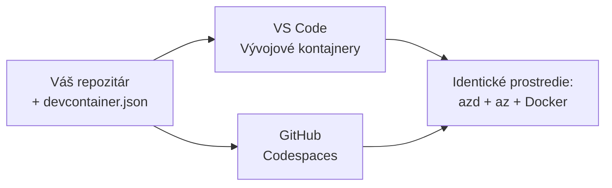

# Dev kontajnery & GitHub Codespaces pre azd

**Navigácia kapitoly:**
- **📚 Domov kurzu**: [AZD pre začiatočníkov](../../README.md)
- **📖 Aktuálna kapitola**: Kapitola 1 - Základy a Rýchly štart
- **⬅️ Predchádzajúca**: [Prineste svoju aplikáciu](bring-your-own-app.md)
- **🚀 Ďalšia kapitola**: [Kapitola 2: Vývoj orientovaný na AI](../chapter-02-ai-development/README.md)

> Overené s `azd 1.25.6` v júni 2026.

## Úvod

Inštalácia azd, správneho runtime jazyka, Dockeru a Azure CLI na každý počítač je zdĺhavá úloha — a je to hlavný dôvod, prečo tutoriál, ktorý "funguje u mňa", zlyhá u niekoho iného. **dev container** to rieši tým, že celý váš toolchain popíše v jednom súbore. Každý, kto otvorí projekt vo VS Code alebo v GitHub Codespaces, dostane presne rovnaké prostredie s predinštalovaným azd. Táto lekcia vám ukáže, ako ho pridať.

## Ciele lekcie

Na konci tejto lekcie budete:
- Pochopíte, čo je dev container a prečo pomáha pri práci s azd
- Pridať minimálny `.devcontainer/devcontainer.json` do projektu
- Zahrnúť azd, Azure CLI a Docker pomocou *funkcií* Dev Container
- Otvoriť projekt v GitHub Codespaces alebo VS Code

## Výstupy lekcie

Po dokončení tejto lekcie budete vedieť:
- Vytvoriť súbor `devcontainer.json` pre projekt azd
- Pridať azd a nástroje Azure bez manuálnych inštalácií
- Spustiť `azd up` z vnútra kontajnera alebo Codespace

---

## Čo je dev container?

Dev container je Dockerom založené vývojové prostredie definované súborom `.devcontainer/devcontainer.json` vo vašom repozitári. Keď otvoríte projekt:

- **VS Code** (s rozšírením Dev Containers) vytvorí kontajner a pripojí sa k nemu.
- **GitHub Codespaces** vytvorí rovnaký kontajner v cloude a poskytne editor v prehliadači.

Tak či onak, každý prispievateľ dostane identické nástroje — žiadne "nainštaloval si azd?" ladenie.



---

## Krok 1: Vytvorte súbor devcontainer

Vytvorte `.devcontainer/devcontainer.json` v koreňovom adresári vášho projektu:

```json
{
  "name": "azd-project",
  "image": "mcr.microsoft.com/devcontainers/base:bookworm",
  "features": {
    "ghcr.io/devcontainers/features/azure-cli:1": {},
    "ghcr.io/azure/azure-dev/azd:latest": {},
    "ghcr.io/devcontainers/features/docker-in-docker:2": {},
    "ghcr.io/devcontainers/features/node:1": {}
  },
  "customizations": {
    "vscode": {
      "extensions": [
        "ms-azuretools.azure-dev",
        "ms-azuretools.vscode-bicep"
      ]
    }
  },
  "forwardPorts": [3000],
  "postCreateCommand": "azd version"
}
```

Čo ktorá časť robí:

| Key | Purpose |
|-----|---------|
| `image` | Základný OS pre kontajner |
| `features` | Predpripravené inštalátory — tu: Azure CLI, **azd**, Docker a Node.js |
| `customizations.vscode.extensions` | Automaticky inštaluje rozšírenia azd a Bicep pre VS Code |
| `forwardPorts` | Sprístupní port vašej aplikácie v prehliadači |
| `postCreateCommand` | Spustí sa raz po vytvorení kontajnera (tu kontrola správnosti) |

> Funkcia `ghcr.io/azure/azure-dev/azd:latest` je oficiálny spôsob, ako získať azd v kontajneri. Pre reprodukovateľnosť pripnite konkrétnu verziu (napríklad `azd:1.25.6`).

---

## Krok 2: Prispôsobte feature jazyku vašej aplikácie

Nahraďte feature `node` tým, čo vaša aplikácia používa:

```jsonc
// Python project
"ghcr.io/devcontainers/features/python:1": {},

// .NET project
"ghcr.io/devcontainers/features/dotnet:2": {},

// Java project
"ghcr.io/devcontainers/features/java:1": {},

// Go project
"ghcr.io/devcontainers/features/go:1": {}
```

Ponechajte `docker-in-docker`, ak váš `host` je `containerapp`, `aks` alebo čokoľvek, čo vytvára obraz kontajnera — azd potrebuje Docker na zostavenie a push obrazov.

---

## Krok 3: Otvorte to

**Vo VS Code:**
1. Nainštalujte rozšírenie **Dev Containers**.
2. Otvorte priečinok projektu.
3. Kliknite na **Reopen in Container**, keď sa zobrazí výzva (alebo spustite *Dev Containers: Reopen in Container*).

**V GitHub Codespaces:**
1. Pushnite repozitár na GitHub.
2. Kliknite **Code → Codespaces → Create codespace on main**.
3. Počkajte, kým sa kontajner zostaví — azd je pripravené v termináli.

---

## Krok 4: Nasadiť z vnútra kontajnera

Kontajner má azd predinštalované, takže bežný pracovný postup funguje bez ďalších úprav:

```bash
azd auth login --use-device-code   # kód zariadenia je praktický v Codespaces
azd up
```

> **Prečo `--use-device-code`?** Vo vzdialenom kontajneri alebo Codespace nie je lokálny prehliadač na presmerovanie, takže prihlasovanie cez device-code je spoľahlivé riešenie. Vložíte kód do záložky prehliadača, aby ste dokončili prihlásenie.

---

## Bežné problémy

| Problém | Riešenie |
|---------|-----|
| `azd up` nemôže zostaviť obraz | Pridajte feature `docker-in-docker` |
| Prihlasovanie cez prehliadač zamŕza v Codespaces | Použite `azd auth login --use-device-code` |
| Nástroje sa líšia medzi členmi tímu | Zafixujte verzie funkcií (napr. `azd:1.25.6`) |
| Aplikácia nie je prístupná v prehliadači | Pridajte port do `forwardPorts` |

---

## Zhrnutie

- Dev container zabezpečí, že nástroje azd budú pre každého reprodukovateľné.
- Pridajte azd, Azure CLI a Docker pomocou *funkcií* Dev Container.
- Prispôsobte jazykovú funkciu podľa vašej aplikácie a ponechajte `docker-in-docker` pre hostiteľov kontajnerov.
- Pri spúšťaní v Codespaces používajte prihlasovanie cez device-code.

---

## 🔗 Navigácia

| Smer | Zdroj |
|-----------|----------|
| **Predchádzajúca** | [Prineste svoju aplikáciu](bring-your-own-app.md) |
| **Domov kapitoly** | [Kapitola 1: Základy a Rýchly štart](README.md) |
| **Ďalšia kapitola** | [Kapitola 2: Vývoj orientovaný na AI](../chapter-02-ai-development/README.md) |

## 📖 Súvisiace zdroje

- [Inštalácia a nastavenie](installation.md)
- [Rýchly prehľad príkazov](../../resources/cheat-sheet.md)
- [Oficiálna špecifikácia Dev Containers](https://containers.dev/)
- [Funkcia azd Dev Container](https://github.com/Azure/azure-dev/tree/main/ext/devcontainer)

---

<!-- CO-OP TRANSLATOR DISCLAIMER START -->
**Vyhlásenie o zodpovednosti**:
Tento dokument bol preložený pomocou AI prekladateľskej služby [Co-op Translator](https://github.com/Azure/co-op-translator). Hoci sa snažíme o presnosť, vezmite prosím na vedomie, že automatické preklady môžu obsahovať chyby alebo nepresnosti. Pôvodný dokument v jeho natívnom jazyku by mal byť považovaný za autoritatívny zdroj. Pre kritické informácie sa odporúča profesionálny ľudský preklad. Nie sme zodpovední za žiadne nedorozumenia alebo nesprávne interpretácie vyplývajúce z použitia tohto prekladu.
<!-- CO-OP TRANSLATOR DISCLAIMER END -->