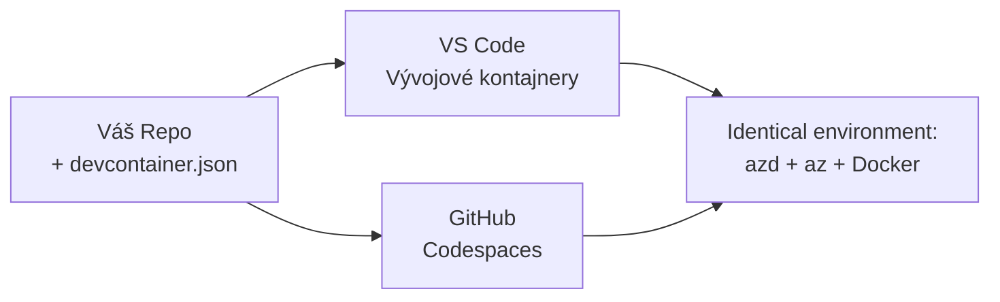

# Vývojové kontajnery & GitHub Codespaces pre azd

**Navigácia kapitol:**
- **📚 Domov kurzu**: [AZD pre Začiatočníkov](../../README.md)
- **📖 Aktuálna kapitola**: Kapitola 1 - Základy a rýchly štart
- **⬅️ Predchádzajúca**: [Použiť vlastnú aplikáciu](bring-your-own-app.md)
- **🚀 Ďalšia kapitola**: [Kapitola 2: Vývoj založený na AI](../chapter-02-ai-development/README.md)

> Overené na `azd 1.27.1` v júli 2026.

## Úvod

Inštalácia azd, správneho runtime jazyka, Dockeru a Azure CLI na každom počítači je otrava – a je to hlavným dôvodom, prečo návod, ktorý "funguje na mojom počítači," zlyhá pre niekoho iného. **Vývojový kontajner** to rieši tak, že celý váš nástrojový reťazec popisuje v jednom súbore. Ktokoľvek otvorí projekt vo VS Code alebo GitHub Codespaces má presne rovnaké prostredie s už nainštalovaným azd. Táto lekcia vám ukáže, ako jeden pridať.

## Ciele učenia

Na konci tejto lekcie budete:
- Rozumieť, čo je vývojový kontajner a prečo pomáha s azd
- Pridať minimálny `.devcontainer/devcontainer.json` do projektu
- Zahŕňať azd, Azure CLI a Docker cez *funkcie* vývojového kontajnera
- Otvoriť projekt v GitHub Codespaces alebo VS Code

## Výstupy učenia

Po dokončení tejto lekcie budete schopní:
- Vytvoriť `devcontainer.json` pre projekt azd
- Pridať azd a Azure nástroje bez manuálnych inštalácií
- Spustiť `azd up` z kontajnera alebo Codespace

---

## Čo je vývojový kontajner?

Vývojový kontajner je Docker-založené vývojové prostredie definované súborom `.devcontainer/devcontainer.json` vo vašom repozitári. Keď otvoríte projekt:

- **VS Code** (s rozšírením Dev Containers) kontajner zostaví a pripojí sa k nemu.
- **GitHub Codespaces** zostaví rovnaký kontajner v cloude a poskytne vám editor v prehliadači.

Každopádne, každý prispievateľ má identické nástroje – bez riešenia problémov typu "nainštaloval si azd?"



---

## Krok 1: Vytvorte súbor devcontainer

Vytvorte `.devcontainer/devcontainer.json` v koreňovom adresári vášho projektu:

```json
{
  "name": "azd-project",
  "image": "mcr.microsoft.com/devcontainers/base:bookworm",
  "features": {
    "ghcr.io/devcontainers/features/azure-cli:1": {},
    "ghcr.io/azure/azure-dev/azd:latest": {},
    "ghcr.io/devcontainers/features/docker-in-docker:2": {},
    "ghcr.io/devcontainers/features/node:1": {}
  },
  "customizations": {
    "vscode": {
      "extensions": [
        "ms-azuretools.azure-dev",
        "ms-azuretools.vscode-bicep"
      ]
    }
  },
  "forwardPorts": [3000],
  "postCreateCommand": "azd version"
}
```

Čo každá časť robí:

| Kľúč | Účel |
|-----|--------|
| `image` | Základný operačný systém pre kontajner |
| `features` | Predinštalované balíčky – tu: Azure CLI, **azd**, Docker a Node.js |
| `customizations.vscode.extensions` | Automatická inštalácia rozšírení azd a Bicep pre VS Code |
| `forwardPorts` | Sprístupňuje port vašej aplikácie prehliadaču |
| `postCreateCommand` | Spustí sa raz po zostavení kontajnera (tu, kontrola správnosti) |

> Funkcia `ghcr.io/azure/azure-dev/azd:latest` je oficiálny spôsob, ako získať azd v kontajneri. Ak potrebujete reprodukovateľnosť, pripnite konkrétnu verziu (napríklad `azd:1.27.1`).

---

## Krok 2: Zmente funkciu podľa jazyka vašej aplikácie

Vymieňte funkciu `node` za tú, ktorú vaša aplikácia používa:

```jsonc
// Python project
"ghcr.io/devcontainers/features/python:1": {},

// .NET project
"ghcr.io/devcontainers/features/dotnet:2": {},

// Java project
"ghcr.io/devcontainers/features/java:1": {},

// Go project
"ghcr.io/devcontainers/features/go:1": {}
```

Zachovajte `docker-in-docker`, ak je váš `host` `containerapp`, `aks` alebo čokoľvek, čo vytvára image kontajnera – azd potrebuje Docker na zostavenie a odoslanie image.

---

## Krok 3: Otvorte projekt

**Vo VS Code:**
1. Nainštalujte rozšírenie **Dev Containers**.
2. Otvorte projektový priečinok.
3. Kliknite na **Reopen in Container**, keď budete vyzvaní (alebo spustite *Dev Containers: Reopen in Container*).

**V GitHub Codespaces:**
1. Nahrajte repo do GitHubu.
2. Kliknite na **Code → Codespaces → Create codespace on main**.
3. Počkajte, kým sa kontajner zostaví – azd je pripravený v termináli.

---

## Krok 4: Deploy z kontajnera

Kontajner má azd predinštalovaný, takže bežný pracovný postup funguje bez problémov:

```bash
azd auth login --use-device-code   # kód zariadenia je užitočný v rámci Codespaces
azd up
```

> **Prečo `--use-device-code`?** V diaľkovom kontajneri alebo Codespace nie je lokálny prehliadač na presmerovanie, takže login pomocou device-kódu je spoľahlivá cesta. Skopírujete kód do prehliadača a dokončíte prihlásenie.

---

## Bežné problémy

| Problém | Riešenie |
|---------|----------|
| `azd up` nedokáže zostaviť image | Pridajte funkciu `docker-in-docker` |
| Prihlásenie v prehliadači v Codespaces sa zasekáva | Použite `azd auth login --use-device-code` |
| Nástroje sa líšia medzi členmi tímu | Pripnite verzie funkcií (napr. `azd:1.27.1`) |
| Aplikácia nie je dostupná v prehliadači | Pridajte port do `forwardPorts` |

---

## Zhrnutie

- Vývojový kontajner robí váš nástrojový reťazec azd reprodukovateľným pre každého.
- Pridajte azd, Azure CLI a Docker cez *funkcie* vývojového kontajnera.
- Pripravte jazykovú funkciu pre vašu aplikáciu a nechajte `docker-in-docker` pre domény kontajnera.
- Používajte device-kód pre prihlasovanie pri behu v Codespaces.

---

## 🔗 Navigácia

| Smer | Zdroj |
|-------|------|
| **Predchádzajúca** | [Použiť vlastnú aplikáciu](bring-your-own-app.md) |
| **Domov kapitoly** | [Kapitola 1: Základy a rýchly štart](README.md) |
| **Ďalšia kapitola** | [Kapitola 2: Vývoj založený na AI](../chapter-02-ai-development/README.md) |

## 📖 Súvisiace zdroje

- [Inštalácia a nastavenie](installation.md)
- [Prehľad príkazov](../../resources/cheat-sheet.md)
- [Oficiálna špecifikácia vývojových kontajnerov](https://containers.dev/)
- [Funkcia azd Dev Container](https://github.com/Azure/azure-dev/tree/main/ext/devcontainer)

---

<!-- CO-OP TRANSLATOR DISCLAIMER START -->
**Vyhlásenie o zodpovednosti**:
Tento dokument bol preložený pomocou AI prekladateľskej služby [Co-op Translator](https://github.com/Azure/co-op-translator). Hoci sa snažíme o presnosť, vezmite prosím na vedomie, že automatické preklady môžu obsahovať chyby alebo nepresnosti. Pôvodný dokument v jeho natívnom jazyku by mal byť považovaný za autoritatívny zdroj. Pre kritické informácie sa odporúča profesionálny ľudský preklad. Nie sme zodpovední za žiadne nedorozumenia alebo nesprávne interpretácie vyplývajúce z použitia tohto prekladu.
<!-- CO-OP TRANSLATOR DISCLAIMER END -->