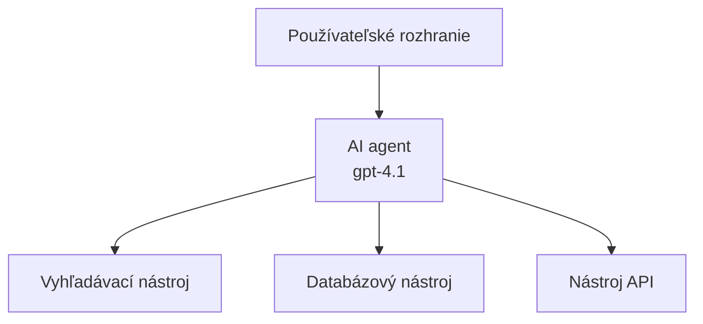
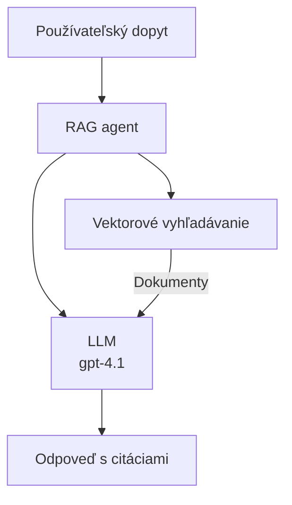
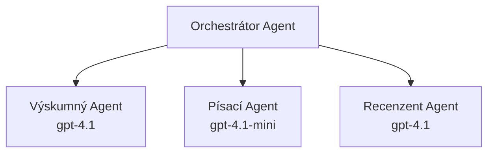

# AI agenti s Azure Developer CLI

**Navigácia v kapitole:**
- **📚 Domov kurzu**: [AZD pre začiatočníkov](../../README.md)
- **📖 Aktuálna kapitola**: Kapitola 2 - Vývoj orientovaný na AI
- **⬅️ Predchádzajúce**: [Integrácia Microsoft Foundry](microsoft-foundry-integration.md)
- **➡️ Ďalšie**: [Nasadenie AI modelu](ai-model-deployment.md)
- **🚀 Pokročilé**: [Riešenia s viacerými agentmi](../../examples/retail-scenario.md)

---

## Úvod

AI agenti sú autonómne programy, ktoré dokážu vnímať svoje prostredie, robiť rozhodnutia a vykonávať akcie na dosiahnutie konkrétnych cieľov. Na rozdiel od jednoduchých chatbotov, ktoré reagujú na požiadavky, agenti môžu:

- **Používať nástroje** - Volanie API, vyhľadávanie v databázach, vykonávanie kódu
- **Plánovať a rozumovať** - Rozložiť zložité úlohy na kroky
- **Učiť sa z kontextu** - Udržiavať pamäť a prispôsobovať správanie
- **Spolupracovať** - Spolupracovať s inými agentmi (multi-agentné systémy)

Tento návod vám ukáže, ako nasadiť AI agentov do Azure pomocou Azure Developer CLI (azd).

## Ciele učenia

Po dokončení tohto návodu budete:
- Rozumieť, čo sú AI agenti a ako sa líšia od chatbotov
- Nasadiť predpripravené šablóny AI agentov pomocou AZD
- Nakonfigurovať Foundry Agenty pre vlastné agenty
- Implementovať základné vzory agentov (použitie nástrojov, RAG, multi-agent)
- Monitorovať a debugovať nasadené agenti

## Výsledky učenia

Po dokončení budete schopní:
- Nasadiť AI agent aplikácie do Azure jedným príkazom
- Nakonfigurovať nástroje a schopnosti agenta
- Implementovať retrieval-augmented generation (RAG) s agentmi
- Navrhnúť multi-agentné architektúry pre zložité pracovné postupy
- Riešiť bežné problémy pri nasadzovaní agentov

---

## 🤖 Čím sa agent líši od chatbota?

| Funkcia | Chatbot | AI agent |
|---------|---------|----------|
| **Správanie** | Reaguje na požiadavky | Vykonáva autonómne akcie |
| **Nástroje** | Žiadne | Môže volať API, vyhľadávať, vykonávať kód |
| **Pamäť** | Iba relácia | Trvalá pamäť naprieč reláciami |
| **Plánovanie** | Jednorazová odpoveď | Viacstupňové uvažovanie |
| **Spolupráca** | Jednotlivý subjekt | Môže spolupracovať s inými agentmi |

### Jednoduchá analógia

- **Chatbot** = Úslužná osoba odpovedajúca na otázky pri informačnom pulte
- **AI agent** = Osobný asistent, ktorý môže telefonovať, dohadovať stretnutia a vykonávať úlohy za vás

---

## 🚀 Rýchly štart: Nasadte svojho prvého agenta

### Možnosť 1: Šablóna Foundry Agents (odporúčané)

```bash
# Inicializovať šablónu AI agentov
azd init --template get-started-with-ai-agents

# Nasadiť do Azure
azd up
```

**Čo sa nasadí:**
- ✅ Foundry Agents
- ✅ Microsoft Foundry Models (gpt-4.1)
- ✅ Azure AI Search (pre RAG)
- ✅ Azure Container Apps (webové rozhranie)
- ✅ Application Insights (monitorovanie)

**Čas:** ~15-20 minút
**Cena:** ~$100-150/mesiac (vývoj)

### Možnosť 2: OpenAI Agent s Prompty

```bash
# Inicializovať šablónu agenta založenú na Prompty
azd init --template agent-openai-python-prompty

# Nasadiť do Azure
azd up
```

**Čo sa nasadí:**
- ✅ Azure Functions (serverless vykonávanie agenta)
- ✅ Microsoft Foundry Models
- ✅ Prompty konfiguračné súbory
- ✅ Ukážková implementácia agenta

**Čas:** ~10-15 minút
**Cena:** ~$50-100/mesiac (vývoj)

### Možnosť 3: RAG Chat Agent

```bash
# Inicializovať RAG chatovú šablónu
azd init --template azure-search-openai-demo

# Nasadiť do Azure
azd up
```

**Čo sa nasadí:**
- ✅ Microsoft Foundry Models
- ✅ Azure AI Search so vzorovými dátami
- ✅ Pipeline na spracovanie dokumentov
- ✅ Chatové rozhranie s citáciami

**Čas:** ~15-25 minút
**Cena:** ~$80-150/mesiac (vývoj)

### Možnosť 4: AZD AI Agent Init (na základe manifestu)

Ak máte súbor manifestu agenta, môžete použiť príkaz `azd ai`, aby ste priamo scaffoldovali projekt Foundry Agent Service:

```bash
# Nainštalovať rozšírenie AI agentov
azd extension install azure.ai.agents

# Inicializovať z manifestu agenta
azd ai agent init -m agent-manifest.yaml

# Nasadiť do Azure
azd up
```

**Kedy použiť `azd ai agent init` vs `azd init --template`:**

| Prístup | Najlepšie pre | Ako to funguje |
|----------|----------|------|
| `azd init --template` | Začínanie z fungujúcou ukážkovou aplikáciou | Klonuje plné repozitár šablóny s kódom + infra |
| `azd ai agent init -m` | Vytváranie z vlastného manifestu agenta | Generuje štruktúru projektu z definície agenta |

> **Tip:** Použite `azd init --template` pri učení (Možnosti 1-3 vyššie). Použite `azd ai agent init`, keď vytvárate produkčné agenti s vlastnými manifestami. Pozrite si [Príkazy AZD AI CLI](../chapter-08-production/production-ai-practices.md#azd-ai-cli-commands-and-extensions) pre úplný prehľad.

---

## 🏗️ Vzory architektúry agentov

### Vzor 1: Jeden agent s nástrojmi

Najjednoduchší vzor agenta - jeden agent, ktorý dokáže používať viacero nástrojov.


**Najlepšie pre:**
- Boti zákazníckej podpory
- Asistenti pre výskum
- Agenti na analýzu dát

**AZD šablóna:** `azure-search-openai-demo`

### Vzor 2: RAG agent (Retrieval-Augmented Generation)

Agent, ktorý pred generovaním odpovedí vyhľadá relevantné dokumenty.


**Najlepšie pre:**
- Podnikové znalostné bázy
- Systémy Q&A nad dokumentmi
- Právny a compliance výskum

**AZD šablóna:** `azure-search-openai-demo`

### Vzor 3: Multi-Agentný systém

Viacerí špecializovaní agenti pracujúci spoločne na zložitých úlohách.


**Najlepšie pre:**
- Zložité generovanie obsahu
- Viacstupňové pracovné postupy
- Úlohy vyžadujúce rôzne odbornosti

**Viac informácií:** [Koordinačné vzory pre multi-agentné systémy](../chapter-06-pre-deployment/coordination-patterns.md)

---

## ⚙️ Konfigurácia nástrojov agenta

Agenti získavajú silu, keď môžu používať nástroje. Tu je návod, ako nakonfigurovať bežné nástroje:

### Konfigurácia nástrojov vo Foundry Agents

```python
# agent_config.py
from azure.ai.projects import AIProjectClient
from azure.ai.projects.models import FunctionTool, CodeInterpreterTool

# Definovať vlastné nástroje
search_tool = FunctionTool(
    name="search_knowledge_base",
    description="Search the company knowledge base for relevant documents",
    parameters={
        "type": "object",
        "properties": {
            "query": {
                "type": "string",
                "description": "The search query"
            }
        },
        "required": ["query"]
    }
)

# Vytvoriť agenta s nástrojmi
agent = project_client.agents.create_agent(
    model="gpt-4.1",
    name="Support Agent",
    instructions="You are a helpful support agent. Use the search tool to find relevant information.",
    tools=[search_tool, CodeInterpreterTool()]
)
```

### Konfigurácia prostredia

```bash
# Nastaviť premenné prostredia špecifické pre agenta
azd env set AZURE_OPENAI_MODEL "gpt-4.1"
azd env set AGENT_INSTRUCTIONS "You are a helpful assistant..."
azd env set ENABLE_CODE_INTERPRETER "true"
azd env set ENABLE_FILE_SEARCH "true"

# Nasadiť s aktualizovanou konfiguráciou
azd deploy
```

---

## 📊 Monitorovanie agentov

### Integrácia Application Insights

Všetky AZD šablóny agentov obsahujú Application Insights na monitorovanie:

```bash
# Otvoriť monitorovací panel
azd monitor --overview

# Zobraziť záznamy v reálnom čase
azd monitor --logs

# Zobraziť metriky v reálnom čase
azd monitor --live
```

### Kľúčové metriky na sledovanie

| Metrika | Popis | Cieľ |
|--------|-------------|--------|
| Latencia odpovede | Čas na vygenerovanie odpovede | < 5 sekúnd |
| Využitie tokenov | Tokeny na požiadavku | Monitorovať kvôli nákladom |
| Miera úspešnosti volaní nástrojov | % úspešných vykonaní nástrojov | > 95% |
| Miera chýb | Neúspešné požiadavky agenta | < 1% |
| Spokojnosť používateľov | Skóre spätnej väzby | > 4.0/5.0 |

### Vlastné logovanie pre agentov

```python
import os
from azure.monitor.opentelemetry import configure_azure_monitor
from opentelemetry import trace

# Nakonfigurujte Azure Monitor pomocou OpenTelemetry
configure_azure_monitor(
    connection_string=os.environ["APPLICATIONINSIGHTS_CONNECTION_STRING"]
)

tracer = trace.get_tracer(__name__)

def log_agent_interaction(user_query, agent_response, tools_used, latency_ms):
    with tracer.start_as_current_span("agent_interaction") as span:
        span.set_attributes({
            "user_query": user_query,
            "response_length": len(agent_response),
            "tools_used": tools_used,
            "latency_ms": latency_ms
        })
```

> **Poznámka:** Nainštalujte požadované balíčky: `pip install azure-monitor-opentelemetry opentelemetry`

---

## 💰 Zváženie nákladov

### Odhadované mesačné náklady podľa vzoru

| Vzor | Vývojové prostredie | Produkcia |
|---------|-----------------|------------|
| Jeden agent | $50-100 | $200-500 |
| RAG agent | $80-150 | $300-800 |
| Viac-agentný (2-3 agenti) | $150-300 | $500-1,500 |
| Podnikový multi-agent | $300-500 | $1,500-5,000+ |

### Tipy na optimalizáciu nákladov

1. **Použite gpt-4.1-mini pre jednoduché úlohy**
   ```bash
   azd env set AZURE_OPENAI_MODEL "gpt-4.1-mini"
   ```

2. **Implementujte cache pre opakované dotazy**
   ```python
   from functools import lru_cache
   
   @lru_cache(maxsize=1000)
   def get_cached_response(query_hash):
       return agent.run(query_hash)
   ```

3. **Nastavte limity tokenov na beh**
   ```python
   # Nastavte max_completion_tokens pri spustení agenta, nie počas jeho vytvárania
   run = project_client.agents.create_run(
       thread_id=thread.id,
       agent_id=agent.id,
       max_completion_tokens=1000  # Obmedzte dĺžku odpovede
   )
   ```

4. **Zmenšite škálovanie na nulu, keď sa nepoužíva**
   ```bash
   # Container Apps sa automaticky škálujú na nulu
   azd env set MIN_REPLICAS "0"
   ```

---

## 🔧 Riešenie problémov s agentmi

### Bežné problémy a riešenia

<details>
<summary><strong>❌ Agent neodpovedá na volania nástrojov</strong></summary>

```bash
# Skontrolujte, či sú nástroje správne zaregistrované
azd show

# Overte nasadenie OpenAI
az cognitiveservices account deployment list \
  --name $AZURE_OPENAI_NAME \
  --resource-group $RG_NAME

# Skontrolujte protokoly agenta
azd monitor --logs
```

**Bežné príčiny:**
- Nesúlad signatúry funkcie nástroja
- Chýbajúce potrebné povolenia
- API koncový bod nie je dostupný
</details>

<details>
<summary><strong>❌ Vysoká latencia v odpovediach agenta</strong></summary>

```bash
# Skontrolujte Application Insights kvôli úzkym miestam
azd monitor --live

# Zvážte použitie rýchlejšieho modelu
azd env set AZURE_OPENAI_MODEL "gpt-4.1-mini"
azd deploy
```

**Tipy na optimalizáciu:**
- Používajte streamovanie odpovedí
- Implementujte cache odpovedí
- Znížte veľkosť kontextového okna
</details>

<details>
<summary><strong>❌ Agent vracia nesprávne alebo halucinované informácie</strong></summary>

```python
# Vylepšiť pomocou lepších systémových pokynov
instructions = """
You are a helpful assistant. IMPORTANT:
- Only answer based on provided context
- If you don't know, say "I don't know"
- Always cite your sources
- Never make up information
"""

# Pridať získavanie údajov pre zakotvenie
agent = project_client.agents.create_agent(
    model="gpt-4.1",
    instructions=instructions,
    tools=[FileSearchTool()]  # Zakotviť odpovede v dokumentoch
)
```
</details>

<details>
<summary><strong>❌ Chyby prekročenia limitu tokenov</strong></summary>

```python
# Implementovať správu kontextového okna
def truncate_context(messages, max_tokens=8000, model="gpt-4.1"):
    """Keep only recent messages within token limit."""
    import tiktoken
    encoding = tiktoken.encoding_for_model(model)
    total_tokens = 0
    truncated = []
    
    for msg in reversed(messages):
        msg_tokens = len(encoding.encode(msg.content))
        if total_tokens + msg_tokens > max_tokens:
            break
        truncated.insert(0, msg)
        total_tokens += msg_tokens
    
    return truncated
```
</details>

---

## 🎓 Praktické cvičenia

### Cvičenie 1: Nasadiť základného agenta (20 minút)

**Cieľ:** Nasadiť svojho prvého AI agenta pomocou AZD

```bash
# Krok 1: Inicializácia šablóny
azd init --template get-started-with-ai-agents

# Krok 2: Prihlásenie do Azure
azd auth login

# Krok 3: Nasadenie
azd up

# Krok 4: Otestujte agenta
# Očakávaný výstup po nasadení:
#   Nasadenie dokončené!
#   Koncový bod: https://<app-name>.<region>.azurecontainerapps.io
# Otvorte URL zobrazenú vo výstupe a skúste položiť otázku

# Krok 5: Zobraziť monitorovanie
azd monitor --overview

# Krok 6: Vyčistenie
azd down --force --purge
```

**Kritériá úspechu:**
- [ ] Agent odpovedá na otázky
- [ ] Má prístup k monitorovaciemu panelu cez `azd monitor`
- [ ] Zdroje úspešne odstránené

### Cvičenie 2: Pridať vlastný nástroj (30 minút)

**Cieľ:** Rozšíriť agenta o vlastný nástroj

1. Nasadiť šablónu agenta:
   ```bash
   azd init --template get-started-with-ai-agents
   azd up
   ```
2. Vytvorte novú funkciu nástroja v kóde agenta:
   ```python
   def get_weather(location: str) -> str:
       """Get current weather for a location."""
       # Volanie API na službu počasia
       return f"Weather in {location}: Sunny, 72°F"
   ```
3. Zaregistrujte nástroj u agenta:
   ```python
   from azure.ai.projects.models import FunctionTool

   weather_tool = FunctionTool(
       name="get_weather",
       description="Get current weather for a location",
       parameters={
           "type": "object",
           "properties": {
               "location": {"type": "string", "description": "City name"}
           },
           "required": ["location"]
       }
   )

   agent = project_client.agents.create_agent(
       model="gpt-4.1",
       name="Weather Agent",
       tools=[weather_tool]
   )
   ```
4. Znovu nasadiť a otestovať:
   ```bash
   azd deploy
   # Spýtať sa: "Aké je počasie v Seattli?"
   # Očakávané: Agent zavolá get_weather("Seattle") a vráti informácie o počasí.
   ```

**Kritériá úspechu:**
- [ ] Agent rozpozná otázky týkajúce sa počasia
- [ ] Nástroj je volaný správne
- [ ] Odpoveď obsahuje informácie o počasí

### Cvičenie 3: Vytvorte RAG agenta (45 minút)

**Cieľ:** Vytvoriť agenta, ktorý odpovedá na otázky z vašich dokumentov

```bash
# Krok 1: Nasadiť RAG šablónu
azd init --template azure-search-openai-demo
azd up

# Krok 2: Nahrajte svoje dokumenty
# Umiestnite súbory PDF/TXT do adresára data/ a potom spustite:
python scripts/prepdocs.py

# Krok 3: Testujte pomocou otázok špecifických pre danú doménu
# Otvorte URL webovej aplikácie z výstupu príkazu azd up
# Pýtajte sa na svoje nahrané dokumenty
# Odpovede by mali obsahovať citačné odkazy ako [doc.pdf]
```

**Kritériá úspechu:**
- [ ] Agent odpovedá na základe nahratých dokumentov
- [ ] Odpovede obsahujú citácie
- [ ] Žiadne halucinácie pri otázkach mimo rozsah

---

## 📚 Ďalšie kroky

Teraz, keď rozumiete AI agentom, preskúmajte tieto pokročilé témy:

| Téma | Popis | Odkaz |
|-------|-------------|------|
| **Systémy s viacerými agentmi** | Vytvorte systémy s viacerými spolupracujúcimi agentmi | [Príklad maloobchodného multi-agenta](../../examples/retail-scenario.md) |
| **Vzory koordinácie** | Naučte sa vzory orchestrácie a komunikácie | [Vzory koordinácie](../chapter-06-pre-deployment/coordination-patterns.md) |
| **Nasadenie do produkcie** | Nasadenie agentov pripravené pre podniky | [Produkčné AI postupy](../chapter-08-production/production-ai-practices.md) |
| **Hodnotenie agentov** | Testujte a hodnotte výkon agenta | [Riešenie problémov AI](../chapter-07-troubleshooting/ai-troubleshooting.md) |
| **AI Workshop Lab** | Prakticky: Urobte svoje AI riešenie pripravené pre AZD | [AI Workshop Lab](ai-workshop-lab.md) |

---

## 📖 Ďalšie zdroje

### Oficiálna dokumentácia
- [Azure AI Agent Service](https://learn.microsoft.com/azure/ai-services/agents/)
- [Azure AI Foundry Agent Service Quickstart](https://learn.microsoft.com/azure/ai-services/agents/quickstart)
- [Semantic Kernel Agent Framework](https://learn.microsoft.com/semantic-kernel/)

### AZD šablóny pre agentov
- [Get Started with AI Agents](https://github.com/Azure-Samples/get-started-with-ai-agents)
- [Agent OpenAI Python Prompty](https://github.com/Azure-Samples/agent-openai-python-prompty)
- [Azure Search OpenAI Demo](https://github.com/Azure-Samples/azure-search-openai-demo)

### Komunitné zdroje
- [Awesome AZD - Agent Templates](https://azure.github.io/awesome-azd/?tags=ai-agents)
- [Azure AI Discord](https://discord.gg/microsoft-azure)
- [Microsoft Foundry Discord](https://discord.gg/nTYy5BXMWG)

### Zručnosti agentov pre váš editor
- [**Microsoft Azure Agent Skills**](https://skills.sh/microsoft/github-copilot-for-azure) - Nainštalujte znovupoužiteľné zručnosti AI agentov pre vývoj na Azure v GitHub Copilot, Cursor alebo inom podporovanom agente. Obsahuje zručnosti pre [Azure AI](https://skills.sh/microsoft/github-copilot-for-azure/azure-ai), [Microsoft Foundry](https://skills.sh/microsoft/github-copilot-for-azure/microsoft-foundry), [nasadenie](https://skills.sh/microsoft/github-copilot-for-azure/azure-deploy) a [diagnostiku](https://skills.sh/microsoft/github-copilot-for-azure/azure-diagnostics):
  ```bash
  npx skills add microsoft/github-copilot-for-azure
  ```

---

**Navigácia**
- **Predchádzajúca lekcia**: [Integrácia Microsoft Foundry](microsoft-foundry-integration.md)
- **Ďalšia lekcia**: [Nasadenie AI modelu](ai-model-deployment.md)

---

<!-- CO-OP TRANSLATOR DISCLAIMER START -->
**Vylúčenie zodpovednosti**:
Tento dokument bol preložený pomocou AI prekladateľskej služby [Co-op Translator](https://github.com/Azure/co-op-translator). Hoci sa usilujeme o presnosť, berte prosím na vedomie, že automatizované preklady môžu obsahovať chyby alebo nepresnosti. Pôvodný dokument v jeho pôvodnom jazyku by mal byť považovaný za autoritatívny zdroj. Pre dôležité informácie sa odporúča profesionálny preklad vykonaný človekom. Nie sme zodpovední za akékoľvek nedorozumenia alebo nesprávne výklady vyplývajúce z použitia tohto prekladu.
<!-- CO-OP TRANSLATOR DISCLAIMER END -->