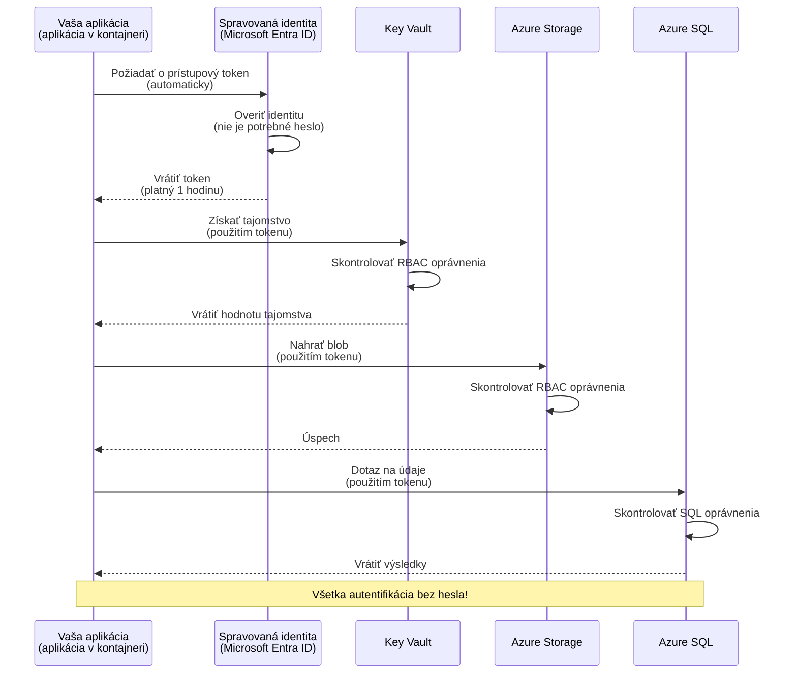

# Autentifikačné vzory a spravovaná identita

⏱️ **Predpokladaný čas**: 45-60 minút | 💰 **Vplyv na náklady**: Zdarma (žiadne ďalšie poplatky) | ⭐ **Zložitosť**: Stredná

**📚 Vzdelávacia cesta:**
- ← Previous: [Správa konfigurácie](configuration.md) - Správa premenných prostredia a tajomstiev
- 🎯 **Ste tu**: Autentifikácia a zabezpečenie (spravovaná identita, Key Vault, bezpečné vzory)
- → Next: [Prvý projekt](first-project.md) - Vytvorte svoju prvú aplikáciu AZD
- 🏠 [Domov kurzu](../../README.md)

---

## Čo sa naučíte

Po dokončení tejto lekcie sa naučíte:
- Pochopiť autentifikačné vzory v Azure (kľúče, connection stringy, spravovaná identita)
- Implementovať **spravovanú identitu** pre autentifikáciu bez hesla
- Zabezpečiť tajomstvá integráciou s **Azure Key Vault**
- Nakonfigurovať **riadenie prístupu na základe rolí (RBAC)** pre nasadenia AZD
- Aplikovať bezpečnostné odporúčania v Container Apps a službách Azure
- Migrovať z autentifikácie založenej na kľúčoch na autentifikáciu založenú na identite

## Prečo je spravovaná identita dôležitá

### Problém: Tradičná autentifikácia

**Pred spravovanou identitou:**
```javascript
// ❌ BEZPEČNOSTNÉ RIZIKO: Tvrdo zakódované tajné údaje v kóde
const connectionString = "Server=mydb.database.windows.net;User=admin;Password=P@ssw0rd123";
const storageKey = "xK7mN9pQ2wR5tY8uI0oP3aS6dF1gH4jK...";
const cosmosKey = "C2x7B9n4M1p8Q5w3E6r0T2y5U8i1O4p7...";
```

**Problémy:**
- 🔴 **Vystavené tajomstvá** v kóde, konfiguračných súboroch, premenných prostredia
- 🔴 **Rotácia poverení** vyžaduje zmeny v kóde a opätovné nasadenie
- 🔴 **Problémy s auditom** - kto čo a kedy pristúpil?
- 🔴 **Rozptýlenie** - tajomstvá roztrúsené naprieč viacerými systémami
- 🔴 **Riziká súladu** - neprejde bezpečnostnými auditmi

### Riešenie: Spravovaná identita

**Po zavedení spravovanej identity:**
```javascript
// ✅ BEZPEČNÉ: Žiadne tajomstvá v kóde
const credential = new DefaultAzureCredential();
const client = new BlobServiceClient(
  "https://mystorageaccount.blob.core.windows.net",
  credential  // Azure automaticky spravuje autentifikáciu
);
```

**Výhody:**
- ✅ **Žiadne tajomstvá** v kóde ani konfigurácii
- ✅ **Automatická rotácia** - o to sa postará Azure
- ✅ **Plná stopa auditu** v logoch Microsoft Entra ID
- ✅ **Centralizované zabezpečenie** - spravujte v Azure Portáli
- ✅ **Pripravené na súlad** - spĺňa bezpečnostné štandardy

**Analógia**: Tradičná autentifikácia je ako nosenie viacerých fyzických kľúčov pre rôzne dvere. Spravovaná identita je ako mať bezpečnostnú kartu, ktorá automaticky udeľuje prístup na základe toho, kto ste — žiadne kľúče, ktoré by sa dali stratiť, skopírovať alebo rotovať.

---

## Prehľad architektúry

### Tok autentifikácie so spravovanou identitou



### Typy spravovaných identít


| Vlastnosť | System-Assigned | User-Assigned |
|---------|----------------|---------------|
| **Životný cyklus** | Viazaná na zdroj | Nezávislá |
| **Vytvorenie** | Automaticky s prostriedkom | Manuálne vytvorenie |
| **Vymazanie** | Vymazaná so zdrojom | Pretrváva po vymazaní zdroja |
| **Zdieľanie** | Iba pre jeden zdroj | Viaceré zdroje |
| **Použitie** | Jednoduché scenáre | Zložité scenáre s viacerými zdrojmi |
| **AZD Predvolené** | ✅ Odporúčané | Voliteľné |

---

## Predpoklady

### Požadované nástroje

Tieto by ste mali mať už nainštalované z predchádzajúcich lekcií:

```bash
# Overiť Azure Developer CLI
azd version
# ✅ Očakávané: azd verzia 1.0.0 alebo vyššia

# Overiť Azure CLI
az --version
# ✅ Očakávané: azure-cli 2.50.0 alebo vyššia
```

### Požiadavky Azure

- Aktívne Azure predplatné
- Povolenia na:
  - Vytváranie spravovaných identít
  - Priraďovanie RBAC rolí
  - Vytváranie zdrojov Key Vault
  - Nasadzovanie Container Apps

### Požadované znalosti

Mali by ste mať dokončené:
- [Návod na inštaláciu](installation.md) - nastavenie AZD
- [Základy AZD](azd-basics.md) - Základné koncepty
- [Správa konfigurácie](configuration.md) - Premenné prostredia

---

## Lekcia 1: Pochopenie autentifikačných vzorov

### Vzor 1: Connection strings (zastaralé - vyhnúť sa)

**Ako to funguje:**
```bash
# Reťazec pripojenia obsahuje prihlasovacie údaje
STORAGE_CONNECTION_STRING="DefaultEndpointsProtocol=https;AccountName=myaccount;AccountKey=xK7mN9pQ2wR5..."
COSMOS_CONNECTION_STRING="AccountEndpoint=https://myaccount.documents.azure.com:443/;AccountKey=C2x7..."
SQL_CONNECTION_STRING="Server=myserver.database.windows.net;User=admin;Password=P@ssw0rd..."
```

**Problémy:**
- ❌ Tajomstvá viditeľné v premenných prostredia
- ❌ Zaznamenané v nasadzovacích systémoch
- ❌ Ťažké na rotáciu
- ❌ Žiadna stopa auditu prístupu

**Kedy používať:** Iba pre lokálny vývoj, nikdy do produkcie.

---

### Vzor 2: Odkazy na Key Vault (lepšie)

**Ako to funguje:**
```bicep
// Store secret in Key Vault
resource keyVault 'Microsoft.KeyVault/vaults@2023-02-01' = {
  name: 'mykv'
  properties: {
    enableRbacAuthorization: true
  }
}

// Reference in Container App
env: [
  {
    name: 'STORAGE_KEY'
    secretRef: 'storage-key'  // References Key Vault
  }
]
```

**Výhody:**
- ✅ Tajomstvá bezpečne uložené v Key Vault
- ✅ Centralizovaná správa tajomstiev
- ✅ Rotácia bez zmien v kóde

**Obmedzenia:**
- ⚠️ Stále používa kľúče/heslá
- ⚠️ Treba spravovať prístup k Key Vault

**Kedy používať:** Prechodný krok z connection stringov na spravovanú identitu.

---

### Vzor 3: Spravovaná identita (najlepšia prax)

**Ako to funguje:**
```bicep
// Enable managed identity
resource containerApp 'Microsoft.App/containerApps@2023-05-01' = {
  name: 'myapp'
  identity: {
    type: 'SystemAssigned'  // Automatically creates identity
  }
}

// Grant permissions
resource roleAssignment 'Microsoft.Authorization/roleAssignments@2022-04-01' = {
  scope: storageAccount
  properties: {
    roleDefinitionId: storageBlobDataContributorRole
    principalId: containerApp.identity.principalId
  }
}
```

**Kód aplikácie:**
```javascript
// Tajomstvá nie sú potrebné!
const { DefaultAzureCredential } = require('@azure/identity');
const { BlobServiceClient } = require('@azure/storage-blob');

const credential = new DefaultAzureCredential();
const blobServiceClient = new BlobServiceClient(
  'https://mystorageaccount.blob.core.windows.net',
  credential
);
```

**Výhody:**
- ✅ Žiadne tajomstvá v kóde/konfigurácii
- ✅ Automatická rotácia poverení
- ✅ Plná stopa auditu
- ✅ Oprávnenia na základe RBAC
- ✅ Pripravené na súlad

**Kedy používať:** Vždy, pre produkčné aplikácie.

---

### Vzor 4: Service Principals (CI/CD a automatizácia)

Spravovaná identita je zlatý štandard pre zdroje bežiace v rámci Azure. Čo však s vecami bežiacimi mimo Azure — napr. CI/CD pipeline na build agente alebo skript na vašom notebooku, ktorý nemôže použiť interaktívne prihlásenie? Práve tu vstupuje do hry **service principal**: nehumánna identita s vlastnými povereniami, ktorú môže automatický proces použiť na prihlásenie.

**Ako to funguje:**

Vytvorte service principal obmedzený na resource group (zásada minimálnych práv):

```bash
az ad sp create-for-rbac \
  --name "myapp-cicd" \
  --role contributor \
  --scopes /subscriptions/<sub-id>/resourceGroups/<rg-name>
```

Toto vypíše client ID, client secret a tenant ID. azd sa môže nimi prihlásiť neinteraktívne:

```bash
azd auth login \
  --client-id "<appId>" \
  --client-secret "<password>" \
  --tenant-id "<tenant>"
```

**Uprednostnite federované poverenia (OIDC) pred tajomstvami.** Namiesto dlhodobého client secreta nakonfigurujte federované poverenie tak, aby pipeline vymenila krátkodobý token — žiadne tajomstvo na únik alebo rotáciu:

```bash
azd auth login \
  --client-id "<appId>" \
  --federated-credential-provider "github" \
  --tenant-id "<tenant>"
```

> `azd pipeline config` automaticky nastaví toto za vás. Pozrite si návody CI/CD v [Kapitole 8](../chapter-08-production/production-ai-practices.md).

**Výhody:**
- ✅ Funguje mimo Azure (build agenty, on-prem, iné cloudy)
- ✅ Môže byť obmedzený na jednu resource group s jednou rolou
- ✅ Federovaná (OIDC) varianta nepoužíva uložené tajomstvo

**Kompromisy:**
- ⚠️ Varianta založená na tajomstve vyžaduje starostlivé ukladanie a rotáciu
- ⚠️ Uniknuté tajomstvo udeľuje všetko, čo SP môže robiť — udržiavajte rozsahy úzke

**Kedy používať:** CI/CD pipeline a automatizácie, ktoré nemôžu používať spravovanú identitu. Vždy uprednostnite **federovanú/OIDC** variantu pred client secretom a uprednostnite spravovanú identitu, keď pracovná záťaž beží v Azure.

**Bezpečné ukladanie poverení:**
- Nikdy neincludujte tajomstvá do repozitára—použite úložisko tajomstiev vašej pipeline (GitHub Actions secrets, Azure DevOps variable groups / Key Vault).
- Obmedzte SP na najmenšiu potrebnú rolu a resource group.
- Nastavte expiráciu a rotáciu, alebo odstráňte tajomstvo úplne pomocou OIDC.

---

## Lekcia 2: Implementácia spravovanej identity s AZD

### Krok za krokom – implementácia

Postavme bezpečný Container App, ktorý používa spravovanú identitu na prístup k Azure Storage a Key Vault.

### Štruktúra projektu

```
secure-app/
├── azure.yaml                 # AZD configuration
├── infra/
│   ├── main.bicep            # Main infrastructure
│   ├── core/
│   │   ├── identity.bicep    # Managed identity setup
│   │   ├── keyvault.bicep    # Key Vault configuration
│   │   └── storage.bicep     # Storage with RBAC
│   └── app/
│       └── container-app.bicep
└── src/
    ├── app.js                # Application code
    ├── package.json
    └── Dockerfile
```

### 1. Konfigurácia AZD (azure.yaml)

```yaml
name: secure-app
metadata:
  template: secure-app@1.0.0

services:
  api:
    project: ./src
    language: js
    host: containerapp

# Enable managed identity (AZD handles this automatically)
```

### 2. Infrastruktúra: Povolenie spravovanej identity

**Súbor: `infra/main.bicep`**

```bicep
targetScope = 'subscription'

param environmentName string
param location string = 'eastus'

var tags = { 'azd-env-name': environmentName }

// Resource group
resource rg 'Microsoft.Resources/resourceGroups@2021-04-01' = {
  name: 'rg-${environmentName}'
  location: location
  tags: tags
}

// Storage Account
module storage './core/storage.bicep' = {
  name: 'storage'
  scope: rg
  params: {
    name: 'st${uniqueString(rg.id)}'
    location: location
    tags: tags
  }
}

// Key Vault
module keyVault './core/keyvault.bicep' = {
  name: 'keyvault'
  scope: rg
  params: {
    name: 'kv-${uniqueString(rg.id)}'
    location: location
    tags: tags
  }
}

// Container App with Managed Identity
module containerApp './app/container-app.bicep' = {
  name: 'container-app'
  scope: rg
  params: {
    name: 'ca-${environmentName}'
    location: location
    tags: tags
    storageAccountName: storage.outputs.name
    keyVaultName: keyVault.outputs.name
  }
}

// Grant Container App access to Storage
module storageRoleAssignment './core/role-assignment.bicep' = {
  name: 'storage-role'
  scope: rg
  params: {
    principalId: containerApp.outputs.identityPrincipalId
    roleDefinitionId: 'ba92f5b4-2d11-453d-a403-e96b0029c9fe'  // Storage Blob Data Contributor
    targetResourceId: storage.outputs.id
  }
}

// Grant Container App access to Key Vault
module kvRoleAssignment './core/role-assignment.bicep' = {
  name: 'kv-role'
  scope: rg
  params: {
    principalId: containerApp.outputs.identityPrincipalId
    roleDefinitionId: '4633458b-17de-408a-b874-0445c86b69e6'  // Key Vault Secrets User
    targetResourceId: keyVault.outputs.id
  }
}

// Outputs
output AZURE_STORAGE_ACCOUNT_NAME string = storage.outputs.name
output AZURE_KEY_VAULT_NAME string = keyVault.outputs.name
output APP_URL string = containerApp.outputs.url
```

### 3. Container App so systémovo priradenou identitou

**Súbor: `infra/app/container-app.bicep`**

```bicep
param name string
param location string
param tags object = {}
param storageAccountName string
param keyVaultName string

resource containerApp 'Microsoft.App/containerApps@2023-05-01' = {
  name: name
  location: location
  tags: tags
  identity: {
    type: 'SystemAssigned'  // 🔑 Enable managed identity
  }
  properties: {
    configuration: {
      ingress: {
        external: true
        targetPort: 3000
      }
    }
    template: {
      containers: [
        {
          name: 'api'
          image: 'myregistry.azurecr.io/api:latest'
          resources: {
            cpu: json('0.5')
            memory: '1Gi'
          }
          env: [
            {
              name: 'AZURE_STORAGE_ACCOUNT_NAME'
              value: storageAccountName
            }
            {
              name: 'AZURE_KEY_VAULT_NAME'
              value: keyVaultName
            }
            // 🔑 No secrets - managed identity handles authentication!
          ]
        }
      ]
    }
  }
}

// Output the identity for RBAC assignments
output identityPrincipalId string = containerApp.identity.principalId
output id string = containerApp.id
output url string = 'https://${containerApp.properties.configuration.ingress.fqdn}'
```

### 4. Modul priraďovania RBAC rolí

**Súbor: `infra/core/role-assignment.bicep`**

```bicep
param principalId string
param roleDefinitionId string  // Azure built-in role ID
param targetResourceId string

resource roleAssignment 'Microsoft.Authorization/roleAssignments@2022-04-01' = {
  name: guid(principalId, roleDefinitionId, targetResourceId)
  scope: resourceId('Microsoft.Resources/resourceGroups', resourceGroup().name)
  properties: {
    roleDefinitionId: subscriptionResourceId('Microsoft.Authorization/roleDefinitions', roleDefinitionId)
    principalId: principalId
    principalType: 'ServicePrincipal'
  }
}

output id string = roleAssignment.id
```

### 5. Kód aplikácie so spravovanou identitou

**Súbor: `src/app.js`**

```javascript
const express = require('express');
const { DefaultAzureCredential } = require('@azure/identity');
const { BlobServiceClient } = require('@azure/storage-blob');
const { SecretClient } = require('@azure/keyvault-secrets');

const app = express();
const PORT = process.env.PORT || 3000;

// 🔑 Inicializovať poverenia (funguje automaticky so spravovanou identitou)
const credential = new DefaultAzureCredential();

// Nastavenie Azure Storage
const storageAccountName = process.env.AZURE_STORAGE_ACCOUNT_NAME;
const blobServiceClient = new BlobServiceClient(
  `https://${storageAccountName}.blob.core.windows.net`,
  credential  // Kľúče nie sú potrebné!
);

// Nastavenie Key Vault
const keyVaultName = process.env.AZURE_KEY_VAULT_NAME;
const secretClient = new SecretClient(
  `https://${keyVaultName}.vault.azure.net`,
  credential  // Kľúče nie sú potrebné!
);

// Kontrola stavu
app.get('/health', (req, res) => {
  res.json({ status: 'healthy', authentication: 'managed-identity' });
});

// Nahrať súbor do blob úložiska
app.post('/upload', async (req, res) => {
  try {
    const containerClient = blobServiceClient.getContainerClient('uploads');
    await containerClient.createIfNotExists();
    
    const blobName = `file-${Date.now()}.txt`;
    const blockBlobClient = containerClient.getBlockBlobClient(blobName);
    
    await blockBlobClient.upload('Hello from managed identity!', 30);
    
    res.json({
      success: true,
      blobName: blobName,
      message: 'File uploaded using managed identity!'
    });
  } catch (error) {
    console.error('Upload error:', error);
    res.status(500).json({ error: error.message });
  }
});

// Získať tajomstvo z Key Vault
app.get('/secret/:name', async (req, res) => {
  try {
    const secretName = req.params.name;
    const secret = await secretClient.getSecret(secretName);
    
    res.json({
      name: secretName,
      value: secret.value,
      message: 'Secret retrieved using managed identity!'
    });
  } catch (error) {
    console.error('Secret error:', error);
    res.status(500).json({ error: error.message });
  }
});

// Zoznam blob kontajnerov (ukazuje prístup na čítanie)
app.get('/containers', async (req, res) => {
  try {
    const containers = [];
    for await (const container of blobServiceClient.listContainers()) {
      containers.push(container.name);
    }
    
    res.json({
      containers: containers,
      count: containers.length,
      message: 'Containers listed using managed identity!'
    });
  } catch (error) {
    console.error('List error:', error);
    res.status(500).json({ error: error.message });
  }
});

app.listen(PORT, () => {
  console.log(`Secure API listening on port ${PORT}`);
  console.log('Authentication: Managed Identity (passwordless)');
});
```

**Súbor: `src/package.json`**

```json
{
  "name": "secure-app",
  "version": "1.0.0",
  "dependencies": {
    "express": "^4.18.2",
    "@azure/identity": "^4.0.0",
    "@azure/storage-blob": "^12.17.0",
    "@azure/keyvault-secrets": "^4.7.0"
  },
  "scripts": {
    "start": "node app.js"
  }
}
```

### 6. Nasadiť a otestovať

```bash
# Inicializovať prostredie AZD
azd init

# Nasadiť infraštruktúru a aplikáciu
azd up

# Získať URL aplikácie
APP_URL=$(azd env get-values | grep APP_URL | cut -d '=' -f2 | tr -d '"')

# Otestovať kontrolu stavu
curl $APP_URL/health
```

**✅ Očakávaný výstup:**
```json
{
  "status": "healthy",
  "authentication": "managed-identity"
}
```

**Test nahrávania bloba:**
```bash
curl -X POST $APP_URL/upload
```

**✅ Očakávaný výstup:**
```json
{
  "success": true,
  "blobName": "file-1700404800000.txt",
  "message": "File uploaded using managed identity!"
}
```

**Test zoznamu kontajnerov:**
```bash
curl $APP_URL/containers
```

**✅ Očakávaný výstup:**
```json
{
  "containers": ["uploads"],
  "count": 1,
  "message": "Containers listed using managed identity!"
}
```

---

## Bežné RBAC roly v Azure

### Predvolené ID rolí pre spravovanú identitu

| Služba | Názov roly | Role ID | Oprávnenia |
|---------|-----------|---------|-------------|
| **Storage** | Storage Blob Data Reader | `2a2b9908-6b94-4a3d-8e5a-a7d8f8cc8a12` | Čítanie blobov a kontajnerov |
| **Storage** | Storage Blob Data Contributor | `ba92f5b4-2d11-453d-a403-e96b0029c9fe` | Čítanie, zápis, mazanie blobov |
| **Storage** | Storage Queue Data Contributor | `974c5e8b-45b9-4653-ba55-5f855dd0fb88` | Čítanie, zápis, mazanie správ fronty |
| **Key Vault** | Key Vault Secrets User | `4633458b-17de-408a-b874-0445c86b69e6` | Čítanie tajomstiev |
| **Key Vault** | Key Vault Secrets Officer | `b86a8fe4-44ce-4948-aee5-eccb2c155cd7` | Čítanie, zápis, mazanie tajomstiev |
| **Cosmos DB** | Cosmos DB Built-in Data Reader | `00000000-0000-0000-0000-000000000001` | Čítanie dát v Cosmos DB |
| **Cosmos DB** | Cosmos DB Built-in Data Contributor | `00000000-0000-0000-0000-000000000002` | Čítanie, zápis dát v Cosmos DB |
| **SQL Database** | SQL DB Contributor | `9b7fa17d-e63e-47b0-bb0a-15c516ac86ec` | Spravovanie SQL databáz |
| **Service Bus** | Azure Service Bus Data Owner | `090c5cfd-751d-490a-894a-3ce6f1109419` | Odosielanie, prijímanie a spravovanie správ |

### Ako nájsť ID rolí

```bash
# Zobraziť všetky vstavané role
az role definition list --query "[].{Name:roleName, ID:name}" --output table

# Vyhľadať konkrétnu rolu
az role definition list --query "[?contains(roleName, 'Storage Blob')].{Name:roleName, ID:name}" --output table

# Získať podrobnosti o role
az role definition list --name "Storage Blob Data Contributor"
```

---

## Praktické cvičenia

### Cvičenie 1: Povoliť spravovanú identitu pre existujúcu aplikáciu ⭐⭐ (Stredne náročné)

**Cieľ**: Pridať spravovanú identitu do existujúceho nasadenia Container App

**Scenár**: Máte Container App používajúci connection stringy. Konvertujte ho na spravovanú identitu.

**Východiskový bod**: Container App s touto konfiguráciou:

```bicep
// ❌ Current: Using connection string
env: [
  {
    name: 'STORAGE_CONNECTION_STRING'
    secretRef: 'storage-connection'
  }
]
```

**Kroky**:

1. **Povoľte spravovanú identitu v Bicep:**

```bicep
resource containerApp 'Microsoft.App/containerApps@2023-05-01' = {
  name: 'myapp'
  identity: {
    type: 'SystemAssigned'  // Add this
  }
  // ... rest of configuration
}
```

2. **Udelte prístup k Storage:**

```bicep
// Get storage account reference
resource storageAccount 'Microsoft.Storage/storageAccounts@2023-01-01' existing = {
  name: storageAccountName
}

// Assign role
resource roleAssignment 'Microsoft.Authorization/roleAssignments@2022-04-01' = {
  name: guid(containerApp.id, 'ba92f5b4-2d11-453d-a403-e96b0029c9fe', storageAccount.id)
  scope: storageAccount
  properties: {
    roleDefinitionId: subscriptionResourceId('Microsoft.Authorization/roleDefinitions', 'ba92f5b4-2d11-453d-a403-e96b0029c9fe')
    principalId: containerApp.identity.principalId
    principalType: 'ServicePrincipal'
  }
}
```

3. **Aktualizujte kód aplikácie:**

**Pred (connection string):**
```javascript
const { BlobServiceClient } = require('@azure/storage-blob');

const blobServiceClient = BlobServiceClient.fromConnectionString(
  process.env.STORAGE_CONNECTION_STRING
);
```

**Po (spravovaná identita):**
```javascript
const { DefaultAzureCredential } = require('@azure/identity');
const { BlobServiceClient } = require('@azure/storage-blob');

const credential = new DefaultAzureCredential();
const blobServiceClient = new BlobServiceClient(
  `https://${process.env.STORAGE_ACCOUNT_NAME}.blob.core.windows.net`,
  credential
);
```

4. **Aktualizujte premenné prostredia:**

```bicep
env: [
  {
    name: 'STORAGE_ACCOUNT_NAME'
    value: storageAccountName  // Just the name, no secrets!
  }
  // Remove STORAGE_CONNECTION_STRING
]
```

5. **Nasadiť a otestovať:**

```bash
# Znovu nasadiť
azd up

# Otestujte, či to stále funguje
curl https://myapp.azurecontainerapps.io/upload
```

**✅ Kritériá úspechu:**
- ✅ Aplikácia sa nasadí bez chýb
- ✅ Operácie so Storage fungujú (nahrávanie, zoznam, stiahnutie)
- ✅ Žiadne connection stringy v premenných prostredia
- ✅ Identita viditeľná v Azure Portáli v časti "Identity"

**Overenie:**

```bash
# Skontrolujte, či je povolená spravovaná identita
az containerapp show \
  --name myapp \
  --resource-group rg-myapp \
  --query "identity.type"
# ✅ Očakávané: "SystemAssigned"

# Skontrolujte priradenie roly
az role assignment list \
  --assignee $(az containerapp show --name myapp --resource-group rg-myapp --query "identity.principalId" -o tsv) \
  --scope /subscriptions/{sub-id}/resourceGroups/rg-myapp/providers/Microsoft.Storage/storageAccounts/mystorageaccount
# ✅ Očakávané: Zobrazuje rolu "Storage Blob Data Contributor"
```

**Čas**: 20-30 minút

---

### Cvičenie 2: Prístup viacerých služieb s používateľsky priradenou identitou ⭐⭐⭐ (Pokročilé)

**Cieľ**: Vytvoriť používateľsky priradenú identitu zdieľanú medzi viacerými Container Apps

**Scenár**: Máte 3 mikroservisy, ktoré všetky potrebujú prístup k rovnakému Storage účtu a Key Vault.

**Kroky**:

1. **Vytvorte používateľsky priradenú identitu:**

**Súbor: `infra/core/identity.bicep`**

```bicep
param name string
param location string
param tags object = {}

resource userAssignedIdentity 'Microsoft.ManagedIdentity/userAssignedIdentities@2023-01-31' = {
  name: name
  location: location
  tags: tags
}

output id string = userAssignedIdentity.id
output principalId string = userAssignedIdentity.properties.principalId
output clientId string = userAssignedIdentity.properties.clientId
```

2. **Priraďte roly používateľsky priradenej identite:**

```bicep
// In main.bicep
module userIdentity './core/identity.bicep' = {
  name: 'user-identity'
  scope: rg
  params: {
    name: 'id-${environmentName}'
    location: location
    tags: tags
  }
}

// Grant Storage access
resource storageRoleAssignment 'Microsoft.Authorization/roleAssignments@2022-04-01' = {
  name: guid(userIdentity.outputs.principalId, 'storage-contributor')
  scope: storageAccount
  properties: {
    roleDefinitionId: subscriptionResourceId('Microsoft.Authorization/roleDefinitions', 'ba92f5b4-2d11-453d-a403-e96b0029c9fe')
    principalId: userIdentity.outputs.principalId
    principalType: 'ServicePrincipal'
  }
}

// Grant Key Vault access
resource kvRoleAssignment 'Microsoft.Authorization/roleAssignments@2022-04-01' = {
  name: guid(userIdentity.outputs.principalId, 'kv-secrets-user')
  scope: keyVault
  properties: {
    roleDefinitionId: subscriptionResourceId('Microsoft.Authorization/roleDefinitions', '4633458b-17de-408a-b874-0445c86b69e6')
    principalId: userIdentity.outputs.principalId
    principalType: 'ServicePrincipal'
  }
}
```

3. **Priraďte identitu viacerým Container Appom:**

```bicep
resource apiGateway 'Microsoft.App/containerApps@2023-05-01' = {
  name: 'api-gateway'
  identity: {
    type: 'UserAssigned'
    userAssignedIdentities: {
      '${userIdentity.outputs.id}': {}
    }
  }
  // ... rest of config
}

resource productService 'Microsoft.App/containerApps@2023-05-01' = {
  name: 'product-service'
  identity: {
    type: 'UserAssigned'
    userAssignedIdentities: {
      '${userIdentity.outputs.id}': {}
    }
  }
  // ... rest of config
}

resource orderService 'Microsoft.App/containerApps@2023-05-01' = {
  name: 'order-service'
  identity: {
    type: 'UserAssigned'
    userAssignedIdentities: {
      '${userIdentity.outputs.id}': {}
    }
  }
  // ... rest of config
}
```

4. **Kód aplikácie (všetky služby používajú rovnaký vzor):**

```javascript
const { DefaultAzureCredential, ManagedIdentityCredential } = require('@azure/identity');

// Pre identitu priradenú používateľom uveďte ID klienta
const credential = new ManagedIdentityCredential(
  process.env.AZURE_CLIENT_ID  // ID klienta používateľom priradenej identity
);

// Alebo použite DefaultAzureCredential (automaticky zistí)
const credential = new DefaultAzureCredential();

const blobServiceClient = new BlobServiceClient(
  `https://${process.env.STORAGE_ACCOUNT_NAME}.blob.core.windows.net`,
  credential
);
```

5. **Nasadiť a overiť:**

```bash
azd up

# Otestujte, či všetky služby majú prístup k úložisku.
curl https://api-gateway.azurecontainerapps.io/upload
curl https://product-service.azurecontainerapps.io/upload
curl https://order-service.azurecontainerapps.io/upload
```

**✅ Kritériá úspechu:**
- ✅ Jedna identita zdieľaná medzi 3 službami
- ✅ Všetky služby dokážu pristupovať k Storage a Key Vault
- ✅ Identita pretrvá, ak zmažete jednu službu
- ✅ Centralizovaná správa povolení

**Výhody používateľsky priradenej identity:**
- Jedna identita na správu
- Konzistentné povolenia naprieč službami
- Prežije zmazanie služby
- Vhodnejšie pre zložité architektúry

**Čas**: 30-40 minút

---

### Cvičenie 3: Implementácia rotácie tajomstiev v Key Vault ⭐⭐⭐ (Pokročilé)

**Cieľ**: Uložiť API kľúče tretích strán v Key Vault a pristupovať k nim pomocou spravovanej identity

**Scenár**: Vaša aplikácia potrebuje volať externé API (OpenAI, Stripe, SendGrid), ktoré vyžaduje API kľúče.

**Kroky**:

1. **Vytvorte Key Vault s RBAC:**

**Súbor: `infra/core/keyvault.bicep`**

```bicep
param name string
param location string
param tags object = {}

resource keyVault 'Microsoft.KeyVault/vaults@2023-02-01' = {
  name: name
  location: location
  tags: tags
  properties: {
    enableRbacAuthorization: true  // Use RBAC instead of access policies
    sku: {
      family: 'A'
      name: 'standard'
    }
    tenantId: subscription().tenantId
    enableSoftDelete: true
    softDeleteRetentionInDays: 90
  }
}

// Allow Container App to read secrets
output id string = keyVault.id
output name string = keyVault.name
output uri string = keyVault.properties.vaultUri
```

2. **Uložte tajomstvá v Key Vault:**

```bash
# Získať názov Key Vaultu
KV_NAME=$(azd env get-values | grep AZURE_KEY_VAULT_NAME | cut -d '=' -f2 | tr -d '"')

# Uložiť API kľúče tretích strán
az keyvault secret set \
  --vault-name $KV_NAME \
  --name "OpenAI-ApiKey" \
  --value "sk-proj-xxxxxxxxxxxxx"

az keyvault secret set \
  --vault-name $KV_NAME \
  --name "Stripe-ApiKey" \
  --value "sk_live_xxxxxxxxxxxxx"

az keyvault secret set \
  --vault-name $KV_NAME \
  --name "SendGrid-ApiKey" \
  --value "SG.xxxxxxxxxxxxx"
```

3. **Kód aplikácie na získavanie tajomstiev:**

**Súbor: `src/config.js`**

```javascript
const { DefaultAzureCredential } = require('@azure/identity');
const { SecretClient } = require('@azure/keyvault-secrets');

class Config {
  constructor() {
    this.credential = new DefaultAzureCredential();
    this.secretClient = new SecretClient(
      `https://${process.env.AZURE_KEY_VAULT_NAME}.vault.azure.net`,
      this.credential
    );
    this.cache = {};
  }

  async getSecret(secretName) {
    // Najprv skontrolujte medzipamäť
    if (this.cache[secretName]) {
      return this.cache[secretName];
    }

    try {
      const secret = await this.secretClient.getSecret(secretName);
      this.cache[secretName] = secret.value;
      console.log(`✅ Retrieved secret: ${secretName}`);
      return secret.value;
    } catch (error) {
      console.error(`❌ Failed to get secret ${secretName}:`, error.message);
      throw error;
    }
  }

  async getOpenAIKey() {
    return this.getSecret('OpenAI-ApiKey');
  }

  async getStripeKey() {
    return this.getSecret('Stripe-ApiKey');
  }

  async getSendGridKey() {
    return this.getSecret('SendGrid-ApiKey');
  }
}

module.exports = new Config();
```

4. **Použite tajomstvá v aplikácii:**

**Súbor: `src/app.js`**

```javascript
const express = require('express');
const config = require('./config');
const { OpenAI } = require('openai');

const app = express();

// Inicializovať OpenAI s kľúčom z Key Vault
let openaiClient;

async function initializeServices() {
  const openaiKey = await config.getOpenAIKey();
  openaiClient = new OpenAI({ apiKey: openaiKey });
  console.log('✅ Services initialized with secrets from Key Vault');
}

// Zavolať pri spustení
initializeServices().catch(console.error);

app.post('/chat', async (req, res) => {
  try {
    const completion = await openaiClient.chat.completions.create({
      model: 'gpt-4.1',
      messages: [{ role: 'user', content: 'Hello!' }]
    });
    
    res.json({
      response: completion.choices[0].message.content,
      authentication: 'Key from Key Vault via Managed Identity'
    });
  } catch (error) {
    res.status(500).json({ error: error.message });
  }
});

app.listen(3000, () => {
  console.log('Secure API with Key Vault integration running');
});
```

5. **Nasadiť a otestovať:**

```bash
azd up

# Otestujte, či API kľúče fungujú
curl -X POST https://myapp.azurecontainerapps.io/chat \
  -H "Content-Type: application/json" \
  -d '{"message":"Hello AI"}'
```

**✅ Kritériá úspechu:**
- ✅ Žiadne API kľúče v kóde ani v premenných prostredia
- ✅ Aplikácia získava kľúče z Key Vault
- ✅ API tretích strán fungujú správne
- ✅ Kľúče je možné rotovať bez zmien v kóde

**Rotácia tajomstva:**

```bash
# Aktualizujte tajomstvo v Key Vaulte
az keyvault secret set \
  --vault-name $KV_NAME \
  --name "OpenAI-ApiKey" \
  --value "sk-proj-NEW_KEY_HERE"

# Reštartujte aplikáciu, aby sa načítal nový kľúč
az containerapp revision restart \
  --name myapp \
  --resource-group rg-myapp
```

**Čas**: 25-35 minút

---

## Kontrolný bod znalostí

### 1. Vzory autentifikácie ✓

Otestujte si porozumenie:

- [ ] **Q1**: Aké sú tri hlavné vzory autentifikácie? 
  - **A**: Reťazce pripojenia (zastaralé), odkazy Key Vault (prechodné), spravovaná identita (najlepšie)

- [ ] **Q2**: Prečo je spravovaná identita lepšia než reťazce pripojenia?
  - **A**: Žiadne tajomstvá v kóde, automatická rotácia, úplný auditný záznam, RBAC oprávnenia

- [ ] **Q3**: Kedy by ste použili user-assigned identity namiesto system-assigned?
  - **A**: Keď sa identita zdieľa medzi viacerými prostriedkami alebo keď je životný cyklus identity nezávislý od životného cyklu prostriedku

**Praktické overenie:**
```bash
# Skontrolujte, aký typ identity vaša aplikácia používa
az containerapp show \
  --name myapp \
  --resource-group rg-myapp \
  --query "identity.type"

# Zobrazte všetky priradenia rolí pre identitu
az role assignment list \
  --assignee $(az containerapp show --name myapp --resource-group rg-myapp --query "identity.principalId" -o tsv)
```

---

### 2. RBAC a oprávnenia ✓

Otestujte si porozumenie:

- [ ] **Q1**: Aké je ID roly pre "Storage Blob Data Contributor"?
  - **A**: `ba92f5b4-2d11-453d-a403-e96b0029c9fe`

- [ ] **Q2**: Aké oprávnenia poskytuje "Key Vault Secrets User"?
  - **A**: Iba prístup na čítanie k tajomstvám (nemôže vytvárať, aktualizovať ani mazať)

- [ ] **Q3**: Ako poskytnúť Container App prístup k Azure SQL?
  - **A**: Priradiť rolu "SQL DB Contributor" alebo nakonfigurovať autentifikáciu Microsoft Entra ID pre SQL

**Praktické overenie:**
```bash
# Nájsť konkrétnu rolu
az role definition list --name "Storage Blob Data Contributor"

# Skontrolujte, aké roly sú priradené vašej identite
PRINCIPAL_ID=$(az containerapp show --name myapp --resource-group rg-myapp --query "identity.principalId" -o tsv)
az role assignment list --assignee $PRINCIPAL_ID --output table
```

---

### 3. Integrácia Key Vault ✓

Otestujte si porozumenie:

- [ ] **Q1**: Ako povoliť RBAC pre Key Vault namiesto prístupových politík?
  - **A**: Nastavte `enableRbacAuthorization: true` v Bicep

- [ ] **Q2**: Ktorá knižnica Azure SDK rieši autentifikáciu spravovanej identity?
  - **A**: `@azure/identity` s triedou `DefaultAzureCredential`

- [ ] **Q3**: Ako dlho zostávajú tajomstvá Key Vault v cache?
  - **A**: Závisí od aplikácie; implementujte vlastnú stratégiu cachovania

**Praktické overenie:**
```bash
# Otestovať prístup k Key Vault
az keyvault secret show \
  --vault-name $KV_NAME \
  --name "OpenAI-ApiKey" \
  --query "value"

# Skontrolovať, či je RBAC povolený
az keyvault show \
  --name $KV_NAME \
  --query "properties.enableRbacAuthorization"
# ✅ Očakávané: true
```

---

## Najlepšie bezpečnostné postupy

### ✅ ROBIŤ:

1. **V produkcii vždy používajte spravovanú identitu**
   ```bicep
   identity: {
     type: 'SystemAssigned'
   }
   ```

2. **Používajte RBAC roly s najmenšími potrebnými oprávneniami**
   - Používajte rolu "Reader", keď je to možné
   - Vyhnite sa rolám "Owner" alebo "Contributor", pokiaľ nie sú nevyhnutné

3. **Ukladajte kľúče tretích strán v Key Vault**
   ```javascript
   const apiKey = await secretClient.getSecret('ThirdPartyApiKey');
   ```

4. **Povoľte auditné protokolovanie**
   ```bicep
   diagnosticSettings: {
     logs: [{ category: 'AuditEvent', enabled: true }]
   }
   ```

5. **Používajte rôzne identity pre dev/staging/prod**
   ```bash
   azd env new dev
   azd env new staging
   azd env new prod
   ```

6. **Pravidelne rotujte tajomstvá**
   - Nastavte dátumy exspirácie na tajomstvá v Key Vault
   - Automatizujte rotáciu pomocou Azure Functions

### ❌ NEROBIŤ:

1. **Nikdy neukladajte tajomstvá napevno v kóde**
   ```javascript
   // ❌ ZLÉ
   const apiKey = "sk-proj-xxxxxxxxxxxxx";
   ```

2. **Nepoužívajte reťazce pripojenia v produkcii**
   ```javascript
   // ❌ ZLÉ
   BlobServiceClient.fromConnectionString(process.env.STORAGE_CONNECTION_STRING)
   ```

3. **Neposkytujte nadmerné oprávnenia**
   ```bicep
   // ❌ BAD - too much access
   roleDefinitionId: 'Owner'
   
   // ✅ GOOD - least privilege
   roleDefinitionId: 'Storage Blob Data Reader'
   ```

4. **Nezaznamenávajte tajomstvá do logov**
   ```javascript
   // ❌ ZLÉ
   console.log('API Key:', apiKey);
   
   // ✅ DOBRÉ
   console.log('API Key retrieved successfully');
   ```

5. **Nezdieľajte produkčné identity medzi prostrediami**
   ```bicep
   // ❌ BAD - same identity for dev and prod
   // ✅ GOOD - separate identities per environment
   ```

---

## Sprievodca riešením problémov

### Problém: "Unauthorized" pri prístupe k Azure Storage

**Príznaky:**
```
Error: Unauthorized (403)
AuthorizationPermissionMismatch: This request is not authorized to perform this operation
```

**Diagnóza:**

```bash
# Skontrolujte, či je povolená spravovaná identita
az containerapp show \
  --name myapp \
  --resource-group rg-myapp \
  --query "identity.type"
# ✅ Očakávané: "SystemAssigned" alebo "UserAssigned"

# Skontrolujte priradenia rolí
PRINCIPAL_ID=$(az containerapp show --name myapp --resource-group rg-myapp --query "identity.principalId" -o tsv)
az role assignment list --assignee $PRINCIPAL_ID

# Očakávané: Malo by sa zobraziť "Storage Blob Data Contributor" alebo podobná rola
```

**Riešenia:**

1. **Udeľte správnu RBAC rolu:**
```bash
STORAGE_ID=$(az storage account show --name mystorageaccount --resource-group rg-myapp --query "id" -o tsv)
az role assignment create \
  --assignee $PRINCIPAL_ID \
  --role "Storage Blob Data Contributor" \
  --scope $STORAGE_ID
```

2. **Počkajte na propagáciu (môže trvať 5-10 minút):**
```bash
# Skontrolovať stav priradenia roly
az role assignment list --assignee $PRINCIPAL_ID --scope $STORAGE_ID
```

3. **Overte, že kód aplikácie používa správne poverenie:**
```javascript
// Uistite sa, že používate DefaultAzureCredential
const credential = new DefaultAzureCredential();
```

---

### Problém: Prístup k Key Vault odmietnutý

**Príznaky:**
```
Error: Forbidden (403)
The user, group or application does not have secrets get permission
```

**Diagnóza:**

```bash
# Skontrolujte, či je pre Key Vault povolené RBAC
az keyvault show \
  --name $KV_NAME \
  --query "properties.enableRbacAuthorization"
# ✅ Očakávané: true

# Skontrolujte priradenia rolí
az role assignment list \
  --assignee $PRINCIPAL_ID \
  --scope /subscriptions/{sub-id}/resourceGroups/rg-myapp/providers/Microsoft.KeyVault/vaults/$KV_NAME
```

**Riešenia:**

1. **Povoľte RBAC na Key Vault:**
```bash
az keyvault update \
  --name $KV_NAME \
  --enable-rbac-authorization true
```

2. **Priraďte rolu Key Vault Secrets User:**
```bash
KV_ID=$(az keyvault show --name $KV_NAME --query "id" -o tsv)
az role assignment create \
  --assignee $PRINCIPAL_ID \
  --role "Key Vault Secrets User" \
  --scope $KV_ID
```

---

### Problém: DefaultAzureCredential zlyhá lokálne

**Príznaky:**
```
Error: DefaultAzureCredential failed to retrieve a token
CredentialUnavailableError: No credential available
```

**Diagnóza:**

```bash
# Skontrolujte, či ste prihlásený
az account show

# Skontrolujte overenie v Azure CLI
az ad signed-in-user show
```

**Riešenia:**

1. **Prihláste sa do Azure CLI:**
```bash
az login
```

2. **Nastavte Azure subscription:**
```bash
az account set --subscription "Your Subscription Name"
```

3. **Pre lokálny vývoj používajte premenné prostredia:**
```bash
export AZURE_TENANT_ID="your-tenant-id"
export AZURE_CLIENT_ID="your-client-id"
export AZURE_CLIENT_SECRET="your-client-secret"
```

4. **Alebo použite iné poverenie lokálne:**
```javascript
const { DefaultAzureCredential, AzureCliCredential } = require('@azure/identity');

// Použite AzureCliCredential pre lokálny vývoj.
const credential = process.env.NODE_ENV === 'production' 
  ? new DefaultAzureCredential()
  : new AzureCliCredential();
```

---

### Problém: Priraďovanie rolí trvá príliš dlho na propagáciu

**Príznaky:**
- Rola bola úspešne priradená
- Stále sa zobrazuje 403 chyby
- Prístup je prerušovaný (niekedy funguje, niekedy nie)

**Vysvetlenie:**
Zmeny v Azure RBAC môžu trvať 5-10 minút, kým sa propagujú globálne.

**Riešenie:**

```bash
# Počkajte a skúste znova
echo "Waiting for RBAC propagation..."
sleep 300  # Počkajte 5 minút

# Otestujte prístup
curl https://myapp.azurecontainerapps.io/upload

# Ak to stále zlyhá, reštartujte aplikáciu
az containerapp revision restart \
  --name myapp \
  --resource-group rg-myapp
```

---

## Nákladové hľadiská

### Náklady spravovanej identity

| Resource | Cost |
|----------|------|
| **Managed Identity** | 🆓 **ZDARMA** - Bez poplatku |
| **RBAC Role Assignments** | 🆓 **ZDARMA** - Bez poplatku |
| **Microsoft Entra ID Token Requests** | 🆓 **ZDARMA** - Zahrnuté |
| **Key Vault Operations** | $0.03 per 10,000 operations |
| **Key Vault Storage** | $0.024 per secret per month |

**Spravovaná identita šetrí peniaze tým, že:**
- ✅ Eliminuje operácie Key Vault pre autentifikáciu služba-ku-službe
- ✅ Znižuje bezpečnostné incidenty (žiadne uniknuté poverenia)
- ✅ Znižuje prevádzkové zaťaženie (žiadna manuálna rotácia)

**Príklad porovnania nákladov (mesačne):**

| Scenario | Connection Strings | Managed Identity | Savings |
|----------|-------------------|-----------------|---------|
| Small app (1M requests) | ~$50 (Key Vault + ops) | ~$0 | $50/month |
| Medium app (10M requests) | ~$200 | ~$0 | $200/month |
| Large app (100M requests) | ~$1,500 | ~$0 | $1,500/month |

---

## Zistiť viac

### Oficiálna dokumentácia
- [Spravovaná identita Azure](https://learn.microsoft.com/entra/identity/managed-identities-azure-resources/overview)
- [Azure RBAC](https://learn.microsoft.com/azure/role-based-access-control/overview)
- [Azure Key Vault](https://learn.microsoft.com/azure/key-vault/general/overview)
- [DefaultAzureCredential](https://learn.microsoft.com/dotnet/api/azure.identity.defaultazurecredential)

### Dokumentácia SDK
- [@azure/identity (Node.js)](https://www.npmjs.com/package/@azure/identity)
- [Azure.Identity (C#)](https://www.nuget.org/packages/Azure.Identity/)
- [azure-identity (Python)](https://pypi.org/project/azure-identity/)

### Ďalšie kroky v tomto kurze
- ← Predchádzajúce: [Správa konfigurácie](configuration.md)
- → Ďalšie: [Prvý projekt](first-project.md)
- 🏠 [Domov kurzu](../../README.md)

### SÚVISIACE PRÍKLADY
- [Microsoft Foundry Models Chat Example](../../../../examples/azure-openai-chat) - Používa spravovanú identitu pre Microsoft Foundry Models
- [Microservices Example](../../../../examples/microservices) - Vzory autentifikácie pre viacero služieb

---

## Zhrnutie

**Naučili ste sa:**
- ✅ Tri vzory autentifikácie (reťazce pripojenia, Key Vault, spravovaná identita)
- ✅ Ako povoliť a nakonfigurovať spravovanú identitu v AZD
- ✅ Priraďovanie RBAC rolí pre Azure služby
- ✅ Integráciu Key Vault pre kľúče tretích strán
- ✅ User-assigned vs system-assigned identity
- ✅ Najlepšie bezpečnostné postupy a riešenie problémov

**Kľúčové poznatky:**
1. **V produkcii vždy používajte spravovanú identitu** - Žiadne tajomstvá, automatická rotácia
2. **Používajte RBAC roly s najmenšími potrebnými oprávneniami** - Udeľujte iba nevyhnutné oprávnenia
3. **Ukladajte kľúče tretích strán v Key Vault** - Centralizované spravovanie tajomstiev
4. **Oddelte identity pre jednotlivé prostredia** - Izolácia dev, staging, prod
5. **Povoľte auditné protokolovanie** - Sledujte, kto čo pristupoval

**Ďalšie kroky:**
1. Dokončite vyššie uvedené praktické cvičenia
2. Migrujte existujúcu aplikáciu z reťazcov pripojenia na spravovanú identitu
3. Vytvorte svoj prvý AZD projekt so zabezpečením od prvého dňa: [Prvý projekt](first-project.md)

---

<!-- CO-OP TRANSLATOR DISCLAIMER START -->
**Vyhlásenie o zodpovednosti**:
Tento dokument bol preložený pomocou AI prekladateľskej služby [Co-op Translator](https://github.com/Azure/co-op-translator). Hoci sa snažíme o presnosť, vezmite prosím na vedomie, že automatické preklady môžu obsahovať chyby alebo nepresnosti. Pôvodný dokument v jeho natívnom jazyku by mal byť považovaný za autoritatívny zdroj. Pre kritické informácie sa odporúča profesionálny ľudský preklad. Nie sme zodpovední za žiadne nedorozumenia alebo nesprávne interpretácie vyplývajúce z použitia tohto prekladu.
<!-- CO-OP TRANSLATOR DISCLAIMER END -->