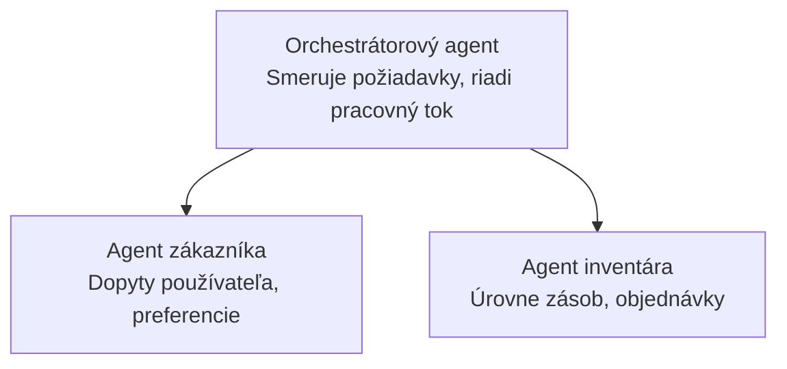

# Kapitola 5: Riešenia Multi-Agent AI

**📚 Kurz**: [AZD pre začiatočníkov](../../README.md) | **⏱️ Trvanie**: 2-3 hodiny | **⭐ Zložitosť**: Pokročilá

---

## Prehľad

Táto kapitola pokrýva pokročilé vzory architektúry multi-agentov, orchestráciu agentov a produkčne pripravené AI nasadenia pre komplexné scenáre.

> Overené pre `azd 1.27.1` v júli 2026.

## Výukové ciele

Dokončením tejto kapitoly budete:
- Rozumieť vzorom architektúry multi-agentov
- Nasadzovať koordinované systémy AI agentov
- Implementovať komunikáciu agent-agent
- Vytvárať produkčne pripravené multi-agent riešenia

---

## 📚 Lekcie

| # | Lekcia | Popis | Čas |
|---|--------|-------------|------|
| 1 | [Základy multi-agentov](multi-agent-basics.md) | Prakticky: nasadiť funkčnú multi-agent aplikáciu s `azd up` | 45 min |
| 2 | [Vzory koordinácie](../chapter-06-pre-deployment/coordination-patterns.md) | Stratégie orchestrácie agentov (pokračuje v kapitole 6) | 30 min |
| 3 | [Nasadenie ARM šablóny](../../examples/retail-multiagent-arm-template/README.md) | Príklad nasadenia jedným klikom | 30 min |

> **Začnite Lekciou 1.** Je to jediná plne praktická, nasaditeľná lekcia v tejto kapitole. Lekcia 2 je v kapitole 6 (je spoločná s plánovaním pred nasadením) a [Retail Multi-Agent Solution](../../examples/retail-scenario.md) je architektonická šablóna — dizajnová referencia, nie šablóna jedným príkazom.

---

## 🚀 Rýchly začiatok

```bash
# Možnosť 1: Nasadiť z šablóny
azd init --template agent-openai-python-prompty
azd up

# Možnosť 2: Nasadiť z manifestu agenta (vyžaduje rozšírenie azure.ai.agents)
azd extension install azure.ai.agents
azd ai agent init -m agent-manifest.yaml
azd up
```

> **Ktorý prístup?** Použite `azd init --template` pre začiatok so vzorovým projektom. Použite `azd ai agent init`, keď máte vlastný manifest agenta. Viac informácií nájdete v [AZD AI CLI príručke](../chapter-08-production/production-ai-practices.md#azd-ai-cli-commands-and-extensions).

---

## 🤖 Architektúra Multi-Agentov



---

## 🎯 Vybrané riešenie: Retail Multi-Agent

[Retail Multi-Agent Solution](../../examples/retail-scenario.md) demonštruje:

- **Zákaznícky agent**: Spravuje interakcie a preferencie užívateľa
- **Agent skladových zásob**: Riadi zásoby a spracovanie objednávok
- **Orchestrátor**: Koordinuje agentov
- **Zdieľaná pamäť**: Správa kontextu naprieč agentmi

### Použité služby

| Služba | Účel |
|---------|---------|
| Microsoft Foundry Models | Porozumenie jazyka |
| Azure AI Search | Produktový katalóg |
| Cosmos DB | Stav a pamäť agenta |
| Container Apps | Hostovanie agentov |
| Application Insights | Monitorovanie |

---

## 🔗 Navigácia

| Smer | Kapitola |
|-----------|---------|
| **Predchádzajúca** | [Kapitola 4: Infraštruktúra](../chapter-04-infrastructure/README.md) |
| **Nasledujúca** | [Kapitola 6: Pred nasadením](../chapter-06-pre-deployment/README.md) |

---

## 📖 Súvisiace zdroje

- [Sprievodca AI agentmi](../chapter-02-ai-development/agents.md)
- [Produkčné AI praktiky](../chapter-08-production/production-ai-practices.md)
- [Riešenie problémov AI](../chapter-07-troubleshooting/ai-troubleshooting.md)

---

<!-- CO-OP TRANSLATOR DISCLAIMER START -->
**Vyhlásenie o zodpovednosti**:
Tento dokument bol preložený pomocou AI prekladateľskej služby [Co-op Translator](https://github.com/Azure/co-op-translator). Hoci sa snažíme o presnosť, vezmite prosím na vedomie, že automatické preklady môžu obsahovať chyby alebo nepresnosti. Pôvodný dokument v jeho natívnom jazyku by mal byť považovaný za autoritatívny zdroj. Pre kritické informácie sa odporúča profesionálny ľudský preklad. Nie sme zodpovední za žiadne nedorozumenia alebo nesprávne interpretácie vyplývajúce z použitia tohto prekladu.
<!-- CO-OP TRANSLATOR DISCLAIMER END -->