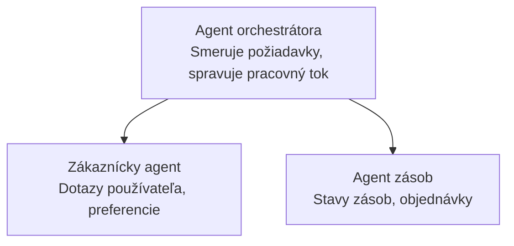

# Kapitola 5: Riešenia AI s viacerými agentmi

**📚 Kurz**: [AZD pre začiatočníkov](../../README.md) | **⏱️ Trvanie**: 2-3 hodiny | **⭐ Zložitosť**: Pokročilé

---

## Prehľad

Táto kapitola pokrýva pokročilé vzory architektúry viacerých agentov, orchestráciu agentov a produkčne pripravené nasadenia AI pre komplexné scenáre.

## Ciele učenia

Po dokončení tejto kapitoly budete:
- Pochopiť vzory architektúry viacerých agentov
- Nasadzovať koordinované systémy AI agentov
- Implementovať komunikáciu medzi agentmi
- Vytvárať produkčne pripravené riešenia s viacerými agentmi

---

## 📚 Lekcie

| # | Lekcia | Popis | Čas |
|---|--------|-------------|------|
| 1 | [Riešenie pre maloobchod s viacerými agentmi](../../examples/retail-scenario.md) | Kompletné prechádzanie implementáciou | 90 min |
| 2 | [Vzory koordinácie](../chapter-06-pre-deployment/coordination-patterns.md) | Stratégie orchestrácie agentov | 30 min |
| 3 | [Nasadenie ARM šablóny](../../examples/retail-multiagent-arm-template/README.md) | Nasadenie jedným kliknutím | 30 min |

---

## 🚀 Rýchly štart

```bash
# Možnosť 1: Nasadiť z šablóny
azd init --template agent-openai-python-prompty
azd up

# Možnosť 2: Nasadiť z manifestu agenta (vyžaduje rozšírenie azure.ai.agents)
azd extension install azure.ai.agents
azd ai agent init -m agent-manifest.yaml
azd up
```

> **Ktorý prístup?** Použite `azd init --template` na začatie z funkčného príkladu. Použite `azd ai agent init`, keď máte vlastný manifest agenta. Pozrite si [Referenčný manuál AZD AI CLI](../chapter-08-production/production-ai-practices.md#azd-ai-cli-commands-and-extensions) pre úplné informácie.

---

## 🤖 Architektúra viacerých agentov


---

## 🎯 Predstavené riešenie: Maloobchodné riešenie s viacerými agentmi

The [Retail Multi-Agent Solution](../../examples/retail-scenario.md) demonstrates:

- **Agent zákazníka**: Spravuje interakcie s používateľom a preferencie
- **Agent zásob**: Spravuje zásoby a spracovanie objednávok
- **Orchestrátor**: Koordinuje medzi agentmi
- **Zdieľaná pamäť**: Správa kontextu naprieč agentmi

### Použité služby

| Služba | Účel |
|---------|---------|
| Microsoft Foundry Models | Porozumenie jazyka |
| Azure AI Search | Katalóg produktov |
| Cosmos DB | Stav a pamäť agenta |
| Container Apps | Hostovanie agentov |
| Application Insights | Monitorovanie |

---

## 🔗 Navigácia

| Smer | Kapitola |
|-----------|---------|
| **Predchádzajúca** | [Kapitola 4: Infrastruktúra](../chapter-04-infrastructure/README.md) |
| **Nasledujúca** | [Kapitola 6: Pred nasadením](../chapter-06-pre-deployment/README.md) |

---

## 📖 Súvisiace zdroje

- [Sprievodca AI agentmi](../chapter-02-ai-development/agents.md)
- [Produkčné praktiky AI](../chapter-08-production/production-ai-practices.md)
- [Riešenie problémov s AI](../chapter-07-troubleshooting/ai-troubleshooting.md)

---

<!-- CO-OP TRANSLATOR DISCLAIMER START -->
**Vylúčenie zodpovednosti**:
Tento dokument bol preložený pomocou AI prekladateľskej služby [Co-op Translator](https://github.com/Azure/co-op-translator). Aj keď sa snažíme o presnosť, majte prosím na pamäti, že automatizované preklady môžu obsahovať chyby alebo nepresnosti. Originálny dokument v jeho pôvodnom jazyku by mal byť považovaný za autoritatívny zdroj. Pre kritické informácie sa odporúča profesionálny ľudský preklad. Za akékoľvek nedorozumenia alebo nesprávne interpretácie vyplývajúce z použitia tohto prekladu nenesieme zodpovednosť.
<!-- CO-OP TRANSLATOR DISCLAIMER END -->