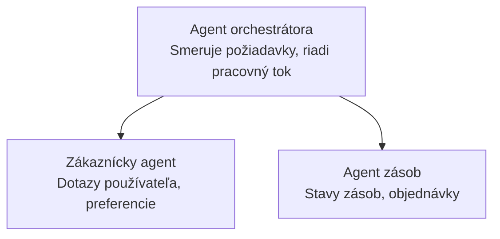

# Kapitola 5: Riešenia s viacerými AI agentmi

**📚 Kurz**: [AZD pre začiatočníkov](../../README.md) | **⏱️ Trvanie**: 2-3 hodiny | **⭐ Zložitosť**: Pokročilá

---

## Prehľad

Táto kapitola pokrýva pokročilé vzory architektúry pre viac agentov, orchestráciu agentov a produkčné nasadenia AI pre zložité scenáre.

> Overené s `azd 1.25.6` v júni 2026.

## Ciele učenia

Po dokončení tejto kapitoly budete:
- Pochopiť vzory architektúry pre viac agentov
- Nasadiť koordinované systémy AI agentov
- Implementovať komunikáciu medzi agentmi
- Vytvoriť produkčne pripravené riešenia s viacerými agentmi

---

## 📚 Lekcie

| # | Lekcia | Popis | Čas |
|---|--------|-------------|------|
| 1 | [Multi-Agent Basics](multi-agent-basics.md) | Praktické cvičenie: nasadiť funkčnú aplikáciu s viacerými agentmi pomocou `azd up` | 45 min |
| 2 | [Coordination Patterns](../chapter-06-pre-deployment/coordination-patterns.md) | Stratégie orchestrácie agentov (pokračuje v Kapitole 6) | 30 min |
| 3 | [ARM Template Deployment](../../examples/retail-multiagent-arm-template/README.md) | Príklad nasadenia jedným kliknutím | 30 min |

> **Začnite s lekciou 1.** Je to jediná plne praktická lekcia v tejto kapitole, ktorú je možné nasadiť. Lekcia 2 sa nachádza v Kapitole 6 (je zdieľaná s plánovaním pred nasadením) a [Maloobchodné viacagentové riešenie](../../examples/retail-scenario.md) je architektonický plán — návrhová referencia, nie šablóna na jedno príkazové nasadenie.

---

## 🚀 Rýchly štart

```bash
# Možnosť 1: Nasadiť z šablóny
azd init --template agent-openai-python-prompty
azd up

# Možnosť 2: Nasadiť z manifestu agenta (vyžaduje rozšírenie azure.ai.agents)
azd extension install azure.ai.agents
azd ai agent init -m agent-manifest.yaml
azd up
```

> **Ktorý prístup?** Použite `azd init --template` na začatie z fungujúceho príkladu. Použite `azd ai agent init` keď máte vlastný manifest agenta. Pozrite si [Referenciu AZD AI CLI](../chapter-08-production/production-ai-practices.md#azd-ai-cli-commands-and-extensions) pre podrobnosti.

---

## 🤖 Architektúra s viacerými agentmi



---

## 🎯 Predstavené riešenie: Maloobchodné viacagentové riešenie

Riešenie [Maloobchodné viacagentové riešenie](../../examples/retail-scenario.md) demonštruje:

- **Agent zákazníka**: Spracováva interakcie s používateľmi a preferencie
- **Agent zásob**: Spravuje sklad a spracovanie objednávok
- **Orchestrátor**: Koordinuje medzi agentmi
- **Zdieľaná pamäť**: Správa kontextu medzi agentmi

### Použité služby

| Služba | Účel |
|---------|---------|
| Microsoft Foundry Models | Porozumenie jazyka |
| Azure AI Search | Katalóg produktov |
| Cosmos DB | Stav a pamäť agenta |
| Container Apps | Hostovanie agentov |
| Application Insights | Monitorovanie |

---

## 🔗 Navigácia

| Smer | Kapitola |
|-----------|---------|
| **Predchádzajúca** | [Kapitola 4: Infraštruktúra](../chapter-04-infrastructure/README.md) |
| **Nasledujúca** | [Kapitola 6: Prednasadenie](../chapter-06-pre-deployment/README.md) |

---

## 📖 Súvisiace zdroje

- [Sprievodca AI agentmi](../chapter-02-ai-development/agents.md)
- [Produkčné praktiky AI](../chapter-08-production/production-ai-practices.md)
- [Riešenie problémov s AI](../chapter-07-troubleshooting/ai-troubleshooting.md)

---

<!-- CO-OP TRANSLATOR DISCLAIMER START -->
**Vyhlásenie o zodpovednosti**:
Tento dokument bol preložený pomocou AI prekladateľskej služby [Co-op Translator](https://github.com/Azure/co-op-translator). Hoci sa snažíme o presnosť, vezmite prosím na vedomie, že automatické preklady môžu obsahovať chyby alebo nepresnosti. Pôvodný dokument v jeho natívnom jazyku by mal byť považovaný za autoritatívny zdroj. Pre kritické informácie sa odporúča profesionálny ľudský preklad. Nie sme zodpovední za žiadne nedorozumenia alebo nesprávne interpretácie vyplývajúce z použitia tohto prekladu.
<!-- CO-OP TRANSLATOR DISCLAIMER END -->