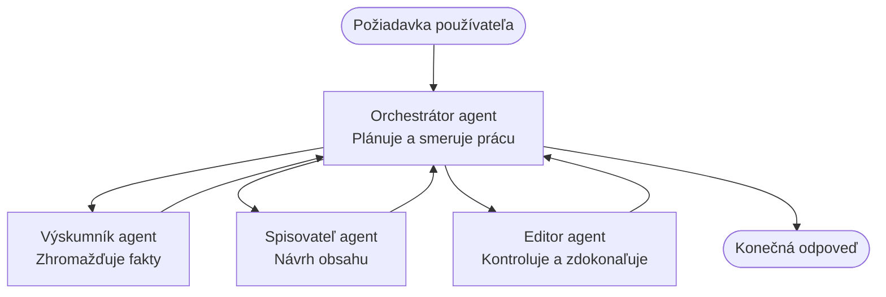

# Základy viacagentových systémov - Nasadte svoj prvý koordinovaný AI systém

**Navigácia kapitolou:**
- **📚 Domov kurzu**: [AZD pre začiatočníkov](../../README.md)
- **📖 Aktuálna kapitola**: Kapitola 5 - Viacagentové AI riešenia
- **⬅️ Predchádzajúca**: [Kapitola 4: Infrastruktúra](../chapter-04-infrastructure/README.md)
- **➡️ Nasledujúca**: [Koordinačné vzory](../chapter-06-pre-deployment/coordination-patterns.md)

> Overené na `azd 1.27.1` v júli 2026.

## Úvod

V predchádzajúcich kapitolách ste nasadili jednu aplikáciu—a v kapitole 2 ste nasadili jedného AI agenta. Táto lekcia robí ďalší krok: nasadenie **viacagentového systému**, kde niekoľko špecializovaných agentov spolupracuje na riešení problému, ktorý by jeden agent nedokázal dobre zvládnuť sám.

Dobrú správu pre začiatočníkov: **nemusíte sa učiť nové príkazy.** Viacagentové riešenie je stále azd projekt. Budete robiť `azd init`, `azd up`, testovať a `azd down`—presne tak, ako už poznáte. Čo sa mení, je *podoba* aplikácie vnútri.

## Ciele učenia

Na konci tejto lekcie budete:
- Rozumieť, čo znamená "viacagentový" a kedy stojí za to pridať zložitosť
- Spoznať bežné úlohy vo viacagentovom systéme (orchestrátor + špecialisti)
- Nasadiť skutočnú, funkčnú viacagentovú šablónu pomocou `azd up`
- Rozumieť Azure zdrojom, ktoré podporujú viacagentovú aplikáciu
- Vedieť, ako bezpečne overiť, prispôsobiť a odstrániť riešenie

## Výsledky učenia

Po dokončení tejto lekcie budete schopní:
- Vysvetliť rozdiel medzi jedným agentom a viacagentovým systémom
- Vybrať medzi jedným agentom s nástrojmi a skutočným viacagentovým dizajnom
- Nasadiť a otestovať viacagentovú šablónu od začiatku do konca pomocou azd
- Identifikovať, kde každý agent beží a ako spolu komunikujú
- Vyčistiť všetky zdroje, aby ste sa vyhli ďalším poplatkom

---

## Čo je viacagentový systém?

Jediný AI agent je jeden model so sadou inštrukcií a (voliteľne) nejakými nástrojmi. To dobre funguje pre zamerané úlohy. Ale keď úloha rastie—výskum, potom písanie, potom editovanie, potom overovanie faktov—všetko narvať do jedného promptu robí agenta pomalším, menej spoľahlivým a ťažšie laditeľným.

**Viacagentový systém** rozdeľuje prácu na špecialistov, ktorí robia každý jednu úlohu dobre, koordinovaných orchestrátorom:



### Dve úlohy, ktoré vždy uvidíte

| Úloha | Práca | Príklad |
|------|-------|---------|
| **Orchestrátor** | Rozhoduje *čo sa deje ďalej* a rozdeľuje prácu medzi agentov | "Najprv výskum, potom písanie, potom editovanie" |
| **Špecialista** | Robí jednu zameranú úlohu a vracia výsledok | „výskumník“, ktorý len zhromažďuje fakty |

### Naozaj potrebujete viac agentov?

Začnite jednoducho. Viacagentový systém používajte **len** keď platí niektoré z týchto:

- ✅ Úloha má **odlišné fázy**, ktoré potrebujú rôzne inštrukcie (výskum vs. písanie vs. kontrola)
- ✅ Chcete, aby špecialisti bežali **súbežne**, aby ste ušetrili čas
- ✅ Rôzne kroky potrebujú **rôzne nástroje alebo zdroje dát**
- ✅ Potrebujete, aby každý krok bol **nezávisle možné testovať a ladit**

Ak je úloha jednoduchá otázka-odpoveď alebo jednoduché volanie nástroja, **jeden agent s nástrojmi** (Kapitola 2) je jednoduchší, lacnejší a ľahšie spravovateľný.

> **Tip pre začiatočníkov:** "Viac agentov" neznamená "lepšie." Každý agent pridáva oneskorenie, náklady a novú vec na sledovanie. Agentov pridávajte len keď sa problém jasne rozdelí na časti.

---

## Dva spôsoby, ako zostrojiť viacagentový systém na Azure

| Prístup | Čo to je | Najvhodnejšie pre |
|---------|----------|--------------------|
| **Jeden agent + nástroje** | Jeden Foundry agent, ktorý volá funkcie/nástroje | Jednoduché toky práce, začiatky |
| **Viac koordinovaných agentov** | Niekoľko agentov s orchestrátorom | Odlišné fázy, paralelná práca, špecializácia |

Táto lekcia sa zameriava na druhý prístup pomocou **hotovej šablóny**, aby ste videli reálny viacagentový systém v prevádzke ešte predtým, než si postavíte vlastný.

---

## Prakticky: Nasadenie funkčnej viacagentovej aplikácie

Nasadíme **Contoso Creative Writer**, oficiálny Azure príklad, ktorý používa viac agentov (výskumník, pisateľ, editor) koordinovaných na vytvorenie článku. Je to výborná prvá viacagentová aplikácia, pretože úlohy sú ľahko pochopiteľné.

### Krok 1: Inicializácia šablóny

```bash
# Vytvorte pracovný priečinok
mkdir creative-writer && cd creative-writer

# Inicializujte z oficiálnej šablóny pre viacagentové systémy
azd init --template contoso-creative-writer
```

> Kedykoľvek si môžete prezrieť viacagentové šablóny v [Awesome AZD AI galérii](https://azure.github.io/awesome-azd/?tags=ai). Ďalšie vhodné pre začiatočníkov sú `get-started-with-ai-agents` a `azure-ai-travel-agents`.

### Krok 2: Overenie identity

```bash
# Vyžaduje sa pre pracovné postupy azd
azd auth login
```

### Krok 3: Vytvorenie prostredia

```bash
azd env new dev
```

### Krok 4: Náhľad, potom nasadenie

```bash
# Pozrite si, čo bude vytvorené, predtým než niečo miniete (odporúčané)
azd provision --preview

# Poskytnite infraštruktúru a nasadzujte všetkých agentov v jednom kroku
azd up
```

`azd up` vás vyzve na predplatné a región, potom provisionuje Azure zdroje a nasadí aplikáciu. Nasadzovanie AI môže trvať dlhšie než jednoduchá webová appka—ak nasadzujete väčšie modely, môžete predĺžiť časový limit nasadenia:

```bash
azd deploy --timeout 1800
```

> **Upozornenie ohľadom nákladov a kapacity:** Viacagentové aplikácie nasadzujú AI modely, ktoré spotrebúvajú kvótu a prinášajú náklady. Ak `azd up` zlyhá kvôli kvóte modelu, pozrite [Riešenie problémov s AI](../chapter-07-troubleshooting/ai-troubleshooting.md) pre opravy regiónu a kvóty, a kapitolu 6 [Plánovanie kapacity](../chapter-06-pre-deployment/capacity-planning.md).

---

## Pochopenie čo ste nasadili

Typická viacagentová aplikácia ako táto provisionuje sadu Azure zdrojov, ktoré priamo zodpovedajú zodpovednostiam v diagrame vyššie:

| Zdroj | Prečo tu je |
|-------|-------------|
| **Microsoft Foundry / Modely** | Hostuje jazykové modely, ktoré každý agent používa |
| **Azure AI Search** | Dáva výskumníkovi agenta pevné dáta na vyhľadávanie |
| **Container Apps** (alebo App Service) | Hostuje orchestrátora a kód agentov |
| **Cosmos DB** (v niektorých príkladoch) | Ukladá zdieľaný stav/pamäť prenášanú medzi agentmi |
| **Application Insights** | Sleduje požiadavky *naprieč* agentmi, aby ste mohli ladiť tok |

### Ako agenti komunikujú

Vo väčšine azd viacagentových príkladov **orchestrátor beží vo vašom aplikačnom kóde** (napríklad pomocou frameworku ako Semantic Kernel alebo Microsoft Agent Framework). Orchestrátor vyvoláva jednotlivých špecialistov postupne, odovzdáva výsledky a zostavuje konečnú odpoveď. Agentom zdieľajú kontext cez:

- **Volania funkcií/nástrojov** — orchestrátor vyvolá špecialistu a dostane späť výsledok
- **Zdieľaná pamäť** — databáza (často Cosmos DB) uchováva stav, ktorý obaja agenti čítajú
- **Správy/udalosti** — pre voľnejšie prepojenie, agenti komunikujú cez frontu alebo Service Bus

> **Prečo je to dôležité pre ladenie:** Keďže každý krok je samostatný, Application Insights vám ukáže, *ktorý* agent bol pomalý alebo zlyhal. To je hlavný dôvod, prečo práce rozdeliť medzi agentov.

---

## Overenie nasadenia

Potvrďte, že systém skutočne funguje pred ďalším krokom:

```bash
# Zobraziť nasadené koncové body
azd show

# Otvoriť monitorovací panel aplikácie
azd monitor

# Sledovať logy, ak niečo vyzerá nesprávne
azd monitor --logs
```

Potom otvorte URL aplikácie z `azd show` a skúste požiadavku, ktorá vyvolá všetkých agentov (pre Creative Writer, požiadajte ho, aby napísal krátky článok na tému). V Application Insights **transaction search** by ste mali vidieť, ako sa požiadavka rozdelí medzi výskumník, pisateľa a editora.

**Kritériá úspechu:**
- ✅ `azd show` vypisuje dostupný endpoint
- ✅ Požiadavka prináša výsledok, ktorý prešiel viac fázami
- ✅ Application Insights ukazuje trasovanie pre viac než jeden krok agenta

---

## Prispôsobenie: Pridajte alebo upravte agenta

Keďže každý agent sú len inštrukcie plus nástroje, prispôsobovanie je dostupné:

1. **Nájdite definície agentov** v šablóne (často v priečinkoch `prompts/`, `agents/` alebo súboroch `*.prompty`).
2. **Doladte inštrukcie agenta** — napríklad povedzte editorovi, aby dodržiaval konkrétny tón alebo počet slov.
3. **Nasadte len kód znova** (infrastruktúra sa nemení):

   ```bash
   azd deploy
   ```

Ak chcete ísť ďalej a vytvárať agentov z *vlastného* manifestu, použite rozšírenie pre agentov a jeho plný životný cyklus:

```bash
azd extension install azure.ai.agents
azd ai agent init -m agent-manifest.yaml
azd up
azd ai agent invoke      # test, s časovaním odpovede
```

Pozrite [Kapitolu 2: Agenti](../chapter-02-ai-development/agents.md) a [AZD AI CLI referenciu](../chapter-08-production/production-ai-practices.md#azd-ai-cli-commands-and-extensions) pre kompletný životný cyklus agenta (`invoke`, `eval generate`, `optimize`, `delete`).

---

## Vyčistenie

Viacagentové aplikácie prevádzkujú viac platených služieb. Po skončení všetko odstráňte:

```bash
azd down --force --purge
```

`--purge` parameter tiež odstraňuje soft-deleteované AI zdroje (ako Foundry/Azure AI Services účty), aby neblokovali budúce nasadenie ani nezvyšovali náklady.

---

## Poznámka o produkčných viacagentových systémoch

[Retail Multi-Agent Solution](../../examples/retail-scenario.md) v tomto repozitári je **architektonická šablóna**, nie šablóna na jedno príkazové nasadenie—dokumentuje, ako by sa produkčný maloobchodný systém *postavil* (a dovoľuje povedať, že úplná stavba je značné úsilie). Použite ju ako dizajnový zdroj *po* tom, čo nasadíte tu fungujúci príklad. Pre produkčné potreby (odolnosť, náklady, monitorovanie, správa) pokračujte do [Kapitoly 8: Produkčné AI praktiky](../chapter-08-production/production-ai-practices.md).

---

## Zhrnutie

- Viacagentový systém rozdeľuje prácu medzi špecialistov koordinovaných orchestrátorom.
- Používajte ho len keď úloha má odlišné fázy, paralelizmus alebo rôzne nástroje pre jednotlivé kroky—inak radšej jeden agent.
- Azd workflow sa nemení: `azd init` → `azd up` → test → `azd down`.
- Skutočná šablóna ako `contoso-creative-writer` vám dnes umožní vidieť a prispôsobiť fungujúcu viacagentovú aplikáciu.
- Trasovanie Application Insights naprieč agentmi je jeden z najväčších praktických prínosov viacagentového dizajnu.

---

## 🔗 Navigácia

| Smer | Lekcia |
|-------|--------|
| **Predchádzajúca** | [Kapitola 4: Infrastruktúra](../chapter-04-infrastructure/README.md) |
| **Nasledujúca** | [Koordinačné vzory](../chapter-06-pre-deployment/coordination-patterns.md) |

## 📖 Súvisiace zdroje

- [Sprievodca agentmi AI](../chapter-02-ai-development/agents.md)
- [Koordinačné vzory](../chapter-06-pre-deployment/coordination-patterns.md)
- [Produkčné AI praktiky](../chapter-08-production/production-ai-practices.md)
- [Riešenie problémov s AI](../chapter-07-troubleshooting/ai-troubleshooting.md)

---

<!-- CO-OP TRANSLATOR DISCLAIMER START -->
**Vyhlásenie o zodpovednosti**:
Tento dokument bol preložený pomocou AI prekladateľskej služby [Co-op Translator](https://github.com/Azure/co-op-translator). Hoci sa snažíme o presnosť, vezmite prosím na vedomie, že automatické preklady môžu obsahovať chyby alebo nepresnosti. Pôvodný dokument v jeho natívnom jazyku by mal byť považovaný za autoritatívny zdroj. Pre kritické informácie sa odporúča profesionálny ľudský preklad. Nie sme zodpovední za žiadne nedorozumenia alebo nesprávne interpretácie vyplývajúce z použitia tohto prekladu.
<!-- CO-OP TRANSLATOR DISCLAIMER END -->