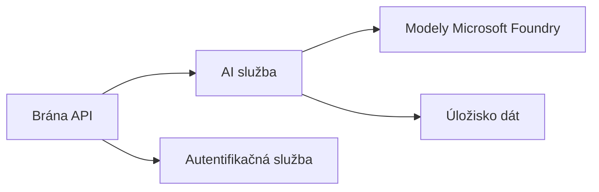

# Kapitola 8: Produkčné a podnikové vzory

**📚 Kurz**: [AZD Pre Začiatočníkov](../../README.md) | **⏱️ Trvanie**: 2-3 hodiny | **⭐ Zložitosť**: Pokročilý

---

## Prehľad

Táto kapitola pokrýva vzory nasadenia vhodné pre podnikové prostredie, zabezpečenie, monitorovanie a optimalizáciu nákladov pre produkčné AI záťaže.

> Overené na `azd 1.27.1` v júli 2026.

## Ciele učenia

Po dokončení tejto kapitoly budete:
- Nasadzovať viacregionálne odolné aplikácie
- Implementovať podnikové bezpečnostné vzory
- Konfigurovať komplexné monitorovanie
- Optimalizovať náklady v rozsahu
- Nastaviť CI/CD pipeline pomocou AZD

---

## 📚 Lekcie

| # | Lekcia | Popis | Čas |
|---|--------|-------------|------|
| 1 | [Produkčné AI Praktiky](production-ai-practices.md) | Podnikové vzory nasadenia | 90 min |

---

## 🚀 Produkčný kontrolný zoznam

- [ ] Viacregionálne nasadenie pre odolnosť
- [ ] Spravovaná identita pre autentifikáciu (bez kľúčov)
- [ ] Application Insights pre monitorovanie
- [ ] Nastavené rozpočty a upozornenia na náklady
- [ ] Povolené bezpečnostné skenovanie
- [ ] Integrácia CI/CD pipeline
- [ ] Plán obnovy po havárii

---

## 🏗️ Architektonické vzory

### Vzor 1: Ai mikroservisy



### Vzor 2: Udalosťami riadené AI


---

## 🔐 Najlepšie bezpečnostné postupy

```bicep
// Use managed identity
identity: {
  type: 'SystemAssigned'
}

// Private endpoints for AI services
properties: {
  publicNetworkAccess: 'Disabled'
  networkAcls: {
    defaultAction: 'Deny'
  }
}
```

---

## 💰 Optimalizácia nákladov

| Stratégia | Úspory |
|----------|---------|
| Škálovanie na nulu (Container Apps) | 60-80% |
| Použitie spotrebných úrovní pre dev | 50-70% |
| Plánované škálovanie | 30-50% |
| Rezervovaná kapacita | 20-40% |

```bash
# Nastaviť upozornenia rozpočtu
az consumption budget create \
  --budget-name "AI-Budget" \
  --amount 500 \
  --category Cost \
  --time-grain Monthly
```

---

## 📊 Nastavenie monitorovania

```bash
# Streamujte protokoly
azd monitor --logs

# Skontrolujte Application Insights
azd monitor --overview

# Zobraziť metriky
az monitor metrics list --resource <resource-id>
```

---

## 🔗 Navigácia

| Smer | Kapitola |
|-----------|---------|
| **Predchádzajúca** | [Kapitola 7: Riešenie problémov](../chapter-07-troubleshooting/README.md) |
| **Kurz dokončený** | [Domov kurzu](../../README.md) |

---

## 📖 Súvisiace zdroje

- [Sprievodca AI agentmi](../chapter-02-ai-development/agents.md)
- [Application Insights](../chapter-06-pre-deployment/application-insights.md)
- [Multi-Agent Riešenia](../chapter-05-multi-agent/README.md)
- [Príklad Mikroservisov](../../examples/microservices/README.md)

---

<!-- CO-OP TRANSLATOR DISCLAIMER START -->
**Vyhlásenie o zodpovednosti**:
Tento dokument bol preložený pomocou AI prekladateľskej služby [Co-op Translator](https://github.com/Azure/co-op-translator). Hoci sa snažíme o presnosť, vezmite prosím na vedomie, že automatické preklady môžu obsahovať chyby alebo nepresnosti. Pôvodný dokument v jeho natívnom jazyku by mal byť považovaný za autoritatívny zdroj. Pre kritické informácie sa odporúča profesionálny ľudský preklad. Nie sme zodpovední za žiadne nedorozumenia alebo nesprávne interpretácie vyplývajúce z použitia tohto prekladu.
<!-- CO-OP TRANSLATOR DISCLAIMER END -->