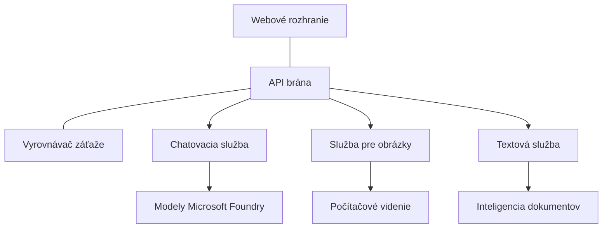

# Najlepšie postupy pre produkčné AI pracovné zaťaženia s AZD

**Navigácia kapitoly:**
- **📚 Domov kurzu**: [AZD pre začiatočníkov](../../README.md)
- **📖 Aktuálna kapitola**: Kapitola 8 - Produkčné a podnikové vzory
- **⬅️ Predchádzajúca kapitola**: [Kapitola 7: Riešenie problémov](../chapter-07-troubleshooting/debugging.md)
- **⬅️ Tiež súvisiace**: [AI Workshop Laboratórium](ai-workshop-lab.md)
- **🎯 Kurz dokončený**: [AZD pre začiatočníkov](../../README.md)

## Prehľad

Tento sprievodca poskytuje komplexné najlepšie postupy pre nasadzovanie produkčne pripravených AI pracovných zaťažení pomocou Azure Developer CLI (AZD). Na základe spätnej väzby od komunity Microsoft Foundry na Discorde a nasadení u zákazníkov v reálnom svete tieto postupy riešia najčastejšie výzvy v produkčných AI systémoch.

## Kľúčové riešené výzvy

Na základe výsledkov našej komunitnej ankety sú toto hlavné výzvy, ktorým vývojári čelia:

- **45%** majú problémy s nasadzovaním AI pozostávajúcim z viacerých služieb
- **38%** majú problémy s riadením poverení a tajomstiev  
- **35%** považujú pripravenosť na produkciu a škálovanie za náročné
- **32%** potrebujú lepšie stratégie optimalizácie nákladov
- **29%** potrebujú zlepšené monitorovanie a ladenie problémov

## Architektonické vzory pre produkčné AI

### Vzor 1: Mikroslužbová AI architektúra

**Kedy použiť**: Zložité AI aplikácie s viacerými schopnosťami


**Implementácia v AZD**:

```yaml
# azure.yaml
name: enterprise-ai-platform
services:
  web:
    project: ./web
    host: staticwebapp
  api-gateway:
    project: ./api-gateway
    host: containerapp
  chat-service:
    project: ./services/chat
    host: containerapp
  vision-service:
    project: ./services/vision
    host: containerapp
  text-service:
    project: ./services/text
    host: containerapp
```

### Vzor 2: Udalostné (event-driven) spracovanie AI

**Kedy použiť**: Spracovanie dávok, analýza dokumentov, asynchrónne pracovné postupy

```bicep
// Event Hub for AI processing pipeline
resource eventHub 'Microsoft.EventHub/namespaces@2023-01-01-preview' = {
  name: eventHubNamespaceName
  location: location
  sku: {
    name: 'Standard'
    tier: 'Standard'
    capacity: 1
  }
}

// Service Bus for reliable message processing
resource serviceBus 'Microsoft.ServiceBus/namespaces@2022-10-01-preview' = {
  name: serviceBusNamespaceName
  location: location
  sku: {
    name: 'Premium'
    tier: 'Premium'
    capacity: 1
  }
}

// Function App for processing
resource functionApp 'Microsoft.Web/sites@2023-01-01' = {
  name: functionAppName
  location: location
  kind: 'functionapp,linux'
  properties: {
    siteConfig: {
      appSettings: [
        {
          name: 'FUNCTIONS_EXTENSION_VERSION'
          value: '~4'
        }
        {
          name: 'AZURE_OPENAI_ENDPOINT'
          value: '@Microsoft.KeyVault(VaultName=${keyVault.name};SecretName=openai-endpoint)'
        }
      ]
    }
  }
}
```

## Úvahy o zdraví AI agenta

Keď sa tradičná webová aplikácia pokazí, symptómy sú známe: stránka sa nenačíta, API vráti chybu alebo nasadenie zlyhá. AI-poháňané aplikácie sa môžu pokaziť rovnakými spôsobmi — ale môžu sa tiež správať nenápadnejšie, bez zrejmých chybových hlásení.

Táto sekcia vám pomôže vybudovať mentálny model pre monitorovanie AI pracovných zaťažení, aby ste vedeli, kam sa pozerať, keď niečo nevyzerá správne.

### Ako sa stav agenta líši od stavu tradičnej aplikácie

Tradičná aplikácia buď funguje, alebo nie. AI agent môže vyzerať, že funguje, ale produkovať zlé výsledky. Uvažujte o zdraví agenta v dvoch vrstvách:

| Vrstva | Čo sledovať | Kde sa pozrieť |
|-------|--------------|---------------|
| **Stav infraštruktúry** | Beží služba? Sú zdroje zriadené? Sú koncové body dostupné? | `azd monitor`, Azure Portal resource health, container/app logs |
| **Stav správania** | Reaguje agent presne? Sú odpovede načas? Je model volaný správne? | trace v Application Insights, metriky latencie volaní modelu, logy kvality odpovedí |

Stav infraštruktúry je známy — je rovnaký pre akúkoľvek azd aplikáciu. Stav správania je nová vrstva, ktorú AI pracovné zaťaženia prinášajú.

### Kam sa pozerať, keď sa AI aplikácie nechovajú podľa očakávaní

Ak vaša AI aplikácia neprodukuje očakávané výsledky, tu je konceptuálny kontrolný zoznam:

1. **Začnite so základmi.** Beží aplikácia? Môže dosiahnuť svoje závislosti? Skontrolujte `azd monitor` a stav zdrojov rovnako, ako by ste to urobili pri akejkoľvek aplikácii.
2. **Skontrolujte spojenie s modelom.** Volá vaša aplikácia úspešne AI model? Zlyhané alebo časovo prekročené volania modelu sú najčastejšou príčinou problémov AI aplikácií a ukážu sa vo vašich aplikačných logoch.
3. **Pozrite sa na to, čo model dostal.** Odpovede AI závisia od vstupu (promptu a akéhokoľvek získaného kontextu). Ak je výstup zlý, vstup je zvyčajne zlý. Skontrolujte, či vaša aplikácia posiela modelu správne dáta.
4. **Preverte latenciu odpovedí.** Volania AI modelov sú pomalšie ako bežné API volania. Ak sa aplikácia javí pomalá, skontrolujte, či sa časy odpovedí modelu nezvýšili — to môže naznačovať obmedzovanie, kapacitné limity alebo preťaženie na úrovni regiónu.
5. **Sledujte signály nákladov.** Neočakávané špičky v používaní tokenov alebo API volaniach môžu naznačovať slučku, nesprávne nakonfigurovaný prompt alebo nadmerné opakovania.

Nemusíte hneď ovládať nástroje observability. Kľúčové zistenie je, že AI aplikácie majú ďalšiu vrstvu správania, ktorú treba monitorovať, a vstavané monitorovanie azd (`azd monitor`) vám dá východiskový bod na preskúmanie oboch vrstiev.

---

## Najlepšie bezpečnostné postupy

### 1. Model Zero-Trust

**Implementačná stratégia**:
- Žiadna komunikácia služba–služba bez autentifikácie
- Všetky API volania používajú spravované identity
- Sieťová izolácia s privátnymi koncovými bodmi
- Prístup s minimálnymi právami

```bicep
// Managed Identity for each service
resource chatServiceIdentity 'Microsoft.ManagedIdentity/userAssignedIdentities@2023-01-31' = {
  name: 'chat-service-identity'
  location: location
}

// Role assignments with minimal permissions
resource openAIUserRole 'Microsoft.Authorization/roleAssignments@2022-04-01' = {
  scope: openAIAccount
  name: guid(openAIAccount.id, chatServiceIdentity.id, openAIUserRoleDefinitionId)
  properties: {
    roleDefinitionId: subscriptionResourceId('Microsoft.Authorization/roleDefinitions', '5e0bd9bd-7b93-4f28-af87-19fc36ad61bd')
    principalId: chatServiceIdentity.properties.principalId
    principalType: 'ServicePrincipal'
  }
}
```

### 2. Bezpečné riadenie tajomstiev

**Vzor integrácie s Key Vault**:

```bicep
// Key Vault with proper access policies
resource keyVault 'Microsoft.KeyVault/vaults@2023-02-01' = {
  name: keyVaultName
  location: location
  properties: {
    tenantId: tenant().tenantId
    sku: {
      family: 'A'
      name: 'premium'  // Use premium for production
    }
    enableRbacAuthorization: true  // Use RBAC instead of access policies
    enablePurgeProtection: true    // Prevent accidental deletion
    enableSoftDelete: true
    softDeleteRetentionInDays: 90
  }
}

// Store all AI service credentials
resource openAIKeySecret 'Microsoft.KeyVault/vaults/secrets@2023-02-01' = {
  parent: keyVault
  name: 'openai-api-key'
  properties: {
    value: openAIAccount.listKeys().key1
    attributes: {
      enabled: true
    }
  }
}
```

### 3. Sieťová bezpečnosť

**Konfigurácia privátnych koncových bodov**:

```bicep
// Virtual Network for AI services
resource virtualNetwork 'Microsoft.Network/virtualNetworks@2023-04-01' = {
  name: vnetName
  location: location
  properties: {
    addressSpace: {
      addressPrefixes: ['10.0.0.0/16']
    }
    subnets: [
      {
        name: 'ai-services-subnet'
        properties: {
          addressPrefix: '10.0.1.0/24'
          privateEndpointNetworkPolicies: 'Disabled'
        }
      }
      {
        name: 'app-services-subnet'
        properties: {
          addressPrefix: '10.0.2.0/24'
          delegations: [
            {
              name: 'Microsoft.Web/serverFarms'
              properties: {
                serviceName: 'Microsoft.Web/serverFarms'
              }
            }
          ]
        }
      }
    ]
  }
}

// Private endpoints for all AI services
resource openAIPrivateEndpoint 'Microsoft.Network/privateEndpoints@2023-04-01' = {
  name: '${openAIAccountName}-pe'
  location: location
  properties: {
    subnet: {
      id: virtualNetwork.properties.subnets[0].id
    }
    privateLinkServiceConnections: [
      {
        name: 'openai-connection'
        properties: {
          privateLinkServiceId: openAIAccount.id
          groupIds: ['account']
        }
      }
    ]
  }
}
```

## Výkon a škálovanie

### 1. Stratégie automatického škálovania

**Automatické škálovanie Container Apps**:

```bicep
resource containerApp 'Microsoft.App/containerApps@2023-05-01' = {
  name: containerAppName
  location: location
  properties: {
    configuration: {
      ingress: {
        external: true
        targetPort: 8000
        transport: 'http'
      }
    }
    template: {
      scale: {
        minReplicas: 2  // Always have 2 instances minimum
        maxReplicas: 50 // Scale up to 50 for high load
        rules: [
          {
            name: 'http-scaling'
            http: {
              metadata: {
                concurrentRequests: '20'  // Scale when >20 concurrent requests
              }
            }
          }
          {
            name: 'cpu-scaling'
            custom: {
              type: 'cpu'
              metadata: {
                type: 'Utilization'
                value: '70'  // Scale when CPU >70%
              }
            }
          }
        ]
      }
    }
  }
}
```

### 2. Stratégie ukladania do cache

**Redis Cache pre odpovede AI**:

```bicep
// Redis Premium for production workloads
resource redisCache 'Microsoft.Cache/redis@2023-04-01' = {
  name: redisCacheName
  location: location
  properties: {
    sku: {
      name: 'Premium'
      family: 'P'
      capacity: 1
    }
    enableNonSslPort: false
    minimumTlsVersion: '1.2'
    redisConfiguration: {
      'maxmemory-policy': 'allkeys-lru'
    }
    // Enable clustering for high availability
    redisVersion: '6.0'
    shardCount: 2
  }
}

// Cache configuration in application
var cacheConnectionString = '${redisCache.properties.hostName}:6380,password=${redisCache.listKeys().primaryKey},ssl=True,abortConnect=False'
```

### 3. Vyrovnávanie zaťaženia a riadenie prevádzky

**Application Gateway s WAF**:

```bicep
// Application Gateway with Web Application Firewall
resource applicationGateway 'Microsoft.Network/applicationGateways@2023-04-01' = {
  name: appGatewayName
  location: location
  properties: {
    sku: {
      name: 'WAF_v2'
      tier: 'WAF_v2'
      capacity: 2
    }
    webApplicationFirewallConfiguration: {
      enabled: true
      firewallMode: 'Prevention'
      ruleSetType: 'OWASP'
      ruleSetVersion: '3.2'
    }
    // Backend pools for AI services
    backendAddressPools: [
      {
        name: 'ai-services-pool'
        properties: {
          backendAddresses: [
            {
              fqdn: '${containerApp.properties.configuration.ingress.fqdn}'
            }
          ]
        }
      }
    ]
  }
}
```

## 💰 Optimalizácia nákladov

### 1. Správne dimenzovanie zdrojov

**Konfigurácie špecifické pre prostredie**:

```bash
# Vývojové prostredie
azd env new development
azd env set AZURE_OPENAI_SKU "S0"
azd env set AZURE_OPENAI_CAPACITY 10
azd env set AZURE_SEARCH_SKU "basic"
azd env set CONTAINER_CPU 0.5
azd env set CONTAINER_MEMORY 1.0

# Produkčné prostredie
azd env new production
azd env set AZURE_OPENAI_SKU "S0"
azd env set AZURE_OPENAI_CAPACITY 100
azd env set AZURE_SEARCH_SKU "standard"
azd env set CONTAINER_CPU 2.0
azd env set CONTAINER_MEMORY 4.0
```

### 2. Monitorovanie nákladov a rozpočty

```bicep
// Cost management and budgets
resource budget 'Microsoft.Consumption/budgets@2023-05-01' = {
  name: 'ai-workload-budget'
  properties: {
    timePeriod: {
      startDate: '2024-01-01'
      endDate: '2024-12-31'
    }
    timeGrain: 'Monthly'
    amount: 2000  // $2000 monthly budget
    category: 'Cost'
    notifications: {
      warning: {
        enabled: true
        operator: 'GreaterThan'
        threshold: 80
        contactEmails: [
          'finance@company.com'
          'engineering@company.com'
        ]
        contactRoles: [
          'Owner'
          'Contributor'
        ]
      }
      critical: {
        enabled: true
        operator: 'GreaterThan'
        threshold: 95
        contactEmails: [
          'cto@company.com'
        ]
      }
    }
  }
}
```

### 3. Optimalizácia spotreby tokenov

**Správa nákladov OpenAI**:

```typescript
// Optimalizácia tokenov na úrovni aplikácie
class TokenOptimizer {
  private readonly maxTokens = 4000;
  private readonly reserveTokens = 500;
  
  optimizePrompt(userInput: string, context: string): string {
    const availableTokens = this.maxTokens - this.reserveTokens;
    const estimatedTokens = this.estimateTokens(userInput + context);
    
    if (estimatedTokens > availableTokens) {
      // Orežte kontext, nie vstup používateľa
      context = this.truncateContext(context, availableTokens - this.estimateTokens(userInput));
    }
    
    return `${context}\n\nUser: ${userInput}`;
  }
  
  private estimateTokens(text: string): number {
    // Hrubý odhad: 1 token ≈ 4 znaky
    return Math.ceil(text.length / 4);
  }
}
```

## Monitorovanie a pozorovateľnosť

### 1. Komplexné použitie Application Insights

```bicep
// Application Insights with advanced features
resource applicationInsights 'Microsoft.Insights/components@2020-02-02' = {
  name: applicationInsightsName
  location: location
  kind: 'web'
  properties: {
    Application_Type: 'web'
    WorkspaceResourceId: logAnalyticsWorkspace.id
    SamplingPercentage: 100  // Full sampling for AI apps
    DisableIpMasking: false  // Enable for security
  }
}

// Custom metrics for AI operations
resource aiMetricAlerts 'Microsoft.Insights/metricAlerts@2018-03-01' = {
  name: 'ai-high-error-rate'
  location: 'global'
  properties: {
    description: 'Alert when AI service error rate is high'
    severity: 2
    enabled: true
    scopes: [
      applicationInsights.id
    ]
    evaluationFrequency: 'PT1M'
    windowSize: 'PT5M'
    criteria: {
      'odata.type': 'Microsoft.Azure.Monitor.SingleResourceMultipleMetricCriteria'
      allOf: [
        {
          name: 'high-error-rate'
          metricName: 'requests/failed'
          operator: 'GreaterThan'
          threshold: 10
          timeAggregation: 'Count'
        }
      ]
    }
  }
}
```

### 2. Monitorovanie špecifické pre AI

**Vlastné dashboardy pre AI metriky**:

```json
// Dashboard configuration for AI workloads
{
  "dashboard": {
    "name": "AI Application Monitoring",
    "tiles": [
      {
        "name": "OpenAI Request Volume",
        "query": "requests | where name contains 'openai' | summarize count() by bin(timestamp, 5m)"
      },
      {
        "name": "AI Response Latency",
        "query": "requests | where name contains 'openai' | summarize avg(duration) by bin(timestamp, 5m)"
      },
      {
        "name": "Token Usage",
        "query": "customMetrics | where name == 'openai_tokens_used' | summarize sum(value) by bin(timestamp, 1h)"
      },
      {
        "name": "Cost per Hour",
        "query": "customMetrics | where name == 'openai_cost' | summarize sum(value) by bin(timestamp, 1h)"
      }
    ]
  }
}
```

### 3. Kontroly stavu a monitorovanie dostupnosti

```bicep
// Application Insights availability tests
resource availabilityTest 'Microsoft.Insights/webtests@2022-06-15' = {
  name: 'ai-app-availability-test'
  location: location
  tags: {
    'hidden-link:${applicationInsights.id}': 'Resource'
  }
  properties: {
    SyntheticMonitorId: 'ai-app-availability-test'
    Name: 'AI Application Availability Test'
    Description: 'Tests AI application endpoints'
    Enabled: true
    Frequency: 300  // 5 minutes
    Timeout: 120    // 2 minutes
    Kind: 'ping'
    Locations: [
      {
        Id: 'us-east-2-azr'
      }
      {
        Id: 'us-west-2-azr'
      }
    ]
    Configuration: {
      WebTest: '''
        <WebTest Name="AI Health Check" 
                 Id="8d2de8d2-a2b0-4c2e-9a0d-8f9c9a0b8c8d" 
                 Enabled="True" 
                 CssProjectStructure="" 
                 CssIteration="" 
                 Timeout="120" 
                 WorkItemIds="" 
                 xmlns="http://microsoft.com/schemas/VisualStudio/TeamTest/2010" 
                 Description="" 
                 CredentialUserName="" 
                 CredentialPassword="" 
                 PreAuthenticate="True" 
                 Proxy="default" 
                 StopOnError="False" 
                 RecordedResultFile="" 
                 ResultsLocale="">
          <Items>
            <Request Method="GET" 
                     Guid="a5f10126-e4cd-570d-961c-cea43999a200" 
                     Version="1.1" 
                     Url="${webApp.properties.defaultHostName}/health" 
                     ThinkTime="0" 
                     Timeout="120" 
                     ParseDependentRequests="True" 
                     FollowRedirects="True" 
                     RecordResult="True" 
                     Cache="False" 
                     ResponseTimeGoal="0" 
                     Encoding="utf-8" 
                     ExpectedHttpStatusCode="200" 
                     ExpectedResponseUrl="" 
                     ReportingName="" 
                     IgnoreHttpStatusCode="False" />
          </Items>
        </WebTest>
      '''
    }
  }
}
```

## Obnova po havárii a vysoká dostupnosť

### 1. Nasadenie naprieč viacerými regiónmi

```yaml
# azure.yaml - Multi-region configuration
name: ai-app-multiregion
services:
  api-primary:
    project: ./api
    host: containerapp
    env:
      - AZURE_REGION=eastus
  api-secondary:
    project: ./api
    host: containerapp
    env:
      - AZURE_REGION=westus2
```

```bicep
// Traffic Manager for global load balancing
resource trafficManager 'Microsoft.Network/trafficManagerProfiles@2022-04-01' = {
  name: trafficManagerProfileName
  location: 'global'
  properties: {
    profileStatus: 'Enabled'
    trafficRoutingMethod: 'Priority'
    dnsConfig: {
      relativeName: trafficManagerProfileName
      ttl: 30
    }
    monitorConfig: {
      protocol: 'HTTPS'
      port: 443
      path: '/health'
      intervalInSeconds: 30
      toleratedNumberOfFailures: 3
      timeoutInSeconds: 10
    }
    endpoints: [
      {
        name: 'primary-endpoint'
        type: 'Microsoft.Network/trafficManagerProfiles/azureEndpoints'
        properties: {
          targetResourceId: primaryAppService.id
          endpointStatus: 'Enabled'
          priority: 1
        }
      }
      {
        name: 'secondary-endpoint'
        type: 'Microsoft.Network/trafficManagerProfiles/azureEndpoints'
        properties: {
          targetResourceId: secondaryAppService.id
          endpointStatus: 'Enabled'
          priority: 2
        }
      }
    ]
  }
}
```

### 2. Zálohovanie údajov a obnova

```bicep
// Backup configuration for critical data
resource backupVault 'Microsoft.DataProtection/backupVaults@2023-05-01' = {
  name: backupVaultName
  location: location
  identity: {
    type: 'SystemAssigned'
  }
  properties: {
    storageSettings: [
      {
        datastoreType: 'VaultStore'
        type: 'LocallyRedundant'
      }
    ]
  }
}

// Backup policy for AI models and data
resource backupPolicy 'Microsoft.DataProtection/backupVaults/backupPolicies@2023-05-01' = {
  parent: backupVault
  name: 'ai-data-backup-policy'
  properties: {
    policyRules: [
      {
        backupParameters: {
          backupType: 'Full'
          objectType: 'AzureBackupParams'
        }
        trigger: {
          schedule: {
            repeatingTimeIntervals: [
              'R/2024-01-01T02:00:00+00:00/P1D'  // Daily at 2 AM
            ]
          }
          objectType: 'ScheduleBasedTriggerContext'
        }
        dataStore: {
          datastoreType: 'VaultStore'
          objectType: 'DataStoreInfoBase'
        }
        name: 'BackupDaily'
        objectType: 'AzureBackupRule'
      }
    ]
  }
}
```

## DevOps a integrácia CI/CD

### 1. Pracovný postup GitHub Actions

```yaml
# .github/workflows/deploy-ai-app.yml
name: Deploy AI Application

on:
  push:
    branches: [main]
  pull_request:
    branches: [main]

jobs:
  test:
    runs-on: ubuntu-latest
    steps:
      - uses: actions/checkout@v4
      
      - name: Setup Python
        uses: actions/setup-python@v4
        with:
          python-version: '3.11'
          
      - name: Install dependencies
        run: |
          pip install -r requirements.txt
          pip install pytest
          
      - name: Run tests
        run: pytest tests/
        
      - name: AI Safety Tests
        run: |
          python scripts/test_ai_safety.py
          python scripts/validate_prompts.py

  deploy-staging:
    needs: test
    if: github.event_name == 'pull_request'
    runs-on: ubuntu-latest
    steps:
      - uses: actions/checkout@v4
      
      - name: Setup AZD
        uses: Azure/setup-azd@v1.0.0
        
      - name: Login to Azure
        uses: azure/login@v1
        with:
          creds: ${{ secrets.AZURE_CREDENTIALS }}
          
      - name: Deploy to Staging
        run: |
          azd env select staging
          azd deploy

  deploy-production:
    needs: test
    if: github.ref == 'refs/heads/main'
    runs-on: ubuntu-latest
    steps:
      - uses: actions/checkout@v4
      
      - name: Setup AZD
        uses: Azure/setup-azd@v1.0.0
        
      - name: Login to Azure
        uses: azure/login@v1
        with:
          creds: ${{ secrets.AZURE_CREDENTIALS }}
          
      - name: Deploy to Production
        run: |
          azd env select production
          azd deploy
          
      - name: Run Production Health Checks
        run: |
          python scripts/health_check.py --env production
```

### 2. Overovanie infraštruktúry

```bash
# scripts/validate_infrastructure.sh
#!/bin/bash

echo "Validating AI infrastructure deployment..."

# Skontrolovať, či všetky požadované služby bežia
services=("openai" "search" "storage" "keyvault")
for service in "${services[@]}"; do
    echo "Checking $service..."
    if ! az resource list --resource-type "Microsoft.CognitiveServices/accounts" --query "[?contains(name, '$service')]" -o tsv; then
        echo "ERROR: $service not found"
        exit 1
    fi
done

# Overiť nasadenia modelov OpenAI
echo "Validating OpenAI model deployments..."
models=$(az cognitiveservices account deployment list --name $AZURE_OPENAI_NAME --resource-group $AZURE_RESOURCE_GROUP --query "[].name" -o tsv)
if [[ ! $models == *"gpt-35-turbo"* ]]; then
    echo "ERROR: Required model gpt-35-turbo not deployed"
    exit 1
fi

# Otestovať pripojenie k AI službe
echo "Testing AI service connectivity..."
python scripts/test_connectivity.py

echo "Infrastructure validation completed successfully!"
```

## Kontrolný zoznam pripravenosti na produkciu

### Bezpečnosť ✅
- [ ] Všetky služby používajú spravované identity
- [ ] Tajomstvá uložené v Key Vault
- [ ] Konfigurované privátne koncové body
- [ ] Implementované Network Security Groups
- [ ] RBAC s minimálnymi právami
- [ ] WAF povolený na verejných koncových bodoch

### Výkon ✅
- [ ] Konfigurované automatické škálovanie
- [ ] Implementované vyrovnávacie pamäte
- [ ] Nastavené vyrovnávanie zaťaženia
- [ ] CDN pre statický obsah
- [ ] Poolovanie databázových pripojení
- [ ] Optimalizácia používania tokenov

### Monitorovanie ✅
- [ ] Konfigurované Application Insights
- [ ] Definované vlastné metriky
- [ ] Nastavené pravidlá upozornení
- [ ] Vytvorený dashboard
- [ ] Implementované kontroly stavu
- [ ] Politiky uchovávania logov

### Spoľahlivosť ✅
- [ ] Nasadenie v viac regiónoch
- [ ] Plán zálohovania a obnovy
- [ ] Implementované circuit breakery
- [ ] Nakonfigurované politiky opakovaných pokusov
- [ ] Plynulé degradovanie
- [ ] Koncové body pre kontroly stavu

### Správa nákladov ✅
- [ ] Nakonfigurované upozornenia rozpočtu
- [ ] Správne dimenzovanie zdrojov
- [ ] Uplatnené zľavy pre vývoj/testovanie
- [ ] Zakúpené rezervované inštancie
- [ ] Dashboard pre monitorovanie nákladov
- [ ] Pravidelné revízie nákladov

### Súlad ✅
- [ ] Splnené požiadavky na umiestnenie údajov
- [ ] Povolené auditné logovanie
- [ ] Uplatnené politiky súladu
- [ ] Implementované základné bezpečnostné nastavenia
- [ ] Pravidelné bezpečnostné hodnotenia
- [ ] Plán reakcie na incidenty

## Výkonnostné benchmarky

### Typické produkčné metriky

| Metrika | Cieľ | Monitorovanie |
|--------|--------|------------|
| **Doba odozvy** | < 2 sekundy | Application Insights |
| **Dostupnosť** | 99.9% | Monitorovanie dostupnosti |
| **Miera chýb** | < 0.1% | Aplikačné logy |
| **Spotreba tokenov** | < $500/mesiac | Správa nákladov |
| **Súbežní používatelia** | 1000+ | Testovanie zaťaženia |
| **Doba obnovy** | < 1 hodina | Testy obnovy po havárii |

### Testovanie záťaže

```bash
# Skript na záťažové testovanie AI aplikácií
python scripts/load_test.py \
  --endpoint https://your-ai-app.azurewebsites.net \
  --concurrent-users 100 \
  --duration 300 \
  --ramp-up 60
```

## 🤝 Najlepšie postupy komunity

Na základe spätnej väzby komunity Microsoft Foundry na Discorde:

### Hlavné odporúčania od komunity:

1. **Začnite s malým, škálujte postupne**: Začnite so základnými SKU a škálujte podľa skutočného využitia
2. **Monitorujte všetko**: Zaveste komplexné monitorovanie od prvého dňa
3. **Automatizujte bezpečnosť**: Používajte infraštruktúru ako kód pre konzistentnú bezpečnosť
4. **Testujte dôkladne**: Zahrňte testovanie špecifické pre AI do vášho pipeline
5. **Plánujte náklady**: Sledujte spotrebu tokenov a už včas nastavte upozornenia rozpočtu

### Bežné úskalia, ktorým sa vyhnúť:

- ❌ Vkladanie API kľúčov priamo do kódu
- ❌ Nenastavenie správneho monitorovania
- ❌ Ignorovanie optimalizácie nákladov
- ❌ Netestovanie scenárov zlyhania
- ❌ Nasadzovanie bez kontrol stavu

## AZD AI CLI príkazy a rozšírenia

AZD obsahuje rastúcu sadu príkazov a rozšírení špecifických pre AI, ktoré zjednodušujú produkčné AI pracovné postupy. Tieto nástroje preklenujú priepasť medzi lokálnym vývojom a produkčným nasadením AI pracovných zaťažení.

### Rozšírenia AZD pre AI

AZD používa systém rozšírení na pridanie AI-špecifických schopností. Inštalujte a spravujte rozšírenia pomocou:

```bash
# Zobraziť všetky dostupné rozšírenia (vrátane AI)
azd extension list

# Nainštalovať rozšírenie Foundry Agents
azd extension install azure.ai.agents

# Nainštalovať rozšírenie pre doladenie
azd extension install azure.ai.finetune

# Nainštalovať rozšírenie pre vlastné modely
azd extension install azure.ai.models

# Aktualizovať všetky nainštalované rozšírenia
azd extension upgrade --all
```

**Dostupné AI rozšírenia:**

| Rozšírenie | Účel | Stav |
|-----------|---------|--------|
| `azure.ai.agents` | Správa Foundry Agent Service | Preview |
| `azure.ai.finetune` | Ladenie modelov Foundry | Preview |
| `azure.ai.models` | Vlastné modely Foundry | Preview |
| `azure.coding-agent` | Konfigurácia kódovacieho agenta | Dostupné |

### Inicializácia projektov agenta s `azd ai agent init`

Príkaz `azd ai agent init` vygeneruje kostru produkčne pripraveného projektu AI agenta integrovaného s Microsoft Foundry Agent Service:

```bash
# Inicializovať nový projekt agenta z manifestu agenta
azd ai agent init -m <manifest-path-or-uri>

# Inicializovať a nastaviť cieľ na konkrétny projekt Foundry
azd ai agent init -m agent-manifest.yaml --project-id <foundry-project-id>

# Inicializovať s vlastným adresárom zdrojov
azd ai agent init -m agent-manifest.yaml --src ./agents/my-agent

# Nastaviť Container Apps ako hostiteľa
azd ai agent init -m agent-manifest.yaml --host containerapp
```

**Kľúčové prepínače:**

| Prepínač | Popis |
|------|-------------|
| `-m, --manifest` | Cesta alebo URI k manifestu agenta, ktorý sa pridá do vášho projektu |
| `-p, --project-id` | Existujúce ID projektu Microsoft Foundry pre vaše azd prostredie |
| `-s, --src` | Adresár na stiahnutie definície agenta (predvolene `src/<agent-id>`) |
| `--host` | Prepísať predvolený host (napr. `containerapp`) |
| `-e, --environment` | Azd prostredie na použitie |

**Produkčný tip**: Použite `--project-id` na priame pripojenie k existujúcemu Foundry projektu, čím udržíte kód agenta a cloudové zdroje prepojené od začiatku.

### Model Context Protocol (MCP) s `azd mcp`

AZD obsahuje vstavanú podporu MCP servera (Alpha), ktorá umožňuje AI agentom a nástrojom interagovať s vašimi Azure zdrojmi prostredníctvom štandardizovaného protokolu:

```bash
# Spustiť MCP server pre váš projekt
azd mcp start

# Spravovať súhlasy nástrojov pre operácie MCP
azd mcp consent
```

MCP server sprístupňuje kontext vášho azd projektu — prostredia, služby a Azure zdroje — AI-poháňaným nástrojom pre vývoj. Toto umožňuje:

- **Nasadenie s asistenciou AI**: Umožnite kódovacím agentom dotazovať sa na stav projektu a spúšťať nasadenia
- **Objavovanie zdrojov**: AI nástroje môžu zistiť, aké Azure zdroje váš projekt používa
- **Správa prostredí**: Agenti môžu prepínať medzi dev/staging/production prostrediami

### Generovanie infraštruktúry s `azd infra generate`

Pre produkčné AI pracovné zaťaženia môžete generovať a prispôsobovať Infrastructure as Code namiesto spoliehania sa na automatické provisionovanie:

```bash
# Vygenerujte súbory Bicep/Terraform z definície vášho projektu
azd infra generate
```

Toto zapíše IaC na disk, takže môžete:
- Prekontrolovať a auditovať infraštruktúru pred nasadením
- Pridať vlastné bezpečnostné politiky (sieťové pravidlá, privátne koncové body)
- Integrovať s existujúcimi procesmi kontroly IaC
- Verzovať zmeny infraštruktúry oddelene od aplikačného kódu

### Produkčné hooky životného cyklu

AZD hooky vám umožňujú vkladať vlastnú logiku v každom štádiu životného cyklu nasadenia — kritické pre produkčné AI pracovné postupy:

```yaml
# azure.yaml - Production hooks example
name: ai-production-app
hooks:
  preprovision:
    shell: sh
    run: scripts/validate-quotas.sh    # Check AI model quota before provisioning
  postprovision:
    shell: sh
    run: scripts/configure-networking.sh  # Set up private endpoints
  predeploy:
    shell: sh
    run: scripts/run-ai-safety-tests.sh  # Run prompt safety checks
  postdeploy:
    shell: sh
    run: scripts/smoke-test.sh           # Verify agent responses post-deploy
services:
  agent-api:
    project: ./src/agent
    host: containerapp
    hooks:
      predeploy:
        shell: sh
        run: scripts/validate-model-access.sh  # Per-service hook
```

```bash
# Spustiť konkrétny hook manuálne počas vývoja
azd hooks run predeploy
```

**Odporúčané produkčné hooky pre AI zaťaženia:**

| Hook | Použitie |
|------|----------|
| `preprovision` | Overiť kvóty predplatného pre kapacitu modelu AI |
| `postprovision` | Konfigurovať privátne koncové body, nasadiť váhy modelu |
| `predeploy` | Spustiť AI bezpečnostné testy, overiť šablóny promptov |
| `postdeploy` | Smoke test odpovedí agenta, overiť konektivitu modelu |

### Konfigurácia CI/CD pipeline

Použite `azd pipeline config` na prepojenie vášho projektu s GitHub Actions alebo Azure Pipelines so zabezpečenou Azure autentifikáciou:

```bash
# Konfigurujte CI/CD pipeline (interaktívne)
azd pipeline config

# Konfigurujte s konkrétnym poskytovateľom
azd pipeline config --provider github
```

Tento príkaz:
- Vytvorí service principal s prístupom s minimálnymi právami
- Nakonfiguruje federované poverenia (žiadne uložené tajomstvá)
- Vygeneruje alebo aktualizuje váš súbor definície pipeline
- Nastaví potrebné premenné prostredia vo vašom CI/CD systéme

**Produkčný pracovný postup s konfiguráciou pipeline:**

```bash
# 1. Nastaviť produkčné prostredie
azd env new production
azd env set AZURE_OPENAI_CAPACITY 100

# 2. Nakonfigurovať pipeline
azd pipeline config --provider github

# 3. Pipeline spúšťa azd deploy pri každom pushi do vetvy main
```

### Pridávanie komponentov s `azd add`

Postupne pridávajte Azure služby do existujúceho projektu:

```bash
# Interaktívne pridajte nový komponent služby
azd add
```

To je obzvlášť užitočné pri rozširovaní produkčných AI aplikácií — napríklad pridanie služby vektorového vyhľadávania, nového endpointu agenta alebo monitorovacej komponenty do existujúceho nasadenia.

## Ďalšie zdroje
- **Azure Well-Architected Framework**: [Pokyny pre AI pracovné zaťaženia](https://learn.microsoft.com/azure/well-architected/ai/)
- **Microsoft Foundry Documentation**: [Oficiálna dokumentácia](https://learn.microsoft.com/azure/ai-studio/)
- **Komunitné šablóny**: [Azure Samples](https://github.com/Azure-Samples)
- **Komunita na Discorde**: [#Azure kanál](https://discord.gg/microsoft-azure)
- **Agent Skills for Azure**: [microsoft/github-copilot-for-azure on skills.sh](https://skills.sh/microsoft/github-copilot-for-azure) - 37 otvorených zručností agenta pre Azure AI, Foundry, nasadenie, optimalizáciu nákladov a diagnostiku. Nainštalujte do svojho editora:
  ```bash
  npx skills add microsoft/github-copilot-for-azure
  ```

---

**Navigácia kapitol:**
- **📚 Domov kurzu**: [AZD For Beginners](../../README.md)
- **📖 Aktuálna kapitola**: Kapitola 8 - Vzory pre produkciu a podnikové prostredia
- **⬅️ Predchádzajúca kapitola**: [Kapitola 7: Riešenie problémov](../chapter-07-troubleshooting/debugging.md)
- **⬅️ Tiež súvisiace**: [AI Workshop Lab](ai-workshop-lab.md)
- **� Kurz dokončený**: [AZD For Beginners](../../README.md)

**Pamätajte**: Produkčné AI pracovné záťaže vyžadujú starostlivé plánovanie, monitorovanie a priebežnú optimalizáciu. Začnite s týmito vzormi a prispôsobte ich svojim konkrétnym požiadavkám.

---

<!-- CO-OP TRANSLATOR DISCLAIMER START -->
**Disclaimer**:
Tento dokument bol preložený pomocou AI prekladateľskej služby [Co-op Translator](https://github.com/Azure/co-op-translator). Hoci sa snažíme o presnosť, majte prosím na pamäti, že automatizované preklady môžu obsahovať chyby alebo nepresnosti. Pôvodný dokument v jeho rodnom jazyku by mal byť považovaný za rozhodujúci zdroj. Pre dôležité informácie sa odporúča profesionálny ľudský preklad. Nie sme zodpovední za žiadne nedorozumenia alebo nesprávne výklady vyplývajúce z použitia tohto prekladu.
<!-- CO-OP TRANSLATOR DISCLAIMER END -->