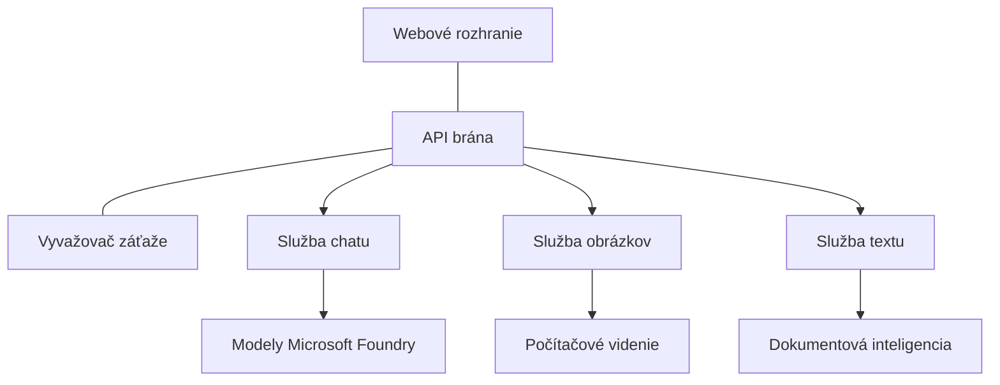

# Najlepšie postupy pri produkčnom zaťažení AI s použitím AZD

**Navigácia kapitolami:**
- **📚 Domov kurzu**: [AZD pre začiatočníkov](../../README.md)
- **📖 Aktuálna kapitola**: Kapitola 8 - Produkčné a podnikové vzory
- **⬅️ Predchádzajúca kapitola**: [Kapitola 7: Riešenie problémov](../chapter-07-troubleshooting/debugging.md)
- **⬅️ Súvisiace**: [AI Workshop Lab](ai-workshop-lab.md)
- **🎯 Kurz dokončený**: [AZD pre začiatočníkov](../../README.md)

## Prehľad

Táto príručka poskytuje komplexné najlepšie postupy pre nasadenie produkčných AI zaťažení pomocou Azure Developer CLI (AZD). Na základe spätnej väzby od komunity Microsoft Foundry Discord a reálnych zákazníckych nasadení rieši najčastejšie výzvy v produkčných AI systémoch.

## Kľúčové riešené výzvy

Na základe výsledkov prieskumu komunity sú to hlavné výzvy, s ktorými sa vývojári stretávajú:

- **45 %** má problémy s nasadením viacerých AI služieb
- **38 %** rieši spravovanie povolení a tajomstiev  
- **35 %** má náročnosť pri produkčnej pripravenosti a škálovaní
- **32 %** potrebuje lepšie stratégie optimalizácie nákladov
- **29 %** požaduje zlepšené monitorovanie a riešenie problémov

## Architektonické vzory pre produkčné AI

### Vzor 1: Mikroservisná AI architektúra

**Kedy použiť**: Zložité AI aplikácie s viacerými funkciami


**Implementácia v AZD**:

```yaml
# azure.yaml
name: enterprise-ai-platform
services:
  web:
    project: ./web
    host: staticwebapp
  api-gateway:
    project: ./api-gateway
    host: containerapp
  chat-service:
    project: ./services/chat
    host: containerapp
  vision-service:
    project: ./services/vision
    host: containerapp
  text-service:
    project: ./services/text
    host: containerapp
```

### Vzor 2: Event-driven spracovanie AI

**Kedy použiť**: Spracovanie dávok, analýza dokumentov, asynchrónne pracovné postupy

```bicep
// Event Hub for AI processing pipeline
resource eventHub 'Microsoft.EventHub/namespaces@2023-01-01-preview' = {
  name: eventHubNamespaceName
  location: location
  sku: {
    name: 'Standard'
    tier: 'Standard'
    capacity: 1
  }
}

// Service Bus for reliable message processing
resource serviceBus 'Microsoft.ServiceBus/namespaces@2022-10-01-preview' = {
  name: serviceBusNamespaceName
  location: location
  sku: {
    name: 'Premium'
    tier: 'Premium'
    capacity: 1
  }
}

// Function App for processing
resource functionApp 'Microsoft.Web/sites@2023-01-01' = {
  name: functionAppName
  location: location
  kind: 'functionapp,linux'
  properties: {
    siteConfig: {
      appSettings: [
        {
          name: 'FUNCTIONS_EXTENSION_VERSION'
          value: '~4'
        }
        {
          name: 'AZURE_OPENAI_ENDPOINT'
          value: '@Microsoft.KeyVault(VaultName=${keyVault.name};SecretName=openai-endpoint)'
        }
      ]
    }
  }
}
```

## Myslenie o zdraví AI agenta

Keď sa tradičná webová aplikácia pokazí, príznaky sú známe: stránka sa nenačíta, API vráti chybu alebo zlyhá nasadenie. Aplikácie poháňané AI sa môžu pokaziť rovnakými spôsobmi—ale môžu sa aj správať subtílnejšie, bez zjavnej chybovej správy.

Táto časť vám pomôže vytvoriť mentálny model na monitorovanie AI zaťažení, aby ste vedeli, kde hľadať, keď niečo nefunguje správne.

### Ako sa zdravie agenta líši od zdravia tradičnej aplikácie

Tradičná aplikácia buď funguje, alebo nie. AI agent môže na prvý pohľad fungovať, no produkovať zlé výsledky. Zdravie agenta myslite v dvoch vrstvách:

| Vrstva | Čo sledovať | Kde hľadať |
|--------|-------------|------------|
| **Zdravie infraštruktúry** | Beží služba? Sú zdroje pridelené? Sú endpointy dostupné? | `azd monitor`, zdravotný stav zdrojov v Azure Portáli, logy kontajnerov/aplikácií |
| **Zdravie správania** | Reaguje agent správne? Sú odpovede včasné? Je model volaný správne? | Application Insights trasovania, metriky latencie volaní modelu, logy kvality odpovedí |

Zdravie infraštruktúry je známe – je rovnaké pre každú azd aplikáciu. Zdravie správania je nová vrstva, ktorú zavádzajú AI zaťaženia.

### Kde hľadať, keď sa AI aplikácie správajú nečakane

Ak vaša AI aplikácia nevytvára očakávané výsledky, tu je konceptuálny kontrolný zoznam:

1. **Začnite základmi.** Beží aplikácia? Môže sa pripojiť k závislostiam? Skontrolujte `azd monitor` a zdravotný stav zdrojov ako u každej aplikácie.
2. **Skontrolujte pripojenie k modelu.** Volá vaša aplikácia úspešne AI model? Zlyhané alebo časovo prekročené volania modelu sú najčastejšou príčinou problémov a zobrazia sa v logoch aplikácie.
3. **Pozrite sa na vstup pre model.** AI odpovede závisia na vstupe (prompt a získanom kontexte). Ak je výstup nesprávny, zvyčajne je nesprávny aj vstup. Skontrolujte, či aplikácia posiela modelu správne dáta.
4. **Skontrolujte latenciu odpovede.** Volania AI modelu sú pomalšie než typické API volania. Ak pôsobí aplikácia pomaly, skontrolujte, či sa nepredlžuje čas odozvy - môže to indikovať obmedzovanie, kapacitné limity alebo preťaženie regiónu.
5. **Sledujte signály nákladov.** Neočakávané špičky v používaní tokenov alebo API volaní naznačujú slučku, nesprávne nakonfigurovaný prompt alebo nadmerné opakovanie.

Nemusíte hneď ovládať nástroje pozorovateľnosti. Kľúčové je pochopiť, že AI aplikácie majú navyše vrstvu správania na sledovanie a vstavané monitorovanie azd (`azd monitor`) vám poskytne východiskový bod pre vyšetrovanie oboch vrstiev.

---

## Najlepšie bezpečnostné postupy

### 1. Model bezpečnosti Zero-Trust

**Implementačná stratégia**:
- Žiadna komunikácia medzi službami bez overenia
- Všetky API volania využívajú spravované identity
- Sieťová izolácia s privátnymi endpointmi
- Prístupy s najmenšími právomocami

```bicep
// Managed Identity for each service
resource chatServiceIdentity 'Microsoft.ManagedIdentity/userAssignedIdentities@2023-01-31' = {
  name: 'chat-service-identity'
  location: location
}

// Role assignments with minimal permissions
resource openAIUserRole 'Microsoft.Authorization/roleAssignments@2022-04-01' = {
  scope: openAIAccount
  name: guid(openAIAccount.id, chatServiceIdentity.id, openAIUserRoleDefinitionId)
  properties: {
    roleDefinitionId: subscriptionResourceId('Microsoft.Authorization/roleDefinitions', '5e0bd9bd-7b93-4f28-af87-19fc36ad61bd')
    principalId: chatServiceIdentity.properties.principalId
    principalType: 'ServicePrincipal'
  }
}
```

### 2. Bezpečná správa tajomstiev

**Vzor integrácie Key Vault**:

```bicep
// Key Vault with proper access policies
resource keyVault 'Microsoft.KeyVault/vaults@2023-02-01' = {
  name: keyVaultName
  location: location
  properties: {
    tenantId: tenant().tenantId
    sku: {
      family: 'A'
      name: 'premium'  // Use premium for production
    }
    enableRbacAuthorization: true  // Use RBAC instead of access policies
    enablePurgeProtection: true    // Prevent accidental deletion
    enableSoftDelete: true
    softDeleteRetentionInDays: 90
  }
}

// Store all AI service credentials
resource openAIKeySecret 'Microsoft.KeyVault/vaults/secrets@2023-02-01' = {
  parent: keyVault
  name: 'openai-api-key'
  properties: {
    value: openAIAccount.listKeys().key1
    attributes: {
      enabled: true
    }
  }
}
```

### 3. Sieťová bezpečnosť

**Konfigurácia privátneho endpointu**:

```bicep
// Virtual Network for AI services
resource virtualNetwork 'Microsoft.Network/virtualNetworks@2023-04-01' = {
  name: vnetName
  location: location
  properties: {
    addressSpace: {
      addressPrefixes: ['10.0.0.0/16']
    }
    subnets: [
      {
        name: 'ai-services-subnet'
        properties: {
          addressPrefix: '10.0.1.0/24'
          privateEndpointNetworkPolicies: 'Disabled'
        }
      }
      {
        name: 'app-services-subnet'
        properties: {
          addressPrefix: '10.0.2.0/24'
          delegations: [
            {
              name: 'Microsoft.Web/serverFarms'
              properties: {
                serviceName: 'Microsoft.Web/serverFarms'
              }
            }
          ]
        }
      }
    ]
  }
}

// Private endpoints for all AI services
resource openAIPrivateEndpoint 'Microsoft.Network/privateEndpoints@2023-04-01' = {
  name: '${openAIAccountName}-pe'
  location: location
  properties: {
    subnet: {
      id: virtualNetwork.properties.subnets[0].id
    }
    privateLinkServiceConnections: [
      {
        name: 'openai-connection'
        properties: {
          privateLinkServiceId: openAIAccount.id
          groupIds: ['account']
        }
      }
    ]
  }
}
```

## Výkon a škálovanie

### 1. Stratégie automatického škálovania

**Automatické škálovanie kontejnerových aplikácií**:

```bicep
resource containerApp 'Microsoft.App/containerApps@2023-05-01' = {
  name: containerAppName
  location: location
  properties: {
    configuration: {
      ingress: {
        external: true
        targetPort: 8000
        transport: 'http'
      }
    }
    template: {
      scale: {
        minReplicas: 2  // Always have 2 instances minimum
        maxReplicas: 50 // Scale up to 50 for high load
        rules: [
          {
            name: 'http-scaling'
            http: {
              metadata: {
                concurrentRequests: '20'  // Scale when >20 concurrent requests
              }
            }
          }
          {
            name: 'cpu-scaling'
            custom: {
              type: 'cpu'
              metadata: {
                type: 'Utilization'
                value: '70'  // Scale when CPU >70%
              }
            }
          }
        ]
      }
    }
  }
}
```

### 2. Stratégie cacheovania

**Redis Cache pre AI odpovede**:

```bicep
// Redis Premium for production workloads
resource redisCache 'Microsoft.Cache/redis@2023-04-01' = {
  name: redisCacheName
  location: location
  properties: {
    sku: {
      name: 'Premium'
      family: 'P'
      capacity: 1
    }
    enableNonSslPort: false
    minimumTlsVersion: '1.2'
    redisConfiguration: {
      'maxmemory-policy': 'allkeys-lru'
    }
    // Enable clustering for high availability
    redisVersion: '6.0'
    shardCount: 2
  }
}

// Cache configuration in application
var cacheConnectionString = '${redisCache.properties.hostName}:6380,password=${redisCache.listKeys().primaryKey},ssl=True,abortConnect=False'
```

### 3. Vyvažovanie záťaže a správa dopravy

**Application Gateway s WAF**:

```bicep
// Application Gateway with Web Application Firewall
resource applicationGateway 'Microsoft.Network/applicationGateways@2023-04-01' = {
  name: appGatewayName
  location: location
  properties: {
    sku: {
      name: 'WAF_v2'
      tier: 'WAF_v2'
      capacity: 2
    }
    webApplicationFirewallConfiguration: {
      enabled: true
      firewallMode: 'Prevention'
      ruleSetType: 'OWASP'
      ruleSetVersion: '3.2'
    }
    // Backend pools for AI services
    backendAddressPools: [
      {
        name: 'ai-services-pool'
        properties: {
          backendAddresses: [
            {
              fqdn: '${containerApp.properties.configuration.ingress.fqdn}'
            }
          ]
        }
      }
    ]
  }
}
```

## 💰 Optimalizácia nákladov

### 1. Správne dimenzovanie zdrojov

**Konfigurácie podľa prostredia**:

```bash
# Vývojové prostredie
azd env new development
azd env set AZURE_OPENAI_SKU "S0"
azd env set AZURE_OPENAI_CAPACITY 10
azd env set AZURE_SEARCH_SKU "basic"
azd env set CONTAINER_CPU 0.5
azd env set CONTAINER_MEMORY 1.0

# Produkčné prostredie
azd env new production
azd env set AZURE_OPENAI_SKU "S0"
azd env set AZURE_OPENAI_CAPACITY 100
azd env set AZURE_SEARCH_SKU "standard"
azd env set CONTAINER_CPU 2.0
azd env set CONTAINER_MEMORY 4.0
```

### 2. Monitorovanie nákladov a rozpočtov

```bicep
// Cost management and budgets
resource budget 'Microsoft.Consumption/budgets@2023-05-01' = {
  name: 'ai-workload-budget'
  properties: {
    timePeriod: {
      startDate: '2024-01-01'
      endDate: '2024-12-31'
    }
    timeGrain: 'Monthly'
    amount: 2000  // $2000 monthly budget
    category: 'Cost'
    notifications: {
      warning: {
        enabled: true
        operator: 'GreaterThan'
        threshold: 80
        contactEmails: [
          'finance@company.com'
          'engineering@company.com'
        ]
        contactRoles: [
          'Owner'
          'Contributor'
        ]
      }
      critical: {
        enabled: true
        operator: 'GreaterThan'
        threshold: 95
        contactEmails: [
          'cto@company.com'
        ]
      }
    }
  }
}
```

### 3. Optimalizácia používania tokenov

**Správa nákladov OpenAI**:

```typescript
// Optimalizácia tokenov na úrovni aplikácie
class TokenOptimizer {
  private readonly maxTokens = 4000;
  private readonly reserveTokens = 500;
  
  optimizePrompt(userInput: string, context: string): string {
    const availableTokens = this.maxTokens - this.reserveTokens;
    const estimatedTokens = this.estimateTokens(userInput + context);
    
    if (estimatedTokens > availableTokens) {
      // Skráťte kontext, nie vstup používateľa
      context = this.truncateContext(context, availableTokens - this.estimateTokens(userInput));
    }
    
    return `${context}\n\nUser: ${userInput}`;
  }
  
  private estimateTokens(text: string): number {
    // Hrubý odhad: 1 token ≈ 4 znaky
    return Math.ceil(text.length / 4);
  }
}
```

## Monitorovanie a pozorovateľnosť

### 1. Komplexné Application Insights

```bicep
// Application Insights with advanced features
resource applicationInsights 'Microsoft.Insights/components@2020-02-02' = {
  name: applicationInsightsName
  location: location
  kind: 'web'
  properties: {
    Application_Type: 'web'
    WorkspaceResourceId: logAnalyticsWorkspace.id
    SamplingPercentage: 100  // Full sampling for AI apps
    DisableIpMasking: false  // Enable for security
  }
}

// Custom metrics for AI operations
resource aiMetricAlerts 'Microsoft.Insights/metricAlerts@2018-03-01' = {
  name: 'ai-high-error-rate'
  location: 'global'
  properties: {
    description: 'Alert when AI service error rate is high'
    severity: 2
    enabled: true
    scopes: [
      applicationInsights.id
    ]
    evaluationFrequency: 'PT1M'
    windowSize: 'PT5M'
    criteria: {
      'odata.type': 'Microsoft.Azure.Monitor.SingleResourceMultipleMetricCriteria'
      allOf: [
        {
          name: 'high-error-rate'
          metricName: 'requests/failed'
          operator: 'GreaterThan'
          threshold: 10
          timeAggregation: 'Count'
        }
      ]
    }
  }
}
```

### 2. AI špecifické monitorovanie

**Vlastné dashboardy pre AI metriky**:

```json
// Dashboard configuration for AI workloads
{
  "dashboard": {
    "name": "AI Application Monitoring",
    "tiles": [
      {
        "name": "OpenAI Request Volume",
        "query": "requests | where name contains 'openai' | summarize count() by bin(timestamp, 5m)"
      },
      {
        "name": "AI Response Latency",
        "query": "requests | where name contains 'openai' | summarize avg(duration) by bin(timestamp, 5m)"
      },
      {
        "name": "Token Usage",
        "query": "customMetrics | where name == 'openai_tokens_used' | summarize sum(value) by bin(timestamp, 1h)"
      },
      {
        "name": "Cost per Hour",
        "query": "customMetrics | where name == 'openai_cost' | summarize sum(value) by bin(timestamp, 1h)"
      }
    ]
  }
}
```

### 3. Kontroly zdravia a monitorovanie dostupnosti

```bicep
// Application Insights availability tests
resource availabilityTest 'Microsoft.Insights/webtests@2022-06-15' = {
  name: 'ai-app-availability-test'
  location: location
  tags: {
    'hidden-link:${applicationInsights.id}': 'Resource'
  }
  properties: {
    SyntheticMonitorId: 'ai-app-availability-test'
    Name: 'AI Application Availability Test'
    Description: 'Tests AI application endpoints'
    Enabled: true
    Frequency: 300  // 5 minutes
    Timeout: 120    // 2 minutes
    Kind: 'ping'
    Locations: [
      {
        Id: 'us-east-2-azr'
      }
      {
        Id: 'us-west-2-azr'
      }
    ]
    Configuration: {
      WebTest: '''
        <WebTest Name="AI Health Check" 
                 Id="8d2de8d2-a2b0-4c2e-9a0d-8f9c9a0b8c8d" 
                 Enabled="True" 
                 CssProjectStructure="" 
                 CssIteration="" 
                 Timeout="120" 
                 WorkItemIds="" 
                 xmlns="http://microsoft.com/schemas/VisualStudio/TeamTest/2010" 
                 Description="" 
                 CredentialUserName="" 
                 CredentialPassword="" 
                 PreAuthenticate="True" 
                 Proxy="default" 
                 StopOnError="False" 
                 RecordedResultFile="" 
                 ResultsLocale="">
          <Items>
            <Request Method="GET" 
                     Guid="a5f10126-e4cd-570d-961c-cea43999a200" 
                     Version="1.1" 
                     Url="${webApp.properties.defaultHostName}/health" 
                     ThinkTime="0" 
                     Timeout="120" 
                     ParseDependentRequests="True" 
                     FollowRedirects="True" 
                     RecordResult="True" 
                     Cache="False" 
                     ResponseTimeGoal="0" 
                     Encoding="utf-8" 
                     ExpectedHttpStatusCode="200" 
                     ExpectedResponseUrl="" 
                     ReportingName="" 
                     IgnoreHttpStatusCode="False" />
          </Items>
        </WebTest>
      '''
    }
  }
}
```

## Obnova po havárii a vysoká dostupnosť

### 1. Nasadenie do viacerých regiónov

```yaml
# azure.yaml - Multi-region configuration
name: ai-app-multiregion
services:
  api-primary:
    project: ./api
    host: containerapp
    env:
      - AZURE_REGION=eastus
  api-secondary:
    project: ./api
    host: containerapp
    env:
      - AZURE_REGION=westus2
```

```bicep
// Traffic Manager for global load balancing
resource trafficManager 'Microsoft.Network/trafficManagerProfiles@2022-04-01' = {
  name: trafficManagerProfileName
  location: 'global'
  properties: {
    profileStatus: 'Enabled'
    trafficRoutingMethod: 'Priority'
    dnsConfig: {
      relativeName: trafficManagerProfileName
      ttl: 30
    }
    monitorConfig: {
      protocol: 'HTTPS'
      port: 443
      path: '/health'
      intervalInSeconds: 30
      toleratedNumberOfFailures: 3
      timeoutInSeconds: 10
    }
    endpoints: [
      {
        name: 'primary-endpoint'
        type: 'Microsoft.Network/trafficManagerProfiles/azureEndpoints'
        properties: {
          targetResourceId: primaryAppService.id
          endpointStatus: 'Enabled'
          priority: 1
        }
      }
      {
        name: 'secondary-endpoint'
        type: 'Microsoft.Network/trafficManagerProfiles/azureEndpoints'
        properties: {
          targetResourceId: secondaryAppService.id
          endpointStatus: 'Enabled'
          priority: 2
        }
      }
    ]
  }
}
```

### 2. Zálohovanie a obnova dát

```bicep
// Backup configuration for critical data
resource backupVault 'Microsoft.DataProtection/backupVaults@2023-05-01' = {
  name: backupVaultName
  location: location
  identity: {
    type: 'SystemAssigned'
  }
  properties: {
    storageSettings: [
      {
        datastoreType: 'VaultStore'
        type: 'LocallyRedundant'
      }
    ]
  }
}

// Backup policy for AI models and data
resource backupPolicy 'Microsoft.DataProtection/backupVaults/backupPolicies@2023-05-01' = {
  parent: backupVault
  name: 'ai-data-backup-policy'
  properties: {
    policyRules: [
      {
        backupParameters: {
          backupType: 'Full'
          objectType: 'AzureBackupParams'
        }
        trigger: {
          schedule: {
            repeatingTimeIntervals: [
              'R/2024-01-01T02:00:00+00:00/P1D'  // Daily at 2 AM
            ]
          }
          objectType: 'ScheduleBasedTriggerContext'
        }
        dataStore: {
          datastoreType: 'VaultStore'
          objectType: 'DataStoreInfoBase'
        }
        name: 'BackupDaily'
        objectType: 'AzureBackupRule'
      }
    ]
  }
}
```

## DevOps a integrácia CI/CD

### 1. GitHub Actions Workflow

```yaml
# .github/workflows/deploy-ai-app.yml
name: Deploy AI Application

on:
  push:
    branches: [main]
  pull_request:
    branches: [main]

jobs:
  test:
    runs-on: ubuntu-latest
    steps:
      - uses: actions/checkout@v4
      
      - name: Setup Python
        uses: actions/setup-python@v4
        with:
          python-version: '3.11'
          
      - name: Install dependencies
        run: |
          pip install -r requirements.txt
          pip install pytest
          
      - name: Run tests
        run: pytest tests/
        
      - name: AI Safety Tests
        run: |
          python scripts/test_ai_safety.py
          python scripts/validate_prompts.py

  deploy-staging:
    needs: test
    if: github.event_name == 'pull_request'
    runs-on: ubuntu-latest
    steps:
      - uses: actions/checkout@v4
      
      - name: Setup AZD
        uses: Azure/setup-azd@v2
        
      - name: Login to Azure
        uses: azure/login@v1
        with:
          creds: ${{ secrets.AZURE_CREDENTIALS }}
          
      - name: Deploy to Staging
        run: |
          azd env select staging
          azd deploy

  deploy-production:
    needs: test
    if: github.ref == 'refs/heads/main'
    runs-on: ubuntu-latest
    steps:
      - uses: actions/checkout@v4
      
      - name: Setup AZD
        uses: Azure/setup-azd@v2
        
      - name: Login to Azure
        uses: azure/login@v1
        with:
          creds: ${{ secrets.AZURE_CREDENTIALS }}
          
      - name: Deploy to Production
        run: |
          azd env select production
          azd deploy
          
      - name: Run Production Health Checks
        run: |
          python scripts/health_check.py --env production
```

### 2. Validácia infraštruktúry

```bash
# scripts/validate_infrastructure.sh
#!/bin/bash

echo "Validating AI infrastructure deployment..."

# Skontrolujte, či všetky potrebné služby bežia
services=("openai" "search" "storage" "keyvault")
for service in "${services[@]}"; do
    echo "Checking $service..."
    if ! az resource list --resource-type "Microsoft.CognitiveServices/accounts" --query "[?contains(name, '$service')]" -o tsv; then
        echo "ERROR: $service not found"
        exit 1
    fi
done

# Overte nasadenia modelov OpenAI
echo "Validating OpenAI model deployments..."
models=$(az cognitiveservices account deployment list --name $AZURE_OPENAI_NAME --resource-group $AZURE_RESOURCE_GROUP --query "[].name" -o tsv)
if [[ ! $models == *"gpt-4.1-mini"* ]]; then
  echo "ERROR: Required model gpt-4.1-mini not deployed"
    exit 1
fi

# Otestujte konektivitu AI služby
echo "Testing AI service connectivity..."
python scripts/test_connectivity.py

echo "Infrastructure validation completed successfully!"
```

## Kontrolný zoznam produkčnej pripravenosti

### Bezpečnosť ✅
- [ ] Všetky služby používajú spravované identity
- [ ] Tajomstvá uložené v Key Vault
- [ ] Nakonfigurované privátne endpointy
- [ ] Implementované sieťové bezpečnostné skupiny
- [ ] RBAC s minimálnymi právomocami
- [ ] Zapnutý WAF na verejných endpointoch

### Výkon ✅
- [ ] Nastavené automatické škálovanie
- [ ] Implementované cacheovanie
- [ ] Nastavené vyvažovanie záťaže
- [ ] CDN pre statický obsah
- [ ] Poolovanie pripojení k databáze
- [ ] Optimalizácia používania tokenov

### Monitorovanie ✅
- [ ] Nastavený Application Insights
- [ ] Definované vlastné metriky
- [ ] Nastavené pravidlá alertov
- [ ] Vytvorený dashboard
- [ ] Implementované kontroly zdravia
- [ ] Politiky uchovávania logov

### Spoľahlivosť ✅
- [ ] Nasadenie do viacerých regiónov
- [ ] Plán zálohovania a obnovy
- [ ] Implementované circuit breakery
- [ ] Nastavené retry politiky
- [ ] Graceful degradation
- [ ] Endpointy na kontroly zdravia

### Správa nákladov ✅
- [ ] Nastavené upozornenia na rozpočet
- [ ] Správne dimenzovanie zdrojov
- [ ] Uplatnené zľavy pre vývoj/testovanie
- [ ] Zakúpené rezervované inštancie
- [ ] Dashboard pre správu nákladov
- [ ] Pravidelné hodnotenie nákladov

### Súlad ✅
- [ ] Splnené požiadavky na lokalizáciu dát
- [ ] Zapnuté auditné logovanie
- [ ] Aplikované politiky súladu
- [ ] Implementované bezpečnostné baseline
- [ ] Pravidelné bezpečnostné hodnotenia
- [ ] Plán reakcie na incidenty

## Výkonnostné benchmarky

### Typické produkčné metriky

| Metrika | Cieľ | Monitorovanie |
|---------|------|--------------|
| **Doba odozvy** | < 2 sekundy | Application Insights |
| **Dostupnosť** | 99,9 % | Monitorovanie dostupnosti |
| **Miera chýb** | < 0,1 % | Logy aplikácie |
| **Použitie tokenov** | < 500 $/mesiac | Správa nákladov |
| **Súbežní používatelia** | 1000+ | Testovanie zaťaženia |
| **Čas obnovy** | < 1 hodina | Testy obnovy po havárii |

### Testovanie záťaže

```bash
# Skript na testovanie zaťaženia pre AI aplikácie
python scripts/load_test.py \
  --endpoint https://your-ai-app.azurewebsites.net \
  --concurrent-users 100 \
  --duration 300 \
  --ramp-up 60
```

## 🤝 Najlepšie praktiky komunity

Na základe spätnej väzby komunity Microsoft Foundry Discord:

### Hlavné odporúčania od komunity:

1. **Začnite s malým, škálujte postupne**: Začnite so základnými SKU a škálujte podľa reálneho využitia
2. **Monitorujte všetko**: Zavádzajte komplexné monitorovanie hneď od začiatku
3. **Automatizujte bezpečnosť**: Používajte infraštruktúru ako kód pre konzistentnú bezpečnosť
4. **Dôkladne testujte**: Zahrňte AI špecifické testovanie do vášho pipeline
5. **Plánujte náklady**: Sledujte používanie tokenov a včas nastavujte rozpočtové upozornenia

### Bežné chyby, ktorým sa vyhnúť:

- ❌ Vkladanie API kľúčov priamo do kódu
- ❌ Nenastavené riadne monitorovanie
- ❌ Ignorovanie optimalizácie nákladov
- ❌ Netestovanie scenárov zlyhania
- ❌ Nasadenie bez kontrol zdravia

## Príkazy AZD AI CLI a rozšírenia

AZD obsahuje stále rastúcu sadu AI špecifických príkazov a rozšírení, ktoré zjednodušujú produkčné AI pracovné toky. Tieto nástroje prepájajú lokálny vývoj s produkčným nasadením AI zaťažení.

### Rozšírenia AZD pre AI

AZD používa systém rozšírení pre pridanie AI špecifických funkcií. Inštalujte a spravujte rozšírenia pomocou:

```bash
# Zoznam všetkých dostupných rozšírení (vrátane AI)
azd extension list

# Skontrolujte podrobnosti nainštalovaného rozšírenia
azd extension show azure.ai.agents

# Nainštalujte rozšírenie agentov Foundry
azd extension install azure.ai.agents

# Nainštalujte rozšírenie pre doladenie
azd extension install azure.ai.finetune

# Nainštalujte rozšírenie pre vlastné modely
azd extension install azure.ai.models

# Aktualizujte všetky nainštalované rozšírenia
azd extension upgrade --all
```

**Dostupné AI rozšírenia:**

| Rozšírenie | Účel | Stav |
|------------|-------|------|
| `azure.ai.agents` | Správa Foundry Agent Service | Preview |
| `azure.ai.finetune` | Doladenie modelov Foundry | Preview |
| `azure.ai.models` | Vlastné modely Foundry | Preview |
| `azure.coding-agent` | Konfigurácia kódovacieho agenta | Available |

### Inicializácia agentových projektov s `azd ai agent init`

Príkaz `azd ai agent init` vytvára projekt produkčne pripraveného AI agenta integrovaný s Microsoft Foundry Agent Service:

```bash
# Inicializujte nový agentný projekt zo manifestu agenta
azd ai agent init -m <manifest-path-or-uri>

# Inicializujte a zamerajte sa na konkrétny projekt Foundry
azd ai agent init -m agent-manifest.yaml --project-id <foundry-project-id>

# Inicializujte s vlastným zdrojovým adresárom
azd ai agent init -m agent-manifest.yaml --src ./agents/my-agent

# Vyberte Container Apps ako hostiteľa
azd ai agent init -m agent-manifest.yaml --host containerapp
```

**Kľúčové prepínače:**

| Prepínač | Popis |
|----------|--------|
| `-m, --manifest` | Cesta alebo URI k manifestu agenta na pridanie do projektu |
| `-p, --project-id` | Existujúce ID Microsoft Foundry projektu pre azd prostredie |
| `-s, --src` | Adresár na stiahnutie definície agenta (predvolené `src/<agent-id>`) |
| `--host` | Prepíše predvoleného hostiteľa (napr. `containerapp`) |
| `-e, --environment` | Použité azd prostredie |

**Tip pre produkciu**: Použite `--project-id` na priame prepojenie s existujúcim Foundry projektom, čím od začiatku spájate kód agenta a cloudové zdroje.

### Model Context Protocol (MCP) s `azd mcp`

AZD obsahuje vstavanú podporu MCP servera (Alpha), ktorá umožňuje AI agentom a nástrojom interagovať s vašimi Azure zdrojmi cez štandardizovaný protokol:

```bash
# Spustite MCP server pre váš projekt
azd mcp start

# Skontrolujte aktuálne pravidlá súhlasu Copilot pre vykonávanie nástrojov
azd copilot consent list
```

MCP server sprístupňuje kontext vášho azd projektu – prostredia, služby a Azure zdroje – AI nástrojom na vývoj. To umožňuje:

- **AI asistované nasadzovanie**: Nech kódovacie agenti zisťujú stav projektu a spúšťajú nasadenia
- **Objavovanie zdrojov**: AI nástroje môžu zistiť, aké Azure zdroje váš projekt používa
- **Správa prostredí**: Agenti môžu prepínať medzi dev/staging/produkčnými prostrediami

### Generovanie infraštruktúry s `azd infra generate`

Pre produkčné AI zaťaženia môžete generovať a prispôsobovať infraštruktúru ako kód namiesto automatického provisioningu:

```bash
# Generujte súbory Bicep/Terraform z definície vášho projektu
azd infra generate
```

To zapisuje IaC na disk, takže môžete:
- Preskúmať a auditovať infraštruktúru pred nasadením
- Pridať vlastné bezpečnostné politiky (sieťové pravidlá, privátne endpointy)
- Integrovať sa do existujúcich procesov recenzie IaC
- Samostatne verzovať zmeny infraštruktúry nezávisle na aplikačnom kóde

### Produkčné lifecycle hooky

AZD hooky umožňujú vkladať vlastnú logiku do každej fázy životného cyklu nasadenia—kritické pre produkčné AI pracovné toky:

```yaml
# azure.yaml - Production hooks example
name: ai-production-app
hooks:
  preprovision:
    shell: sh
    run: scripts/validate-quotas.sh    # Check AI model quota before provisioning
  postprovision:
    shell: sh
    run: scripts/configure-networking.sh  # Set up private endpoints
  predeploy:
    shell: sh
    run: scripts/run-ai-safety-tests.sh  # Run prompt safety checks
  postdeploy:
    shell: sh
    run: scripts/smoke-test.sh           # Verify agent responses post-deploy
services:
  agent-api:
    project: ./src/agent
    host: containerapp
    hooks:
      predeploy:
        shell: sh
        run: scripts/validate-model-access.sh  # Per-service hook
```

```bash
# Spustiť konkrétny hák manuálne počas vývoja
azd hooks run predeploy
```

**Odporúčané produkčné hooky pre AI zaťaženia:**

| Hook | Prípad použitia |
|------|-----------------|
| `preprovision` | Overenie kvót predplatného pre kapacitu AI modelov |
| `postprovision` | Konfigurácia privátnych endpointov, nasadenie váh modelov |
| `predeploy` | Spustenie AI bezpečnostných testov, overenie prompt šablón |
| `postdeploy` | Smoke test odpovedí agenta, kontrola konektivity modelu |

### Konfigurácia CI/CD pipeline

Použite `azd pipeline config` na prepojenie projektu s GitHub Actions alebo Azure Pipelines so zabezpečenou autentifikáciou do Azure:

```bash
# Konfigurujte CI/CD pipeline (interaktívne)
azd pipeline config

# Konfigurujte so špecifickým poskytovateľom
azd pipeline config --provider github
```

Tento príkaz:
- Vytvorí služobný princíp s prístupom podľa minimálnych právomocí
- Nakonfiguruje federované poverenia (žiadne uložené tajomstvá)
- Vygeneruje alebo aktualizuje definíciu pipeline súboru
- Nastaví potrebné environmentálne premenné vo vašom CI/CD systéme

**Produkčný pracovný tok s pipeline config:**

```bash
# 1. Nastavte produkčné prostredie
azd env new production
azd env set AZURE_OPENAI_CAPACITY 100

# 2. Nakonfigurujte pipeline
azd pipeline config --provider github

# 3. Pipeline spustí azd deploy pri každom pushi do main
```

### Pridávanie komponentov s `azd add`

Postupne pridávajte Azure služby do existujúceho projektu:

```bash
# Interaktívne pridajte novú komponentu služby
azd add
```

Toto je obzvlášť užitočné na rozširovanie produkčných AI aplikácií – napríklad pridanie služby na vektorové vyhľadávanie, nového agentového endpointu alebo monitorovacej komponenty do existujúceho nasadenia.

## Ďalšie zdroje
- **Azure Well-Architected Framework**: [Návod pre pracovné zaťaženie AI](https://learn.microsoft.com/azure/well-architected/ai/)
- **Microsoft Foundry Dokumentácia**: [Oficiálne dokumenty](https://learn.microsoft.com/azure/ai-studio/)
- **Šablóny komunity**: [Azure Samples](https://github.com/Azure-Samples)
- **Discord komunita**: [#Azure kanál](https://discord.gg/microsoft-azure)
- **Agent Skills for Azure**: [microsoft/github-copilot-for-azure na skills.sh](https://skills.sh/microsoft/github-copilot-for-azure) - 37 otvorených agent skills pre Azure AI, Foundry, nasadenie, optimalizáciu nákladov a diagnostiku. Nainštalujte do svojho editora:
  ```bash
  npx skills add microsoft/github-copilot-for-azure
  ```

---

**Navigácia kapitolou:**
- **📚 Domovská stránka kurzu**: [AZD pre začiatočníkov](../../README.md)
- **📖 Aktuálna kapitola**: Kapitola 8 - Produkčné a podnikové vzory
- **⬅️ Predchádzajúca kapitola**: [Kapitola 7: Riešenie problémov](../chapter-07-troubleshooting/debugging.md)
- **⬅️ Tiež súvisiace**: [AI Workshop Lab](ai-workshop-lab.md)
- **� Kurz dokončený**: [AZD pre začiatočníkov](../../README.md)

**Pamätajte**: Produkčné AI pracovné zaťaženia vyžadujú dôkladné plánovanie, monitorovanie a priebežnú optimalizáciu. Začnite týmito vzormi a prispôsobte ich svojim špecifickým požiadavkám.

---

<!-- CO-OP TRANSLATOR DISCLAIMER START -->
**Zrieknutie sa zodpovednosti**:  
Tento dokument bol preložený pomocou AI prekladateľskej služby [Co-op Translator](https://github.com/Azure/co-op-translator). Aj keď sa snažíme o presnosť, majte prosím na pamäti, že automatizované preklady môžu obsahovať chyby alebo nepresnosti. Originálny dokument v jeho pôvodnom jazyku by mal byť považovaný za autoritatívny zdroj. Pre kritické informácie sa odporúča profesionálny ľudský preklad. Nie sme zodpovední za akékoľvek nedorozumenia alebo nesprávne interpretácie vyplývajúce z použitia tohto prekladu.
<!-- CO-OP TRANSLATOR DISCLAIMER END -->