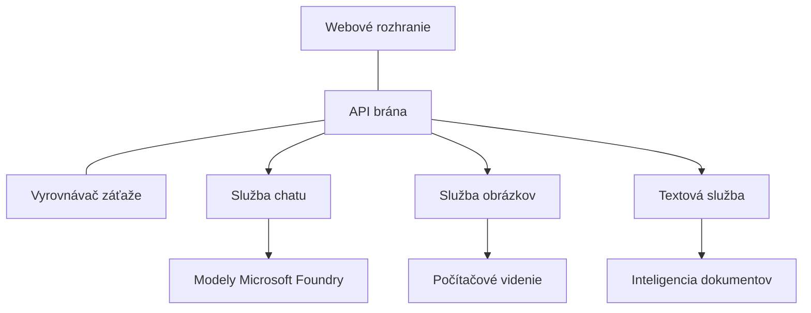

# Najlepšie postupy pre produkčné AI pracovné zaťaženie s AZD

**Chapter Navigation:**
- **📚 Course Home**: [AZD pre začiatočníkov](../../README.md)
- **📖 Current Chapter**: Kapitola 8 - Produkčné & podnikové vzory
- **⬅️ Previous Chapter**: [Kapitola 7: Riešenie problémov](../chapter-07-troubleshooting/debugging.md)
- **⬅️ Also Related**: [AI Workshop laboratórium](ai-workshop-lab.md)
- **🎯 Course Complete**: [AZD pre začiatočníkov](../../README.md)

## Prehľad

Tento sprievodca poskytuje komplexné najlepšie postupy pre nasadzovanie produkčných AI pracovných zaťažení pomocou Azure Developer CLI (AZD). Na základe spätnej väzby zo spoločenstva Microsoft Foundry Discord a reálnych zákazníckych nasadení riešia tieto postupy najčastejšie výzvy v produkčných AI systémoch.

## Kľúčové riešené výzvy

Na základe výsledkov nášho prieskumu komunity toto sú najväčšie výzvy, ktorým vývojári čelia:

- **45%** majú problémy s nasadením AI pozostávajúcim z viacerých služieb
- **38%** riešia problémy so správou poverení a tajomstiev  
- **35%** majú ťažkosti s pripravenosťou na produkciu a škálovaním
- **32%** potrebujú lepšie stratégie optimalizácie nákladov
- **29%** vyžadujú zlepšené monitorovanie a odstraňovanie problémov

## Architektonické vzory pre produkčné AI

### Vzor 1: Mikroservisná AI architektúra

**Kedy použiť**: Zložité AI aplikácie s viacerými schopnosťami



**Implementácia v AZD**:

```yaml
# azure.yaml
name: enterprise-ai-platform
services:
  web:
    project: ./web
    host: staticwebapp
  api-gateway:
    project: ./api-gateway
    host: containerapp
  chat-service:
    project: ./services/chat
    host: containerapp
  vision-service:
    project: ./services/vision
    host: containerapp
  text-service:
    project: ./services/text
    host: containerapp
```

### Vzor 2: Udalosťami riadené spracovanie AI

**Kedy použiť**: Hromadné spracovanie, analýza dokumentov, asynchrónne pracovné toky

```bicep
// Event Hub for AI processing pipeline
resource eventHub 'Microsoft.EventHub/namespaces@2023-01-01-preview' = {
  name: eventHubNamespaceName
  location: location
  sku: {
    name: 'Standard'
    tier: 'Standard'
    capacity: 1
  }
}

// Service Bus for reliable message processing
resource serviceBus 'Microsoft.ServiceBus/namespaces@2022-10-01-preview' = {
  name: serviceBusNamespaceName
  location: location
  sku: {
    name: 'Premium'
    tier: 'Premium'
    capacity: 1
  }
}

// Function App for processing
resource functionApp 'Microsoft.Web/sites@2023-01-01' = {
  name: functionAppName
  location: location
  kind: 'functionapp,linux'
  properties: {
    siteConfig: {
      appSettings: [
        {
          name: 'FUNCTIONS_EXTENSION_VERSION'
          value: '~4'
        }
        {
          name: 'AZURE_OPENAI_ENDPOINT'
          value: '@Microsoft.KeyVault(VaultName=${keyVault.name};SecretName=openai-endpoint)'
        }
      ]
    }
  }
}
```

## Úvahy o stave AI agenta

Keď sa tradičná webová aplikácia pokazí, príznaky sú známe: stránka sa nenačíta, API vráti chybu alebo zlyhá nasadenie. AI-poháňané aplikácie sa môžu pokaziť rovnakými spôsobmi — ale môžu sa aj správať subtilnejšie, bez zrejmých chybových hlásení.

Táto časť vám pomôže vybudovať mentálny model monitorovania AI pracovných zaťažení, aby ste vedeli, kam sa pozrieť, keď niečo nevyzerá správne.

### Ako sa zdravie agenta líši od zdravia tradičnej aplikácie

Tradičná aplikácia buď funguje, alebo nie. AI agent môže vyzerať, že funguje, ale dávať slabé výsledky. Uvažujte o zdraví agenta v dvoch vrstvách:

| Vrstva | Na čo dávať pozor | Kde hľadať |
|-------|--------------|---------------|
| **Zdravie infraštruktúry** | Beží služba? Sú zdroje provisionované? Sú endpointy dostupné? | `azd monitor`, Azure Portal resource health, container/app logs |
| **Zdravie správania** | Reaguje agent presne? Sú odpovede načasované? Je model volaný správne? | Application Insights traces, model call latency metrics, response quality logs |

Zdravie infraštruktúry je známe — je to rovnaké pre akúkoľvek azd aplikáciu. Zdravie správania je nová vrstva, ktorú zavádzajú AI pracovné zaťaženia.

### Kde hľadať, keď sa AI aplikácie nechovajú očakávane

Ak vaša AI aplikácia nedosahuje očakávané výsledky, tu je konceptuálny kontrolný zoznam:

1. **Začnite základmi.** Beží aplikácia? Môže dosiahnuť svoje závislosti? Skontrolujte `azd monitor` a stav zdrojov rovnako ako pri akejkoľvek aplikácii.
2. **Skontrolujte pripojenie k modelu.** Volá vaša aplikácia úspešne AI model? Zlyhané alebo časom prekročené volania modelu sú najčastejšou príčinou problémov AI aplikácií a objavia sa v aplikáčných logoch.
3. **Pozrite sa na to, čo model dostal.** AI odpovede závisia od vstupu (prompt a akýkoľvek získaný kontext). Ak je výstup nesprávny, vstup je zvyčajne nesprávny. Skontrolujte, či vaša aplikácia odosiela modelu správne údaje.
4. **Skontrolujte latenciu odpovede.** Volania AI modelov sú pomalšie ako bežné API volania. Ak sa aplikácia zdá pomalá, skontrolujte, či sa časy odozvy modelu nezvýšili — môže to indikovať obmedzovanie (throttling), kapacitné limity alebo preťaženie na úrovni regiónu.
5. **Dávajte pozor na signály nákladov.** Neočakávané špičky v použití tokenov alebo API volaniach môžu indikovať cyklus, nesprávne nakonfigurovaný prompt alebo nadmerné opakovania.

Nemusíte hneď ovládať nástroje observability. Hlavné ponaučenie je, že AI aplikácie majú ďalšiu vrstvu správania, ktorú treba sledovať, a vstavané monitorovanie azd (`azd monitor`) vám poskytuje východiskový bod pre vyšetrovanie oboch vrstiev.

---

## Bezpečnostné najlepšie postupy

### 1. Zero-Trust bezpečnostný model

**Implementačná stratégia**:
- Žiadna komunikácia medzi službami bez autentifikácie
- Všetky API volania používajú managed identities
- Sieťová izolácia s private endpoints
- Prístupy s princípom najmenej privilégií

```bicep
// Managed Identity for each service
resource chatServiceIdentity 'Microsoft.ManagedIdentity/userAssignedIdentities@2023-01-31' = {
  name: 'chat-service-identity'
  location: location
}

// Role assignments with minimal permissions
resource openAIUserRole 'Microsoft.Authorization/roleAssignments@2022-04-01' = {
  scope: openAIAccount
  name: guid(openAIAccount.id, chatServiceIdentity.id, openAIUserRoleDefinitionId)
  properties: {
    roleDefinitionId: subscriptionResourceId('Microsoft.Authorization/roleDefinitions', '5e0bd9bd-7b93-4f28-af87-19fc36ad61bd')
    principalId: chatServiceIdentity.properties.principalId
    principalType: 'ServicePrincipal'
  }
}
```

### 2. Bezpečná správa tajomstiev

**Vzor integrácie s Key Vault**:

```bicep
// Key Vault with proper access policies
resource keyVault 'Microsoft.KeyVault/vaults@2023-02-01' = {
  name: keyVaultName
  location: location
  properties: {
    tenantId: tenant().tenantId
    sku: {
      family: 'A'
      name: 'premium'  // Use premium for production
    }
    enableRbacAuthorization: true  // Use RBAC instead of access policies
    enablePurgeProtection: true    // Prevent accidental deletion
    enableSoftDelete: true
    softDeleteRetentionInDays: 90
  }
}

// Store all AI service credentials
resource openAIKeySecret 'Microsoft.KeyVault/vaults/secrets@2023-02-01' = {
  parent: keyVault
  name: 'openai-api-key'
  properties: {
    value: openAIAccount.listKeys().key1
    attributes: {
      enabled: true
    }
  }
}
```

### 3. Sieťová bezpečnosť

**Konfigurácia private endpointov**:

```bicep
// Virtual Network for AI services
resource virtualNetwork 'Microsoft.Network/virtualNetworks@2023-04-01' = {
  name: vnetName
  location: location
  properties: {
    addressSpace: {
      addressPrefixes: ['10.0.0.0/16']
    }
    subnets: [
      {
        name: 'ai-services-subnet'
        properties: {
          addressPrefix: '10.0.1.0/24'
          privateEndpointNetworkPolicies: 'Disabled'
        }
      }
      {
        name: 'app-services-subnet'
        properties: {
          addressPrefix: '10.0.2.0/24'
          delegations: [
            {
              name: 'Microsoft.Web/serverFarms'
              properties: {
                serviceName: 'Microsoft.Web/serverFarms'
              }
            }
          ]
        }
      }
    ]
  }
}

// Private endpoints for all AI services
resource openAIPrivateEndpoint 'Microsoft.Network/privateEndpoints@2023-04-01' = {
  name: '${openAIAccountName}-pe'
  location: location
  properties: {
    subnet: {
      id: virtualNetwork.properties.subnets[0].id
    }
    privateLinkServiceConnections: [
      {
        name: 'openai-connection'
        properties: {
          privateLinkServiceId: openAIAccount.id
          groupIds: ['account']
        }
      }
    ]
  }
}
```

## Výkon a škálovanie

### 1. Stratégie automatického škálovania

**Automatické škálovanie Container Apps**:

```bicep
resource containerApp 'Microsoft.App/containerApps@2023-05-01' = {
  name: containerAppName
  location: location
  properties: {
    configuration: {
      ingress: {
        external: true
        targetPort: 8000
        transport: 'http'
      }
    }
    template: {
      scale: {
        minReplicas: 2  // Always have 2 instances minimum
        maxReplicas: 50 // Scale up to 50 for high load
        rules: [
          {
            name: 'http-scaling'
            http: {
              metadata: {
                concurrentRequests: '20'  // Scale when >20 concurrent requests
              }
            }
          }
          {
            name: 'cpu-scaling'
            custom: {
              type: 'cpu'
              metadata: {
                type: 'Utilization'
                value: '70'  // Scale when CPU >70%
              }
            }
          }
        ]
      }
    }
  }
}
```

### 2. Stratégie kešovania

**Redis cache pre odpovede AI**:

```bicep
// Redis Premium for production workloads
resource redisCache 'Microsoft.Cache/redis@2023-04-01' = {
  name: redisCacheName
  location: location
  properties: {
    sku: {
      name: 'Premium'
      family: 'P'
      capacity: 1
    }
    enableNonSslPort: false
    minimumTlsVersion: '1.2'
    redisConfiguration: {
      'maxmemory-policy': 'allkeys-lru'
    }
    // Enable clustering for high availability
    redisVersion: '6.0'
    shardCount: 2
  }
}

// Cache configuration in application
var cacheConnectionString = '${redisCache.properties.hostName}:6380,password=${redisCache.listKeys().primaryKey},ssl=True,abortConnect=False'
```

### 3. Vyrovnávanie zaťaženia a riadenie prevádzky

**Application Gateway s WAF**:

```bicep
// Application Gateway with Web Application Firewall
resource applicationGateway 'Microsoft.Network/applicationGateways@2023-04-01' = {
  name: appGatewayName
  location: location
  properties: {
    sku: {
      name: 'WAF_v2'
      tier: 'WAF_v2'
      capacity: 2
    }
    webApplicationFirewallConfiguration: {
      enabled: true
      firewallMode: 'Prevention'
      ruleSetType: 'OWASP'
      ruleSetVersion: '3.2'
    }
    // Backend pools for AI services
    backendAddressPools: [
      {
        name: 'ai-services-pool'
        properties: {
          backendAddresses: [
            {
              fqdn: '${containerApp.properties.configuration.ingress.fqdn}'
            }
          ]
        }
      }
    ]
  }
}
```

## 💰 Optimalizácia nákladov

### 1. Správne dimenzovanie zdrojov

**Konfigurácie špecifické pre prostredie**:

```bash
# Vývojové prostredie
azd env new development
azd env set AZURE_OPENAI_SKU "S0"
azd env set AZURE_OPENAI_CAPACITY 10
azd env set AZURE_SEARCH_SKU "basic"
azd env set CONTAINER_CPU 0.5
azd env set CONTAINER_MEMORY 1.0

# Produkčné prostredie
azd env new production
azd env set AZURE_OPENAI_SKU "S0"
azd env set AZURE_OPENAI_CAPACITY 100
azd env set AZURE_SEARCH_SKU "standard"
azd env set CONTAINER_CPU 2.0
azd env set CONTAINER_MEMORY 4.0
```

### 2. Sledovanie nákladov a rozpočty

```bicep
// Cost management and budgets
resource budget 'Microsoft.Consumption/budgets@2023-05-01' = {
  name: 'ai-workload-budget'
  properties: {
    timePeriod: {
      startDate: '2024-01-01'
      endDate: '2024-12-31'
    }
    timeGrain: 'Monthly'
    amount: 2000  // $2000 monthly budget
    category: 'Cost'
    notifications: {
      warning: {
        enabled: true
        operator: 'GreaterThan'
        threshold: 80
        contactEmails: [
          'finance@company.com'
          'engineering@company.com'
        ]
        contactRoles: [
          'Owner'
          'Contributor'
        ]
      }
      critical: {
        enabled: true
        operator: 'GreaterThan'
        threshold: 95
        contactEmails: [
          'cto@company.com'
        ]
      }
    }
  }
}
```

### 3. Optimalizácia používania tokenov

**Správa nákladov OpenAI**:

```typescript
// Optimalizácia tokenov na úrovni aplikácie
class TokenOptimizer {
  private readonly maxTokens = 4000;
  private readonly reserveTokens = 500;
  
  optimizePrompt(userInput: string, context: string): string {
    const availableTokens = this.maxTokens - this.reserveTokens;
    const estimatedTokens = this.estimateTokens(userInput + context);
    
    if (estimatedTokens > availableTokens) {
      // Skracujte kontext, nie vstup používateľa
      context = this.truncateContext(context, availableTokens - this.estimateTokens(userInput));
    }
    
    return `${context}\n\nUser: ${userInput}`;
  }
  
  private estimateTokens(text: string): number {
    // Približný odhad: 1 token ≈ 4 znaky
    return Math.ceil(text.length / 4);
  }
}
```

## Monitorovanie a observabilita

### 1. Komplexné Application Insights

```bicep
// Application Insights with advanced features
resource applicationInsights 'Microsoft.Insights/components@2020-02-02' = {
  name: applicationInsightsName
  location: location
  kind: 'web'
  properties: {
    Application_Type: 'web'
    WorkspaceResourceId: logAnalyticsWorkspace.id
    SamplingPercentage: 100  // Full sampling for AI apps
    DisableIpMasking: false  // Enable for security
  }
}

// Custom metrics for AI operations
resource aiMetricAlerts 'Microsoft.Insights/metricAlerts@2018-03-01' = {
  name: 'ai-high-error-rate'
  location: 'global'
  properties: {
    description: 'Alert when AI service error rate is high'
    severity: 2
    enabled: true
    scopes: [
      applicationInsights.id
    ]
    evaluationFrequency: 'PT1M'
    windowSize: 'PT5M'
    criteria: {
      'odata.type': 'Microsoft.Azure.Monitor.SingleResourceMultipleMetricCriteria'
      allOf: [
        {
          name: 'high-error-rate'
          metricName: 'requests/failed'
          operator: 'GreaterThan'
          threshold: 10
          timeAggregation: 'Count'
        }
      ]
    }
  }
}
```

### 2. Monitorovanie špecifické pre AI

**Vlastné dashboardy pre AI metriky**:

```json
// Dashboard configuration for AI workloads
{
  "dashboard": {
    "name": "AI Application Monitoring",
    "tiles": [
      {
        "name": "OpenAI Request Volume",
        "query": "requests | where name contains 'openai' | summarize count() by bin(timestamp, 5m)"
      },
      {
        "name": "AI Response Latency",
        "query": "requests | where name contains 'openai' | summarize avg(duration) by bin(timestamp, 5m)"
      },
      {
        "name": "Token Usage",
        "query": "customMetrics | where name == 'openai_tokens_used' | summarize sum(value) by bin(timestamp, 1h)"
      },
      {
        "name": "Cost per Hour",
        "query": "customMetrics | where name == 'openai_cost' | summarize sum(value) by bin(timestamp, 1h)"
      }
    ]
  }
}
```

### 3. Kontroly zdravia a monitorovanie dostupnosti

```bicep
// Application Insights availability tests
resource availabilityTest 'Microsoft.Insights/webtests@2022-06-15' = {
  name: 'ai-app-availability-test'
  location: location
  tags: {
    'hidden-link:${applicationInsights.id}': 'Resource'
  }
  properties: {
    SyntheticMonitorId: 'ai-app-availability-test'
    Name: 'AI Application Availability Test'
    Description: 'Tests AI application endpoints'
    Enabled: true
    Frequency: 300  // 5 minutes
    Timeout: 120    // 2 minutes
    Kind: 'ping'
    Locations: [
      {
        Id: 'us-east-2-azr'
      }
      {
        Id: 'us-west-2-azr'
      }
    ]
    Configuration: {
      WebTest: '''
        <WebTest Name="AI Health Check" 
                 Id="8d2de8d2-a2b0-4c2e-9a0d-8f9c9a0b8c8d" 
                 Enabled="True" 
                 CssProjectStructure="" 
                 CssIteration="" 
                 Timeout="120" 
                 WorkItemIds="" 
                 xmlns="http://microsoft.com/schemas/VisualStudio/TeamTest/2010" 
                 Description="" 
                 CredentialUserName="" 
                 CredentialPassword="" 
                 PreAuthenticate="True" 
                 Proxy="default" 
                 StopOnError="False" 
                 RecordedResultFile="" 
                 ResultsLocale="">
          <Items>
            <Request Method="GET" 
                     Guid="a5f10126-e4cd-570d-961c-cea43999a200" 
                     Version="1.1" 
                     Url="${webApp.properties.defaultHostName}/health" 
                     ThinkTime="0" 
                     Timeout="120" 
                     ParseDependentRequests="True" 
                     FollowRedirects="True" 
                     RecordResult="True" 
                     Cache="False" 
                     ResponseTimeGoal="0" 
                     Encoding="utf-8" 
                     ExpectedHttpStatusCode="200" 
                     ExpectedResponseUrl="" 
                     ReportingName="" 
                     IgnoreHttpStatusCode="False" />
          </Items>
        </WebTest>
      '''
    }
  }
}
```

## Obnova po havárii a vysoká dostupnosť

### 1. Nasadenie v niekoľkých regiónoch

```yaml
# azure.yaml - Multi-region configuration
name: ai-app-multiregion
services:
  api-primary:
    project: ./api
    host: containerapp
    env:
      - AZURE_REGION=eastus
  api-secondary:
    project: ./api
    host: containerapp
    env:
      - AZURE_REGION=westus2
```

```bicep
// Traffic Manager for global load balancing
resource trafficManager 'Microsoft.Network/trafficManagerProfiles@2022-04-01' = {
  name: trafficManagerProfileName
  location: 'global'
  properties: {
    profileStatus: 'Enabled'
    trafficRoutingMethod: 'Priority'
    dnsConfig: {
      relativeName: trafficManagerProfileName
      ttl: 30
    }
    monitorConfig: {
      protocol: 'HTTPS'
      port: 443
      path: '/health'
      intervalInSeconds: 30
      toleratedNumberOfFailures: 3
      timeoutInSeconds: 10
    }
    endpoints: [
      {
        name: 'primary-endpoint'
        type: 'Microsoft.Network/trafficManagerProfiles/azureEndpoints'
        properties: {
          targetResourceId: primaryAppService.id
          endpointStatus: 'Enabled'
          priority: 1
        }
      }
      {
        name: 'secondary-endpoint'
        type: 'Microsoft.Network/trafficManagerProfiles/azureEndpoints'
        properties: {
          targetResourceId: secondaryAppService.id
          endpointStatus: 'Enabled'
          priority: 2
        }
      }
    ]
  }
}
```

### 2. Zálohovanie a obnova dát

```bicep
// Backup configuration for critical data
resource backupVault 'Microsoft.DataProtection/backupVaults@2023-05-01' = {
  name: backupVaultName
  location: location
  identity: {
    type: 'SystemAssigned'
  }
  properties: {
    storageSettings: [
      {
        datastoreType: 'VaultStore'
        type: 'LocallyRedundant'
      }
    ]
  }
}

// Backup policy for AI models and data
resource backupPolicy 'Microsoft.DataProtection/backupVaults/backupPolicies@2023-05-01' = {
  parent: backupVault
  name: 'ai-data-backup-policy'
  properties: {
    policyRules: [
      {
        backupParameters: {
          backupType: 'Full'
          objectType: 'AzureBackupParams'
        }
        trigger: {
          schedule: {
            repeatingTimeIntervals: [
              'R/2024-01-01T02:00:00+00:00/P1D'  // Daily at 2 AM
            ]
          }
          objectType: 'ScheduleBasedTriggerContext'
        }
        dataStore: {
          datastoreType: 'VaultStore'
          objectType: 'DataStoreInfoBase'
        }
        name: 'BackupDaily'
        objectType: 'AzureBackupRule'
      }
    ]
  }
}
```

## DevOps a integrácia CI/CD

### 1. Workflow GitHub Actions

```yaml
# .github/workflows/deploy-ai-app.yml
name: Deploy AI Application

on:
  push:
    branches: [main]
  pull_request:
    branches: [main]

jobs:
  test:
    runs-on: ubuntu-latest
    steps:
      - uses: actions/checkout@v4
      
      - name: Setup Python
        uses: actions/setup-python@v4
        with:
          python-version: '3.11'
          
      - name: Install dependencies
        run: |
          pip install -r requirements.txt
          pip install pytest
          
      - name: Run tests
        run: pytest tests/
        
      - name: AI Safety Tests
        run: |
          python scripts/test_ai_safety.py
          python scripts/validate_prompts.py

  deploy-staging:
    needs: test
    if: github.event_name == 'pull_request'
    runs-on: ubuntu-latest
    steps:
      - uses: actions/checkout@v4
      
      - name: Setup AZD
        uses: Azure/setup-azd@v2
        
      - name: Login to Azure
        uses: azure/login@v1
        with:
          creds: ${{ secrets.AZURE_CREDENTIALS }}
          
      - name: Deploy to Staging
        run: |
          azd env select staging
          azd deploy

  deploy-production:
    needs: test
    if: github.ref == 'refs/heads/main'
    runs-on: ubuntu-latest
    steps:
      - uses: actions/checkout@v4
      
      - name: Setup AZD
        uses: Azure/setup-azd@v2
        
      - name: Login to Azure
        uses: azure/login@v1
        with:
          creds: ${{ secrets.AZURE_CREDENTIALS }}
          
      - name: Deploy to Production
        run: |
          azd env select production
          azd deploy
          
      - name: Run Production Health Checks
        run: |
          python scripts/health_check.py --env production
```

### 2. Validácia infraštruktúry

```bash
# scripts/validate_infrastructure.sh
#!/bin/bash

echo "Validating AI infrastructure deployment..."

# Skontrolujte, či sú všetky požadované služby spustené
services=("openai" "search" "storage" "keyvault")
for service in "${services[@]}"; do
    echo "Checking $service..."
    if ! az resource list --resource-type "Microsoft.CognitiveServices/accounts" --query "[?contains(name, '$service')]" -o tsv; then
        echo "ERROR: $service not found"
        exit 1
    fi
done

# Overiť nasadenia modelov OpenAI
echo "Validating OpenAI model deployments..."
models=$(az cognitiveservices account deployment list --name $AZURE_OPENAI_NAME --resource-group $AZURE_RESOURCE_GROUP --query "[].name" -o tsv)
if [[ ! $models == *"gpt-4.1-mini"* ]]; then
  echo "ERROR: Required model gpt-4.1-mini not deployed"
    exit 1
fi

# Otestovať pripojenie k AI službe
echo "Testing AI service connectivity..."
python scripts/test_connectivity.py

echo "Infrastructure validation completed successfully!"
```

## Kontrolný zoznam pripravenosti na produkciu

### Bezpečnosť ✅
- [ ] Všetky služby používajú managed identities
- [ ] Tajomstvá uložené v Key Vault
- [ ] Private endpoints nakonfigurované
- [ ] Implementované network security groups
- [ ] RBAC s princípom najmenej privilégií
- [ ] WAF povolený na verejných endpointoch

### Výkon ✅
- [ ] Automatické škálovanie nakonfigurované
- [ ] Implementované kešovanie
- [ ] Nastavené vyrovnávanie zaťaženia
- [ ] CDN pre statický obsah
- [ ] Poolovanie databázových pripojení
- [ ] Optimalizácia používania tokenov

### Monitorovanie ✅
- [ ] Application Insights nakonfigurované
- [ ] Definované vlastné metriky
- [ ] Nastavené pravidlá alertovania
- [ ] Vytvorený dashboard
- [ ] Implementované health checks
- [ ] Zásady uchovávania logov

### Spoľahlivosť ✅
- [ ] Nasadenie v niekoľkých regiónoch
- [ ] Plán zálohovania a obnovy
- [ ] Implementované circuit breakers
- [ ] Nakonfigurované retry politiky
- [ ] Graceful degradation
- [ ] Health check endpointy

### Správa nákladov ✅
- [ ] Nastavené upozornenia rozpočtu
- [ ] Správne dimenzovanie zdrojov
- [ ] Uplatnené zľavy pre dev/test
- [ ] Zakúpené rezervované inštancie
- [ ] Dashboard pre sledovanie nákladov
- [ ] Pravidelné prehliadky nákladov

### Súlad ✅
- [ ] Splnené požiadavky na umiestnenie dát
- [ ] Audit logging povolený
- [ ] Uplatnené súladové politiky
- [ ] Implementované bezpečnostné baseline
- [ ] Pravidelné bezpečnostné audity
- [ ] Plán reakcie na incidenty

## Výkonnostné benchmarky

### Typické produkčné metriky

| Metrika | Cieľ | Monitorovanie |
|--------|--------|------------|
| **Doba odozvy** | < 2 sekundy | Application Insights |
| **Dostupnosť** | 99.9% | Uptime monitoring |
| **Miera chýb** | < 0.1% | Application logs |
| **Použitie tokenov** | < $500/month | Cost management |
| **Súbežní používatelia** | 1000+ | Load testing |
| **Doba obnovy** | < 1 hodina | Disaster recovery tests |

### Záťažové testovanie

```bash
# Skript na záťažové testovanie pre AI aplikácie
python scripts/load_test.py \
  --endpoint https://your-ai-app.azurewebsites.net \
  --concurrent-users 100 \
  --duration 300 \
  --ramp-up 60
```

## 🤝 Najlepšie postupy komunity

Na základe spätnej väzby komunity Microsoft Foundry Discord:

### Hlavné odporúčania od komunity:

1. **Začnite malé, škálujte postupne**: Začnite s jednoduchými SKU a škálujte podľa reálneho využitia
2. **Monitorujte všetko**: Nastavte komplexné monitorovanie od prvého dňa
3. **Automatizujte bezpečnosť**: Používajte infraštruktúru ako kód pre konzistentnú bezpečnosť
4. **Testujte dôkladne**: Zarňte testovanie špecifické pre AI do vášho pipeline
5. **Plánujte náklady**: Sledujte používanie tokenov a včas nastavte upozornenia rozpočtu

### Bežné nástrahy, ktorým sa vyhnúť:

- ❌ Hardcodovanie API kľúčov v kóde
- ❌ Nezriadenie správneho monitorovania
- ❌ Ignorovanie optimalizácie nákladov
- ❌ Netestovanie scenárov zlyhania
- ❌ Nasadenie bez health checks

## AZD AI CLI príkazy a rozšírenia

AZD obsahuje rastúcu sadu príkazov a rozšírení špecifických pre AI, ktoré zjednodušujú produkčné AI pracovné toky. Tieto nástroje znižujú priepasť medzi lokálnym vývojom a produkčným nasadením AI pracovných zaťažení.

### AZD rozšírenia pre AI

AZD používa systém rozšírení na pridávanie AI-špecifických schopností. Inštalujte a spravujte rozšírenia pomocou:

```bash
# Zobraziť všetky dostupné rozšírenia (vrátane AI)
azd extension list

# Zobraziť podrobnosti nainštalovaného rozšírenia
azd extension show azure.ai.agents

# Nainštalovať rozšírenie Foundry agents
azd extension install azure.ai.agents

# Nainštalovať rozšírenie pre doladenie
azd extension install azure.ai.finetune

# Nainštalovať rozšírenie pre vlastné modely
azd extension install azure.ai.models

# Aktualizovať všetky nainštalované rozšírenia
azd extension upgrade --all
```

**Dostupné AI rozšírenia:**

| Rozšírenie | Účel | Stav |
|-----------|---------|--------|
| `azure.ai.agents` | Správa Foundry Agent Service | Preview |
| `azure.ai.skills` | Opakovane použiteľné schopnosti (skills) agenta | Preview |
| `azure.ai.connections` | Foundry connections (zdroje dát, nástroje) | Preview |
| `azure.ai.finetune` | Ladenie modelov vo Foundry | Preview |
| `azure.ai.models` | Vlastné modely vo Foundry | Preview |
| `azure.coding-agent` | Konfigurácia coding agenta | Available |

> Rozšírenie `azure.ai.agents` sa rýchlo vyvíja. Tento kurz je overený voči `0.1.40-preview`. Spustite `azd extension upgrade --all` na získanie najnovšieho súboru príkazov a `azd extension show azure.ai.agents` na potvrdenie nainštalovanej verzie.

**Čo sú nové rozšírenia `skills` a `connections`?**

Objavili sa dve preview rozšírenia popri nástrojoch pre agentov, ktoré sa oplatí pochopiť aj ako začiatočník:

- **`azure.ai.skills`** — "skill" je opakovane použiteľná schopnosť (zabalený nástroj alebo správanie), ktorú môžete pripojiť k jednému alebo viacerým agentom namiesto opätovného implementovania každý raz. Premýšľajte o tom ako o zdieľanom stavebnom bloku: definujte raz "search the docs" alebo "look up an order" skill a potom ho znovu použite v rôznych agentoch. To udržiava multi-agentové systémy (Kapitola 5) konzistentné a zabraňuje copy-paste.
- **`azure.ai.connections`** — "connection" je spravované prepojenie z vášho Foundry projektu na externý zdroj, ktorý agenti potrebujú — zdroj dát (ako Azure AI Search), endpoint nástroja alebo iná služba. Connections centralizujú *kde* a *ako* agenti pristupujú k dátam, takže poverenia a endpointy žijú na jednom riadenom mieste namiesto toho, aby boli rozptýlené v kóde.

Tieto rozšírenia nepotrebujete na nasadenie vašich prvých agentov — držte sa `azure.ai.agents` pri učení. Počítajte so `skills`, keď začnete opakovať ten istý nástroj medzi agentmi, a s `connections`, keď niekoľko agentov zdieľa ten istý zdroj dát.

### Inicializácia projektov agentov s `azd ai agent init`

Príkaz `azd ai agent init` scaffolduje produkčný AI agent projekt integrovaný s Microsoft Foundry Agent Service:

```bash
# Inicializovať nový projekt agenta z manifestu agenta
azd ai agent init -m <manifest-path-or-uri>

# Inicializovať a nastaviť ako cieľ konkrétny projekt Foundry
azd ai agent init -m agent-manifest.yaml --project-id <foundry-project-id>

# Inicializovať s vlastným zdrojovým adresárom
azd ai agent init -m agent-manifest.yaml --src ./agents/my-agent

# Nastaviť Container Apps ako hostiteľa
azd ai agent init -m agent-manifest.yaml --host containerapp
```

**Kľúčové prepínače:**

| Flag | Popis |
|------|-------------|
| `-m, --manifest` | Cesta alebo URI k manifestu agenta, ktorý sa pridá do vášho projektu |
| `-p, --project-id` | Existujúce Microsoft Foundry Project ID pre vaše azd prostredie |
| `-s, --src` | Adresár na stiahnutie definície agenta (predvolené `src/<agent-id>`) |
| `--host` | Prepíše predvolený hostiteľa (napr. `containerapp`) |
| `-e, --environment` | azd prostredie, ktoré sa má použiť |

**Tip pre produkciu**: Použite `--project-id` na priame prepojenie s existujúcim Foundry projektom, aby boli váš kód agenta a cloudové zdroje od začiatku prepojené.

### Správa životného cyklu agenta

Okrem `init` poskytuje rozšírenie `azure.ai.agents` príkazy pre celý životný cyklus hostovaného agenta — testovanie, vyhodnocovanie, optimalizáciu a vyradenie:

```bash
# Spustiť nasadeného agenta a zobraziť časovanie odpovede servera
# (celkové oneskorenie a čas do prvého bajtu)
azd ai agent invoke

# Zobraziť konfiguráciu živého koncového bodu pred jej zmenou
azd ai agent endpoint show

# Vygenerovať evaluačný dataset pre agenta
azd ai agent eval generate --dataset ./eval/dataset.jsonl

# Optimalizovať pokyny agenta na základe vašich evaluačných údajov
# (vyžaduje optimization_model v projekte agenta)
azd ai agent optimize

# Stiahnuť nasadený zdrojový kód hosťovaného agenta založeného na kóde
# (s overením SHA-256)
azd ai agent code download

# Odstrániť hosťovaného agenta a všetky jeho verzie
# (--force ukončí aktívne relácie)
azd ai agent delete --force
```

**Životný cyklus v skratke:**

| Etapa | Príkaz | Použitie v produkcii |
|-------|---------|----------------|
| Test | `azd ai agent invoke` | Validovať odpovede a merať latenciu pred uvoľnením |
| Inspect | `azd ai agent endpoint show` | Skontrolovať auth/config endpointu; včas odhaliť rozbíjajúce zmeny |
| Meranie | `azd ai agent eval generate` | Vytvoriť opakovateľnú evaluačnú sadu z reálnych trace-ov |
| Zlepšenie | `azd ai agent optimize` | Ladenie inštrukcií na základe meranej kvality |
| Obnova | `azd ai agent code download` | Získať presný nasadený zdroj pre audit/rollback |
| Vyradenie | `azd ai agent delete --force` | Čisté odstránenie agenta a jeho verzií |

> Toto sú preview príkazy a môžu sa meniť medzi vydaniami rozšírenia. Spustite `azd ai agent --help` pre zobrazenie presných subpríkazov dostupných vo vašej nainštalovanej verzii.

### Model Context Protocol (MCP) s `azd mcp`
AZD obsahuje zabudovanú podporu MCP servera (Alpha), ktorá umožňuje AI agentom a nástrojom interagovať s vašimi Azure zdrojmi prostredníctvom štandardizovaného protokolu:

```bash
# Spustite MCP server pre váš projekt
azd mcp start

# Preskúmajte aktuálne pravidlá súhlasu Copilot pre vykonávanie nástrojov
azd copilot consent list
```

MCP server sprístupňuje kontext vášho projektu azd—prostredia, služby a Azure zdroje—AI-nástrojom pre vývoj. To umožňuje:

- **Nasadenie s asistenciou AI**: Nechajte kódovacie agenty zisťovať stav projektu a spúšťať nasadenia
- **Objavovanie zdrojov**: AI nástroje môžu zistiť, ktoré Azure zdroje váš projekt používa
- **Správa prostredí**: Agenti môžu prepínať medzi dev/staging/production prostrediami

### Infrastructure Generation with `azd infra generate`

Pre produkčné AI záťaže môžete vygenerovať a prispôsobiť Infraštruktúru ako kód namiesto spoliehania sa na automatické poskytovanie:

```bash
# Vygenerujte súbory Bicep/Terraform z definície vášho projektu
azd infra generate
```

Toto zapisuje IaC na disk, takže môžete:
- Skontrolovať a auditovať infraštruktúru pred nasadením
- Pridať vlastné bezpečnostné politiky (sieťové pravidlá, súkromné koncové body)
- Integrovať do existujúcich procesov revízie IaC
- Verzionovať zmeny infraštruktúry samostatne od aplikačného kódu

### Production Lifecycle Hooks

AZD hooky vám umožňujú vložiť vlastnú logiku v každej fáze životného cyklu nasadenia—kľúčové pre produkčné AI pracovné postupy:

```yaml
# azure.yaml - Production hooks example
name: ai-production-app
hooks:
  preprovision:
    shell: sh
    run: scripts/validate-quotas.sh    # Check AI model quota before provisioning
  postprovision:
    shell: sh
    run: scripts/configure-networking.sh  # Set up private endpoints
  predeploy:
    shell: sh
    run: scripts/run-ai-safety-tests.sh  # Run prompt safety checks
  postdeploy:
    shell: sh
    run: scripts/smoke-test.sh           # Verify agent responses post-deploy
services:
  agent-api:
    project: ./src/agent
    host: containerapp
    hooks:
      predeploy:
        shell: sh
        run: scripts/validate-model-access.sh  # Per-service hook
```

```bash
# Spustiť konkrétny hook manuálne počas vývoja
azd hooks run predeploy
```

**Odporúčané produkčné hooky pre AI pracovné záťaže:**

| Hook | Prípad použitia |
|------|----------|
| `preprovision` | Overiť kvóty predplatného pre kapacitu AI modelu |
| `postprovision` | Konfigurovať súkromné koncové body, nasadiť váhy modelu |
| `predeploy` | Spustiť testy bezpečnosti AI, overiť šablóny promptov |
| `postdeploy` | Úvodný (smoke) test odpovedí agenta, overiť konektivitu modelu |

### CI/CD Pipeline Configuration

Použite `azd pipeline config` na prepojenie projektu s GitHub Actions alebo Azure Pipelines s bezpečnou autentifikáciou Azure:

```bash
# Konfigurujte CI/CD pipeline (interaktívne)
azd pipeline config

# Konfigurujte s konkrétnym poskytovateľom
azd pipeline config --provider github
```

Tento príkaz:
- Vytvorí service principal s prístupom s najmenšími právami
- Konfiguruje federované poverenia (žiadne uložené tajomstvá)
- Vygeneruje alebo aktualizuje súbor s definíciou pipeline
- Nastaví požadované premenné prostredia vo vašom CI/CD systéme

#### Step-by-step: your first GitHub Actions pipeline

Tu je kompletný postup od fungujúceho projektu azd po automatizované nasadenia pri každom pushi.

**1. Make sure your project is on GitHub**

```bash
git init
git add .
git commit -m "Initial azd project"
gh repo create my-ai-app --private --source=. --push
```

**2. Run pipeline config**

```bash
azd pipeline config --provider github
```

azd interaktívne:
- Spýta sa, ktorú Azure subscription a ktoré prostredie chcete použiť
- Vytvorí Entra **app registration + service principal** pre pipeline
- Nastaví **federované poverenia (OIDC)**—takže GitHub sa autentifikuje do Azure pomocou krátkodobých tokenov a **žiadne tajomstvá nie sú uložené**
- Nahraje požadované **premenné** do vášho GitHub repozitára (`AZURE_CLIENT_ID`, `AZURE_TENANT_ID`, `AZURE_SUBSCRIPTION_ID`, `AZURE_ENV_NAME`, `AZURE_LOCATION`)

**3. Understand the generated workflow**

azd pridá `.github/workflows/azure-dev.yml`. Kľúčové časti vyzerajú takto:

```yaml
# .github/workflows/azure-dev.yml
on:
  push:
    branches: [ main ]
  workflow_dispatch:        # lets you run it manually too

permissions:
  id-token: write           # required for OIDC federated login
  contents: read

jobs:
  build:
    runs-on: ubuntu-latest
    env:
      AZURE_CLIENT_ID: ${{ vars.AZURE_CLIENT_ID }}
      AZURE_TENANT_ID: ${{ vars.AZURE_TENANT_ID }}
      AZURE_SUBSCRIPTION_ID: ${{ vars.AZURE_SUBSCRIPTION_ID }}
      AZURE_ENV_NAME: ${{ vars.AZURE_ENV_NAME }}
      AZURE_LOCATION: ${{ vars.AZURE_LOCATION }}
    steps:
      - uses: actions/checkout@v4
      - name: Install azd
        uses: Azure/setup-azd@v2
      - name: Log in with OIDC
        run: azd auth login --client-id "$AZURE_CLIENT_ID" --federated-credential-provider "github" --tenant-id "$AZURE_TENANT_ID"
      - name: Provision infrastructure
        run: azd provision --no-prompt
      - name: Deploy application
        run: azd deploy --no-prompt
```

**4. Verify it works**

```bash
# Odošlite zmenu, aby sa spustil pipeline.
git commit -am "Trigger pipeline" --allow-empty
git push
```

Otvorte kartu **Actions** vo vašom GitHub repozitári a sledujte, ako workflow automaticky spustí `azd provision` a `azd deploy`.

> **Prečo sú federované poverenia dôležité:** staršie pipeline ukladali klientské tajomstvo v GitHub. OIDC federované poverenia odstránia toto tajomstvo úplne—GitHub žiada krátkodobý token za behu, čo je bezpečnejšie a nie je potrebné nič rotovať ani hroziť únikom. Toto je predvolená konfigurácia, ktorú `azd pipeline config` nastaví.

> **Tajomstvá vs. premenné:** necitlivé identifikátory (`AZURE_CLIENT_ID`, atď.) patria do repo **variables**. Ak vaša aplikácia skutočne potrebuje tajomstvo počas buildovania, pridajte ho ako GitHub **secret** a referencujte ho pomocou `${{ secrets.NAME }}`—ale uprednostnite Key Vault + managed identity za behu (viď [Kapitola 3](../chapter-03-configuration/authsecurity.md)).

**Produkčný workflow s pipeline config:**

```bash
# Nastaviť produkčné prostredie
azd env new production
azd env set AZURE_OPENAI_CAPACITY 100

# Konfigurovať pipeline
azd pipeline config --provider github

# Pipeline spúšťa azd deploy pri každom pushi do vetvy main
```

#### Step-by-step: Azure DevOps Pipelines

Uprednostňujete Azure DevOps pred GitHub Actions? azd ho natívne podporuje cez providera `azdo`. Priebeh je takmer identický—azd vygeneruje súbor pipeline, vytvorí service connection a nastaví autentifikáciu.

**1. Make sure you have an Azure DevOps project**

Potrebujete organizáciu a projekt na `https://dev.azure.com/<your-org>`. Vygenerujte Personal Access Token (PAT) s oprávneniami **Build (Read & execute)**, **Code (Read & write)**, a **Service Connections (Read, query & manage)**—azd si ho vyžiada.

**2. Configure the pipeline**

```bash
azd pipeline config --provider azdo
```

azd vykoná:
- Opýta sa na vašu Azure DevOps organizáciu a projekt
- Vytvorí (alebo znovu použije) **service connection** do Azure pomocou service principal
- Nakonfiguruje **workload identity federation (OIDC)** tak, že žiadne klientské tajomstvo nie je uložené
- Commitne definíciu pipeline `azure-dev.yml` do vášho repozitára

**3. Review the generated `azure-dev.yml`**

azd vytvorí pipeline, ktorá zriaďuje a nasadzuje pri každom pushi do `main`:

```yaml
# azure-dev.yml
trigger:
  - main

pool:
  vmImage: ubuntu-latest

steps:
  - task: setup-azd@1
    displayName: Install azd

  - script: azd provision --no-prompt
    displayName: Provision Infrastructure
    env:
      AZURE_SUBSCRIPTION_ID: $(AZURE_SUBSCRIPTION_ID)
      AZURE_ENV_NAME: $(AZURE_ENV_NAME)
      AZURE_LOCATION: $(AZURE_LOCATION)

  - script: azd deploy --no-prompt
    displayName: Deploy Application
    env:
      AZURE_SUBSCRIPTION_ID: $(AZURE_SUBSCRIPTION_ID)
      AZURE_ENV_NAME: $(AZURE_ENV_NAME)
      AZURE_LOCATION: $(AZURE_LOCATION)
```

**4. Where the variables come from**

azd ukladá hodnoty prostredia (`AZURE_ENV_NAME`, `AZURE_LOCATION`, `AZURE_SUBSCRIPTION_ID`) ako **variable group** v Azure DevOps, aby k nim pipeline mohla pristupovať. Môžete ich zobraziť a upraviť v **Pipelines → Library**.

> **Rovnaký prínos OIDC ako pri GitHub:** provider `azdo` tiež predvolene konfiguruje workload identity federation, takže v service connection nie je uložené žiadne klientské tajomstvo—Azure DevOps vymení krátkodobý token za behu. Použite `--auth-type client-credentials` len ak vaša organizácia ešte nemôže používať OIDC.

**5. Run it**

```bash
git commit -am "Add Azure DevOps pipeline" --allow-empty
git push
```

Otvorte **Pipelines** v Azure DevOps, aby ste sledovali beh `azd provision` a `azd deploy`.

### Adding Components with `azd add`

Postupne pridávajte Azure služby do existujúceho projektu:

```bash
# Interaktívne pridajte nový komponent služby
azd add
```

Toto je obzvlášť užitočné pri rozširovaní produkčných AI aplikácií—napríklad pridanie služby pre vyhľadávanie vektorov, nového endpointu pre agenta alebo monitorovacej komponenty do existujúceho nasadenia.

## Additional Resources

- **Azure Well-Architected Framework**: [Pokyny pre AI záťaže](https://learn.microsoft.com/azure/well-architected/ai/)
- **Microsoft Foundry Documentation**: [Oficiálna dokumentácia](https://learn.microsoft.com/azure/ai-studio/)
- **Community Templates**: [Azure Samples](https://github.com/Azure-Samples)
- **Discord Community**: [kanál #Azure](https://discord.gg/microsoft-azure)
- **Agent Skills for Azure**: [microsoft/github-copilot-for-azure on skills.sh](https://skills.sh/microsoft/github-copilot-for-azure) - 37 otvorených agentových schopností pre Azure AI, Foundry, nasadzovanie, optimalizáciu nákladov a diagnostiku. Nainštalujte do vášho editora:
  ```bash
  npx skills add microsoft/github-copilot-for-azure
  ```

---

**Navigácia kapitol:**
- **📚 Domov kurzu**: [AZD pre začiatočníkov](../../README.md)
- **📖 Aktuálna kapitola**: Kapitola 8 - Produkčné a podnikové vzory
- **⬅️ Predchádzajúca kapitola**: [Kapitola 7: Riešenie problémov](../chapter-07-troubleshooting/debugging.md)
- **⬅️ Súvisiace**: [AI Workshop Lab](ai-workshop-lab.md)
- **� Kurz dokončený**: [AZD pre začiatočníkov](../../README.md)

**Pamätajte**: Produkčné AI záťaže vyžadujú dôkladné plánovanie, monitorovanie a priebežnú optimalizáciu. Začnite s týmito vzormi a prispôsobte ich svojim konkrétnym požiadavkám.

---

<!-- CO-OP TRANSLATOR DISCLAIMER START -->
**Vyhlásenie o zodpovednosti**:
Tento dokument bol preložený pomocou AI prekladateľskej služby [Co-op Translator](https://github.com/Azure/co-op-translator). Hoci sa snažíme o presnosť, vezmite prosím na vedomie, že automatické preklady môžu obsahovať chyby alebo nepresnosti. Pôvodný dokument v jeho natívnom jazyku by mal byť považovaný za autoritatívny zdroj. Pre kritické informácie sa odporúča profesionálny ľudský preklad. Nie sme zodpovední za žiadne nedorozumenia alebo nesprávne interpretácie vyplývajúce z použitia tohto prekladu.
<!-- CO-OP TRANSLATOR DISCLAIMER END -->