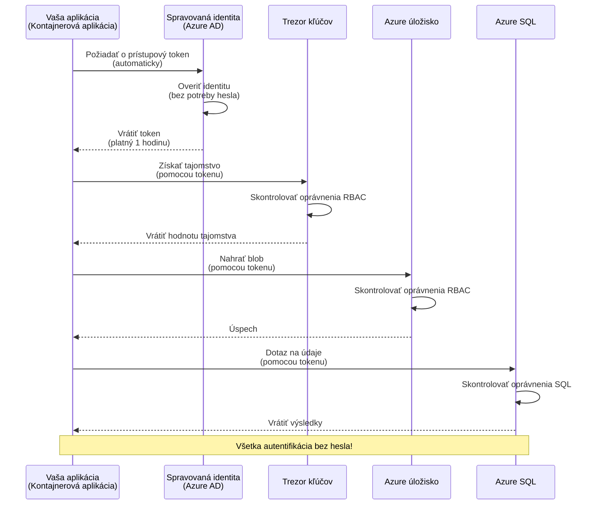
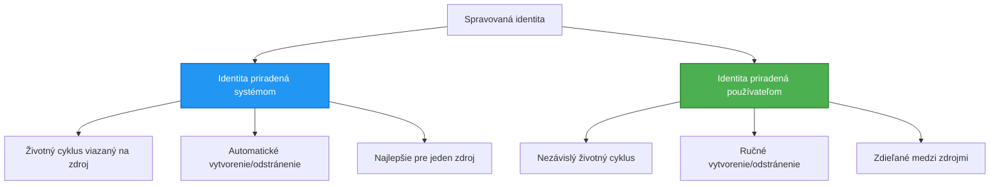

# Autentifikačné vzory a spravovaná identita

⏱️ **Odhadovaný čas**: 45-60 minút | 💰 **Vplyv na náklady**: Bezplatné (žiadne dodatočné poplatky) | ⭐ **Komplexnosť**: Stredná

**📚 Učebná cesta:**
- ← Predchádzajúce: [Správa konfigurácie](configuration.md) - Správa environmentálnych premenných a tajomstiev
- 🎯 **Tu sa nachádzate**: Autentifikácia a bezpečnosť (Spravovaná identita, Key Vault, bezpečné vzory)
- → Ďalej: [Prvý projekt](first-project.md) - Vytvorte svoju prvú AZD aplikáciu
- 🏠 [Domov kurzu](../../README.md)

---

## Čo sa naučíte

Po dokončení tejto lekcie budete:
- Rozumieť autentifikačným vzorom Azure (kľúče, pripojovacie reťazce, spravovaná identita)
- Implementovať **Spravovanú identitu** pre autentifikáciu bez hesiel
- Zabezpečiť tajomstvá pomocou integrácie **Azure Key Vault**
- Konfigurovať **kontrolu prístupu na základe rolí (RBAC)** pre nasadenia AZD
- Aplikovať bezpečnostné osvedčené postupy v Container Apps a Azure službách
- Migrovať z autentifikácie založenej na kľúčoch na autentifikáciu založenú na identite

## Prečo je spravovaná identita dôležitá

### Problém: Tradičná autentifikácia

**Pred spravovanou identitou:**
```javascript
// ❌ BEZPEČNOSTNÉ RIZIKO: Pevne zakódované tajomstvá v kóde
const connectionString = "Server=mydb.database.windows.net;User=admin;Password=P@ssw0rd123";
const storageKey = "xK7mN9pQ2wR5tY8uI0oP3aS6dF1gH4jK...";
const cosmosKey = "C2x7B9n4M1p8Q5w3E6r0T2y5U8i1O4p7...";
```

**Problémy:**
- 🔴 **Odhalené tajomstvá** v kóde, konfiguračných súboroch, environmentálnych premenných
- 🔴 **Rotácia poverení** vyžaduje zmeny kódu a opätovné nasadenie
- 🔴 **Auditné nočné mory** - kto čo kedy pristupoval?
- 🔴 **Roztrieštenosť** - tajomstvá roztrúsené po viacerých systémoch
- 🔴 **Riziká súladu** - neprejde bezpečnostnými auditmi

### Riešenie: Spravovaná identita

**Po spravovanej identite:**
```javascript
// ✅ BEZPEČNÉ: Žiadne tajomstvá v kóde
const credential = new DefaultAzureCredential();
const client = new BlobServiceClient(
  "https://mystorageaccount.blob.core.windows.net",
  credential  // Azure automaticky spracováva autentifikáciu
);
```

**Výhody:**
- ✅ **Žiadne tajomstvá** v kóde alebo konfigurácii
- ✅ **Automatická rotácia** - Azure sa o to postará
- ✅ **Kompletná auditná stopa** v logoch Azure AD
- ✅ **Centralizovaná bezpečnosť** - správa v Azure Portáli
- ✅ **Pripravené na súlad** - spĺňa bezpečnostné normy

**Analógia**: Tradičná autentifikácia je ako nosenie viacerých fyzických kľúčov pre rôzne dvere. Spravovaná identita je ako mať bezpečnostný preukaz, ktorý automaticky poskytuje prístup na základe toho, kto ste—žiadne kľúče na stratu, kopírovanie alebo rotáciu.

---

## Prehľad architektúry

### Tok autentifikácie so spravovanou identitou


### Typy spravovaných identít


| Funkcia | Systémovo priradená | Užívateľsky priradená |
|---------|---------------------|-----------------------|
| **Životný cyklus** | Viazaný na zdroj | Nezávislý |
| **Vytvorenie** | Automatické so zdrojom | Manuálne vytvorenie |
| **Zmazanie** | Zmazané so zdrojom | Pretrváva po zmazaní zdroja |
| **Zdieľanie** | Iba jeden zdroj | Viacero zdrojov |
| **Použitie** | Jednoduché scenáre | Komplexné scenáre s viacerými zdrojmi |
| **Predvolené v AZD** | ✅ Odporúčané | Voliteľné |

---

## Predpoklady

### Požadované nástroje

Tieto by ste už mali mať nainštalované z predchádzajúcich lekcií:

```bash
# Overiť Azure Developer CLI
azd version
# ✅ Očakávané: azd verzia 1.0.0 alebo vyššia

# Overiť Azure CLI
az --version
# ✅ Očakávané: azure-cli 2.50.0 alebo vyššia
```

### Požiadavky na Azure

- Aktívne predplatné Azure
- Oprávnenia na:
  - Vytvorenie spravovaných identít
  - Priradenie RBAC rolí
  - Vytvorenie zdrojov Key Vault
  - Nasadenie Container Apps

### Požiadavky na znalosti

Mali by ste mať dokončené:
- [Inštalačný sprievodca](installation.md) - Nastavenie AZD
- [Základy AZD](azd-basics.md) - Základné koncepty
- [Správa konfigurácie](configuration.md) - Environmentálne premenné

---

## Lekcia 1: Porozumenie autentifikačným vzorom

### Vzor 1: Pripojovacie reťazce (zastaralé - vyhnite sa)

**Ako to funguje:**
```bash
# Reťazec pripojenia obsahuje poverenia
STORAGE_CONNECTION_STRING="DefaultEndpointsProtocol=https;AccountName=myaccount;AccountKey=xK7mN9pQ2wR5..."
COSMOS_CONNECTION_STRING="AccountEndpoint=https://myaccount.documents.azure.com:443/;AccountKey=C2x7..."
SQL_CONNECTION_STRING="Server=myserver.database.windows.net;User=admin;Password=P@ssw0rd..."
```

**Problémy:**
- ❌ Tajomstvá viditeľné v environmentálnych premenných
- ❌ Zaznamenané v systémoch nasadenia
- ❌ Ťažké na rotáciu
- ❌ Žiadna auditná stopa prístupu

**Kedy použiť:** Iba na lokálny vývoj, nikdy v produkcii.

---

### Vzor 2: Referencie Key Vault (lepšie)

**Ako to funguje:**
```bicep
// Store secret in Key Vault
resource keyVault 'Microsoft.KeyVault/vaults@2023-02-01' = {
  name: 'mykv'
  properties: {
    enableRbacAuthorization: true
  }
}

// Reference in Container App
env: [
  {
    name: 'STORAGE_KEY'
    secretRef: 'storage-key'  // References Key Vault
  }
]
```

**Výhody:**
- ✅ Tajomstvá bezpečne uložené v Key Vault
- ✅ Centralizovaná správa tajomstiev
- ✅ Rotácia bez zmien kódu

**Obmedzenia:**
- ⚠️ Stále používanie kľúčov/hesiel
- ⚠️ Potreba spravovať prístup k Key Vault

**Kedy použiť:** Prechodný krok od pripojovacích reťazcov k spravovanej identite.

---

### Vzor 3: Spravovaná identita (najlepšia prax)

**Ako to funguje:**
```bicep
// Enable managed identity
resource containerApp 'Microsoft.App/containerApps@2023-05-01' = {
  name: 'myapp'
  identity: {
    type: 'SystemAssigned'  // Automatically creates identity
  }
}

// Grant permissions
resource roleAssignment 'Microsoft.Authorization/roleAssignments@2022-04-01' = {
  scope: storageAccount
  properties: {
    roleDefinitionId: storageBlobDataContributorRole
    principalId: containerApp.identity.principalId
  }
}
```

**Aplikačný kód:**
```javascript
// Nie sú potrebné žiadne tajomstvá!
const { DefaultAzureCredential } = require('@azure/identity');
const { BlobServiceClient } = require('@azure/storage-blob');

const credential = new DefaultAzureCredential();
const blobServiceClient = new BlobServiceClient(
  'https://mystorageaccount.blob.core.windows.net',
  credential
);
```

**Výhody:**
- ✅ Žiadne tajomstvá v kóde/konfigurácii
- ✅ Automatická rotácia poverení
- ✅ Kompletná auditná stopa
- ✅ Povolenia na základe RBAC
- ✅ Pripravené na súlad

**Kedy použiť:** Vždy, pre produkčné aplikácie.

---

## Lekcia 2: Implementácia spravovanej identity s AZD

### Krok za krokom implementácia

Vytvorme bezpečnú Container App, ktorá používa spravovanú identitu na prístup k Azure Storage a Key Vault.

### Štruktúra projektu

```
secure-app/
├── azure.yaml                 # AZD configuration
├── infra/
│   ├── main.bicep            # Main infrastructure
│   ├── core/
│   │   ├── identity.bicep    # Managed identity setup
│   │   ├── keyvault.bicep    # Key Vault configuration
│   │   └── storage.bicep     # Storage with RBAC
│   └── app/
│       └── container-app.bicep
└── src/
    ├── app.js                # Application code
    ├── package.json
    └── Dockerfile
```

### 1. Konfigurácia AZD (azure.yaml)

```yaml
name: secure-app
metadata:
  template: secure-app@1.0.0

services:
  api:
    project: ./src
    language: js
    host: containerapp

# Enable managed identity (AZD handles this automatically)
```

### 2. Infraštruktúra: Povolenie spravovanej identity

**Súbor: `infra/main.bicep`**

```bicep
targetScope = 'subscription'

param environmentName string
param location string = 'eastus'

var tags = { 'azd-env-name': environmentName }

// Resource group
resource rg 'Microsoft.Resources/resourceGroups@2021-04-01' = {
  name: 'rg-${environmentName}'
  location: location
  tags: tags
}

// Storage Account
module storage './core/storage.bicep' = {
  name: 'storage'
  scope: rg
  params: {
    name: 'st${uniqueString(rg.id)}'
    location: location
    tags: tags
  }
}

// Key Vault
module keyVault './core/keyvault.bicep' = {
  name: 'keyvault'
  scope: rg
  params: {
    name: 'kv-${uniqueString(rg.id)}'
    location: location
    tags: tags
  }
}

// Container App with Managed Identity
module containerApp './app/container-app.bicep' = {
  name: 'container-app'
  scope: rg
  params: {
    name: 'ca-${environmentName}'
    location: location
    tags: tags
    storageAccountName: storage.outputs.name
    keyVaultName: keyVault.outputs.name
  }
}

// Grant Container App access to Storage
module storageRoleAssignment './core/role-assignment.bicep' = {
  name: 'storage-role'
  scope: rg
  params: {
    principalId: containerApp.outputs.identityPrincipalId
    roleDefinitionId: 'ba92f5b4-2d11-453d-a403-e96b0029c9fe'  // Storage Blob Data Contributor
    targetResourceId: storage.outputs.id
  }
}

// Grant Container App access to Key Vault
module kvRoleAssignment './core/role-assignment.bicep' = {
  name: 'kv-role'
  scope: rg
  params: {
    principalId: containerApp.outputs.identityPrincipalId
    roleDefinitionId: '4633458b-17de-408a-b874-0445c86b69e6'  // Key Vault Secrets User
    targetResourceId: keyVault.outputs.id
  }
}

// Outputs
output AZURE_STORAGE_ACCOUNT_NAME string = storage.outputs.name
output AZURE_KEY_VAULT_NAME string = keyVault.outputs.name
output APP_URL string = containerApp.outputs.url
```

### 3. Container App so systémovo priradenou identitou

**Súbor: `infra/app/container-app.bicep`**

```bicep
param name string
param location string
param tags object = {}
param storageAccountName string
param keyVaultName string

resource containerApp 'Microsoft.App/containerApps@2023-05-01' = {
  name: name
  location: location
  tags: tags
  identity: {
    type: 'SystemAssigned'  // 🔑 Enable managed identity
  }
  properties: {
    configuration: {
      ingress: {
        external: true
        targetPort: 3000
      }
    }
    template: {
      containers: [
        {
          name: 'api'
          image: 'myregistry.azurecr.io/api:latest'
          resources: {
            cpu: json('0.5')
            memory: '1Gi'
          }
          env: [
            {
              name: 'AZURE_STORAGE_ACCOUNT_NAME'
              value: storageAccountName
            }
            {
              name: 'AZURE_KEY_VAULT_NAME'
              value: keyVaultName
            }
            // 🔑 No secrets - managed identity handles authentication!
          ]
        }
      ]
    }
  }
}

// Output the identity for RBAC assignments
output identityPrincipalId string = containerApp.identity.principalId
output id string = containerApp.id
output url string = 'https://${containerApp.properties.configuration.ingress.fqdn}'
```

### 4. Modul priradenia RBAC rolí

**Súbor: `infra/core/role-assignment.bicep`**

```bicep
param principalId string
param roleDefinitionId string  // Azure built-in role ID
param targetResourceId string

resource roleAssignment 'Microsoft.Authorization/roleAssignments@2022-04-01' = {
  name: guid(principalId, roleDefinitionId, targetResourceId)
  scope: resourceId('Microsoft.Resources/resourceGroups', resourceGroup().name)
  properties: {
    roleDefinitionId: subscriptionResourceId('Microsoft.Authorization/roleDefinitions', roleDefinitionId)
    principalId: principalId
    principalType: 'ServicePrincipal'
  }
}

output id string = roleAssignment.id
```

### 5. Aplikačný kód so spravovanou identitou

**Súbor: `src/app.js`**

```javascript
const express = require('express');
const { DefaultAzureCredential } = require('@azure/identity');
const { BlobServiceClient } = require('@azure/storage-blob');
const { SecretClient } = require('@azure/keyvault-secrets');

const app = express();
const PORT = process.env.PORT || 3000;

// 🔑 Inicializovať poverenie (funguje automaticky s riadenou identitou)
const credential = new DefaultAzureCredential();

// Nastavenie Azure Storage
const storageAccountName = process.env.AZURE_STORAGE_ACCOUNT_NAME;
const blobServiceClient = new BlobServiceClient(
  `https://${storageAccountName}.blob.core.windows.net`,
  credential  // Nie sú potrebné žiadne kľúče!
);

// Nastavenie Key Vault
const keyVaultName = process.env.AZURE_KEY_VAULT_NAME;
const secretClient = new SecretClient(
  `https://${keyVaultName}.vault.azure.net`,
  credential  // Nie sú potrebné žiadne kľúče!
);

// Kontrola stavu
app.get('/health', (req, res) => {
  res.json({ status: 'healthy', authentication: 'managed-identity' });
});

// Nahrať súbor do blob storage
app.post('/upload', async (req, res) => {
  try {
    const containerClient = blobServiceClient.getContainerClient('uploads');
    await containerClient.createIfNotExists();
    
    const blobName = `file-${Date.now()}.txt`;
    const blockBlobClient = containerClient.getBlockBlobClient(blobName);
    
    await blockBlobClient.upload('Hello from managed identity!', 30);
    
    res.json({
      success: true,
      blobName: blobName,
      message: 'File uploaded using managed identity!'
    });
  } catch (error) {
    console.error('Upload error:', error);
    res.status(500).json({ error: error.message });
  }
});

// Získať tajomstvo z Key Vault
app.get('/secret/:name', async (req, res) => {
  try {
    const secretName = req.params.name;
    const secret = await secretClient.getSecret(secretName);
    
    res.json({
      name: secretName,
      value: secret.value,
      message: 'Secret retrieved using managed identity!'
    });
  } catch (error) {
    console.error('Secret error:', error);
    res.status(500).json({ error: error.message });
  }
});

// Zoznam blob kontajnerov (ukazuje prístup na čítanie)
app.get('/containers', async (req, res) => {
  try {
    const containers = [];
    for await (const container of blobServiceClient.listContainers()) {
      containers.push(container.name);
    }
    
    res.json({
      containers: containers,
      count: containers.length,
      message: 'Containers listed using managed identity!'
    });
  } catch (error) {
    console.error('List error:', error);
    res.status(500).json({ error: error.message });
  }
});

app.listen(PORT, () => {
  console.log(`Secure API listening on port ${PORT}`);
  console.log('Authentication: Managed Identity (passwordless)');
});
```

**Súbor: `src/package.json`**

```json
{
  "name": "secure-app",
  "version": "1.0.0",
  "dependencies": {
    "express": "^4.18.2",
    "@azure/identity": "^4.0.0",
    "@azure/storage-blob": "^12.17.0",
    "@azure/keyvault-secrets": "^4.7.0"
  },
  "scripts": {
    "start": "node app.js"
  }
}
```

### 6. Nasadenie a testovanie

```bash
# Inicializovať prostredie AZD
azd init

# Nasadiť infraštruktúru a aplikáciu
azd up

# Získať URL aplikácie
APP_URL=$(azd env get-values | grep APP_URL | cut -d '=' -f2 | tr -d '"')

# Otestovať kontrolu stavu
curl $APP_URL/health
```

**✅ Očakávaný výstup:**
```json
{
  "status": "healthy",
  "authentication": "managed-identity"
}
```

**Testovanie nahrávania blobov:**
```bash
curl -X POST $APP_URL/upload
```

**✅ Očakávaný výstup:**
```json
{
  "success": true,
  "blobName": "file-1700404800000.txt",
  "message": "File uploaded using managed identity!"
}
```

**Testovanie zoznamu kontajnerov:**
```bash
curl $APP_URL/containers
```

**✅ Očakávaný výstup:**
```json
{
  "containers": ["uploads"],
  "count": 1,
  "message": "Containers listed using managed identity!"
}
```

---

## Bežné Azure RBAC roly

### Preddefinované ID rolí pre spravovanú identitu

| Služba | Názov roly | ID roly | Povolenia |
|--------|------------|---------|-----------|
| **Storage** | Storage Blob Data Reader | `2a2b9908-6b94-4a3d-8e5a-a7d8f8cc8a12` | Čítanie blobov a kontajnerov |
| **Storage** | Storage Blob Data Contributor | `ba92f5b4-2d11-453d-a403-e96b0029c9fe` | Čítanie, zapisovanie, mazanie blobov |
| **Storage** | Storage Queue Data Contributor | `974c5e8b-45b9-4653-ba55-5f855dd0fb88` | Čítanie, zapisovanie, mazanie správ v rade |
| **Key Vault** | Key Vault Secrets User | `4633458b-17de-408a-b874-0445c86b69e6` | Čítanie tajomstiev |
| **Key Vault** | Key Vault Secrets Officer | `b86a8fe4-44ce-4948-aee5-eccb2c155cd7` | Čítanie, zapisovanie, mazanie tajomstiev |
| **Cosmos DB** | Cosmos DB Built-in Data Reader | `00000000-0000-0000-0000-000000000001` | Čítanie dát Cosmos DB |
| **Cosmos DB** | Cosmos DB Built-in Data Contributor | `00000000-0000-0000-0000-000000000002` | Čítanie, zapisovanie dát Cosmos DB |
| **SQL Database** | SQL DB Contributor | `9b7fa17d-e63e-47b0-bb0a-15c516ac86ec` | Správa SQL databáz |
| **Service Bus** | Azure Service Bus Data Owner | `090c5cfd-751d-490a-894a-3ce6f1109419` | Posielanie, prijímanie, správa správ |

### Ako nájsť ID rolí

```bash
# Zoznam všetkých vstavaných rolí
az role definition list --query "[].{Name:roleName, ID:name}" --output table

# Vyhľadať konkrétnu rolu
az role definition list --query "[?contains(roleName, 'Storage Blob')].{Name:roleName, ID:name}" --output table

# Získať podrobnosti o role
az role definition list --name "Storage Blob Data Contributor"
```

---

## Praktické cvičenia

### Cvičenie 1: Povolenie spravovanej identity pre existujúcu aplikáciu ⭐⭐ (Stredné)

**Cieľ**: Pridať spravovanú identitu do existujúceho nasadenia Container App

**Scenár**: Máte Container App používajúcu pripojovacie reťazce. Konvertujte ju na spravovanú identitu.

**Východiskový bod**: Container App s touto konfiguráciou:

```bicep
// ❌ Current: Using connection string
env: [
  {
    name: 'STORAGE_CONNECTION_STRING'
    secretRef: 'storage-connection'
  }
]
```

**Kroky**:

1. **Povolenie spravovanej identity v Bicep:**

```bicep
resource containerApp 'Microsoft.App/containerApps@2023-05-01' = {
  name: 'myapp'
  identity: {
    type: 'SystemAssigned'  // Add this
  }
  // ... rest of configuration
}
```

2. **Priradenie prístupu k Storage:**

```bicep
// Get storage account reference
resource storageAccount 'Microsoft.Storage/storageAccounts@2023-01-01' existing = {
  name: storageAccountName
}

// Assign role
resource roleAssignment 'Microsoft.Authorization/roleAssignments@2022-04-01' = {
  name: guid(containerApp.id, 'ba92f5b4-2d11-453d-a403-e96b0029c9fe', storageAccount.id)
  scope: storageAccount
  properties: {
    roleDefinitionId: subscriptionResourceId('Microsoft.Authorization/roleDefinitions', 'ba92f5b4-2d11-453d-a403-e96b0029c9fe')
    principalId: containerApp.identity.principalId
    principalType: 'ServicePrincipal'
  }
}
```

3. **Aktualizácia aplikačného kódu:**

**Predtým (pripojovací reťazec):**
```javascript
const { BlobServiceClient } = require('@azure/storage-blob');

const blobServiceClient = BlobServiceClient.fromConnectionString(
  process.env.STORAGE_CONNECTION_STRING
);
```

**Potom (spravovaná identita):**
```javascript
const { DefaultAzureCredential } = require('@azure/identity');
const { BlobServiceClient } = require('@azure/storage-blob');

const credential = new DefaultAzureCredential();
const blobServiceClient = new BlobServiceClient(
  `https://${process.env.STORAGE_ACCOUNT_NAME}.blob.core.windows.net`,
  credential
);
```

4. **Aktualizácia environmentálnych premenných:**

```bicep
env: [
  {
    name: 'STORAGE_ACCOUNT_NAME'
    value: storageAccountName  // Just the name, no secrets!
  }
  // Remove STORAGE_CONNECTION_STRING
]
```

5. **Nasadenie a testovanie:**

```bash
# Znovu nasadiť
azd up

# Otestovať, či to stále funguje
curl https://myapp.azurecontainerapps.io/upload
```

**✅ Kritériá úspechu:**
- ✅ Aplikácia sa nasadí bez chýb
- ✅ Operácie Storage fungujú (nahrávanie, zoznam, sťahovanie)
- ✅ Žiadne pripojovacie reťazce v environmentálnych premenných
- ✅ Identita viditeľná v Azure Portáli pod záložkou "Identity"

**Overenie:**

```bash
# Skontrolujte, či je povolená spravovaná identita
az containerapp show \
  --name myapp \
  --resource-group rg-myapp \
  --query "identity.type"
# ✅ Očakávané: "SystemAssigned"

# Skontrolujte priradenie role
az role assignment list \
  --assignee $(az containerapp show --name myapp --resource-group rg-myapp --query "identity.principalId" -o tsv) \
  --scope /subscriptions/{sub-id}/resourceGroups/rg-myapp/providers/Microsoft.Storage/storageAccounts/mystorageaccount
# ✅ Očakávané: Zobrazuje rolu "Storage Blob Data Contributor"
```

**Čas**: 20-30 minút

---

### Cvičenie 2: Prístup k viacerým službám s užívateľsky priradenou identitou ⭐⭐⭐ (Pokročilé)

**Cieľ**: Vytvoriť užívateľsky priradenú identitu zdieľanú medzi viacerými Container Apps

**Scenár**: Máte 3 mikroslužby, ktoré všetky potrebujú prístup k rovnakému Storage účtu a Key Vault.

**Kroky**:

1. **Vytvorenie užívateľsky priradenej identity:**

**Súbor: `infra/core/identity.bicep`**

```bicep
param name string
param location string
param tags object = {}

resource userAssignedIdentity 'Microsoft.ManagedIdentity/userAssignedIdentities@2023-01-31' = {
  name: name
  location: location
  tags: tags
}

output id string = userAssignedIdentity.id
output principalId string = userAssignedIdentity.properties.principalId
output clientId string = userAssignedIdentity.properties.clientId
```

2. **Priradenie rolí užívateľsky priradenej identite:**

```bicep
// In main.bicep
module userIdentity './core/identity.bicep' = {
  name: 'user-identity'
  scope: rg
  params: {
    name: 'id-${environmentName}'
    location: location
    tags: tags
  }
}

// Grant Storage access
resource storageRoleAssignment 'Microsoft.Authorization/roleAssignments@2022-04-01' = {
  name: guid(userIdentity.outputs.principalId, 'storage-contributor')
  scope: storageAccount
  properties: {
    roleDefinitionId: subscriptionResourceId('Microsoft.Authorization/roleDefinitions', 'ba92f5b4-2d11-453d-a403-e96b0029c9fe')
    principalId: userIdentity.outputs.principalId
    principalType: 'ServicePrincipal'
  }
}

// Grant Key Vault access
resource kvRoleAssignment 'Microsoft.Authorization/roleAssignments@2022-04-01' = {
  name: guid(userIdentity.outputs.principalId, 'kv-secrets-user')
  scope: keyVault
  properties: {
    roleDefinitionId: subscriptionResourceId('Microsoft.Authorization/roleDefinitions', '4633458b-17de-408a-b874-0445c86b69e6')
    principalId: userIdentity.outputs.principalId
    principalType: 'ServicePrincipal'
  }
}
```

3. **Priradenie identity viacerým Container Apps:**

```bicep
resource apiGateway 'Microsoft.App/containerApps@2023-05-01' = {
  name: 'api-gateway'
  identity: {
    type: 'UserAssigned'
    userAssignedIdentities: {
      '${userIdentity.outputs.id}': {}
    }
  }
  // ... rest of config
}

resource productService 'Microsoft.App/containerApps@2023-05-01' = {
  name: 'product-service'
  identity: {
    type: 'UserAssigned'
    userAssignedIdentities: {
      '${userIdentity.outputs.id}': {}
    }
  }
  // ... rest of config
}

resource orderService 'Microsoft.App/containerApps@2023-05-01' = {
  name: 'order-service'
  identity: {
    type: 'UserAssigned'
    userAssignedIdentities: {
      '${userIdentity.outputs.id}': {}
    }
  }
  // ... rest of config
}
```

4. **Aplikačný kód (všetky služby používajú rovnaký vzor):**

```javascript
const { DefaultAzureCredential, ManagedIdentityCredential } = require('@azure/identity');

// Pre používateľom priradenú identitu zadajte ID klienta
const credential = new ManagedIdentityCredential(
  process.env.AZURE_CLIENT_ID  // ID klienta používateľom priradenej identity
);

// Alebo použite DefaultAzureCredential (automaticky detekuje)
const credential = new DefaultAzureCredential();

const blobServiceClient = new BlobServiceClient(
  `https://${process.env.STORAGE_ACCOUNT_NAME}.blob.core.windows.net`,
  credential
);
```

5. **Nasadenie a overenie:**

```bash
azd up

# Otestujte, či všetky služby majú prístup k úložisku
curl https://api-gateway.azurecontainerapps.io/upload
curl https://product-service.azurecontainerapps.io/upload
curl https://order-service.azurecontainerapps.io/upload
```

**✅ Kritériá úspechu:**
- ✅ Jedna identita zdieľaná medzi 3 službami
- ✅ Všetky služby majú prístup k Storage a Key Vault
- ✅ Identita pretrváva, ak zmažete jednu službu
- ✅ Centralizovaná správa povolení

**Výhody užívateľsky priradenej identity:**
- Jedna identita na správu
- Konzistentné povolenia medzi službami
- Prežije zmazanie služby
- Lepšie pre komplexné architektúry

**Čas**: 30-40 minút

---

### Cvičenie 3: Implementácia rotácie tajomstiev v Key Vault ⭐⭐⭐ (Pokročilé)

**Cieľ**: Uložiť API kľúče tretích strán v Key Vault a pristupovať k nim pomocou spravovanej identity

**Scenár**: Vaša aplikácia potrebuje volať externé API (OpenAI, Stripe, SendGrid), ktoré vyžaduje API kľúče.

**Kroky**:

1. **Vytvorenie Key Vault s RBAC:**

**Súbor: `infra/core/keyvault.bicep`**

```bicep
param name string
param location string
param tags object = {}

resource keyVault 'Microsoft.KeyVault/vaults@2023-02-01' = {
  name: name
  location: location
  tags: tags
  properties: {
    enableRbacAuthorization: true  // Use RBAC instead of access policies
    sku: {
      family: 'A'
      name: 'standard'
    }
    tenantId: subscription().tenantId
    enableSoftDelete: true
    softDeleteRetentionInDays: 90
  }
}

// Allow Container App to read secrets
output id string = keyVault.id
output name string = keyVault.name
output uri string = keyVault.properties.vaultUri
```

2. **Uloženie tajomstiev v Key Vault:**

```bash
# Získať názov trezoru kľúčov
KV_NAME=$(azd env get-values | grep AZURE_KEY_VAULT_NAME | cut -d '=' -f2 | tr -d '"')

# Uložiť API kľúče tretej strany
az keyvault secret set \
  --vault-name $KV_NAME \
  --name "OpenAI-ApiKey" \
  --value "sk-proj-xxxxxxxxxxxxx"

az keyvault secret set \
  --vault-name $KV_NAME \
  --name "Stripe-ApiKey" \
  --value "sk_live_xxxxxxxxxxxxx"

az keyvault secret set \
  --vault-name $KV_NAME \
  --name "SendGrid-ApiKey" \
  --value "SG.xxxxxxxxxxxxx"
```

3. **Aplikačný kód na získanie tajomstiev:**

**Súbor: `src/config.js`**

```javascript
const { DefaultAzureCredential } = require('@azure/identity');
const { SecretClient } = require('@azure/keyvault-secrets');

class Config {
  constructor() {
    this.credential = new DefaultAzureCredential();
    this.secretClient = new SecretClient(
      `https://${process.env.AZURE_KEY_VAULT_NAME}.vault.azure.net`,
      this.credential
    );
    this.cache = {};
  }

  async getSecret(secretName) {
    // Najskôr skontrolujte vyrovnávaciu pamäť
    if (this.cache[secretName]) {
      return this.cache[secretName];
    }

    try {
      const secret = await this.secretClient.getSecret(secretName);
      this.cache[secretName] = secret.value;
      console.log(`✅ Retrieved secret: ${secretName}`);
      return secret.value;
    } catch (error) {
      console.error(`❌ Failed to get secret ${secretName}:`, error.message);
      throw error;
    }
  }

  async getOpenAIKey() {
    return this.getSecret('OpenAI-ApiKey');
  }

  async getStripeKey() {
    return this.getSecret('Stripe-ApiKey');
  }

  async getSendGridKey() {
    return this.getSecret('SendGrid-ApiKey');
  }
}

module.exports = new Config();
```

4. **Použitie tajomstiev v aplikácii:**

**Súbor: `src/app.js`**

```javascript
const express = require('express');
const config = require('./config');
const { OpenAI } = require('openai');

const app = express();

// Inicializujte OpenAI s kľúčom z Key Vault
let openaiClient;

async function initializeServices() {
  const openaiKey = await config.getOpenAIKey();
  openaiClient = new OpenAI({ apiKey: openaiKey });
  console.log('✅ Services initialized with secrets from Key Vault');
}

// Zavolať pri spustení
initializeServices().catch(console.error);

app.post('/chat', async (req, res) => {
  try {
    const completion = await openaiClient.chat.completions.create({
      model: 'gpt-4',
      messages: [{ role: 'user', content: 'Hello!' }]
    });
    
    res.json({
      response: completion.choices[0].message.content,
      authentication: 'Key from Key Vault via Managed Identity'
    });
  } catch (error) {
    res.status(500).json({ error: error.message });
  }
});

app.listen(3000, () => {
  console.log('Secure API with Key Vault integration running');
});
```

5. **Nasadenie a testovanie:**

```bash
azd up

# Otestujte, či API kľúče fungujú
curl -X POST https://myapp.azurecontainerapps.io/chat \
  -H "Content-Type: application/json" \
  -d '{"message":"Hello AI"}'
```

**✅ Kritériá úspechu:**
- ✅ Žiadne API kľúče v kóde alebo environmentálnych premenných
- ✅ Aplikácia získava kľúče z Key Vault
- ✅ Externé API fungujú správne
- ✅ Možnosť rotácie kľúčov bez zmien kódu

**Rotácia tajomstva:**

```bash
# Aktualizovať tajomstvo v Key Vault
az keyvault secret set \
  --vault-name $KV_NAME \
  --name "OpenAI-ApiKey" \
  --value "sk-proj-NEW_KEY_HERE"

# Reštartovať aplikáciu, aby sa načítal nový kľúč
az containerapp revision restart \
  --name myapp \
  --resource-group rg-myapp
```

**Čas**: 25-35 minút

---

## Kontrolný bod znalostí

### 1. Autentifikačné vzory ✓

Otestujte svoje porozumenie:

- [ ] **Q1**: Aké sú tri hlavné autentifikačné vzory? 
  - **A**: Pripojovacie reťazce (zastaralé), Referencie Key Vault (prechodné), Spravovaná identita (najlepšie)

- [ ] **Q2**: Prečo je spravovaná identita lepšia ako pripojovacie reťazce?
  - **A**: Žiadne tajomstvá v kóde, automatická rotácia, kompletná auditná stopa, povolenia na základe RBAC

- [ ] **Q3**: Kedy by ste použili užívateľsky priradenú identitu namiesto systémovo priradenej?
  - **A**: Keď zdieľate identitu medzi viacerými zdrojmi alebo keď je životný cyklus identity nezávislý od životného cyklu zdroja

**Praktické overenie:**
```bash
# Skontrolujte, aký typ identity vaša aplikácia používa
az containerapp show \
  --name myapp \
  --resource-group rg-myapp \
  --query "identity.type"

# Zoznam všetkých priradení rolí pre identitu
az role assignment list \
  --assignee $(az containerapp show --name myapp --resource-group rg-myapp --query "identity.principalId" -o tsv)
```

---

### 2. RBAC a povolenia ✓

Otestujte svoje porozumenie:

- [ ] **Q1**: Aké je ID roly pre "Storage Blob Data Contributor"?
  - **A**: `ba92f5b4-2d11-453d-a403-e96b0029c9fe`

- [ ] **Q2**: Aké povolenia poskytuje "Key Vault Secrets User"?
  - **A**: Prístup na čítanie tajomstiev (nemôže vytvárať, aktualizovať ani mazať)

- [ ] **Q3**: Ako priradíte Container App prístup k Azure SQL?
  - **A**: Priradením roly "SQL DB Contributor" alebo konfiguráciou autentifikácie Azure AD pre SQL

**Praktické overenie:**
```bash
# Nájsť konkrétnu rolu
az role definition list --name "Storage Blob Data Contributor"

# Skontrolovať, aké role sú priradené k vašej identite
PRINCIPAL_ID=$(az containerapp show --name myapp --resource-group rg-myapp --query "identity.principalId" -o tsv)
az role assignment list --assignee $PRINCIPAL_ID --output table
```

---

### 3. Integrácia Key Vault ✓

Otestujte svoje porozumenie:
- [ ] **Q1**: Ako povoliť RBAC pre Key Vault namiesto prístupových politík?
  - **A**: Nastavte `enableRbacAuthorization: true` v Bicep

- [ ] **Q2**: Ktorá knižnica Azure SDK spracováva autentifikáciu pomocou spravovanej identity?
  - **A**: `@azure/identity` s triedou `DefaultAzureCredential`

- [ ] **Q3**: Ako dlho zostávajú tajomstvá Key Vault v cache?
  - **A**: Závisí od aplikácie; implementujte vlastnú stratégiu cacheovania

**Praktické overenie:**
```bash
# Otestujte prístup k trezoru kľúčov
az keyvault secret show \
  --vault-name $KV_NAME \
  --name "OpenAI-ApiKey" \
  --query "value"

# Skontrolujte, či je povolené RBAC
az keyvault show \
  --name $KV_NAME \
  --query "properties.enableRbacAuthorization"
# ✅ Očakávané: pravda
```

---

## Najlepšie bezpečnostné postupy

### ✅ ROBTE:

1. **V produkcii vždy používajte spravovanú identitu**
   ```bicep
   identity: {
     type: 'SystemAssigned'
   }
   ```

2. **Používajte RBAC role s minimálnymi oprávneniami**
   - Používajte role "Reader", keď je to možné
   - Vyhnite sa rolám "Owner" alebo "Contributor", pokiaľ to nie je nevyhnutné

3. **Ukladajte kľúče tretích strán v Key Vault**
   ```javascript
   const apiKey = await secretClient.getSecret('ThirdPartyApiKey');
   ```

4. **Povoľte auditovanie prístupu**
   ```bicep
   diagnosticSettings: {
     logs: [{ category: 'AuditEvent', enabled: true }]
   }
   ```

5. **Používajte rôzne identity pre vývoj/testovanie/produkciu**
   ```bash
   azd env new dev
   azd env new staging
   azd env new prod
   ```

6. **Pravidelne rotujte tajomstvá**
   - Nastavte dátumy expirácie pre tajomstvá v Key Vault
   - Automatizujte rotáciu pomocou Azure Functions

### ❌ NEROBTE:

1. **Nikdy neukladajte tajomstvá priamo v kóde**
   ```javascript
   // ❌ ZLÉ
   const apiKey = "sk-proj-xxxxxxxxxxxxx";
   ```

2. **Nepoužívajte pripojovacie reťazce v produkcii**
   ```javascript
   // ❌ ZLÉ
   BlobServiceClient.fromConnectionString(process.env.STORAGE_CONNECTION_STRING)
   ```

3. **Neudeľujte nadmerné oprávnenia**
   ```bicep
   // ❌ BAD - too much access
   roleDefinitionId: 'Owner'
   
   // ✅ GOOD - least privilege
   roleDefinitionId: 'Storage Blob Data Reader'
   ```

4. **Nezaznamenávajte tajomstvá**
   ```javascript
   // ❌ ZLÉ
   console.log('API Key:', apiKey);
   
   // ✅ DOBRÉ
   console.log('API Key retrieved successfully');
   ```

5. **Nedelite produkčné identity medzi prostrediami**
   ```bicep
   // ❌ BAD - same identity for dev and prod
   // ✅ GOOD - separate identities per environment
   ```

---

## Príručka na riešenie problémov

### Problém: "Unauthorized" pri prístupe k Azure Storage

**Príznaky:**
```
Error: Unauthorized (403)
AuthorizationPermissionMismatch: This request is not authorized to perform this operation
```

**Diagnóza:**

```bash
# Skontrolujte, či je povolená spravovaná identita
az containerapp show \
  --name myapp \
  --resource-group rg-myapp \
  --query "identity.type"
# ✅ Očakávané: "SystemAssigned" alebo "UserAssigned"

# Skontrolujte priradenia rolí
PRINCIPAL_ID=$(az containerapp show --name myapp --resource-group rg-myapp --query "identity.principalId" -o tsv)
az role assignment list --assignee $PRINCIPAL_ID

# Očakávané: Mali by ste vidieť "Storage Blob Data Contributor" alebo podobnú rolu
```

**Riešenia:**

1. **Priraďte správnu RBAC rolu:**
```bash
STORAGE_ID=$(az storage account show --name mystorageaccount --resource-group rg-myapp --query "id" -o tsv)
az role assignment create \
  --assignee $PRINCIPAL_ID \
  --role "Storage Blob Data Contributor" \
  --scope $STORAGE_ID
```

2. **Počkajte na propagáciu (môže trvať 5-10 minút):**
```bash
# Skontrolujte stav priradenia role
az role assignment list --assignee $PRINCIPAL_ID --scope $STORAGE_ID
```

3. **Overte, že aplikácia používa správne poverenia:**
```javascript
// Uistite sa, že používate DefaultAzureCredential
const credential = new DefaultAzureCredential();
```

---

### Problém: Prístup k Key Vault zamietnutý

**Príznaky:**
```
Error: Forbidden (403)
The user, group or application does not have secrets get permission
```

**Diagnóza:**

```bash
# Skontrolujte, či je povolené RBAC pre Key Vault
az keyvault show \
  --name $KV_NAME \
  --query "properties.enableRbacAuthorization"
# ✅ Očakávané: pravda

# Skontrolujte priradenia rolí
az role assignment list \
  --assignee $PRINCIPAL_ID \
  --scope /subscriptions/{sub-id}/resourceGroups/rg-myapp/providers/Microsoft.KeyVault/vaults/$KV_NAME
```

**Riešenia:**

1. **Povoľte RBAC na Key Vault:**
```bash
az keyvault update \
  --name $KV_NAME \
  --enable-rbac-authorization true
```

2. **Priraďte rolu Key Vault Secrets User:**
```bash
KV_ID=$(az keyvault show --name $KV_NAME --query "id" -o tsv)
az role assignment create \
  --assignee $PRINCIPAL_ID \
  --role "Key Vault Secrets User" \
  --scope $KV_ID
```

---

### Problém: DefaultAzureCredential nefunguje lokálne

**Príznaky:**
```
Error: DefaultAzureCredential failed to retrieve a token
CredentialUnavailableError: No credential available
```

**Diagnóza:**

```bash
# Skontrolujte, či ste prihlásený
az account show

# Skontrolujte autentifikáciu Azure CLI
az ad signed-in-user show
```

**Riešenia:**

1. **Prihláste sa do Azure CLI:**
```bash
az login
```

2. **Nastavte Azure subscription:**
```bash
az account set --subscription "Your Subscription Name"
```

3. **Pre lokálny vývoj použite environmentálne premenné:**
```bash
export AZURE_TENANT_ID="your-tenant-id"
export AZURE_CLIENT_ID="your-client-id"
export AZURE_CLIENT_SECRET="your-client-secret"
```

4. **Alebo použite iné poverenia lokálne:**
```javascript
const { DefaultAzureCredential, AzureCliCredential } = require('@azure/identity');

// Použite AzureCliCredential pre lokálny vývoj
const credential = process.env.NODE_ENV === 'production' 
  ? new DefaultAzureCredential()
  : new AzureCliCredential();
```

---

### Problém: Priradenie role trvá príliš dlho na propagáciu

**Príznaky:**
- Rola bola úspešne priradená
- Stále sa zobrazujú chyby 403
- Prístup je občasný (niekedy funguje, niekedy nie)

**Vysvetlenie:**
Zmeny v Azure RBAC môžu trvať 5-10 minút na globálnu propagáciu.

**Riešenie:**

```bash
# Počkajte a skúste znova
echo "Waiting for RBAC propagation..."
sleep 300  # Počkajte 5 minút

# Otestujte prístup
curl https://myapp.azurecontainerapps.io/upload

# Ak stále zlyháva, reštartujte aplikáciu
az containerapp revision restart \
  --name myapp \
  --resource-group rg-myapp
```

---

## Náklady

### Náklady na spravovanú identitu

| Zdroj | Náklady |
|-------|---------|
| **Spravovaná identita** | 🆓 **ZADARMO** - Bez poplatkov |
| **Priradenie RBAC rolí** | 🆓 **ZADARMO** - Bez poplatkov |
| **Požiadavky na token Azure AD** | 🆓 **ZADARMO** - Zahrnuté |
| **Operácie Key Vault** | $0.03 za 10,000 operácií |
| **Úložisko Key Vault** | $0.024 za tajomstvo mesačne |

**Spravovaná identita šetrí peniaze tým, že:**
- ✅ Eliminácia operácií Key Vault pre autentifikáciu medzi službami
- ✅ Znižovanie bezpečnostných incidentov (žiadne uniknuté poverenia)
- ✅ Znižovanie prevádzkových nákladov (žiadna manuálna rotácia)

**Porovnanie nákladov (mesačne):**

| Scenár | Pripojovacie reťazce | Spravovaná identita | Úspora |
|--------|-----------------------|---------------------|--------|
| Malá aplikácia (1M požiadaviek) | ~$50 (Key Vault + operácie) | ~$0 | $50/mesiac |
| Stredná aplikácia (10M požiadaviek) | ~$200 | ~$0 | $200/mesiac |
| Veľká aplikácia (100M požiadaviek) | ~$1,500 | ~$0 | $1,500/mesiac |

---

## Viac informácií

### Oficiálna dokumentácia
- [Azure Managed Identity](https://learn.microsoft.com/entra/identity/managed-identities-azure-resources/overview)
- [Azure RBAC](https://learn.microsoft.com/azure/role-based-access-control/overview)
- [Azure Key Vault](https://learn.microsoft.com/azure/key-vault/general/overview)
- [DefaultAzureCredential](https://learn.microsoft.com/dotnet/api/azure.identity.defaultazurecredential)

### Dokumentácia SDK
- [@azure/identity (Node.js)](https://www.npmjs.com/package/@azure/identity)
- [Azure.Identity (C#)](https://www.nuget.org/packages/Azure.Identity/)
- [azure-identity (Python)](https://pypi.org/project/azure-identity/)

### Ďalšie kroky v tomto kurze
- ← Predchádzajúce: [Správa konfigurácie](configuration.md)
- → Ďalšie: [Prvý projekt](first-project.md)
- 🏠 [Domov kurzu](../../README.md)

### Súvisiace príklady
- [Príklad Azure OpenAI Chat](../../../../examples/azure-openai-chat) - Používa spravovanú identitu pre Azure OpenAI
- [Príklad mikroservisov](../../../../examples/microservices) - Vzory autentifikácie pre viac služieb

---

## Zhrnutie

**Naučili ste sa:**
- ✅ Tri vzory autentifikácie (pripojovacie reťazce, Key Vault, spravovaná identita)
- ✅ Ako povoliť a konfigurovať spravovanú identitu v AZD
- ✅ Priradenie RBAC rolí pre služby Azure
- ✅ Integráciu Key Vault pre tajomstvá tretích strán
- ✅ Rozdiely medzi identitami priradenými používateľom a systémom
- ✅ Najlepšie bezpečnostné postupy a riešenie problémov

**Hlavné poznatky:**
1. **V produkcii vždy používajte spravovanú identitu** - Žiadne tajomstvá, automatická rotácia
2. **Používajte RBAC role s minimálnymi oprávneniami** - Udeľujte len nevyhnutné povolenia
3. **Ukladajte kľúče tretích strán v Key Vault** - Centralizovaná správa tajomstiev
4. **Oddelené identity pre každé prostredie** - Izolácia vývoja, testovania a produkcie
5. **Povoľte auditovanie prístupu** - Sledujte, kto k čomu pristupoval

**Ďalšie kroky:**
1. Dokončite praktické cvičenia vyššie
2. Migrujte existujúcu aplikáciu z pripojovacích reťazcov na spravovanú identitu
3. Vytvorte svoj prvý projekt AZD so zabezpečením od prvého dňa: [Prvý projekt](first-project.md)

---

<!-- CO-OP TRANSLATOR DISCLAIMER START -->
**Zrieknutie sa zodpovednosti**:  
Tento dokument bol preložený pomocou služby AI prekladu [Co-op Translator](https://github.com/Azure/co-op-translator). Hoci sa snažíme o presnosť, prosím, berte na vedomie, že automatizované preklady môžu obsahovať chyby alebo nepresnosti. Pôvodný dokument v jeho rodnom jazyku by mal byť považovaný za autoritatívny zdroj. Pre kritické informácie sa odporúča profesionálny ľudský preklad. Nenesieme zodpovednosť za akékoľvek nedorozumenia alebo nesprávne interpretácie vyplývajúce z použitia tohto prekladu.
<!-- CO-OP TRANSLATOR DISCLAIMER END -->