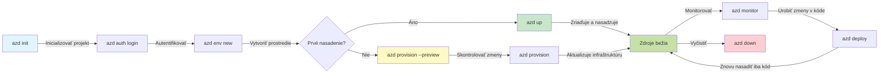
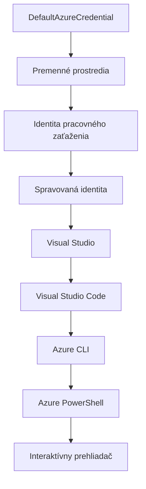

<!--
CO_OP_TRANSLATOR_METADATA:
{
  "original_hash": "e855e899d2705754fe85b04190edd0f0",
  "translation_date": "2025-11-23T11:51:34+00:00",
  "source_file": "docs/getting-started/azd-basics.md",
  "language_code": "sk"
}
-->
# AZD Základy - Pochopenie Azure Developer CLI

# AZD Základy - Hlavné koncepty a základy

**Navigácia kapitolou:**
- **📚 Domov kurzu**: [AZD pre začiatočníkov](../../README.md)
- **📖 Aktuálna kapitola**: Kapitola 1 - Základy a rýchly štart
- **⬅️ Predchádzajúca**: [Prehľad kurzu](../../README.md#-chapter-1-foundation--quick-start)
- **➡️ Ďalšia**: [Inštalácia a nastavenie](installation.md)
- **🚀 Ďalšia kapitola**: [Kapitola 2: AI-First Development](../microsoft-foundry/microsoft-foundry-integration.md)

## Úvod

Táto lekcia vás zoznámi s Azure Developer CLI (azd), výkonným nástrojom príkazového riadku, ktorý urýchľuje váš prechod od lokálneho vývoja k nasadeniu na Azure. Naučíte sa základné koncepty, hlavné funkcie a pochopíte, ako azd zjednodušuje nasadenie cloudových aplikácií.

## Ciele učenia

Na konci tejto lekcie budete:
- Rozumieť, čo je Azure Developer CLI a jeho hlavný účel
- Naučíte sa základné koncepty šablón, prostredí a služieb
- Preskúmate kľúčové funkcie vrátane vývoja na základe šablón a infraštruktúry ako kódu
- Pochopíte štruktúru projektu azd a pracovný postup
- Budete pripravení na inštaláciu a konfiguráciu azd pre vaše vývojové prostredie

## Výsledky učenia

Po dokončení tejto lekcie budete schopní:
- Vysvetliť úlohu azd v moderných pracovných postupoch cloudového vývoja
- Identifikovať komponenty štruktúry projektu azd
- Opísať, ako šablóny, prostredia a služby spolupracujú
- Pochopiť výhody infraštruktúry ako kódu s azd
- Rozpoznať rôzne príkazy azd a ich účely

## Čo je Azure Developer CLI (azd)?

Azure Developer CLI (azd) je nástroj príkazového riadku navrhnutý na urýchlenie vášho prechodu od lokálneho vývoja k nasadeniu na Azure. Zjednodušuje proces vytvárania, nasadzovania a správy cloudových aplikácií na Azure.

### 🎯 Prečo používať AZD? Porovnanie z reálneho sveta

Porovnajme nasadenie jednoduchého webového aplikácie s databázou:

#### ❌ BEZ AZD: Manuálne nasadenie na Azure (30+ minút)

```bash
# Krok 1: Vytvorte skupinu zdrojov
az group create --name myapp-rg --location eastus

# Krok 2: Vytvorte plán služby App Service
az appservice plan create --name myapp-plan \
  --resource-group myapp-rg \
  --sku B1 --is-linux

# Krok 3: Vytvorte webovú aplikáciu
az webapp create --name myapp-web-unique123 \
  --resource-group myapp-rg \
  --plan myapp-plan \
  --runtime "NODE:18-lts"

# Krok 4: Vytvorte účet Cosmos DB (10-15 minút)
az cosmosdb create --name myapp-cosmos-unique123 \
  --resource-group myapp-rg \
  --kind MongoDB

# Krok 5: Vytvorte databázu
az cosmosdb mongodb database create \
  --account-name myapp-cosmos-unique123 \
  --resource-group myapp-rg \
  --name tododb

# Krok 6: Vytvorte kolekciu
az cosmosdb mongodb collection create \
  --account-name myapp-cosmos-unique123 \
  --resource-group myapp-rg \
  --database-name tododb \
  --name todos

# Krok 7: Získajte reťazec pripojenia
CONN_STR=$(az cosmosdb keys list \
  --name myapp-cosmos-unique123 \
  --resource-group myapp-rg \
  --type connection-strings \
  --query "connectionStrings[0].connectionString" -o tsv)

# Krok 8: Nakonfigurujte nastavenia aplikácie
az webapp config appsettings set \
  --name myapp-web-unique123 \
  --resource-group myapp-rg \
  --settings MONGODB_URI="$CONN_STR"

# Krok 9: Povoliť protokolovanie
az webapp log config --name myapp-web-unique123 \
  --resource-group myapp-rg \
  --application-logging filesystem \
  --detailed-error-messages true

# Krok 10: Nastavte Application Insights
az monitor app-insights component create \
  --app myapp-insights \
  --location eastus \
  --resource-group myapp-rg

# Krok 11: Prepojte App Insights s webovou aplikáciou
INSTRUMENTATION_KEY=$(az monitor app-insights component show \
  --app myapp-insights \
  --resource-group myapp-rg \
  --query "instrumentationKey" -o tsv)

az webapp config appsettings set \
  --name myapp-web-unique123 \
  --resource-group myapp-rg \
  --settings APPINSIGHTS_INSTRUMENTATIONKEY="$INSTRUMENTATION_KEY"

# Krok 12: Zostavte aplikáciu lokálne
npm install
npm run build

# Krok 13: Vytvorte balík na nasadenie
zip -r app.zip . -x "*.git*" "node_modules/*"

# Krok 14: Nasadte aplikáciu
az webapp deployment source config-zip \
  --resource-group myapp-rg \
  --name myapp-web-unique123 \
  --src app.zip

# Krok 15: Počkajte a modlite sa, aby to fungovalo 🙏
# (Žiadna automatizovaná validácia, vyžaduje sa manuálne testovanie)
```

**Problémy:**
- ❌ 15+ príkazov na zapamätanie a vykonanie v správnom poradí
- ❌ 30-45 minút manuálnej práce
- ❌ Ľahko sa robia chyby (preklepy, nesprávne parametre)
- ❌ Reťazce pripojenia sú viditeľné v histórii terminálu
- ❌ Žiadna automatická obnova, ak niečo zlyhá
- ❌ Ťažko replikovateľné pre členov tímu
- ❌ Každý raz iné (nereprodukovateľné)

#### ✅ S AZD: Automatizované nasadenie (5 príkazov, 10-15 minút)

```bash
# Krok 1: Inicializovať zo šablóny
azd init --template todo-nodejs-mongo

# Krok 2: Autentifikovať
azd auth login

# Krok 3: Vytvoriť prostredie
azd env new dev

# Krok 4: Náhľad zmien (voliteľné, ale odporúčané)
azd provision --preview

# Krok 5: Nasadiť všetko
azd up

# ✨ Hotovo! Všetko je nasadené, nakonfigurované a monitorované
```

**Výhody:**
- ✅ **5 príkazov** oproti 15+ manuálnym krokom
- ✅ **10-15 minút** celkový čas (väčšinou čakanie na Azure)
- ✅ **Žiadne chyby** - automatizované a testované
- ✅ **Bezpečná správa tajomstiev** cez Key Vault
- ✅ **Automatická obnova** pri zlyhaní
- ✅ **Plne reprodukovateľné** - rovnaký výsledok každý raz
- ✅ **Pripravené pre tím** - každý môže nasadiť s rovnakými príkazmi
- ✅ **Infraštruktúra ako kód** - verziované šablóny Bicep
- ✅ **Vstavané monitorovanie** - Application Insights automaticky nakonfigurované

### 📊 Zníženie času a chýb

| Metrika | Manuálne nasadenie | Nasadenie s AZD | Zlepšenie |
|:-------|:------------------|:---------------|:------------|
| **Príkazy** | 15+ | 5 | O 67% menej |
| **Čas** | 30-45 min | 10-15 min | O 60% rýchlejšie |
| **Miera chýb** | ~40% | <5% | O 88% menej |
| **Konzistencia** | Nízka (manuálna) | 100% (automatizovaná) | Perfektná |
| **Zaškolenie tímu** | 2-4 hodiny | 30 minút | O 75% rýchlejšie |
| **Čas obnovy** | 30+ min (manuálne) | 2 min (automatizované) | O 93% rýchlejšie |

## Základné koncepty

### Šablóny
Šablóny sú základom azd. Obsahujú:
- **Kód aplikácie** - váš zdrojový kód a závislosti
- **Definície infraštruktúry** - Azure zdroje definované v Bicep alebo Terraform
- **Konfiguračné súbory** - nastavenia a environmentálne premenné
- **Skripty nasadenia** - automatizované pracovné postupy nasadenia

### Prostredia
Prostredia predstavujú rôzne ciele nasadenia:
- **Vývoj** - na testovanie a vývoj
- **Staging** - predprodukčné prostredie
- **Produkcia** - živé produkčné prostredie

Každé prostredie si udržiava vlastné:
- Azure resource group
- Konfiguračné nastavenia
- Stav nasadenia

### Služby
Služby sú stavebné bloky vašej aplikácie:
- **Frontend** - webové aplikácie, SPAs
- **Backend** - API, mikroslužby
- **Databáza** - riešenia na ukladanie dát
- **Úložisko** - súborové a blobové úložisko

## Kľúčové funkcie

### 1. Vývoj na základe šablón
```bash
# Prehliadať dostupné šablóny
azd template list

# Inicializovať zo šablóny
azd init --template <template-name>
```

### 2. Infraštruktúra ako kód
- **Bicep** - doménovo špecifický jazyk Azure
- **Terraform** - nástroj pre infraštruktúru na viacerých cloudoch
- **ARM Templates** - šablóny Azure Resource Manager

### 3. Integrované pracovné postupy
```bash
# Dokončiť pracovný postup nasadenia
azd up            # Poskytnutie + Nasadenie, toto je bez zásahu pri prvom nastavení

# 🧪 NOVÉ: Náhľad zmien infraštruktúry pred nasadením (BEZPEČNÉ)
azd provision --preview    # Simulovať nasadenie infraštruktúry bez vykonania zmien

azd provision     # Vytvorte zdroje Azure, ak aktualizujete infraštruktúru, použite toto
azd deploy        # Nasadiť aplikačný kód alebo znovu nasadiť aplikačný kód po aktualizácii
azd down          # Vyčistiť zdroje
```

#### 🛡️ Bezpečné plánovanie infraštruktúry s náhľadom
Príkaz `azd provision --preview` je pre bezpečné nasadenia revolučný:
- **Analýza na sucho** - ukazuje, čo bude vytvorené, upravené alebo zmazané
- **Žiadne riziko** - žiadne skutočné zmeny v Azure prostredí
- **Tímová spolupráca** - zdieľajte výsledky náhľadu pred nasadením
- **Odhad nákladov** - pochopte náklady na zdroje pred záväzkom

```bash
# Ukážkový pracovný postup náhľadu
azd provision --preview           # Pozrite sa, čo sa zmení
# Skontrolujte výstup, diskutujte s tímom
azd provision                     # Uplatnite zmeny s istotou
```

### 📊 Vizualizácia: AZD pracovný postup vývoja


**Vysvetlenie pracovného postupu:**
1. **Init** - Začnite so šablónou alebo novým projektom
2. **Auth** - Autentifikujte sa s Azure
3. **Prostredie** - Vytvorte izolované prostredie nasadenia
4. **Preview** - 🆕 Vždy najprv náhľad zmien infraštruktúry (bezpečná prax)
5. **Provision** - Vytvorte/aktualizujte Azure zdroje
6. **Deploy** - Nahrajte váš aplikačný kód
7. **Monitor** - Sledujte výkon aplikácie
8. **Iterate** - Urobte zmeny a znovu nasadte kód
9. **Cleanup** - Odstráňte zdroje, keď skončíte

### 4. Správa prostredí
```bash
# Vytvárať a spravovať prostredia
azd env new <environment-name>
azd env select <environment-name>
azd env list
```

## 📁 Štruktúra projektu

Typická štruktúra projektu azd:
```
my-app/
├── .azd/                    # azd configuration
│   └── config.json
├── .azure/                  # Azure deployment artifacts
├── .devcontainer/          # Development container config
├── .github/workflows/      # GitHub Actions
├── .vscode/               # VS Code settings
├── infra/                 # Infrastructure code
│   ├── main.bicep        # Main infrastructure template
│   ├── main.parameters.json
│   └── modules/          # Reusable modules
├── src/                  # Application source code
│   ├── api/             # Backend services
│   └── web/             # Frontend application
├── azure.yaml           # azd project configuration
└── README.md
```

## 🔧 Konfiguračné súbory

### azure.yaml
Hlavný konfiguračný súbor projektu:
```yaml
name: my-awesome-app
metadata:
  template: my-template@1.0.0

services:
  web:
    project: ./src/web
    language: js
    host: appservice
  api:
    project: ./src/api
    language: js
    host: appservice

hooks:
  preprovision:
    shell: pwsh
    run: echo "Preparing to provision..."
```

### .azure/config.json
Konfigurácia špecifická pre prostredie:
```json
{
  "version": 1,
  "defaultEnvironment": "dev",
  "environments": {
    "dev": {
      "subscriptionId": "your-subscription-id",
      "location": "eastus"
    }
  }
}
```

## 🎪 Bežné pracovné postupy s praktickými cvičeniami

> **💡 Tip na učenie:** Postupujte podľa týchto cvičení, aby ste si postupne budovali zručnosti s AZD.

### 🎯 Cvičenie 1: Inicializujte svoj prvý projekt

**Cieľ:** Vytvorte projekt AZD a preskúmajte jeho štruktúru

**Kroky:**
```bash
# Použite overenú šablónu
azd init --template todo-nodejs-mongo

# Preskúmajte vygenerované súbory
ls -la  # Zobraziť všetky súbory vrátane skrytých

# Vytvorené kľúčové súbory:
# - azure.yaml (hlavná konfigurácia)
# - infra/ (kód infraštruktúry)
# - src/ (kód aplikácie)
```

**✅ Úspech:** Máte adresáre azure.yaml, infra/ a src/

---

### 🎯 Cvičenie 2: Nasadenie na Azure

**Cieľ:** Dokončite nasadenie od začiatku do konca

**Kroky:**
```bash
# 1. Autentifikovať
az login && azd auth login

# 2. Vytvoriť prostredie
azd env new dev
azd env set AZURE_LOCATION eastus

# 3. Náhľad zmien (ODPORÚČANÉ)
azd provision --preview

# 4. Nasadiť všetko
azd up

# 5. Overiť nasadenie
azd show    # Zobraziť URL vašej aplikácie
```

**Očakávaný čas:** 10-15 minút  
**✅ Úspech:** URL aplikácie sa otvorí v prehliadači

---

### 🎯 Cvičenie 3: Viacero prostredí

**Cieľ:** Nasadenie do dev a staging

**Kroky:**
```bash
# Už máme vývoj, vytvorte staging
azd env new staging
azd env set AZURE_LOCATION westus2
azd up

# Prepínajte medzi nimi
azd env list
azd env select dev
```

**✅ Úspech:** Dve samostatné resource groups v Azure Portáli

---

### 🛡️ Čistý štart: `azd down --force --purge`

Keď potrebujete úplne resetovať:

```bash
azd down --force --purge
```

**Čo robí:**
- `--force`: Žiadne potvrdenia
- `--purge`: Zmaže všetky lokálne stavy a Azure zdroje

**Použitie, keď:**
- Nasadenie zlyhalo v polovici
- Prepínate projekty
- Potrebujete nový začiatok

---

## 🎪 Referencia pôvodného pracovného postupu

### Začiatok nového projektu
```bash
# Metóda 1: Použiť existujúcu šablónu
azd init --template todo-nodejs-mongo

# Metóda 2: Začať od začiatku
azd init

# Metóda 3: Použiť aktuálny adresár
azd init .
```

### Vývojový cyklus
```bash
# Nastavte vývojové prostredie
azd auth login
azd env new dev
azd env select dev

# Nasadte všetko
azd up

# Urobte zmeny a znovu nasadte
azd deploy

# Upracte po dokončení
azd down --force --purge # príkaz v Azure Developer CLI je **tvrdý reset** pre vaše prostredie—obzvlášť užitočný pri riešení problémov s neúspešnými nasadeniami, čistení osirelých zdrojov alebo príprave na nové nasadenie.
```

## Pochopenie `azd down --force --purge`
Príkaz `azd down --force --purge` je silný nástroj na úplné odstránenie azd prostredia a všetkých súvisiacich zdrojov. Tu je rozpis, čo robí každý parameter:
```
--force
```
- Preskočí potvrdenia.
- Užitočné pre automatizáciu alebo skriptovanie, kde manuálny vstup nie je možný.
- Zabezpečuje, že odstránenie prebehne bez prerušenia, aj keď CLI zistí nekonzistencie.

```
--purge
```
Zmaže **všetky súvisiace metadáta**, vrátane:
Stavu prostredia
Lokálneho adresára `.azure`
Informácií o nasadení v cache
Zabraňuje azd "pamätať si" predchádzajúce nasadenia, čo môže spôsobiť problémy ako nesúlad resource groups alebo zastarané registry.

### Prečo používať oboje?
Keď ste narazili na problém s `azd up` kvôli pretrvávajúcemu stavu alebo čiastočným nasadeniam, táto kombinácia zabezpečí **čistý štart**.

Je obzvlášť užitočná po manuálnom odstránení zdrojov v Azure portáli alebo pri prepínaní šablón, prostredí alebo konvencií pomenovania resource groups.

### Správa viacerých prostredí
```bash
# Vytvorte testovacie prostredie
azd env new staging
azd env select staging
azd up

# Prepnite späť na vývoj
azd env select dev

# Porovnajte prostredia
azd env list
```

## 🔐 Autentifikácia a poverenia

Pochopenie autentifikácie je kľúčové pre úspešné nasadenia azd. Azure používa viacero metód autentifikácie a azd využíva rovnaký reťazec poverení ako ostatné nástroje Azure.

### Autentifikácia cez Azure CLI (`az login`)

Pred použitím azd sa musíte autentifikovať s Azure. Najbežnejšia metóda je cez Azure CLI:

```bash
# Interaktívne prihlásenie (otvorí prehliadač)
az login

# Prihlásenie s konkrétnym nájomcom
az login --tenant <tenant-id>

# Prihlásenie pomocou servisného princípu
az login --service-principal -u <app-id> -p <password> --tenant <tenant-id>

# Skontrolovať aktuálny stav prihlásenia
az account show

# Zoznam dostupných predplatných
az account list --output table

# Nastaviť predvolené predplatné
az account set --subscription <subscription-id>
```

### Tok autentifikácie
1. **Interaktívne prihlásenie**: Otvorí váš predvolený prehliadač na autentifikáciu
2. **Tok kódu zariadenia**: Pre prostredia bez prístupu k prehliadaču
3. **Service Principal**: Pre automatizáciu a scenáre CI/CD
4. **Managed Identity**: Pre aplikácie hostované na Azure

### DefaultAzureCredential Chain

`DefaultAzureCredential` je typ poverenia, ktorý poskytuje zjednodušenú autentifikáciu tým, že automaticky skúša viacero zdrojov poverení v špecifickom poradí:

#### Poradie reťazca poverení

#### 1. Environmentálne premenné
```bash
# Nastavte premenné prostredia pre servisného princípa
export AZURE_CLIENT_ID="<app-id>"
export AZURE_CLIENT_SECRET="<password>"
export AZURE_TENANT_ID="<tenant-id>"
```

#### 2. Workload Identity (Kubernetes/GitHub Actions)
Používa sa automaticky v:
- Azure Kubernetes Service (AKS) s Workload Identity
- GitHub Actions s OIDC federáciou
- Iné scenáre federovanej identity

#### 3. Managed Identity
Pre Azure zdroje ako:
- Virtuálne stroje
- App Service
- Azure Functions
- Container Instances

```bash
# Skontrolujte, či beží na Azure zdroji s riadenou identitou
az account show --query "user.type" --output tsv
# Vráti: "servicePrincipal", ak sa používa riadená identita
```

#### 4. Integrácia vývojárskych nástrojov
- **Visual Studio**: Automaticky používa prihlásený účet
- **VS Code**: Používa poverenia rozšírenia Azure Account
- **Azure CLI**: Používa poverenia `az login` (najbežnejšie pre lokálny vývoj)

### Nastavenie autentifikácie AZD

```bash
# Metóda 1: Použite Azure CLI (Odporúčané pre vývoj)
az login
azd auth login  # Používa existujúce poverenia Azure CLI

# Metóda 2: Priama autentifikácia azd
azd auth login --use-device-code  # Pre bezhlavé prostredia

# Metóda 3: Skontrolujte stav autentifikácie
azd auth login --check-status

# Metóda 4: Odhlásenie a opätovná autentifikácia
azd auth logout
azd auth login
```

### Najlepšie praktiky autentifikácie

#### Pre lokálny vývoj
```bash
# 1. Prihláste sa pomocou Azure CLI
az login

# 2. Overte správne predplatné
az account show
az account set --subscription "Your Subscription Name"

# 3. Použite azd s existujúcimi povereniami
azd auth login
```

#### Pre CI/CD pipelines
```yaml
# GitHub Actions example
- name: Azure Login
  uses: azure/login@v1
  with:
    creds: ${{ secrets.AZURE_CREDENTIALS }}

- name: Deploy with azd
  run: |
    azd auth login --client-id ${{ secrets.AZURE_CLIENT_ID }} \
                    --client-secret ${{ secrets.AZURE_CLIENT_SECRET }} \
                    --tenant-id ${{ secrets.AZURE_TENANT_ID }}
    azd up --no-prompt
```

#### Pre produkčné prostredia
- Používajte **Managed Identity** pri spustení na Azure zdrojoch
- Používajte **Service Principal** pre automatizované scenáre
- Vyhnite sa ukladaniu poverení do kódu alebo konfiguračných súborov
- Používajte **Azure Key Vault** pre citlivé konfigurácie

### Bežné problémy s autentifikáciou a riešenia

#### Problém: "Nenašla sa žiadna predplatná"
```bash
# Riešenie: Nastaviť predvolené predplatné
az account list --output table
az account set --subscription "<subscription-id>"
azd env set AZURE_SUBSCRIPTION_ID "<subscription-id>"
```

#### Problém: "Nedostatočné povolenia"
```bash
# Riešenie: Skontrolujte a priraďte požadované roly
az role assignment list --assignee $(az account show --query user.name --output tsv)

# Bežné požadované roly:
# - Prispievateľ (na správu zdrojov)
# - Správca prístupu používateľov (na priraďovanie rolí)
```

#### Problém: "Platnosť tokenu vypršala"
```bash
# Riešenie: Znova sa autentifikujte
az logout
az login
azd auth logout
azd auth login
```

### Autentifikácia v rôznych scenároch

#### Lokálny vývoj
```bash
# Osobný rozvojový účet
az login
azd auth login
```

#### Tímový vývoj
```bash
# Použite konkrétneho nájomníka pre organizáciu
az login --tenant contoso.onmicrosoft.com
azd auth login
```

#### Scenáre s viacerými tenantmi
```bash
# Prepnúť medzi nájomníkmi
az login --tenant tenant1.onmicrosoft.com
# Nasadiť na nájomníka 1
azd up

az login --tenant tenant2.onmicrosoft.com  
# Nasadiť na nájomníka 2
azd up
```

### Bezpečnostné úvahy

1. **Ukladanie poverení**: Nikdy neukladajte poverenia do zdrojového kódu
2. **Obmedzenie rozsahu**: Používajte princíp najmenej potrebných práv pre service principals
3. **Rotácia tokenov**: Pravidelne rotujte tajomstvá service principal
4. **Auditná stopa**: Monitorujte autentifikačné a nasadzovacie aktivity
5. **Sieťová bezpečnosť**: Používajte privátne endpointy, keď je to možné

### Riešenie problémov s autentifikáciou

```bash
# Riešiť problémy s autentifikáciou
azd auth login --check-status
az account show
az account get-access-token

# Bežné diagnostické príkazy
whoami                          # Aktuálny kontext používateľa
az ad signed-in-user show      # Podrobnosti o používateľovi Azure AD
az group list                  # Testovať prístup k zdrojom
```

## Pochopenie `azd down --force --purge`

### Objavovanie
```bash
azd template list              # Prehliadať šablóny
azd template show <template>   # Podrobnosti šablóny
azd init --help               # Možnosti inicializácie
```

### Správa projektov
```bash
azd show                     # Prehľad projektu
azd env show                 # Aktuálne prostredie
azd config list             # Nastavenia konfigurácie
```

### Monitorovanie
```bash
azd monitor                  # Otvorte portál Azure
azd pipeline config          # Nastavte CI/CD
azd logs                     # Zobraziť denníky aplikácie
```

## Najlepšie praktiky

### 1. Používajte zmysluplné názvy
```bash
# Dobrý
azd env new production-east
azd init --template web-app-secure

# Vyhnúť sa
azd env new env1
azd init --template template1
```

### 2. Využívajte šablóny
- Začnite s existujúcimi šablónami
- Prispôsobte si ich podľa svojich potrieb
- Vytvorte opakovane použiteľné šablóny pre vašu organizáciu

### 3. Izolácia prostredí
- Používajte samostatné prostredia pre dev/staging/prod
- Nikdy nenasadzujte priamo do produkcie z lokálneho stroja
- Používajte CI/CD pipelines pre produkčné nasadenia

### 4. Správa konfigurácie
- Používajte environmentálne premenné pre citlivé údaje
- Udržujte konfiguráciu vo verziovacej kontrole
- Dokumentujte nastavenia špecifické pre prostredie

## Postup učenia

### Začiato
- [Inštalácia a nastavenie](installation.md) - Nainštalujte a nakonfigurujte azd
- [Váš prvý projekt](first-project.md) - Praktický tutoriál
- [Príručka konfigurácie](configuration.md) - Pokročilé možnosti konfigurácie

**🎯 Pripravení na ďalšiu kapitolu?**
- [Kapitola 2: AI-First Development](../microsoft-foundry/microsoft-foundry-integration.md) - Začnite vytvárať AI aplikácie

## Ďalšie zdroje

- [Prehľad Azure Developer CLI](https://learn.microsoft.com/en-us/azure/developer/azure-developer-cli/)
- [Galéria šablón](https://azure.github.io/awesome-azd/)
- [Ukážky od komunity](https://github.com/Azure-Samples)

---

## 🙋 Často kladené otázky

### Všeobecné otázky

**Otázka: Aký je rozdiel medzi AZD a Azure CLI?**

Odpoveď: Azure CLI (`az`) slúži na správu jednotlivých Azure zdrojov. AZD (`azd`) slúži na správu celých aplikácií:

```bash
# Azure CLI - Správa zdrojov na nízkej úrovni
az webapp create --name myapp --resource-group rg
az sql server create --name myserver --resource-group rg
# ...potrebné veľa ďalších príkazov

# AZD - Správa na úrovni aplikácie
azd up  # Nasadzuje celú aplikáciu so všetkými zdrojmi
```

**Predstavte si to takto:**
- `az` = Práca s jednotlivými Lego kockami
- `azd` = Práca s kompletnými Lego setmi

---

**Otázka: Musím ovládať Bicep alebo Terraform, aby som mohol používať AZD?**

Odpoveď: Nie! Začnite so šablónami:
```bash
# Použite existujúcu šablónu - nie je potrebná znalosť IaC
azd init --template todo-nodejs-mongo
azd up
```

Bicep sa môžete naučiť neskôr na prispôsobenie infraštruktúry. Šablóny poskytujú funkčné príklady, z ktorých sa môžete učiť.

---

**Otázka: Koľko stojí prevádzka AZD šablón?**

Odpoveď: Náklady sa líšia podľa šablóny. Väčšina vývojových šablón stojí $50-150/mesiac:

```bash
# Zobraziť náklady pred nasadením
azd provision --preview

# Vždy upratať, keď sa nepoužíva
azd down --force --purge  # Odstráni všetky zdroje
```

**Tip:** Používajte bezplatné úrovne, kde je to možné:
- App Service: F1 (bezplatná) úroveň
- Azure OpenAI: 50 000 tokenov/mesiac zdarma
- Cosmos DB: 1000 RU/s bezplatná úroveň

---

**Otázka: Môžem používať AZD s existujúcimi Azure zdrojmi?**

Odpoveď: Áno, ale je jednoduchšie začať od začiatku. AZD funguje najlepšie, keď spravuje celý životný cyklus. Pre existujúce zdroje:

```bash
# Možnosť 1: Importovať existujúce zdroje (pokročilé)
azd init
# Potom upravte infra/ na odkazovanie na existujúce zdroje

# Možnosť 2: Začať od začiatku (odporúčané)
azd init --template matching-your-stack
azd up  # Vytvorí nové prostredie
```

---

**Otázka: Ako môžem zdieľať svoj projekt s tímom?**

Odpoveď: Uložte AZD projekt do Git (ale NIE .azure priečinok):

```bash
# Už je predvolene v .gitignore
.azure/        # Obsahuje tajomstvá a údaje o prostredí
*.env          # Premenné prostredia

# Členovia tímu potom:
git clone <your-repo>
azd auth login
azd env new <their-name>-dev
azd up
```

Každý dostane identickú infraštruktúru z rovnakých šablón.

---

### Otázky k riešeniu problémov

**Otázka: "azd up" zlyhalo v polovici. Čo mám robiť?**

Odpoveď: Skontrolujte chybu, opravte ju a skúste znova:

```bash
# Zobraziť podrobné záznamy
azd show

# Bežné opravy:

# 1. Ak je kvóta prekročená:
azd env set AZURE_LOCATION "westus2"  # Skúste inú oblasť

# 2. Ak je konflikt názvu zdroja:
azd down --force --purge  # Vyčistiť všetko
azd up  # Skúsiť znova

# 3. Ak vypršala autorizácia:
az login
azd auth login
azd up
```

**Najčastejší problém:** Nesprávne vybrané Azure predplatné
```bash
az account list --output table
az account set --subscription "<correct-subscription>"
```

---

**Otázka: Ako nasadiť iba zmeny kódu bez reprovízie?**

Odpoveď: Použite `azd deploy` namiesto `azd up`:

```bash
azd up          # Prvýkrát: zriadenie + nasadenie (pomalé)

# Urobte zmeny v kóde...

azd deploy      # Následne: iba nasadenie (rýchle)
```

Porovnanie rýchlosti:
- `azd up`: 10-15 minút (provízia infraštruktúry)
- `azd deploy`: 2-5 minút (iba kód)

---

**Otázka: Môžem prispôsobiť infraštruktúrne šablóny?**

Odpoveď: Áno! Upraviť Bicep súbory v `infra/`:

```bash
# Po azd init
cd infra/
code main.bicep  # Upraviť vo VS Code

# Náhľad zmien
azd provision --preview

# Použiť zmeny
azd provision
```

**Tip:** Začnite s malými zmenami - najprv zmeňte SKUs:
```bicep
// infra/main.bicep
sku: {
  name: 'B1'  // Change to 'P1V2' for production
}
```

---

**Otázka: Ako odstrániť všetko, čo AZD vytvorilo?**

Odpoveď: Jeden príkaz odstráni všetky zdroje:

```bash
azd down --force --purge

# Toto vymaže:
# - Všetky Azure zdroje
# - Skupinu zdrojov
# - Stav lokálneho prostredia
# - Uložené údaje o nasadení
```

**Vždy spustite toto, keď:**
- Dokončíte testovanie šablóny
- Prechádzate na iný projekt
- Chcete začať od začiatku

**Úspora nákladov:** Odstránenie nepoužívaných zdrojov = $0 poplatky

---

**Otázka: Čo ak som omylom odstránil zdroje v Azure Portáli?**

Odpoveď: Stav AZD môže byť nesynchronizovaný. Použite prístup "čistý štart":

```bash
# 1. Odstrániť lokálny stav
azd down --force --purge

# 2. Začať odznova
azd up

# Alternatíva: Nechať AZD detekovať a opraviť
azd provision  # Vytvorí chýbajúce zdroje
```

---

### Pokročilé otázky

**Otázka: Môžem používať AZD v CI/CD pipeline?**

Odpoveď: Áno! Príklad GitHub Actions:

```yaml
# .github/workflows/deploy.yml
name: Deploy with AZD

on:
  push:
    branches: [main]

jobs:
  deploy:
    runs-on: ubuntu-latest
    steps:
      - uses: actions/checkout@v2
      
      - name: Install azd
        run: curl -fsSL https://aka.ms/install-azd.sh | bash
      
      - name: Azure Login
        run: |
          azd auth login \
            --client-id ${{ secrets.AZURE_CLIENT_ID }} \
            --client-secret ${{ secrets.AZURE_CLIENT_SECRET }} \
            --tenant-id ${{ secrets.AZURE_TENANT_ID }}
      
      - name: Deploy
        run: azd up --no-prompt
```

---

**Otázka: Ako spravovať tajomstvá a citlivé údaje?**

Odpoveď: AZD sa automaticky integruje s Azure Key Vault:

```bash
# Tajomstvá sú uložené v Key Vault, nie v kóde
azd env set DATABASE_PASSWORD "$(openssl rand -base64 32)"

# AZD automaticky:
# 1. Vytvorí Key Vault
# 2. Uloží tajomstvo
# 3. Udelí aplikácii prístup cez Managed Identity
# 4. Vloží počas behu
```

**Nikdy neukladajte:**
- `.azure/` priečinok (obsahuje údaje o prostredí)
- `.env` súbory (lokálne tajomstvá)
- Pripojovacie reťazce

---

**Otázka: Môžem nasadiť do viacerých regiónov?**

Odpoveď: Áno, vytvorte prostredie pre každý región:

```bash
# Prostredie východného USA
azd env new prod-eastus
azd env set AZURE_LOCATION eastus
azd up

# Prostredie západnej Európy
azd env new prod-westeurope
azd env set AZURE_LOCATION westeurope
azd up

# Každé prostredie je nezávislé
azd env list
```

Pre skutočné aplikácie s viacerými regiónmi prispôsobte Bicep šablóny na nasadenie do viacerých regiónov súčasne.

---

**Otázka: Kde môžem získať pomoc, ak sa zaseknem?**

1. **AZD Dokumentácia:** https://learn.microsoft.com/azure/developer/azure-developer-cli/
2. **GitHub Issues:** https://github.com/Azure/azure-dev/issues
3. **Discord:** [Azure Discord](https://discord.gg/microsoft-azure) - kanál #azure-developer-cli
4. **Stack Overflow:** Tag `azure-developer-cli`
5. **Tento kurz:** [Príručka riešenia problémov](../troubleshooting/common-issues.md)

**Tip:** Predtým, než sa opýtate, spustite:
```bash
azd show       # Zobrazuje aktuálny stav
azd version    # Zobrazuje vašu verziu
```
Zahrňte tieto informácie do svojej otázky pre rýchlejšiu pomoc.

---

## 🎓 Čo ďalej?

Teraz rozumiete základom AZD. Vyberte si svoju cestu:

### 🎯 Pre začiatočníkov:
1. **Ďalej:** [Inštalácia a nastavenie](installation.md) - Nainštalujte AZD na svoj počítač
2. **Potom:** [Váš prvý projekt](first-project.md) - Nasadte svoju prvú aplikáciu
3. **Cvičenie:** Dokončite všetky 3 cvičenia v tejto lekcii

### 🚀 Pre AI vývojárov:
1. **Preskočte na:** [Kapitola 2: AI-First Development](../microsoft-foundry/microsoft-foundry-integration.md)
2. **Nasadenie:** Začnite s `azd init --template get-started-with-ai-chat`
3. **Učte sa:** Vytvárajte počas nasadzovania

### 🏗️ Pre skúsených vývojárov:
1. **Preštudujte:** [Príručka konfigurácie](configuration.md) - Pokročilé nastavenia
2. **Preskúmajte:** [Infraštruktúra ako kód](../deployment/provisioning.md) - Hlbší pohľad na Bicep
3. **Vytvorte:** Vytvorte vlastné šablóny pre svoj stack

---

**Navigácia kapitol:**
- **📚 Domov kurzu**: [AZD Pre začiatočníkov](../../README.md)
- **📖 Aktuálna kapitola**: Kapitola 1 - Základy a rýchly štart  
- **⬅️ Predchádzajúce**: [Prehľad kurzu](../../README.md#-chapter-1-foundation--quick-start)
- **➡️ Ďalšie**: [Inštalácia a nastavenie](installation.md)
- **🚀 Ďalšia kapitola**: [Kapitola 2: AI-First Development](../microsoft-foundry/microsoft-foundry-integration.md)

---

<!-- CO-OP TRANSLATOR DISCLAIMER START -->
**Zrieknutie sa zodpovednosti**:  
Tento dokument bol preložený pomocou služby AI prekladu [Co-op Translator](https://github.com/Azure/co-op-translator). Aj keď sa snažíme o presnosť, prosím, berte na vedomie, že automatizované preklady môžu obsahovať chyby alebo nepresnosti. Pôvodný dokument v jeho rodnom jazyku by mal byť považovaný za autoritatívny zdroj. Pre kritické informácie sa odporúča profesionálny ľudský preklad. Nenesieme zodpovednosť za akékoľvek nedorozumenia alebo nesprávne interpretácie vyplývajúce z použitia tohto prekladu.
<!-- CO-OP TRANSLATOR DISCLAIMER END -->