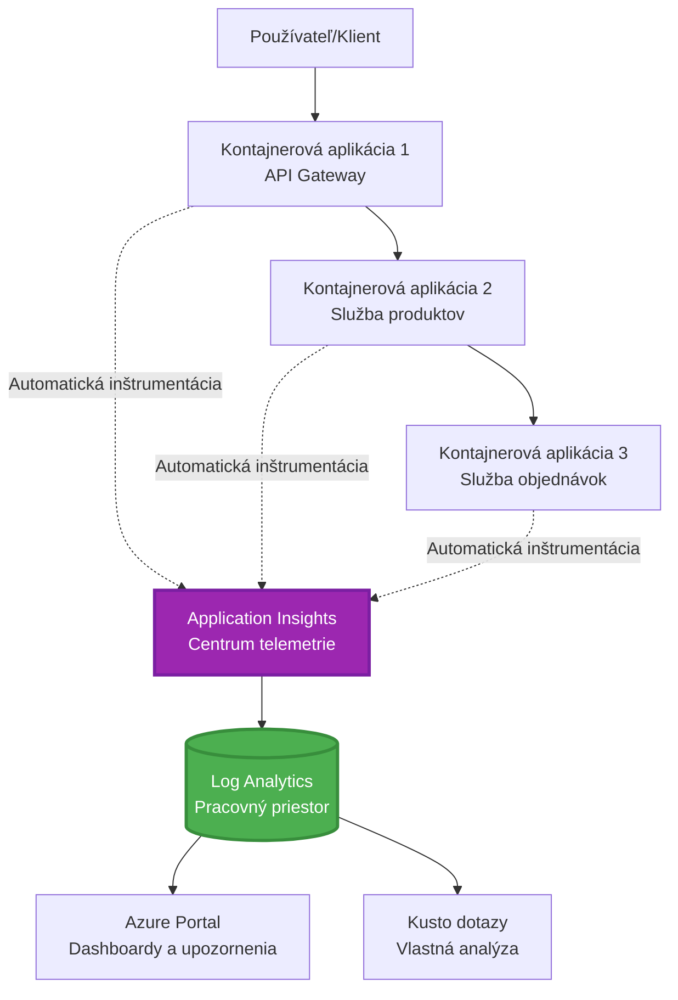
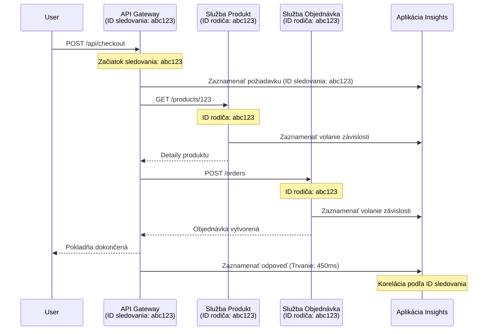

<!--
CO_OP_TRANSLATOR_METADATA:
{
  "original_hash": "e5aa37cdb6378c09099500ac31600b8c",
  "translation_date": "2025-11-23T13:00:54+00:00",
  "source_file": "docs/pre-deployment/application-insights.md",
  "language_code": "sk"
}
-->
# Integrácia Application Insights s AZD

⏱️ **Odhadovaný čas**: 40-50 minút | 💰 **Náklady**: ~5-15 USD/mesiac | ⭐ **Náročnosť**: Stredná

**📚 Vzdelávacia cesta:**
- ← Predchádzajúce: [Kontroly pred nasadením](preflight-checks.md) - Validácia pred nasadením
- 🎯 **Tu sa nachádzate**: Integrácia Application Insights (monitoring, telemetria, ladenie)
- → Ďalšie: [Príručka nasadenia](../deployment/deployment-guide.md) - Nasadenie do Azure
- 🏠 [Domov kurzu](../../README.md)

---

## Čo sa naučíte

Po dokončení tejto lekcie budete vedieť:
- Automaticky integrovať **Application Insights** do projektov AZD
- Konfigurovať **distribuované sledovanie** pre mikroslužby
- Implementovať **vlastnú telemetriu** (metriky, udalosti, závislosti)
- Nastaviť **živé metriky** pre monitorovanie v reálnom čase
- Vytvárať **upozornenia a dashboardy** z nasadení AZD
- Ladiť problémy v produkcii pomocou **telemetrických dotazov**
- Optimalizovať **náklady a stratégie vzorkovania**
- Monitorovať **AI/LLM aplikácie** (tokeny, latencia, náklady)

## Prečo je Application Insights s AZD dôležité

### Výzva: Pozorovateľnosť v produkcii

**Bez Application Insights:**
```
❌ No visibility into production behavior
❌ Manual log aggregation across services
❌ Reactive debugging (wait for customer complaints)
❌ No performance metrics
❌ Cannot trace requests across services
❌ Unknown failure rates and bottlenecks
```

**S Application Insights + AZD:**
```
✅ Automatic telemetry collection
✅ Centralized logs from all services
✅ Proactive issue detection
✅ End-to-end request tracing
✅ Performance metrics and insights
✅ Real-time dashboards
✅ AZD provisions everything automatically
```

**Analógia**: Application Insights je ako "čierna skrinka" a palubná doska pre vašu aplikáciu. Vidíte všetko, čo sa deje v reálnom čase, a môžete prehrávať akýkoľvek incident.

---

## Prehľad architektúry

### Application Insights v architektúre AZD


### Čo sa monitoruje automaticky

| Typ telemetrie | Čo zachytáva | Použitie |
|----------------|--------------|----------|
| **Požiadavky** | HTTP požiadavky, stavové kódy, trvanie | Monitorovanie výkonu API |
| **Závislosti** | Externé volania (DB, API, úložisko) | Identifikácia úzkych miest |
| **Výnimky** | Nezachytené chyby so stack trace | Ladenie zlyhaní |
| **Vlastné udalosti** | Obchodné udalosti (registrácia, nákup) | Analytika a lieviky |
| **Metriky** | Výkonové ukazovatele, vlastné metriky | Plánovanie kapacity |
| **Sledovanie** | Logy so závažnosťou | Ladenie a auditovanie |
| **Dostupnosť** | Testy dostupnosti a času odozvy | Monitorovanie SLA |

---

## Predpoklady

### Potrebné nástroje

```bash
# Overiť Azure Developer CLI
azd version
# ✅ Očakávané: azd verzia 1.0.0 alebo vyššia

# Overiť Azure CLI
az --version
# ✅ Očakávané: azure-cli 2.50.0 alebo vyššia
```

### Požiadavky na Azure

- Aktívne predplatné Azure
- Oprávnenia na vytvorenie:
  - Zdroje Application Insights
  - Pracoviská Log Analytics
  - Container Apps
  - Skupiny zdrojov

### Požadované znalosti

Mali by ste mať dokončené:
- [Základy AZD](../getting-started/azd-basics.md) - Základné koncepty AZD
- [Konfigurácia](../getting-started/configuration.md) - Nastavenie prostredia
- [Prvý projekt](../getting-started/first-project.md) - Základné nasadenie

---

## Lekcia 1: Automatické Application Insights s AZD

### Ako AZD vytvára Application Insights

AZD automaticky vytvára a konfiguruje Application Insights pri nasadení. Pozrime sa, ako to funguje.

### Štruktúra projektu

```
monitored-app/
├── azure.yaml                     # AZD configuration
├── infra/
│   ├── main.bicep                # Main infrastructure
│   ├── core/
│   │   └── monitoring.bicep      # Application Insights + Log Analytics
│   └── app/
│       └── api.bicep             # Container App with monitoring
└── src/
    ├── app.py                    # Application with telemetry
    ├── requirements.txt
    └── Dockerfile
```

---

### Krok 1: Konfigurácia AZD (azure.yaml)

**Súbor: `azure.yaml`**

```yaml
name: monitored-app
metadata:
  template: monitored-app@1.0.0

services:
  api:
    project: ./src
    language: python
    host: containerapp

# AZD automatically provisions monitoring!
```

**To je všetko!** AZD automaticky vytvorí Application Insights. Nie je potrebná žiadna ďalšia konfigurácia pre základné monitorovanie.

---

### Krok 2: Monitorovacia infraštruktúra (Bicep)

**Súbor: `infra/core/monitoring.bicep`**

```bicep
param logAnalyticsName string
param applicationInsightsName string
param location string = resourceGroup().location
param tags object = {}

// Log Analytics Workspace (required for Application Insights)
resource logAnalytics 'Microsoft.OperationalInsights/workspaces@2022-10-01' = {
  name: logAnalyticsName
  location: location
  tags: tags
  properties: {
    sku: {
      name: 'PerGB2018'  // Pay-as-you-go pricing
    }
    retentionInDays: 30  // Keep logs for 30 days
    features: {
      enableLogAccessUsingOnlyResourcePermissions: true
    }
  }
}

// Application Insights
resource applicationInsights 'Microsoft.Insights/components@2020-02-02' = {
  name: applicationInsightsName
  location: location
  tags: tags
  kind: 'web'
  properties: {
    Application_Type: 'web'
    WorkspaceResourceId: logAnalytics.id
    IngestionMode: 'LogAnalytics'
    publicNetworkAccessForIngestion: 'Enabled'
    publicNetworkAccessForQuery: 'Enabled'
  }
}

// Outputs for Container Apps
output logAnalyticsWorkspaceId string = logAnalytics.id
output logAnalyticsWorkspaceName string = logAnalytics.name
output applicationInsightsConnectionString string = applicationInsights.properties.ConnectionString
output applicationInsightsInstrumentationKey string = applicationInsights.properties.InstrumentationKey
output applicationInsightsName string = applicationInsights.name
```

---

### Krok 3: Pripojenie Container App k Application Insights

**Súbor: `infra/app/api.bicep`**

```bicep
param name string
param location string
param tags object = {}
param containerAppsEnvironmentName string
param applicationInsightsConnectionString string

resource containerApp 'Microsoft.App/containerApps@2023-05-01' = {
  name: name
  location: location
  tags: tags
  properties: {
    configuration: {
      ingress: {
        external: true
        targetPort: 8000
      }
      secrets: [
        {
          name: 'appinsights-connection-string'
          value: applicationInsightsConnectionString
        }
      ]
    }
    template: {
      containers: [
        {
          name: 'api'
          image: 'myregistry.azurecr.io/api:latest'
          resources: {
            cpu: json('0.5')
            memory: '1Gi'
          }
          env: [
            {
              name: 'APPLICATIONINSIGHTS_CONNECTION_STRING'
              secretRef: 'appinsights-connection-string'
            }
            {
              name: 'APPLICATIONINSIGHTS_ENABLED'
              value: 'true'
            }
          ]
        }
      ]
    }
  }
}

output uri string = 'https://${containerApp.properties.configuration.ingress.fqdn}'
```

---

### Krok 4: Aplikačný kód s telemetriou

**Súbor: `src/app.py`**

```python
from flask import Flask, request, jsonify
from opencensus.ext.azure.log_exporter import AzureLogHandler
from opencensus.ext.azure.trace_exporter import AzureExporter
from opencensus.ext.flask.flask_middleware import FlaskMiddleware
from opencensus.trace.samplers import ProbabilitySampler
import logging
import os

app = Flask(__name__)

# Získajte pripojovací reťazec Application Insights
connection_string = os.environ.get('APPLICATIONINSIGHTS_CONNECTION_STRING')

if connection_string:
    # Nakonfigurujte distribuované sledovanie
    middleware = FlaskMiddleware(
        app,
        exporter=AzureExporter(connection_string=connection_string),
        sampler=ProbabilitySampler(rate=1.0)  # 100% vzorkovanie pre vývoj
    )
    
    # Nakonfigurujte protokolovanie
    logger = logging.getLogger(__name__)
    logger.addHandler(AzureLogHandler(connection_string=connection_string))
    logger.setLevel(logging.INFO)
    
    print("✅ Application Insights enabled")
else:
    logger = logging.getLogger(__name__)
    logger.setLevel(logging.INFO)
    print("⚠️ Application Insights not configured")

@app.route('/health')
def health():
    logger.info('Health check endpoint called')
    return jsonify({'status': 'healthy', 'monitoring': 'enabled'})

@app.route('/api/products')
def get_products():
    logger.info('Fetching products')
    
    # Simulujte volanie databázy (automaticky sledované ako závislosť)
    products = [
        {'id': 1, 'name': 'Laptop', 'price': 999.99},
        {'id': 2, 'name': 'Mouse', 'price': 29.99},
        {'id': 3, 'name': 'Keyboard', 'price': 79.99}
    ]
    
    logger.info(f'Returned {len(products)} products')
    return jsonify(products)

@app.route('/api/error-test')
def error_test():
    """Test error tracking"""
    logger.error('Testing error tracking')
    try:
        raise ValueError('This is a test exception')
    except Exception as e:
        logger.exception('Exception occurred in error-test endpoint')
        return jsonify({'error': str(e)}), 500

@app.route('/api/slow')
def slow_endpoint():
    """Test performance tracking"""
    import time
    logger.info('Slow endpoint called')
    time.sleep(3)  # Simulujte pomalú operáciu
    logger.warning('Endpoint took 3 seconds to respond')
    return jsonify({'message': 'Slow operation completed'})

if __name__ == '__main__':
    app.run(host='0.0.0.0', port=8000)
```

**Súbor: `src/requirements.txt`**

```txt
Flask==3.0.0
opencensus-ext-azure==1.1.13
opencensus-ext-flask==0.8.1
gunicorn==21.2.0
```

---

### Krok 5: Nasadenie a overenie

```bash
# Inicializovať AZD
azd init

# Nasadiť (automaticky poskytuje Application Insights)
azd up

# Získať URL aplikácie
APP_URL=$(azd env get-values | grep API_URL | cut -d '=' -f2 | tr -d '"')

# Generovať telemetriu
curl $APP_URL/health
curl $APP_URL/api/products
curl $APP_URL/api/error-test
curl $APP_URL/api/slow
```

**✅ Očakávaný výstup:**
```json
{
  "status": "healthy",
  "monitoring": "enabled"
}
```

---

### Krok 6: Zobrazenie telemetrie v Azure Portal

```bash
# Získajte podrobnosti o Application Insights
azd env get-values | grep APPLICATIONINSIGHTS

# Otvorte v Azure Portáli
az monitor app-insights component show \
  --app $(azd env get-values | grep APPLICATIONINSIGHTS_NAME | cut -d '=' -f2 | tr -d '"') \
  --resource-group $(azd env get-values | grep AZURE_RESOURCE_GROUP | cut -d '=' -f2 | tr -d '"') \
  --query "appId" -o tsv
```

**Prejdite na Azure Portal → Application Insights → Vyhľadávanie transakcií**

Mali by ste vidieť:
- ✅ HTTP požiadavky so stavovými kódmi
- ✅ Trvanie požiadaviek (3+ sekundy pre `/api/slow`)
- ✅ Podrobnosti o výnimkách z `/api/error-test`
- ✅ Vlastné logy

---

## Lekcia 2: Vlastná telemetria a udalosti

### Sledovanie obchodných udalostí

Pridajme vlastnú telemetriu pre obchodne kritické udalosti.

**Súbor: `src/telemetry.py`**

```python
from opencensus.ext.azure import metrics_exporter
from opencensus.stats import aggregation as aggregation_module
from opencensus.stats import measure as measure_module
from opencensus.stats import stats as stats_module
from opencensus.stats import view as view_module
from opencensus.tags import tag_map as tag_map_module
from opencensus.ext.azure.log_exporter import AzureLogHandler
from opencensus.ext.azure.trace_exporter import AzureExporter
from opencensus.trace import tracer as tracer_module
import logging
import os

class TelemetryClient:
    """Custom telemetry client for Application Insights"""
    
    def __init__(self, connection_string=None):
        self.connection_string = connection_string or os.environ.get('APPLICATIONINSIGHTS_CONNECTION_STRING')
        
        if not self.connection_string:
            print("⚠️ Application Insights connection string not found")
            return
        
        # Nastavenie loggera
        self.logger = logging.getLogger(__name__)
        self.logger.addHandler(AzureLogHandler(connection_string=self.connection_string))
        self.logger.setLevel(logging.INFO)
        
        # Nastavenie exportéra metrik
        self.stats = stats_module.stats
        self.view_manager = self.stats.view_manager
        self.stats_recorder = self.stats.stats_recorder
        
        exporter = metrics_exporter.new_metrics_exporter(
            connection_string=self.connection_string
        )
        self.view_manager.register_exporter(exporter)
        
        # Nastavenie trasovača
        self.tracer = tracer_module.Tracer(
            exporter=AzureExporter(connection_string=self.connection_string)
        )
        
        print("✅ Custom telemetry client initialized")
    
    def track_event(self, event_name: str, properties: dict = None):
        """Track custom business event"""
        properties = properties or {}
        self.logger.info(
            f"CustomEvent: {event_name}",
            extra={
                'custom_dimensions': {
                    'event_name': event_name,
                    **properties
                }
            }
        )
    
    def track_metric(self, metric_name: str, value: float, properties: dict = None):
        """Track custom metric"""
        properties = properties or {}
        self.logger.info(
            f"CustomMetric: {metric_name} = {value}",
            extra={
                'custom_dimensions': {
                    'metric_name': metric_name,
                    'value': value,
                    **properties
                }
            }
        )
    
    def track_dependency(self, name: str, dependency_type: str, duration: float, success: bool):
        """Track external dependency call"""
        with self.tracer.span(name=name) as span:
            span.add_attribute('dependency.type', dependency_type)
            span.add_attribute('duration', duration)
            span.add_attribute('success', success)

# Globálny klient telemetrie
telemetry = TelemetryClient()
```

### Aktualizácia aplikácie s vlastnými udalosťami

**Súbor: `src/app.py` (rozšírený)**

```python
from flask import Flask, request, jsonify
from telemetry import telemetry
import time
import random

app = Flask(__name__)

@app.route('/api/purchase', methods=['POST'])
def purchase():
    """Track purchase event with custom telemetry"""
    data = request.json
    product_id = data.get('product_id')
    quantity = data.get('quantity', 1)
    price = data.get('price', 0)
    
    # Sledovať obchodnú udalosť
    telemetry.track_event('Purchase', {
        'product_id': product_id,
        'quantity': quantity,
        'total_amount': price * quantity,
        'user_id': request.headers.get('X-User-Id', 'anonymous')
    })
    
    # Sledovať metriku príjmov
    telemetry.track_metric('Revenue', price * quantity, {
        'product_id': product_id,
        'currency': 'USD'
    })
    
    return jsonify({
        'order_id': f'ORD-{random.randint(1000, 9999)}',
        'status': 'confirmed',
        'total': price * quantity
    })

@app.route('/api/search')
def search():
    """Track search queries"""
    query = request.args.get('q', '')
    
    start_time = time.time()
    
    # Simulovať vyhľadávanie (bolo by to skutočné dotazovanie na databázu)
    results = [{'id': 1, 'name': f'Result for {query}'}]
    
    duration = (time.time() - start_time) * 1000  # Konvertovať na ms
    
    # Sledovať udalosť vyhľadávania
    telemetry.track_event('Search', {
        'query': query,
        'results_count': len(results),
        'duration_ms': duration
    })
    
    # Sledovať metriku výkonu vyhľadávania
    telemetry.track_metric('SearchDuration', duration, {
        'query_length': len(query)
    })
    
    return jsonify({'results': results, 'count': len(results)})

@app.route('/api/external-call')
def external_call():
    """Track external API dependency"""
    import requests
    
    start_time = time.time()
    success = True
    
    try:
        # Simulovať externé volanie API
        response = requests.get('https://api.example.com/data', timeout=5)
        result = response.json()
    except Exception as e:
        success = False
        result = {'error': str(e)}
    
    duration = (time.time() - start_time) * 1000
    
    # Sledovať závislosť
    telemetry.track_dependency(
        name='ExternalAPI',
        dependency_type='HTTP',
        duration=duration,
        success=success
    )
    
    return jsonify(result)

if __name__ == '__main__':
    app.run(host='0.0.0.0', port=8000)
```

### Testovanie vlastnej telemetrie

```bash
# Sledovať udalosť nákupu
curl -X POST $APP_URL/api/purchase \
  -H "Content-Type: application/json" \
  -H "X-User-Id: user123" \
  -d '{"product_id": 1, "quantity": 2, "price": 29.99}'

# Sledovať udalosť vyhľadávania
curl "$APP_URL/api/search?q=laptop"

# Sledovať externú závislosť
curl $APP_URL/api/external-call
```

**Zobrazenie v Azure Portal:**

Prejdite na Application Insights → Logy a spustite:

```kusto
// View purchase events
traces
| where customDimensions.event_name == "Purchase"
| project 
    timestamp,
    product_id = tostring(customDimensions.product_id),
    total_amount = todouble(customDimensions.total_amount),
    user_id = tostring(customDimensions.user_id)
| order by timestamp desc

// View revenue metrics
traces
| where customDimensions.metric_name == "Revenue"
| summarize TotalRevenue = sum(todouble(customDimensions.value)) by bin(timestamp, 1h)
| render timechart

// View search performance
traces
| where customDimensions.event_name == "Search"
| summarize 
    AvgDuration = avg(todouble(customDimensions.duration_ms)),
    SearchCount = count()
  by bin(timestamp, 5m)
| render timechart
```

---

## Lekcia 3: Distribuované sledovanie pre mikroslužby

### Aktivácia sledovania medzi službami

Pre mikroslužby Application Insights automaticky koreluje požiadavky medzi službami.

**Súbor: `infra/main.bicep`**

```bicep
targetScope = 'subscription'

param environmentName string
param location string = 'eastus'

var tags = { 'azd-env-name': environmentName }

resource rg 'Microsoft.Resources/resourceGroups@2021-04-01' = {
  name: 'rg-${environmentName}'
  location: location
  tags: tags
}

// Monitoring (shared by all services)
module monitoring './core/monitoring.bicep' = {
  name: 'monitoring'
  scope: rg
  params: {
    logAnalyticsName: 'log-${environmentName}'
    applicationInsightsName: 'appi-${environmentName}'
    location: location
    tags: tags
  }
}

// API Gateway
module apiGateway './app/api-gateway.bicep' = {
  name: 'api-gateway'
  scope: rg
  params: {
    name: 'ca-gateway-${environmentName}'
    location: location
    tags: union(tags, { 'azd-service-name': 'gateway' })
    applicationInsightsConnectionString: monitoring.outputs.applicationInsightsConnectionString
  }
}

// Product Service
module productService './app/product-service.bicep' = {
  name: 'product-service'
  scope: rg
  params: {
    name: 'ca-products-${environmentName}'
    location: location
    tags: union(tags, { 'azd-service-name': 'products' })
    applicationInsightsConnectionString: monitoring.outputs.applicationInsightsConnectionString
  }
}

// Order Service
module orderService './app/order-service.bicep' = {
  name: 'order-service'
  scope: rg
  params: {
    name: 'ca-orders-${environmentName}'
    location: location
    tags: union(tags, { 'azd-service-name': 'orders' })
    applicationInsightsConnectionString: monitoring.outputs.applicationInsightsConnectionString
  }
}

output APPLICATIONINSIGHTS_CONNECTION_STRING string = monitoring.outputs.applicationInsightsConnectionString
output GATEWAY_URL string = apiGateway.outputs.uri
```

### Zobrazenie transakcie od začiatku do konca


**Dotaz na sledovanie od začiatku do konca:**

```kusto
// Find complete request flow
let traceId = "abc123...";  // Get from response header
dependencies
| union requests
| where operation_Id == traceId
| project 
    timestamp,
    type = itemType,
    name,
    duration,
    success,
    cloud_RoleName
| order by timestamp asc
```

---

## Lekcia 4: Živé metriky a monitorovanie v reálnom čase

### Aktivácia streamu živých metrík

Živé metriky poskytujú telemetriu v reálnom čase s latenciou <1 sekundy.

**Prístup k živým metrikám:**

```bash
# Získať zdroj Application Insights
APPI_NAME=$(azd env get-values | grep APPLICATIONINSIGHTS_NAME | cut -d '=' -f2 | tr -d '"')

# Získať skupinu zdrojov
RG_NAME=$(azd env get-values | grep AZURE_RESOURCE_GROUP | cut -d '=' -f2 | tr -d '"')

echo "Navigate to: Azure Portal → Resource Groups → $RG_NAME → $APPI_NAME → Live Metrics"
```

**Čo vidíte v reálnom čase:**
- ✅ Prichádzajúca miera požiadaviek (požiadavky/sekunda)
- ✅ Odchádzajúce volania závislostí
- ✅ Počet výnimiek
- ✅ Využitie CPU a pamäte
- ✅ Počet aktívnych serverov
- ✅ Ukážková telemetria

### Generovanie záťaže na testovanie

```bash
# Generujte záťaž na zobrazenie živých metrík
for i in {1..100}; do
  curl $APP_URL/api/products &
  curl $APP_URL/api/search?q=test$i &
done

# Sledujte živé metriky v Azure Portáli
# Mali by ste vidieť nárast miery požiadaviek
```

---

## Praktické cvičenia

### Cvičenie 1: Nastavenie upozornení ⭐⭐ (Stredné)

**Cieľ**: Vytvoriť upozornenia na vysoké miery chýb a pomalé odpovede.

**Kroky:**

1. **Vytvorte upozornenie na mieru chýb:**

```bash
# Získajte ID zdroja Application Insights
APPI_ID=$(az monitor app-insights component show \
  --app $APPI_NAME \
  --resource-group $RG_NAME \
  --query "id" -o tsv)

# Vytvorte metrické upozornenie pre neúspešné požiadavky
az monitor metrics alert create \
  --name "High-Error-Rate" \
  --resource-group $RG_NAME \
  --scopes $APPI_ID \
  --condition "count requests/failed > 10" \
  --window-size 5m \
  --evaluation-frequency 1m \
  --description "Alert when error rate exceeds 10 per 5 minutes"
```

2. **Vytvorte upozornenie na pomalé odpovede:**

```bash
az monitor metrics alert create \
  --name "Slow-Responses" \
  --resource-group $RG_NAME \
  --scopes $APPI_ID \
  --condition "avg requests/duration > 3000" \
  --window-size 5m \
  --evaluation-frequency 1m \
  --description "Alert when average response time exceeds 3 seconds"
```

3. **Vytvorte upozornenie cez Bicep (preferované pre AZD):**

**Súbor: `infra/core/alerts.bicep`**

```bicep
param applicationInsightsId string
param actionGroupId string = ''
param location string = resourceGroup().location

// High error rate alert
resource errorRateAlert 'Microsoft.Insights/metricAlerts@2018-03-01' = {
  name: 'high-error-rate'
  location: 'global'
  properties: {
    description: 'Alert when error rate exceeds threshold'
    severity: 2
    enabled: true
    scopes: [
      applicationInsightsId
    ]
    evaluationFrequency: 'PT1M'
    windowSize: 'PT5M'
    criteria: {
      'odata.type': 'Microsoft.Azure.Monitor.SingleResourceMultipleMetricCriteria'
      allOf: [
        {
          name: 'Error rate'
          metricName: 'requests/failed'
          operator: 'GreaterThan'
          threshold: 10
          timeAggregation: 'Count'
        }
      ]
    }
    actions: actionGroupId != '' ? [
      {
        actionGroupId: actionGroupId
      }
    ] : []
  }
}

// Slow response alert
resource slowResponseAlert 'Microsoft.Insights/metricAlerts@2018-03-01' = {
  name: 'slow-responses'
  location: 'global'
  properties: {
    description: 'Alert when response time is too high'
    severity: 3
    enabled: true
    scopes: [
      applicationInsightsId
    ]
    evaluationFrequency: 'PT1M'
    windowSize: 'PT5M'
    criteria: {
      'odata.type': 'Microsoft.Azure.Monitor.SingleResourceMultipleMetricCriteria'
      allOf: [
        {
          name: 'Response duration'
          metricName: 'requests/duration'
          operator: 'GreaterThan'
          threshold: 3000
          timeAggregation: 'Average'
        }
      ]
    }
  }
}

output errorAlertId string = errorRateAlert.id
output slowResponseAlertId string = slowResponseAlert.id
```

4. **Testujte upozornenia:**

```bash
# Generovať chyby
for i in {1..20}; do
  curl $APP_URL/api/error-test
done

# Generovať pomalé odpovede
for i in {1..10}; do
  curl $APP_URL/api/slow
done

# Skontrolovať stav upozornenia (počkaj 5-10 minút)
az monitor metrics alert list \
  --resource-group $RG_NAME \
  --query "[].{Name:name, Enabled:enabled, State:properties.enabled}" \
  --output table
```

**✅ Kritériá úspechu:**
- ✅ Upozornenia úspešne vytvorené
- ✅ Upozornenia sa spustia pri prekročení prahov
- ✅ Možnosť zobraziť históriu upozornení v Azure Portal
- ✅ Integrované s nasadením AZD

**Čas**: 20-25 minút

---

### Cvičenie 2: Vytvorenie vlastného dashboardu ⭐⭐ (Stredné)

**Cieľ**: Vytvoriť dashboard zobrazujúci kľúčové metriky aplikácie.

**Kroky:**

1. **Vytvorte dashboard cez Azure Portal:**

Prejdite na: Azure Portal → Dashboards → Nový dashboard

2. **Pridajte dlaždice pre kľúčové metriky:**

- Počet požiadaviek (posledných 24 hodín)
- Priemerný čas odozvy
- Miera chýb
- Top 5 najpomalších operácií
- Geografické rozloženie používateľov

3. **Vytvorte dashboard cez Bicep:**

**Súbor: `infra/core/dashboard.bicep`**

```bicep
param dashboardName string
param applicationInsightsId string
param location string = resourceGroup().location

resource dashboard 'Microsoft.Portal/dashboards@2020-09-01-preview' = {
  name: dashboardName
  location: location
  properties: {
    lenses: [
      {
        order: 0
        parts: [
          // Request count
          {
            position: { x: 0, y: 0, rowSpan: 4, colSpan: 6 }
            metadata: {
              type: 'Extension/Microsoft_OperationsManagementSuite_Workspace/PartType/LogsDashboardPart'
              inputs: [
                {
                  name: 'resourceId'
                  value: applicationInsightsId
                }
                {
                  name: 'query'
                  value: '''
                    requests
                    | summarize RequestCount = count() by bin(timestamp, 1h)
                    | render timechart
                  '''
                }
              ]
            }
          }
          // Error rate
          {
            position: { x: 6, y: 0, rowSpan: 4, colSpan: 6 }
            metadata: {
              type: 'Extension/Microsoft_OperationsManagementSuite_Workspace/PartType/LogsDashboardPart'
              inputs: [
                {
                  name: 'resourceId'
                  value: applicationInsightsId
                }
                {
                  name: 'query'
                  value: '''
                    requests
                    | summarize 
                        Total = count(),
                        Failed = countif(success == false)
                    | extend ErrorRate = (Failed * 100.0) / Total
                    | project ErrorRate
                  '''
                }
              ]
            }
          }
        ]
      }
    ]
  }
}

output dashboardId string = dashboard.id
```

4. **Nasadenie dashboardu:**

```bash
# Pridať do main.bicep
module dashboard './core/dashboard.bicep' = {
  name: 'dashboard'
  scope: rg
  params: {
    dashboardName: 'dashboard-${environmentName}'
    applicationInsightsId: monitoring.outputs.applicationInsightsId
    location: location
  }
}

# Nasadiť
azd up
```

**✅ Kritériá úspechu:**
- ✅ Dashboard zobrazuje kľúčové metriky
- ✅ Možnosť pripnúť na domovskú stránku Azure Portal
- ✅ Aktualizácie v reálnom čase
- ✅ Nasaditeľné cez AZD

**Čas**: 25-30 minút

---

### Cvičenie 3: Monitorovanie AI/LLM aplikácie ⭐⭐⭐ (Pokročilé)

**Cieľ**: Sledovať používanie Azure OpenAI (tokeny, náklady, latencia).

**Kroky:**

1. **Vytvorte wrapper na monitorovanie AI:**

**Súbor: `src/ai_telemetry.py`**

```python
from telemetry import telemetry
from openai import AzureOpenAI
import time

class MonitoredAzureOpenAI:
    """Azure OpenAI client with automatic telemetry"""
    
    def __init__(self, api_key, endpoint, api_version="2024-02-01"):
        self.client = AzureOpenAI(
            api_key=api_key,
            api_version=api_version,
            azure_endpoint=endpoint
        )
    
    def chat_completion(self, model: str, messages: list, **kwargs):
        """Track chat completion with telemetry"""
        start_time = time.time()
        
        try:
            # Zavolať Azure OpenAI
            response = self.client.chat.completions.create(
                model=model,
                messages=messages,
                **kwargs
            )
            
            duration = (time.time() - start_time) * 1000  # ms
            
            # Extrahovať použitie
            usage = response.usage
            prompt_tokens = usage.prompt_tokens
            completion_tokens = usage.completion_tokens
            total_tokens = usage.total_tokens
            
            # Vypočítať náklady (ceny GPT-4)
            prompt_cost = (prompt_tokens / 1000) * 0.03  # $0.03 za 1K tokenov
            completion_cost = (completion_tokens / 1000) * 0.06  # $0.06 za 1K tokenov
            total_cost = prompt_cost + completion_cost
            
            # Sledovať vlastnú udalosť
            telemetry.track_event('OpenAI_Request', {
                'model': model,
                'prompt_tokens': prompt_tokens,
                'completion_tokens': completion_tokens,
                'total_tokens': total_tokens,
                'duration_ms': duration,
                'cost_usd': total_cost,
                'success': True
            })
            
            # Sledovať metriky
            telemetry.track_metric('OpenAI_Tokens', total_tokens, {
                'model': model,
                'type': 'total'
            })
            
            telemetry.track_metric('OpenAI_Cost', total_cost, {
                'model': model,
                'currency': 'USD'
            })
            
            telemetry.track_metric('OpenAI_Duration', duration, {
                'model': model
            })
            
            return response
            
        except Exception as e:
            duration = (time.time() - start_time) * 1000
            
            telemetry.track_event('OpenAI_Request', {
                'model': model,
                'duration_ms': duration,
                'success': False,
                'error': str(e)
            })
            
            raise
```

2. **Použite monitorovaného klienta:**

```python
from flask import Flask, request, jsonify
from ai_telemetry import MonitoredAzureOpenAI
import os

app = Flask(__name__)

# Inicializovať monitorovaného klienta OpenAI
openai_client = MonitoredAzureOpenAI(
    api_key=os.environ['AZURE_OPENAI_API_KEY'],
    endpoint=os.environ['AZURE_OPENAI_ENDPOINT']
)

@app.route('/api/chat', methods=['POST'])
def chat():
    data = request.json
    user_message = data.get('message')
    
    # Volanie s automatickým monitorovaním
    response = openai_client.chat_completion(
        model='gpt-4',
        messages=[
            {'role': 'user', 'content': user_message}
        ]
    )
    
    return jsonify({
        'response': response.choices[0].message.content,
        'tokens': response.usage.total_tokens
    })
```

3. **Dotaz na AI metriky:**

```kusto
// Total AI spend over time
traces
| where customDimensions.event_name == "OpenAI_Request"
| where customDimensions.success == "True"
| summarize TotalCost = sum(todouble(customDimensions.cost_usd)) by bin(timestamp, 1h)
| render timechart

// Token usage by model
traces
| where customDimensions.event_name == "OpenAI_Request"
| summarize 
    TotalTokens = sum(toint(customDimensions.total_tokens)),
    RequestCount = count()
  by Model = tostring(customDimensions.model)

// Average latency
traces
| where customDimensions.event_name == "OpenAI_Request"
| summarize AvgDuration = avg(todouble(customDimensions.duration_ms))
| project AvgDurationSeconds = AvgDuration / 1000

// Cost per request
traces
| where customDimensions.event_name == "OpenAI_Request"
| extend Cost = todouble(customDimensions.cost_usd)
| summarize 
    TotalCost = sum(Cost),
    RequestCount = count(),
    AvgCostPerRequest = avg(Cost)
```

**✅ Kritériá úspechu:**
- ✅ Každé volanie OpenAI automaticky sledované
- ✅ Viditeľné používanie tokenov a náklady
- ✅ Monitorovaná latencia
- ✅ Možnosť nastaviť upozornenia na rozpočet

**Čas**: 35-45 minút

---

## Optimalizácia nákladov

### Stratégie vzorkovania

Kontrolujte náklady vzorkovaním telemetrie:

```python
from opencensus.trace.samplers import ProbabilitySampler

# Vývoj: 100% vzorkovanie
sampler = ProbabilitySampler(rate=1.0)

# Produkcia: 10% vzorkovanie (znížiť náklady o 90%)
sampler = ProbabilitySampler(rate=0.1)

# Adaptívne vzorkovanie (automaticky sa prispôsobuje)
from opencensus.trace.samplers import AdaptiveSampler
sampler = AdaptiveSampler()
```

**V Bicep:**

```bicep
resource applicationInsights 'Microsoft.Insights/components@2020-02-02' = {
  name: applicationInsightsName
  properties: {
    SamplingPercentage: 10  // 10% sampling
  }
}
```

### Uchovávanie dát

```bicep
resource logAnalytics 'Microsoft.OperationalInsights/workspaces@2022-10-01' = {
  name: logAnalyticsName
  properties: {
    retentionInDays: 30  // Minimum (cheapest)
    // Options: 30, 31, 60, 90, 120, 180, 270, 365, 550, 730
  }
}
```

### Mesačné odhady nákladov

| Objem dát | Uchovávanie | Mesačné náklady |
|-----------|-------------|-----------------|
| 1 GB/mesiac | 30 dní | ~2-5 USD |
| 5 GB/mesiac | 30 dní | ~10-15 USD |
| 10 GB/mesiac | 90 dní | ~25-40 USD |
| 50 GB/mesiac | 90 dní | ~100-150 USD |

**Bezplatná úroveň**: 5 GB/mesiac zahrnuté

---

## Kontrolný bod znalostí

### 1. Základná integrácia ✓

Otestujte svoje znalosti:

- [ ] **Otázka 1**: Ako AZD vytvára Application Insights?
  - **Odpoveď**: Automaticky cez Bicep šablóny v `infra/core/monitoring.bicep`

- [ ] **Otázka 2**: Aká premenná prostredia aktivuje Application Insights?
  - **Odpoveď**: `APPLICATIONINSIGHTS_CONNECTION_STRING`

- [ ] **Otázka 3**: Aké sú tri hlavné typy telemetrie?
  - **Odpoveď**: Požiadavky (HTTP volania), Závislosti (externé volania), Výnimky (chyby)

**Praktické overenie:**
```bash
# Skontrolujte, či je Application Insights nakonfigurovaný
azd env get-values | grep APPLICATIONINSIGHTS

# Overte, či telemetria funguje
az monitor app-insights metrics show \
  --app $APPI_NAME \
  --resource-group $RG_NAME \
  --metric "requests/count"
```

---

### 2. Vlastná telemetria ✓

Otestujte svoje znalosti:

- [ ] **Otázka 1**: Ako sledovať vlastné obchodné udalosti?
  - **Odpoveď**: Použite logger s `custom_dimensions` alebo `TelemetryClient.track_event()`

- [ ] **Otázka 2**: Aký je rozdiel medzi udalosťami a metrikami?
  - **Odpoveď**: Udalosti sú diskrétne výskyty, metriky sú číselné merania

- [ ] **Otázka 3**: Ako korelovať telemetriu medzi službami?
  - **Odpoveď**: Application Insights automaticky používa `operation_Id` na koreláciu

**Praktické overenie:**
```kusto
// Verify custom events
traces
| where customDimensions.event_name != ""
| summarize count() by tostring(customDimensions.event_name)
```

---

### 3. Monitorovanie produkcie ✓

Otestujte svoje znalosti:

- [ ] **Otázka 1**: Čo je vzorkovanie a prečo ho používať?
  - **Odpoveď**: Vzorkovanie znižuje objem dát (a náklady) zachytávaním len percenta telemetrie

- [ ] **Otázka 2**: Ako nastaviť upozornenia?
  - **Odpoveď**: Použite metrické upozornenia v Bicep alebo Azure Portal na základe metrík Application Insights

- [ ] **Otázka 3**: Aký je rozdiel medzi Log Analytics a Application Insights?
  - **Odpoveď**: Application Insights ukladá dáta v Log Analytics pracovisku; App Insights poskytuje aplikáciou špecifické pohľady

**Praktické overenie:**
```bash
# Skontrolujte konfiguráciu vzorkovania
az monitor app-insights component show \
  --app $APPI_NAME \
  --resource-group $RG_NAME \
  --query "properties.SamplingPercentage"
```

---

## Najlepšie postupy

### ✅ ROBTE:

1. **Používajte korelačné ID**
   ```python
   logger.info('Processing order', extra={
       'custom_dimensions': {
           'order_id': order_id,
           'user_id': user_id
       }
   })
   ```

2. **Nastavte upozornenia na kritické metriky**
   ```bicep
   // Error rate, slow responses, availability
   ```

3. **Používajte štruktúrované logovanie**
   ```python
   # ✅ DOBRÉ: Štruktúrované
   logger.info('User signup', extra={'custom_dimensions': {'user_id': 123}})
   
   # ❌ ZLÉ: Neštruktúrované
   logger.info(f'User 123 signed up')
   ```

4. **Monitorujte závislosti**
   ```python
   # Automaticky sledovať volania databázy, HTTP požiadavky, atď.
   ```

5. **Používajte živé metriky počas nasadení**

### ❌ NEROBTE:

1. **Nezaznamenávajte citlivé údaje**
   ```python
   # ❌ ZLÉ
   logger.info(f'Login: {username}:{password}')
   
   # ✅ DOBRÉ
   logger.info('Login attempt', extra={'custom_dimensions': {'username': username}})
   ```

2. **Nepoužívajte 100% vzorkovanie v produkcii**
   ```python
   # ❌ Drahé
   sampler = ProbabilitySampler(rate=1.0)
   
   # ✅ Nákladovo efektívne
   sampler = ProbabilitySampler(rate=0.1)
   ```

3. **Neignorujte fronty neúspešných správ**

4. **Nezabudnite nastaviť limity uchovávania dát**

---

## Riešenie problémov

### Problém: Žiadna telemetria sa nezobrazuje

**Diagnóza:**
```bash
# Skontrolujte, či je nastavený reťazec pripojenia
azd env get-values | grep APPLICATIONINSIGHTS

# Skontrolujte denníky aplikácie
azd logs api --tail 50
```

**Riešenie:**
```bash
# Overte reťazec pripojenia v aplikácii kontajnera
az containerapp show \
  --name $APP_NAME \
  --resource-group $RG_NAME \
  --query "properties.template.containers[0].env" \
  | grep -i applicationinsights
```

---

### Problém: Vysoké náklady

**Diagnóza:**
```bash
# Skontrolujte príjem údajov
az monitor app-insights metrics show \
  --app $APPI_NAME \
  --resource-group $RG_NAME \
  --metric "availabilityResults/count"
```

**Riešenie:**
- Znížte mieru vzorkovania
- Skráťte obdobie uchovávania
- Odstráňte podrobné logovanie

---

## Viac informácií

### Oficiálna dokumentácia
- [Prehľad Application Insights](https://learn.microsoft.com/azure/azure-monitor/app/app-insights-overview)
- [Application Insights pre Python](https://learn.microsoft.com/azure/azure-monitor/app/opencensus-python)
- [Kusto Query Language](https://learn.microsoft.com/azure/data-explorer/kusto/query/)
- [Monitorovanie AZD](https://learn.microsoft.com/azure/developer/azure-developer-cli/monitor-your-app)

### Ďalšie kroky v tomto kurze
- ← Predchádzajúce: [Kontroly pred nasadením](preflight-checks.md)
- → Ďalšie: [Príručka nasadenia](../deployment/deployment-guide.md)
- 🏠 [Domov kurzu](../../README.md)

### Súvisiace príklady
- [Príklad Azure OpenAI](../../../../examples/azure-openai-chat) - Telemetria AI
- [Príklad mikroslužieb](../../../../examples/microservices) - Distribuované sledovanie

---

## Zhrnutie

**Naučili ste sa:**
- ✅ Automatické vytváranie Application Insights s AZD
- ✅ Vlastná telemetria (udalosti, metriky, závislosti)
- ✅ Distribuované sledovanie medzi mikroslužbami
- ✅ Živé metriky a monitorovanie v reálnom čase
- ✅ Upozornenia a dashboardy
- ✅ Monitorovanie aplikácií AI/LLM
- ✅ Stratégie optimalizácie nákladov

**Hlavné poznatky:**
1. **AZD automaticky nastavuje monitorovanie** - Žiadne manuálne nastavenie
2. **Používajte štruktúrované logovanie** - Uľahčuje dotazovanie
3. **Sledujte obchodné udalosti** - Nielen technické metriky
4. **Monitorujte náklady na AI** - Sledujte tokeny a výdavky
5. **Nastavte upozornenia** - Buďte proaktívni, nie reaktívni
6. **Optimalizujte náklady** - Používajte vzorkovanie a limity uchovávania

**Ďalšie kroky:**
1. Dokončite praktické cvičenia
2. Pridajte Application Insights do svojich AZD projektov
3. Vytvorte vlastné dashboardy pre váš tím
4. Naučte sa [Príručku nasadenia](../deployment/deployment-guide.md)

---

<!-- CO-OP TRANSLATOR DISCLAIMER START -->
**Zrieknutie sa zodpovednosti**:  
Tento dokument bol preložený pomocou služby AI prekladu [Co-op Translator](https://github.com/Azure/co-op-translator). Hoci sa snažíme o presnosť, prosím, berte na vedomie, že automatizované preklady môžu obsahovať chyby alebo nepresnosti. Pôvodný dokument v jeho rodnom jazyku by mal byť považovaný za autoritatívny zdroj. Pre kritické informácie sa odporúča profesionálny ľudský preklad. Nenesieme zodpovednosť za akékoľvek nedorozumenia alebo nesprávne interpretácie vyplývajúce z použitia tohto prekladu.
<!-- CO-OP TRANSLATOR DISCLAIMER END -->