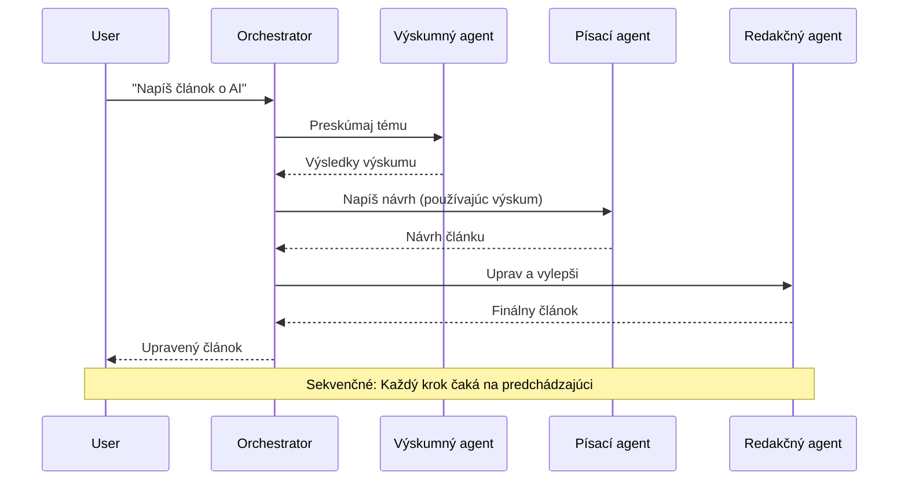
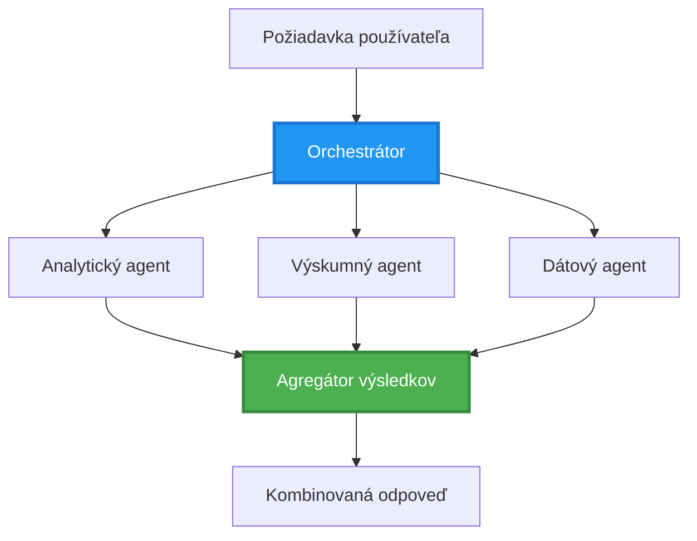
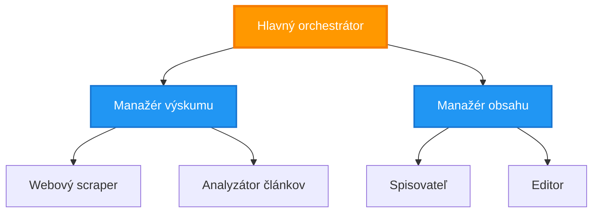
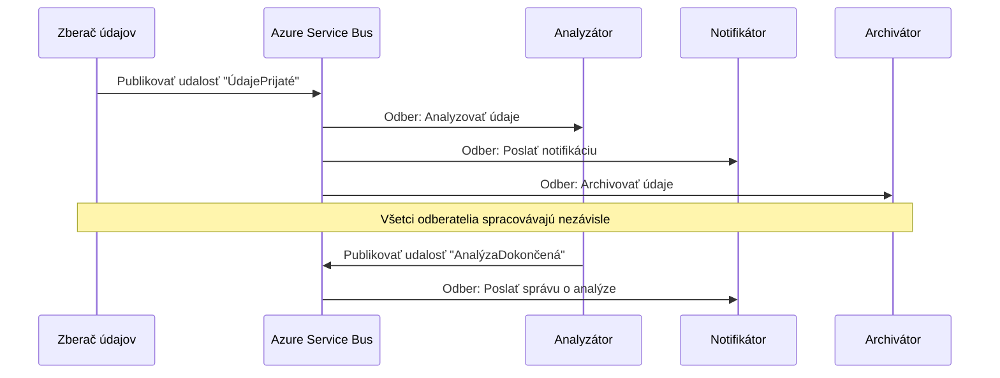
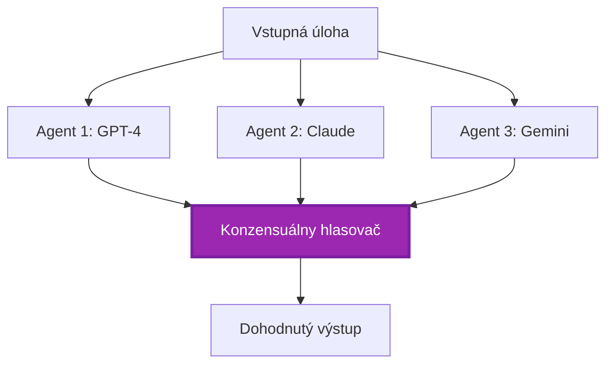
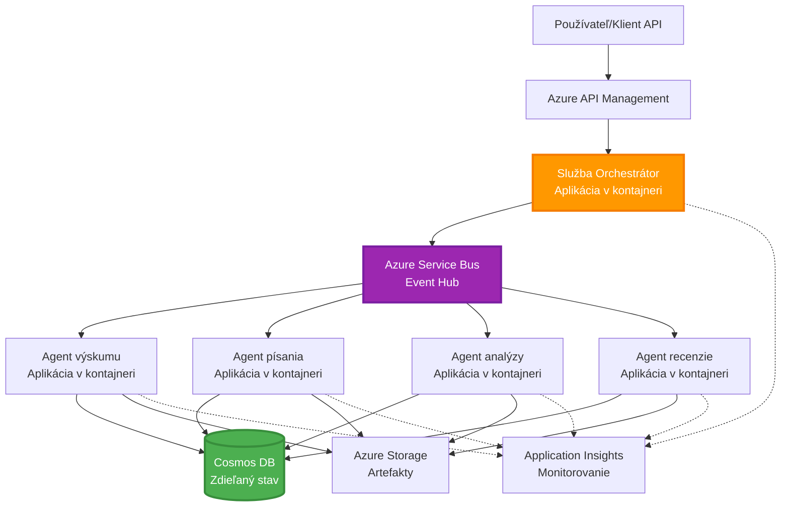

# Vzory koordinácie viacerých agentov

⏱️ **Odhadovaný čas**: 60-75 minút | 💰 **Odhadované náklady**: ~$100-300/mesiac | ⭐ **Zložitosť**: Pokročilá

**📚 Učebná cesta:**
- ← Predchádzajúce: [Plánovanie kapacít](capacity-planning.md) - Stratégie dimenzovania a škálovania zdrojov
- 🎯 **Tu sa nachádzate**: Vzory koordinácie viacerých agentov (Orchestrácia, komunikácia, správa stavu)
- → Ďalej: [Výber SKU](sku-selection.md) - Výber správnych služieb Azure
- 🏠 [Domov kurzu](../../README.md)

---

## Čo sa naučíte

Po absolvovaní tejto lekcie budete:
- Rozumieť vzorom **architektúry viacerých agentov** a vedieť, kedy ich použiť
- Implementovať **orchestračné vzory** (centralizované, decentralizované, hierarchické)
- Navrhovať stratégie **komunikácie agentov** (synchronné, asynchronné, založené na udalostiach)
- Spravovať **zdieľaný stav** medzi distribuovanými agentmi
- Nasadzovať **systémy viacerých agentov** na Azure pomocou AZD
- Aplikovať **koordinačné vzory** na reálne scenáre AI
- Monitorovať a odstraňovať chyby v systémoch distribuovaných agentov

## Prečo je koordinácia viacerých agentov dôležitá

### Vývoj: Od jedného agenta k viacerým agentom

**Jeden agent (jednoduchý):**
```
User → Agent → Response
```
- ✅ Jednoduché na pochopenie a implementáciu
- ✅ Rýchle pre jednoduché úlohy
- ❌ Obmedzené schopnosťami jedného modelu
- ❌ Nemožnosť paralelizácie zložitých úloh
- ❌ Žiadna špecializácia

**Systém viacerých agentov (pokročilý):**
```
           ┌─────────────┐
           │ Orchestrator│
           └──────┬──────┘
        ┌─────────┼─────────┐
        │         │         │
    ┌───▼──┐  ┌──▼───┐  ┌──▼────┐
    │Agent1│  │Agent2│  │Agent3 │
    │(Plan)│  │(Code)│  │(Review)│
    └──────┘  └──────┘  └───────┘
```
- ✅ Špecializovaní agenti na konkrétne úlohy
- ✅ Paralelné vykonávanie pre rýchlosť
- ✅ Modulárne a udržiavateľné
- ✅ Lepšie pri zložitých pracovných postupoch
- ⚠️ Vyžaduje logiku koordinácie

**Analógia**: Jeden agent je ako jedna osoba, ktorá vykonáva všetky úlohy. Systém viacerých agentov je ako tím, kde každý člen má špecializované zručnosti (výskumník, programátor, recenzent, autor) a pracuje spoločne.

---

## Základné vzory koordinácie

### Vzor 1: Sekvenčná koordinácia (Reťaz zodpovednosti)

**Kedy použiť**: Úlohy musia byť dokončené v konkrétnom poradí, každý agent stavia na výstupe predchádzajúceho.


**Výhody:**
- ✅ Jasný tok dát
- ✅ Jednoduché na ladenie
- ✅ Predvídateľné poradie vykonávania

**Obmedzenia:**
- ❌ Pomalšie (žiadna paralelizácia)
- ❌ Jedno zlyhanie blokuje celý reťazec
- ❌ Nemožnosť spracovať vzájomne závislé úlohy

**Príklady použitia:**
- Pipeline na tvorbu obsahu (výskum → písanie → úprava → publikovanie)
- Generovanie kódu (plán → implementácia → testovanie → nasadenie)
- Generovanie správ (zber dát → analýza → vizualizácia → zhrnutie)

---

### Vzor 2: Paralelná koordinácia (Fan-Out/Fan-In)

**Kedy použiť**: Nezávislé úlohy môžu bežať súčasne, výsledky sa kombinujú na konci.


**Výhody:**
- ✅ Rýchle (paralelné vykonávanie)
- ✅ Odolné voči chybám (čiastočné výsledky sú prijateľné)
- ✅ Horizontálne škálovateľné

**Obmedzenia:**
- ⚠️ Výsledky môžu prichádzať mimo poradia
- ⚠️ Potrebná logika agregácie
- ⚠️ Komplexná správa stavu

**Príklady použitia:**
- Zber dát z viacerých zdrojov (API + databázy + web scraping)
- Konkurenčná analýza (viac modelov generuje riešenia, vyberá sa najlepšie)
- Prekladateľské služby (preklad do viacerých jazykov súčasne)

---

### Vzor 3: Hierarchická koordinácia (Manažér-pracovník)

**Kedy použiť**: Zložité pracovné postupy s podúlohami, potrebná delegácia.


**Výhody:**
- ✅ Rieši zložité pracovné postupy
- ✅ Modulárne a udržiavateľné
- ✅ Jasné hranice zodpovednosti

**Obmedzenia:**
- ⚠️ Zložitejšia architektúra
- ⚠️ Vyššia latencia (viac vrstiev koordinácie)
- ⚠️ Vyžaduje sofistikovanú orchestráciu

**Príklady použitia:**
- Spracovanie dokumentov v podniku (klasifikácia → smerovanie → spracovanie → archivácia)
- Viacstupňové dátové pipeline (zber → čistenie → transformácia → analýza → správa)
- Zložité automatizačné pracovné postupy (plánovanie → alokácia zdrojov → vykonávanie → monitorovanie)

---

### Vzor 4: Koordinácia založená na udalostiach (Publish-Subscribe)

**Kedy použiť**: Agenti potrebujú reagovať na udalosti, požadovaná voľná väzba.


**Výhody:**
- ✅ Voľná väzba medzi agentmi
- ✅ Jednoduché pridanie nových agentov (len sa prihlásia)
- ✅ Asynchronné spracovanie
- ✅ Odolné (perzistencia správ)

**Obmedzenia:**
- ⚠️ Eventuálna konzistencia
- ⚠️ Komplexné ladenie
- ⚠️ Problémy s poradím správ

**Príklady použitia:**
- Systémy monitorovania v reálnom čase (upozornenia, dashboardy, logy)
- Viackanálové notifikácie (email, SMS, push, Slack)
- Pipeline na spracovanie dát (viac spotrebiteľov rovnakých dát)

---

### Vzor 5: Koordinácia založená na konsenze (Hlasovanie/Kvórum)

**Kedy použiť**: Potrebná dohoda viacerých agentov pred pokračovaním.


**Výhody:**
- ✅ Vyššia presnosť (viac názorov)
- ✅ Odolné voči chybám (zlyhanie menšiny je prijateľné)
- ✅ Zabudovaná kontrola kvality

**Obmedzenia:**
- ❌ Nákladné (viac volaní modelov)
- ❌ Pomalšie (čakanie na všetkých agentov)
- ⚠️ Potrebné riešenie konfliktov

**Príklady použitia:**
- Moderovanie obsahu (viac modelov kontroluje obsah)
- Kontrola kódu (viac linters/analyzátorov)
- Diagnostika v medicíne (viac AI modelov, validácia expertov)

---

## Prehľad architektúry

### Kompletný systém viacerých agentov na Azure


**Kľúčové komponenty:**

| Komponent | Účel | Služba Azure |
|-----------|------|--------------|
| **API Gateway** | Vstupný bod, obmedzenie rýchlosti, autentifikácia | API Management |
| **Orchestrátor** | Koordinuje pracovné postupy agentov | Container Apps |
| **Message Queue** | Asynchronná komunikácia | Service Bus / Event Hubs |
| **Agenti** | Špecializovaní AI pracovníci | Container Apps / Functions |
| **State Store** | Zdieľaný stav, sledovanie úloh | Cosmos DB |
| **Artifact Storage** | Dokumenty, výsledky, logy | Blob Storage |
| **Monitoring** | Distribuované sledovanie, logy | Application Insights |

---

## Predpoklady

### Potrebné nástroje

```bash
# Overiť Azure Developer CLI
azd version
# ✅ Očakávané: azd verzia 1.0.0 alebo vyššia

# Overiť Azure CLI
az --version
# ✅ Očakávané: azure-cli 2.50.0 alebo vyššia

# Overiť Docker (pre lokálne testovanie)
docker --version
# ✅ Očakávané: Docker verzia 20.10 alebo vyššia
```

### Požiadavky na Azure

- Aktívne predplatné Azure
- Oprávnenia na vytvorenie:
  - Container Apps
  - Namespace Service Bus
  - Účty Cosmos DB
  - Účty Storage
  - Application Insights

### Požadované znalosti

Mali by ste mať dokončené:
- [Správa konfigurácie](../getting-started/configuration.md)
- [Autentifikácia a bezpečnosť](../getting-started/authsecurity.md)
- [Príklad mikroservisov](../../../../examples/microservices)

---

## Návod na implementáciu

### Štruktúra projektu

```
multi-agent-system/
├── azure.yaml                    # AZD configuration
├── infra/
│   ├── main.bicep               # Main infrastructure
│   ├── core/
│   │   ├── servicebus.bicep     # Message queue
│   │   ├── cosmos.bicep         # State store
│   │   ├── storage.bicep        # Artifact storage
│   │   └── monitoring.bicep     # Application Insights
│   └── app/
│       ├── orchestrator.bicep   # Orchestrator service
│       └── agent.bicep          # Agent template
└── src/
    ├── orchestrator/            # Orchestration logic
    │   ├── app.py
    │   ├── workflows.py
    │   └── Dockerfile
    ├── agents/
    │   ├── research/            # Research agent
    │   ├── writer/              # Writer agent
    │   ├── analyst/             # Analyst agent
    │   └── reviewer/            # Reviewer agent
    └── shared/
        ├── state_manager.py     # Shared state logic
        └── message_handler.py   # Message handling
```

---

## Lekcia 1: Vzor sekvenčnej koordinácie

### Implementácia: Pipeline na tvorbu obsahu

Postavme sekvenčný pipeline: Výskum → Písanie → Úprava → Publikovanie

### 1. Konfigurácia AZD

**Súbor: `azure.yaml`**

```yaml
name: content-pipeline
metadata:
  template: multi-agent-sequential@1.0.0

services:
  orchestrator:
    project: ./src/orchestrator
    language: python
    host: containerapp
  
  research-agent:
    project: ./src/agents/research
    language: python
    host: containerapp
  
  writer-agent:
    project: ./src/agents/writer
    language: python
    host: containerapp
  
  editor-agent:
    project: ./src/agents/editor
    language: python
    host: containerapp
```

### 2. Infraštruktúra: Service Bus na koordináciu

**Súbor: `infra/core/servicebus.bicep`**

```bicep
param name string
param location string
param tags object = {}

resource serviceBusNamespace 'Microsoft.ServiceBus/namespaces@2022-10-01-preview' = {
  name: name
  location: location
  tags: tags
  sku: {
    name: 'Standard'
    tier: 'Standard'
  }
  properties: {
    minimumTlsVersion: '1.2'
  }
}

// Queue for orchestrator → research agent
resource researchQueue 'Microsoft.ServiceBus/namespaces/queues@2022-10-01-preview' = {
  parent: serviceBusNamespace
  name: 'research-tasks'
  properties: {
    maxDeliveryCount: 3
    lockDuration: 'PT5M'
    deadLetteringOnMessageExpiration: true
  }
}

// Queue for research agent → writer agent
resource writerQueue 'Microsoft.ServiceBus/namespaces/queues@2022-10-01-preview' = {
  parent: serviceBusNamespace
  name: 'writer-tasks'
  properties: {
    maxDeliveryCount: 3
    lockDuration: 'PT5M'
  }
}

// Queue for writer agent → editor agent
resource editorQueue 'Microsoft.ServiceBus/namespaces/queues@2022-10-01-preview' = {
  parent: serviceBusNamespace
  name: 'editor-tasks'
  properties: {
    maxDeliveryCount: 3
    lockDuration: 'PT5M'
  }
}

output namespace string = serviceBusNamespace.name
output connectionString string = listKeys('${serviceBusNamespace.id}/AuthorizationRules/RootManageSharedAccessKey', serviceBusNamespace.apiVersion).primaryConnectionString
```

### 3. Správca zdieľaného stavu

**Súbor: `src/shared/state_manager.py`**

```python
from azure.cosmos import CosmosClient, PartitionKey
from datetime import datetime
import os

class StateManager:
    """Manages shared state across agents using Cosmos DB"""
    
    def __init__(self):
        endpoint = os.environ['COSMOS_ENDPOINT']
        key = os.environ['COSMOS_KEY']
        
        self.client = CosmosClient(endpoint, key)
        self.database = self.client.get_database_client('agent-state')
        self.container = self.database.get_container_client('tasks')
    
    def create_task(self, task_id: str, task_type: str, input_data: dict):
        """Create a new task"""
        task = {
            'id': task_id,
            'type': task_type,
            'status': 'pending',
            'input': input_data,
            'created_at': datetime.utcnow().isoformat(),
            'steps': []
        }
        self.container.create_item(task)
        return task
    
    def update_task_step(self, task_id: str, step_name: str, result: dict):
        """Update task with completed step"""
        task = self.container.read_item(task_id, partition_key=task_id)
        
        task['steps'].append({
            'name': step_name,
            'completed_at': datetime.utcnow().isoformat(),
            'result': result
        })
        
        self.container.replace_item(task_id, task)
        return task
    
    def complete_task(self, task_id: str, final_result: dict):
        """Mark task as complete"""
        task = self.container.read_item(task_id, partition_key=task_id)
        task['status'] = 'completed'
        task['result'] = final_result
        task['completed_at'] = datetime.utcnow().isoformat()
        self.container.replace_item(task_id, task)
        return task
    
    def get_task(self, task_id: str):
        """Retrieve task state"""
        return self.container.read_item(task_id, partition_key=task_id)
```

### 4. Služba orchestrátora

**Súbor: `src/orchestrator/app.py`**

```python
from flask import Flask, request, jsonify
from azure.servicebus import ServiceBusClient, ServiceBusMessage
import json
import uuid
import os
from shared.state_manager import StateManager

app = Flask(__name__)
state_manager = StateManager()

# Pripojenie k Service Bus
servicebus_connection_str = os.environ['SERVICEBUS_CONNECTION_STRING']
servicebus_client = ServiceBusClient.from_connection_string(servicebus_connection_str)

@app.route('/health', methods=['GET'])
def health():
    return jsonify({'status': 'healthy', 'service': 'orchestrator'})

@app.route('/create-content', methods=['POST'])
def create_content():
    """
    Sequential workflow: Research → Write → Edit → Publish
    """
    data = request.json
    topic = data.get('topic')
    
    if not topic:
        return jsonify({'error': 'Topic required'}), 400
    
    # Vytvoriť úlohu v úložisku stavu
    task_id = str(uuid.uuid4())
    task = state_manager.create_task(
        task_id=task_id,
        task_type='content_creation',
        input_data={'topic': topic}
    )
    
    # Poslať správu výskumnému agentovi (prvý krok)
    sender = servicebus_client.get_queue_sender('research-tasks')
    message = ServiceBusMessage(
        body=json.dumps({
            'task_id': task_id,
            'topic': topic,
            'next_queue': 'writer-tasks'  # Kam poslať výsledky
        }),
        content_type='application/json'
    )
    
    with sender:
        sender.send_messages(message)
    
    return jsonify({
        'task_id': task_id,
        'status': 'started',
        'workflow': 'sequential',
        'steps': ['research', 'write', 'edit', 'publish'],
        'message': 'Content creation pipeline initiated'
    }), 202

@app.route('/task/<task_id>', methods=['GET'])
def get_task_status(task_id):
    """Check task status"""
    try:
        task = state_manager.get_task(task_id)
        return jsonify(task)
    except Exception as e:
        return jsonify({'error': str(e)}), 404

if __name__ == '__main__':
    app.run(host='0.0.0.0', port=8080)
```

### 5. Agent výskumu

**Súbor: `src/agents/research/app.py`**

```python
from azure.servicebus import ServiceBusClient, ServiceBusMessage
from openai import AzureOpenAI
import json
import os
import time
from shared.state_manager import StateManager

# Inicializovať klientov
state_manager = StateManager()
servicebus_client = ServiceBusClient.from_connection_string(
    os.environ['SERVICEBUS_CONNECTION_STRING']
)

openai_client = AzureOpenAI(
    api_key=os.environ['AZURE_OPENAI_API_KEY'],
    api_version="2024-02-01",
    azure_endpoint=os.environ['AZURE_OPENAI_ENDPOINT']
)

def process_research_task(message_data):
    """Process research request and pass to writer"""
    task_id = message_data['task_id']
    topic = message_data['topic']
    next_queue = message_data['next_queue']
    
    print(f"🔬 Researching: {topic}")
    
    # Zavolať Azure OpenAI na výskum
    response = openai_client.chat.completions.create(
        model="gpt-4",
        messages=[
            {"role": "system", "content": "You are a research assistant. Provide comprehensive research on the given topic."},
            {"role": "user", "content": f"Research this topic thoroughly: {topic}"}
        ],
        max_tokens=1500
    )
    
    research_results = response.choices[0].message.content
    
    # Aktualizovať stav
    state_manager.update_task_step(
        task_id=task_id,
        step_name='research',
        result={'research': research_results}
    )
    
    # Poslať ďalšiemu agentovi (autorovi)
    sender = servicebus_client.get_queue_sender(next_queue)
    message = ServiceBusMessage(
        body=json.dumps({
            'task_id': task_id,
            'topic': topic,
            'research': research_results,
            'next_queue': 'editor-tasks'
        }),
        content_type='application/json'
    )
    
    with sender:
        sender.send_messages(message)
    
    print(f"✅ Research complete for task {task_id}")

def main():
    """Listen to research queue"""
    receiver = servicebus_client.get_queue_receiver('research-tasks')
    
    print("🔬 Research Agent started, listening for tasks...")
    
    with receiver:
        while True:
            messages = receiver.receive_messages(max_wait_time=5)
            for message in messages:
                try:
                    message_data = json.loads(str(message))
                    process_research_task(message_data)
                    receiver.complete_message(message)
                except Exception as e:
                    print(f"❌ Error processing message: {e}")
                    receiver.abandon_message(message)

if __name__ == '__main__':
    main()
```

### 6. Agent písania

**Súbor: `src/agents/writer/app.py`**

```python
from azure.servicebus import ServiceBusClient, ServiceBusMessage
from openai import AzureOpenAI
import json
import os
from shared.state_manager import StateManager

state_manager = StateManager()
servicebus_client = ServiceBusClient.from_connection_string(
    os.environ['SERVICEBUS_CONNECTION_STRING']
)

openai_client = AzureOpenAI(
    api_key=os.environ['AZURE_OPENAI_API_KEY'],
    api_version="2024-02-01",
    azure_endpoint=os.environ['AZURE_OPENAI_ENDPOINT']
)

def process_writing_task(message_data):
    """Write article based on research"""
    task_id = message_data['task_id']
    topic = message_data['topic']
    research = message_data['research']
    next_queue = message_data['next_queue']
    
    print(f"✍️ Writing article: {topic}")
    
    # Zavolajte Azure OpenAI na napísanie článku
    response = openai_client.chat.completions.create(
        model="gpt-4",
        messages=[
            {"role": "system", "content": "You are a professional writer. Write engaging, well-structured articles."},
            {"role": "user", "content": f"Based on this research:\n\n{research}\n\nWrite a comprehensive article about: {topic}"}
        ],
        max_tokens=2000
    )
    
    article_draft = response.choices[0].message.content
    
    # Aktualizovať stav
    state_manager.update_task_step(
        task_id=task_id,
        step_name='writing',
        result={'draft': article_draft}
    )
    
    # Poslať editorovi
    sender = servicebus_client.get_queue_sender(next_queue)
    message = ServiceBusMessage(
        body=json.dumps({
            'task_id': task_id,
            'topic': topic,
            'draft': article_draft
        }),
        content_type='application/json'
    )
    
    with sender:
        sender.send_messages(message)
    
    print(f"✅ Article draft complete for task {task_id}")

def main():
    """Listen to writer queue"""
    receiver = servicebus_client.get_queue_receiver('writer-tasks')
    
    print("✍️ Writer Agent started, listening for tasks...")
    
    with receiver:
        while True:
            messages = receiver.receive_messages(max_wait_time=5)
            for message in messages:
                try:
                    message_data = json.loads(str(message))
                    process_writing_task(message_data)
                    receiver.complete_message(message)
                except Exception as e:
                    print(f"❌ Error: {e}")
                    receiver.abandon_message(message)

if __name__ == '__main__':
    main()
```

### 7. Agent úpravy

**Súbor: `src/agents/editor/app.py`**

```python
from azure.servicebus import ServiceBusClient
from openai import AzureOpenAI
import json
import os
from shared.state_manager import StateManager

state_manager = StateManager()
servicebus_client = ServiceBusClient.from_connection_string(
    os.environ['SERVICEBUS_CONNECTION_STRING']
)

openai_client = AzureOpenAI(
    api_key=os.environ['AZURE_OPENAI_API_KEY'],
    api_version="2024-02-01",
    azure_endpoint=os.environ['AZURE_OPENAI_ENDPOINT']
)

def process_editing_task(message_data):
    """Edit and finalize article"""
    task_id = message_data['task_id']
    topic = message_data['topic']
    draft = message_data['draft']
    
    print(f"📝 Editing article: {topic}")
    
    # Zavolať Azure OpenAI na úpravu
    response = openai_client.chat.completions.create(
        model="gpt-4",
        messages=[
            {"role": "system", "content": "You are an expert editor. Improve grammar, clarity, and structure."},
            {"role": "user", "content": f"Edit and improve this article:\n\n{draft}"}
        ],
        max_tokens=2000
    )
    
    final_article = response.choices[0].message.content
    
    # Označiť úlohu ako dokončenú
    state_manager.complete_task(
        task_id=task_id,
        final_result={
            'topic': topic,
            'final_article': final_article,
            'word_count': len(final_article.split())
        }
    )
    
    print(f"✅ Article finalized for task {task_id}")

def main():
    """Listen to editor queue"""
    receiver = servicebus_client.get_queue_receiver('editor-tasks')
    
    print("📝 Editor Agent started, listening for tasks...")
    
    with receiver:
        while True:
            messages = receiver.receive_messages(max_wait_time=5)
            for message in messages:
                try:
                    message_data = json.loads(str(message))
                    process_editing_task(message_data)
                    receiver.complete_message(message)
                except Exception as e:
                    print(f"❌ Error: {e}")
                    receiver.abandon_message(message)

if __name__ == '__main__':
    main()
```

### 8. Nasadenie a testovanie

```bash
# Inicializovať a nasadiť
azd init
azd up

# Získať URL orchestrátora
ORCHESTRATOR_URL=$(azd env get-values | grep ORCHESTRATOR_URL | cut -d '=' -f2 | tr -d '"')

# Vytvoriť obsah
curl -X POST $ORCHESTRATOR_URL/create-content \
  -H "Content-Type: application/json" \
  -d '{"topic": "The Future of AI in Healthcare"}'
```

**✅ Očakávaný výstup:**
```json
{
  "task_id": "a1b2c3d4-e5f6-7890-abcd-ef1234567890",
  "status": "started",
  "workflow": "sequential",
  "steps": ["research", "write", "edit", "publish"],
  "message": "Content creation pipeline initiated"
}
```

**Skontrolujte postup úlohy:**
```bash
TASK_ID="a1b2c3d4-e5f6-7890-abcd-ef1234567890"
curl $ORCHESTRATOR_URL/task/$TASK_ID
```

**✅ Očakávaný výstup (dokončené):**
```json
{
  "id": "a1b2c3d4-e5f6-7890-abcd-ef1234567890",
  "type": "content_creation",
  "status": "completed",
  "steps": [
    {
      "name": "research",
      "completed_at": "2025-11-19T10:30:00Z",
      "result": {"research": "..."}
    },
    {
      "name": "writing",
      "completed_at": "2025-11-19T10:32:00Z",
      "result": {"draft": "..."}
    }
  ],
  "result": {
    "topic": "The Future of AI in Healthcare",
    "final_article": "...",
    "word_count": 1500
  }
}
```

---

## Lekcia 2: Vzor paralelnej koordinácie

### Implementácia: Agregátor výskumu z viacerých zdrojov

Postavme paralelný systém, ktorý súčasne zhromažďuje informácie z viacerých zdrojov.

### Paralelný orchestrátor

**Súbor: `src/orchestrator/parallel_workflow.py`**

```python
from flask import Flask, request, jsonify
from azure.servicebus import ServiceBusClient, ServiceBusMessage
import json
import uuid
import os
from shared.state_manager import StateManager

app = Flask(__name__)
state_manager = StateManager()

servicebus_client = ServiceBusClient.from_connection_string(
    os.environ['SERVICEBUS_CONNECTION_STRING']
)

@app.route('/research-parallel', methods=['POST'])
def research_parallel():
    """
    Parallel workflow: Multiple agents work simultaneously
    """
    data = request.json
    query = data.get('query')
    
    task_id = str(uuid.uuid4())
    task = state_manager.create_task(
        task_id=task_id,
        task_type='parallel_research',
        input_data={
            'query': query,
            'agents': ['web', 'academic', 'news', 'social']
        }
    )
    
    # Rozoslanie: Poslať všetkým agentom súčasne
    agents = [
        ('web-research-queue', 'web'),
        ('academic-research-queue', 'academic'),
        ('news-research-queue', 'news'),
        ('social-research-queue', 'social')
    ]
    
    for queue_name, agent_type in agents:
        sender = servicebus_client.get_queue_sender(queue_name)
        message = ServiceBusMessage(
            body=json.dumps({
                'task_id': task_id,
                'query': query,
                'agent_type': agent_type,
                'result_queue': 'aggregation-queue'
            }),
            content_type='application/json'
        )
        
        with sender:
            sender.send_messages(message)
    
    return jsonify({
        'task_id': task_id,
        'status': 'started',
        'workflow': 'parallel',
        'agents_dispatched': 4,
        'message': 'Parallel research initiated'
    }), 202

if __name__ == '__main__':
    app.run(host='0.0.0.0', port=8080)
```

### Logika agregácie

**Súbor: `src/agents/aggregator/app.py`**

```python
from azure.servicebus import ServiceBusClient
import json
import os
from collections import defaultdict
from shared.state_manager import StateManager

state_manager = StateManager()
servicebus_client = ServiceBusClient.from_connection_string(
    os.environ['SERVICEBUS_CONNECTION_STRING']
)

# Sledovať výsledky podľa úlohy
task_results = defaultdict(list)
expected_agents = 4  # web, akademické, správy, sociálne

def process_result(message_data):
    """Aggregate results from parallel agents"""
    task_id = message_data['task_id']
    agent_type = message_data['agent_type']
    result = message_data['result']
    
    # Uložiť výsledok
    task_results[task_id].append({
        'agent': agent_type,
        'data': result
    })
    
    print(f"📊 Received result from {agent_type} agent ({len(task_results[task_id])}/{expected_agents})")
    
    # Skontrolovať, či všetci agenti dokončili (fan-in)
    if len(task_results[task_id]) == expected_agents:
        print(f"✅ All agents completed for task {task_id}. Aggregating...")
        
        # Kombinovať výsledky
        aggregated = {
            'query': message_data['query'],
            'sources': task_results[task_id],
            'summary': generate_summary(task_results[task_id])
        }
        
        # Označiť ako dokončené
        state_manager.complete_task(task_id, aggregated)
        
        # Vyčistiť
        del task_results[task_id]
        
        print(f"✅ Aggregation complete for task {task_id}")

def generate_summary(results):
    """Generate summary from all sources"""
    summaries = [r['data'].get('summary', '') for r in results]
    return '\n\n'.join(summaries)

def main():
    """Listen to aggregation queue"""
    receiver = servicebus_client.get_queue_receiver('aggregation-queue')
    
    print("📊 Aggregator started, listening for results...")
    
    with receiver:
        while True:
            messages = receiver.receive_messages(max_wait_time=5)
            for message in messages:
                try:
                    message_data = json.loads(str(message))
                    process_result(message_data)
                    receiver.complete_message(message)
                except Exception as e:
                    print(f"❌ Error: {e}")
                    receiver.abandon_message(message)

if __name__ == '__main__':
    main()
```

**Výhody paralelného vzoru:**
- ⚡ **4x rýchlejšie** (agenti bežia súčasne)
- 🔄 **Odolné voči chybám** (čiastočné výsledky sú prijateľné)
- 📈 **Škálovateľné** (ľahko pridáte viac agentov)

---

## Praktické cvičenia

### Cvičenie 1: Pridanie logiky časového limitu ⭐⭐ (Stredne náročné)

**Cieľ**: Implementovať logiku časového limitu, aby agregátor nečakal príliš dlho na pomalých agentov.

**Kroky**:

1. **Pridajte sledovanie časového limitu do agregátora:**

```python
from datetime import datetime, timedelta

task_timeouts = {}  # task_id -> čas vypršania

def process_result(message_data):
    task_id = message_data['task_id']
    
    # Nastaviť časový limit na prvý výsledok
    if task_id not in task_timeouts:
        task_timeouts[task_id] = datetime.utcnow() + timedelta(seconds=30)
    
    task_results[task_id].append({
        'agent': message_data['agent_type'],
        'data': message_data['result']
    })
    
    # Skontrolovať, či je dokončené ALEBO vypršal čas
    if len(task_results[task_id]) == expected_agents or \
       datetime.utcnow() > task_timeouts[task_id]:
        
        print(f"📊 Aggregating with {len(task_results[task_id])}/{expected_agents} results")
        
        aggregated = {
            'query': message_data['query'],
            'sources': task_results[task_id],
            'completed_agents': len(task_results[task_id]),
            'timed_out': len(task_results[task_id]) < expected_agents
        }
        
        state_manager.complete_task(task_id, aggregated)
        
        # Vyčistiť
        del task_results[task_id]
        del task_timeouts[task_id]
```

2. **Otestujte s umelými oneskoreniami:**

```python
# V jednom agentovi pridajte oneskorenie na simuláciu pomalého spracovania
import time
time.sleep(35)  # Presahuje 30-sekundový časový limit
```

3. **Nasadenie a overenie:**

```bash
azd deploy aggregator

# Odoslať úlohu
curl -X POST $ORCHESTRATOR_URL/research-parallel \
  -H "Content-Type: application/json" \
  -d '{"query": "AI safety research"}'

# Skontrolovať výsledky po 30 sekundách
curl $ORCHESTRATOR_URL/task/$TASK_ID
```

**✅ Kritériá úspechu:**
- ✅ Úloha sa dokončí po 30 sekundách, aj keď agenti nie sú hotoví
- ✅ Odpoveď indikuje čiastočné výsledky (`"timed_out": true`)
- ✅ Dostupné výsledky sú vrátené (3 z 4 agentov)

**Čas**: 20-25 minút

---

### Cvičenie 2: Implementácia logiky opakovania ⭐⭐⭐ (Pokročilé)

**Cieľ**: Automaticky opakovať zlyhané úlohy agentov pred vzdaním sa.

**Kroky**:

1. **Pridajte sledovanie opakovania do orchestrátora:**

```python
from dataclasses import dataclass
from typing import Dict

@dataclass
class RetryConfig:
    max_retries: int = 3
    backoff_seconds: int = 5

retry_counts: Dict[str, int] = {}  # message_id -> počet_pokúsení

def send_with_retry(queue_name: str, message_data: dict, retry_config: RetryConfig):
    """Send message with retry metadata"""
    message_id = message_data.get('message_id', str(uuid.uuid4()))
    message_data['message_id'] = message_id
    message_data['retry_count'] = retry_counts.get(message_id, 0)
    message_data['max_retries'] = retry_config.max_retries
    
    sender = servicebus_client.get_queue_sender(queue_name)
    message = ServiceBusMessage(
        body=json.dumps(message_data),
        content_type='application/json',
        message_id=message_id
    )
    
    with sender:
        sender.send_messages(message)
```

2. **Pridajte handler opakovania do agentov:**

```python
def process_with_retry(message, receiver, process_func):
    """Process message with automatic retry on failure"""
    try:
        message_data = json.loads(str(message))
        
        # Spracovať správu
        process_func(message_data)
        
        # Úspech - dokončené
        receiver.complete_message(message)
        
    except Exception as e:
        message_id = message.message_id
        retry_count = message_data.get('retry_count', 0)
        max_retries = message_data.get('max_retries', 3)
        
        if retry_count < max_retries:
            # Opakovať: zrušiť a znovu zaradiť do fronty so zvýšeným počtom
            print(f"⚠️ Retry {retry_count + 1}/{max_retries} for message {message_id}")
            
            message_data['retry_count'] = retry_count + 1
            
            # Poslať späť do rovnakej fronty s oneskorením
            time.sleep(5 * (retry_count + 1))  # Exponenciálne oneskorenie
            send_with_retry(queue_name, message_data, RetryConfig())
            
            receiver.complete_message(message)  # Odstrániť originál
        else:
            # Maximálny počet opakovaní prekročený - presunúť do fronty nevybavených správ
            print(f"❌ Max retries exceeded for message {message_id}")
            receiver.dead_letter_message(
                message,
                reason="MaxRetriesExceeded",
                error_description=str(e)
            )
```

3. **Monitorujte frontu neúspešných správ:**

```python
def monitor_dead_letters():
    """Check dead letter queue for failed messages"""
    receiver = servicebus_client.get_queue_receiver(
        'research-queue',
        sub_queue='deadletter'
    )
    
    with receiver:
        messages = receiver.receive_messages(max_wait_time=5)
        for message in messages:
            print(f"☠️ Dead letter: {message.message_id}")
            print(f"Reason: {message.dead_letter_reason}")
            print(f"Description: {message.dead_letter_error_description}")
```

**✅ Kritériá úspechu:**
- ✅ Zlyhané úlohy sa automaticky opakujú (až 3-krát)
- ✅ Exponenciálne oneskorenie medzi opakovaniami (5s, 10s, 15s)
- ✅ Po maximálnom počte opakovaní sa správy presunú do fronty neúspešných správ
- ✅ Frontu neúspešných správ je možné monitorovať a opätovne spracovať

**Čas**: 30-40 minút

---

### Cvičenie 3: Implementácia obvodu prerušenia ⭐⭐⭐ (Pokročilé)

**Cieľ**: Zabrániť kaskádovým zlyhaniam zastavením požiadaviek na zlyhávajúcich agentov.

**Kroky**:

1. **Vytvorte triedu obvodu prerušenia:**

```python
from enum import Enum
from datetime import datetime, timedelta

class CircuitState(Enum):
    CLOSED = "closed"      # Normálna prevádzka
    OPEN = "open"          # Zlyhanie, odmietnutie požiadaviek
    HALF_OPEN = "half_open"  # Testovanie, či sa obnovilo

class CircuitBreaker:
    def __init__(self, failure_threshold=5, timeout_seconds=60):
        self.failure_threshold = failure_threshold
        self.timeout_seconds = timeout_seconds
        self.failure_count = 0
        self.last_failure_time = None
        self.state = CircuitState.CLOSED
    
    def call(self, func):
        """Execute function with circuit breaker protection"""
        if self.state == CircuitState.OPEN:
            # Skontrolujte, či vypršal časový limit
            if datetime.utcnow() - self.last_failure_time > timedelta(seconds=self.timeout_seconds):
                self.state = CircuitState.HALF_OPEN
                print("🔄 Circuit breaker: HALF_OPEN (testing)")
            else:
                raise Exception(f"Circuit breaker OPEN for agent. Try again in {self.timeout_seconds}s")
        
        try:
            result = func()
            
            # Úspech
            if self.state == CircuitState.HALF_OPEN:
                self.state = CircuitState.CLOSED
                self.failure_count = 0
                print("✅ Circuit breaker: CLOSED (recovered)")
            
            return result
            
        except Exception as e:
            self.failure_count += 1
            self.last_failure_time = datetime.utcnow()
            
            if self.failure_count >= self.failure_threshold:
                self.state = CircuitState.OPEN
                print(f"🔴 Circuit breaker: OPEN (too many failures)")
            
            raise e
```

2. **Aplikujte na volania agentov:**

```python
# V orchestrátore
agent_circuits = {
    'web': CircuitBreaker(failure_threshold=5, timeout_seconds=60),
    'academic': CircuitBreaker(failure_threshold=5, timeout_seconds=60),
    'news': CircuitBreaker(failure_threshold=5, timeout_seconds=60),
    'social': CircuitBreaker(failure_threshold=5, timeout_seconds=60)
}

def send_to_agent(agent_type, message_data):
    """Send with circuit breaker protection"""
    circuit = agent_circuits[agent_type]
    
    try:
        circuit.call(lambda: send_message(agent_type, message_data))
    except Exception as e:
        print(f"⚠️ Skipping {agent_type} agent: {e}")
        # Pokračujte s ostatnými agentmi
```

3. **Otestujte obvod prerušenia:**

```bash
# Simulovať opakované zlyhania (zastaviť jedného agenta)
az containerapp stop --name web-research-agent --resource-group rg-agents

# Poslať viacero požiadaviek
for i in {1..10}; do
  curl -X POST $ORCHESTRATOR_URL/research-parallel \
    -H "Content-Type: application/json" \
    -d '{"query": "test query '$i'"}'
  sleep 2
done

# Skontrolovať logy - po 5 zlyhaniach by mal byť obvod otvorený
azd logs orchestrator --tail 50
```

**✅ Kritériá úspechu:**
- ✅ Po 5 zlyhaniach sa obvod otvorí (odmieta požiadavky)
- ✅ Po 60 sekundách sa obvod polootvorí (testuje obnovu)
- ✅ Ostatní agenti pokračujú v práci normálne
- ✅ Obvod sa automaticky zatvorí, keď sa agent obnoví

**Čas**: 40-50 minút

---

## Monitorovanie a ladenie

### Distribuované sledovanie pomocou Application Insights

**Súbor: `src/shared/tracing.py`**

```python
from opencensus.ext.azure.log_exporter import AzureLogHandler
from opencensus.ext.azure.trace_exporter import AzureExporter
from opencensus.trace import config_integration
from opencensus.trace.tracer import Tracer
from opencensus.trace.samplers import AlwaysOnSampler
import logging
import os

# Nakonfigurujte sledovanie
config_integration.trace_integrations(['requests', 'logging'])

connection_string = os.environ.get('APPLICATIONINSIGHTS_CONNECTION_STRING')

# Vytvorte sledovač
tracer = Tracer(
    exporter=AzureExporter(connection_string=connection_string),
    sampler=AlwaysOnSampler()
)

# Nakonfigurujte protokolovanie
logger = logging.getLogger(__name__)
logger.addHandler(AzureLogHandler(connection_string=connection_string))
logger.setLevel(logging.INFO)

def trace_agent_call(agent_name, task_id, operation):
    """Trace agent operations"""
    with tracer.span(name=f'{agent_name}.{operation}') as span:
        span.add_attribute('agent', agent_name)
        span.add_attribute('task_id', task_id)
        span.add_attribute('operation', operation)
        
        try:
            result = operation()
            span.add_attribute('status', 'success')
            return result
        except Exception as e:
            span.add_attribute('status', 'error')
            span.add_attribute('error', str(e))
            raise
```

### Dotazy v Application Insights

**Sledovanie pracovných postupov viacerých agentov:**

```kusto
// Trace complete workflow for a task
traces
| where customDimensions.task_id == "a1b2c3d4-..."
| project timestamp, message, customDimensions.agent, customDimensions.operation
| order by timestamp asc
```

**Porovnanie výkonu agentov:**

```kusto
// Compare agent execution times
dependencies
| where name contains "agent"
| summarize 
    avg_duration = avg(duration),
    p95_duration = percentile(duration, 95),
    count = count()
  by agent = tostring(customDimensions.agent)
| order by avg_duration desc
```

**Analýza zlyhaní:**

```kusto
// Find which agents fail most
exceptions
| where customDimensions.agent != ""
| summarize 
    failure_count = count(),
    unique_errors = dcount(outerMessage)
  by agent = tostring(customDimensions.agent)
| order by failure_count desc
```

---

## Analýza nákladov

### Náklady na systém viacerých agentov (mesačné odhady)

| Komponent | Konfigurácia | Náklady |
|-----------|--------------|---------|
| **Orchestrátor** | 1 Container App (1 vCPU, 2GB) | $30-50 |
| **4 Agenti** | 4 Container Apps (0.5 vCPU, 1GB každý) | $60-120 |
| **Service Bus** | Štandardná úroveň, 10M správ | $10-20 |
| **Cosmos DB** | Serverless, 5GB úložisko, 1M RUs | $25-50 |
| **Blob Storage** | 10GB úložisko, 100K operácií | $5-10 |
| **Application Insights** | 5GB ingestie | $10-15 |
| **Azure OpenAI** | GPT-4, 10M tokenov | $100-300 |
| **Celkom** | | **$240-565/mesiac** |

### Stratégie optimalizácie nákladov

1. **Používajte serverless, kde je to možné:**
   ```bicep
   // Cosmos DB serverless (no minimum cost)
   properties: {
     databaseAccountOfferType: 'Standard'
     capabilities: [{ name: 'EnableServerless' }]
   }
   ```

2. **Škálujte agentov na nulu, keď sú nečinní:**
   ```bicep
   scale: {
     minReplicas: 0  // Scale to zero when no messages
     maxReplicas: 10
   }
   ```

3. **Používajte batching pre Service Bus:**
   ```python
   # Posielajte správy v dávkach (lacnejšie)
   sender.send_messages([message1, message2, message3])
   ```

4. **Cache často používané výsledky:**
   ```python
   # Použite Azure Cache pre Redis
   if cache.exists(query_hash):
       return cache.get(query_hash)
   ```

---

## Najlepšie postupy

### ✅ ROBTE:

1. **Používajte idempotentné operácie**
   ```python
   # Agent môže bezpečne spracovať rovnakú správu viackrát
   def process_task(task_id):
       if state_manager.task_exists(task_id):
           print(f"Task {task_id} already processed, skipping")
           return
       # Spracovanie úlohy...
   ```

2. **Implementujte komplexné logovanie**
   ```python
   logger.info(f"Agent: {agent_name}, Task: {task_id}, Action: {action}")
   ```

3. **Používajte korelačné ID**
   ```python
   # Preniesť task_id cez celý pracovný postup
   message_data = {
       'task_id': task_id,  # Korelačné ID
       'timestamp': datetime.utcnow().isoformat()
   }
   ```

4. **Nastavte TTL (čas života) správ**
   ```bicep
   properties: {
     defaultMessageTimeToLive: 'PT1H'  // 1 hour max
   }
   ```

5. **Monitorujte fronty neúspešných správ**
   ```python
   # Pravidelné monitorovanie neúspešných správ
   monitor_dead_letters()
   ```

### ❌ NEROBTE:

1. **Nevytvárajte kruhové závislosti**
   ```python
   # ❌ ZLÉ: Agent A → Agent B → Agent A (nekonečná slučka)
   # ✅ DOBRÉ: Definovať jasný orientovaný acyklický graf (DAG)
   ```

2. **Neblokujte vlákna agentov**
   ```python
   # ❌ ZLÉ: Synchronné čakanie
   while not task_complete:
       time.sleep(1)
   
   # ✅ DOBRÉ: Použite spätné volania frontu správ
   ```

3. **Neignorujte čiastočné zlyhania**
   ```python
   # ❌ ZLÉ: Zlyhanie celého pracovného procesu, ak zlyhá jeden agent
   # ✅ DOBRÉ: Vrátiť čiastočné výsledky s indikátormi chýb
   ```

4. **Nepoužívajte nekonečné opakovania**
   ```python
   # ❌ ZLÉ: opakovať navždy
   # ✅ DOBRÉ: max_retries = 3, potom dead letter
   ```

---
## Príručka na riešenie problémov

### Problém: Správy uviaznuté v rade

**Príznaky:**
- Správy sa hromadia v rade
- Agenti nespracovávajú
- Stav úlohy uviaznutý na "čaká sa"

**Diagnóza:**
```bash
# Skontrolujte hĺbku fronty
az servicebus queue show \
  --namespace-name mybus \
  --name research-tasks \
  --query "countDetails"

# Skontrolujte stav agenta
azd logs research-agent --tail 50
```

**Riešenia:**

1. **Zvýšte počet replík agentov:**
   ```bash
   az containerapp update \
     --name research-agent \
     --min-replicas 3 \
     --max-replicas 10
   ```

2. **Skontrolujte frontu neúspešných správ:**
   ```bash
   az servicebus queue show \
     --namespace-name mybus \
     --name research-tasks \
     --query "countDetails.deadLetterMessageCount"
   ```

---

### Problém: Časový limit úlohy/nikdy sa nedokončí

**Príznaky:**
- Stav úlohy zostáva "v procese"
- Niektorí agenti dokončia, iní nie
- Žiadne chybové hlásenia

**Diagnóza:**
```bash
# Skontrolovať stav úlohy
curl $ORCHESTRATOR_URL/task/$TASK_ID

# Skontrolovať Application Insights
# Spustiť dotaz: traces | where customDimensions.task_id == "..."
```

**Riešenia:**

1. **Implementujte časový limit v agregátore (Cvičenie 1)**

2. **Skontrolujte zlyhania agentov:**
   ```bash
   azd logs --follow | grep "ERROR\|FAIL"
   ```

3. **Overte, či všetci agenti bežia:**
   ```bash
   az containerapp list \
     --resource-group rg-agents \
     --query "[].{name:name, status:properties.runningStatus}"
   ```

---

## Zistite viac

### Oficiálna dokumentácia
- [Azure Service Bus](https://learn.microsoft.com/azure/service-bus-messaging/service-bus-messaging-overview)
- [Cosmos DB](https://learn.microsoft.com/azure/cosmos-db/introduction)
- [Container Apps DAPR](https://learn.microsoft.com/azure/container-apps/dapr-overview)
- [Multi-Agent Design Patterns](https://learn.microsoft.com/azure/architecture/guide/ai/multi-agent-systems)

### Ďalšie kroky v tomto kurze
- ← Predchádzajúce: [Plánovanie kapacity](capacity-planning.md)
- → Ďalšie: [Výber SKU](sku-selection.md)
- 🏠 [Domov kurzu](../../README.md)

### Súvisiace príklady
- [Príklad mikroslužieb](../../../../examples/microservices) - Vzory komunikácie služieb
- [Príklad Azure OpenAI](../../../../examples/azure-openai-chat) - Integrácia AI

---

## Zhrnutie

**Naučili ste sa:**
- ✅ Päť koordinačných vzorov (sekvenčný, paralelný, hierarchický, udalosťami riadený, konsenzus)
- ✅ Architektúru multi-agentov na Azure (Service Bus, Cosmos DB, Container Apps)
- ✅ Správu stavu medzi distribuovanými agentmi
- ✅ Riešenie časových limitov, opakovaní a obvodových prepínačov
- ✅ Monitorovanie a ladenie distribuovaných systémov
- ✅ Stratégie optimalizácie nákladov

**Hlavné poznatky:**
1. **Vyberte správny vzor** - Sekvenčný pre usporiadané pracovné postupy, paralelný pre rýchlosť, udalosťami riadený pre flexibilitu
2. **Spravujte stav opatrne** - Používajte Cosmos DB alebo podobné riešenia pre zdieľaný stav
3. **Riešte zlyhania s rozvahou** - Časové limity, opakovania, obvodové prepínače, fronty neúspešných správ
4. **Monitorujte všetko** - Distribuované sledovanie je nevyhnutné pre ladenie
5. **Optimalizujte náklady** - Škálovanie na nulu, využívanie serverless, implementácia cache

**Ďalšie kroky:**
1. Dokončite praktické cvičenia
2. Vytvorte multi-agentový systém pre váš prípad použitia
3. Študujte [Výber SKU](sku-selection.md) na optimalizáciu výkonu a nákladov

---

<!-- CO-OP TRANSLATOR DISCLAIMER START -->
**Zrieknutie sa zodpovednosti**:  
Tento dokument bol preložený pomocou služby AI prekladu [Co-op Translator](https://github.com/Azure/co-op-translator). Hoci sa snažíme o presnosť, prosím, uvedomte si, že automatizované preklady môžu obsahovať chyby alebo nepresnosti. Pôvodný dokument v jeho rodnom jazyku by mal byť považovaný za autoritatívny zdroj. Pre kritické informácie sa odporúča profesionálny ľudský preklad. Nenesieme zodpovednosť za akékoľvek nedorozumenia alebo nesprávne interpretácie vyplývajúce z použitia tohto prekladu.
<!-- CO-OP TRANSLATOR DISCLAIMER END -->