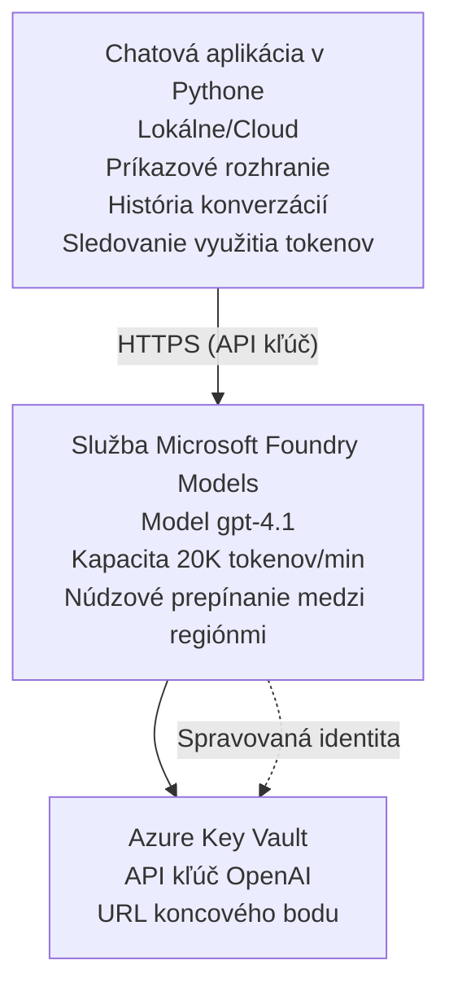

# Chatovacia aplikácia Microsoft Foundry Models

**Vzdelávacia cesta:** Pokročilá ⭐⭐ | **Čas:** 35-45 minút | **Cena:** $50-200/mesiac

Kompletná chatovacia aplikácia Microsoft Foundry Models nasadená pomocou Azure Developer CLI (azd). Tento príklad demonštruje nasadenie gpt-4.1, zabezpečený prístup k API a jednoduché chatové rozhranie.

## 🎯 Čo sa naučíte

- Nasadiť službu Microsoft Foundry Models s modelom gpt-4.1
- Zabezpečiť OpenAI API kľúče pomocou Key Vault
- Vytvoriť jednoduché chatové rozhranie v Pythone
- Monitorovať používanie tokenov a náklady
- Implementovať obmedzovanie rýchlosti a spracovanie chýb

## 📦 Čo je zahrnuté

✅ **Microsoft Foundry Models Service** - nasadenie modelu gpt-4.1  
✅ **Python Chat App** - Jednoduché chatové rozhranie v príkazovom riadku  
✅ **Key Vault Integration** - Bezpečné ukladanie API kľúčov  
✅ **ARM Templates** - Kompletná infraštruktúra ako kód  
✅ **Cost Monitoring** - Sledovanie využitia tokenov  
✅ **Rate Limiting** - Predísť vyčerpaniu kvóty  

## Architektúra



## Predpoklady

### Vyžadované

- **Azure Developer CLI (azd)** - [Návod na inštaláciu](https://learn.microsoft.com/azure/developer/azure-developer-cli/install-azd)
- **Azure subscription** s prístupom k OpenAI - [Požiadať o prístup](https://aka.ms/oai/access)
- **Python 3.9+** - [Nainštalovať Python](https://www.python.org/downloads/)

### Overenie predpokladov

```bash
# Skontrolujte verziu azd (vyžaduje sa 1.5.0 alebo novšia)
azd version

# Skontrolujte prihlásenie do Azure
azd auth login

# Skontrolujte verziu Pythonu
python --version  # alebo python3 --version

# Overte prístup k OpenAI (skontrolujte v Azure portáli)
az cognitiveservices account list-skus \
  --kind OpenAI \
  --location eastus
```

> **⚠️ Dôležité:** Microsoft Foundry Models vyžaduje schválenie žiadosti. Ak ste o prístup nepožiadali, navštívte [aka.ms/oai/access](https://aka.ms/oai/access). Schválenie zvyčajne trvá 1–2 pracovné dni.

## ⏱️ Časový plán nasadenia

| Fáza | Trvanie | Čo sa deje |
|-------|----------|--------------|
| Kontrola predpokladov | 2-3 minúty | Overenie dostupnosti kvóty OpenAI |
| Nasadiť infraštruktúru | 8-12 minút | Vytvorenie OpenAI, Key Vault, nasadenie modelu |
| Konfigurácia aplikácie | 2-3 minúty | Nastavenie prostredia a závislostí |
| **Celkom** | **12-18 minút** | Pripravené na chat s gpt-4.1 |

**Poznámka:** Prvé nasadenie OpenAI môže trvať dlhšie kvôli príprave modelu.

## Rýchly štart

```bash
# Prejdite na príklad
cd examples/azure-openai-chat

# Inicializujte prostredie
azd env new myopenai

# Nasaďte všetko (infraštruktúra + konfigurácia)
azd up
# Budete vyzvaní na:
# 1. Vyberte predplatné Azure
# 2. Zvoľte lokalitu s dostupnosťou OpenAI (napr. eastus, eastus2, westus)
# 3. Počkajte 12-18 minút na nasadenie

# Nainštalujte závislosti pre Python
pip install -r requirements.txt

# Začnite chatovať!
python chat.py
```

**Očakávaný výstup:**
```
🤖 Microsoft Foundry Models Chat Application
Connected to: gpt-4.1 (eastus)
Type your message (or 'quit' to exit)

You: Hello! Tell me about Microsoft Foundry Models.
Assistant: Microsoft Foundry Models Service provides REST API access to OpenAI's powerful language models including gpt-4.1, GPT-3.5-Turbo, and Embeddings...

[Tokens used: 145 | Estimated cost: $0.0044]
```

## ✅ Overiť nasadenie

### Krok 1: Skontrolujte zdroje Azure

```bash
# Zobraziť nasadené zdroje
azd show

# Očakávaný výstup zobrazuje:
# - Služba OpenAI: (názov zdroja)
# - Key Vault: (názov zdroja)
# - Nasadenie: gpt-4.1
# - Lokalita: eastus (alebo váš vybraný región)
```

### Krok 2: Otestujte OpenAI API

```bash
# Získať OpenAI endpoint a kľúč
OPENAI_ENDPOINT=$(azd env get-value AZURE_OPENAI_ENDPOINT)
OPENAI_KEY=$(azd env get-value AZURE_OPENAI_API_KEY)

# Otestovať volanie API
curl "$OPENAI_ENDPOINT/openai/deployments/gpt-4.1/chat/completions?api-version=2024-08-01-preview" \
  -H "Content-Type: application/json" \
  -H "api-key: $OPENAI_KEY" \
  -d '{
    "messages": [{"role": "user", "content": "Say hello!"}],
    "max_tokens": 50
  }'
```

**Očakávaná odpoveď:**
```json
{
  "choices": [
    {
      "message": {
        "role": "assistant",
        "content": "Hello! How can I assist you today?"
      }
    }
  ],
  "usage": {
    "prompt_tokens": 8,
    "completion_tokens": 9,
    "total_tokens": 17
  }
}
```

### Krok 3: Overiť prístup ku Key Vault

```bash
# Zoznam tajomstiev v Key Vault
KV_NAME=$(azd env get-value AZURE_KEY_VAULT_NAME)

az keyvault secret list \
  --vault-name $KV_NAME \
  --query "[].name" \
  --output table
```

**Očakávané tajomstvá:**
- `openai-api-key`
- `openai-endpoint`

**Kritériá úspechu:**
- ✅ OpenAI služba nasadená s gpt-4.1
- ✅ API volanie vracia platnú odpoveď
- ✅ Tajomstvá uložené v Key Vault
- ✅ Sledovanie využitia tokenov funguje

## Štruktúra projektu

```
azure-openai-chat/
├── README.md                   ✅ This guide
├── azure.yaml                  ✅ AZD configuration
├── infra/                      ✅ Infrastructure as Code
│   ├── main.bicep             ✅ Main Bicep template
│   ├── main.parameters.json   ✅ Parameters
│   └── openai.bicep           ✅ OpenAI resource definition
├── src/                        ✅ Application code
│   ├── chat.py                ✅ Chat interface
│   ├── config.py              ✅ Configuration loader
│   └── requirements.txt       ✅ Python dependencies
└── .gitignore                  ✅ Git ignore rules
```

## Funkcie aplikácie

### Chatovacie rozhranie (`chat.py`)

Chatovacia aplikácia obsahuje:

- **História konverzácie** - Udržuje kontext medzi správami
- **Počítanie tokenov** - Sleduje využitie a odhaduje náklady
- **Spracovanie chýb** - Elegantné riešenie limitov rýchlosti a chýb API
- **Odhad nákladov** - Výpočet reálnych nákladov za správu
- **Podpora streamovania** - Voliteľné streamované odpovede

### Príkazy

Počas chatovania môžete použiť:
- `quit` or `exit` - Ukončiť reláciu
- `clear` - Vymazať históriu konverzácie
- `tokens` - Zobraziť celkové využitie tokenov
- `cost` - Zobraziť odhadované celkové náklady

### Konfigurácia (`config.py`)

Načíta konfiguráciu z premenných prostredia:
```python
AZURE_OPENAI_ENDPOINT  # Z úložiska kľúčov
AZURE_OPENAI_API_KEY   # Z úložiska kľúčov
AZURE_OPENAI_MODEL     # Predvolené: gpt-4.1
AZURE_OPENAI_MAX_TOKENS # Predvolené: 800
```

## Príklady použitia

### Základný chat

```bash
python chat.py
```

### Chat s vlastným modelom

```bash
export AZURE_OPENAI_MODEL=gpt-35-turbo
python chat.py
```

### Chat so streamovaním

```bash
python chat.py --stream
```

### Ukážková konverzácia

```
You: Explain Microsoft Foundry Models Service in 3 sentences.
Assistant: Microsoft Foundry Models Service is Microsoft Azure's cloud platform offering 
that provides access to OpenAI's powerful language models. It enables developers 
to integrate capabilities like gpt-4.1 into their applications with enterprise-grade 
security and compliance. The service includes features for content filtering, 
abuse monitoring, and responsible AI practices.

[Tokens used: 89 | Estimated cost: $0.0027]

You: What models are available?
Assistant: Microsoft Foundry Models Service offers several model families including gpt-4.1 
(most capable), GPT-3.5-Turbo (faster and cost-effective), and Embeddings models 
for vector search. Each model has different capabilities, pricing, and token limits.

[Tokens used: 67 | Estimated cost: $0.0020]

Total session: 156 tokens | $0.0047
```

## Správa nákladov

### Ceny tokenov (gpt-4.1)

| Model | Vstup (za 1K tokenov) | Výstup (za 1K tokenov) |
|-------|----------------------|------------------------|
| gpt-4.1 | $0.03 | $0.06 |
| GPT-3.5-Turbo | $0.0015 | $0.002 |

### Odhadované mesačné náklady

Na základe vzorov používania:

| Úroveň používania | Správy/deň | Tokeny/deň | Mesačné náklady |
|-------------|--------------|------------|--------------|
| **Ľahké** | 20 správ | 3,000 tokenov | $3-5 |
| **Stredné** | 100 správ | 15,000 tokenov | $15-25 |
| **Ťažké** | 500 správ | 75,000 tokenov | $75-125 |

**Základné náklady na infraštruktúru:** $1-2/mesiac (Key Vault + minimálne výpočtové prostriedky)

### Tipy na optimalizáciu nákladov

```bash
# 1. Použite GPT-3.5-Turbo pre jednoduchšie úlohy (20× lacnejšie)
export AZURE_OPENAI_MODEL=gpt-35-turbo

# 2. Znížte maximálny počet tokenov pre kratšie odpovede
export AZURE_OPENAI_MAX_TOKENS=400

# 3. Sledujte spotrebu tokenov
python chat.py --show-tokens

# 4. Nastavte upozornenia pre rozpočet
az consumption budget create \
  --budget-name "openai-budget" \
  --amount 50 \
  --time-grain Monthly
```

## Monitorovanie

### Zobraziť využitie tokenov

```bash
# V Azure portáli:
# OpenAI zdroj → Metriky → Vyberte "Transakcia tokenov"

# Alebo cez Azure CLI:
az monitor metrics list \
  --resource $(azd env get-value AZURE_OPENAI_RESOURCE_ID) \
  --metric "TokenTransaction" \
  --start-time $(date -u -d '1 hour ago' '+%Y-%m-%dT%H:%M:%S') \
  --interval PT1M
```

### Zobraziť protokoly API

```bash
# Prenášať diagnostické záznamy
az monitor diagnostic-settings create \
  --resource $(azd env get-value AZURE_OPENAI_RESOURCE_ID) \
  --name openai-logs \
  --logs '[{"category": "Audit", "enabled": true}]' \
  --workspace $(azd env get-value LOG_ANALYTICS_WORKSPACE_ID)

# Záznamy dotazov
az monitor log-analytics query \
  --workspace $(azd env get-value LOG_ANALYTICS_WORKSPACE_ID) \
  --analytics-query "AzureDiagnostics | where Category == 'Audit' | top 10 by TimeGenerated"
```

## Riešenie problémov

### Problém: "Prístup odmietnutý"

**Príznaky:** 403 Forbidden pri volaní API

**Riešenia:**
```bash
# 1. Overte, že prístup k OpenAI je schválený
az cognitiveservices account show \
  --name $(azd env get-value AZURE_OPENAI_NAME) \
  --resource-group $(azd env get-value AZURE_RESOURCE_GROUP)

# 2. Skontrolujte, či je API kľúč správny
azd env get-value AZURE_OPENAI_API_KEY

# 3. Overte formát URL koncového bodu
azd env get-value AZURE_OPENAI_ENDPOINT
# Malo by byť: https://[name].openai.azure.com/
```

### Problém: "Prekročený limit požiadaviek"

**Príznaky:** 429 Too Many Requests

**Riešenia:**
```bash
# 1. Skontrolujte aktuálnu kvótu
az cognitiveservices account deployment show \
  --name $(azd env get-value AZURE_OPENAI_NAME) \
  --resource-group $(azd env get-value AZURE_RESOURCE_GROUP) \
  --deployment-name gpt-4.1

# 2. Požiadajte o zvýšenie kvóty (ak je to potrebné)
# Prejdite do Azure portálu → zdroj OpenAI → Kvóty → Požiadať o zvýšenie

# 3. Implementujte logiku opakovaných pokusov (už v chat.py)
# Aplikácia automaticky opakuje pokusy s exponenciálnym oneskorením
```

### Problém: "Model nenájdený"

**Príznaky:** 404 chyba pre nasadenie

**Riešenia:**
```bash
# 1. Zobraziť dostupné nasadenia
az cognitiveservices account deployment list \
  --name $(azd env get-value AZURE_OPENAI_NAME) \
  --resource-group $(azd env get-value AZURE_RESOURCE_GROUP)

# 2. Overiť názov modelu v prostredí
echo $AZURE_OPENAI_MODEL

# 3. Aktualizovať na správny názov nasadenia
export AZURE_OPENAI_MODEL=gpt-4.1  # alebo gpt-35-turbo
```

### Problém: Vysoká latencia

**Príznaky:** Pomalé odpovede (>5 sekúnd)

**Riešenia:**
```bash
# 1. Skontrolovať regionálnu latenciu
# Nasadiť do regiónu, ktorý je najbližšie používateľom

# 2. Znížiť max_tokens pre rýchlejšie odpovede
export AZURE_OPENAI_MAX_TOKENS=400

# 3. Použiť streamovanie pre lepší používateľský zážitok
python chat.py --stream
```

## Najlepšie bezpečnostné postupy

### 1. Chráňte API kľúče

```bash
# Nikdy neukladajte kľúče do systému správy verzií
# Použite Key Vault (už nakonfigurovaný)

# Pravidelne obmieňajte kľúče
az cognitiveservices account keys regenerate \
  --name $(azd env get-value AZURE_OPENAI_NAME) \
  --resource-group $(azd env get-value AZURE_RESOURCE_GROUP) \
  --key-name key1
```

### 2. Implementujte filtrovanie obsahu

```python
# Microsoft Foundry Models obsahuje vstavané filtrovanie obsahu
# Konfigurujte v Azure Portáli:
# OpenAI Resource → Filtre obsahu → Vytvoriť vlastný filter

# Kategórie: Nenávisť, Sexuálny obsah, Násilie, Sebapoškodzovanie
# Úrovne filtrovania: Nízke, Stredné, Vysoké
```

### 3. Použite Managed Identity (produkcia)

```bash
# Pre produkčné nasadenia používajte spravovanú identitu
# namiesto API kľúčov (vyžaduje hostovanie aplikácie v Azure)

# Aktualizujte infra/openai.bicep, aby obsahoval:
# identity: { type: 'SystemAssigned' }
```

## Vývoj

### Spustiť lokálne

```bash
# Nainštalovať závislosti
pip install -r src/requirements.txt

# Nastaviť premenné prostredia
export AZURE_OPENAI_ENDPOINT="https://[name].openai.azure.com/"
export AZURE_OPENAI_API_KEY="your-api-key"
export AZURE_OPENAI_MODEL="gpt-4.1"

# Spustiť aplikáciu
python src/chat.py
```

### Spustiť testy

```bash
# Nainštalovať závislosti pre testovanie
pip install pytest pytest-cov

# Spustiť testy
pytest tests/ -v

# S pokrytím kódu
pytest tests/ --cov=src --cov-report=html
```

### Aktualizovať nasadenie modelu

```bash
# Nasadiť inú verziu modelu
az cognitiveservices account deployment create \
  --name $(azd env get-value AZURE_OPENAI_NAME) \
  --resource-group $(azd env get-value AZURE_RESOURCE_GROUP) \
  --deployment-name gpt-35-turbo \
  --model-name gpt-35-turbo \
  --model-version "0613" \
  --model-format OpenAI \
  --sku-capacity 20 \
  --sku-name "Standard"
```

## Vyčistenie

```bash
# Odstrániť všetky prostriedky Azure
azd down --force --purge

# Toto odstráni:
# - Služba OpenAI
# - Key Vault (s 90-dňovým mäkkým vymazaním)
# - Skupina prostriedkov
# - Všetky nasadenia a konfigurácie
```

## Ďalšie kroky

### Rozšíriť tento príklad

1. **Pridať webové rozhranie** - Vytvoriť frontend v React/Vue
   ```bash
   # Pridať frontend službu do azure.yaml
   # Nasadiť do Azure Static Web Apps
   ```

2. **Implementovať RAG** - Pridať vyhľadávanie dokumentov pomocou Azure AI Search
   ```python
   # Integrujte Azure AI Search
   # Nahrajte dokumenty a vytvorte vektorový index
   ```

3. **Pridať volanie funkcií** - Povoliť použitie nástrojov
   ```python
   # Definujte funkcie v chat.py
   # Nechajte gpt-4.1 volať externé API
   ```

4. **Podpora viacerých modelov** - Nasadiť viacero modelov
   ```bash
   # Pridať modely gpt-35-turbo a embeddings
   # Implementovať logiku smerovania modelov
   ```

### Služobné príklady

- **[Retail Multi-Agent](../retail-scenario.md)** - Pokročilá architektúra viacerých agentov
- **[Database App](../../../../examples/database-app)** - Pridať perzistentné úložisko
- **[Container Apps](../../../../examples/container-app)** - Nasadiť ako kontajnerizovanú službu

### Vzdelávacie zdroje

- 📚 [AZD For Beginners Course](../../README.md) - Hlavná stránka kurzu
- 📚 [Microsoft Foundry Models Documentation](https://learn.microsoft.com/azure/ai-services/openai/) - Oficiálna dokumentácia
- 📚 [OpenAI API Reference](https://platform.openai.com/docs/api-reference) - Referencia API
- 📚 [Responsible AI](https://www.microsoft.com/ai/responsible-ai) - Najlepšie postupy

## Ďalšie zdroje

### Dokumentácia
- **[Microsoft Foundry Models Service](https://learn.microsoft.com/azure/ai-services/openai/)** - Kompletný sprievodca
- **[gpt-4.1 Models](https://learn.microsoft.com/azure/ai-services/openai/concepts/models)** - Schopnosti modelu
- **[Content Filtering](https://learn.microsoft.com/azure/ai-services/openai/concepts/content-filter)** - Bezpečnostné funkcie
- **[Azure Developer CLI](https://learn.microsoft.com/azure/developer/azure-developer-cli/)** - Referencia azd

### Tutoriály
- **[OpenAI Quickstart](https://learn.microsoft.com/azure/ai-services/openai/quickstart)** - Prvé nasadenie
- **[Chat Completions](https://learn.microsoft.com/azure/ai-services/openai/how-to/chatgpt)** - Budovanie chatovacích aplikácií
- **[Function Calling](https://learn.microsoft.com/azure/ai-services/openai/how-to/function-calling)** - Pokročilé funkcie

### Nástroje
- **[Microsoft Foundry Models Studio](https://oai.azure.com/)** - Webové prostredie na testovanie
- **[Prompt Engineering Guide](https://platform.openai.com/docs/guides/prompt-engineering)** - Ako písať lepšie požiadavky
- **[Token Calculator](https://platform.openai.com/tokenizer)** - Odhadovanie využitia tokenov

### Komunita
- **[Azure AI Discord](https://discord.gg/azure)** - Pomoc od komunity
- **[GitHub Discussions](https://github.com/Azure-Samples/openai/discussions)** - Fórum otázok a odpovedí
- **[Azure Blog](https://azure.microsoft.com/blog/tag/azure-openai-service/)** - Najnovšie aktualizácie

---

**🎉 Úspech!** Nasadili ste Microsoft Foundry Models a vytvorili fungujúcu chatovaciu aplikáciu. Začnite skúmať schopnosti gpt-4.1 a experimentujte s rôznymi promptami a prípadmi použitia.

**Otázky?** [Open an issue](https://github.com/microsoft/AZD-for-beginners/issues) alebo skontrolujte [FAQ](../../resources/faq.md)

**Upozornenie na náklady:** Pamätajte, že po dokončení testovania spustite `azd down`, aby ste sa vyhli priebežným poplatkom (~$50-100/mesiac pri aktívnom používaní).

---

<!-- CO-OP TRANSLATOR DISCLAIMER START -->
**Vyhlásenie o zodpovednosti**:
Tento dokument bol preložený pomocou AI prekladateľskej služby [Co-op Translator](https://github.com/Azure/co-op-translator). Hoci sa snažíme o presnosť, vezmite prosím na vedomie, že automatické preklady môžu obsahovať chyby alebo nepresnosti. Pôvodný dokument v jeho natívnom jazyku by mal byť považovaný za autoritatívny zdroj. Pre kritické informácie sa odporúča profesionálny ľudský preklad. Nie sme zodpovední za žiadne nedorozumenia alebo nesprávne interpretácie vyplývajúce z použitia tohto prekladu.
<!-- CO-OP TRANSLATOR DISCLAIMER END -->