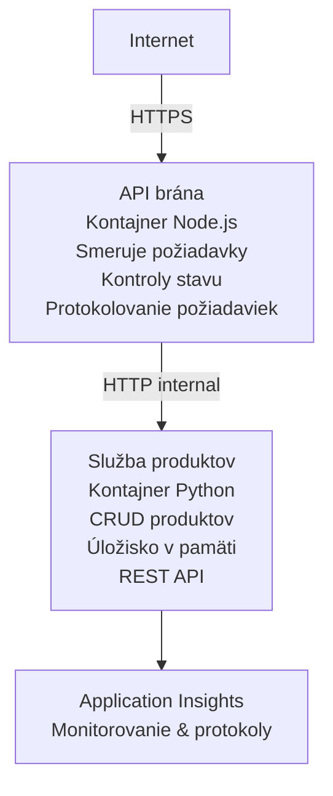

# Architektúra mikroservisov - príklad Container Apps

⏱️ **Odhadovaný čas**: 25-35 minút | 💰 **Odhadované náklady**: ~$50-100/mesiac | ⭐ **Zložitosť**: Pokročilé

Jednoduchá, no funkčná architektúra mikroservisov nasadená do Azure Container Apps pomocou azd CLI. Tento príklad demonštruje komunikáciu medzi službami, orchestráciu kontajnerov a monitorovanie s praktickou konfiguráciou dvoch služieb.

> **📚 Prístup k učeniu**: Tento príklad začína s minimálnou architektúrou dvoch služieb (API Gateway + Backend Service), ktorú si môžete skutočne nasadiť a z ktorej sa poučiť. Po osvojení si základov poskytujeme pokyny na rozšírenie do plnohodnotného ekosystému mikroservisov.

## Čo sa naučíte

Po dokončení tohto príkladu:
- Nasadíte viacero kontajnerov do Azure Container Apps
- Implementujete komunikáciu medzi službami pomocou interného sieťovania
- Nakonfigurujete škálovanie a kontroly stavu na základe prostredia
- Monitorujete distribuované aplikácie pomocou Application Insights
- Pochopíte vzory nasadzovania mikroservisov a osvedčené postupy
- Naučíte sa postupné rozširovanie od jednoduchých po zložité architektúry

## Architektúra

### Fáza 1: Čo staviame (zahrnuté v tomto príklade)


**Prečo začať jednoducho?**
- ✅ Rýchle nasadenie a porozumenie (25-35 minút)
- ✅ Osvojenie si základných vzorov mikroservisov bez zložitosti
- ✅ Funkčný kód, ktorý môžete upravovať a experimentovať s ním
- ✅ Nižšie náklady na učenie (~$50-100/mesiac vs $300-1400/mesiac)
- ✅ Získate sebadôveru pred pridaním databáz a front správ

**Analógia**: Predstavte si to ako učenie sa riadiť. Začínate na prázdnom parkovisku (2 služby), zvládnete základy a potom prejdete do mestskej premávky (5+ služieb s databázami).

### Fáza 2: Budúce rozšírenie (Referenčná architektúra)

Po zvládnutí architektúry s 2 službami môžete rozšíriť na:

```
Full Architecture (Not Included - For Reference)
├── API Gateway (✅ Included)
├── Product Service (✅ Included)
├── Order Service (🔜 Add next)
├── User Service (🔜 Add next)
├── Notification Service (🔜 Add last)
├── Azure Service Bus (🔜 For async communication)
├── Cosmos DB (🔜 For product persistence)
├── Azure SQL (🔜 For order management)
└── Azure Storage (🔜 For file storage)
```

Pozrite sekciu "Expansion Guide" na konci pre krok za krokom inštrukcie.

## Zahrnuté funkcie

✅ **Service Discovery**: Automatické nájdenie služieb cez DNS medzi kontajnermi  
✅ **Load Balancing**: Zabudované rozloženie záťaže medzi replikami  
✅ **Auto-scaling**: Nezávislé škálovanie pre každú službu na základe HTTP požiadaviek  
✅ **Health Monitoring**: Liveness a readiness sondy pre obe služby  
✅ **Distributed Logging**: Centralizované logovanie s Application Insights  
✅ **Internal Networking**: Bezpečná komunikácia medzi službami  
✅ **Container Orchestration**: Automatické nasadzovanie a škálovanie  
✅ **Zero-Downtime Updates**: Postupné aktualizácie s manažmentom revízií  

## Požiadavky

### Vyžadované nástroje

Pred začatím overte, že máte nainštalované tieto nástroje:

1. **[Azure Developer CLI (azd)](https://learn.microsoft.com/azure/developer/azure-developer-cli/install-azd)** (verzia 1.0.0 alebo vyššia)
   ```bash
   azd version
   # Očakávaný výstup: azd verzia 1.0.0 alebo novšia
   ```

2. **[Azure CLI](https://learn.microsoft.com/cli/azure/install-azure-cli)** (verzia 2.50.0 alebo vyššia)
   ```bash
   az --version
   # Očakávaný výstup: azure-cli 2.50.0 alebo novšia
   ```

3. **[Docker](https://www.docker.com/get-started)** (pre lokálny vývoj/testovanie - voliteľné)
   ```bash
   docker --version
   # Očakávaný výstup: Docker verzia 20.10 alebo vyššia
   ```

### Požiadavky pre Azure

- Aktívne **Azure predplatné** ([vytvoriť bezplatný účet](https://azure.microsoft.com/free/))
- Povolenia na vytváranie prostriedkov vo vašom predplatnom
- **Contributor** rola na predplatnom alebo resource group

### Predchádzajúce znalosti

Toto je príklad na **pokročilej úrovni**. Mali by ste mať:
- Dokončený [Simple Flask API example](../../../../../examples/container-app/simple-flask-api) 
- Základné porozumenie architektúre mikroservisov
- Znalosť REST API a HTTP
- Pochopenie konceptov kontajnerov

**Nováčik v Container Apps?** Najprv začnite s [Simple Flask API example](../../../../../examples/container-app/simple-flask-api), aby ste si osvojili základy.

## Rýchly štart (krok za krokom)

### Krok 1: Klonovať a prejsť do adresára

```bash
git clone https://github.com/microsoft/AZD-for-beginners.git
cd AZD-for-beginners/examples/container-app/microservices
```

**✓ Overenie úspechu**: Overte, že vidíte `azure.yaml`:
```bash
ls
# Očakávané: README.md, azure.yaml, infra/, src/
```

### Krok 2: Autentifikácia v Azure

```bash
azd auth login
```

Tým sa otvorí váš prehliadač pre autentifikáciu do Azure. Prihláste sa pomocou svojich Azure prihlasovacích údajov.

**✓ Overenie úspechu**: Mali by ste vidieť:
```
Logged in to Azure.
```

### Krok 3: Inicializujte prostredie

```bash
azd init
```

**Výzvy, ktoré uvidíte**:
- **Názov prostredia**: Zadajte krátky názov (napr. `microservices-dev`)
- **Azure predplatné**: Vyberte svoje predplatné
- **Azure umiestnenie**: Zvoľte región (napr. `eastus`, `westeurope`)

**✓ Overenie úspechu**: Mali by ste vidieť:
```
SUCCESS: New project initialized!
```

### Krok 4: Nasadiť infraštruktúru a služby

```bash
azd up
```

**Čo sa stane** (trvá 8-12 minút):
1. Vytvorí prostredie Container Apps
2. Vytvorí Application Insights pre monitorovanie
3. Postaví API Gateway kontajner (Node.js)
4. Postaví Product Service kontajner (Python)
5. Nasadí oba kontajnery do Azure
6. Nakonfiguruje sieťovanie a kontroly stavu
7. Nastaví monitorovanie a logovanie

**✓ Overenie úspechu**: Mali by ste vidieť:
```
SUCCESS: Your application was deployed to Azure in X minutes Y seconds.
Endpoint: https://api-gateway-<unique-id>.azurecontainerapps.io
```

**⏱️ Čas**: 8-12 minút

### Krok 5: Otestovať nasadenie

```bash
# Získať koncový bod brány
GATEWAY_URL=$(azd env get-values | grep API_GATEWAY_URL | cut -d '=' -f2 | tr -d '"')

# Otestovať stav API brány
curl $GATEWAY_URL/health

# Očakávaný výstup:
# {"status":"zdravý","service":"api-gateway","timestamp":"2025-11-19T10:30:00Z"}
```

**Otestujte službu produktov cez API bránu**:
```bash
# Zoznam produktov
curl $GATEWAY_URL/api/products

# Očakávaný výstup:
# [
#   {"id":1,"name":"Notebook","price":999.99,"stock":50},
#   {"id":2,"name":"Myš","price":29.99,"stock":200},
#   {"id":3,"name":"Klávesnica","price":79.99,"stock":150}
# ]
```

**✓ Overenie úspechu**: Obe koncové body vracajú JSON dáta bez chýb.

---

**🎉 Gratulujeme!** Nasadili ste architektúru mikroservisov do Azure!

## Štruktúra projektu

Všetky implementačné súbory sú zahrnuté—ide o kompletný, funkčný príklad:

```
microservices/
│
├── README.md                         # This file
├── azure.yaml                        # AZD configuration
├── .gitignore                        # Git ignore patterns
│
├── infra/                           # Infrastructure as Code (Bicep)
│   ├── main.bicep                   # Main orchestration
│   ├── abbreviations.json           # Naming conventions
│   ├── core/                        # Shared infrastructure
│   │   ├── container-apps-environment.bicep  # Container environment + registry
│   │   └── monitor.bicep            # Application Insights + Log Analytics
│   └── app/                         # Service definitions
│       ├── api-gateway.bicep        # API Gateway container app
│       └── product-service.bicep    # Product Service container app
│
└── src/                             # Application source code
    ├── api-gateway/                 # Node.js API Gateway
    │   ├── app.js                   # Express server with routing
    │   ├── package.json             # Node dependencies
    │   └── Dockerfile               # Container definition
    └── product-service/             # Python Product Service
        ├── main.py                  # Flask API with product data
        ├── requirements.txt         # Python dependencies
        └── Dockerfile               # Container definition
```

**Čo robí každá súčasť:**

**Infraštruktúra (infra/)**:
- `main.bicep`: Orchestruja všetky Azure prostriedky a ich závislosti
- `core/container-apps-environment.bicep`: Vytvára Container Apps prostredie a Azure Container Registry
- `core/monitor.bicep`: Nastavuje Application Insights pre distribuované logovanie
- `app/*.bicep`: Definície jednotlivých container app s nastavením škálovania a sondami stavu

**API Gateway (src/api-gateway/)**:
- Verejne prístupná služba, ktorá smeruje požiadavky na backend služby
- Implementuje logovanie, spracovanie chýb a presmerovanie požiadaviek
- Demonštruje HTTP komunikáciu medzi službami

**Product Service (src/product-service/)**:
- Interná služba s katalógom produktov (v pamäti pre jednoduchosť)
- REST API s kontrolami stavu
- Príklad backendového mikroservisného vzoru

## Prehľad služieb

### API Gateway (Node.js/Express)

**Port**: 8080  
**Prístup**: Verejný (externý ingress)  
**Účel**: Smeruje prichádzajúce požiadavky na príslušné backend služby  

**Koncové body**:
- `GET /` - Informácie o službe
- `GET /health` - Kontrola stavu
- `GET /api/products` - Presmeruje na produktovú službu (zobraziť všetky)
- `GET /api/products/:id` - Presmeruje na produktovú službu (získať podľa ID)

**Kľúčové vlastnosti**:
- Smerovanie požiadaviek pomocou axios
- Centralizované logovanie
- Spracovanie chýb a správa časových limitov
- Service discovery cez premenné prostredia
- Integrácia s Application Insights

**Zvýraznenie kódu** (`src/api-gateway/app.js`):
```javascript
// Interná komunikácia služby
app.get('/api/products', async (req, res) => {
  const response = await axios.get(`${PRODUCT_SERVICE_URL}/products`);
  res.json(response.data);
});
```

### Product Service (Python/Flask)

**Port**: 8000  
**Prístup**: Iba interný (bez externého ingressu)  
**Účel**: Spravuje katalóg produktov s dátami v pamäti  

**Koncové body**:
- `GET /` - Informácie o službe
- `GET /health` - Kontrola stavu
- `GET /products` - Zobraziť všetky produkty
- `GET /products/<id>` - Získať produkt podľa ID

**Kľúčové vlastnosti**:
- RESTful API pomocou Flasku
- Úložisko produktov v pamäti (jednoduché, nie je potrebná databáza)
- Monitorovanie stavu pomocou sond
- Štruktúrované logovanie
- Integrácia s Application Insights

**Dátový model**:
```python
{
  "id": 1,
  "name": "Laptop",
  "description": "High-performance laptop",
  "price": 999.99,
  "stock": 50
}
```

**Prečo iba interne?**
Produktová služba nie je verejne dostupná. Všetky požiadavky musia prejsť cez API Gateway, ktorá poskytuje:
- Bezpečnosť: Kontrolovaný prístupový bod
- Flexibilitu: Možnosť zmeniť backend bez vplyvu na klientov
- Monitorovanie: Centralizované logovanie požiadaviek

## Pochopenie komunikácie medzi službami

### Ako služby spolu komunikujú

V tomto príklade API Gateway komunikuje s Product Service pomocou **interných HTTP volaní**:

```javascript
// API brána (src/api-gateway/app.js)
const PRODUCT_SERVICE_URL = process.env.PRODUCT_SERVICE_URL;

// Vykonať internú HTTP požiadavku
const response = await axios.get(`${PRODUCT_SERVICE_URL}/products`);
```

**Kľúčové body**:

1. **DNS-based discovery**: Container Apps automaticky poskytuje DNS pre interné služby
   - Product Service FQDN: `product-service.internal.<environment>.azurecontainerapps.io`
   - Zjednodušene: `http://product-service` (Container Apps to vyrieši)

2. **Žiadne verejné vystavenie**: Product Service má v Bicep `external: false`
   - Prístupná len v rámci Container Apps prostredia
   - Nedá sa dosiahnuť z internetu

3. **Premenné prostredia**: URL služieb sú vložené pri nasadení
   - Bicep odovzdáva interné FQDN do brány
   - Žiadne pevne zakódované URL v aplikačnom kóde

**Analógia**: Predstavte si to ako kancelárie. API Gateway je recepcia (verejne prístupná) a Product Service je kancelária (iba vnútorná). Návštevníci musia prejsť cez recepciu, aby sa dostali do kancelárie.

## Možnosti nasadenia

### Plné nasadenie (odporúčané)

```bash
# Nasadiť infraštruktúru a obe služby
azd up
```

Toto nasadí:
1. Prostredie Container Apps
2. Application Insights
3. Container Registry
4. API Gateway kontajner
5. Product Service kontajner

**Čas**: 8-12 minút

### Nasadiť jednotlivú službu

```bash
# Nasadiť len jednu službu (po počiatočnom spustení azd up)
azd deploy api-gateway

# Alebo nasadiť službu product
azd deploy product-service
```

**Použitie**: Keď ste zmenili kód v jednej službe a chcete nasadiť len túto službu.

### Aktualizovať konfiguráciu

```bash
# Zmeňte parametre škálovania
azd env set GATEWAY_MAX_REPLICAS 30

# Znova nasaďte s novou konfiguráciou
azd up
```

## Konfigurácia

### Konfigurácia škálovania

Obe služby sú nakonfigurované so škálovaním na základe HTTP v ich Bicep súboroch:

**API Gateway**:
- Minimálny počet replík: 2 (vždy aspoň 2 pre dostupnosť)
- Maximálny počet replík: 20
- Spúšťač škálovania: 50 súbežných požiadaviek na repliku

**Product Service**:
- Minimálny počet replík: 1 (môže škálovať na nulu, ak je potrebné)
- Maximálny počet replík: 10
- Spúšťač škálovania: 100 súbežných požiadaviek na repliku

**Prispôsobenie škálovania** (v `infra/app/*.bicep`):
```bicep
scale: {
  minReplicas: 1
  maxReplicas: 10
  rules: [
    {
      name: 'http-scale-rule'
      http: {
        metadata: {
          concurrentRequests: '100'  // Adjust this
        }
      }
    }
  ]
}
```

### Pridelenie zdrojov

**API Gateway**:
- CPU: 1.0 vCPU
- Pamäť: 2 GiB
- Dôvod: Spracováva všetku externú prevádzku

**Product Service**:
- CPU: 0.5 vCPU
- Pamäť: 1 GiB
- Dôvod: Ľahké operácie v pamäti

### Kontroly stavu

Obe služby obsahujú liveness a readiness sondy:

```bicep
probes: [
  {
    type: 'Liveness'
    httpGet: {
      path: '/health'
      port: 8080
    }
    initialDelaySeconds: 10
    periodSeconds: 30
  }
  {
    type: 'Readiness'
    httpGet: {
      path: '/health'
      port: 8080
    }
    initialDelaySeconds: 5
    periodSeconds: 10
  }
]
```

**Čo to znamená**:
- **Liveness**: Ak kontrola stavu zlyhá, Container Apps reštartuje kontajner
- **Readiness**: Ak nie je pripravená, Container Apps prestane smerovať prevádzku na danú repliku


## Monitorovanie a pozorovateľnosť

### Zobraziť denníky služieb

```bash
# Prezrite si denníky pomocou príkazu azd monitor
azd monitor --logs

# Alebo použite Azure CLI pre konkrétne kontajnerové aplikácie:
# Streamujte denníky z API brány
az containerapp logs show --name api-gateway --resource-group $RG_NAME --follow

# Prezrite si nedávne denníky produktovej služby
az containerapp logs show --name product-service --resource-group $RG_NAME --tail 100
```

**Očakávaný výstup**:
```
[api-gateway] API Gateway listening on port 8080
[api-gateway] Product Service URL: http://product-service
[api-gateway] GET /api/products 200 - 45ms
[product-service] Retrieved 5 products
```

### Dopyty v Application Insights

Prístup do Application Insights v Azure Porte, potom spustite tieto dopyty:

**Nájsť pomalé požiadavky**:
```kusto
requests
| where timestamp > ago(1h)
| where duration > 1000  // Requests taking >1 second
| summarize count() by name, cloud_RoleName
| order by count_ desc
```

**Sledovať volania medzi službami**:
```kusto
dependencies
| where timestamp > ago(1h)
| where type == "Http"
| project timestamp, name, target, duration, success
| order by timestamp desc
```

**Miera chýb podľa služby**:
```kusto
exceptions
| where timestamp > ago(24h)
| summarize errorCount = count() by cloud_RoleName, type
| order by errorCount desc
```

**Objem požiadaviek v čase**:
```kusto
requests
| where timestamp > ago(1h)
| summarize requestCount = count() by bin(timestamp, 5m), cloud_RoleName
| render timechart
```

### Prístup k monitorovaciemu dashboardu

```bash
# Získajte podrobnosti o Application Insights
azd env get-values | grep APPLICATIONINSIGHTS

# Otvoriť monitorovanie v portáli Azure
az monitor app-insights component show \
  --app $(azd env get-values | grep APPLICATIONINSIGHTS_CONNECTION_STRING | cut -d '=' -f2) \
  --resource-group $(azd env get-values | grep AZURE_RESOURCE_GROUP | cut -d '=' -f2) \
  --query "appId" -o tsv
```

### Živé metriky

1. Prejdite do Application Insights v Azure Porte
2. Kliknite na "Live Metrics"
3. Pozrite si reálne požiadavky, zlyhania a výkonnosť
4. Otestujte spustením: `curl $(azd env get-values | grep API_GATEWAY_URL | cut -d '=' -f2 | tr -d '"')/api/products`

## Praktické cvičenia

[Poznámka: Pozrite si kompletné cvičenia vyššie v sekcii "Practical Exercises" pre podrobné krok za krokom cvičenia vrátane overenia nasadenia, úpravy dát, testov autoskalovania, spracovania chýb a pridania tretej služby.]

## Analýza nákladov

### Odhadované mesačné náklady (pre tento príklad s 2 službami)

| Prostriedok | Konfigurácia | Odhadované náklady |
|----------|--------------|----------------|
| API Gateway | 2-20 replík, 1 vCPU, 2GB RAM | $30-150 |
| Product Service | 1-10 replík, 0.5 vCPU, 1GB RAM | $15-75 |
| Container Registry | Basic tier | $5 |
| Application Insights | 1-2 GB/mesiac | $5-10 |
| Log Analytics | 1 GB/mesiac | $3 |
| **Spolu** | | **$58-243/mesiac** |

**Rozpis nákladov podľa využitia**:
- **Nízka prevádzka** (testovanie/učebné účely): ~ $60/mesiac
- **Stredná prevádzka** (malá produkcia): ~ $120/mesiac
- **Vysoká prevádzka** (rušné obdobia): ~ $240/mesiac

### Tipy na optimalizáciu nákladov

1. **Škálovanie na nulu pre vývoj**:
   ```bicep
   scale: {
     minReplicas: 0  // Save $30-40/month when not in use
     maxReplicas: 10
   }
   ```

2. **Použite Consumption Plan pre Cosmos DB** (keď ju pridáte):
   - Platíte len za to, čo využijete
   - Žiadny minimálny poplatok

3. **Nastavte vzorkovanie v Application Insights**:
   ```javascript
   appInsights.defaultClient.config.samplingPercentage = 50; // Vzorkovať 50 % požiadaviek
   ```

4. **Upracte zdroje, keď ich nepotrebujete**:
   ```bash
   azd down
   ```

### Možnosti bezplatného tarifu

Pre učenie/testovanie zvážte:
- Použite bezplatné kredity Azure (prvých 30 dní)
- Udržujte minimálny počet replík
- Zmažte po testovaní (žiadne priebežné poplatky)

---

## Vyčistenie

Aby ste predišli priebežným poplatkom, odstráňte všetky prostriedky:

```bash
azd down --force --purge
```

**Výzva na potvrdenie**:
```
? Total resources to delete: 6, are you sure you want to continue? (y/N)
```

Zadajte `y` pre potvrdenie.

**Čo bude odstránené**:
- Prostredie Container Apps
- Obidve Container Apps (gateway a product service)
- Container Registry
- Application Insights
- Log Analytics Workspace
- Skupina prostriedkov

**✓ Overiť vyčistenie**:
```bash
az group list --query "[?starts_with(name,'rg-microservices')]" --output table
```

Malo by vrátiť prázdny výsledok.

---

## Návod na rozšírenie: z 2 na 5+ služieb

Keď si osvojíte túto architektúru so 2 službami, tu je ako rozšíriť:

### Fáza 1: Pridať perzistenciu databázy (ďalší krok)

**Pridať Cosmos DB pre product service**:

1. Vytvorte `infra/core/cosmos.bicep`:
   ```bicep
   resource cosmosAccount 'Microsoft.DocumentDB/databaseAccounts@2023-04-15' = {
     name: name
     location: location
     kind: 'GlobalDocumentDB'
     properties: {
       databaseAccountOfferType: 'Standard'
       locations: [{ locationName: location, failoverPriority: 0 }]
     }
   }
   ```

2. Aktualizujte product service, aby používala Cosmos DB namiesto dát v pamäti

3. Odhadované dodatočné náklady: ~25 $/mesiac (serverless)

### Fáza 2: Pridať tretiu službu (správa objednávok)

**Vytvorte Order Service**:

1. Nový priečinok: `src/order-service/` (Python/Node.js/C#)
2. Nový Bicep: `infra/app/order-service.bicep`
3. Aktualizujte API Gateway, aby smeroval `/api/orders`
4. Pridajte Azure SQL Database pre perzistenciu objednávok

**Architektúra bude**:
```
API Gateway → Product Service (Cosmos DB)
           → Order Service (Azure SQL)
```

### Fáza 3: Pridať asynchrónnu komunikáciu (Service Bus)

**Implementujte architektúru riadenú udalosťami**:

1. Pridajte Azure Service Bus: `infra/core/servicebus.bicep`
2. Product Service publikuje udalosti "ProductCreated"
3. Order Service sa prihlási na odber udalostí produktov
4. Pridajte Notification Service na spracovanie udalostí

**Vzor**: Request/Response (HTTP) + Event-Driven (Service Bus)

### Fáza 4: Pridať overovanie používateľov

**Implementujte User Service**:

1. Vytvorte `src/user-service/` (Go/Node.js)
2. Pridajte Azure AD B2C alebo vlastnú JWT autentifikáciu
3. API Gateway overuje tokeny
4. Služby kontrolujú oprávnenia používateľa

### Fáza 5: Pripravenosť do produkcie

**Pridajte tieto komponenty**:
- Azure Front Door (globálne vyvažovanie záťaže)
- Azure Key Vault (správa tajomstiev)
- Azure Monitor Workbooks (vlastné dashboardy)
- CI/CD Pipeline (GitHub Actions)
- Blue-Green nasadenia
- Managed Identity pre všetky služby

**Celkové náklady produkčnej architektúry**: ~300–1 400 $/mesiac

---

## Zistiť viac

### Súvisiaca dokumentácia
- [Dokumentácia Azure Container Apps](https://learn.microsoft.com/azure/container-apps/)
- [Sprievodca architektúrou mikroslužieb](https://learn.microsoft.com/azure/architecture/guide/architecture-styles/microservices)
- [Application Insights pre distribuované trasovanie](https://learn.microsoft.com/azure/azure-monitor/app/distributed-tracing)
- [Dokumentácia Azure Developer CLI](https://learn.microsoft.com/azure/developer/azure-developer-cli/)

### Ďalšie kroky v tomto kurze
- ← Predchádzajúce: [Jednoduché Flask API](../../../../../examples/container-app/simple-flask-api) - Začiatočnícky príklad s jedným kontajnerom
- → Ďalšie: [Sprievodca integráciou AI](../../../../../examples/docs/ai-foundry) - Pridať AI funkcie
- 🏠 [Domov kurzu](../../README.md)

### Porovnanie: Kedy použiť čo

**Jednokontajnerová aplikácia** (príklad Simple Flask API):
- ✅ Jednoduché aplikácie
- ✅ Monolitická architektúra
- ✅ Rýchle nasadenie
- ❌ Obmedzená škálovateľnosť
- **Náklady**: ~15–50 $/mesiac

**Mikroslužby** (tento príklad):
- ✅ Komplexné aplikácie
- ✅ Nezávislé škálovanie pre každú službu
- ✅ Autonómia tímov (rôzne služby, rôzne tímy)
- ❌ Zložitejšie na správu
- **Náklady**: ~60–250 $/mesiac

**Kubernetes (AKS)**:
- ✅ Maximálna kontrola a flexibilita
- ✅ Prenositeľnosť naprieč multicloudami
- ✅ Pokročilá sieťová infraštruktúra
- ❌ Vyžaduje si odborné znalosti Kubernetes
- **Náklady**: ~150–500 $/mesiac minimálne

**Odporúčanie**: Začnite s Container Apps (tento príklad), prejdite na AKS iba ak potrebujete funkcie špecifické pre Kubernetes.

---

## Najčastejšie otázky

**Q: Prečo len 2 služby namiesto 5+?**  
A: Edukačné postupné kroky. Osvojte si základy (komunikácia medzi službami, monitorovanie, škálovanie) s jednoduchým príkladom pred pridaním zložitosti. Vzory, ktoré sa tu naučíte, platia pre architektúry s 100 službami.

**Q: Môžem pridať viac služieb sám?**  
A: Absolútne! Postupujte podľa návodu na rozšírenie vyššie. Každá nová služba nasleduje rovnaký vzor: vytvorte src priečinok, vytvorte Bicep súbor, aktualizujte azure.yaml, deploynite.

**Q: Je to pripravené do produkcie?**  
A: Je to pevný základ. Pre produkciu pridajte: managed identity, Key Vault, perzistentné databázy, CI/CD pipeline, monitorovacie upozornenia a stratégiu zálohovania.

**Q: Prečo nepoužiť Dapr alebo iný service mesh?**  
A: Zostaňte pri jednoduchosti na učenie. Keď pochopíte natívne Container Apps sieťovanie, môžete pridať Dapr pre pokročilé scenáre.

**Q: Ako debugovať lokálne?**  
A: Spustite služby lokálne s Dockerom:
```bash
cd src/api-gateway
docker build -t local-gateway .
docker run -p 8080:8080 -e PRODUCT_SERVICE_URL=http://localhost:8000 local-gateway
```

**Q: Môžem použiť rôzne programovacie jazyky?**  
A: Áno! Tento príklad ukazuje Node.js (gateway) + Python (product service). Môžete miešať akékoľvek jazyky, ktoré bežia v kontajneroch.

**Q: Čo ak nemám kredity Azure?**  
A: Použite bezplatnú úroveň Azure (prvých 30 dní pre nové účty) alebo nasadte na krátke testovacie obdobia a okamžite zmažte.

---

> **🎓 Zhrnutie učebnej cesty**: Naučili ste sa nasadiť multi-službovú architektúru s automatickým škálovaním, interným sieťovaním, centralizovaným monitorovaním a vzormi pripravenými pre produkciu. Tento základ vás pripraví na zložité distribuované systémy a podnikové architektúry mikroslužieb.

**📚 Navigácia kurzu:**
- ← Predchádzajúce: [Jednoduché Flask API](../../../../../examples/container-app/simple-flask-api)
- → Ďalšie: [Integrácia databázy - príklad](../../../../../examples/database-app)
- 🏠 [Domov kurzu](../../../README.md)
- 📖 [Najlepšie postupy Container Apps](../../../docs/chapter-04-infrastructure/deployment-guide.md)

---

<!-- CO-OP TRANSLATOR DISCLAIMER START -->
**Vylúčenie zodpovednosti**:
Tento dokument bol preložený pomocou AI prekladateľskej služby [Co-op Translator](https://github.com/Azure/co-op-translator). Aj keď sa snažíme o presnosť, majte prosím na pamäti, že automatizované preklady môžu obsahovať chyby alebo nepresnosti. Pôvodný dokument v jeho pôvodnom jazyku treba považovať za záväzný zdroj. Pre kritické informácie sa odporúča profesionálny ľudský preklad. Za akékoľvek nedorozumenia alebo nesprávne výklady vyplývajúce z použitia tohto prekladu nenesieme zodpovednosť.
<!-- CO-OP TRANSLATOR DISCLAIMER END -->