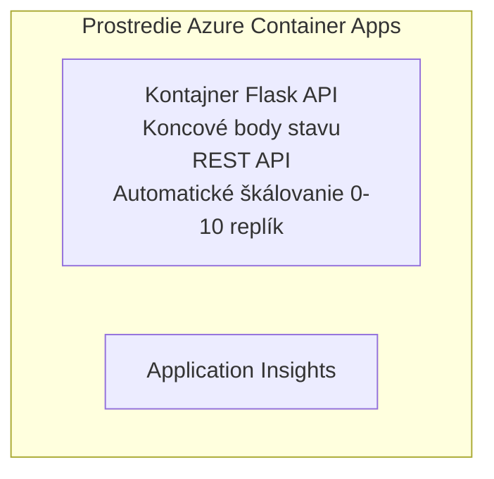

# Jednoduché Flask API - Container App Example

**Vzdelávacia cesta:** Začiatočník ⭐ | **Čas:** 25-35 minút | **Náklady:** $0-15/mesiac

Kompletné, fungujúce Python Flask REST API nasadené do Azure Container Apps pomocou Azure Developer CLI (azd). Tento príklad demonštruje nasadenie kontajnera, automatické škálovanie a základy monitorovania.

## 🎯 Čo sa naučíte

- Nasadiť kontajnerizovanú Python aplikáciu do Azure
- Nakonfigurovať automatické škálovanie so škálovaním na nulu
- Implementovať health probes a readiness checky
- Monitorovať logy aplikácie a metriky
- Použiť Azure Developer CLI na rýchle nasadenie

## 📦 Čo obsahuje

✅ **Flask Application** - Kompletné REST API s CRUD operáciami (`src/app.py`)  
✅ **Dockerfile** - Produkčné nastavenie kontajnera  
✅ **Bicep Infrastructure** - Prostredie Container Apps a nasadenie API  
✅ **AZD Configuration** - Nastavenie nasadenia príkazom jednoho príkazu  
✅ **Health Probes** - Nakonfigurované liveness a readiness kontroly  
✅ **Auto-scaling** - 0-10 replík na základe HTTP záťaže  

## Architecture



## Predpoklady

### Požadované
- **Azure Developer CLI (azd)** - [Návod na inštaláciu](https://learn.microsoft.com/azure/developer/azure-developer-cli/install-azd)
- **Azure predplatné** - [Bezplatný účet](https://azure.microsoft.com/free/)
- **Docker Desktop** - [Nainštalovať Docker](https://www.docker.com/products/docker-desktop/) (na lokálne testovanie)

### Overenie predpokladov

```bash
# Skontrolujte verziu azd (potrebná verzia 1.5.0 alebo novšia)
azd version

# Overte prihlásenie do Azure
azd auth login

# Skontrolujte Docker (voliteľné, na lokálne testovanie)
docker --version
```

## ⏱️ Časový harmonogram nasadenia

| Phase | Duration | What Happens |
|-------|----------|--------------||
| Environment setup | 30 seconds | Create azd environment |
| Build container | 2-3 minutes | Docker build Flask app |
| Provision infrastructure | 3-5 minutes | Create Container Apps, registry, monitoring |
| Deploy application | 2-3 minutes | Push image and deploy to Container Apps |
| **Total** | **8-12 minutes** | Complete deployment ready |

## Rýchly štart

```bash
# Prejdite na príklad
cd examples/container-app/simple-flask-api

# Inicializujte prostredie (zvoľte jedinečný názov)
azd env new myflaskapi

# Nasadiť všetko (infraštruktúra + aplikácia)
azd up
# Budete vyzvaní, aby ste:
# 1. Vyberte predplatné Azure
# 2. Zvoľte umiestnenie (napr. eastus2)
# 3. Počkajte 8-12 minút na nasadenie

# Získajte endpoint svojho API
azd env get-values

# Otestujte API
curl $(azd env get-value API_ENDPOINT)/health
```

**Očakávaný výstup:**
```json
{
  "status": "healthy",
  "timestamp": "2025-11-19T10:30:00Z",
  "service": "simple-flask-api",
  "version": "1.0.0"
}
```

## ✅ Overiť nasadenie

### Krok 1: Skontrolujte stav nasadenia

```bash
# Zobraziť nasadené služby
azd show

# Očakávaný výstup zobrazuje:
# - Služba: api
# - Koncový bod: https://ca-api-[env].xxx.azurecontainerapps.io
# - Stav: Beží
```

### Krok 2: Otestujte API koncové body

```bash
# Získať koncový bod API
API_URL=$(azd env get-value API_ENDPOINT)

# Otestovať stav
curl $API_URL/health

# Otestovať koreňový koncový bod
curl $API_URL/

# Vytvoriť položku
curl -X POST $API_URL/api/items \
  -H "Content-Type: application/json" \
  -d '{"name": "Test Item", "description": "My first item"}'

# Získať všetky položky
curl $API_URL/api/items
```

**Kritériá úspechu:**
- ✅ Koncový bod /health vracia HTTP 200
- ✅ Hlavný koncový bod zobrazuje informácie o API
- ✅ POST vytvorí položku a vráti HTTP 201
- ✅ GET vráti vytvorené položky

### Krok 3: Zobraziť logy

```bash
# Streamujte živé logy pomocou azd monitor
azd monitor --logs

# Alebo použite Azure CLI:
az containerapp logs show --name api --resource-group $RG_NAME --follow

# Mali by ste vidieť:
# - správy o spustení Gunicornu
# - logy HTTP požiadaviek
# - informačné logy aplikácie
```

## Štruktúra projektu

```
simple-flask-api/
├── azure.yaml              # AZD configuration
├── infra/
│   ├── main.bicep         # Main infrastructure
│   ├── main.parameters.json
│   └── app/
│       ├── container-env.bicep
│       └── api.bicep
└── src/
    ├── app.py             # Flask application
    ├── requirements.txt
    └── Dockerfile
```

## API koncové body

| Endpoint | Method | Description |
|----------|--------|-------------|
| `/health` | GET | Kontrola stavu |
| `/api/items` | GET | Zoznam všetkých položiek |
| `/api/items` | POST | Vytvoriť novú položku |
| `/api/items/{id}` | GET | Získať konkrétnu položku |
| `/api/items/{id}` | PUT | Aktualizovať položku |
| `/api/items/{id}` | DELETE | Odstrániť položku |

## Konfigurácia

### Premenné prostredia

```bash
# Nastaviť vlastnú konfiguráciu
azd env set PORT 8000
azd env set LOG_LEVEL info
azd env set MAX_REPLICAS 20
```

### Konfigurácia škálovania

API sa automaticky škáluje na základe HTTP prevádzky:
- **Min Replicas**: 0 (škáluje na nulu, keď je nečinné)
- **Max Replicas**: 10
- **Concurrent Requests per Replica**: 50

## Vývoj

### Spustiť lokálne

```bash
# Nainštalovať závislosti
cd src
pip install -r requirements.txt

# Spustiť aplikáciu
python app.py

# Otestovať lokálne
curl http://localhost:8000/health
```

### Vytvorenie a testovanie kontajnera

```bash
# Vytvoriť Docker obraz
docker build -t flask-api:local ./src

# Spustiť kontajner lokálne
docker run -p 8000:8000 flask-api:local

# Otestovať kontajner
curl http://localhost:8000/health
```

## Nasadenie

### Úplné nasadenie

```bash
# Nasadiť infraštruktúru a aplikáciu
azd up
```

### Nasadenie iba kódu

```bash
# Nasadiť iba kód aplikácie (infraštruktúra nezmenená)
azd deploy api
```

### Aktualizovať konfiguráciu

```bash
# Aktualizujte premenné prostredia
azd env set API_KEY "new-api-key"

# Opätovne nasaďte s novou konfiguráciou
azd deploy api
```

## Monitorovanie

### Zobraziť logy

```bash
# Sledujte živé logy pomocou azd monitor
azd monitor --logs

# Alebo použite Azure CLI pre Container Apps:
az containerapp logs show --name api --resource-group $RG_NAME --follow

# Zobrazte posledných 100 riadkov
az containerapp logs show --name api --resource-group $RG_NAME --tail 100
```

### Sledovanie metrík

```bash
# Otvoriť panel služby Azure Monitor
azd monitor --overview

# Zobraziť konkrétne metriky
az monitor metrics list \
  --resource $(azd show --output json | jq -r '.services.api.resourceId') \
  --metric "Requests,ResponseTime"
```

## Testovanie

### Kontrola stavu

```bash
curl $(azd show --output json | jq -r '.services.api.endpoint')/health
```

Očakávaná odpoveď:
```json
{
  "status": "healthy",
  "timestamp": "2025-11-19T10:30:00Z"
}
```

### Vytvoriť položku

```bash
curl -X POST $(azd show --output json | jq -r '.services.api.endpoint')/api/items \
  -H "Content-Type: application/json" \
  -d '{"name": "Test Item", "description": "A test item"}'
```

### Získať všetky položky

```bash
curl $(azd show --output json | jq -r '.services.api.endpoint')/api/items
```

## Optimalizácia nákladov

Toto nasadenie využíva škálovanie na nulu, takže platíte len keď API spracováva požiadavky:

- **Náklady pri nečinnosti**: približne $0/mesiac (škálované na nulu)
- **Aktívne náklady**: približne $0.000024/sekundu na repliku
- **Očakávané mesačné náklady** (pri nízkom využití): $5-15

### Ako ďalej znížiť náklady

```bash
# Znížiť maximálny počet replík pre vývoj
azd env set MAX_REPLICAS 3

# Použiť kratší časový limit nečinnosti
azd env set SCALE_TO_ZERO_TIMEOUT 300  # 5 minút
```

## Riešenie problémov

### Kontajner sa nespustí

```bash
# Skontrolujte protokoly kontajnera pomocou Azure CLI
az containerapp logs show --name api --resource-group $RG_NAME --tail 100

# Overte, či sa Docker obraz zostaví lokálne
docker build -t test ./src
```

### API nie je prístupné

```bash
# Overiť, či je ingress externý
az containerapp show --name api --resource-group rg-simple-flask-api \
  --query properties.configuration.ingress.external
```

### Vysoké časy odozvy

```bash
# Skontrolovať využitie CPU/pamäte
az monitor metrics list \
  --resource $(azd show --output json | jq -r '.services.api.resourceId') \
  --metric "CPUPercentage,MemoryPercentage"

# Navýšiť zdroje v prípade potreby
az containerapp update --name api --resource-group rg-simple-flask-api \
  --cpu 1.0 --memory 2Gi
```

## Vyčistenie

```bash
# Odstrániť všetky zdroje
azd down --force --purge
```

## Ďalšie kroky

### Rozšíriť tento príklad

1. **Pridať databázu** - Integrujte Azure Cosmos DB alebo SQL Database
   ```bash
   # Pridať modul Cosmos DB do infra/main.bicep
   # Aktualizovať app.py s pripojením k databáze
   ```

2. **Pridať autentifikáciu** - Implementujte Microsoft Entra ID alebo API kľúče
   ```python
   # Pridajte middleware pre autentifikáciu do súboru app.py
   from functools import wraps
   ```

3. **Nastaviť CI/CD** - workflow GitHub Actions
   ```yaml
   # Create .github/workflows/deploy.yml
   name: Deploy to Azure
   on: [push]
   ```

4. **Pridať spravovanú identitu** - Zabezpečiť prístup k službám Azure
   ```bicep
   # Update infra/app/api.bicep
   identity: { type: 'SystemAssigned' }
   ```

### Súvisiace príklady

- **[Aplikácia s databázou](../../../../../examples/database-app)** - Kompletný príklad s SQL Database
- **[Mikroslužby](../../../../../examples/container-app/microservices)** - Architektúra s viacerými službami
- **[Sprievodca Container Apps](../README.md)** - Všetky vzory pre Container Apps

### Vzdelávacie zdroje

- 📚 [Kurz AZD pre začiatočníkov](../../../README.md) - Hlavná stránka kurzu
- 📚 [Vzory Container Apps](../README.md) - Viac vzorov nasadenia
- 📚 [Galéria šablón AZD](https://azure.github.io/awesome-azd/) - Šablóny od komunity

## Ďalšie zdroje

### Dokumentácia
- **[Flask Documentation](https://flask.palletsprojects.com/)** - Sprievodca frameworkom Flask
- **[Azure Container Apps](https://learn.microsoft.com/azure/container-apps/)** - Oficiálna dokumentácia Azure
- **[Azure Developer CLI](https://learn.microsoft.com/azure/developer/azure-developer-cli/)** - referencia príkazov azd

### Návody
- **[Container Apps Quickstart](https://learn.microsoft.com/azure/container-apps/quickstart-portal)** - Nasadte svoju prvú aplikáciu
- **[Python on Azure](https://learn.microsoft.com/azure/developer/python/)** - Sprievodca vývojom v Pythone
- **[Bicep Language](https://learn.microsoft.com/azure/azure-resource-manager/bicep/)** - Infrastruktúra ako kód

### Nástroje
- **[Azure Portal](https://portal.azure.com)** - Spravovať zdroje vizuálne
- **[VS Code Azure Extension](https://marketplace.visualstudio.com/items?itemName=ms-azuretools.vscode-azurecontainerapps)** - Integrácia do IDE

---

**🎉 Gratulujeme!** Nasadili ste produkčne pripravené Flask API do Azure Container Apps s automatickým škálovaním a monitorovaním.

**Máte otázky?** [Nahlásiť problém](https://github.com/microsoft/AZD-for-beginners/issues) alebo si pozrite [FAQ](../../../resources/faq.md)

---

<!-- CO-OP TRANSLATOR DISCLAIMER START -->
**Vyhlásenie o zodpovednosti**:
Tento dokument bol preložený pomocou AI prekladateľskej služby [Co-op Translator](https://github.com/Azure/co-op-translator). Hoci sa snažíme o presnosť, vezmite prosím na vedomie, že automatické preklady môžu obsahovať chyby alebo nepresnosti. Pôvodný dokument v jeho natívnom jazyku by mal byť považovaný za autoritatívny zdroj. Pre kritické informácie sa odporúča profesionálny ľudský preklad. Nie sme zodpovední za žiadne nedorozumenia alebo nesprávne interpretácie vyplývajúce z použitia tohto prekladu.
<!-- CO-OP TRANSLATOR DISCLAIMER END -->