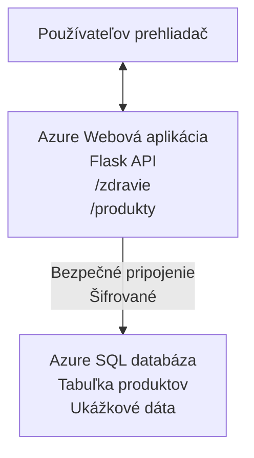

# Nasadenie databázy Microsoft SQL a webovej aplikácie pomocou AZD

⏱️ **Odhadovaný čas**: 20-30 minút | 💰 **Odhadované náklady**: ~$15-25/mesačne | ⭐ **Komplexnosť**: Stredne pokročilá

Tento **kompletný, funkčný príklad** ukazuje, ako použiť [Azure Developer CLI (azd)](https://learn.microsoft.com/azure/developer/azure-developer-cli/) na nasadenie webovej aplikácie Python Flask s databázou Microsoft SQL do Azure. Všetok kód je zahrnutý a otestovaný—nie sú potrebné žiadne externé závislosti.

## Čo sa naučíte

Úspešným dokončením tohto príkladu budete:
- Nasadzovať viacvrstvovú aplikáciu (webová aplikácia + databáza) pomocou infraštruktúry ako kódu
- Konfigurovať bezpečné pripojenie k databáze bez tvrdého kódovania tajomstiev
- Monitorovať stav aplikácie pomocou Application Insights
- Efektívne spravovať zdroje Azure pomocou AZD CLI
- Dodržiavať najlepšie postupy Azure pre bezpečnosť, optimalizáciu nákladov a pozorovateľnosť

## Prehľad scenára
- **Webová aplikácia**: Python Flask REST API s pripojením na databázu
- **Databáza**: Azure SQL Database so vzorovými dátami
- **Infraštruktúra**: Nasadzovaná pomocou Bicep (modulárne, znovupoužiteľné šablóny)
- **Nasadenie**: Plne automatizované pomocou príkazov `azd`
- **Monitorovanie**: Application Insights pre logy a telemetriu

## Predpoklady

### Vyžadované nástroje

Pred začatím si overte, že máte nainštalované tieto nástroje:

1. **[Azure CLI](https://learn.microsoft.com/cli/azure/install-azure-cli)** (verzia 2.50.0 alebo vyššia)
   ```sh
   az --version
   # Očakávaný výstup: azure-cli 2.50.0 alebo vyššia
   ```

2. **[Azure Developer CLI (azd)](https://learn.microsoft.com/azure/developer/azure-developer-cli/install-azd)** (verzia 1.0.0 alebo vyššia)
   ```sh
   azd version
   # Očakávaný výstup: azd verzia 1.0.0 alebo novšia
   ```

3. **[Python 3.8+](https://www.python.org/downloads/)** (pre lokálny vývoj)
   ```sh
   python --version
   # Očakávaný výstup: Python 3.8 alebo vyšší
   ```

4. **[Docker](https://www.docker.com/get-started)** (voliteľné, pre lokálny kontajnerizovaný vývoj)
   ```sh
   docker --version
   # Očakávaný výstup: verzia Docker 20.10 alebo vyššia
   ```

### Požiadavky Azure

- Aktívne **Azure predplatné** ([vytvorte si bezplatný účet](https://azure.microsoft.com/free/))
- Oprávnenia na vytváranie zdrojov vo vašom predplatnom
- **Vlastník** alebo **Prispievateľ** rola na predplatnom alebo skupine zdrojov

### Predchádzajúce znalosti

Toto je príklad **strednej úrovne**. Mali by ste ovládať:
- Základy príkazového riadku
- Základné koncepty cloudu (zdroje, skupiny zdrojov)
- Základné poznatky o webových aplikáciách a databázach

**Ste v AZD nováčik?** Najprv začnite na [prvom návode Getting Started](../../docs/chapter-01-foundation/azd-basics.md).

## Architektúra

Tento príklad nasadzuje dvojvrstvovú architektúru s webovou aplikáciou a SQL databázou:


**Nasadenie zdrojov:**
- **Skupina zdrojov**: Kontajner pre všetky zdroje
- **App Service plán**: Linux hosting (B1 stupeň pre nízke náklady)
- **Webová aplikácia**: Python 3.11 runtime s Flask aplikáciou
- **SQL Server**: Managed databázový server s TLS 1.2 minimálne
- **SQL Databáza**: Základný stupeň (2 GB, vhodné na vývoj/testovanie)
- **Application Insights**: Monitorovanie a logovanie
- **Log Analytics Workspace**: Centralizované ukladanie logov

**Príklad**: Predstavte si to ako reštauráciu (web app) s mrazničkou (databázou). Zákazníci si objednávajú z menu (API endpointy) a kuchyňa (Flask app) vyberá ingrediencie (údaje) z mrazničky. Manažér reštaurácie (Application Insights) sleduje všetko, čo sa deje.

## Štruktúra priečinkov

Všetky súbory sú zahrnuté v tomto príklade—nie sú potrebné žiadne externé závislosti:

```
examples/database-app/
│
├── README.md                    # This file
├── azure.yaml                   # AZD configuration file
├── .env.sample                  # Sample environment variables
├── .gitignore                   # Git ignore patterns
│
├── infra/                       # Infrastructure as Code (Bicep)
│   ├── main.bicep              # Main orchestration template
│   ├── abbreviations.json      # Azure naming conventions
│   └── resources/              # Modular resource templates
│       ├── sql-server.bicep    # SQL Server configuration
│       ├── sql-database.bicep  # Database configuration
│       ├── app-service-plan.bicep  # Hosting plan
│       ├── app-insights.bicep  # Monitoring setup
│       └── web-app.bicep       # Web application
│
└── src/
    └── web/                    # Application source code
        ├── app.py              # Flask REST API
        ├── requirements.txt    # Python dependencies
        └── Dockerfile          # Container definition
```

**Čo každý súbor robí:**
- **azure.yaml**: Oznamuje AZD, čo a kde nasadiť
- **infra/main.bicep**: Orchestruje všetky Azure zdroje
- **infra/resources/*.bicep**: Definície jednotlivých zdrojov (modulárne pre opakované použitie)
- **src/web/app.py**: Flask aplikácia s databázovou logikou
- **requirements.txt**: Python balíčkové závislosti
- **Dockerfile**: Inštrukcie na kontajnerizáciu pre nasadenie

## Rýchly štart (krok za krokom)

### Krok 1: Klonovanie a navigácia

```sh
git clone https://github.com/microsoft/AZD-for-beginners.git
cd AZD-for-beginners/examples/database-app
```

**✓ Kontrola úspechu**: Overte, že vidíte `azure.yaml` a priečinok `infra/`:
```sh
ls
# Očakávané: README.md, azure.yaml, infra/, src/
```

### Krok 2: Overenie identity v Azure

```sh
azd auth login
```

Týmto sa otvorí váš prehliadač na prihlásenie do Azure. Prihláste sa svojimi Azure povereniami.

**✓ Kontrola úspechu**: Mali by ste vidieť:
```
Logged in to Azure.
```

### Krok 3: Inicializácia prostredia

```sh
azd init
```

**Čo sa deje**: AZD vytvára lokálnu konfiguráciu pre vaše nasadenie.

**Výzvy, ktoré uvidíte**:
- **Názov prostredia**: Zadajte krátky názov (napr. `dev`, `myapp`)
- **Azure predplatné**: Vyberte svoje predplatné zo zoznamu
- **Azure lokalita**: Vyberte región (napr. `eastus`, `westeurope`)

**✓ Kontrola úspechu**: Mali by ste vidieť:
```
SUCCESS: New project initialized!
```

### Krok 4: Provisioning Azure zdrojov

```sh
azd provision
```

**Čo sa deje**: AZD nasadzuje celú infraštruktúru (trvá 5-8 minút):
1. Vytvára skupinu zdrojov
2. Vytvára SQL Server a databázu
3. Vytvára App Service plán
4. Vytvára Web App
5. Vytvára Application Insights
6. Konfiguruje sieť a bezpečnosť

**Budete vyzvaní na**:
- **SQL admin používateľské meno**: Zadajte používateľské meno (napr. `sqladmin`)
- **SQL admin heslo**: Zadajte silné heslo (uložte si ho!)

**✓ Kontrola úspechu**: Mali by ste vidieť:
```
SUCCESS: Your application was provisioned in Azure in X minutes Y seconds.
You can view the resources created under the resource group rg-<env-name> in Azure Portal:
https://portal.azure.com/#@/resource/subscriptions/.../resourceGroups/rg-<env-name>
```

**⏱️ Čas**: 5-8 minút

### Krok 5: Nasadenie aplikácie

```sh
azd deploy
```

**Čo sa deje**: AZD zostaví a nasadí vašu Flask aplikáciu:
1. Zabalí Python aplikáciu
2. Zostaví Docker kontajner
3. Nahraje ho do Azure Web App
4. Inicializuje databázu so vzorovými dátami
5. Spustí aplikáciu

**✓ Kontrola úspechu**: Mali by ste vidieť:
```
SUCCESS: Your application was deployed to Azure in X minutes Y seconds.
You can view the resources created under the resource group rg-<env-name> in Azure Portal:
https://portal.azure.com/#@/resource/subscriptions/.../resourceGroups/rg-<env-name>
```

**⏱️ Čas**: 3-5 minút

### Krok 6: Prehliadanie aplikácie

```sh
azd browse
```

Týmto sa otvorí nasadená webová aplikácia v prehliadači na adrese `https://app-<unique-id>.azurewebsites.net`

**✓ Kontrola úspechu**: Mali by ste vidieť JSON výstup:
```json
{
  "message": "Welcome to the Database App API",
  "endpoints": {
    "/": "This help message",
    "/health": "Health check endpoint",
    "/products": "List all products",
    "/products/<id>": "Get product by ID"
  }
}
```

### Krok 7: Testovanie API endpointov

**Kontrola zdravia** (overenie pripojenia k databáze):
```sh
curl https://app-<your-id>.azurewebsites.net/health
```

**Očakávaná odpoveď**:
```json
{
  "status": "healthy",
  "database": "connected"
}
```

**Zoznam produktov** (vzorkové dáta):
```sh
curl https://app-<your-id>.azurewebsites.net/products
```

**Očakávaná odpoveď**:
```json
[
  {
    "id": 1,
    "name": "Laptop",
    "description": "High-performance laptop",
    "price": 1299.99,
    "created_at": "2025-11-19T10:30:00"
  },
  ...
]
```

**Získanie jedného produktu**:
```sh
curl https://app-<your-id>.azurewebsites.net/products/1
```

**✓ Kontrola úspechu**: Všetky endpointy vracajú JSON dáta bez chýb.

---

**🎉 Gratulujeme!** Úspešne ste nasadili webovú aplikáciu s databázou do Azure pomocou AZD.

## Podrobná konfigurácia

### Premenné prostredia

Tajomstvá sú bezpečne spravované cez konfiguráciu Azure App Service—**nikdy nie sú pevne zakódované v zdrojovom kóde**.

**Automaticky nakonfigurované AZD**:
- `SQL_CONNECTION_STRING`: Reťazec pripojenia k databáze s zašifrovanými povereniami
- `APPLICATIONINSIGHTS_CONNECTION_STRING`: Endpoint pre telemetriu monitorovania
- `SCM_DO_BUILD_DURING_DEPLOYMENT`: Povolenie automatickej inštalácie závislostí

**Kde sa tajomstvá ukladajú**:
1. Pri `azd provision` zadávate SQL poverenia cez zabezpečené výzvy
2. AZD ich ukladá do lokálneho súboru `.azure/<env-name>/.env` (ignorovaný gitom)
3. AZD ich vpravuje do konfigurácie Azure App Service (šifrované v pokoji)
4. Aplikácia ich číta cez `os.getenv()` počas behu

### Lokálny vývoj

Pre lokálne testovanie vytvorte `.env` súbor z príkladu:

```sh
cp .env.sample .env
# Upravte .env s pripojením k vašej miestnej databáze
```

**Pracovný postup pre lokálny vývoj**:
```sh
# Nainštalujte závislosti
cd src/web
pip install -r requirements.txt

# Nastavte premenné prostredia
export SQL_CONNECTION_STRING="your-local-connection-string"

# Spustite aplikáciu
python app.py
```

**Testovanie lokálne**:
```sh
curl http://localhost:8000/health
# Očakávané: {"status": "zdravý", "database": "pripojené"}
```

### Infrastruktúra ako kód

Všetky Azure zdroje sú definované v **Bicep šablónach** (priečinok `infra/`):

- **Modulárny dizajn**: Každý typ zdroja má vlastný súbor pre opakované použitie
- **Parametrizácia**: Možnosti prispôsobenia SKU, regiónov, názvov
- **Najlepšie postupy**: Dodržiava Azure naming konvencie a bezpečnostné štandardy
- **Verzovanie**: Zmeny infraštruktúry sú spravované v Gite

**Príklad prispôsobenia**:
Ak chcete zmeniť úroveň databázy, upravte `infra/resources/sql-database.bicep`:
```bicep
sku: {
  name: 'Standard'  // Changed from 'Basic'
  tier: 'Standard'
  capacity: 10
}
```

## Najlepšie bezpečnostné postupy

Tento príklad dodržiava najlepšie bezpečnostné postupy Azure:

### 1. **Žiadne tajomstvá v kóde zdroja**
- ✅ Poverenia uložené v konfigurácii Azure App Service (šifrované)
- ✅ `.env` súbory vylúčené v `.gitignore`
- ✅ Tajomstvá odovzdávané cez zabezpečené parametre pri provisioningu

### 2. **Šifrované spojenia**
- ✅ TLS 1.2 minimálne pre SQL Server
- ✅ Povinné HTTPS pre Web App
- ✅ Databázové spojenia cez šifrované kanály

### 3. **Sieťová bezpečnosť**
- ✅ SQL Server firewall nastavený len pre služby Azure
- ✅ Verejný prístup obmedzený (možnosť zablokovať cez Private Endpoints)
- ✅ FTPS vypnuté na Web App

### 4. **Autentifikácia a autorizácia**
- ⚠️ **Súčasné**: SQL autentifikácia (používateľ/heslo)
- ✅ **Odporúčanie pre produkciu**: Použiť Azure Managed Identity pre autentifikáciu bez hesla

**Ako prejsť na Managed Identity** (pre produkciu):
1. Povoliť managed identity na Web App
2. Udeliť SQL oprávnenia identite
3. Aktualizovať connection string na managed identity
4. Odstrániť autentifikáciu pomocou hesla

### 5. **Audit a súlad**
- ✅ Application Insights loguje všetky požiadavky a chyby
- ✅ SQL Database auditovanie povolené (konfigurovateľné pre súlad)
- ✅ Všetky zdroje označené tagmi pre správu

**Kontrolný zoznam bezpečnosti pred produkciou**:
- [ ] Povoliť Azure Defender pre SQL
- [ ] Konfigurovať Private Endpoints pre SQL Database
- [ ] Zapnúť Web Application Firewall (WAF)
- [ ] Implementovať Azure Key Vault pre rotáciu tajomstiev
- [ ] Konfigurovať Azure AD autentifikáciu
- [ ] Zapnúť diagnostické logovanie pre všetky zdroje

## Optimalizácia nákladov

**Odhadované mesačné náklady** (k novemberu 2025):

| Zdroj | SKU/Stupeň | Odhadované náklady |
|----------|----------|----------------|
| App Service plán | B1 (Základný) | ~$13/mesiac |
| SQL Databáza | Základný (2GB) | ~$5/mesiac |
| Application Insights | Platba za použitie | ~$2/mesiac (nízka prevádzka) |
| **Celkom** | | **~$20/mesiac** |

**💡 Tipy na úsporu nákladov**:

1. **Použite bezplatný stupeň na učenie**:
   - App Service: F1 stupeň (zadarmo, limitované hodiny)
   - SQL Databáza: Použite Azure SQL Database serverless
   - Application Insights: 5GB/mesiac bezplatný príjem dát

2. **Vypínajte zdroje, keď ich nepoužívate**:
   ```sh
   # Zastavte webovú aplikáciu (databáza sa stále účtuje)
   az webapp stop --name <app-name> --resource-group <rg-name>
   
   # Reštartujte podľa potreby
   az webapp start --name <app-name> --resource-group <rg-name>
   ```

3. **Vymažte všetko po testovaní**:
   ```sh
   azd down
   ```
   Tým sa odstránia VŠETKY zdroje a zastavia poplatky.

4. **Vývojové vs produkčné SKU**:
   - **Vývoj**: Základný stupeň (použité v tomto príklade)
   - **Produkcia**: Štandardný/Premium stupeň s redundanciou

**Monitorovanie nákladov**:
- Sledujte náklady v [Azure Cost Management](https://portal.azure.com/#view/Microsoft_Azure_CostManagement)
- Nastavte upozornenia na náklady, aby ste predišli prekvapeniam
- Označte všetky zdroje tagom `azd-env-name` pre sledovanie

**Alternatíva bezplatného stupňa**:
Pre školské účely môžete upraviť `infra/resources/app-service-plan.bicep`:
```bicep
sku: {
  name: 'F1'  // Free tier
  tier: 'Free'
}
```
**Poznámka**: Bezplatný stupeň má obmedzenia (60 minút CPU denne, bez always-on).

## Monitorovanie a pozorovateľnosť

### Integrácia Application Insights

Tento príklad obsahuje **Application Insights** pre komplexné monitorovanie:

**Čo sa monitoruje**:
- ✅ HTTP požiadavky (latencia, stavové kódy, endpointy)
- ✅ Chyby aplikácie a výnimky
- ✅ Vlastné logovanie z Flask aplikácie
- ✅ Stav pripojenia na databázu
- ✅ Výkonové metriky (CPU, pamäť)

**Prístup k Application Insights**:
1. Otvorte [Azure Portal](https://portal.azure.com)
2. Prejdite do skupiny zdrojov (`rg-<env-name>`)
3. Kliknite na zdroj Application Insights (`appi-<unique-id>`)

**Užitočné dotazy** (Application Insights → Logy):

**Zobraziť všetky požiadavky**:
```kusto
requests
| where timestamp > ago(1h)
| order by timestamp desc
| project timestamp, name, url, resultCode, duration
```

**Vyhľadať chyby**:
```kusto
exceptions
| where timestamp > ago(24h)
| order by timestamp desc
| project timestamp, type, outerMessage, operation_Name
```

**Skontrolovať health endpoint**:
```kusto
requests
| where name contains "health"
| summarize count() by resultCode, bin(timestamp, 1h)
```

### Auditovanie SQL databázy

**Auditovanie SQL databázy je povolené** na sledovanie:
- Vzory prístupu k databáze
- Neúspešné pokusy o prihlásenie
- Zmeny schémy
- Prístup k dátam (pre súlad so štandardmi)

**Prístup k audit logom**:
1. Azure Portal → SQL Databáza → Auditovanie
2. Prezrieť logy v Log Analytics workspace

### Monitorovanie v reálnom čase

**Zobraziť živé metriky**:
1. Application Insights → Live Metrics
2. Vidieť požiadavky, zlyhania a výkon v reálnom čase

**Nastaviť upozornenia**:
Vytvorte upozornenia pre kritické udalosti:
- HTTP 500 chyby > 5 za 5 minút
- Zlyhania pripojenia k databáze
- Vysoké odozvy (>2 sekundy)

**Príklad vytvorenia upozornenia**:
```sh
az monitor metrics alert create \
  --name "High-Response-Time" \
  --resource-group <rg-name> \
  --scopes <app-insights-resource-id> \
  --condition "avg requests/duration > 2000" \
  --description "Alert when response time exceeds 2 seconds"
```

## Riešenie problémov
### Bežné problémy a riešenia

#### 1. `azd provision` zlyhá s hláškou "Location not available"

**Príznak**:
```
Error: The subscription is not registered for the resource type 'components' in the location 'centralus'.
```

**Riešenie**:
Vyberte iný Azure región alebo zaregistrujte poskytovateľa zdrojov:
```sh
az provider register --namespace Microsoft.Insights
```

#### 2. Pripojenie k SQL zlyháva počas nasadenia

**Príznak**:
```
pyodbc.OperationalError: ('08001', '[08001] [Microsoft][ODBC Driver 18 for SQL Server]TCP Provider...')
```

**Riešenie**:
- Overte, či firewall SQL Servera povoľuje služby Azure (automaticky nakonfigurované)
- Skontrolujte, či ste správne zadali SQL admin heslo počas `azd provision`
- Uistite sa, že SQL Server je plne provisionovaný (môže trvať 2-3 minúty)

**Overenie pripojenia**:
```sh
# V Azure portáli prejdite na SQL databázu → Editor dopytov
# Skúste sa pripojiť so svojimi prihlasovacími údajmi
```

#### 3. Webová aplikácia zobrazuje "Application Error"

**Príznak**:
Prehliadač zobrazuje všeobecnú chybovú stránku.

**Riešenie**:
Skontrolujte logy aplikácie:
```sh
# Zobraziť nedávne záznamy
az webapp log tail --name <app-name> --resource-group <rg-name>
```

**Bežné príčiny**:
- Chýbajúce premenné prostredia (skontrolujte App Service → Configuration)
- Neúspešná inštalácia Python balíčkov (skontrolujte deploy logy)
- Chyba inicializácie databázy (skontrolujte SQL konektivitu)

#### 4. `azd deploy` zlyhá s "Build Error"

**Príznak**:
```
Error: Failed to build project
```

**Riešenie**:
- Uistite sa, že súbor `requirements.txt` nemá syntaktické chyby
- Skontrolujte, či je v `infra/resources/web-app.bicep` uvedený Python 3.11
- Overte, že Dockerfile má správny základný image

**Lokalné ladenie**:
```sh
cd src/web
docker build -t test-app .
docker run -p 8000:8000 test-app
```

#### 5. "Unauthorized" pri spúšťaní príkazov AZD

**Príznak**:
```
ERROR: (Unauthorized) The client '<id>' with object id '<id>' does not have authorization
```

**Riešenie**:
Znovu sa prihláste do Azure:
```sh
# Vyžadované pre pracovné postupy AZD
azd auth login

# Nepovinné, ak priamo používate príkazy Azure CLI
az login
```

Overte, či máte správne oprávnenia (rola Contributor) ku subscription.

#### 6. Vysoké náklady na databázu

**Príznak**:
Neočakávaný Azure účet.

**Riešenie**:
- Skontrolujte, či ste nezabudli spustiť `azd down` po testovaní
- Overte, či SQL databáza používa základnú úroveň (Basic), nie Premium
- Prezrite si náklady v Azure Cost Management
- Nastavte si upozornenia na náklady

### Ako získať pomoc

**Zobraziť všetky AZD premenné prostredia**:
```sh
azd env get-values
```

**Skontrolovať stav nasadenia**:
```sh
az webapp show --name <app-name> --resource-group <rg-name> --query state
```

**Prístup k logom aplikácie**:
```sh
az webapp log download --name <app-name> --resource-group <rg-name> --log-file app-logs.zip
```

**Potrebujete viac pomoci?**
- [AZD Sprievodca riešením problémov](../../docs/chapter-07-troubleshooting/common-issues.md)
- [Riešenie problémov Azure App Service](https://learn.microsoft.com/azure/app-service/troubleshoot-diagnostic-logs)
- [Riešenie problémov Azure SQL](https://learn.microsoft.com/azure/azure-sql/database/troubleshoot-common-errors-issues)

## Praktické cvičenia

### Cvičenie 1: Overte svoje nasadenie (Začiatočník)

**Cieľ**: Potvrdiť, že všetky zdroje sú nasadené a aplikácia funguje.

**Kroky**:
1. Vypíšte všetky zdroje v resource groupe:
   ```sh
   az resource list --resource-group rg-<env-name> --output table
   ```
   **Očakávané**: 6-7 zdrojov (Web App, SQL Server, SQL Database, App Service Plan, Application Insights, Log Analytics)

2. Otestujte všetky API endpointy:
   ```sh
   curl https://app-<your-id>.azurewebsites.net/
   curl https://app-<your-id>.azurewebsites.net/health
   curl https://app-<your-id>.azurewebsites.net/products
   curl https://app-<your-id>.azurewebsites.net/products/1
   ```
   **Očakávané**: Všetky vracajú platný JSON bez chýb

3. Skontrolujte Application Insights:
   - Prejdite do Application Insights v Azure Portáli
   - Choďte na "Live Metrics"
   - Obnovte stránku webovej aplikácie v prehliadači
   **Očakávané**: Vidno požiadavky v reálnom čase

**Kritériá úspechu**: Všetkých 6-7 zdrojov existuje, všetky endpointy vracajú dáta, Live Metrics zobrazuje prehľad aktivít.

---

### Cvičenie 2: Pridať nový API endpoint (Pokročilý začiatočník)

**Cieľ**: Rozšíriť Flask aplikáciu o nový endpoint.

**Štartovací kód**: Aktuálne endpointy v `src/web/app.py`

**Kroky**:
1. Upravte `src/web/app.py` a pridajte nový endpoint po funkcii `get_product()`:
   ```python
   @app.route('/products/search/<keyword>')
   def search_products(keyword):
       """Search products by name or description."""
       try:
           conn = get_db_connection()
           cursor = conn.cursor()
           cursor.execute(
               "SELECT id, name, description, price, created_at FROM products WHERE name LIKE ? OR description LIKE ?",
               (f'%{keyword}%', f'%{keyword}%')
           )
           
           products = []
           for row in cursor.fetchall():
               products.append({
                   'id': row[0],
                   'name': row[1],
                   'description': row[2],
                   'price': float(row[3]) if row[3] else None,
                   'created_at': row[4].isoformat() if row[4] else None
               })
           
           cursor.close()
           conn.close()
           
           logger.info(f"Search for '{keyword}' returned {len(products)} results")
           return jsonify(products), 200
           
       except Exception as e:
           logger.error(f"Error searching products: {str(e)}")
           return jsonify({'error': str(e)}), 500
   ```

2. Nasadte aktualizovanú aplikáciu:
   ```sh
   azd deploy
   ```

3. Otestujte nový endpoint:
   ```sh
   curl https://app-<your-id>.azurewebsites.net/products/search/laptop
   ```
   **Očakávané**: Vracia produkty filtrované podľa "laptop"

**Kritériá úspechu**: Nový endpoint funguje, vracia filtrované výsledky, zobrazuje sa v logoch Application Insights.

---

### Cvičenie 3: Pridať monitoring a upozornenia (Pokročilý)

**Cieľ**: Nastaviť proaktívny monitoring s upozorneniami.

**Kroky**:
1. Vytvorte upozornenie na HTTP 500 chyby:
   ```sh
   # Získajte ID zdroja Application Insights
   AI_ID=$(az monitor app-insights component show \
     --app appi-<your-id> \
     --resource-group rg-<env-name> \
     --query id -o tsv)
   
   # Vytvorte upozornenie
   az monitor metrics alert create \
     --name "High-Error-Rate" \
     --resource-group rg-<env-name> \
     --scopes $AI_ID \
     --condition "count requests/failed > 5" \
     --window-size 5m \
     --evaluation-frequency 1m \
     --description "Alert when >5 failed requests in 5 minutes"
   ```

2. Spustite chyby na vyvolanie upozornenia:
   ```sh
   # Požiadať o neexistujúci produkt
   for i in {1..10}; do curl https://app-<your-id>.azurewebsites.net/products/999; done
   ```

3. Skontrolujte, či sa upozornenie spustilo:
   - Azure Portal → Upozornenia → Pravidlá upozornení
   - Skontrolujte svoj e-mail (ak je nastavený)

**Kritériá úspechu**: Upozorňovacie pravidlo je vytvorené, spustí sa pri chybách, prijímajú sa notifikácie.

---

### Cvičenie 4: Zmeny v databázovej schéme (Pokročilý)

**Cieľ**: Pridať novú tabuľku a upraviť aplikáciu na jej využívanie.

**Kroky**:
1. Pripojte sa k SQL databáze cez Azure Portal Query Editor

2. Vytvorte novú tabuľku `categories`:
   ```sql
   CREATE TABLE categories (
       id INT PRIMARY KEY IDENTITY(1,1),
       name NVARCHAR(50) NOT NULL,
       description NVARCHAR(200)
   );
   
   INSERT INTO categories (name, description) VALUES
   ('Electronics', 'Electronic devices and accessories'),
   ('Office Supplies', 'Office equipment and supplies');
   
   -- Add category to products table
   ALTER TABLE products ADD category_id INT;
   UPDATE products SET category_id = 1; -- Set all to Electronics
   ```

3. Aktualizujte `src/web/app.py` tak, aby odpovede obsahovali informácie o kategórii

4. Nasadte a otestujte

**Kritériá úspechu**: Nová tabuľka existuje, produkty zobrazujú informácie o kategórii, aplikácia funguje.

---

### Cvičenie 5: Implementovať caching (Expert)

**Cieľ**: Pridať Azure Redis Cache na zlepšenie výkonu.

**Kroky**:
1. Pridajte Redis Cache do `infra/main.bicep`
2. Upravte `src/web/app.py`, aby cachoval dotazy na produkty
3. Zmerajte zlepšenie výkonu pomocou Application Insights
4. Porovnajte časy odpovedí pred a po cachovaní

**Kritériá úspechu**: Redis je nasadený, caching funguje, doba odozvy sa zlepšila o >50%.

**Tip**: Začnite s [dokumentáciou Azure Cache for Redis](https://learn.microsoft.com/azure/azure-cache-for-redis/).

---

## Vyčistenie

Aby ste sa vyhli trvalým poplatkom, vymažte všetky zdroje po skončení:

```sh
azd down
```

**Potvrdenie**:
```
? Total resources to delete: 7, are you sure you want to continue? (y/N)
```

Zadajte `y` na potvrdenie.

**✓ Overenie úspechu**:
- Všetky zdroje sú vymazané z Azure Portálu
- Žiadne bežiace poplatky
- Lokálna zložka `.azure/<env-name>` môže byť zmazaná

**Alternatíva** (ponechať infraštruktúru, vymazať dáta):
```sh
# Odstrániť iba skupinu zdrojov (zachovať konfiguráciu AZD)
az group delete --name rg-<env-name> --yes
```
## Ďalšie informácie

### Súvisiaca dokumentácia
- [Dokumentácia Azure Developer CLI](https://learn.microsoft.com/azure/developer/azure-developer-cli/)
- [Dokumentácia Azure SQL Database](https://learn.microsoft.com/azure/azure-sql/database/)
- [Dokumentácia Azure App Service](https://learn.microsoft.com/azure/app-service/)
- [Dokumentácia Application Insights](https://learn.microsoft.com/azure/azure-monitor/app/app-insights-overview)
- [Referenčný materiál k jazyku Bicep](https://learn.microsoft.com/azure/azure-resource-manager/bicep/)

### Ďalšie kroky v kurze
- **[Príklad Container Apps](../../../../examples/container-app)**: Nasadenie mikroslužieb s Azure Container Apps
- **[Sprievodca integráciou AI](../../../../docs/ai-foundry)**: Pridanie AI funkcií do aplikácie
- **[Zdokonalené postupy nasadenia](../../docs/chapter-04-infrastructure/deployment-guide.md)**: Vzory nasadenia do produkcie

### Pokročilé témy
- **Managed Identity**: Odstránenie hesiel a použitie autentifikácie Azure AD
- **Private Endpoints**: Zabezpečenie databázových pripojení vo vnútri virtuálnej siete
- **CI/CD integrácia**: Automatizácia nasadení s GitHub Actions alebo Azure DevOps
- **Multi-Environment**: Nastavenie vývojových, testovacích a produkčných prostredí
- **Migrácie databázy**: Použitie Alembic alebo Entity Framework na verziovanie schémy

### Porovnanie s inými prístupmi

**AZD vs. ARM Templates**:
- ✅ AZD: Vyššia úroveň abstrakcie, jednoduchšie príkazy
- ⚠️ ARM: Podrobnejší, granulárna kontrola

**AZD vs. Terraform**:
- ✅ AZD: Nativné pre Azure, integrované so službami Azure
- ⚠️ Terraform: Podpora multi-cloud, väčší ekosystém

**AZD vs. Azure Portal**:
- ✅ AZD: Opakovateľné, verzované, automatizovateľné
- ⚠️ Portal: Manuálne kliknutia, ťažko reprodukovateľné

**Myslite na AZD ako na**: Docker Compose pre Azure – zjednodušená konfigurácia pre komplexné nasadenia.

---

## Najčastejšie otázky

**Otázka: Môžem použiť iný programovací jazyk?**  
Áno! Nahraďte `src/web/` Node.js, C#, Go alebo iným jazykom. Aktualizujte `azure.yaml` a Bicep podľa potreby.

**Otázka: Ako pridať viac databáz?**  
Pridajte ďalší modul SQL Database do `infra/main.bicep` alebo použite PostgreSQL/MySQL zo služieb Azure Database.

**Otázka: Môžem toto použiť v produkcii?**  
Toto je štartovací bod. Pre produkciu pridajte: managed identity, private endpoints, redundanciu, zálohovaciu stratégiu, WAF a vylepšený monitoring.

**Otázka: Čo ak chcem použiť namiesto nasadzovania kódu kontajnery?**  
Pozrite si [Príklad Container Apps](../../../../examples/container-app), ktorý používa Docker kontajnery na všetkých úrovniach.

**Otázka: Ako sa pripojím k databáze z lokálneho počítača?**  
Pridajte svoju IP adresu do firewallu SQL Servera:
```sh
az sql server firewall-rule create \
  --resource-group rg-<env-name> \
  --server sql-<unique-id> \
  --name AllowMyIP \
  --start-ip-address <your-ip> \
  --end-ip-address <your-ip>
```

**Otázka: Môžem použiť existujúcu databázu namiesto vytvárania novej?**  
Áno, upravte `infra/main.bicep`, aby odkazoval na existujúci SQL Server a aktualizujte parametre pripojenia.

---

> **Poznámka:** Tento príklad demonštruje najlepšie praktiky pre nasadenie webovej aplikácie s databázou pomocou AZD. Obsahuje funkčný kód, detailnú dokumentáciu a praktické cvičenia na posilnenie znalostí. Pre produkčné nasadenia zvážte bezpečnosť, škálovanie, súlad a špecifické požiadavky vašej organizácie.

**📚 Navigácia v kurze:**
- ← Predchádzajúce: [Príklad Container Apps](../../../../examples/container-app)
- → Ďalšie: [Sprievodca integráciou AI](../../../../docs/ai-foundry)
- 🏠 [Domovská stránka kurzu](../../README.md)

---

<!-- CO-OP TRANSLATOR DISCLAIMER START -->
**Vyhlásenie**:
Tento dokument bol preložený pomocou AI prekladateľskej služby [Co-op Translator](https://github.com/Azure/co-op-translator). Hoci sa snažíme o presnosť, berte prosím na vedomie, že automatické preklady môžu obsahovať chyby alebo nepresnosti. Originálny dokument v jeho pôvodnom jazyku by mal byť považovaný za autoritatívny zdroj. Pre kritické informácie sa odporúča profesionálny ľudský preklad. Nie sme zodpovední za akékoľvek nedorozumenia alebo nesprávne interpretácie vyplývajúce z použitia tohto prekladu.
<!-- CO-OP TRANSLATOR DISCLAIMER END -->